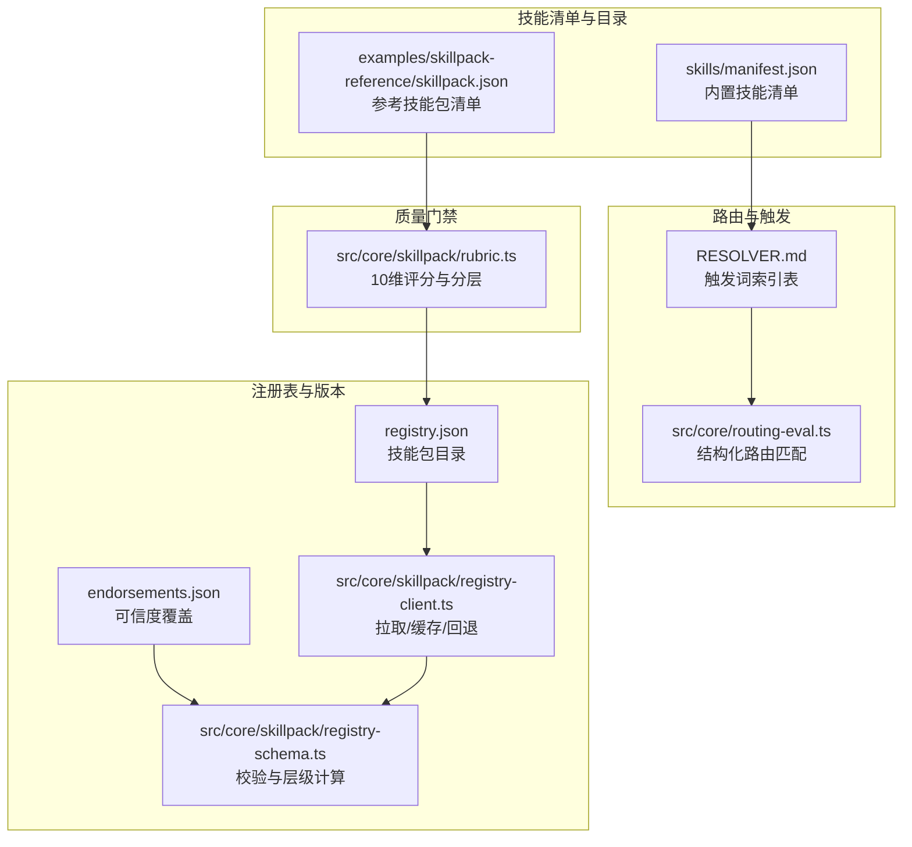
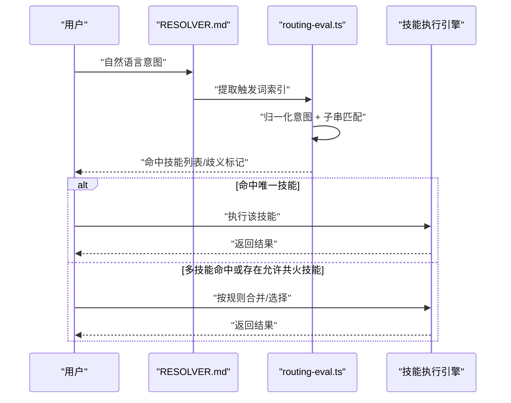
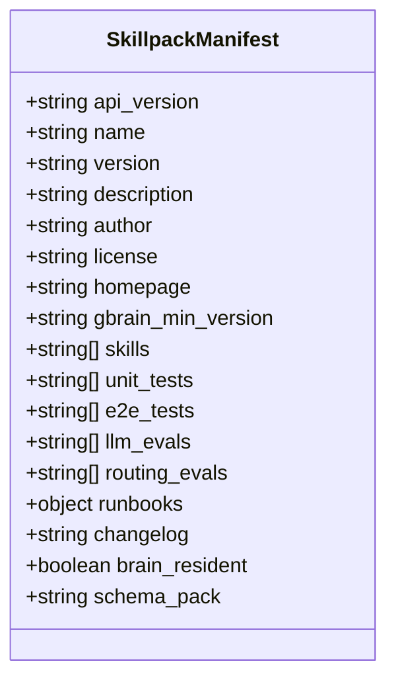
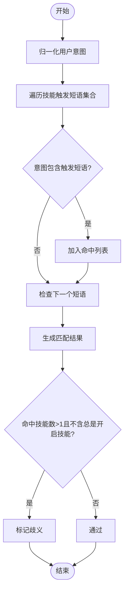
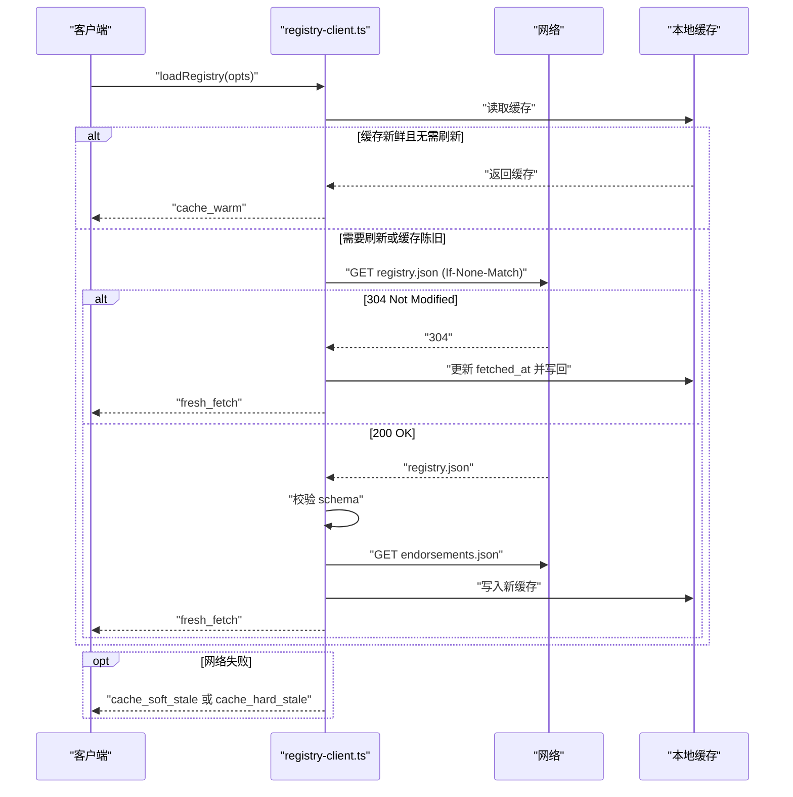
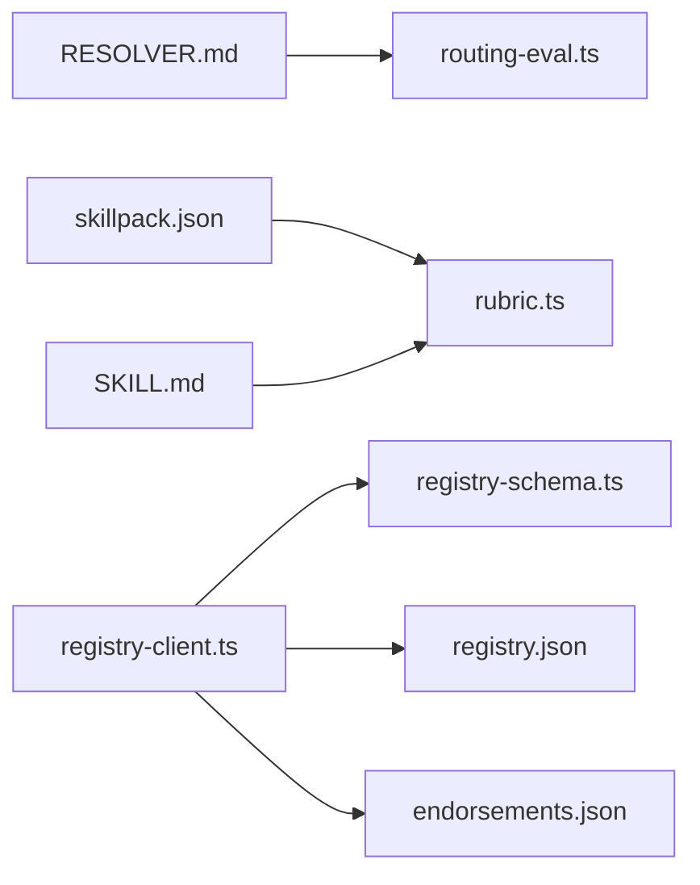

# 技能架构设计

<cite>
**本文引用的文件**
- [skills/manifest.json](file://skills/manifest.json)
- [docs/skillpack-anatomy.md](file://docs/skillpack-anatomy.md)
- [docs/GBRAIN_SKILLPACK.md](file://docs/GBRAIN_SKILLPACK.md)
- [src/core/skillpack/manifest-v1.ts](file://src/core/skillpack/manifest-v1.ts)
- [src/core/skillpack/rubric.ts](file://src/core/skillpack/rubric.ts)
- [src/core/routing-eval.ts](file://src/core/routing-eval.ts)
- [src/core/skillpack/registry-client.ts](file://src/core/skillpack/registry-client.ts)
- [src/core/skillpack/registry-schema.ts](file://src/core/skillpack/registry-schema.ts)
- [test/routing-eval.test.ts](file://test/routing-eval.test.ts)
- [test/skill-catalog.test.ts](file://test/skill-catalog.test.ts)
- [test/skillpack-registry-client.test.ts](file://test/skillpack-registry-client.test.ts)
- [examples/skillpack-reference/skillpack.json](file://examples/skillpack-reference/skillpack.json)
</cite>

## 目录
1. [简介](#简介)
2. [项目结构](#项目结构)
3. [核心组件](#核心组件)
4. [架构总览](#架构总览)
5. [详细组件分析](#详细组件分析)
6. [依赖关系分析](#依赖关系分析)
7. [性能考量](#性能考量)
8. [故障排查指南](#故障排查指南)
9. [结论](#结论)
10. [附录](#附录)

## 简介
本文件系统性阐述 GBrain 技能架构的设计与实现，覆盖技能注册机制、触发索引与路由解析、技能清单（SkillManifest）结构与职责、技能触发器工作原理、技能目录系统、元数据与版本控制、技能间依赖与执行顺序、生命周期管理、缓存策略与性能优化，并通过架构图与组件交互示例帮助读者快速掌握从“意图到动作”的完整链路。

## 项目结构
GBrain 将技能以“技能包（Skillpack）”为单位组织，每个技能包包含若干技能目录（skills/*/），每个技能由其目录下的 SKILL.md 定义触发词与行为说明；同时通过 RESOLVER.md 建立“触发词 → 技能”的结构化索引表，用于运行时路由匹配。核心能力由以下模块支撑：
- 技能清单与目录：skills/manifest.json 提供内置技能清单；技能包根目录 skillpack.json 描述第三方技能包元数据与测试/评估配置。
- 路由评估：基于 RESOLVER.md 的触发词索引与意图归一化进行结构化匹配，支持歧义检测与修复建议。
- 注册表与版本：官方技能包注册表（registry.json/endorsements.json）提供发现、筛选与可信度分级，带缓存与离线容错。
- 质量门禁：rubric 维护 10 维质量维度（核心5 + 品牌5），驱动发布与分层。

**图表来源**
- [skills/manifest.json:1-281](file://skills/manifest.json#L1-L281)
- [examples/skillpack-reference/skillpack.json:1-30](file://examples/skillpack-reference/skillpack.json#L1-L30)
- [src/core/routing-eval.ts:1-397](file://src/core/routing-eval.ts#L1-L397)
- [src/core/skillpack/registry-client.ts:1-366](file://src/core/skillpack/registry-client.ts#L1-L366)
- [src/core/skillpack/registry-schema.ts:1-347](file://src/core/skillpack/registry-schema.ts#L1-L347)
- [src/core/skillpack/rubric.ts:1-512](file://src/core/skillpack/rubric.ts#L1-L512)

**章节来源**
- [skills/manifest.json:1-281](file://skills/manifest.json#L1-L281)
- [docs/skillpack-anatomy.md:1-113](file://docs/skillpack-anatomy.md#L1-L113)
- [docs/GBRAIN_SKILLPACK.md:1-144](file://docs/GBRAIN_SKILLPACK.md#L1-L144)
- [examples/skillpack-reference/skillpack.json:1-30](file://examples/skillpack-reference/skillpack.json#L1-L30)

## 核心组件
- 技能清单（SkillManifest）
  - 内置清单：位于 skills/manifest.json，描述内置技能名称、路径与描述，作为默认可用技能集合。
  - 第三方清单：位于技能包根目录 skillpack.json，定义技能包元信息、最小版本、技能列表、测试/评估/运行手册等。
- 触发索引与路由解析
  - RESOLVER.md 中的表格记录各技能的触发词，经解析后构建“技能 → 触发短语集合”的索引。
  - 结构化匹配：对用户意图进行归一化处理，检查是否包含任一技能触发短语；支持歧义检测与“总是开启技能”豁免。
- 注册表与版本控制
  - registry.json 列出所有已收录技能包，包含来源、哈希、最低版本、标签、验证时间等；endorsements.json 提供可信度覆盖。
  - registry-client 实现网络拉取、ETag 条件请求、本地缓存与离线回退，保障可用性与一致性。
- 元数据与版本
  - skillpack.json 支持 runbook_schema_version、eval_schema_version 等前向兼容字段，确保不同版本的运行手册与评估格式可被正确识别。
  - rubric 对清单、触发词、路由评估、变更日志、测试与评测等维度进行评分，决定技能包的分层（endorsed/community/experimental/blocked）。

**章节来源**
- [skills/manifest.json:1-281](file://skills/manifest.json#L1-L281)
- [src/core/skillpack/manifest-v1.ts:1-391](file://src/core/skillpack/manifest-v1.ts#L1-L391)
- [src/core/routing-eval.ts:1-397](file://src/core/routing-eval.ts#L1-L397)
- [src/core/skillpack/registry-client.ts:1-366](file://src/core/skillpack/registry-client.ts#L1-L366)
- [src/core/skillpack/registry-schema.ts:1-347](file://src/core/skillpack/registry-schema.ts#L1-L347)
- [src/core/skillpack/rubric.ts:1-512](file://src/core/skillpack/rubric.ts#L1-L512)

## 架构总览
下图展示从“意图输入”到“技能执行”的端到端流程：用户输入 → RESOLVER 触发索引 → 结构化匹配 → 可选歧义判定 → 执行对应技能（SKILL.md 指令体）。

**图表来源**
- [src/core/routing-eval.ts:166-183](file://src/core/routing-eval.ts#L166-L183)

**章节来源**
- [src/core/routing-eval.ts:1-397](file://src/core/routing-eval.ts#L1-L397)

## 详细组件分析

### 技能清单（SkillManifest）与目录系统
- 内置清单（skills/manifest.json）
  - 包含技能数组，每项包含 name、path、description；path 指向 SKILL.md。
  - 同时声明 setup、resolver、recipes_dir、conventions_dir、templates_dir 等全局元数据。
- 第三方技能包清单（skillpack.json）
  - 必填字段：api_version、name、version、description、author、license、homepage、gbrain_min_version、skills。
  - 可选字段：shared_deps、excluded_from_install、unit_tests、e2e_tests、llm_evals、routing_evals、runbooks.bootstrap、changelog、brain_resident、schema_pack。
  - 前向兼容：runbook_schema_version、eval_schema_version 控制运行手册与评估格式版本上限。
- 示例参考
  - examples/skillpack-reference/skillpack.json 展示了最小可用清单形态，便于第三方快速搭建。

**图表来源**
- [src/core/skillpack/manifest-v1.ts:34-96](file://src/core/skillpack/manifest-v1.ts#L34-L96)
- [examples/skillpack-reference/skillpack.json:1-30](file://examples/skillpack-reference/skillpack.json#L1-L30)

**章节来源**
- [skills/manifest.json:1-281](file://skills/manifest.json#L1-L281)
- [src/core/skillpack/manifest-v1.ts:1-391](file://src/core/skillpack/manifest-v1.ts#L1-L391)
- [examples/skillpack-reference/skillpack.json:1-30](file://examples/skillpack-reference/skillpack.json#L1-L30)

### 触发索引与路由解析
- 触发词提取
  - 从 RESOLVER.md 表格单元中提取双引号包裹的短语，或整段文本作为候选；统一归一化（小写、非字母数字替换为空格、去空白）。
- 结构化匹配
  - 对用户意图进行同样归一化，若意图包含某技能的任一触发短语，则计入命中；排除“总是开启技能”（如 signal-detector、brain-ops、ingest）参与歧义判断。
- 歧义与负样本
  - 若多个特定技能命中，视为歧义；可通过 ambiguous_with 显式豁免。
  - 负样本（expected_skill=null）要求无任何特定技能命中。
- 路由评估（routing-eval）
  - 支持 JSONL 形式的路由评估用例（intent、expected_skill、ambiguous_with），并提供 lint 规则防止“复制触发词”的套话陷阱。

**图表来源**
- [src/core/routing-eval.ts:166-183](file://src/core/routing-eval.ts#L166-L183)

**章节来源**
- [src/core/routing-eval.ts:1-397](file://src/core/routing-eval.ts#L1-L397)
- [test/routing-eval.test.ts:1-307](file://test/routing-eval.test.ts#L1-L307)

### 注册表与版本控制
- 注册表结构
  - registry.json：schema_version、updated_at、skillpacks 数组、可选 bundles。
  - registry.json 中的条目包含 name、description、author、author_handle、homepage、source（kind/url/pinned_commit）、tarball_sha256、gbrain_min_version、default_tier、tags、validated_at、validation_run_id、skills_count、skills、version。
  - endorsements.json：对某些包的 default_tier 进行覆盖，形成 effectiveTier。
- 客户端行为
  - 默认使用 GitHub 仓库地址；支持配置覆盖；优先软缓存（1小时），网络失败时回退至缓存；超过7天发出“陈旧缓存”警告。
  - 使用 ETag 实现条件请求，未变更时直接复用缓存。
- 查询与排序
  - 支持按关键词与层级过滤；按 tier 降序、name 升序排序。

**图表来源**
- [src/core/skillpack/registry-client.ts:179-312](file://src/core/skillpack/registry-client.ts#L179-L312)
- [src/core/skillpack/registry-schema.ts:115-163](file://src/core/skillpack/registry-schema.ts#L115-L163)

**章节来源**
- [src/core/skillpack/registry-client.ts:1-366](file://src/core/skillpack/registry-client.ts#L1-L366)
- [src/core/skillpack/registry-schema.ts:1-347](file://src/core/skillpack/registry-schema.ts#L1-L347)
- [test/skillpack-registry-client.test.ts:1-45](file://test/skillpack-registry-client.test.ts#L1-L45)

### 元数据管理与版本控制
- 前向兼容
  - runbook_schema_version、eval_schema_version 限制最大支持版本，避免过新格式导致解析失败。
- 版本约束
  - gbrain_min_version 保证技能包在指定版本以上运行；homepage 必须为 http(s) URL。
- 变更日志
  - changelog 字段指向 CHANGELOG.md，需包含当前版本条目；rubric 会检查是否存在对应版本条目。

**章节来源**
- [src/core/skillpack/manifest-v1.ts:139-331](file://src/core/skillpack/manifest-v1.ts#L139-L331)
- [src/core/skillpack/rubric.ts:206-233](file://src/core/skillpack/rubric.ts#L206-L233)

### 技能间依赖与执行顺序
- 依赖模型
  - 触发词层面：通过 RESOLVER.md 的表格建立“触发词 → 技能”的映射；同一意图可能命中多个技能，但“总是开启技能”可豁免歧义。
  - 数据与工具层面：技能清单（skills/manifest.json）提供内置技能集合；rubric 与路由评估确保触发词 MECE 与覆盖度。
- 执行顺序
  - 结构化匹配阶段不改变技能顺序；最终执行由上层调度器根据命中集与业务规则决定（例如总是开启技能可前置）。
- 质量保障
  - rubric 的“skills_have_unique_triggers”确保触发词 MECE，降低误触发风险；路由评估用例（routing-eval.jsonl）持续验证意图到技能的映射质量。

**章节来源**
- [src/core/routing-eval.ts:162-183](file://src/core/routing-eval.ts#L162-L183)
- [src/core/skillpack/rubric.ts:170-205](file://src/core/skillpack/rubric.ts#L170-L205)

### 生命周期管理、缓存策略与性能优化
- 生命周期
  - 发现：扫描 skills/*/SKILL.md 与 RESOLVER.md，构建触发索引。
  - 验证：rubric 对清单、触发词、路由评估、测试/评测、变更日志等维度打分。
  - 发布：通过发布门禁后进入注册表，按 endorsements.json 更新有效层级。
- 缓存策略
  - registry-client 使用 ETag + 软缓存（1小时）+ 硬缓存（7天陈旧告警）；网络失败时回退缓存，首次安装必须联网。
- 性能优化
  - 结构化匹配仅做子串包含检查，复杂度与触发短语数量线性相关；归一化减少标点差异带来的误判。
  - 注册表拉取采用条件请求，未变更时零网络开销；缓存原子写入避免竞态。

**章节来源**
- [src/core/skillpack/registry-client.ts:44-47](file://src/core/skillpack/registry-client.ts#L44-L47)
- [src/core/skillpack/registry-client.ts:200-207](file://src/core/skillpack/registry-client.ts#L200-L207)
- [src/core/routing-eval.ts:98-101](file://src/core/routing-eval.ts#L98-L101)

## 依赖关系分析
- 组件耦合
  - routing-eval 依赖 RESOLVER 解析结果；RESOLVER 由技能作者维护，体现“意图 → 技能”的静态映射。
  - rubric 依赖 skillpack.json 与 SKILL.md 的 frontmatter，确保清单与触发词 MECE、路由评估覆盖度、测试/评测完备性。
  - registry-client 依赖 registry-schema 校验注册表与覆盖文件；搜索与查询结果受 endorsements 影响。
- 外部依赖
  - 注册表默认来自 GitHub 仓库；支持配置覆盖；fetchImpl 可注入测试桩。
- 循环依赖
  - 未见循环导入；路由评估与注册表访问均为单向依赖。

**图表来源**
- [src/core/routing-eval.ts:137-149](file://src/core/routing-eval.ts#L137-L149)
- [src/core/skillpack/rubric.ts:101-139](file://src/core/skillpack/rubric.ts#L101-L139)
- [src/core/skillpack/registry-client.ts:114-127](file://src/core/skillpack/registry-client.ts#L114-L127)
- [src/core/skillpack/registry-schema.ts:115-163](file://src/core/skillpack/registry-schema.ts#L115-L163)

**章节来源**
- [src/core/routing-eval.ts:1-397](file://src/core/routing-eval.ts#L1-L397)
- [src/core/skillpack/rubric.ts:1-512](file://src/core/skillpack/rubric.ts#L1-L512)
- [src/core/skillpack/registry-client.ts:1-366](file://src/core/skillpack/registry-client.ts#L1-L366)
- [src/core/skillpack/registry-schema.ts:1-347](file://src/core/skillpack/registry-schema.ts#L1-L347)

## 性能考量
- 路由匹配
  - 归一化与子串匹配为 O(N×M)（N 为技能数，M 为平均触发短语数），在技能规模可控前提下开销极低。
  - 建议保持触发短语简洁明确，避免过长或过于通用的短语导致误匹配与额外检查。
- 注册表拉取
  - 使用 ETag 减少无效下载；软缓存避免频繁网络请求；仅在 304 时更新 fetched_at。
- 测试与评估
  - 路由评估用例（routing-eval.jsonl）建议至少 5 条，覆盖典型场景与边界；lint 规则阻止“复制触发词”的套话陷阱，提升评估有效性。

[本节为通用指导，无需列出具体文件来源]

## 故障排查指南
- 路由评估失败
  - 检查 routing-eval.jsonl 是否包含非法字段或空行；确认 expected_skill 在 RESOLVER 中存在；避免 intent 与触发词完全一致。
- 注册表加载失败
  - 首次安装需联网；网络异常时查看 stderr 的缓存陈旧提示；必要时使用 --refresh 强制刷新。
- 清单校验错误
  - 检查 skillpack.json 字段类型与格式（如 homepage 必须为 http(s) URL，gbrain_min_version 必须为合法 semver）；确保 skills 指向的目录真实存在。
- rubric 不通过
  - 关注“skills_have_unique_triggers”“routing_evals_present”“changelog_present_and_current”等维度；使用 doctor --fix 自动补全缺失项。

**章节来源**
- [src/core/routing-eval.ts:208-254](file://src/core/routing-eval.ts#L208-L254)
- [src/core/skillpack/registry-client.ts:264-293](file://src/core/skillpack/registry-client.ts#L264-L293)
- [src/core/skillpack/manifest-v1.ts:139-331](file://src/core/skillpack/manifest-v1.ts#L139-L331)
- [src/core/skillpack/rubric.ts:140-233](file://src/core/skillpack/rubric.ts#L140-L233)

## 结论
GBrain 技能架构以“意图 → 触发词 → 技能”的三层设计为核心：通过 RESOLVER 的结构化索引与 routing-eval 的归一化匹配实现稳定路由；以 skillpack.json 与 rubric 构建质量门禁；以注册表与缓存策略保障发现与可用性。该体系在可维护性、可扩展性与可验证性之间取得平衡，适合在生产环境中长期演进。

[本节为总结性内容，无需列出具体文件来源]

## 附录
- 相关文档
  - 技能包解剖：docs/skillpack-anatomy.md
  - 技能包参考架构：docs/GBRAIN_SKILLPACK.md
- 示例
  - 第三方技能包参考：examples/skillpack-reference/skillpack.json
- 测试
  - 路由评估测试：test/routing-eval.test.ts
  - 技能目录与详情测试：test/skill-catalog.test.ts
  - 注册表客户端测试：test/skillpack-registry-client.test.ts

**章节来源**
- [docs/skillpack-anatomy.md:1-113](file://docs/skillpack-anatomy.md#L1-L113)
- [docs/GBRAIN_SKILLPACK.md:1-144](file://docs/GBRAIN_SKILLPACK.md#L1-L144)
- [examples/skillpack-reference/skillpack.json:1-30](file://examples/skillpack-reference/skillpack.json#L1-L30)
- [test/routing-eval.test.ts:1-307](file://test/routing-eval.test.ts#L1-L307)
- [test/skill-catalog.test.ts:89-116](file://test/skill-catalog.test.ts#L89-L116)
- [test/skillpack-registry-client.test.ts:1-45](file://test/skillpack-registry-client.test.ts#L1-L45)