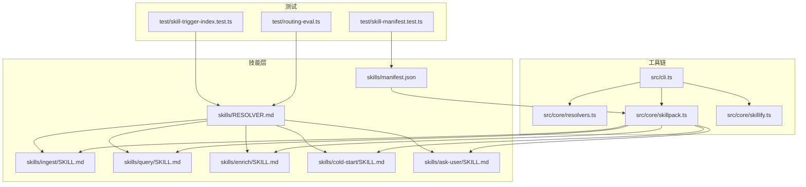
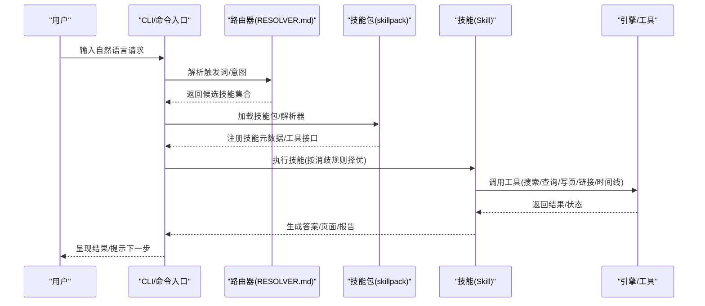
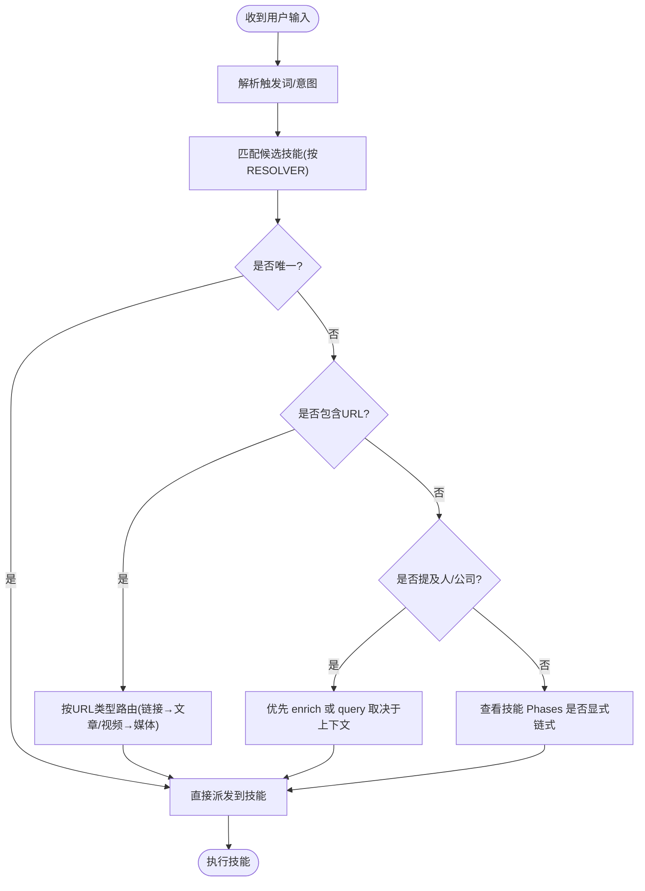
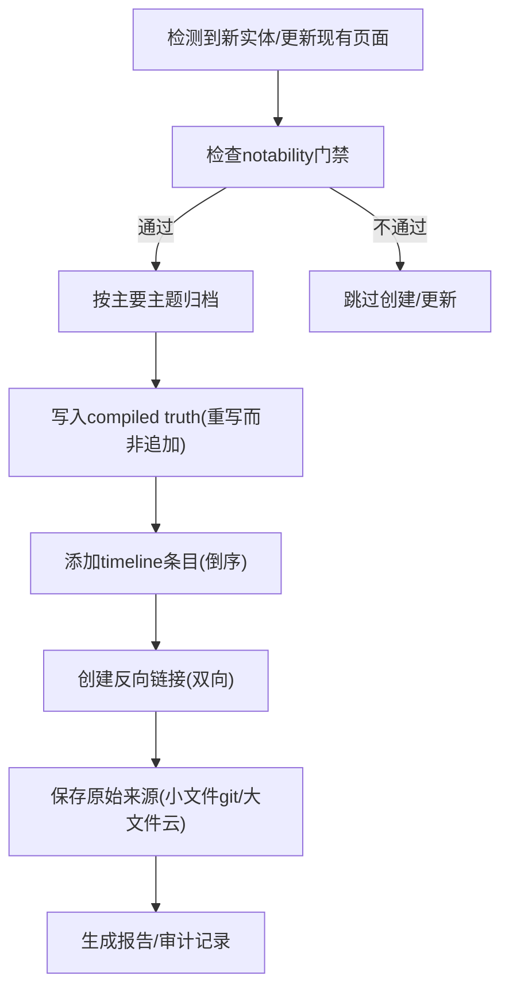
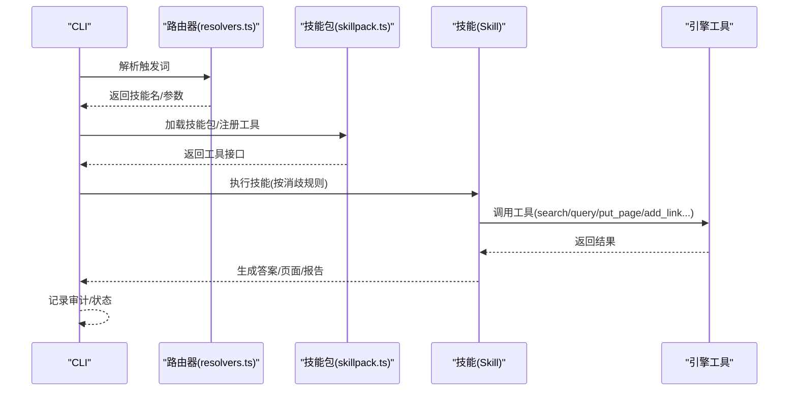
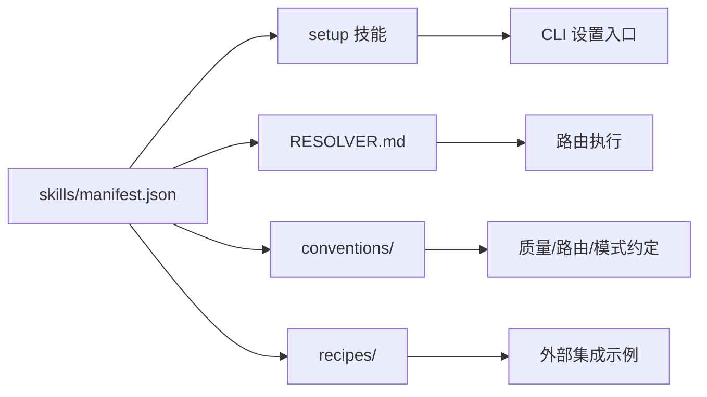
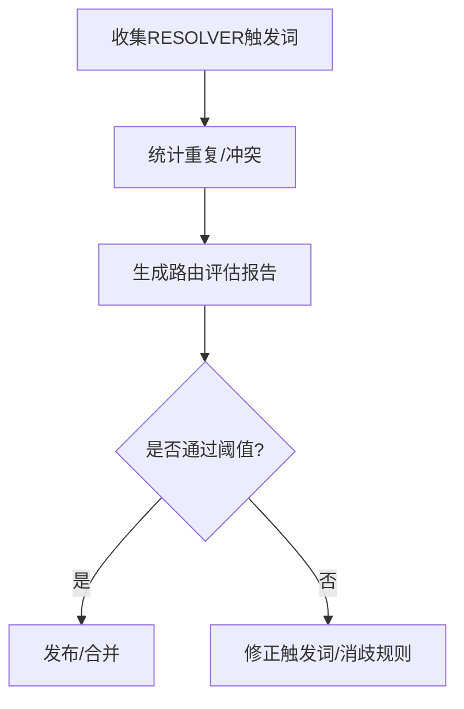
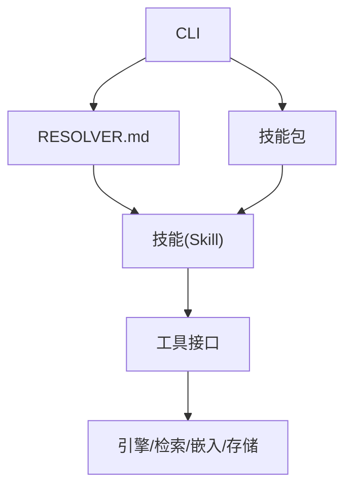

# 技能系统

<cite>
**本文引用的文件**
- [README.md](file://README.md)
- [GBRAIN_SKILLPACK.md](file://docs/GBRAIN_SKILLPACK.md)
- [RESOLVER.md](file://skills/RESOLVER.md)
- [_brain-filing-rules.md](file://skills/_brain-filing-rules.md)
- [_output-rules.md](file://skills/_output-rules.md)
- [manifest.json](file://skills/manifest.json)
- [ingest/SKILL.md](file://skills/ingest/SKILL.md)
- [query/SKILL.md](file://skills/query/SKILL.md)
- [enrich/SKILL.md](file://skills/enrich/SKILL.md)
- [cold-start/SKILL.md](file://skills/cold-start/SKILL.md)
- [ask-user/SKILL.md](file://skills/ask-user/SKILL.md)
- [cli.ts](file://src/cli.ts)
- [resolvers.ts](file://src/core/resolvers.ts)
- [skillpack.ts](file://src/core/skillpack.ts)
- [skillify.ts](file://src/core/skillify.ts)
- [skillpack-check.ts](file://src/commands/skillpack-check.ts)
- [skillify-check.ts](file://src/commands/skillify-check.ts)
- [routing-eval.ts](file://src/commands/routing-eval.ts)
- [skill-trigger-index.ts](file://test/skill-trigger-index.test.ts)
- [skill-catalog.test.ts](file://test/skill-catalog.test.ts)
- [skill-manifest.test.ts](file://test/skill-manifest.test.ts)
- [skillpack-check.test.ts](file://test/skillpack-check.test.ts)
- [skillpack-harvest.test.ts](file://test/skillpack-harvest.test.ts)
- [skillpack-reference/skillpack.json](file://examples/skillpack-reference/skillpack.json)
</cite>

## 目录
1. [简介](#简介)
2. [项目结构](#项目结构)
3. [核心组件](#核心组件)
4. [架构总览](#架构总览)
5. [详细组件分析](#详细组件分析)
6. [依赖关系分析](#依赖关系分析)
7. [性能考量](#性能考量)
8. [故障排查指南](#故障排查指南)
9. [结论](#结论)
10. [附录](#附录)

## 简介
本文件系统性阐述 GBrain 技能系统的架构设计、43 个预定义技能的功能与职责、技能路由机制、解析规则与执行流程，并提供自定义技能开发指南、技能包（SkillPack）管理机制、触发索引与性能优化、版本管理策略、开发示例、调试技巧与发布流程，以及与 schema packs 的集成和专家路由功能。目标是帮助开发者在不深入引擎源码的前提下，快速掌握如何构建、测试、维护与扩展 GBrain 技能体系。

## 项目结构
GBrain 技能系统由“技能清单 + 路由器 + 规范 + 工具链 + 测试”构成：
- 技能清单：skills/manifest.json 列出全部技能及其元数据
- 路由器：skills/RESOLVER.md 定义触发词到技能的映射与消歧规则
- 规范：_brain-filing-rules.md、_output-rules.md 提供写脑规范
- 工具链：CLI 命令与核心模块负责加载、校验、执行技能
- 测试：覆盖技能清单一致性、触发索引、路由评估等质量门禁

图示来源
- [manifest.json:1-281](file://skills/manifest.json#L1-L281)
- [RESOLVER.md:1-137](file://skills/RESOLVER.md#L1-L137)
- [cli.ts](file://src/cli.ts)
- [resolvers.ts](file://src/core/resolvers.ts)
- [skillpack.ts](file://src/core/skillpack.ts)
- [skillify.ts](file://src/core/skillify.ts)
- [skill-manifest.test.ts](file://test/skill-manifest.test.ts)
- [skill-trigger-index.test.ts](file://test/skill-trigger-index.test.ts)
- [routing-eval.ts](file://src/commands/routing-eval.ts)

章节来源
- [README.md:261-261](file://README.md#L261-L261)
- [GBRAIN_SKILLPACK.md:1-144](file://docs/GBRAIN_SKILLPACK.md#L1-L144)
- [manifest.json:1-281](file://skills/manifest.json#L1-L281)

## 核心组件
- 技能清单（manifest.json）
  - 描述技能包名称、版本、合规版本、描述、技能列表、依赖、设置入口、解析器与约定目录等
  - 43 个技能以“name/path/description”形式列出，作为安装与分发的契约
- 路由器（RESOLVER.md）
  - 定义“触发词 → 技能”的映射表，包含“总是开启”“脑操作”“内容/媒体摄入”“思考技能（GStack）”“运营”“设置/迁移”“身份/访问”“消歧规则”“约定”“未分类”等分区
  - 明确优先级与消歧规则（如按 URL 类型路由、按提及实体选择 enrich 或 query）
- 写脑规范（_brain-filing-rules.md、_output-rules.md）
  - “按主要主题归档”“反向链接铁律”“引用要求”“原始来源保留”“合成输出例外路径”等强制规则
  - 输出质量标准：确定性链接、无废话、精确引述、标题质量
- 工具链
  - CLI 入口与核心解析模块负责加载技能包、执行路由、调用工具
  - skillpack 模块负责技能包的加载、校验与注册
  - skillify 模块负责将任意功能转化为可解析、可测试、可评估的技能单元

章节来源
- [manifest.json:1-281](file://skills/manifest.json#L1-L281)
- [RESOLVER.md:1-137](file://skills/RESOLVER.md#L1-L137)
- [_brain-filing-rules.md:1-193](file://skills/_brain-filing-rules.md#L1-L193)
- [_output-rules.md:1-41](file://skills/_output-rules.md#L1-L41)

## 架构总览
技能系统采用“声明式路由 + 规范驱动 + 工具链执行”的三层架构：
- 声明式路由：RESOLVER.md 将自然语言意图映射为具体技能
- 规范驱动：写脑规则确保知识资产的可信度与可追溯性
- 工具链执行：CLI/核心模块加载技能包、解析触发词、调用工具完成读写

图示来源
- [RESOLVER.md:1-137](file://skills/RESOLVER.md#L1-L137)
- [manifest.json:1-281](file://skills/manifest.json#L1-L281)
- [cli.ts](file://src/cli.ts)
- [skillpack.ts](file://src/core/skillpack.ts)

## 详细组件分析

### 组件A：技能路由与解析（RESOLVER.md）
- 触发词到技能的映射表覆盖“总是开启”“脑操作”“内容摄入”“运营”“设置/迁移”“身份/访问”“未分类”等场景
- 消歧规则明确当多个技能可能匹配时的优先顺序与决策依据
- 约定区列出跨技能通用的质量、脑优先、路由、模式选择、子代理路由等规范

图示来源
- [RESOLVER.md:100-107](file://skills/RESOLVER.md#L100-L107)

章节来源
- [RESOLVER.md:1-137](file://skills/RESOLVER.md#L1-L137)

### 组件B：写脑规范与质量控制
- 归档规则：按“主要主题”归档，禁止将分析/框架放入 sources/
- 反向链接铁律：每处提及必须在被提及实体页建立回链
- 引用要求：明确来源优先级与三种引用格式
- 原始来源保留：自动大小路由与 .redirect.yaml 指针
- 输出质量：确定性链接、无废话、精确引述、标题质量

图示来源
- [_brain-filing-rules.md:54-132](file://skills/_brain-filing-rules.md#L54-L132)
- [_output-rules.md:1-41](file://skills/_output-rules.md#L1-L41)

章节来源
- [_brain-filing-rules.md:1-193](file://skills/_brain-filing-rules.md#L1-L193)
- [_output-rules.md:1-41](file://skills/_output-rules.md#L1-L41)

### 组件C：43个预定义技能概览与职责
以下为技能清单中的核心技能与其职责摘要（基于 manifest.json 中的描述字段）：

- 基础能力
  - ingest：路由内容到专门摄入技能；检测输入类型并委托
  - query：使用三层检索（关键词/语义/结构化）进行合成回答与引用传播
  - enrich：对人物/公司进行分级充实（Tier 1/2/3），产出编译真相与时间线
  - maintain：脑健康检查（反向链接、引用审计、存档验证、陈旧信息、孤儿页、基准）
  - brain-ops：脑优先查找、读-充实-写循环、来源归属、环境充实
  - capture：统一的人类入口，路由到本地 put_page 或薄客户端 MCP
  - signal-detector：每条消息的常驻信号捕获，检测原创思维与实体提及
- 内容摄入
  - idea-ingest：链接/文章/推文/想法摄入，分析与实体交叉链接
  - media-ingest：视频/音频/PDF/书籍/截图/仓库内容摄入与实体提取
  - meeting-ingestion：会议转录摄入，出席者充实、实体传播、时间线合并
- 运营与维护
  - daily-task-manager：任务生命周期管理（新增/完成/推迟/删除/复审）
  - daily-task-prep：晨间准备（日历上下文、开放议题、任务复审）
  - briefing：每日简报（会议上下文、活跃交易、引用追踪）
  - reports：保存/加载带关键字路由的报告
  - cron-scheduler：调度管理（交错、安静时段、唤醒覆盖）
  - gbrain-advisor：主动“最大化使用 gbrain”的教练
  - smoke-test：重启后冒烟测试与自动修复
  - skillpack-check：面向代理的 gbrain 健康报告
  - skillpack-harvest：从宿主仓库提升已验证技能至 gbrain
  - gbrain-upgrade：保持 gbrain 最新（通知或静默自动）
  - soul-audit：SOUL/USER/ACCESS_POLICY/HEARTBEAT 交互式面试
- 开发与治理
  - skill-creator：遵循一致性标准创建新技能
  - skillify：将任意功能转化为“可解析、可测试、可评估”的技能单元
  - testing：技能验证框架（前置大纲、章节、清单覆盖、MECE 检查）
  - functional-area-resolver：功能域调度器，压缩路由表至约 50%
- 专业领域
  - book-mirror：个性化书籍镜像（双栏：章节摘要 vs 对你适用性）
  - article-enrichment：将原始文章文本转化为结构化页面
  - strategic-reading：以特定战略问题视角阅读，产出应用型手册
  - concept-synthesis：去重与合成概念桩，追踪思想随时间的演变
  - idea-lineage：追踪一个想法的演化（首次提及、最佳阐述、反转、矛盾、废弃分支、相关概念、当前版本）
  - perplexity-research：基于 Perplexity 的脑增强网络研究
  - archive-crawler：个人档案馆（Dropbox/备份/邮件导出），高价值内容过滤
  - academic-verify：验证学术引用与研究主张
  - brain-pdf：从任意脑页生成出版级 PDF
  - voice-note-ingest：语音笔记摄入（精确引述保留）
  - schema-author：演进活动的 schema pack
  - schema-unify：迁移到 gbrain-base-v2 的类型统一
  - skill-optimizer：基于 SkillOpt 的自我演化的技能优化

章节来源
- [manifest.json:6-267](file://skills/manifest.json#L6-L267)

### 组件D：执行流程与工具接口
- CLI 入口与核心解析
  - CLI 负责接收用户输入，调用路由器解析触发词，加载技能包并执行技能
  - 核心解析模块负责将 RESOLVER.md 的映射表转换为可执行的路由逻辑
- 工具接口
  - 技能通过工具接口与引擎交互：搜索、查询、读取页面、写入页面、添加链接、添加时间线条目、同步脑等
  - 示例：query 使用 search/query/get_page/list_pages/get_backlinks/traverse_graph/get_timeline；ingest 使用 put_page/add_link/add_timeline_entry/sync_brain；enrich 使用 put_page/add_timeline_entry/list_pages/put_raw_data/get_raw_data

图示来源
- [cli.ts](file://src/cli.ts)
- [resolvers.ts](file://src/core/resolvers.ts)
- [skillpack.ts](file://src/core/skillpack.ts)
- [query/SKILL.md:147-156](file://skills/query/SKILL.md#L147-L156)
- [ingest/SKILL.md:302-312](file://skills/ingest/SKILL.md#L302-L312)
- [enrich/SKILL.md:340-350](file://skills/enrich/SKILL.md#L340-L350)

章节来源
- [cli.ts](file://src/cli.ts)
- [resolvers.ts](file://src/core/resolvers.ts)
- [skillpack.ts](file://src/core/skillpack.ts)
- [query/SKILL.md:147-156](file://skills/query/SKILL.md#L147-L156)
- [ingest/SKILL.md:302-312](file://skills/ingest/SKILL.md#L302-L312)
- [enrich/SKILL.md:340-350](file://skills/enrich/SKILL.md#L340-L350)

### 组件E：技能包（SkillPack）与管理机制
- 技能包清单：skills/manifest.json 描述技能包元数据、依赖、解析器与约定目录
- 安装与设置：setup 技能负责自动 provision（Supabase/PGLite）、配置 GBrain
- 版本与合规：conformance_version 字段用于约束技能实现的一致性
- 管理命令：skillpack-check 提供面向代理的健康报告；skillpack-harvest 支持从宿主仓库提升技能
- 示例技能包：examples/skillpack-reference/skillpack.json 展示参考结构

图示来源
- [manifest.json:268-280](file://skills/manifest.json#L268-L280)
- [skillpack-check.ts](file://src/commands/skillpack-check.ts)
- [skillpack-harvest.test.ts](file://test/skillpack-harvest.test.ts)
- [skillpack-reference/skillpack.json](file://examples/skillpack-reference/skillpack.json)

章节来源
- [manifest.json:1-281](file://skills/manifest.json#L1-L281)
- [skillpack-check.ts](file://src/commands/skillpack-check.ts)
- [skillpack-harvest.test.ts](file://test/skillpack-harvest.test.ts)
- [skillpack-reference/skillpack.json](file://examples/skillpack-reference/skillpack.json)

### 组件F：触发索引与路由评估
- 触发索引：test/skill-trigger-index.test.ts 验证 RESOLVER.md 中所有触发词的覆盖率与唯一性
- 路由评估：src/commands/routing-eval.ts 评估路由质量，识别冲突与覆盖不足
- 技能目录一致性：test/skill-catalog.test.ts 与 test/skill-manifest.test.ts 确保清单与实际技能一致

图示来源
- [skill-trigger-index.test.ts](file://test/skill-trigger-index.test.ts)
- [routing-eval.ts](file://src/commands/routing-eval.ts)
- [skill-catalog.test.ts](file://test/skill-catalog.test.ts)
- [skill-manifest.test.ts](file://test/skill-manifest.test.ts)

章节来源
- [skill-trigger-index.test.ts](file://test/skill-trigger-index.test.ts)
- [routing-eval.ts](file://src/commands/routing-eval.ts)
- [skill-catalog.test.ts](file://test/skill-catalog.test.ts)
- [skill-manifest.test.ts](file://test/skill-manifest.test.ts)

### 组件G：自定义技能开发指南
- SKILL.md 格式
  - 必备字段：name/version/description/triggers/tools/mutating/writes_pages/writes_to
  - 推荐字段：优先级、变更影响范围、输出格式、工具使用清单
- 开发步骤
  - 选择触发词：避免与现有技能冲突，必要时通过 functional-area-resolver 压缩路由表
  - 设计阶段：明确输入/输出、引用来源、反向链接、原始来源保留
  - 实现：遵循写脑规范，使用工具接口完成读写
  - 测试：运行技能清单与触发索引测试，提交路由评估
  - 发布：通过 skillpack-harvest 将技能提升至核心技能包
- 最佳实践
  - 优先使用 ask-user 模式处理决策点
  - 严格遵循“按主要主题归档”，避免 sources/滥用
  - 保持精确引述与确定性链接
  - 分批批量处理时进行样本测试与节流

章节来源
- [ask-user/SKILL.md:1-254](file://skills/ask-user/SKILL.md#L1-L254)
- [_brain-filing-rules.md:1-193](file://skills/_brain-filing-rules.md#L1-L193)
- [_output-rules.md:1-41](file://skills/_output-rules.md#L1-L41)
- [GBRAIN_SKILLPACK.md:1-144](file://docs/GBRAIN_SKILLPACK.md#L1-L144)

### 组件H：与 schema packs 的集成与专家路由
- schema packs 决定页面类型、链接类型与抽取规则，影响“whoknows”专家路由与“extract_facts”抽取范围
- 专家路由：当 schema pack 声明某类型为 expert_routing: true 时，查询会优先指向该类型领域的专家
- 技能层面：query 技能结合 graph-query 与 backlinks，利用 schema packs 的类型体系进行关系推理

章节来源
- [README.md:222-222](file://README.md#L222-L222)
- [query/SKILL.md:116-136](file://skills/query/SKILL.md#L116-L136)

## 依赖关系分析
- 组件耦合
  - RESOLVER.md 与各技能存在强耦合（触发词与职责边界）
  - 写脑规范与所有 mutating 技能存在强耦合（引用、反向链接、原始来源）
  - CLI/核心模块与技能包存在弱耦合（通过 manifest.json 与工具接口）
- 外部依赖
  - MCP/HTTP 服务器暴露工具接口
  - 外部检索/嵌入/重排序服务（通过 gateway 抽象）
  - 存储层（git/云存储）用于原始来源保留

图示来源
- [RESOLVER.md:1-137](file://skills/RESOLVER.md#L1-L137)
- [manifest.json:1-281](file://skills/manifest.json#L1-L281)
- [cli.ts](file://src/cli.ts)

章节来源
- [RESOLVER.md:1-137](file://skills/RESOLVER.md#L1-L137)
- [manifest.json:1-281](file://skills/manifest.json#L1-L281)
- [cli.ts](file://src/cli.ts)

## 性能考量
- 路由性能
  - 触发词索引与消歧规则应尽量减少候选集规模，避免多路分支
  - 对高频触发词（如 signal-detector）采用并行派发，不阻塞主线程
- 写脑性能
  - 批量写入时采用分批提交（建议 5-10 项/批），降低锁竞争
  - 合理使用 sync_brain，避免每次写入都触发重建索引
- 检索性能
  - 关键词搜索与混合搜索配合使用，先用 search 获取证据片段，再按需加载完整页面
  - 对陈旧/缺失嵌入进行增量 re-embed，避免全量重建
- 存储性能
  - 大文件自动上传云存储，小文件保留在 git 侧车目录，平衡检索与版本控制成本

## 故障排查指南
- 路由问题
  - 触发词冲突：通过 routing-eval 与 skill-trigger-index 测试定位
  - 消歧不当：检查 RESOLVER.md 的优先级与 URL/实体判断分支
- 写脑问题
  - 缺少反向链接：启用 _output-rules 的确定性链接与反向链接检查
  - 引用不合规：核对来源优先级与引用格式
  - 原始来源缺失：确认 upload-raw 与 .redirect.yaml 指针
- 执行问题
  - 工具调用失败：检查工具接口清单与权限
  - 批量写入失败：查看批量重试与回滚策略
- 健康检查
  - 使用 skillpack-check 生成 JSON 健康报告，结合 exit codes 与 doctor 建议修复

章节来源
- [routing-eval.ts](file://src/commands/routing-eval.ts)
- [skill-trigger-index.test.ts](file://test/skill-trigger-index.test.ts)
- [_output-rules.md:1-41](file://skills/_output-rules.md#L1-L41)
- [_brain-filing-rules.md:94-132](file://skills/_brain-filing-rules.md#L94-L132)
- [skillpack-check.ts](file://src/commands/skillpack-check.ts)

## 结论
GBrain 技能系统通过“声明式路由 + 规范驱动 + 工具链执行”的架构，实现了从自然语言意图到知识资产写入的端到端闭环。43 个预定义技能覆盖了从内容摄入、知识充实、日常运营到开发治理的全栈场景。借助触发索引、路由评估与质量规范，系统在可扩展的同时保证了可信度与可维护性。对于自定义技能开发，遵循 SKILL.md 格式、写脑规范与工具接口，即可快速构建高质量的技能单元并纳入技能包生态。

## 附录
- 自定义技能开发示例
  - 参考 ask-user 技能的 choice-gate 模式，处理决策点并等待用户响应
  - 参考 cold-start 技能的分阶段导入与状态跟踪，确保可恢复性
- 调试技巧
  - 使用 skillify-check 与 skillpack-check 快速定位问题
  - 在批量处理前进行样本测试，确保输出质量
- 发布流程
  - 通过 skillpack-harvest 将经验证的技能提升至核心技能包
  - 结合路由评估与触发索引测试，确保发布质量

章节来源
- [ask-user/SKILL.md:165-254](file://skills/ask-user/SKILL.md#L165-L254)
- [cold-start/SKILL.md:407-451](file://skills/cold-start/SKILL.md#L407-L451)
- [skillify-check.ts](file://src/commands/skillify-check.ts)
- [skillpack-harvest.test.ts](file://test/skillpack-harvest.test.ts)