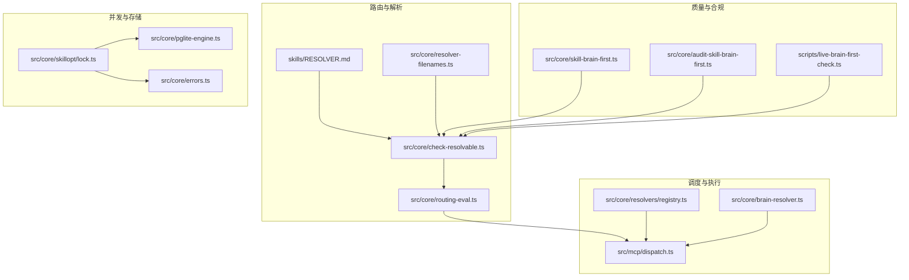
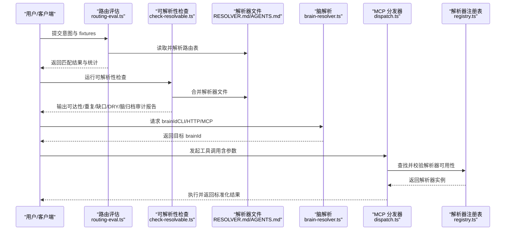
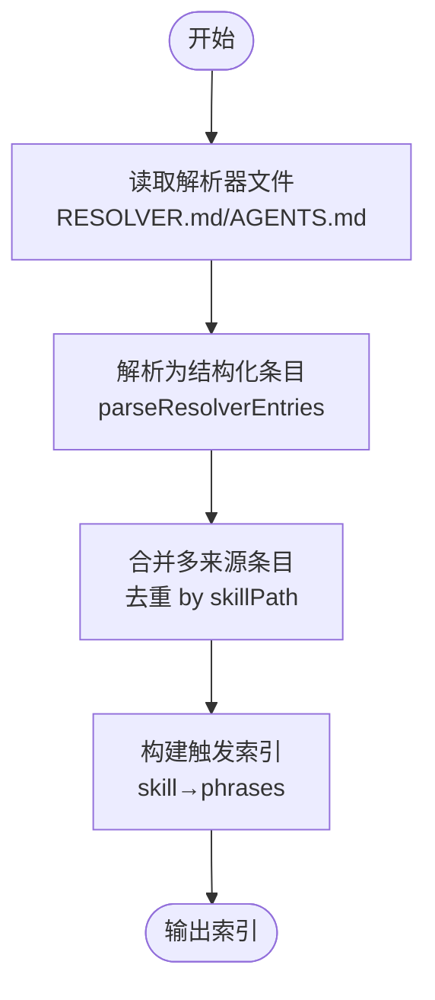
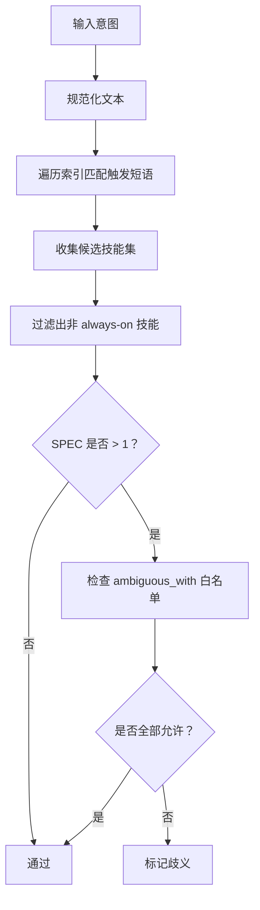
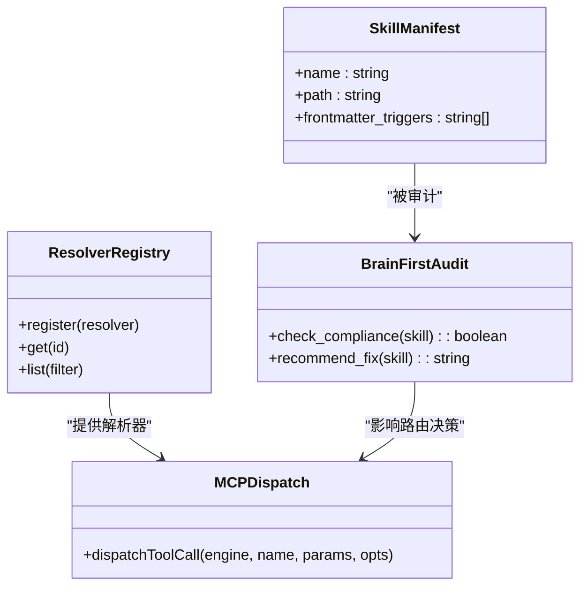
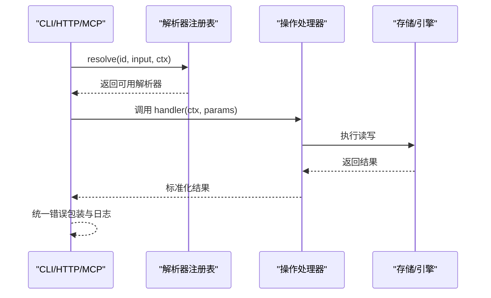
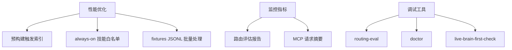
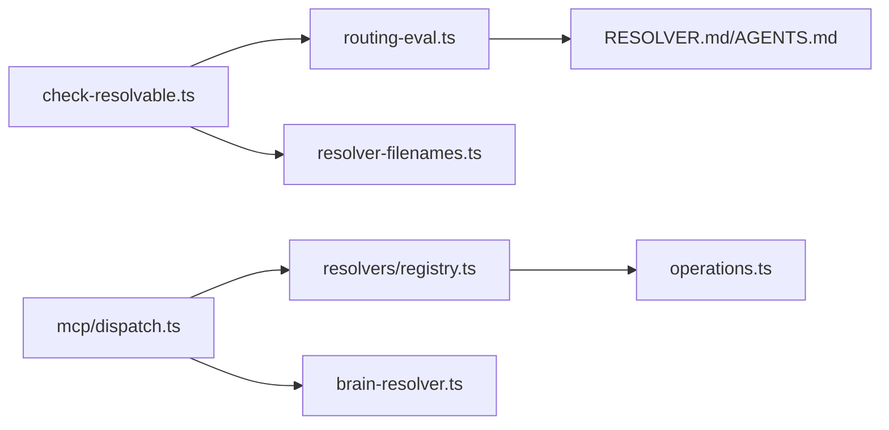

# 技能路由与调度

<cite>
**本文引用的文件**
- [skills/RESOLVER.md](file://skills/RESOLVER.md)
- [src/core/resolver-filenames.ts](file://src/core/resolver-filenames.ts)
- [src/core/check-resolvable.ts](file://src/core/check-resolvable.ts)
- [src/core/routing-eval.ts](file://src/core/routing-eval.ts)
- [src/core/brain-resolver.ts](file://src/core/brain-resolver.ts)
- [src/core/resolvers/index.ts](file://src/core/resolvers/index.ts)
- [src/core/resolvers/registry.ts](file://src/core/resolvers/registry.ts)
- [src/mcp/dispatch.ts](file://src/mcp/dispatch.ts)
- [test/routing-eval.test.ts](file://test/routing-eval.test.ts)
- [test/brain-resolver.test.ts](file://test/brain-resolver.test.ts)
- [test/resolver-merge.test.ts](file://test/resolver-merge.test.ts)
- [src/core/skill-brain-first.ts](file://src/core/skill-brain-first.ts)
- [src/core/audit-skill-brain-first.ts](file://src/core/audit-skill-brain-first.ts)
- [scripts/live-brain-first-check.ts](file://scripts/live-brain-first-check.ts)
- [src/commands/routing-eval.ts](file://src/commands/routing-eval.ts)
- [src/core/skillopt/lock.ts](file://src/core/skillopt/lock.ts)
- [src/core/pglite-engine.ts](file://src/core/pglite-engine.ts)
- [src/core/errors.ts](file://src/core/errors.ts)
</cite>

## 目录
1. [简介](#简介)
2. [项目结构](#项目结构)
3. [核心组件](#核心组件)
4. [架构总览](#架构总览)
5. [详细组件分析](#详细组件分析)
6. [依赖关系分析](#依赖关系分析)
7. [性能考量](#性能考量)
8. [故障排查指南](#故障排查指南)
9. [结论](#结论)
10. [附录](#附录)

## 简介
本文件系统性阐述 gbrain 的“技能路由与调度”体系：以技能解析器（Resolver）为核心，结合触发索引、优先级与冲突消解策略，实现从自然语言意图到具体技能执行的可验证、可审计、可扩展的路由闭环；同时覆盖脑优先（brain-first）路由模式与专家系统集成、多层调度架构、负载均衡与容错机制，并给出性能优化、监控指标与调试工具建议及配置示例与最佳实践。

## 项目结构
围绕“路由与调度”的关键目录与文件：
- 路由定义与校验
  - skills/RESOLVER.md：人类可读的技能路由表，定义触发词与技能映射
  - src/core/resolver-filenames.ts：解析器文件名策略（RESOLVER.md 或 AGENTS.md）
  - src/core/check-resolvable.ts：路由可达性、重复、缺口、DRY 规则、脑归档审计等综合检查
  - src/core/routing-eval.ts：结构化路由评估（Layer A），支持 fixtures 驱动的回归测试
- 调度与执行
  - src/mcp/dispatch.ts：MCP 工具调用分发器，统一参数校验、上下文构建与结果格式
  - src/core/resolvers/registry.ts：解析器注册表，集中管理可用解析器及其可用性检测
  - src/core/brain-resolver.ts：脑选择解析（brainId 解析），为后续操作提供目标数据库上下文
- 质量与合规
  - src/core/skill-brain-first.ts 与 src/core/audit-skill-brain-first.ts：脑优先合规性检查与审计
  - scripts/live-brain-first-check.ts：实时检查脚本
- 运行时锁与并发
  - src/core/skillopt/lock.ts：技能优化的数据库锁封装
  - src/core/pglite-engine.ts：轻量化数据库引擎（用于测试与部分场景）

**图示来源**
- [skills/RESOLVER.md:1-137](file://skills/RESOLVER.md#L1-L137)
- [src/core/resolver-filenames.ts:1-61](file://src/core/resolver-filenames.ts#L1-L61)
- [src/core/check-resolvable.ts:1-663](file://src/core/check-resolvable.ts#L1-L663)
- [src/core/routing-eval.ts:1-397](file://src/core/routing-eval.ts#L1-L397)
- [src/mcp/dispatch.ts:1-284](file://src/mcp/dispatch.ts#L1-L284)
- [src/core/resolvers/registry.ts:1-152](file://src/core/resolvers/registry.ts#L1-L152)
- [src/core/brain-resolver.ts:1-134](file://src/core/brain-resolver.ts#L1-L134)
- [src/core/skill-brain-first.ts](file://src/core/skill-brain-first.ts)
- [src/core/audit-skill-brain-first.ts](file://src/core/audit-skill-brain-first.ts)
- [scripts/live-brain-first-check.ts](file://scripts/live-brain-first-check.ts)
- [src/core/skillopt/lock.ts:1-41](file://src/core/skillopt/lock.ts#L1-L41)
- [src/core/pglite-engine.ts](file://src/core/pglite-engine.ts)
- [src/core/errors.ts](file://src/core/errors.ts)

**章节来源**
- [skills/RESOLVER.md:1-137](file://skills/RESOLVER.md#L1-L137)
- [src/core/resolver-filenames.ts:1-61](file://src/core/resolver-filenames.ts#L1-L61)
- [src/core/check-resolvable.ts:1-663](file://src/core/check-resolvable.ts#L1-L663)
- [src/core/routing-eval.ts:1-397](file://src/core/routing-eval.ts#L1-L397)
- [src/mcp/dispatch.ts:1-284](file://src/mcp/dispatch.ts#L1-L284)
- [src/core/resolvers/registry.ts:1-152](file://src/core/resolvers/registry.ts#L1-L152)
- [src/core/brain-resolver.ts:1-134](file://src/core/brain-resolver.ts#L1-L134)
- [src/core/skill-brain-first.ts](file://src/core/skill-brain-first.ts)
- [src/core/audit-skill-brain-first.ts](file://src/core/audit-skill-brain-first.ts)
- [scripts/live-brain-first-check.ts](file://scripts/live-brain-first-check.ts)
- [src/core/skillopt/lock.ts:1-41](file://src/core/skillopt/lock.ts#L1-L41)
- [src/core/pglite-engine.ts](file://src/core/pglite-engine.ts)
- [src/core/errors.ts](file://src/core/errors.ts)

## 核心组件
- 技能解析器（Resolver）
  - 作用：将自然语言触发词映射到具体技能路径，形成“触发词 → 技能”的路由表
  - 来源：skills/RESOLVER.md（或 AGENTS.md，按策略合并）
  - 解析：parseResolverEntries 将表格/列表两种格式解析为结构化条目
  - 合并与去重：支持同一技能多触发词、跨文件合并（RESOLVER.md 优先生效）
- 触发索引与优先级
  - indexResolverTriggers 构建“技能 → 触发短语集合”的索引
  - 结构化匹配（Layer A）：对意图进行规范化后，查找包含其子串的触发短语，得到候选技能集
  - 优先级规则：总是运行的技能（如 signal-detector、brain-ops、ingest）不计入歧义
- 冲突消解与断言
  - ambiguous_with 白名单允许某些技能共火（always-on 技能）
  - negative case 断言：期望无匹配时，仅允许 always-on 技能
  - fixtures 回归：通过 skills/<skill>/routing-eval.jsonl 驱动评估
- 脑优先（brain-first）路由
  - 前置检查：技能声明 brain_first: exempt 或遵循脑优先流程
  - 审计：check-resolvable 检测未遵循脑优先的技能并给出修复建议
- 多层调度与执行
  - MCP 分发：统一参数校验、上下文构建、错误格式化
  - 解析器注册表：集中注册与查询解析器，支持成本/后端过滤
  - 脑选择：resolveBrainId 提供 brainId 解析，确保每次调用明确目标数据库
- 并发与容错
  - 技能优化锁：tryAcquireSkilloptLock/withSkilloptLock 提供数据库锁、TTL 刷新与释放
  - 错误模型：OperationError 统一错误响应形状，保证 MCP 兼容

**章节来源**
- [skills/RESOLVER.md:1-137](file://skills/RESOLVER.md#L1-L137)
- [src/core/resolver-filenames.ts:18-61](file://src/core/resolver-filenames.ts#L18-L61)
- [src/core/check-resolvable.ts:148-213](file://src/core/check-resolvable.ts#L148-L213)
- [src/core/routing-eval.ts:137-183](file://src/core/routing-eval.ts#L137-L183)
- [src/core/routing-eval.ts:329-396](file://src/core/routing-eval.ts#L329-L396)
- [src/core/skill-brain-first.ts](file://src/core/skill-brain-first.ts)
- [src/core/audit-skill-brain-first.ts](file://src/core/audit-skill-brain-first.ts)
- [src/mcp/dispatch.ts:222-283](file://src/mcp/dispatch.ts#L222-L283)
- [src/core/resolvers/registry.ts:41-123](file://src/core/resolvers/registry.ts#L41-L123)
- [src/core/brain-resolver.ts:85-125](file://src/core/brain-resolver.ts#L85-L125)
- [src/core/skillopt/lock.ts:33-41](file://src/core/skillopt/lock.ts#L33-L41)

## 架构总览
下图展示从“意图输入”到“技能执行”的端到端流程，包括路由评估、脑选择与 MCP 分发：

**图示来源**
- [src/core/routing-eval.ts:329-396](file://src/core/routing-eval.ts#L329-L396)
- [src/core/check-resolvable.ts:304-349](file://src/core/check-resolvable.ts#L304-L349)
- [skills/RESOLVER.md:1-137](file://skills/RESOLVER.md#L1-L137)
- [src/core/brain-resolver.ts:85-125](file://src/core/brain-resolver.ts#L85-L125)
- [src/mcp/dispatch.ts:222-283](file://src/mcp/dispatch.ts#L222-L283)
- [src/core/resolvers/registry.ts:63-112](file://src/core/resolvers/registry.ts#L63-L112)

## 详细组件分析

### 技能解析器（Resolver）工作原理与配置
- 文件策略
  - 支持 RESOLVER.md 与 AGENTS.md 双文件，RESOLVER.md 优先生效
  - findAllResolverFiles 返回所有存在文件，便于合并
- 解析格式
  - 表格格式与紧凑列表格式并存，自动识别并转换为统一结构
  - 列表格式要求技能名为 kebab-lowercase，避免将“Note”等占位项误判
- 合并与去重
  - 合并来自多个来源的条目，按 skillPath 去重，确保每个技能只计一次可达
- 触发索引
  - 从解析结果生成“技能 → 触发短语数组”的索引，用于结构化匹配

**图示来源**
- [src/core/resolver-filenames.ts:27-49](file://src/core/resolver-filenames.ts#L27-L49)
- [src/core/check-resolvable.ts:148-213](file://src/core/check-resolvable.ts#L148-L213)
- [src/core/routing-eval.ts:137-149](file://src/core/routing-eval.ts#L137-L149)

**章节来源**
- [src/core/resolver-filenames.ts:18-61](file://src/core/resolver-filenames.ts#L18-L61)
- [src/core/check-resolvable.ts:148-213](file://src/core/check-resolvable.ts#L148-L213)
- [src/core/routing-eval.ts:137-149](file://src/core/routing-eval.ts#L137-L149)

### 技能触发索引、优先级与冲突消解
- 触发索引
  - 从解析器内容提取触发短语，规范化后建立映射
- 匹配策略（Layer A）
  - 对意图进行规范化（小写、非字母数字替换为空格、去空白）
  - 若规范化后的意图包含某技能的任一触发短语，则该技能进入候选集
- 优先级与总是运行技能
  - always-on 技能集合：signal-detector、brain-ops、ingest
  - 在判断歧义时，这些技能不计入“特定技能数量”
- 冲突消解
  - negative case：若期望无匹配，仅允许 always-on 技能
  - ambiguous_with 白名单：允许与期望技能共火的其他技能
  - 未在白名单中的额外匹配视为歧义

**图示来源**
- [src/core/routing-eval.ts:98-120](file://src/core/routing-eval.ts#L98-L120)
- [src/core/routing-eval.ts:166-183](file://src/core/routing-eval.ts#L166-L183)
- [src/core/routing-eval.ts:346-382](file://src/core/routing-eval.ts#L346-L382)

**章节来源**
- [src/core/routing-eval.ts:98-183](file://src/core/routing-eval.ts#L98-L183)
- [src/core/routing-eval.ts:346-382](file://src/core/routing-eval.ts#L346-L382)

### 脑优先（brain-first）路由模式与专家系统集成
- 脑优先合规
  - 技能可通过 frontmatter 声明 brain_first: exempt 或遵循脑优先流程
  - 审计与检查：未遵循脑优先的技能会被标记为问题并给出修复建议
- 专家系统集成
  - 解析器注册表提供按成本/后端过滤能力，便于在不同“专家”之间切换
  - MCP 分发器统一参数校验与上下文注入，保证外部工具调用一致性

**图示来源**
- [src/core/skill-brain-first.ts](file://src/core/skill-brain-first.ts)
- [src/core/audit-skill-brain-first.ts](file://src/core/audit-skill-brain-first.ts)
- [src/core/resolvers/registry.ts:41-123](file://src/core/resolvers/registry.ts#L41-L123)
- [src/mcp/dispatch.ts:222-283](file://src/mcp/dispatch.ts#L222-L283)

**章节来源**
- [src/core/skill-brain-first.ts](file://src/core/skill-brain-first.ts)
- [src/core/audit-skill-brain-first.ts](file://src/core/audit-skill-brain-first.ts)
- [src/core/resolvers/registry.ts:41-123](file://src/core/resolvers/registry.ts#L41-L123)
- [src/mcp/dispatch.ts:222-283](file://src/mcp/dispatch.ts#L222-L283)

### 多层调度架构、负载均衡与容错
- 多层调度
  - Layer A：纯结构化匹配（无 LLM），快速、稳定、可回归
  - Layer B（预留）：未来引入 LLM tie-break 层，当前 CLI 接受标志但不启用
- 负载均衡
  - 解析器注册表支持按 cost/backend 过滤，便于在不同“专家”间动态分配
- 容错机制
  - MCP 分发器统一错误包装，保证 JSON 可解析
  - 参数校验与上下文构建分离，降低耦合
  - 脑解析失败回退至 host，确保调用不会中断

**图示来源**
- [src/core/resolvers/registry.ts:96-112](file://src/core/resolvers/registry.ts#L96-L112)
- [src/mcp/dispatch.ts:222-283](file://src/mcp/dispatch.ts#L222-L283)

**章节来源**
- [src/core/resolvers/registry.ts:41-123](file://src/core/resolvers/registry.ts#L41-L123)
- [src/mcp/dispatch.ts:222-283](file://src/mcp/dispatch.ts#L222-L283)

### 路由性能优化、监控指标与调试工具
- 性能优化
  - 触发索引预构建，避免每次意图都全量扫描
  - always-on 技能集合常驻，减少歧义判定开销
  - fixtures 使用 JSONL，批量加载与校验
- 监控指标
  - 路由评估报告：totalCases、top1Accuracy、missed、ambiguous、falsePositives
  - MCP 请求摘要：redacted 形状、declared_keys、unknown_key_count、approx_bytes
- 调试工具
  - gbrain routing-eval：运行结构化路由评估
  - gbrain doctor：综合健康检查（可达性、重复、缺口、DRY、脑归档）
  - live-brain-first-check：实时检查脚本

**图示来源**
- [src/core/routing-eval.ts:57-78](file://src/core/routing-eval.ts#L57-L78)
- [src/mcp/dispatch.ts:128-168](file://src/mcp/dispatch.ts#L128-L168)
- [src/commands/routing-eval.ts](file://src/commands/routing-eval.ts)
- [scripts/live-brain-first-check.ts](file://scripts/live-brain-first-check.ts)

**章节来源**
- [src/core/routing-eval.ts:57-78](file://src/core/routing-eval.ts#L57-L78)
- [src/mcp/dispatch.ts:128-168](file://src/mcp/dispatch.ts#L128-L168)
- [src/commands/routing-eval.ts](file://src/commands/routing-eval.ts)
- [scripts/live-brain-first-check.ts](file://scripts/live-brain-first-check.ts)

## 依赖关系分析
- 组件内聚与耦合
  - check-resolvable.ts 作为“可解析性检查”的单一事实来源，聚合解析器、路由评估、脑归档审计
  - routing-eval.ts 专注结构化匹配与评估，接口清晰，便于测试与回归
  - mcp/dispatch.ts 与 resolvers/registry.ts 解耦，前者负责传输与上下文，后者负责解析器生命周期
- 外部依赖与集成点
  - 解析器注册表支持成本/后端过滤，便于与外部专家系统对接
  - 脑解析器提供 brainId 解析，确保每次调用的目标明确

**图示来源**
- [src/core/check-resolvable.ts:1-663](file://src/core/check-resolvable.ts#L1-L663)
- [src/core/routing-eval.ts:1-397](file://src/core/routing-eval.ts#L1-L397)
- [src/core/resolver-filenames.ts:1-61](file://src/core/resolver-filenames.ts#L1-L61)
- [src/mcp/dispatch.ts:1-284](file://src/mcp/dispatch.ts#L1-L284)
- [src/core/resolvers/registry.ts:1-152](file://src/core/resolvers/registry.ts#L1-L152)
- [src/core/brain-resolver.ts:1-134](file://src/core/brain-resolver.ts#L1-L134)

**章节来源**
- [src/core/check-resolvable.ts:1-663](file://src/core/check-resolvable.ts#L1-L663)
- [src/core/routing-eval.ts:1-397](file://src/core/routing-eval.ts#L1-L397)
- [src/core/resolver-filenames.ts:1-61](file://src/core/resolver-filenames.ts#L1-L61)
- [src/mcp/dispatch.ts:1-284](file://src/mcp/dispatch.ts#L1-L284)
- [src/core/resolvers/registry.ts:1-152](file://src/core/resolvers/registry.ts#L1-L152)
- [src/core/brain-resolver.ts:1-134](file://src/core/brain-resolver.ts#L1-L134)

## 性能考量
- 触发索引与匹配
  - 预构建 skillPhrases 映射，匹配复杂度近似 O(S)（S 为技能数）
  - always-on 技能集合常驻，避免每次重新计算
- fixtures 加载
  - skills/<skill>/routing-eval.jsonl 采用流式逐行解析，减少内存峰值
- MCP 分发
  - 参数校验与上下文构建分离，减少重复计算
  - 统一错误包装，避免异常传播导致的额外开销
- 脑解析
  - 优先级从显式参数到环境变量再到 dotfile 与挂载路径，命中率高且路径短

[本节为通用指导，无需列出具体文件来源]

## 故障排查指南
- 路由评估失败
  - 使用 test/routing-eval.test.ts 中的断言样例定位“missed/ambiguous/false_positive”
  - 检查 fixtures 是否符合规范（意图不得完全等于触发词）
- 解析器文件缺失或冲突
  - 使用 resolver-filenames.ts 的策略确认 RESOLVER.md/AGENTS.md 存在与优先级
  - 使用 resolver-merge.test.ts 的逻辑验证多文件合并是否正确
- 脑解析异常
  - 使用 brain-resolver.test.ts 的断言样例核对解析顺序与回退行为
- 并发与锁
  - 使用 skillopt/lock.ts 的封装与 PGLiteEngine 进行单元测试，确保锁获取、刷新与释放正常
- 错误模型
  - 使用 errors.ts 的错误类型，确保 MCP 响应一致

**章节来源**
- [test/routing-eval.test.ts:305-372](file://test/routing-eval.test.ts#L305-L372)
- [src/core/resolver-filenames.ts:27-49](file://src/core/resolver-filenames.ts#L27-L49)
- [test/resolver-merge.test.ts:1-37](file://test/resolver-merge.test.ts#L1-L37)
- [test/brain-resolver.test.ts](file://test/brain-resolver.test.ts)
- [src/core/skillopt/lock.ts:33-41](file://src/core/skillopt/lock.ts#L33-L41)
- [src/core/errors.ts](file://src/core/errors.ts)

## 结论
本路由与调度体系以“可解析性检查 + 结构化路由评估 + MCP 统一分发”为核心，辅以脑优先合规与专家系统集成，实现了高可维护性与可扩展性的技能路由闭环。通过 fixtures 驱动的回归测试、统一错误模型与隐私安全的参数摘要，系统在工程上具备良好的可观测性与可运维性。

[本节为总结，无需列出具体文件来源]

## 附录
- 配置示例与最佳实践
  - 在 skills/RESOLVER.md 中为新技能添加触发词与技能路径，确保 frontmatter triggers 与路由表一致
  - 使用 ambiguous_with 白名单控制 always-on 技能与特定技能的共火
  - 为每个技能编写 skills/<skill>/routing-eval.jsonl fixtures，覆盖正负样本与边界情况
  - 为需要外部 API 的技能声明 brain_first: exempt，或在实现中先查询脑再调用外部服务
  - 使用 gbrain doctor 与 gbrain routing-eval 定期巡检路由质量
- 相关命令
  - gbrain routing-eval：运行结构化路由评估
  - gbrain doctor：综合健康检查
  - gbrain serve：启动 MCP 服务（参数校验与上下文构建由 dispatch.ts 统一处理）

[本节为概览，无需列出具体文件来源]