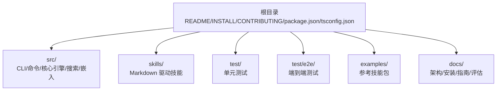
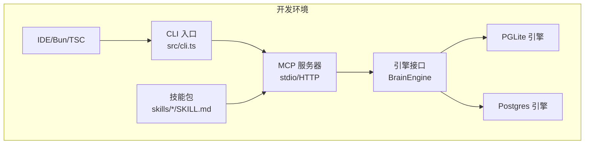
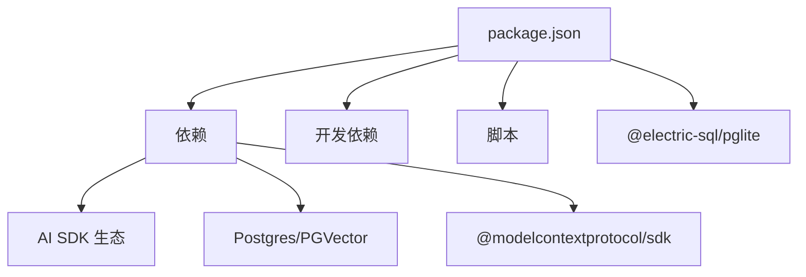

# 开发环境搭建

<cite>
**本文档引用的文件**
- [README.md](file://README.md)
- [INSTALL.md](file://docs/INSTALL.md)
- [CONTRIBUTING.md](file://CONTRIBUTING.md)
- [package.json](file://package.json)
- [tsconfig.json](file://tsconfig.json)
- [bunfig.toml](file://bunfig.toml)
- [docs/TESTING.md](file://docs/TESTING.md)
- [docs/skillpack-anatomy.md](file://docs/skillpack-anatomy.md)
- [docs/guides/skillopt.md](file://docs/guides/skillopt.md)
- [docs/guides/skillpacks-as-scaffolding.md](file://docs/guides/skillpacks-as-scaffolding.md)
- [examples/skillpack-reference/README.md](file://examples/skillpack-reference/README.md)
- [examples/skillpack-reference/skillpack.json](file://examples/skillpack-reference/skillpack.json)
- [examples/skillpack-reference/skills/reference-pack/SKILL.md](file://examples/skillpack-reference/skills/reference-pack/SKILL.md)
</cite>

## 目录
1. [简介](#简介)
2. [项目结构](#项目结构)
3. [核心组件](#核心组件)
4. [架构总览](#架构总览)
5. [详细组件分析](#详细组件分析)
6. [依赖分析](#依赖分析)
7. [性能考虑](#性能考虑)
8. [故障排除指南](#故障排除指南)
9. [结论](#结论)
10. [附录](#附录)

## 简介
本指南面向希望在本地搭建 GBrain 技能开发与测试环境的开发者，覆盖以下主题：
- 开发工具链与 IDE 设置（Bun、TypeScript、包管理）
- 调试环境准备（本地脑库、HTTP MCP 服务、OAuth 配置）
- 技能包结构规范、依赖管理与版本控制
- 环境初始化步骤、环境变量配置与本地测试设置
- 常用开发工具推荐、代码格式化与 Lint 规则
- 使用示例技能包进行学习与测试

## 项目结构
仓库采用“功能模块 + 层次化组织”的方式：
- 根目录包含安装文档、贡献指南、引擎与核心实现、技能与示例等
- src/ 提供 CLI、核心操作、引擎抽象、搜索与嵌入等实现
- skills/ 收录 Markdown 驱动的技能，作为“胖”技能由代理路由执行
- test/ 与 test/e2e/ 分别承载单元测试与端到端测试
- examples/ 包含参考技能包，用于学习与验证技能包结构

图表来源
- [README.md:1-443](file://README.md#L1-L443)
- [CONTRIBUTING.md:14-50](file://CONTRIBUTING.md#L14-L50)

章节来源
- [README.md:1-443](file://README.md#L1-L443)
- [CONTRIBUTING.md:14-50](file://CONTRIBUTING.md#L14-L50)

## 核心组件
- CLI 与 MCP：通过 CLI 入口与 MCP 服务器暴露工具集，支持本地 stdio 与 HTTP 模式
- 引擎层：抽象 BrainEngine 接口，提供 PGLite 与 Postgres 实现
- 技能系统：基于 Markdown 的技能（SKILL.md）与触发词（triggers），由代理在运行时解析并路由
- 测试体系：分层测试命令、隔离规则与 E2E 容器化数据库

章节来源
- [README.md:280-289](file://README.md#L280-L289)
- [CONTRIBUTING.md:166-196](file://CONTRIBUTING.md#L166-L196)
- [docs/TESTING.md:6-26](file://docs/TESTING.md#L6-L26)

## 架构总览
下图展示 CLI、MCP 与引擎之间的交互关系，以及技能包在代理中的发现与执行流程。

图表来源
- [README.md:280-289](file://README.md#L280-L289)
- [package.json:31-88](file://package.json#L31-L88)

章节来源
- [README.md:280-289](file://README.md#L280-L289)
- [package.json:31-88](file://package.json#L31-L88)

## 详细组件分析

### 开发工具链与 IDE 设置
- 运行时与包管理
  - 使用 Bun 作为运行时与构建工具，脚本中大量使用 bun run 与 bun build
  - TypeScript 类型检查通过 tsc --noEmit 执行
- 项目配置
  - tsconfig.json 启用 bundler 解析、严格模式与 ESNext 目标
  - bunfig.toml 配置测试超时与预加载项，确保冷启动与测试稳定性
- IDE 推荐
  - VS Code（TypeScript/ESLint 插件）、JetBrains（Bun 支持良好）
  - 配置 ESLint 与 Prettier 以统一风格（见“代码格式化与 Lint 规则”）

章节来源
- [package.json:31-88](file://package.json#L31-L88)
- [tsconfig.json:1-20](file://tsconfig.json#L1-L20)
- [bunfig.toml:1-17](file://bunfig.toml#L1-L17)

### 初始化与环境变量
- 初始化
  - 本地脑库初始化：gbrain init --pglite 快速建立本地 PGLite 数据库
  - 技能包脚手架：gbrain skillpack scaffold --all 生成 43 个内置技能
- 环境变量
  - API 密钥：OPENAI_API_KEY、ZEROENTROPY_API_KEY、VOYAGE_API_KEY、ANTHROPIC_API_KEY
  - 运行参数：GBRAIN_CONTRIBUTOR_MODE（启用查询捕获）、GBRAIN_HOME（状态路径覆盖）
  - 并发与性能：GBRAIN_BULK_MAX_RETRIES、GBRAIN_BULK_RETRY_BASE_MS、GBRAIN_BULK_RETRY_MAX_MS
- 健康检查
  - gbrain doctor --json 输出完整健康检查；gbrain models 与 gbrain models doctor 验证模型可用性

章节来源
- [INSTALL.md:5-56](file://docs/INSTALL.md#L5-L56)
- [README.md:290-354](file://README.md#L290-L354)

### 调试环境准备
- 本地 MCP 服务
  - 本地 stdio：claude mcp add gbrain -- gbrain serve
  - 本地 HTTP：gbrain serve --http，支持 OAuth 2.1 与管理员仪表盘
- 远程连接
  - gbrain connect https://your-host/mcp --token <token> 或 --install 自动烟雾测试
- Thin-client 模式
  - gbrain init --mcp-only 仅配置远程 MCP，跳过本地数据库

章节来源
- [INSTALL.md:66-104](file://docs/INSTALL.md#L66-L104)
- [README.md:131-152](file://README.md#L131-L152)

### 技能包结构与依赖管理
- 结构规范
  - skillpack.json：声明元数据、技能清单、测试与评估文件集合
  - skills/<skill-slug>/SKILL.md：技能主体（frontmatter + body）
  - runbooks/bootstrap.md：安装后显示的步骤说明（非自动执行）
  - test/、e2e/、evals/：单元/集成/LLM 评测文件
- 依赖与版本控制
  - package.json 定义依赖、开发依赖与脚本；trustedDependencies 标注受信任模块
  - 版本号在 package.json 中维护，遵循语义化版本
- 发布与校验
  - gbrain skillpack doctor <pack-dir> 生成 10 维评分；gbrain skillpack pack 生成确定性 tarball

章节来源
- [docs/skillpack-anatomy.md:8-36](file://docs/skillpack-anatomy.md#L8-L36)
- [package.json:98-147](file://package.json#L98-L147)

### 使用示例技能包进行学习与测试
- 参考技能包
  - examples/skillpack-reference/ 提供 10/10 合格技能包模板
  - gbrain skillpack scaffold your-user/skillpack-reference 从该模板开始
- 内容组成
  - skillpack.json：元信息与扫描清单
  - SKILL.md：触发词与技能说明
  - routing-eval.jsonl：意图映射（≥5 条）
  - test/e2e/evals：测试与评测样例
- 校验与打包
  - gbrain skillpack doctor . --quick 获取即时评分
  - gbrain skillpack pack 生成发布包

章节来源
- [examples/skillpack-reference/README.md:13-68](file://examples/skillpack-reference/README.md#L13-L68)
- [examples/skillpack-reference/skillpack.json:1-30](file://examples/skillpack-reference/skillpack.json#L1-L30)
- [examples/skillpack-reference/skills/reference-pack/SKILL.md:1-104](file://examples/skillpack-reference/skills/reference-pack/SKILL.md#L1-L104)

### 代码格式化与 Lint 规则
- 测试隔离规则（R1-R4）
  - 禁止直接修改 process.env；使用 withEnv 包装或标记为 *.serial.test.ts
  - 禁止在文件内使用 mock.module；必要时改为 *.serial.test.ts
  - PGLite 引擎创建需在 beforeAll 约定范围内，并在 afterAll 断开连接
- 其他 Lint 与检查
  - privacy、jsonb、progress、exports-count、admin-build 等检查在 verify 阶段执行
  - check:all 覆盖历史检查项，verify 是权威门禁

章节来源
- [docs/TESTING.md:47-115](file://docs/TESTING.md#L47-L115)
- [CONTRIBUTING.md:78-89](file://CONTRIBUTING.md#L78-L89)

### 本地测试设置
- 测试命令层级
  - bun run test：并行单元测试快速循环（8 分片）
  - bun run verify：预推送权威门禁（check:* + typecheck）
  - bun run test:full：完整 CI 等价套件
  - bun run test:slow / test:serial / test:e2e：慢/串行/E2E 子集
- E2E 数据库生命周期
  - 使用 docker-compose.test.yml 启动 pgvector/pg16
  - DATABASE_URL 指向测试数据库，先执行 gbrain doctor --json 初始化模式
  - 测试结束后停止并删除容器

章节来源
- [docs/TESTING.md:6-26](file://docs/TESTING.md#L6-L26)
- [docs/TESTING.md:266-304](file://docs/TESTING.md#L266-L304)

### 技能优化（Skillopt）工作流
- 三步工作流
  - 从技能自举基准：gbrain skillopt <skill> --bootstrap-from-skill
  - 审阅并加强评测器后，运行优化器：gbrain skillopt <skill> --bootstrap-reviewed --split 1:1:1
- 安全与成本
  - 成本上限与运行时上限；验证门限（median-of-3 + ε=0.05）
  - 前言禁止变更；只读沙箱；历史记录原子提交

章节来源
- [docs/guides/skillopt.md:17-98](file://docs/guides/skillopt.md#L17-L98)

## 依赖分析
- 外部依赖
  - AI SDK（OpenAI、Anthropic、Google 等）、Postgres 客户端、树解析器、MCP SDK 等
- 受信任依赖
  - @electric-sql/pglite 标记为 trustedDependencies，确保安全加载
- 构建与脚本
  - bun build 产出可执行二进制；多平台构建脚本；Admin 嵌入资源构建

图表来源
- [package.json:98-147](file://package.json#L98-L147)

章节来源
- [package.json:98-147](file://package.json#L98-L147)

## 性能考虑
- 测试并发与隔离
  - 并行分片（8 分片）与串行文件隔离，避免跨文件状态污染
  - PGLite 冷启动与 schema 初始化时间较长，bunfig.toml 设定测试超时
- 批量写入重试
  - GBRAIN_BULK_MAX_RETRIES、BASE_MS、MAX_MS 参数可调，提升批量写入稳定性
- 并发同步
  - E2E 场景下对并发同步进行压力测试，确保连接泄漏与性能边界

章节来源
- [bunfig.toml:1-17](file://bunfig.toml#L1-L17)
- [README.md:326-337](file://README.md#L326-L337)
- [docs/TESTING.md:190-192](file://docs/TESTING.md#L190-L192)

## 故障排除指南
- 嵌入维度不匹配
  - 使用 gbrain doctor 定位修复命令；在 CI/无头环境可通过 --no-embedding 延迟设置
- Cron 同步超时
  - 使用 per-source 循环 + timeout，配合 --max-age 与 --break-lock
- 批量写入失败
  - 调整批量重试参数；确认数据库连接状态
- Sync 卡住
  - 启用 GBRAIN_SYNC_TRACE 定位卡住文件；必要时禁用 schema-pack 或停止 MCP 服务

章节来源
- [README.md:290-411](file://README.md#L290-L411)

## 结论
通过本指南，您可以完成 GBrain 技能开发环境的搭建与调试，掌握技能包结构与发布流程，并结合示例技能包进行实践。建议优先使用参考技能包作为起点，配合本地 MCP 服务与测试命令，逐步扩展到更复杂的技能与评估场景。

## 附录
- 快速入门命令
  - 初始化本地脑库：gbrain init --pglite
  - 脚手架技能包：gbrain skillpack scaffold --all
  - 启动本地 MCP：gbrain serve
  - 连接远程 MCP：gbrain connect <URL> --token <token>
- 常用测试命令
  - bun run test：快速单元测试循环
  - bun run verify：预推送门禁
  - bun run test:e2e：端到端测试（需 DATABASE_URL）