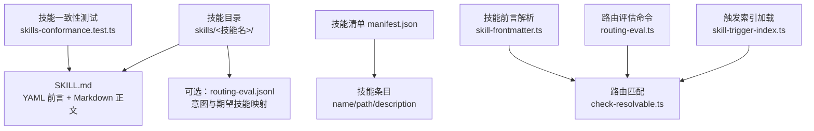
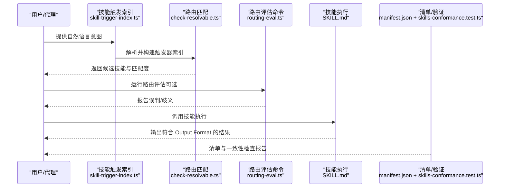
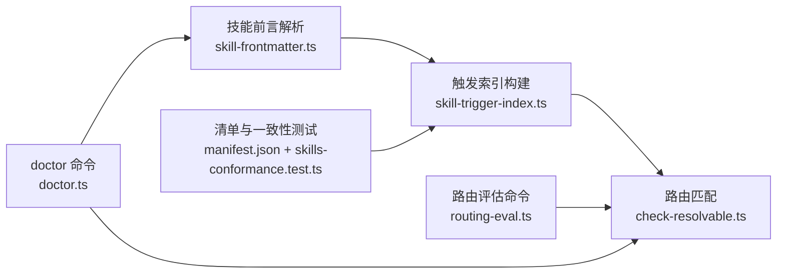

# 技能定义格式

<cite>
**本文引用的文件**
- [SKILL.md（示例：reference-pack）](file://examples/skillpack-reference/skills/reference-pack/SKILL.md)
- [SKILL.md（示例：ask-user）](file://skills/ask-user/SKILL.md)
- [SKILL.md（示例：brain-taxonomist）](file://skills/brain-taxonomist/SKILL.md)
- [技能清单 manifest.json](file://skills/manifest.json)
- [技能一致性测试 skills-conformance.test.ts](file://test/skills-conformance.test.ts)
- [技能触发索引与解析核心 check-resolvable.ts](file://src/core/check-resolvable.ts)
- [技能触发索引加载 skill-trigger-index.ts](file://src/core/skill-trigger-index.ts)
- [路由评估命令 routing-eval.ts](file://src/commands/routing-eval.ts)
- [技能开发指南 skill-development.md](file://docs/guides/skill-development.md)
- [技能包清单校验 test/skillpack-manifest-v1.test.ts](file://test/skillpack-manifest-v1.test.ts)
- [变更日志（触发器与路由相关） CHANGELOG.md](file://CHANGELOG.md)
- [前端内容解析与校验 markdown.ts](file://src/core/markdown.ts)
- [技能前言解析 skill-frontmatter.ts](file://src/core/skill-frontmatter.ts)
- [技能清单 doctor 命令（含技能检查） doctor.ts](file://src/commands/doctor.ts)
</cite>

## 目录
1. [简介](#简介)
2. [项目结构](#项目结构)
3. [核心组件](#核心组件)
4. [架构总览](#架构总览)
5. [详细组件分析](#详细组件分析)
6. [依赖关系分析](#依赖关系分析)
7. [性能考量](#性能考量)
8. [故障排查指南](#故障排查指南)
9. [结论](#结论)
10. [附录：字段参考手册](#附录字段参考手册)

## 简介
本规范文档面向“技能定义格式”，聚焦 SKILL.md 的 YAML/Markdown 语法、字段定义、验证规则、元数据配置、输入输出规范与工具接口定义。文档基于仓库中实际实现与测试用例，总结出统一的技能定义标准，并给出字段参考、分类与标签系统、路由规则、格式验证工具与常见错误处理方法。

## 项目结构
技能定义位于每个技能目录下的 SKILL.md 文件，采用 YAML 前言（frontmatter）+ Markdown 正文的结构；技能清单 manifest.json 列举所有技能及其路径；路由与触发器由技能前言中的 triggers 字段驱动；一致性与质量由测试与命令行工具保障。

图表来源
- [技能清单 manifest.json:1-281](file://skills/manifest.json#L1-L281)
- [技能触发索引加载 skill-trigger-index.ts:1-200](file://src/core/skill-trigger-index.ts#L1-L200)
- [路由评估命令 routing-eval.ts:1-200](file://src/commands/routing-eval.ts#L1-L200)
- [技能触发解析 check-resolvable.ts:300-500](file://src/core/check-resolvable.ts#L300-L500)
- [技能一致性测试 skills-conformance.test.ts:1-106](file://test/skills-conformance.test.ts#L1-L106)

章节来源
- [技能清单 manifest.json:1-281](file://skills/manifest.json#L1-L281)
- [技能一致性测试 skills-conformance.test.ts:1-106](file://test/skills-conformance.test.ts#L1-L106)

## 核心组件
- YAML 前言（必填字段）
  - name：技能名称（字符串），用于唯一标识与展示
  - description：技能描述（字符串或多行字符串）
  - triggers：触发短语数组（字符串数组），用于路由
- 可选字段
  - version：语义化版本号（字符串）
  - mutating：是否产生写入（布尔）
  - priority：优先级（数值），影响匹配策略
  - prompt_version：提示词版本（数值）
  - 其他自定义键：作为技能元数据使用
- 正文结构
  - 必须包含若干章节标题：Contract、Anti-Patterns、Output Format 等
  - 输出格式应明确、可复现
- 路由与清单
  - 触发器来源于 SKILL.md 前言 triggers
  - manifest.json 中列出技能 name、path、description
  - 路由评估通过 routing-eval.jsonl 验证意图覆盖

章节来源
- [SKILL.md（示例：ask-user）:1-254](file://skills/ask-user/SKILL.md#L1-L254)
- [SKILL.md（示例：brain-taxonomist）:1-196](file://skills/brain-taxonomist/SKILL.md#L1-L196)
- [技能清单 manifest.json:1-281](file://skills/manifest.json#L1-L281)
- [技能一致性测试 skills-conformance.test.ts:63-92](file://test/skills-conformance.test.ts#L63-L92)

## 架构总览
技能定义的端到端流程如下：用户/代理提出意图 → 匹配 SKILL.md 前言 triggers → 执行技能 → 产出符合 Output Format 的结果。

图表来源
- [技能触发索引加载 skill-trigger-index.ts:1-200](file://src/core/skill-trigger-index.ts#L1-L200)
- [路由评估命令 routing-eval.ts:1-200](file://src/commands/routing-eval.ts#L1-L200)
- [技能触发解析 check-resolvable.ts:300-500](file://src/core/check-resolvable.ts#L300-L500)
- [技能清单 manifest.json:1-281](file://skills/manifest.json#L1-L281)
- [技能一致性测试 skills-conformance.test.ts:1-106](file://test/skills-conformance.test.ts#L1-L106)

## 详细组件分析

### YAML 前言字段定义与验证规则
- 必填字段
  - name：字符串，建议为小写连字符形式，需在技能清单中唯一
  - description：字符串或多行字符串，简述技能用途
  - triggers：数组，至少包含 1 个触发短语；用于路由匹配
- 可选字段
  - version：语义化版本（如 1.0.0）
  - mutating：布尔，指示是否会产生写入行为
  - priority：数值，用于路由排序与冲突消解
  - prompt_version：提示词版本号
- 验证规则（来自测试与实现）
  - 前言必须以 YAML 三短横线分隔符包裹
  - 每个技能必须包含 name 与 description
  - 必须包含 Contract、Anti-Patterns、Output Format 等关键章节
  - 不允许重复的技能名称
  - triggers 数组不能为空且应具备现实意图覆盖
- 默认值
  - 若未显式声明 version，按需约定默认值（如 1.0.0）
  - mutating 默认未设置时，路由与审计逻辑可能按只读处理
  - priority 未设置时，按实现默认策略处理

章节来源
- [技能一致性测试 skills-conformance.test.ts:67-92](file://test/skills-conformance.test.ts#L67-L92)
- [SKILL.md（示例：ask-user）:1-254](file://skills/ask-user/SKILL.md#L1-L254)
- [SKILL.md（示例：brain-taxonomist）:1-196](file://skills/brain-taxonomist/SKILL.md#L1-L196)

### 输入输出规范与工具接口
- 输入
  - 用户意图文本（自然语言）
  - 技能前言 triggers 作为匹配依据
- 输出
  - 明确的输出格式（Output Format 章节）
  - 可复现的建议/决策/消息体
- 工具接口
  - 路由评估：通过 routing-eval.jsonl 固化意图与期望技能映射
  - 质量门禁：doctor 与一致性测试确保技能完整性
  - 自动优化：skillopt 可对技能正文进行迭代优化（不修改 triggers）

章节来源
- [SKILL.md（示例：ask-user）:236-254](file://skills/ask-user/SKILL.md#L236-L254)
- [路由评估命令 routing-eval.ts:1-200](file://src/commands/routing-eval.ts#L1-L200)
- [技能开发指南 skill-development.md:1-132](file://docs/guides/skill-development.md#L1-L132)

### 技能分类、标签系统与 MECE
- 分类
  - 以技能职责划分：查询、增强、维护、编排、迁移等
  - 以写入属性划分：只读技能（mutating=false）、写入技能
- 标签系统
  - 建议在前言中扩展自定义键（如 category、domain）以支持筛选与聚合
- MECE
  - 各实体类型/信号源仅有一个拥有者技能
  - 避免重复创建同一路径的页面
  - 在设计阶段进行所有权表核对

章节来源
- [技能开发指南 skill-development.md:59-96](file://docs/guides/skill-development.md#L59-L96)
- [技能清单 manifest.json:1-281](file://skills/manifest.json#L1-L281)

### 路由规则与触发器管理
- 触发器来源
  - SKILL.md 前言 triggers 数组
  - 可选：RESOLVER.md/AGENTS.md 表格行（向后兼容桥接）
- 匹配策略
  - 多文件合并索引（技能前言 triggers + RESOLVER/AGENTS 表格）
  - 去重与模糊匹配，避免歧义
- 评估与修复
  - 使用 routing-eval 命令评估真实意图覆盖
  - 通过 doctor 与一致性测试定位问题

章节来源
- [技能触发索引加载 skill-trigger-index.ts:1-200](file://src/core/skill-trigger-index.ts#L1-L200)
- [路由评估命令 routing-eval.ts:1-200](file://src/commands/routing-eval.ts#L1-L200)
- [技能触发解析 check-resolvable.ts:300-500](file://src/core/check-resolvable.ts#L300-L500)
- [变更日志（触发器与路由相关） CHANGELOG.md:6008-6100](file://CHANGELOG.md#L6008-L6100)

### 格式验证工具与常见错误
- 内置校验
  - 前言三短横线分隔符存在性
  - 必填字段存在性（name、description）
  - 关键章节存在性（Contract、Anti-Patterns、Output Format）
  - 重复技能名称检测
- 前言解析与错误收集
  - 解析失败时回退为无前言内容，保留正文
  - 收集常见问题：空前言、缺失开头、嵌套引号、非字符串字段等
- 命令行工具
  - doctor：快速技能一致性检查
  - routing-eval：结构化路由评估
  - check-resolvable：解析并校验触发器索引

章节来源
- [技能一致性测试 skills-conformance.test.ts:67-106](file://test/skills-conformance.test.ts#L67-L106)
- [前端内容解析与校验 markdown.ts:106-346](file://src/core/markdown.ts#L106-L346)
- [技能前言解析 skill-frontmatter.ts:1-200](file://src/core/skill-frontmatter.ts#L1-L200)
- [技能触发索引加载 skill-trigger-index.ts:1-200](file://src/core/skill-trigger-index.ts#L1-L200)
- [路由评估命令 routing-eval.ts:1-200](file://src/commands/routing-eval.ts#L1-L200)
- [技能清单 doctor 命令（含技能检查） doctor.ts:7379-7525](file://src/commands/doctor.ts#L7379-L7525)

## 依赖关系分析
技能定义格式依赖于以下模块与流程：

图表来源
- [技能前言解析 skill-frontmatter.ts:1-200](file://src/core/skill-frontmatter.ts#L1-L200)
- [技能触发索引加载 skill-trigger-index.ts:1-200](file://src/core/skill-trigger-index.ts#L1-L200)
- [路由评估命令 routing-eval.ts:1-200](file://src/commands/routing-eval.ts#L1-L200)
- [技能触发解析 check-resolvable.ts:300-500](file://src/core/check-resolvable.ts#L300-L500)
- [技能清单 doctor 命令（含技能检查） doctor.ts:7379-7525](file://src/commands/doctor.ts#L7379-L7525)
- [技能清单 manifest.json:1-281](file://skills/manifest.json#L1-L281)
- [技能一致性测试 skills-conformance.test.ts:1-106](file://test/skills-conformance.test.ts#L1-L106)

章节来源
- [技能触发索引加载 skill-trigger-index.ts:1-200](file://src/core/skill-trigger-index.ts#L1-L200)
- [路由评估命令 routing-eval.ts:1-200](file://src/commands/routing-eval.ts#L1-L200)
- [技能触发解析 check-resolvable.ts:300-500](file://src/core/check-resolvable.ts#L300-L500)
- [技能清单 doctor 命令（含技能检查） doctor.ts:7379-7525](file://src/commands/doctor.ts#L7379-L7525)
- [技能清单 manifest.json:1-281](file://skills/manifest.json#L1-L281)
- [技能一致性测试 skills-conformance.test.ts:1-106](file://test/skills-conformance.test.ts#L1-L106)

## 性能考量
- 触发器索引构建与去重在内存中完成，建议控制 triggers 数量与长度，避免过长列表导致匹配开销上升
- 路由评估命令可离线运行，建议在 CI 中缓存中间产物
- 前言解析与正文拆分在本地执行，注意大文件的 I/O 与内存占用

## 故障排查指南
- 常见问题与修复
  - 缺少 YAML 三短横线分隔符：在文件顶部添加
  - 必填字段缺失：补齐 name、description
  - 缺少关键章节：补充 Contract、Anti-Patterns、Output Format
  - 重复技能名称：调整 name 或修正清单
  - triggers 为空或覆盖不足：增加真实意图短语，使用 routing-eval 评估
- 工具链
  - 使用 doctor 快速检查技能完整性
  - 使用 routing-eval 定位误判与歧义
  - 使用 check-resolvable 校验触发器索引与 RESOLVER/AGENTS 表格一致性

章节来源
- [技能一致性测试 skills-conformance.test.ts:67-106](file://test/skills-conformance.test.ts#L67-L106)
- [路由评估命令 routing-eval.ts:1-200](file://src/commands/routing-eval.ts#L1-L200)
- [技能清单 doctor 命令（含技能检查） doctor.ts:7379-7525](file://src/commands/doctor.ts#L7379-L7525)

## 结论
SKILL.md 通过标准化的 YAML 前言与 Markdown 正文，提供了清晰的技能元数据、路由触发器与输出规范。结合清单、触发索引、路由评估与一致性测试，形成从设计到发布的闭环。遵循本规范可显著提升技能的可发现性、可维护性与可演进性。

## 附录：字段参考手册
- 必填字段
  - name：字符串，技能唯一标识，建议小写连字符
  - description：字符串或多行字符串，简述用途
  - triggers：数组，至少 1 个触发短语
- 可选字段
  - version：语义化版本（如 1.0.0）
  - mutating：布尔，是否产生写入
  - priority：数值，影响路由排序
  - prompt_version：提示词版本号
  - 其他自定义键：用于分类、领域等扩展
- 默认值
  - version：未设置时按需约定默认值
  - mutating：未设置时按实现默认策略处理
  - priority：未设置时按实现默认策略处理
- 关键章节
  - Contract：技能契约与约束
  - Anti-Patterns：禁止模式与反面案例
  - Output Format：输出格式与示例
- 路由与清单
  - triggers 来源于 SKILL.md 前言
  - manifest.json 列出技能 name、path、description
  - routing-eval.jsonl 固化意图与期望技能映射

章节来源
- [SKILL.md（示例：ask-user）:1-254](file://skills/ask-user/SKILL.md#L1-L254)
- [SKILL.md（示例：brain-taxonomist）:1-196](file://skills/brain-taxonomist/SKILL.md#L1-L196)
- [技能清单 manifest.json:1-281](file://skills/manifest.json#L1-L281)
- [技能开发指南 skill-development.md:1-132](file://docs/guides/skill-development.md#L1-L132)