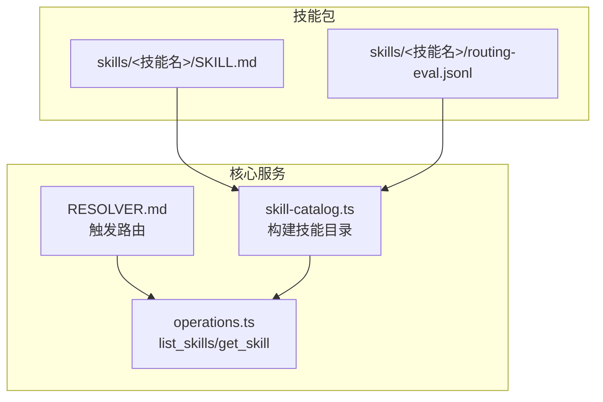
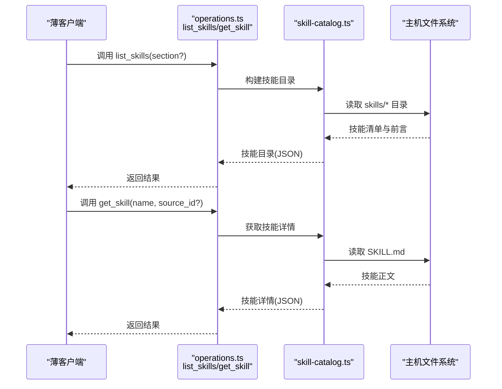
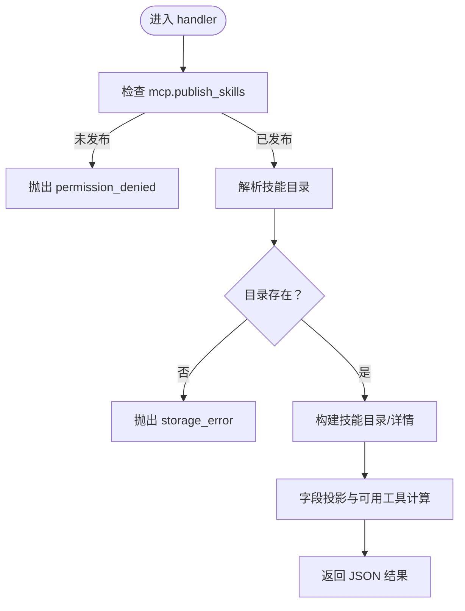
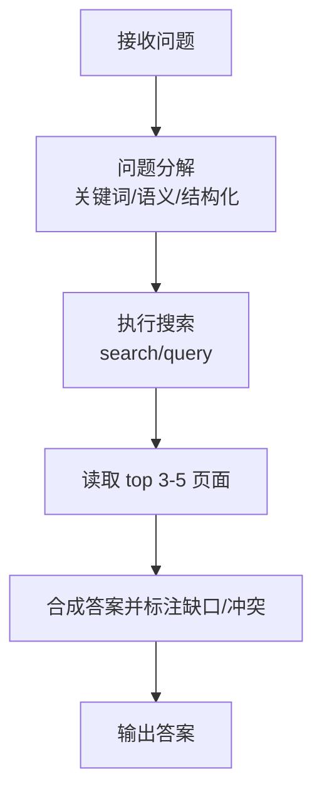
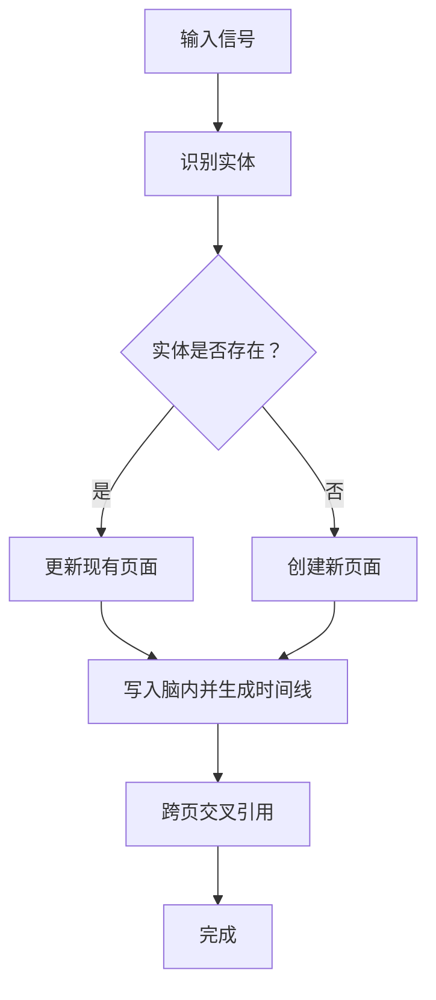
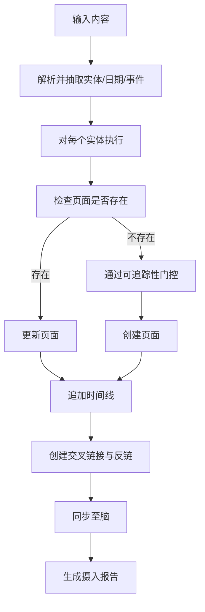
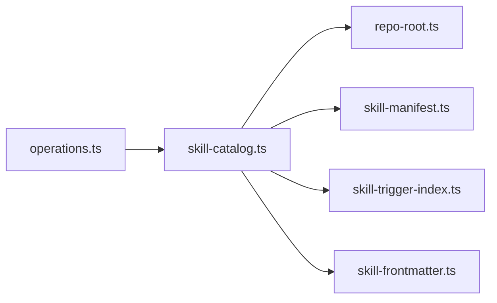
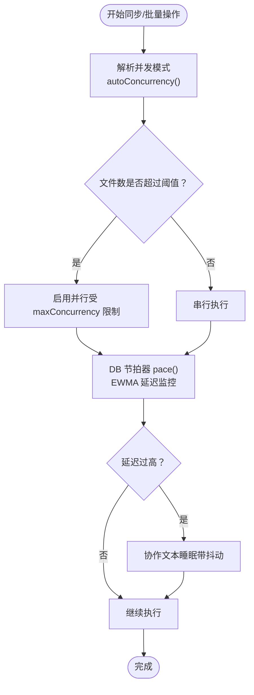

# 技能实现指南

<cite>
**本文档引用的文件**
- [README.md](file://README.md)
- [skills/RESOLVER.md](file://skills/RESOLVER.md)
- [docs/skillpack-anatomy.md](file://docs/skillpack-anatomy.md)
- [src/core/operations.ts](file://src/core/operations.ts)
- [src/core/skill-catalog.ts](file://src/core/skill-catalog.ts)
- [skills/query/SKILL.md](file://skills/query/SKILL.md)
- [skills/enrich/SKILL.md](file://skills/enrich/SKILL.md)
- [skills/ingest/SKILL.md](file://skills/ingest/SKILL.md)
- [test/skills-conformance.test.ts](file://test/skills-conformance.test.ts)
- [test/operations-descriptions.test.ts](file://test/operations-descriptions.test.ts)
- [test/skill-catalog.test.ts](file://test/skill-catalog.test.ts)
- [test/skill-catalog-transports.test.ts](file://test/skill-catalog-transports.test.ts)
- [test/sync-concurrency.test.ts](file://test/sync-concurrency.test.ts)
- [src/core/sync-concurrency.ts](file://src/core/sync-concurrency.ts)
- [src/core/pace-mode.ts](file://src/core/pace-mode.ts)
- [test/pace-mode.test.ts](file://test/pace-mode.test.ts)
- [src/core/operations.ts](file://src/core/operations.ts)
- [test/skillopt/lock.test.ts](file://test/skillopt/lock.test.ts)
- [test/skillopt/concurrent-runs.serial.test.ts](file://test/skillopt/concurrent-runs.serial.test.ts)
</cite>

## 目录
1. [简介](#简介)
2. [项目结构](#项目结构)
3. [核心组件](#核心组件)
4. [架构总览](#架构总览)
5. [详细组件分析](#详细组件分析)
6. [依赖关系分析](#依赖关系分析)
7. [性能考虑](#性能考虑)
8. [故障排查指南](#故障排查指南)
9. [结论](#结论)
10. [附录](#附录)

## 简介
本指南面向在 GBrain 生态中开发“技能（Skill）”的工程师与作者，系统阐述技能函数的编写规范、参数处理与返回值格式，给出查询型、转换型与复合型技能的实现模式，并覆盖错误处理、异常捕获、状态管理、性能优化、并发控制与资源管理等关键主题。文档以仓库中的真实实现为依据，辅以可视化图示帮助理解。

## 项目结构
- 技能以“技能包（Skillpack）”形式组织，每个技能由一个 SKILL.md 文件定义，配合路由评估文件与可选的运行手册、测试与评测配置。
- 核心运行时通过 MCP 暴露 list_skills/get_skill 等操作，供薄客户端发现并按“遵循说明而非执行代码”的方式使用。
- 技能解析与分发由 skills/RESOLVER.md 驱动，支持触发词匹配与多技能链式组合。

图表来源
- [docs/skillpack-anatomy.md:1-113](file://docs/skillpack-anatomy.md#L1-L113)
- [src/core/operations.ts:2230-2286](file://src/core/operations.ts#L2230-L2286)
- [src/core/skill-catalog.ts:1-200](file://src/core/skill-catalog.ts#L1-L200)
- [skills/RESOLVER.md:1-137](file://skills/RESOLVER.md#L1-L137)

章节来源
- [README.md:261-261](file://README.md#L261-L261)
- [docs/skillpack-anatomy.md:1-113](file://docs/skillpack-anatomy.md#L1-L113)
- [skills/RESOLVER.md:1-137](file://skills/RESOLVER.md#L1-L137)

## 核心组件
- 技能目录与操作
  - list_skills：读取技能目录，返回技能清单与可用工具集合；支持按 section 过滤。
  - get_skill：按名称获取技能正文与可用工具列表；支持从“脑内技能包”源获取。
  - list_brain_skillpack：列出当前脑内已安装的技能包及其目标 schema pack。
- 技能解析与投影
  - 解析 SKILL.md 前言字段，投影到安全字段集，过滤私有信息（如 writes_to），并计算 caller 可用工具集合。
- 发布门控与信任边界
  - 通过 mcp.publish_skills 控制是否向薄客户端暴露技能目录；路径受限于解析后的技能目录，避免越权访问。

章节来源
- [src/core/operations.ts:2230-2286](file://src/core/operations.ts#L2230-L2286)
- [src/core/skill-catalog.ts:1-200](file://src/core/skill-catalog.ts#L1-L200)
- [test/operations-descriptions.test.ts:149-189](file://test/operations-descriptions.test.ts#L149-L189)
- [test/skill-catalog.test.ts:62-91](file://test/skill-catalog.test.ts#L62-L91)

## 架构总览
下图展示薄客户端如何通过 MCP 获取技能目录与技能详情，并基于技能说明调用后端工具完成任务。

图表来源
- [src/core/operations.ts:2230-2286](file://src/core/operations.ts#L2230-L2286)
- [src/core/skill-catalog.ts:1-200](file://src/core/skill-catalog.ts#L1-L200)

## 详细组件分析

### 组件A：技能目录与操作（list_skills/get_skill）
- 设计要点
  - 仅读取权限，非本地限制，允许薄客户端通过 HTTP 访问。
  - 发布门控：需启用 mcp.publish_skills；远程调用强制校验，本地调用绕过。
  - 路径约束：仅允许在解析出的技能目录内访问，禁止越界。
  - 字段投影：仅返回安全字段，丢弃敏感字段（如 writes_to）。
- 参数与返回
  - list_skills：可选 section 过滤；返回 schema_version、skills_dir_source、count、skills 列表与 instructions。
  - get_skill：必填 name；可选 source_id（用于从特定源的脑内技能包获取）；返回 schema_version、name、frontmatter 投影、body、usable_tools、unavailable_tools、client_guidance。
- 错误处理
  - 存储错误：当技能目录不存在或被禁用时抛出相应错误码。
  - 权限拒绝：未发布时拒绝远程调用。
  - 大小限制：对单个 SKILL.md 设置最大读取字节数，防止内存膨胀。

图表来源
- [src/core/operations.ts:2230-2286](file://src/core/operations.ts#L2230-L2286)
- [src/core/skill-catalog.ts:1-200](file://src/core/skill-catalog.ts#L1-L200)

章节来源
- [src/core/operations.ts:2230-2286](file://src/core/operations.ts#L2230-L2286)
- [src/core/skill-catalog.ts:1-200](file://src/core/skill-catalog.ts#L1-L200)
- [test/operations-descriptions.test.ts:149-189](file://test/operations-descriptions.test.ts#L149-L189)
- [test/skill-catalog.test.ts:62-91](file://test/skill-catalog.test.ts#L62-L91)
- [test/skill-catalog-transports.test.ts:1-31](file://test/skill-catalog-transports.test.ts#L1-L31)

### 组件B：查询型技能（query）
- 典型职责
  - 使用三层检索（关键词/混合/结构化）与合成回答，确保每条主张都有来源引用。
  - 支持图遍历（graph-query）以回答关系类问题。
- 实现模式
  - 分阶段执行：问题分解 → 执行搜索 → 读取上下文 → 合成答案 → 标注缺口与冲突。
  - 输出格式：直接回答 + 引用 + 缺口标志 + 冲突说明。
- 参数与返回
  - 输入：用户问题文本。
  - 工具：search、query、get_page、list_pages、get_backlinks、traverse_graph、get_timeline。
  - 返回：合成答案（含引用与缺口标注）。
- 错误处理
  - 当搜索质量异常时，建议通过 doctor 诊断与对比不同检索模式定位问题。

图表来源
- [skills/query/SKILL.md:45-156](file://skills/query/SKILL.md#L45-L156)

章节来源
- [skills/query/SKILL.md:1-156](file://skills/query/SKILL.md#L1-L156)

### 组件C：转换型技能（enrich）
- 典型职责
  - 对人/公司页面进行分级充实（Tier 1-3），生成编译真相、时间线与反链。
- 实现模式
  - 识别实体 → 检查脑内状态 → 提取信号 → 外部数据源检索 → 保存原始数据 → 写入脑内 → 跨页交叉引用。
  - 模板化页面：提供人物与公司页面模板，要求每个更新都保留来源引用。
- 参数与返回
  - 输入：信号（会议记录、邮件、外部资料等）。
  - 工具：get_page、put_page、search、query、add_link、add_timeline_entry、get_backlinks。
  - 返回：充实后的页面内容与时间线。
- 错误处理
  - 验证规则：避免覆盖用户直接陈述、跳过无显著关联实体、保存原始数据以便审计。

图表来源
- [skills/enrich/SKILL.md:87-350](file://skills/enrich/SKILL.md#L87-L350)

章节来源
- [skills/enrich/SKILL.md:1-350](file://skills/enrich/SKILL.md#L1-L350)

### 组件D：复合型技能（ingest）
- 典型职责
  - 将会议、文章、媒体、文档与社交媒体内容统一摄入到脑中，自动检测实体并建立反链。
- 实现模式
  - 解析输入 → 检测实体 → 更新/创建页面 → 追加时间线 → 创建交叉链接与反链 → 同步至脑。
  - 媒体工作流：视频/播客需保留转录文件；PDF/文档需保留原始来源；文章需提取摘要与关键观点。
- 参数与返回
  - 输入：URL、文件路径、转录文本等。
  - 工具：search、get_page、put_page、add_link、add_timeline_entry、sync_brain。
  - 返回：摄入报告（页面、实体、反链、时间线、原始来源）。
- 错误处理
  - 原始来源保留：所有摄入项必须保留原始来源以便溯源；违反将导致“不可验证”的页面。

图表来源
- [skills/ingest/SKILL.md:56-312](file://skills/ingest/SKILL.md#L56-L312)

章节来源
- [skills/ingest/SKILL.md:1-312](file://skills/ingest/SKILL.md#L1-L312)

### 组件E：技能包与路由（RESOLVER.md）
- 路由策略
  - 按触发词精确匹配，支持多技能链式组合（如 ingest 后 enrich）。
  - 针对“总是在线”的技能（信号检测、脑操作）与“按需”的技能（查询、摄入、维护）分别列出。
- 触发词示例
  - 查询类：what do we know about、tell me about、who is、search for、graph query。
  - 摄入类：capture this、save this thought、watch this video、process this PDF。
  - 维护类：EIIRP、validate frontmatter、citation audit、eval results、harvest skill。
- 最佳实践
  - 明确技能职责边界，避免重复触发；必要时在技能说明中声明“选择门”（ask-user）以处理歧义。

章节来源
- [skills/RESOLVER.md:1-137](file://skills/RESOLVER.md#L1-L137)

## 依赖关系分析
- 操作层依赖
  - list_skills/get_skill 动态导入 skill-catalog.ts，避免循环依赖；同时依赖 operations.ts 的 Operation 接口与错误类型。
- 技能目录依赖
  - skill-catalog.ts 依赖 repo-root.ts（自动探测技能目录）、skill-manifest.ts（清单）、skill-trigger-index.ts（触发索引）、skill-frontmatter.ts（前言解析）。
- 测试覆盖
  - operations-descriptions.test.ts：验证 list_skills/get_skill 描述与协议一致性。
  - skill-catalog.test.ts：验证 section 过滤、工具可用性、指令包形状。
  - skill-catalog-transports.test.ts：验证远程/本地传输门控与作用域。

图表来源
- [src/core/operations.ts:2230-2286](file://src/core/operations.ts#L2230-L2286)
- [src/core/skill-catalog.ts:1-200](file://src/core/skill-catalog.ts#L1-L200)

章节来源
- [test/operations-descriptions.test.ts:149-189](file://test/operations-descriptions.test.ts#L149-L189)
- [test/skill-catalog.test.ts:62-91](file://test/skill-catalog.test.ts#L62-L91)
- [test/skill-catalog-transports.test.ts:1-31](file://test/skill-catalog-transports.test.ts#L1-L31)

## 性能考虑
- 并发策略
  - 自动并发：根据引擎类型（PGLite/Postgres）与文件数量动态决定并发度；PGLite 强制串行，Postgres 在阈值以上自动并发。
  - 工作线程解析：严格校验 CLI 输入，非法值抛错；默认并发数与阈值常量集中管理。
- 速率与节流
  - MCP 层面对 list_skills/get_skill 进行速率限制，避免滥用。
  - DB 节拍器（pace-mode）：通过 EWMA 平滑延迟与睡眠上限，动态调节并发，避免池槽枯竭。
- I/O 与内存
  - 技能详情读取设置最大字节数，防止大文件导致内存膨胀。
  - 原始来源上传采用分块与重传机制，避免长耗时阻塞。

图表来源
- [src/core/sync-concurrency.ts:1-22](file://src/core/sync-concurrency.ts#L1-L22)
- [test/sync-concurrency.test.ts:1-36](file://test/sync-concurrency.test.ts#L1-L36)
- [src/core/pace-mode.ts:37-60](file://src/core/pace-mode.ts#L37-L60)
- [test/pace-mode.test.ts:1-111](file://test/pace-mode.test.ts#L1-L111)

章节来源
- [src/core/sync-concurrency.ts:1-22](file://src/core/sync-concurrency.ts#L1-L22)
- [test/sync-concurrency.test.ts:1-36](file://test/sync-concurrency.test.ts#L1-L36)
- [src/core/pace-mode.ts:37-60](file://src/core/pace-mode.ts#L37-L60)
- [test/pace-mode.test.ts:1-111](file://test/pace-mode.test.ts#L1-L111)

## 故障排查指南
- 技能目录不可用
  - 确认 mcp.publish_skills 已启用；检查 mcp.skills_dir 是否正确配置且目录存在。
  - 若为远程调用，确认薄客户端具备 read 权限。
- 并发与锁竞争
  - run_skillopt 等变更型操作使用 DB 锁防并发冲突；若提示 lock_busy，等待后再试或检查历史运行状态。
- 搜索质量异常
  - 使用 doctor 检查索引健康；对比 search 与 query 的差异，定位嵌入覆盖或检索模式问题。
- 原始来源缺失
  - 摄入流程必须保留原始来源；缺失将导致页面不可验证，应优先修复数据管线。

章节来源
- [src/core/operations.ts:2230-2286](file://src/core/operations.ts#L2230-L2286)
- [test/skillopt/lock.test.ts:71-94](file://test/skillopt/lock.test.ts#L71-L94)
- [test/skillopt/concurrent-runs.serial.test.ts:40-77](file://test/skillopt/concurrent-runs.serial.test.ts#L40-L77)
- [skills/ingest/SKILL.md:219-312](file://skills/ingest/SKILL.md#L219-L312)

## 结论
本指南总结了 GBrain 技能体系的实现范式：以 SKILL.md 为“说明书”，通过 list_skills/get_skill 为薄客户端提供安全、可控的技能发现与使用入口；围绕查询、转换与复合三类场景，给出了可复用的流程模型与最佳实践。结合并发策略、速率限制与 DB 节拍器，可在保证稳定性的同时提升吞吐。建议在新增技能时参考 RESOLVER.md 的路由约定与质量规则，确保与现有生态协同一致。

## 附录
- 技能包结构与清单
  - 技能包包含 skillpack.json、skills/<skill>/SKILL.md、routing-eval.jsonl、runbooks、test、evals 等；清单由 manifest.json 管理。
- 质量与合规
  - 测试用例覆盖技能一致性、描述协议与目录传输门控；建议在发布前运行 doctor 并通过 rubric 评分。

章节来源
- [docs/skillpack-anatomy.md:1-113](file://docs/skillpack-anatomy.md#L1-L113)
- [test/skills-conformance.test.ts:1-72](file://test/skills-conformance.test.ts#L1-L72)