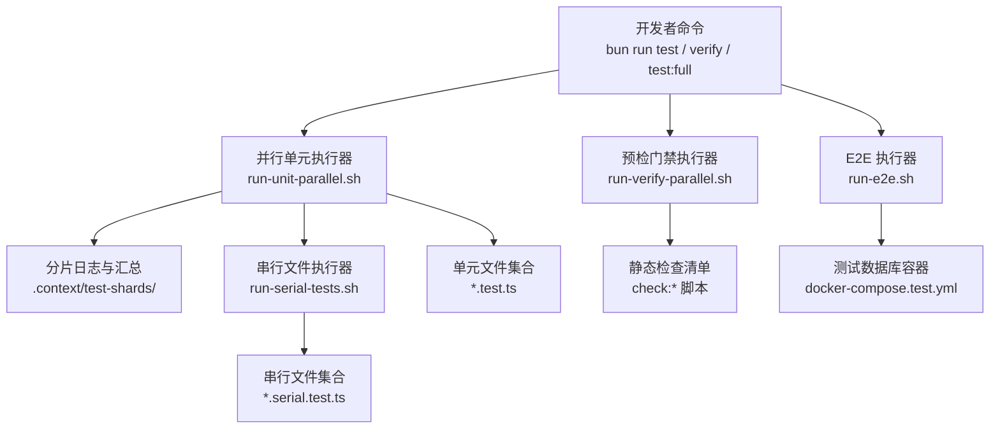
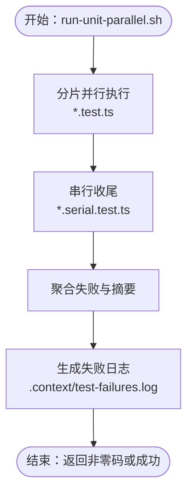
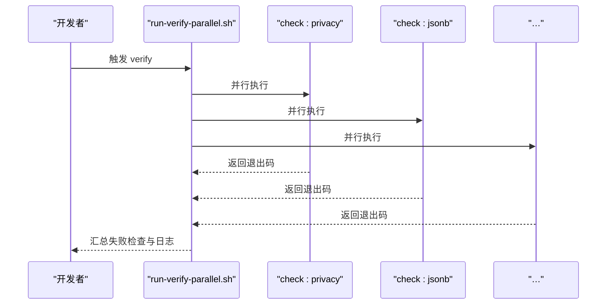
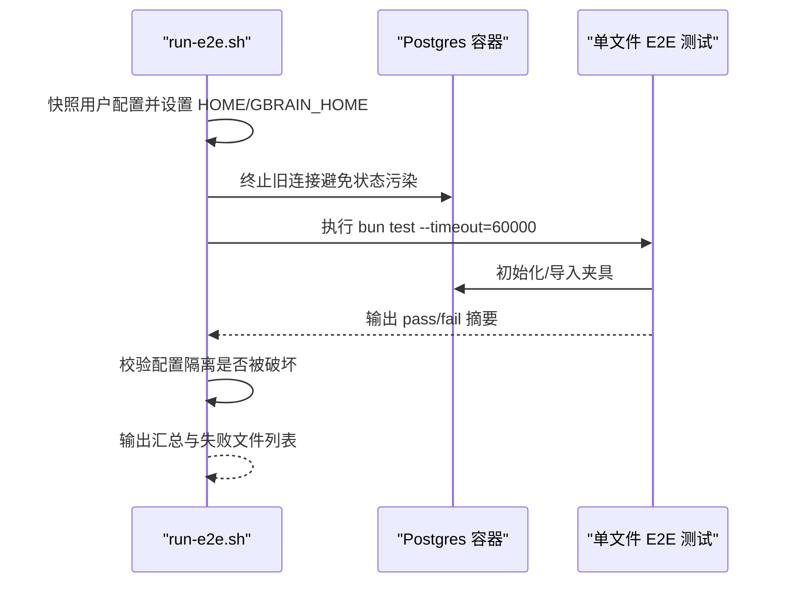
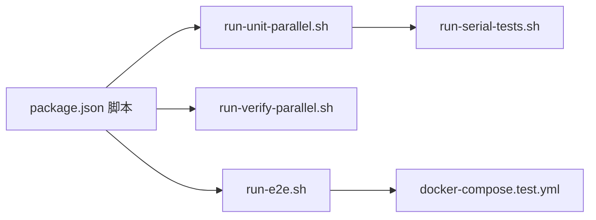

# 技能测试与调试

<cite>
**本文引用的文件**
- [README.md](file://README.md)
- [docs/TESTING.md](file://docs/TESTING.md)
- [CONTRIBUTING.md](file://CONTRIBUTING.md)
- [package.json](file://package.json)
- [scripts/run-unit-parallel.sh](file://scripts/run-unit-parallel.sh)
- [scripts/run-verify-parallel.sh](file://scripts/run-verify-parallel.sh)
- [scripts/run-e2e.sh](file://scripts/run-e2e.sh)
- [scripts/run-serial-tests.sh](file://scripts/run-serial-tests.sh)
- [scripts/run-slow-tests.sh](file://scripts/run-slow-tests.sh)
- [scripts/profile-tests.sh](file://scripts/profile-tests.sh)
- [docker-compose.test.yml](file://docker-compose.test.yml)
</cite>

## 目录
1. [引言](#引言)
2. [项目结构](#项目结构)
3. [核心组件](#核心组件)
4. [架构总览](#架构总览)
5. [详细组件分析](#详细组件分析)
6. [依赖关系分析](#依赖关系分析)
7. [性能考量](#性能考量)
8. [故障排查指南](#故障排查指南)
9. [结论](#结论)
10. [附录](#附录)

## 引言
本指南面向技能开发者与贡献者，系统化阐述 GBrain 的测试与调试体系：包括单元测试编写方法、集成测试策略、端到端（E2E）测试框架；测试数据准备、模拟环境配置与断言验证；调试工具使用、日志分析与性能分析；测试覆盖率与质量门禁；以及如何通过评估工具验证技能效果。目标是帮助你在本地快速建立高可靠、可重复的测试闭环，并在 CI 中稳定运行。

## 项目结构
- 测试分层与命令
  - 单元测试（并行快速循环）：bun run test
  - 预推送门禁（verify）：bun run verify
  - 全量本地验证：bun run test:full
  - 慢路径测试：bun run test:slow
  - 串行隔离测试：bun run test:serial
  - 真实数据库 E2E：bun run test:e2e
  - 重负载/回归脚本：bun run test:heavy
- 脚本职责
  - 并行单元测试执行与失败聚合：scripts/run-unit-parallel.sh
  - 并行预检门禁：scripts/run-verify-parallel.sh
  - 顺序 E2E 执行与 HOME 隔离：scripts/run-e2e.sh
  - 串行文件执行：scripts/run-serial-tests.sh
  - 慢文件执行：scripts/run-slow-tests.sh
  - 性能剖析：scripts/profile-tests.sh
- 数据库与容器
  - 测试数据库容器：docker-compose.test.yml（默认端口 5434）

章节来源
- [README.md:428-435](file://README.md#L428-L435)
- [package.json:31-88](file://package.json#L31-L88)
- [docs/TESTING.md:6-25](file://docs/TESTING.md#L6-L25)

## 核心组件
- 测试命令层级与适用场景
  - 单元测试（并行）：8 分片并行 + 串行收尾，适合内循环开发与回归
  - 预推送门禁（verify）：30+ 静态检查 + 类型检查，CI 专属
  - 全量验证（test:full）：verify + 并行单元 + 慢路径 + 智能 E2E
  - 慢路径测试：仅运行 *.slow.test.ts，避免拖慢内循环
  - 串行测试：*.serial.test.ts，跨文件状态共享或顶层 mock 的隔离需求
  - E2E：真实 Postgres+pgvector，覆盖引擎差异与批量写入路径
  - 重负载回归：tests/heavy 下的 shell 脚本，用于资源/并发回归
- 隔离与稳定性
  - 进程级隔离：串行文件每个文件独立进程，避免模块注册表泄漏
  - HOME/GBRAIN_HOME 隔离：E2E 前后快照用户配置，防止污染
  - PGLite 初始化模式：统一 beforeAll/connect/initSchema/afterAll 断开
  - 环境变量隔离：withEnv 包装，避免跨测试污染

章节来源
- [docs/TESTING.md:6-25](file://docs/TESTING.md#L6-L25)
- [docs/TESTING.md:47-115](file://docs/TESTING.md#L47-L115)
- [docs/TESTING.md:116-216](file://docs/TESTING.md#L116-L216)
- [docs/TESTING.md:217-248](file://docs/TESTING.md#L217-L248)
- [CONTRIBUTING.md:52-90](file://CONTRIBUTING.md#L52-L90)
- [CONTRIBUTING.md:91-147](file://CONTRIBUTING.md#L91-L147)

## 架构总览
下图展示测试流水线与关键脚本之间的交互关系，体现“并行单元 → 串行收尾 → 预检门禁 → E2E”的执行顺序与隔离策略。

图表来源
- [scripts/run-unit-parallel.sh:1-430](file://scripts/run-unit-parallel.sh#L1-L430)
- [scripts/run-serial-tests.sh:1-59](file://scripts/run-serial-tests.sh#L1-L59)
- [scripts/run-verify-parallel.sh:1-203](file://scripts/run-verify-parallel.sh#L1-L203)
- [scripts/run-e2e.sh:1-244](file://scripts/run-e2e.sh#L1-L244)
- [docker-compose.test.yml:1-15](file://docker-compose.test.yml#L1-L15)

章节来源
- [package.json:31-88](file://package.json#L31-L88)
- [docs/TESTING.md:6-25](file://docs/TESTING.md#L6-L25)

## 详细组件分析

### 单元测试编写与运行
- 文件命名与分组
  - *.test.ts：并行单元测试，适合大多数逻辑验证
  - *.slow.test.ts：冷路径/长耗时测试，独立运行
  - *.serial.test.ts：跨文件状态共享或顶层 mock 的隔离文件
- 隔离规则与修复建议
  - 禁止直接修改 process.env（使用 withEnv 包装）
  - 禁止在文件中使用 mock.module（改用 *.serial.test.ts）
  - PGLite 使用统一 beforeAll/connect/initSchema/afterAll 模式
- 失败日志与定位
  - 并行执行器会聚合失败块到 .context/test-failures.log，并打印带绝对路径的失败摘要
  - 支持超时保护（默认每分片 1500s），并输出“卡住”标记便于诊断

图表来源
- [scripts/run-unit-parallel.sh:127-430](file://scripts/run-unit-parallel.sh#L127-L430)
- [scripts/run-serial-tests.sh:33-59](file://scripts/run-serial-tests.sh#L33-L59)

章节来源
- [docs/TESTING.md:47-115](file://docs/TESTING.md#L47-L115)
- [docs/TESTING.md:116-216](file://docs/TESTING.md#L116-L216)
- [scripts/run-unit-parallel.sh:127-430](file://scripts/run-unit-parallel.sh#L127-L430)

### 预检门禁（verify）与质量门禁
- 门禁清单（示例）
  - 隐私与 PII 检查、JSONB 绑定模式、进度输出安全、测试隔离、WASM 嵌入、管理员构建一致性、解析器一致性等
- 并行执行与超时控制
  - 每项检查独立进程，支持 per-check 超时（默认 120s）
  - 输出失败检查名与最后 30 行日志，便于快速定位
- 与 CI 的对应
  - CI 将 verify 作为独立作业，确保所有静态检查通过后再进入后续阶段

图表来源
- [scripts/run-verify-parallel.sh:118-203](file://scripts/run-verify-parallel.sh#L118-L203)

章节来源
- [docs/TESTING.md:6-25](file://docs/TESTING.md#L6-L25)
- [scripts/run-verify-parallel.sh:1-203](file://scripts/run-verify-parallel.sh#L1-L203)

### 端到端（E2E）测试框架
- 执行策略
  - 逐文件顺序执行，避免多文件共享数据库导致的竞争与状态污染
  - 每个文件启动新进程，确保数据库连接池与全局状态隔离
- HOME/GBRAIN_HOME 隔离
  - 运行前快照用户配置，结束后校验是否被修改/删除/新增
- 数据库生命周期
  - 使用 docker-compose.test.yml 启动测试数据库（默认端口 5434）
  - 可通过 DATABASE_URL 指向自建 Postgres/Supabase
- 关键覆盖点
  - Postgres 与 PGLite 的批量写入路径差异
  - 多源隔离、JSONB 写入完整性、同步失败处理、HTTP/OAuth 端到端
  - 搜索质量、知识图谱管线、升级与迁移

图表来源
- [scripts/run-e2e.sh:151-244](file://scripts/run-e2e.sh#L151-L244)
- [docker-compose.test.yml:1-15](file://docker-compose.test.yml#L1-L15)

章节来源
- [docs/TESTING.md:217-248](file://docs/TESTING.md#L217-L248)
- [CONTRIBUTING.md:70-76](file://CONTRIBUTING.md#L70-L76)

### 测试数据准备与模拟环境
- 单元测试
  - 使用 PGLite 内存引擎，统一 beforeAll/connect/initSchema/afterAll 模式
  - resetPgliteState 在 beforeEach 清理用户数据，避免跨用例污染
- E2E 测试
  - 通过 docker-compose.test.yml 或 DATABASE_URL 指定外部数据库
  - run-e2e.sh 自动终止旧连接，确保夹具导入的确定性
- 环境隔离
  - withEnv 包装环境变量变更，避免跨测试污染
  - 串行文件强制每个文件独立进程，规避模块注册表泄漏

章节来源
- [docs/TESTING.md:60-115](file://docs/TESTING.md#L60-L115)
- [scripts/run-e2e.sh:151-177](file://scripts/run-e2e.sh#L151-L177)

### 断言验证与评估工具
- 断言风格
  - 使用 Bun 测试框架的内置断言能力，结合业务语义断言（如 JSONB 结构、批量写入一致性、多源隔离）
- 评估工具链
  - 采集与回放：开启 GBRAIN_CONTRIBUTOR_MODE 后，query/search 会写入 eval_candidates，支持导出与回放对比
  - 公共基准：LongMemEval 评估对话式检索质量
  - 回归门禁：对检索相关改动，先导出基线，再回放到当前代码，观察 Jaccard@k、Top-1 稳定性与延迟变化

章节来源
- [CONTRIBUTING.md:198-285](file://CONTRIBUTING.md#L198-L285)
- [docs/TESTING.md:249-265](file://docs/TESTING.md#L249-L265)

### 调试工具与日志分析
- 失败日志聚合
  - run-unit-parallel.sh 将每个分片的失败块写入 .context/test-failures.log，并打印带绝对路径的失败摘要
- 性能剖析
  - profile-tests.sh 从捕获的 bun test 输出中提取耗时，按降序列出最慢用例
- 串行文件定位
  - run-serial-tests.sh 逐文件执行，失败时输出失败文件列表，便于缩小范围

章节来源
- [scripts/run-unit-parallel.sh:299-429](file://scripts/run-unit-parallel.sh#L299-L429)
- [scripts/profile-tests.sh:1-47](file://scripts/profile-tests.sh#L1-L47)
- [scripts/run-serial-tests.sh:42-59](file://scripts/run-serial-tests.sh#L42-L59)

### 性能分析与优化建议
- 并行策略
  - 单元测试默认 4 分片上限，平衡可靠性与速度
  - 慢路径测试独立执行，避免并行竞争
- 超时与卡顿
  - run-unit-parallel.sh 对分片设置 1500s 超时，run-e2e.sh 对单文件设置 180s 外层超时
- 资源竞争
  - E2E 顺序执行 + 终止旧连接，避免跨文件状态污染
- 优化建议
  - 将长耗时用例迁移到 *.slow.test.ts
  - 将需要跨文件状态共享的用例迁移到 *.serial.test.ts
  - 使用 profile-tests.sh 定位热点用例，优先优化

章节来源
- [scripts/run-unit-parallel.sh:61-82](file://scripts/run-unit-parallel.sh#L61-L82)
- [scripts/run-e2e.sh:162-177](file://scripts/run-e2e.sh#L162-L177)
- [scripts/run-slow-tests.sh:19-26](file://scripts/run-slow-tests.sh#L19-L26)

## 依赖关系分析
- 命令到脚本映射
  - bun run test → run-unit-parallel.sh（并行）+ run-serial-tests.sh（串行）
  - bun run verify → run-verify-parallel.sh
  - bun run test:e2e → run-e2e.sh
  - docker-compose.test.yml 提供 E2E 数据库服务
- 脚本间耦合
  - run-unit-parallel.sh 与 run-serial-tests.sh 互补，前者保证内循环速度，后者保证隔离
  - run-e2e.sh 与 docker-compose.test.yml 强耦合，确保数据库可用
  - run-verify-parallel.sh 与 package.json 中的 check:* 脚本强耦合，形成门禁

图表来源
- [package.json:31-88](file://package.json#L31-L88)
- [scripts/run-unit-parallel.sh:1-430](file://scripts/run-unit-parallel.sh#L1-L430)
- [scripts/run-verify-parallel.sh:1-203](file://scripts/run-verify-parallel.sh#L1-L203)
- [scripts/run-e2e.sh:1-244](file://scripts/run-e2e.sh#L1-L244)
- [docker-compose.test.yml:1-15](file://docker-compose.test.yml#L1-L15)

章节来源
- [package.json:31-88](file://package.json#L31-L88)

## 性能考量
- 并行度与稳定性权衡
  - 默认 4 分片，避免 PGLite WASM 初始化竞争导致的挂起
  - 慢路径与串行文件独立执行，减少相互影响
- 超时与健康监控
  - 分片级 1500s、文件级 180s 外层超时，配合失败日志聚合，快速定位问题
- 资源隔离
  - E2E 顺序执行 + 终止旧连接，降低数据库连接池争用
- 建议
  - 优先优化 *.slow.test.ts 与串行文件中的热点路径
  - 使用 profile-tests.sh 定期识别最慢用例，制定优化计划

[本节为通用指导，不直接分析具体文件]

## 故障排查指南
- 单元测试失败
  - 查看 .context/test-failures.log，定位失败块与最后若干行日志
  - 若出现“卡住”标记，检查是否存在长时间阻塞的 PGLite WASM 调用
- 预检门禁失败
  - 根据失败检查名称查看对应日志，关注权限、JSONB 绑定、环境隔离等问题
- E2E 失败
  - run-e2e.sh 已做 HOME/GBRAIN_HOME 隔离校验，若失败需检查隔离是否被绕过
  - 逐文件执行定位具体失败文件，结合数据库日志与夹具导入情况分析
- 数据库问题
  - 确认 docker-compose.test.yml 是否正常启动，端口占用与健康检查状态
  - 如需自建数据库，确保 DATABASE_URL 正确指向并已初始化 schema

章节来源
- [scripts/run-unit-parallel.sh:317-429](file://scripts/run-unit-parallel.sh#L317-L429)
- [scripts/run-verify-parallel.sh:170-203](file://scripts/run-verify-parallel.sh#L170-L203)
- [scripts/run-e2e.sh:204-244](file://scripts/run-e2e.sh#L204-L244)
- [docker-compose.test.yml:1-15](file://docker-compose.test.yml#L1-L15)

## 结论
本指南提供了从单元测试到端到端验证的完整流程，强调隔离、并行与门禁三要素：以 run-unit-parallel.sh 与 run-serial-tests.sh 保障内循环效率与稳定性；以 run-verify-parallel.sh 形成严格的质量门禁；以 run-e2e.sh 覆盖真实数据库与关键路径。配合评估工具与性能剖析脚本，可在本地与 CI 中建立可靠的技能测试与调试闭环。

[本节为总结性内容，不直接分析具体文件]

## 附录
- 常用命令速查
  - 内循环：bun run test
  - 预推送：bun run verify
  - 全量验证：bun run test:full
  - 慢路径：bun run test:slow
  - 串行：bun run test:serial
  - E2E：bun run test:e2e
  - 性能剖析：bash scripts/profile-tests.sh < /path/to/captured.log
- E2E 数据库准备
  - 使用 docker-compose.test.yml 启动，默认端口 5434
  - 或设置 DATABASE_URL 指向自建数据库

章节来源
- [package.json:31-88](file://package.json#L31-L88)
- [CONTRIBUTING.md:70-76](file://CONTRIBUTING.md#L70-L76)
- [scripts/profile-tests.sh:1-47](file://scripts/profile-tests.sh#L1-L47)