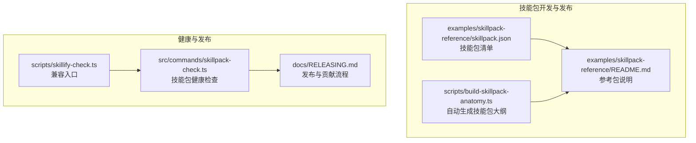
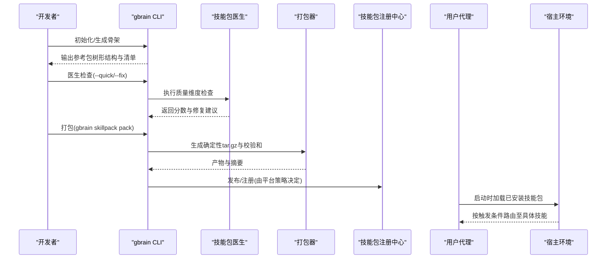
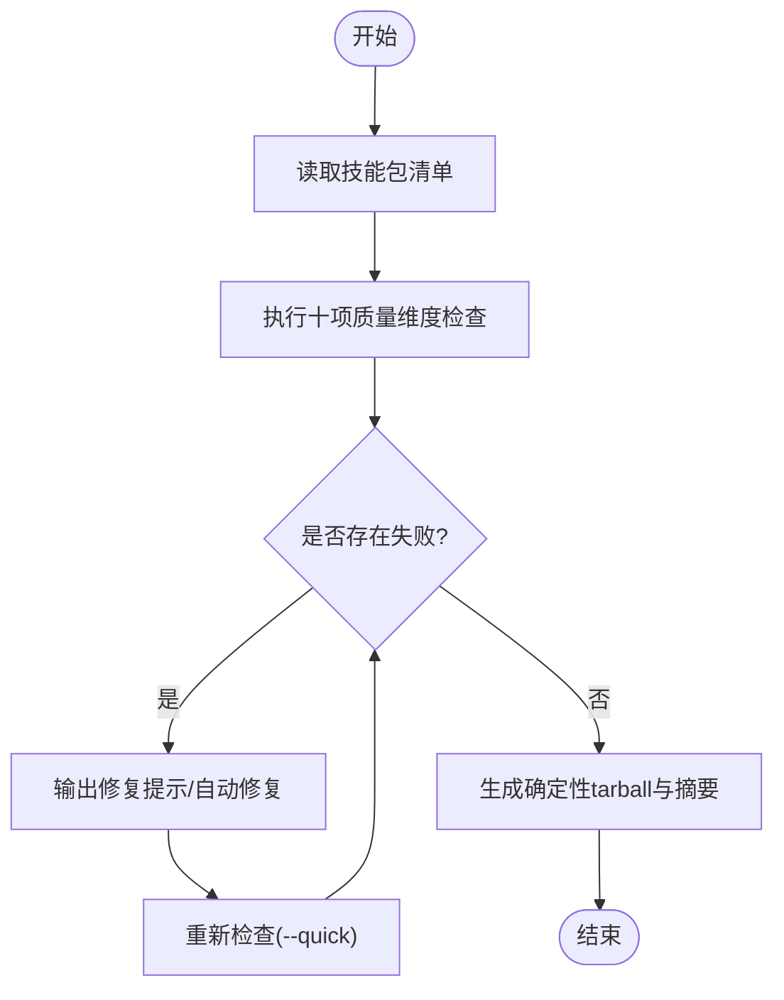
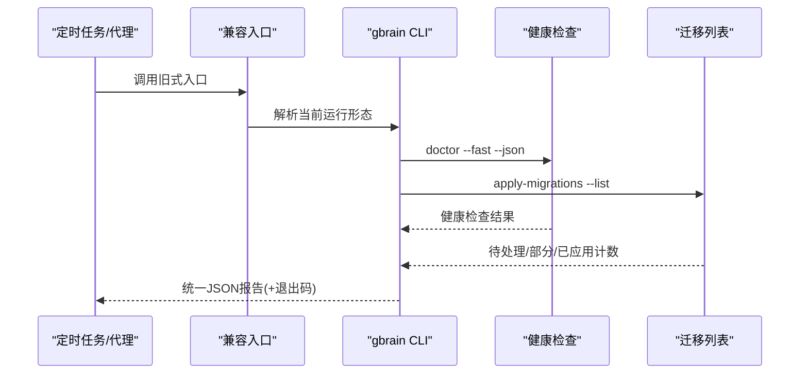
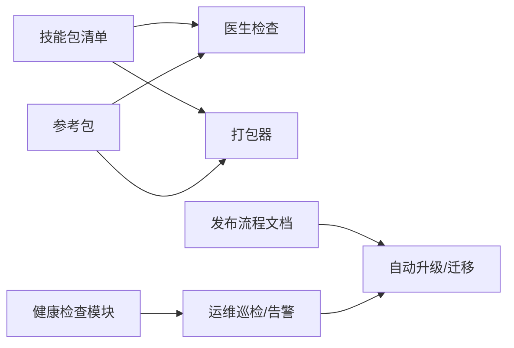

# 技能部署与发布

<cite>
**本文引用的文件**
- [README.md](file://README.md)
- [docs/GBRAIN_SKILLPACK.md](file://docs/GBRAIN_SKILLPACK.md)
- [docs/RELEASING.md](file://docs/RELEASING.md)
- [scripts/build-skillpack-anatomy.ts](file://scripts/build-skillpack-anatomy.ts)
- [examples/skillpack-reference/skillpack.json](file://examples/skillpack-reference/skillpack.json)
- [examples/skillpack-reference/README.md](file://examples/skillpack-reference/README.md)
- [src/commands/skillpack-check.ts](file://src/commands/skillpack-check.ts)
- [scripts/skillify-check.ts](file://scripts/skillify-check.ts)
</cite>

## 目录
1. [引言](#引言)
2. [项目结构](#项目结构)
3. [核心组件](#核心组件)
4. [架构总览](#架构总览)
5. [详细组件分析](#详细组件分析)
6. [依赖关系分析](#依赖关系分析)
7. [性能考量](#性能考量)
8. [故障排查指南](#故障排查指南)
9. [结论](#结论)
10. [附录](#附录)

## 引言
本指南面向需要在 GBrain 生态中进行“技能包（Skillpack）”打包、签名与版本管理、注册与依赖校验、兼容性验证、发布渠道与权限控制、自动化部署与回滚策略，以及技能更新与向后兼容性的工程团队与平台维护者。文档基于仓库中的官方文档与脚本实现，提供从概念到落地的全流程说明。

## 项目结构
围绕技能包的发布与运行，仓库提供了以下关键要素：
- 官方技能包参考样例与清单：用于理解技能包树形结构、清单字段与测试/评测布局。
- 技能包生成与校验工具链：包括技能包骨架生成、医生检查、打包与层级判定等。
- 发布与贡献流程：涵盖本地 CI 验证、版本与变更日志规范、迁移文件与自动升级路径。
- 运维健康检查：提供技能包健康报告与迁移状态聚合，便于自动化巡检与告警。

**图示来源**
- [examples/skillpack-reference/skillpack.json:1-30](file://examples/skillpack-reference/skillpack.json#L1-L30)
- [examples/skillpack-reference/README.md:1-68](file://examples/skillpack-reference/README.md#L1-L68)
- [scripts/build-skillpack-anatomy.ts:1-193](file://scripts/build-skillpack-anatomy.ts#L1-L193)
- [src/commands/skillpack-check.ts:1-266](file://src/commands/skillpack-check.ts#L1-L266)
- [scripts/skillify-check.ts:1-14](file://scripts/skillify-check.ts#L1-L14)
- [docs/RELEASING.md:1-436](file://docs/RELEASING.md#L1-L436)

**章节来源**
- [README.md:1-443](file://README.md#L1-L443)
- [docs/GBRAIN_SKILLPACK.md:1-144](file://docs/GBRAIN_SKILLPACK.md#L1-L144)
- [docs/RELEASING.md:1-436](file://docs/RELEASING.md#L1-L436)

## 核心组件
- 技能包清单与目录结构：定义技能包元数据、最低版本要求、测试与评测集合、技能与手册位置等。
- 参考技能包：提供 10/10 的骨架与示例，作为第三方技能包的“一等公民”模板。
- 技能包医生与打包：通过医生检查确保质量维度达标；通过打包生成确定性产物以便发布。
- 健康检查与迁移：统一输出健康报告，聚合迁移状态，支持自动化巡检与严格/宽松模式。
- 发布流程与自动升级：规范版本号、变更日志、迁移文件与自动升级路径，保证平滑升级与回滚。

**章节来源**
- [examples/skillpack-reference/skillpack.json:1-30](file://examples/skillpack-reference/skillpack.json#L1-L30)
- [examples/skillpack-reference/README.md:1-68](file://examples/skillpack-reference/README.md#L1-L68)
- [scripts/build-skillpack-anatomy.ts:1-193](file://scripts/build-skillpack-anatomy.ts#L1-L193)
- [src/commands/skillpack-check.ts:1-266](file://src/commands/skillpack-check.ts#L1-L266)
- [docs/RELEASING.md:289-341](file://docs/RELEASING.md#L289-L341)

## 架构总览
技能包生命周期的关键交互如下：

**图示来源**
- [scripts/build-skillpack-anatomy.ts:1-193](file://scripts/build-skillpack-anatomy.ts#L1-L193)
- [examples/skillpack-reference/skillpack.json:1-30](file://examples/skillpack-reference/skillpack.json#L1-L30)
- [src/commands/skillpack-check.ts:1-266](file://src/commands/skillpack-check.ts#L1-L266)
- [docs/GBRAIN_SKILLPACK.md:117-144](file://docs/GBRAIN_SKILLPACK.md#L117-L144)

## 详细组件分析

### 组件A：技能包清单与目录结构
- 清单字段职责
  - 元信息：名称、版本、描述、作者、许可证、主页、最低兼容版本等。
  - 资源索引：技能列表、手册、变更日志、单元测试、端到端测试、LLM 评测、路由评测等。
- 目录约定
  - skills/<slug>/SKILL.md：技能主体，含可读的前置信息与正文。
  - runbooks/bootstrap.md：安装后展示的引导手册（非自动执行）。
  - test/e2e/evals：测试与评测集合，确保质量与回归。
- 参考样例
  - 参考包展示了完整的树形结构与 10/10 的医生评分基线，作为第三方技能包的“一等公民”模板。

**章节来源**
- [examples/skillpack-reference/skillpack.json:1-30](file://examples/skillpack-reference/skillpack.json#L1-L30)
- [examples/skillpack-reference/README.md:1-68](file://examples/skillpack-reference/README.md#L1-L68)
- [docs/GBRAIN_SKILLPACK.md:117-144](file://docs/GBRAIN_SKILLPACK.md#L117-L144)

### 组件B：技能包医生与打包
- 医生检查
  - 以纯函数形式对十个二元维度进行检查，返回通过/失败详情与修复提示。
  - 支持快速检查与自动修复模式，便于持续集成与本地迭代。
- 打包
  - 生成确定性 tarball 与 SHA-256 校验和，便于注册中心或私有渠道分发。
- 大纲自动生成
  - 通过脚本根据 rubric 描述自动生成技能包大纲中的评分表，保持一致性与可审计性。

**图示来源**
- [scripts/build-skillpack-anatomy.ts:1-193](file://scripts/build-skillpack-anatomy.ts#L1-L193)
- [examples/skillpack-reference/skillpack.json:1-30](file://examples/skillpack-reference/skillpack.json#L1-L30)

**章节来源**
- [scripts/build-skillpack-anatomy.ts:1-193](file://scripts/build-skillpack-anatomy.ts#L1-L193)

### 组件C：技能包健康检查与迁移聚合
- 功能概述
  - 聚合“健康检查”与“迁移列表”，输出统一 JSON 报告，便于宿主代理消费。
  - 支持严格/宽松两种退出码语义：严格模式下需采取行动才视为健康；宽松模式允许漂移但记录动作。
- 退出码
  - 0：健康；1：需要采取行动；2：无法判断（子命令崩溃或二进制缺失）。
- 兼容入口
  - 提供旧版入口脚本，兼容现有调用方（如测试、文档、定时任务）。

**图示来源**
- [src/commands/skillpack-check.ts:1-266](file://src/commands/skillpack-check.ts#L1-L266)
- [scripts/skillify-check.ts:1-14](file://scripts/skillify-check.ts#L1-L14)

**章节来源**
- [src/commands/skillpack-check.ts:1-266](file://src/commands/skillpack-check.ts#L1-L266)
- [scripts/skillify-check.ts:1-14](file://scripts/skillify-check.ts#L1-L14)

### 组件D：发布流程与自动升级
- 版本与变更日志
  - 版本与变更日志按分支作用域编写，强调用户可感知能力而非内部细节。
  - 发布摘要遵循“简明易懂”的写作范式，随后再给出精确的技术条目。
- 自动升级与迁移
  - 升级后执行迁移文件，若失败提供自修复步骤与诊断线索。
  - 对于影响行为的默认值变更、新功能启用等，要求迁移文件明确指导。
- 社区 PR 波次流程
  - 归并前去重、集中测试、统一提交，保留贡献者署名，避免直接合并外部 PR 至主干。

**章节来源**
- [docs/RELEASING.md:53-108](file://docs/RELEASING.md#L53-L108)
- [docs/RELEASING.md:216-262](file://docs/RELEASING.md#L216-L262)
- [docs/RELEASING.md:289-341](file://docs/RELEASING.md#L289-L341)
- [docs/RELEASING.md:382-405](file://docs/RELEASING.md#L382-L405)

## 依赖关系分析
- 技能包清单驱动目录结构与资源定位，决定医生检查范围与打包目标。
- 参考包为第三方技能包提供“一等公民”模板，确保生态一致的触发、评测与测试布局。
- 健康检查模块依赖 CLI 子命令输出，聚合健康与迁移状态，形成统一的运维视图。
- 发布流程文档约束版本演进、迁移与自动升级路径，保障向后兼容与回滚策略。

**图示来源**
- [examples/skillpack-reference/skillpack.json:1-30](file://examples/skillpack-reference/skillpack.json#L1-L30)
- [examples/skillpack-reference/README.md:1-68](file://examples/skillpack-reference/README.md#L1-L68)
- [src/commands/skillpack-check.ts:1-266](file://src/commands/skillpack-check.ts#L1-L266)
- [docs/RELEASING.md:289-341](file://docs/RELEASING.md#L289-L341)

**章节来源**
- [examples/skillpack-reference/skillpack.json:1-30](file://examples/skillpack-reference/skillpack.json#L1-L30)
- [src/commands/skillpack-check.ts:1-266](file://src/commands/skillpack-check.ts#L1-L266)
- [docs/RELEASING.md:289-341](file://docs/RELEASING.md#L289-L341)

## 性能考量
- 确定性打包：通过固定算法与输入顺序生成 tarball 与摘要，减少分发与校验成本。
- 快速健康检查：提供 --fast 选项，优先执行不依赖数据库的检查，缩短巡检时间。
- 自动修复：在 CI 中使用自动修复模式，降低人工干预与反复迭代成本。
- 迁移批量化：将影响行为的变更以迁移文件形式一次性执行，避免多次升级带来的抖动。

## 故障排查指南
- 健康检查失败
  - 使用健康检查模块输出的修复命令逐项解决；若存在警告，评估是否纳入行动清单。
  - 若 doctor 或迁移列表子命令失败，退出码为 2，需检查二进制可用性与环境变量。
- 迁移未完成
  - 当存在待处理或部分迁移时，健康检查会提示执行迁移；请按提示操作并复核结果。
- 兼容性问题
  - 参考清单中的最低版本要求，确保宿主环境满足兼容性；必要时先升级再发布。
- 回滚策略
  - 在自动升级失败或出现严重问题时，依据发布流程文档提供的自修复步骤与诊断线索进行回滚与修复。

**章节来源**
- [src/commands/skillpack-check.ts:135-190](file://src/commands/skillpack-check.ts#L135-L190)
- [docs/RELEASING.md:216-262](file://docs/RELEASING.md#L216-L262)

## 结论
通过参考包模板、医生检查与打包工具链、统一的发布与自动升级流程，以及健康检查与迁移聚合机制，本指南为技能包的全生命周期管理提供了清晰、可审计且可自动化的实践路径。遵循这些流程，可在保证向后兼容与安全的前提下，高效地完成技能包的打包、发布、注册、依赖与兼容性验证、权限与渠道管理、自动化部署与回滚。

## 附录
- 技能包 CLI 参考（第三方路径）
  - 初始化与医生检查：gbrain skillpack init、gbrain skillpack doctor
  - 打包与发布：gbrain skillpack pack
  - 注册中心与检索：gbrain skillpack search、gbrain skillpack info、gbrain skillpack scaffold
- 参考包树形结构与 10/10 基线，确保第三方技能包达到“一等公民”标准。

**章节来源**
- [docs/GBRAIN_SKILLPACK.md:117-144](file://docs/GBRAIN_SKILLPACK.md#L117-L144)
- [examples/skillpack-reference/README.md:1-68](file://examples/skillpack-reference/README.md#L1-L68)