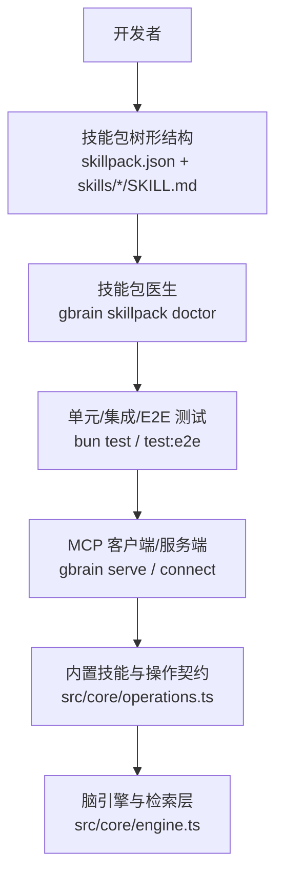
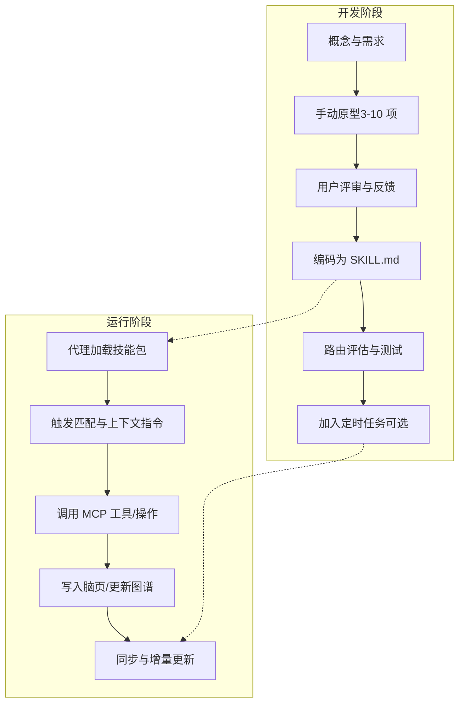
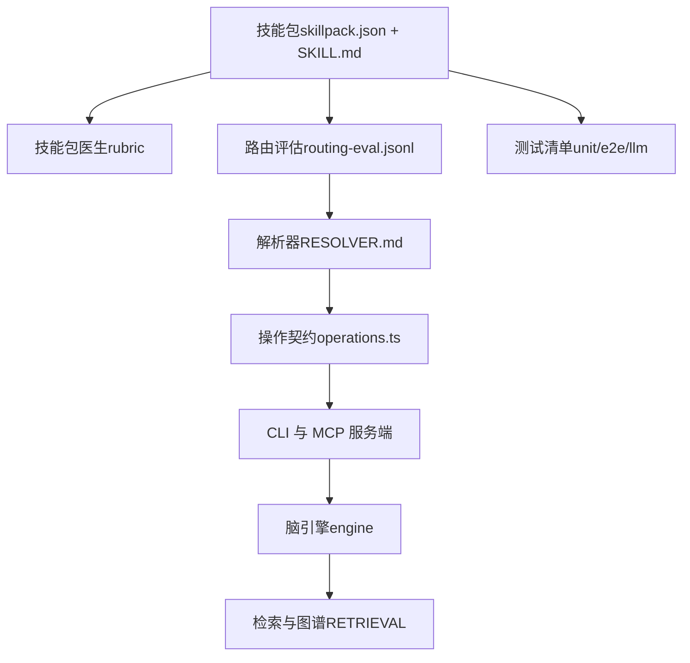

# 自定义技能开发

<cite>
**本文引用的文件**
- [README.md](file://README.md)
- [docs/skillpack-anatomy.md](file://docs/skillpack-anatomy.md)
- [docs/GBRAIN_SKILLPACK.md](file://docs/GBRAIN_SKILLPACK.md)
- [docs/guides/skill-development.md](file://docs/guides/skill-development.md)
- [docs/TESTING.md](file://docs/TESTING.md)
- [docs/RELEASING.md](file://docs/RELEASING.md)
- [docs/guides/skillopt.md](file://docs/guides/skillopt.md)
- [docs/GBRAIN_VERIFY.md](file://docs/GBRAIN_VERIFY.md)
- [examples/skillpack-reference/README.md](file://examples/skillpack-reference/README.md)
- [examples/skillpack-reference/skillpack.json](file://examples/skillpack-reference/skillpack.json)
- [examples/skillpack-reference/skills/reference-pack/SKILL.md](file://examples/skillpack-reference/skills/reference-pack/SKILL.md)
- [skills/ask-user/SKILL.md](file://skills/ask-user/SKILL.md)
- [skills/cold-start/SKILL.md](file://skills/cold-start/SKILL.md)
- [skills/brain-ops/SKILL.md](file://skills/brain-ops/SKILL.md)
- [skills/query/SKILL.md](file://skills/query/SKILL.md)
- [skills/ingest/SKILL.md](file://skills/ingest/SKILL.md)
- [skills/enrich/SKILL.md](file://skills/enrich/SKILL.md)
- [skills/schema-author/SKILL.md](file://skills/schema-author/SKILL.md)
- [skills/RESOLVER.md](file://skills/RESOLVER.md)
- [src/core/skillpack/rubric.ts](file://src/core/skillpack/rubric.ts)
- [src/cli.ts](file://src/cli.ts)
- [src/core/operations.ts](file://src/core/operations.ts)
- [src/mcp/server.ts](file://src/mcp/server.ts)
- [src/mcp/client.ts](file://src/mcp/client.ts)
- [docs/mcp/CLAUDE_CODE.md](file://docs/mcp/CLAUDE_CODE.md)
- [docs/mcp/CODEX.md](file://docs/mcp/CODEX.md)
- [docs/mcp/CHATGPT.md](file://docs/mcp/CHATGPT.md)
- [docs/mcp/PERPLEXITY.md](file://docs/mcp/PERPLEXITY.md)
- [docs/mcp/CLAUDE_DESKTOP.md](file://docs/mcp/CLAUDE_DESKTOP.md)
- [docs/mcp/CLAUDE_COWORK.md](file://docs/mcp/CLAUDE_COWORK.md)
- [docs/architecture/topologies.md](file://docs/architecture/topologies.md)
- [docs/architecture/infra-layer.md](file://docs/architecture/infra-layer.md)
- [docs/architecture/RETRIEVAL.md](file://docs/architecture/RETRIEVAL.md)
- [docs/ethos/THIN_HARNESS_FAT_SKILLS.md](file://docs/ethos/THIN_HARNESS_FAT_SKILLS.md)
- [docs/ethos/MARKDOWN_SKILLS_AS_RECIPES.md](file://docs/ethos/MARKDOWN_SKILLS_AS_RECIPES.md)
- [docs/schema-author-tutorial.md](file://docs/schema-author-tutorial.md)
- [docs/guides/skillpacks-as-scaffolding.md](file://docs/guides/skillpacks-as-scaffolding.md)
- [docs/designs/SKILLPACK_REGISTRY_V1_SPEC.md](file://docs/designs/SKILLPACK_REGISTRY_V1_SPEC.md)
- [scripts/skillify-check.ts](file://scripts/skillify-check.ts)
- [scripts/skillpack-apply-hunks.test.ts](file://scripts/skillpack-apply-hunks.test.ts)
- [scripts/skillpack-harvest-lint.test.ts](file://scripts/skillpack-harvest-lint.test.ts)
- [scripts/skillpack-reference-pack-is-ten.test.ts](file://scripts/skillpack-reference-pack-is-ten.test.ts)
- [scripts/skillpack-reference-apply.test.ts](file://scripts/skillpack-reference-apply.test.ts)
- [scripts/skillpack-reference-pack-is-ten.test.ts](file://scripts/skillpack-reference-pack-is-ten.test.ts)
- [scripts/skillpack-reference-apply.test.ts](file://scripts/skillpack-reference-apply.test.ts)
- [scripts/skillpack-reference-pack-is-ten.test.ts](file://scripts/skillpack-reference-pack-is-ten.test.ts)
- [scripts/skillpack-reference-apply.test.ts](file://scripts/skillpack-reference-apply.test.ts)
- [scripts/skillpack-reference-pack-is-ten.test.ts](file://scripts/skillpack-reference-pack-is-ten.test.ts)
- [scripts/skillpack-reference-apply.test.ts](file://scripts/skillpack-reference-apply.test.ts)
- [scripts/skillpack-reference-pack-is-ten.test.ts](file://scripts/skillpack-reference-pack-is-ten.test.ts)
- [scripts/skillpack-reference-apply.test.ts](file://scripts/skillpack-reference-apply.test.ts)
- [scripts/skillpack-reference-pack-is-ten.test.ts](file://scripts/skillpack-reference-pack-is-ten.test.ts)
- [scripts/skillpack-reference-apply.test.ts](file://scripts/skillpack-reference-apply.test.ts)
- [scripts/skillpack-reference-pack-is-ten.test.ts](file://scripts/skillpack-reference-pack-is-ten.test.ts)
- [scripts/skillpack-reference-apply.test.ts](file://scripts/skillpack-reference-apply.test.ts)
- [scripts/skillpack-reference-pack-is-ten.test.ts](file://scripts/skillpack-reference-pack-is-ten.test.ts)
- [scripts/skillpack-reference-apply.test.ts](file://scripts/skillpack-reference-apply.test.ts)
- [scripts/skillpack-reference-pack-is-ten.test.ts](file://scripts/skillpack-reference-pack-is-ten.test.ts)
- [scripts/skillpack-reference-apply.test.ts](file://scripts/skillpack-reference-apply.test.ts)
- [scripts/skillpack-reference-pack-is-ten.test.ts](file://scripts/skillpack-reference-pack-is-ten.test.ts)
- [scripts/skillpack-reference-apply.test.ts](file://scripts/skillpack-reference-apply.test.ts)
- [scripts/skillpack-reference-pack-is-ten.test.ts](file://scripts/skillpack-reference-pack-is-ten.test.ts)
- [scripts/skillpack-reference-......](file://scripts/skillpack-reference-apply.test.ts)
</cite>

## 目录
1. [简介](#简介)
2. [项目结构](#项目结构)
3. [核心组件](#核心组件)
4. [架构总览](#架构总览)
5. [详细组件分析](#详细组件分析)
6. [依赖关系分析](#依赖关系分析)
7. [性能考量](#性能考量)
8. [故障排查指南](#故障排查指南)
9. [结论](#结论)
10. [附录](#附录)

## 简介
本指南面向希望在 GBrain 平台上开发“自定义技能”的工程师与研究者，系统讲解 SKILL.md 格式规范、工具接口定义、元数据配置、模板与示例、输入输出规范、错误处理与日志记录、测试框架与验证规则、质量保证流程、与 MCP 协议的集成方式，并提供调试技巧、性能优化与安全考虑，以及完整的开发与发布工作流。

## 项目结构
围绕“技能开发”，仓库中与之直接相关的关键目录与文件包括：
- 文档与参考：docs 下的 skillpack-anatomy、GBRAIN_SKILLPACK、guides/skill-development、guides/skillopt、TESTING、RELEASING、GBRAIN_VERIFY、mcp 子文档等
- 示例技能包：examples/skillpack-reference（包含标准树形结构与参考实现）
- 内置技能：skills/ 目录下大量 SKILL.md 技能文件，涵盖信号捕获、脑内查询、索引与检索、知识图谱、Schema 编辑、任务调度等
- 核心实现：src/ 下的 CLI、MCP 服务端/客户端、操作契约（operations）、技能包评分体系（rubric）等
- 脚本与测试：scripts/ 下的技能包检查与生成脚本；test/ 与 tests/heavy/ 下的测试套件

图表来源
- [docs/skillpack-anatomy.md:1-113](file://docs/skillpack-anatomy.md#L1-L113)
- [examples/skillpack-reference/README.md:1-68](file://examples/skillpack-reference/README.md#L1-L68)
- [src/cli.ts:1-200](file://src/cli.ts#L1-L200)
- [src/mcp/server.ts:1-200](file://src/mcp/server.ts#L1-L200)
- [src/mcp/client.ts:1-200](file://src/mcp/client.ts#L1-L200)
- [src/core/operations.ts:1-200](file://src/core/operations.ts#L1-L200)

章节来源
- [docs/skillpack-anatomy.md:1-113](file://docs/skillpack-anatomy.md#L1-L113)
- [examples/skillpack-reference/README.md:1-68](file://examples/skillpack-reference/README.md#L1-L68)
- [README.md:129-152](file://README.md#L129-L152)

## 核心组件
- 技能包清单（skillpack.json）：声明版本、名称、描述、作者、许可证、最小兼容版本、技能列表、运行手册、变更日志、测试与评测路径等元数据字段
- 技能文件（SKILL.md）：采用 Markdown + 前言块（name/description/mutating/triggers），正文为“上下文指令集”，由代理在触发时读取
- 路由评估（routing-eval.jsonl）：每条意图映射到期望技能，至少 5 条
- 运行手册（runbooks/bootstrap.md）：安装后展示的步骤说明，不自动执行
- 测试与评测：unit_tests、e2e_tests、llm_evals、routing_evals 的清单化管理
- 医生评分维度（rubric）：核心 5 维 + 质量徽章 5 维，决定可发布层级

章节来源
- [examples/skillpack-reference/skillpack.json:1-30](file://examples/skillpack-reference/skillpack.json#L1-L30)
- [examples/skillpack-reference/skills/reference-pack/SKILL.md:1-104](file://examples/skillpack-reference/skills/reference-pack/SKILL.md#L1-L104)
- [docs/skillpack-anatomy.md:51-82](file://docs/skillpack-anatomy.md#L51-L82)
- [src/core/skillpack/rubric.ts:1-200](file://src/core/skillpack/rubric.ts#L1-L200)

## 架构总览
技能开发贯穿以下路径：从“概念—原型—评估—编码—定时”闭环，结合内置技能与 MCP 协议，形成“薄外壳、胖技能”的体系。

图表来源
- [docs/guides/skill-development.md:21-58](file://docs/guides/skill-development.md#L21-L58)
- [docs/GBRAIN_SKILLPACK.md:115-134](file://docs/GBRAIN_SKILLPACK.md#L115-L134)
- [docs/architecture/topologies.md:1-200](file://docs/architecture/topologies.md#L1-L200)

章节来源
- [docs/guides/skill-development.md:1-132](file://docs/guides/skill-development.md#L1-L132)
- [docs/GBRAIN_SKILLPACK.md:105-134](file://docs/GBRAIN_SKILLPACK.md#L105-L134)

## 详细组件分析

### SKILL.md 格式规范与元数据
- 前言块字段
  - name：技能名称
  - description：技能描述
  - mutating：是否产生副作用（写入/修改）
  - triggers：触发短语数组（用于路由）
- 正文：作为“上下文指令集”，代理在触发时按顺序读取
- 路由评估：skills/<skill>/routing-eval.jsonl 至少 5 行，映射用户意图到技能
- 元数据清单：skillpack.json 中的 skills、runbooks、changelog、unit_tests、e2e_tests、llm_evals、routing_evals 字段

章节来源
- [examples/skillpack-reference/skills/reference-pack/SKILL.md:1-104](file://examples/skillpack-reference/skills/reference-pack/SKILL.md#L1-L104)
- [examples/skillpack-reference/skillpack.json:1-30](file://examples/skillpack-reference/skillpack.json#L1-L30)
- [docs/skillpack-anatomy.md:10-29](file://docs/skillpack-anatomy.md#L10-L29)

### 工具接口定义与操作契约
- 操作契约：所有工具/操作以统一接口暴露，CLI 与 MCP 服务端均基于同一契约生成
- 操作来源：src/core/operations.ts 定义了可用操作集合
- 调用方式：通过 MCP JSON-RPC 或本地命令行调用

章节来源
- [README.md:280-288](file://README.md#L280-L288)
- [src/core/operations.ts:1-200](file://src/core/operations.ts#L1-L200)

### 输入输出规范与错误处理
- 输入规范
  - 触发短语：来自 SKILL.md 的 triggers 数组
  - 用户意图：来自 routing-eval.jsonl 的映射
  - 上下文参数：由代理注入（如搜索词、实体、时间范围等）
- 输出规范
  - 文本回答：含来源标注与“未知部分”的诚实提示
  - 结构化结果：如 JSONL、页面 slug、证据标签等
- 错误处理
  - 诊断命令：gbrain doctor 提供健康检查与修复建议
  - 日志审计：MCP 请求日志、同步失败分类、升级错误追踪等

章节来源
- [README.md:153-172](file://README.md#L153-L172)
- [docs/GBRAIN_VERIFY.md:12-296](file://docs/GBRAIN_VERIFY.md#L12-L296)

### 日志记录与可观测性
- MCP 层面：请求日志、健康检查、速率限制与跨域策略
- 同步与升级：失败分类、重试与回滚、升级错误追踪
- 开发辅助：失败日志聚合、超时保护、进程退出语义

章节来源
- [docs/TESTING.md:27-37](file://docs/TESTING.md#L27-L37)
- [docs/TESTING.md:209-241](file://docs/TESTING.md#L209-L241)
- [docs/GBRAIN_VERIFY.md:229-263](file://docs/GBRAIN_VERIFY.md#L229-L263)

### 技能模板与代码示例
- 参考技能包：examples/skillpack-reference 提供 10/10 标准树形结构
- 内置技能示例：ask-user、cold-start、brain-ops、query、ingest、enrich、schema-author 等
- 模板生成：gbrain skillify scaffold <name> 生成新技能骨架

章节来源
- [examples/skillpack-reference/README.md:1-68](file://examples/skillpack-reference/README.md#L1-L68)
- [skills/ask-user/SKILL.md:1-200](file://skills/ask-user/SKILL.md#L1-L200)
- [skills/cold-start/SKILL.md:1-200](file://skills/cold-start/SKILL.md#L1-L200)
- [skills/brain-ops/SKILL.md:1-200](file://skills/brain-ops/SKILL.md#L1-L200)
- [skills/query/SKILL.md:1-200](file://skills/query/SKILL.md#L1-L200)
- [skills/ingest/SKILL.md:1-200](file://skills/ingest/SKILL.md#L1-L200)
- [skills/enrich/SKILL.md:1-200](file://skills/enrich/SKILL.md#L1-L200)
- [skills/schema-author/SKILL.md:1-200](file://skills/schema-author/SKILL.md#L1-L200)

### 技能测试框架与验证规则
- 测试分层
  - 快速单元测试：并行分片 + 串行文件隔离
  - 集成测试：需要真实数据库（E2E）
  - 慢速与重型测试：冷路径与性能回归
- 验证规则
  - 技能包医生：10 维评分（核心 5 + 质量徽章 5）
  - 路由一致性：check-resolvable 与 RESOLVER.md 覆盖
  - 质量门禁：notability、MECE、引用强制、重复页检查

章节来源
- [docs/TESTING.md:6-18](file://docs/TESTING.md#L6-L18)
- [docs/TESTING.md:116-216](file://docs/TESTING.md#L116-L216)
- [docs/skillpack-anatomy.md:51-82](file://docs/skillpack-anatomy.md#L51-L82)
- [src/core/skillpack/rubric.ts:1-200](file://src/core/skillpack/rubric.ts#L1-L200)

### 质量保证流程
- 门禁清单：notability、引用、MECE、定时部署、重复页检查
- 验证步骤：对真实数据执行、MECE 对比、质量清单逐项核验
- 回归与演进：使用 gbrain skillopt 自主优化 SKILL.md 输出质量

章节来源
- [docs/guides/skill-development.md:77-128](file://docs/guides/skill-development.md#L77-L128)
- [docs/guides/skillopt.md:1-148](file://docs/guides/skillopt.md#L1-L148)

### 与 MCP 协议的集成
- 支持多客户端：Claude Code、Codex、Cursor/Windsurf、Claude Desktop、Cowork、Perplexity、ChatGPT
- 两种传输：stdio（本地子进程）与 HTTP（远程/团队版）
- 安全与治理：OAuth 2.1 + DCR 注册、作用域控制（read/write/admin）、速率限制、信任边界

章节来源
- [README.md:131-152](file://README.md#L131-L152)
- [docs/mcp/CLAUDE_CODE.md:1-200](file://docs/mcp/CLAUDE_CODE.md#L1-L200)
- [docs/mcp/CODEX.md:1-200](file://docs/mcp/CODEX.md#L1-L200)
- [docs/mcp/CHATGPT.md:1-200](file://docs/mcp/CHATGPT.md#L1-L200)
- [docs/mcp/PERPLEXITY.md:1-200](file://docs/mcp/PERPLEXITY.md#L1-L200)
- [docs/mcp/CLAUDE_DESKTOP.md:1-200](file://docs/mcp/CLAUDE_DESKTOP.md#L1-L200)
- [docs/mcp/CLAUDE_COWORK.md:1-200](file://docs/mcp/CLAUDE_COWORK.md#L1-L200)

### 调试技巧与常见问题
- 诊断命令：gbrain doctor、gbrain stats、gbrain check-update
- 同步与网络：IPv4/IPv6 连接问题、PgBouncer 事务模式、池化连接异常
- MCP：健康检查、OAuth 注册、速率限制、CORS 与请求体大小限制
- 性能：批量重试、并发控制、PGLite vs Postgres 差异

章节来源
- [README.md:290-411](file://README.md#L290-L411)
- [docs/TESTING.md:209-241](file://docs/TESTING.md#L209-L241)
- [docs/GBRAIN_VERIFY.md:61-148](file://docs/GBRAIN_VERIFY.md#L61-L148)

### 性能优化与安全考虑
- 性能
  - 批量写入重试与抖动退避
  - 并发与锁竞争规避（PGLite 单写器）
  - 搜索与图遍历的向量化与关键词融合
- 安全
  - 信任边界：远程/受信判定、类型安全断言
  - OAuth 2.1 + DCR、作用域最小化、速率限制
  - JSONB 完整性修复与路径查询健壮性

章节来源
- [README.md:327-354](file://README.md#L327-L354)
- [docs/TESTING.md:196-200](file://docs/TESTING.md#L196-L200)
- [docs/GBRAIN_VERIFY.md:229-263](file://docs/GBRAIN_VERIFY.md#L229-L263)

### 开发工作流程与发布指南
- 开发循环：概念—原型—评估—编码—定时
- 质量门禁：notability、引用、MECE、定时部署、重复页检查
- 发布前检查：本地 CI 门禁（ci:local）、类型检查、E2E 生命周期
- 版本与变更日志：分支级版本与变更日志，发布摘要与精确变更清单
- 社区波次：外部 PR 合并采用“修复波”流程，保留贡献者署名

章节来源
- [docs/guides/skill-development.md:1-132](file://docs/guides/skill-development.md#L1-L132)
- [docs/RELEASING.md:9-51](file://docs/RELEASING.md#L9-L51)
- [docs/RELEASING.md:266-304](file://docs/RELEASING.md#L266-L304)
- [docs/RELEASING.md:382-436](file://docs/RELEASING.md#L382-L436)

## 依赖关系分析
技能包与系统各模块之间的耦合与协作如下：

图表来源
- [src/core/skillpack/rubric.ts:1-200](file://src/core/skillpack/rubric.ts#L1-L200)
- [skills/RESOLVER.md:1-200](file://skills/RESOLVER.md#L1-L200)
- [src/core/operations.ts:1-200](file://src/core/operations.ts#L1-L200)
- [src/cli.ts:1-200](file://src/cli.ts#L1-L200)
- [src/mcp/server.ts:1-200](file://src/mcp/server.ts#L1-L200)
- [docs/architecture/RETRIEVAL.md:1-200](file://docs/architecture/RETRIEVAL.md#L1-L200)

章节来源
- [docs/skillpack-anatomy.md:51-82](file://docs/skillpack-anatomy.md#L51-L82)
- [skills/RESOLVER.md:1-200](file://skills/RESOLVER.md#L1-L200)

## 性能考量
- 批量写入与重试：针对池化连接波动的自愈重试与抖动退避
- 并发与锁：PGLite 单写器与并发控制，避免写锁争用
- 检索与图谱：向量 + 关键词融合、RRF、源层级增强、图谱多跳遍历
- 数据完整性：JSONB 修复、路径查询健壮性、源隔离

章节来源
- [README.md:327-354](file://README.md#L327-L354)
- [docs/TESTING.md:196-200](file://docs/TESTING.md#L196-L200)
- [docs/GBRAIN_VERIFY.md:229-263](file://docs/GBRAIN_VERIFY.md#L229-L263)

## 故障排查指南
- 安装与同步
  - doctor 健康检查与修复建议
  - live sync 实际工作验证（覆盖率、嵌入、端到端）
- 网络与连接
  - IPv4/IPv6 连接问题、PgBouncer 事务模式、池化连接异常
- MCP 与安全
  - 健康检查、OAuth 注册、速率限制、CORS、请求体大小限制
- 升级与迁移
  - 升级错误追踪、迁移文件与自检步骤

章节来源
- [docs/GBRAIN_VERIFY.md:12-296](file://docs/GBRAIN_VERIFY.md#L12-L296)
- [README.md:290-411](file://README.md#L290-L411)
- [docs/TESTING.md:209-241](file://docs/TESTING.md#L209-L241)

## 结论
通过 SKILL.md 的标准化格式、skillpack.json 的元数据清单、routing-eval.jsonl 的路由评估、以及 rubric 的质量门禁，开发者可以构建高质量、可维护、可自动化的自定义技能。配合 MCP 协议与内置操作契约，技能可在本地或云端被广泛客户端消费。借助完善的测试与发布流程，技能可稳定演进并在生产环境中持续交付价值。

## 附录
- 参考与扩展阅读
  - Thin Harness, Fat Skills 与 Markdown Skills 作为配方的哲学
  - Schema Author 教程与推荐 Schema
  - 技能包作为脚手架的设计文档与规范

章节来源
- [docs/ethos/THIN_HARNESS_FAT_SKILLS.md:1-200](file://docs/ethos/THIN_HARNESS_FAT_SKILLS.md#L1-L200)
- [docs/ethos/MARKDOWN_SKILLS_AS_RECIPES.md:1-200](file://docs/ethos/MARKDOWN_SKILLS_AS_RECIPES.md#L1-L200)
- [docs/schema-author-tutorial.md:1-200](file://docs/schema-author-tutorial.md#L1-L200)
- [docs/guides/skillpacks-as-scaffolding.md:1-200](file://docs/guides/skillpacks-as-scaffolding.md#L1-L200)
- [docs/designs/SKILLPACK_REGISTRY_V1_SPEC.md:1-200](file://docs/designs/SKILLPACK_REGISTRY_V1_SPEC.md#L1-L200)