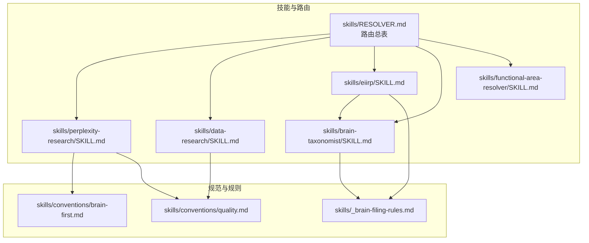
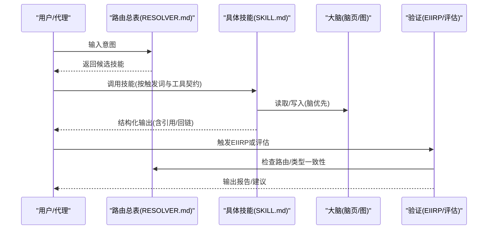
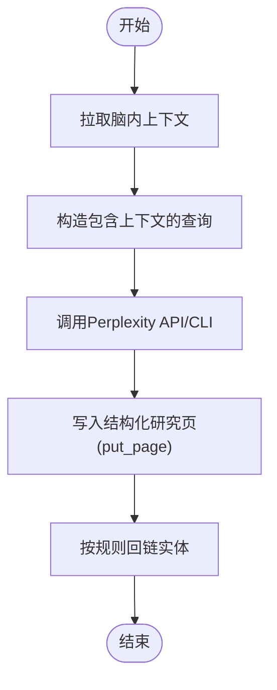
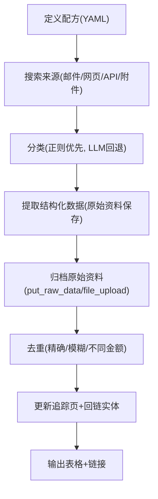
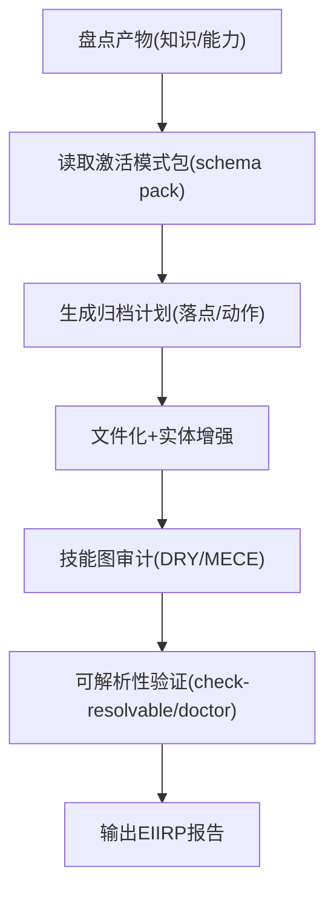
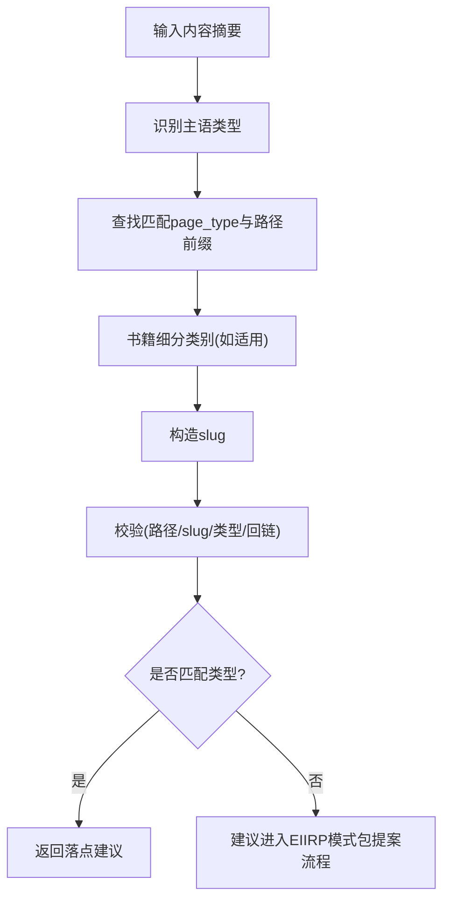
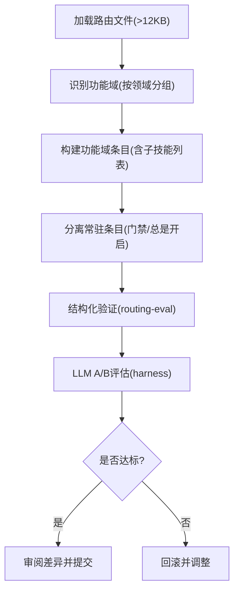
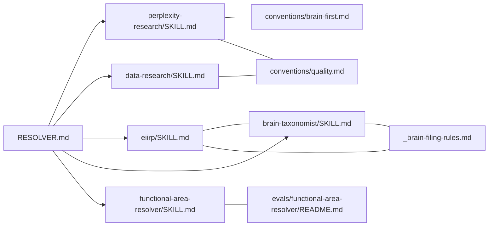

# 专用技能

<cite>
**本文引用的文件**
- [README.md](file://README.md)
- [RESOLVER.md](file://skills/RESOLVER.md)
- [_brain-filing-rules.md](file://skills/_brain-filing-rules.md)
- [conventions/quality.md](file://skills/conventions/quality.md)
- [conventions/brain-first.md](file://skills/conventions/brain-first.md)
- [perplexity-research/SKILL.md](file://skills/perplexity-research/SKILL.md)
- [data-research/SKILL.md](file://skills/data-research/SKILL.md)
- [eiirp/SKILL.md](file://skills/eiirp/SKILL.md)
- [brain-taxonomist/SKILL.md](file://skills/brain-taxonomist/SKILL.md)
- [functional-area-resolver/SKILL.md](file://skills/functional-area-resolver/SKILL.md)
- [evals/functional-area-resolver/README.md](file://evals/functional-area-resolver/README.md)
</cite>

## 目录
1. [引言](#引言)
2. [项目结构](#项目结构)
3. [核心组件](#核心组件)
4. [架构总览](#架构总览)
5. [详细组件分析](#详细组件分析)
6. [依赖关系分析](#依赖关系分析)
7. [性能考量](#性能考量)
8. [故障排查指南](#故障排查指南)
9. [结论](#结论)
10. [附录](#附录)

## 引言
本文件系统化梳理 GBrain 仓库中“专用技能”的设计与实现，重点覆盖以下专业能力：
- Perplexity 研究：结合脑内知识与外部网络检索，聚焦“增量信息”与“新鲜度对比”，用于实体增强、现状核查、交易监控与增量发现。
- 数据研究：结构化数据采集与提取流水线，通过参数化 YAML 配方完成邮件/网页/API 来源的结构化追踪，支持去重与归档。
- EIIRP（Everything In Its Right Place）：工作后整理与复盘流程，涵盖知识归档、技能审计、可复用模式提炼与路由一致性校验。
- 大脑分类员（brain-taxonomist）：所有写入前的“归档门禁”，依据当前激活的“模式包”（schema pack）自动判定落点路径，并进行漂移检测。
- 功能区域解析器（functional-area-resolver）：将路由表压缩为“功能域调度器”，以单次 LLM 调用完成从“功能域”到“子技能”的两层路由。

上述技能共同构成“知识域”与“能力域”的闭环：前者确保产出永久化、可检索、可溯源；后者确保重复性工作被抽象为可组合的技能，避免冗余与歧义。

## 项目结构
- 技能清单与路由总表位于 skills/RESOLVER.md，定义了触发词、目标技能与调用约定。
- 各技能以 SKILL.md 形式声明职责、触发词、工具约束、输出格式与合规要求。
- 全局规范位于 skills/conventions/* 与 skills/_brain-filing-rules.md，统一质量、引用、回链与归档规则。
- 功能区域解析器的评估与方法论见 evals/functional-area-resolver/README.md。

图表来源
- [RESOLVER.md:1-137](file://skills/RESOLVER.md#L1-L137)
- [perplexity-research/SKILL.md:1-200](file://skills/perplexity-research/SKILL.md#L1-L200)
- [data-research/SKILL.md:1-139](file://skills/data-research/SKILL.md#L1-L139)
- [eiirp/SKILL.md:1-395](file://skills/eiirp/SKILL.md#L1-L395)
- [brain-taxonomist/SKILL.md:1-196](file://skills/brain-taxonomist/SKILL.md#L1-L196)
- [functional-area-resolver/SKILL.md:1-354](file://skills/functional-area-resolver/SKILL.md#L1-L354)
- [_brain-filing-rules.md:1-193](file://skills/_brain-filing-rules.md#L1-L193)
- [conventions/quality.md:1-41](file://skills/conventions/quality.md#L1-L41)
- [conventions/brain-first.md:1-119](file://skills/conventions/brain-first.md#L1-L119)

章节来源
- [RESOLVER.md:1-137](file://skills/RESOLVER.md#L1-L137)
- [README.md:260-261](file://README.md#L260-L261)

## 核心组件
- 路由总表（RESOLVER.md）：定义“何时调用何技能”，并给出优先级与消歧规则。
- 触发词与工具契约：每个 SKILL.md 明确触发词、是否变更、写入目录、工具集与输出格式。
- 全局规范：质量（引用与回链）、脑优先（先查脑再查外网）、归档规则（按主题归档、实体传播、原始资料保留）。
- 评估与验证：功能区域解析器提供 A/B 评估与重评分机制，确保压缩后的路由在真实意图上仍保持高准确率。

章节来源
- [RESOLVER.md:1-137](file://skills/RESOLVER.md#L1-L137)
- [perplexity-research/SKILL.md:1-200](file://skills/perplexity-research/SKILL.md#L1-L200)
- [data-research/SKILL.md:1-139](file://skills/data-research/SKILL.md#L1-L139)
- [eiirp/SKILL.md:1-395](file://skills/eiirp/SKILL.md#L1-L395)
- [brain-taxonomist/SKILL.md:1-196](file://skills/brain-taxonomist/SKILL.md#L1-L196)
- [functional-area-resolver/SKILL.md:1-354](file://skills/functional-area-resolver/SKILL.md#L1-L354)
- [_brain-filing-rules.md:1-193](file://skills/_brain-filing-rules.md#L1-L193)
- [conventions/quality.md:1-41](file://skills/conventions/quality.md#L1-L41)
- [conventions/brain-first.md:1-119](file://skills/conventions/brain-first.md#L1-L119)
- [evals/functional-area-resolver/README.md:1-190](file://evals/functional-area-resolver/README.md#L1-L190)

## 架构总览
专用技能围绕“路由—执行—归档—审计—优化”的闭环协作：
- 路由层：RESOLVER.md 定义触发词与技能映射；功能区域解析器提供压缩版路由，降低上下文开销。
- 执行层：各技能按契约运行，遵循“脑优先”与“引用/回链”规范。
- 归档层：大脑分类员在写入前决策落点；EIIRP 在工作结束后批量归档与技能审计。
- 审计层：EIIRP 的“可解析性检查”与“模式包一致性”保障路由清晰、类型完备。
- 优化层：功能区域解析器的评估结果指导路由表压缩策略。

图表来源
- [RESOLVER.md:1-137](file://skills/RESOLVER.md#L1-L137)
- [perplexity-research/SKILL.md:1-200](file://skills/perplexity-research/SKILL.md#L1-L200)
- [eiirp/SKILL.md:1-395](file://skills/eiirp/SKILL.md#L1-L395)
- [functional-area-resolver/SKILL.md:1-354](file://skills/functional-area-resolver/SKILL.md#L1-L354)

## 详细组件分析

### Perplexity 研究（perplexity-research）
- 专业领域：跨模态知识合成与增量发现。适用于实体增强、现状核查、交易监控与新闻/公告的“新旧对比”。
- 算法实现要点：
  - 将“脑内上下文”作为提示的一部分发送给 Perplexity，使检索聚焦于“增量信息”而非重复已知事实。
  - 输出结构化页面，包含“关键新发展”“确认信号”“矛盾或更新”“推荐脑内更新”“引用列表”等部分。
  - 支持 recency_filter 控制检索时间窗口，适合新闻周期类话题。
- 适用范围：需要“权威来源+可溯源证据”的深度研究；不适合简单 URL 抓取（应使用 web_fetch）或仅依赖脑内查询（应使用 gbrain query/search）。
- 使用指南：
  - 先拉取相关脑页内容作为上下文，再构造包含“主题+脑内上下文+寻找增量”的查询。
  - 调用 Perplexity API 或本地 CLI，最后通过 put_page 写入 brain，并按“铁律”回链实体。
- 专业术语解释：
  - 增量信息：与脑内知识相比的新进展。
  - 脑优先：先在脑内检索，再决定是否调用外部 API。
  - 铁律：提及有脑页的人/公司必须双向回链。

图表来源
- [perplexity-research/SKILL.md:90-118](file://skills/perplexity-research/SKILL.md#L90-L118)

章节来源
- [perplexity-research/SKILL.md:1-200](file://skills/perplexity-research/SKILL.md#L1-L200)
- [conventions/brain-first.md:1-119](file://skills/conventions/brain-first.md#L1-L119)
- [conventions/quality.md:1-41](file://skills/conventions/quality.md#L1-L41)

### 数据研究（data-research）
- 专业领域：结构化数据采集与追踪，如投资人更新、捐赠记录、公司指标等。
- 算法实现要点：
  - 七阶段流水线：定义配方（YAML）→ 搜索来源（邮件/网页/API/附件）→ 分类（正则优先，LLM 回退）→ 提取结构化数据（强调“原始资料保存”与“批处理重读”）→ 归档原始资料（put_raw_data/file_upload）→ 去重（精确/模糊/不同金额）→ 更新主追踪页并回链实体。
  - 提取完整性规则：保存原始资料→正则提取→批处理后从保存文件重读→不信任 LLM 工作内存。
- 适用范围：需要持续、可追溯、可复核的结构化数据管线。
- 使用指南：
  - 使用 gbrain research init 搭建配方，明确搜索查询、分类规则、提取模式与追踪页格式。
  - 严格遵循“原始资料优先”与“批处理重读”，避免 LLM 工作内存导致的错误。
- 专业术语解释：
  - 原始资料：首次抓取的邮件正文、API 响应、PDF 等，需立即归档以便溯源。
  - 去重：区分完全相同与近似相同，避免重复统计。

图表来源
- [data-research/SKILL.md:48-105](file://skills/data-research/SKILL.md#L48-L105)

章节来源
- [data-research/SKILL.md:1-139](file://skills/data-research/SKILL.md#L1-L139)

### EIIRP（Everything In Its Right Place）
- 专业领域：工作后整理与复盘，确保“知识永久化、模式可复用、路由清晰一致”。
- 算法实现要点：
  - 七阶段：盘点产物（知识/能力）→ 依模式包决策落点→ 模式包一致性检查→ 文件化与实体增强→ 技能图审计（DRY/MECE）→ 可解析性验证→ 报告。
  - 强调“永不只留在聊天中”：超过 10 分钟的工作方法论应沉淀为技能或页面。
- 适用范围：深度研究、多源分析、新能力构建后的系统化沉淀。
- 使用指南：
  - 先生成 EIIRP 清单，再对照激活的模式包（schema pack）逐项决策落点。
  - 对识别出的可复用模式，调用 skillify 创建或合并技能，并通过 check-resolvable 与 doctor 校验路由与一致性。
- 专业术语解释：
  - DRY：避免重复逻辑；MECE：无遗漏、无交叉；可解析性：每条触发词唯一指向一个技能。

图表来源
- [eiirp/SKILL.md:98-313](file://skills/eiirp/SKILL.md#L98-L313)

章节来源
- [eiirp/SKILL.md:1-395](file://skills/eiirp/SKILL.md#L1-L395)
- [RESOLVER.md:1-137](file://skills/RESOLVER.md#L1-L137)

### 大脑分类员（brain-taxonomist）
- 专业领域：所有写入前的“归档门禁”，依据当前激活的模式包自动判定落点路径。
- 算法实现要点：
  - 决策协议：识别主语类型（人/组织/事件/概念/媒体/来源）→ 查找匹配的 page_type 与 path_prefixes → 书籍细分类别（若适用）→ 构造 slug → 写入前校验。
  - 不硬编码目录表：严格读取 gbrain schema show --json，支持 per-source 覆盖与自定义模式包。
- 适用范围：任何新建或批量导入的脑页写入前。
- 使用指南：
  - 在写入前调用 brain-taxonomist，若无匹配类型，引导进入 EIIRP Phase 3（模式包候选提案）。
  - 多脑用户务必传入 --source <id>，以获得该来源的正确建议。
- 专业术语解释：
  - 主语类型：内容的核心对象（如某个人、某个公司），决定落点目录。
  - 模式包：定义可用页面类型的“元数据”，是归档的单一真相来源。

图表来源
- [brain-taxonomist/SKILL.md:67-159](file://skills/brain-taxonomist/SKILL.md#L67-L159)

章节来源
- [brain-taxonomist/SKILL.md:1-196](file://skills/brain-taxonomist/SKILL.md#L1-L196)
- [_brain-filing-rules.md:1-193](file://skills/_brain-filing-rules.md#L1-L193)

### 功能区域解析器（functional-area-resolver）
- 专业领域：将路由表压缩为“功能域调度器”，以单次 LLM 调用完成从“功能域”到“子技能”的两层路由。
- 算法实现要点：
  - 将 N 行技能明细压缩为若干“功能域条目”，每个条目列出“(dispatcher for: 子技能列表)”。
  - 评估显示：在训练集上优于“朴素压缩”（-13 至 -17pp），且在 Sonnet 上对“无调度器条款”的 ablation（resolver-of-resolvers）崩溃至 ~41.7%。
  - 关键信号：`(dispatcher for: ...)` 列表是 LLM 能钻取到具体子技能的“负载信号”。
- 适用范围：路由文件过大（>12KB）且存在明显功能域划分时。
- 使用指南：
  - 遵循“预条件→分组功能域→构建条目→分离常驻条目→结构化验证→LLM A/B 验证→审阅差异→提交”的步骤。
  - 必须在编辑后的文件上运行 routing-eval 与 harness A/B 评估，确保 lenient 准确率不低于阈值。
- 专业术语解释：
  - lenient 准确率：允许 LLM 落入同一功能域内的更具体子技能，更贴近生产行为。
  - A/B 评估：在固定测试集上比较不同路由结构的准确性。

图表来源
- [functional-area-resolver/SKILL.md:179-291](file://skills/functional-area-resolver/SKILL.md#L179-L291)
- [evals/functional-area-resolver/README.md:19-157](file://evals/functional-area-resolver/README.md#L19-L157)

章节来源
- [functional-area-resolver/SKILL.md:1-354](file://skills/functional-area-resolver/SKILL.md#L1-L354)
- [evals/functional-area-resolver/README.md:1-190](file://evals/functional-area-resolver/README.md#L1-L190)

## 依赖关系分析
- 路由依赖：RESOLVER.md 是中枢，perplexity-research、data-research、eiirp、brain-taxonomist、functional-area-resolver 均在其下注册。
- 规范依赖：所有写入类技能均受 conventions/quality.md 与 conventions/brain-first.md 约束；归档路径由 _brain-filing-rules.md 与 brain-taxonomist 决定。
- 评估依赖：functional-area-resolver 的评估独立于技能实现，通过 evals/functional-area-resolver 提供的 harness 与 fixtures 进行 A/B 测试。

图表来源
- [RESOLVER.md:1-137](file://skills/RESOLVER.md#L1-L137)
- [perplexity-research/SKILL.md:1-200](file://skills/perplexity-research/SKILL.md#L1-L200)
- [data-research/SKILL.md:1-139](file://skills/data-research/SKILL.md#L1-L139)
- [eiirp/SKILL.md:1-395](file://skills/eiirp/SKILL.md#L1-L395)
- [brain-taxonomist/SKILL.md:1-196](file://skills/brain-taxonomist/SKILL.md#L1-L196)
- [functional-area-resolver/SKILL.md:1-354](file://skills/functional-area-resolver/SKILL.md#L1-L354)
- [_brain-filing-rules.md:1-193](file://skills/_brain-filing-rules.md#L1-L193)
- [conventions/quality.md:1-41](file://skills/conventions/quality.md#L1-L41)
- [conventions/brain-first.md:1-119](file://skills/conventions/brain-first.md#L1-L119)
- [evals/functional-area-resolver/README.md:1-190](file://evals/functional-area-resolver/README.md#L1-L190)

章节来源
- [RESOLVER.md:1-137](file://skills/RESOLVER.md#L1-L137)

## 性能考量
- 上下文预算：功能区域解析器通过 48% 的体积减少显著缓解上下文压力，同时在多个模型上维持高 lenient 准确率。
- 成本控制：perplexity-research 提供 sonar 与 sonar-pro 两种模型选择，默认优先高质量模型；在批量/定时任务中可降级以降低成本。
- 批处理稳健性：data-research 的“提取完整性规则”避免批处理后 LLM 工作内存导致的错误，提升稳定性与可复现性。
- 路由验证成本：functional-area-resolver 的 A/B 评估在 gbrain 仓库内进行，可零 API 成本重评分；在用户侧编辑后仍需进行结构化验证与 LLM A/B 验证。

## 故障排查指南
- 路由压缩失败：
  - 现象：lenient 准确率骤降或 strict 失败增多。
  - 排查：确认是否遗漏子技能名、触发短语过窄、功能域过多或过少；检查是否误用 ASCII/Unicode 箭头。
  - 参考：functional-area-resolver 的“反模式”与“维护”章节。
- 归档错误：
  - 现象：实体未回链、落点不在激活模式包定义的目录、slug 不符合规范。
  - 排查：调用 brain-taxonomist 获取建议；检查 _brain-filing-rules 与模式包；确认 per-source 覆盖是否正确传递。
- 写入后不可解析：
  - 现象：新增/修改技能后路由冲突或无法命中。
  - 排查：运行 gbrain check-resolvable 与 gbrain doctor，确保 DRY/MECE 与 schema_pack_consistency 正常。

章节来源
- [functional-area-resolver/SKILL.md:299-345](file://skills/functional-area-resolver/SKILL.md#L299-L345)
- [brain-taxonomist/SKILL.md:161-184](file://skills/brain-taxonomist/SKILL.md#L161-L184)
- [_brain-filing-rules.md:63-93](file://skills/_brain-filing-rules.md#L63-L93)

## 结论
专用技能体系通过“路由—执行—归档—审计—优化”的闭环，实现了从“知识产出”到“能力复用”的系统化管理。Perplexity 研究与数据研究分别覆盖“增量信息发现”和“结构化数据追踪”两大场景；EIIRP 与大脑分类员确保知识与技能的可维护性与一致性；功能区域解析器则在不牺牲准确性的前提下显著降低上下文负担。配合全局规范与评估机制，该体系既保证工程稳健性，又便于扩展与演进。

## 附录
- 术语速查
  - 脑优先：先在脑内检索，再决定是否调用外部 API。
  - 铁律：提及有脑页的人/公司必须双向回链。
  - DRY/MECE：避免重复与歧义，确保路由清晰。
  - lenient 准确率：允许 LLM 落入同一功能域内的更具体子技能。
- 最佳实践
  - 所有写入前必经 brain-taxonomist；新建/修改技能后必须通过 EIIRP 的可解析性与一致性检查。
  - 路由表大于 12KB 时考虑功能区域解析器压缩，并在编辑后进行结构化验证与 LLM A/B 评估。
  - 结构化数据流水线严格遵循“原始资料优先+批处理重读”，避免 LLM 工作内存陷阱。