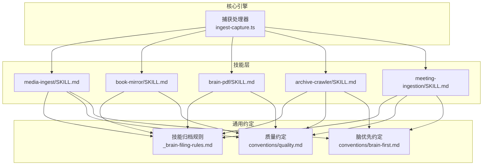
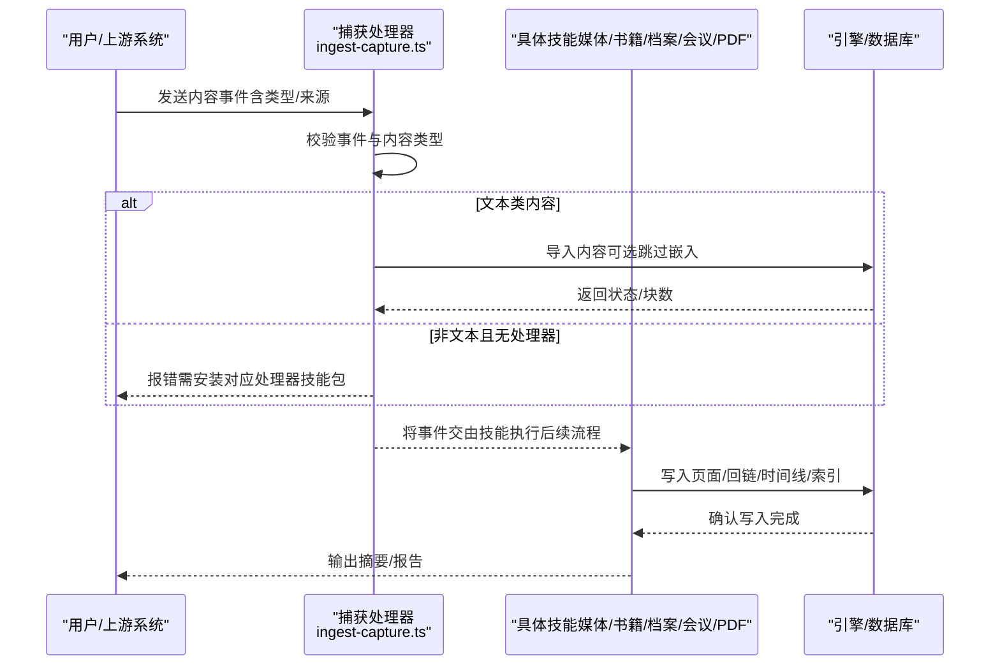
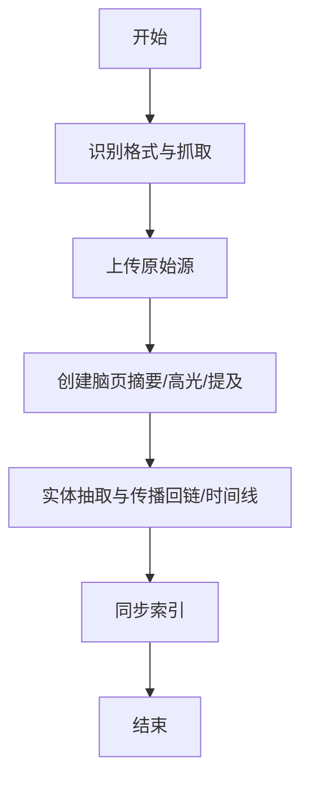
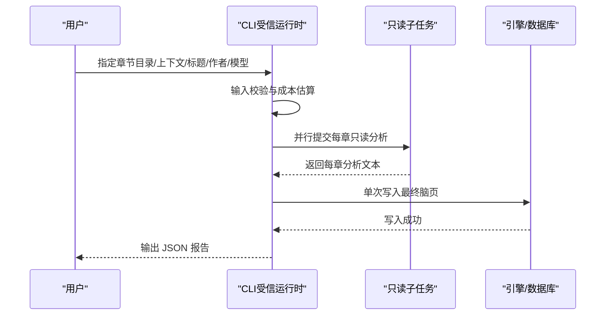
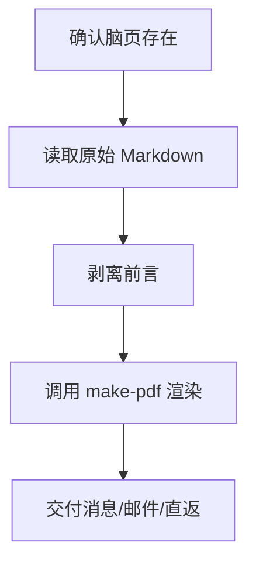
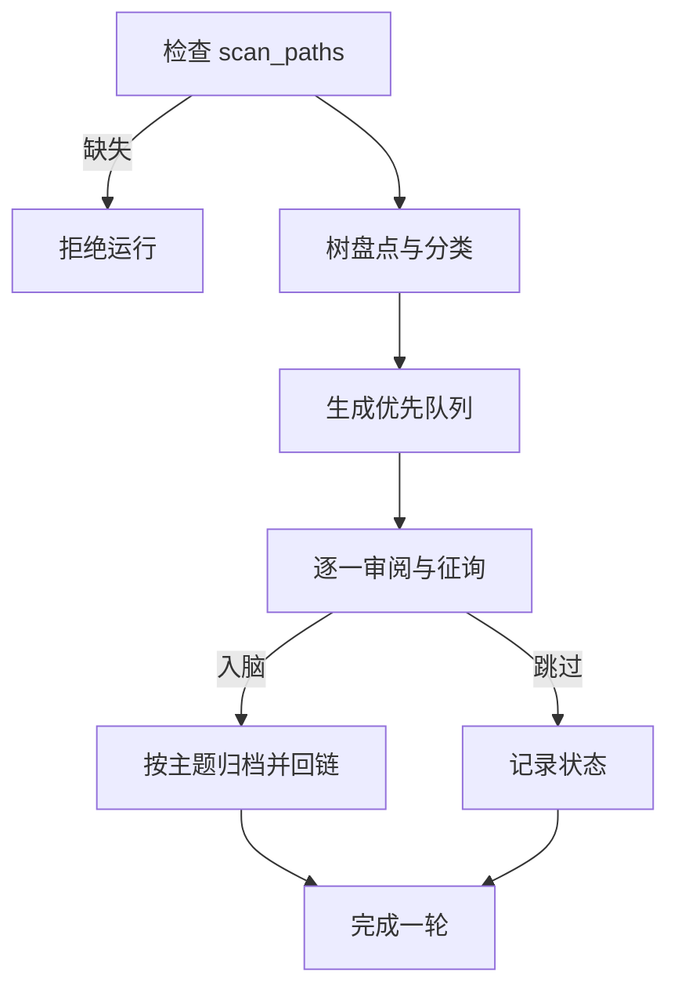
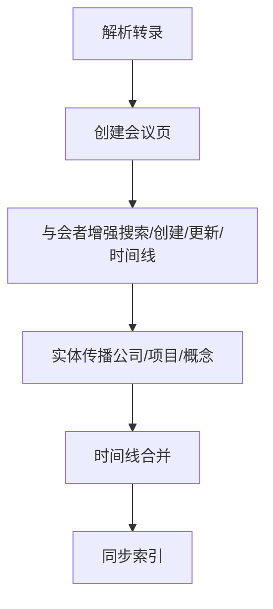
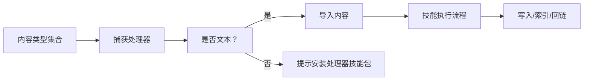

# 内容处理技能

<cite>
**本文引用的文件**
- [README.md](file://README.md)
- [skillpack-anatomy.md](file://docs/skillpack-anatomy.md)
- [media-ingest/SKILL.md](file://skills/media-ingest/SKILL.md)
- [book-mirror/SKILL.md](file://skills/book-mirror/SKILL.md)
- [brain-pdf/SKILL.md](file://skills/brain-pdf/SKILL.md)
- [archive-crawler/SKILL.md](file://skills/archive-crawler/SKILL.md)
- [meeting-ingestion/SKILL.md](file://skills/meeting-ingestion/SKILL.md)
- [_brain-filing-rules.md](file://skills/_brain-filing-rules.md)
- [conventions/quality.md](file://skills/conventions/quality.md)
- [conventions/brain-first.md](file://skills/conventions/brain-first.md)
- [ingest-capture.ts](file://src/core/minions/handlers/ingest-capture.ts)
- [types.test.ts](file://test/ingestion/types.test.ts)
- [ingest-capture.test.ts](file://test/ingestion/ingest-capture.test.ts)
</cite>

## 目录
1. [引言](#引言)
2. [项目结构](#项目结构)
3. [核心组件](#核心组件)
4. [架构总览](#架构总览)
5. [详细组件分析](#详细组件分析)
6. [依赖关系分析](#依赖关系分析)
7. [性能考量](#性能考量)
8. [故障排查指南](#故障排查指南)
9. [结论](#结论)
10. [附录](#附录)

## 引言
本文件系统化梳理 GBrain 的“内容处理技能”，围绕媒体摄取、书籍镜像（个性化书评）、PDF 处理与导出、档案爬虫、会议摄取等能力，阐述其功能特性、应用场景、处理流程、转换机制与质量保障，并给出预处理、格式标准化与元数据提取的技术要点及配置建议。读者可据此为不同来源的内容建立稳健的入脑流水线。

## 项目结构
- 技能以“技能包”形式组织，每个技能由一个 SKILL.md 描述触发词、工具清单、写入目录、契约与流程；路由评估文件用于校准意图匹配。
- 入脑核心通过“捕获处理器”统一接入文本/二进制内容，按类型分派到相应处理器或报错提示安装对应技能包。
- 质量与归档规则由通用约定文件约束，确保跨技能一致的引用、回链、存档与溯源。

图示来源
- [media-ingest/SKILL.md:1-122](file://skills/media-ingest/SKILL.md#L1-L122)
- [book-mirror/SKILL.md:1-351](file://skills/book-mirror/SKILL.md#L1-L351)
- [brain-pdf/SKILL.md:1-187](file://skills/brain-pdf/SKILL.md#L1-L187)
- [archive-crawler/SKILL.md:1-321](file://skills/archive-crawler/SKILL.md#L1-L321)
- [meeting-ingestion/SKILL.md:1-125](file://skills/meeting-ingestion/SKILL.md#L1-L125)
- [_brain-filing-rules.md:1-193](file://skills/_brain-filing-rules.md#L1-L193)
- [conventions/quality.md:1-41](file://skills/conventions/quality.md#L1-L41)
- [conventions/brain-first.md:1-119](file://skills/conventions/brain-first.md#L1-L119)
- [ingest-capture.ts:89-127](file://src/core/minions/handlers/ingest-capture.ts#L89-L127)

章节来源
- [README.md:261-261](file://README.md#L261-L261)
- [skillpack-anatomy.md:1-113](file://docs/skillpack-anatomy.md#L1-L113)

## 核心组件
- 媒体摄取（media-ingest）：覆盖视频/音频/YouTube/截图/仓库等多格式，强调“以主题为主归档、保留原始源、实体抽取与回链”。
- 书籍镜像（book-mirror）：面向 EPUB/PDF 的个性化两栏分析页，左列保留原文，右列结合用户脑内上下文映射到个人生活，最终落盘为专属页。
- PDF 处理（brain-pdf）：将脑页渲染为出版级 PDF，强调“脑页为真源、PDF 仅为渲染”。
- 档案爬虫（archive-crawler）：在显式允许列表内的本地/云归档中筛选高价值内容，交互式三阶段（盘点/爬取/入脑），严格安全门禁。
- 会议摄取（meeting-ingestion）：从会议转录构建会议页，强制对与会者与公司进行“实体传播”与时间线合并，确保回链完整。

章节来源
- [media-ingest/SKILL.md:1-122](file://skills/media-ingest/SKILL.md#L1-L122)
- [book-mirror/SKILL.md:1-351](file://skills/book-mirror/SKILL.md#L1-L351)
- [brain-pdf/SKILL.md:1-187](file://skills/brain-pdf/SKILL.md#L1-L187)
- [archive-crawler/SKILL.md:1-321](file://skills/archive-crawler/SKILL.md#L1-L321)
- [meeting-ingestion/SKILL.md:1-125](file://skills/meeting-ingestion/SKILL.md#L1-L125)

## 架构总览
内容入脑的统一入口是“捕获处理器”。它根据事件内容类型判断是否需要专用处理器，若无则提示安装对应技能包；随后调用导入流程生成页面、索引块并返回结果。各技能在各自流程中遵循“按主题归档、回链与引用、保留原始源”的通用规则。

图示来源
- [ingest-capture.ts:89-127](file://src/core/minions/handlers/ingest-capture.ts#L89-L127)
- [types.test.ts:40-49](file://test/ingestion/types.test.ts#L40-L49)
- [ingest-capture.test.ts:134-167](file://test/ingestion/ingest-capture.test.ts#L134-L167)

## 详细组件分析

### 媒体摄取（media-ingest）
- 功能与场景
  - 支持视频/音频/YouTube/截图/仓库等内容，自动识别格式并抓取/转录/OCR/解析。
  - 强制“按主题归档”，而非按格式归档；保留原始源文件以便溯源。
  - 对人名/公司名进行实体抽取与回链，确保知识图谱连通性。
- 处理流程
  - 阶段一：识别格式并抓取（转录/OCR/解析）。
  - 阶段二：上传原始源文件。
  - 阶段三：创建脑页（摘要/高光/提及的人/公司）。
  - 阶段四：实体抽取与传播（创建/更新实体页、回链、时间线条目）。
  - 阶段五：同步索引。
- 质量与合规
  - 必须保留原始源；禁止仅转录不分析；必须回链；不得按格式归档。
- 示例与配置
  - 触发短语覆盖视频/YouTube/音频/PDF/截图/仓库等场景。
  - 写入目录包括概念/人物/公司/来源等，遵循“按主题归档”。

图示来源
- [media-ingest/SKILL.md:55-109](file://skills/media-ingest/SKILL.md#L55-L109)

章节来源
- [media-ingest/SKILL.md:1-122](file://skills/media-ingest/SKILL.md#L1-L122)
- [_brain-filing-rules.md:63-133](file://skills/_brain-filing-rules.md#L63-L133)

### 书籍镜像（book-mirror）
- 功能与场景
  - 将任意 EPUB/PDF 转为“个性化两栏分析页”：左侧保留原文，右侧映射到读者实际生活与脑内上下文。
  - 采用只读子任务并最终一次性写入，确保可信边界。
- 处理流程
  - 获取书籍（手动提供路径或已存在于脑仓）。
  - 提取章节文本（EPUB 解包/HTML 清洗；PDF 分章）。
  - 收集上下文（模板、近期反思、主题检索、实体页面、既有模式）。
  - 并行子任务分析（每章独立只读任务），组装为单一脑页。
  - 可选 PDF 渲染（借助 brain-pdf）。
  - 后事实核查与回链。
- 质量与合规
  - 左栏忠实保留原文；右栏使用读者“原话”与具体日期/人物；避免强行关联。
  - 严格信任边界：子任务仅只读，最终写入由受信 CLI 执行。
- 示例与配置
  - 默认模型为 Opus；成本门控仅在交互终端生效，非 TTY 需显式确认。
  - 输出位于 media/books/<slug>-personalized.md，可选 PDF。

图示来源
- [book-mirror/SKILL.md:204-232](file://skills/book-mirror/SKILL.md#L204-L232)
- [book-mirror/SKILL.md:246-255](file://skills/book-mirror/SKILL.md#L246-L255)

章节来源
- [book-mirror/SKILL.md:1-351](file://skills/book-mirror/SKILL.md#L1-L351)
- [_brain-filing-rules.md:26-43](file://skills/_brain-filing-rules.md#L26-L43)

### PDF 处理（brain-pdf）
- 功能与场景
  - 将任意脑页渲染为出版级 PDF，适合分享、归档与交付。
- 处理流程
  - 确认脑页存在；读取原始 Markdown（本地或 API）。
  - 剥离 YAML 前言；调用 gstack make-pdf 渲染；交付至用户偏好渠道。
- 质量与合规
  - 脑页为真源；PDF 仅为渲染；默认关闭封面/目录；字体与水印按需开启。
- 示例与配置
  - 容器环境需设置 CONTAINER=1；可自定义标题/作者；交付避免使用原始媒体标签。

图示来源
- [brain-pdf/SKILL.md:55-117](file://skills/brain-pdf/SKILL.md#L55-L117)
- [brain-pdf/SKILL.md:138-151](file://skills/brain-pdf/SKILL.md#L138-L151)

章节来源
- [brain-pdf/SKILL.md:1-187](file://skills/brain-pdf/SKILL.md#L1-L187)

### 档案爬虫（archive-crawler）
- 功能与场景
  - 在显式允许列表内的本地/云归档中筛选“黄金内容”（写作/对话/想法/关系/创意/起源故事/情感内容），交互式三阶段工作流。
- 安全与合规
  - 强制安全门禁：未配置 scan_paths 则拒绝运行；读取用户归档规则动态决定落盘位置。
- 处理流程
  - 盘点：枚举树、分类文件夹、生成清单。
  - 爬取：逐项应用“黄金过滤器”，展示并征询用户，入脑后标记状态。
  - 入脑：按“主要主题”归档，保持回链与时间线一致性。
- 示例与配置
  - 在 gbrain.yml 中显式声明 scan_paths；可选 deny_paths；支持 Dropbox/B2/Gmail 取出等多源。

图示来源
- [archive-crawler/SKILL.md:29-58](file://skills/archive-crawler/SKILL.md#L29-L58)
- [archive-crawler/SKILL.md:106-151](file://skills/archive-crawler/SKILL.md#L106-L151)

章节来源
- [archive-crawler/SKILL.md:1-321](file://skills/archive-crawler/SKILL.md#L1-L321)
- [_brain-filing-rules.md:15-25](file://skills/_brain-filing-rules.md#L15-L25)

### 会议摄取（meeting-ingestion）
- 功能与场景
  - 从会议转录构建会议页，强制对与会者与公司进行“实体传播”与时间线合并，确保回链完整。
- 处理流程
  - 解析转录（与会者/时间/议题/决策/行动项/公司/项目）。
  - 创建会议页（摘要/决策/行动项/讨论笔记）。
  - 与会者强制“出席”实体增强（搜索/创建/更新/时间线条目）。
  - 实体传播（公司/项目/概念）：创建/更新、时间线条目、回链。
  - 时间线合并：同一事件在所有相关实体时间线上出现。
  - 同步索引。
- 示例与配置
  - 写入目录包括会议/人物/公司；回链与时间线为强制要求。

图示来源
- [meeting-ingestion/SKILL.md:47-112](file://skills/meeting-ingestion/SKILL.md#L47-L112)

章节来源
- [meeting-ingestion/SKILL.md:1-125](file://skills/meeting-ingestion/SKILL.md#L1-L125)
- [_brain-filing-rules.md:63-75](file://skills/_brain-filing-rules.md#L63-L75)

## 依赖关系分析
- 统一入口：捕获处理器负责内容类型判定与导入；文本类直接导入，非文本类需安装对应处理器技能包。
- 通用约定：所有写入均需遵循“按主题归档、回链、引用、保留原始源”等规则；脑优先约定指导外部查询顺序。
- 质量门禁：测试覆盖内容类型集合、哈希计算与捕获处理器错误路径，确保类型识别与错误提示正确。

图示来源
- [types.test.ts:40-49](file://test/ingestion/types.test.ts#L40-L49)
- [ingest-capture.ts:89-108](file://src/core/minions/handlers/ingest-capture.ts#L89-L108)
- [ingest-capture.test.ts:134-167](file://test/ingestion/ingest-capture.test.ts#L134-L167)

章节来源
- [ingest-capture.ts:89-127](file://src/core/minions/handlers/ingest-capture.ts#L89-L127)
- [conventions/quality.md:5-41](file://skills/conventions/quality.md#L5-L41)
- [conventions/brain-first.md:29-48](file://skills/conventions/brain-first.md#L29-L48)

## 性能考量
- 流水线并行化：书籍镜像采用每章只读子任务并行，最终一次性写入，降低写放大与冲突风险。
- 嵌入延迟：捕获处理器默认跳过嵌入，可在调用方选择性开启，避免不必要的向量化开销。
- 存储与溯源：小文件保留在脑仓，大文件走云端并生成重定向指针，兼顾检索效率与存储体积。
- 同步策略：批量写入具备重试与健康检查，减少长事务与连接抖动带来的失败率。

## 故障排查指南
- 二进制内容未安装处理器
  - 现象：收到“需要内容类型处理器”的错误提示。
  - 处理：安装对应技能包（如音频转录、图像 OCR），或在上游将内容预处理为文本/Markdown。
- 未配置扫描路径导致档案爬虫拒绝运行
  - 现象：技能直接退出并提示缺少 scan_paths。
  - 处理：在 gbrain.yml 中添加明确的允许路径列表。
- 写入后未见索引更新
  - 现象：新页面不可检索。
  - 处理：在子任务结束后触发同步，使新增页面可被检索。
- 回链缺失或引用不规范
  - 现象：知识图谱断裂或引用层级混乱。
  - 处理：严格遵循“按主题归档、回链、引用”约定，确保跨页链接与时间线条目完整。

章节来源
- [ingest-capture.ts:89-108](file://src/core/minions/handlers/ingest-capture.ts#L89-L108)
- [archive-crawler/SKILL.md:29-58](file://skills/archive-crawler/SKILL.md#L29-L58)
- [conventions/quality.md:23-31](file://skills/conventions/quality.md#L23-L31)
- [conventions/brain-first.md:45-48](file://skills/conventions/brain-first.md#L45-L48)

## 结论
上述内容处理技能以“统一入口、主题归档、回链与引用、保留原始源、脑优先查询”为核心原则，覆盖从多模态媒体到结构化会议、从个人归档到出版级 PDF 的全链路需求。通过并行化与延迟嵌入等设计，既保证吞吐又兼顾质量；通过安全门禁与信任边界，确保在复杂来源下的可控与可审计。

## 附录
- 技能包结构参考：技能包由 manifest、skills、runbooks、test/e2e/evals 等组成，第三方可据此开发与发布。
- 内容类型集合：文本/HTML/JSON/PDF/图片/音频/视频/未知等，错误路径提示安装对应处理器。
- 通用约定速览：质量（引用/回链/可识别性）、脑优先（检索优先于外部 API）、归档规则（按主题归档、保留原始源）。

章节来源
- [skillpack-anatomy.md:8-36](file://docs/skillpack-anatomy.md#L8-L36)
- [types.test.ts:40-49](file://test/ingestion/types.test.ts#L40-L49)
- [conventions/quality.md:1-41](file://skills/conventions/quality.md#L1-L41)
- [conventions/brain-first.md:1-119](file://skills/conventions/brain-first.md#L1-L119)
- [_brain-filing-rules.md:1-193](file://skills/_brain-filing-rules.md#L1-L193)