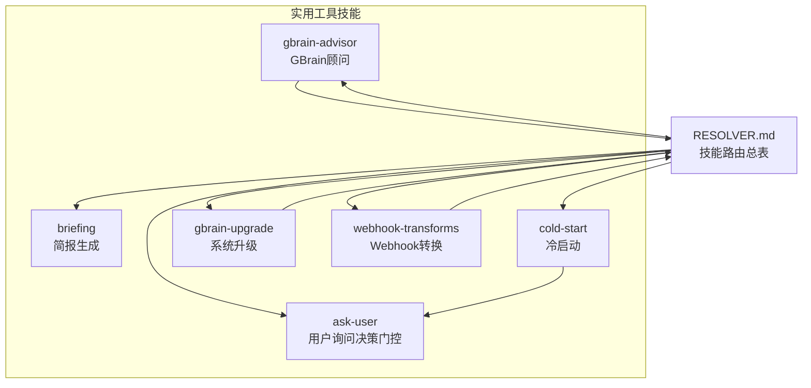
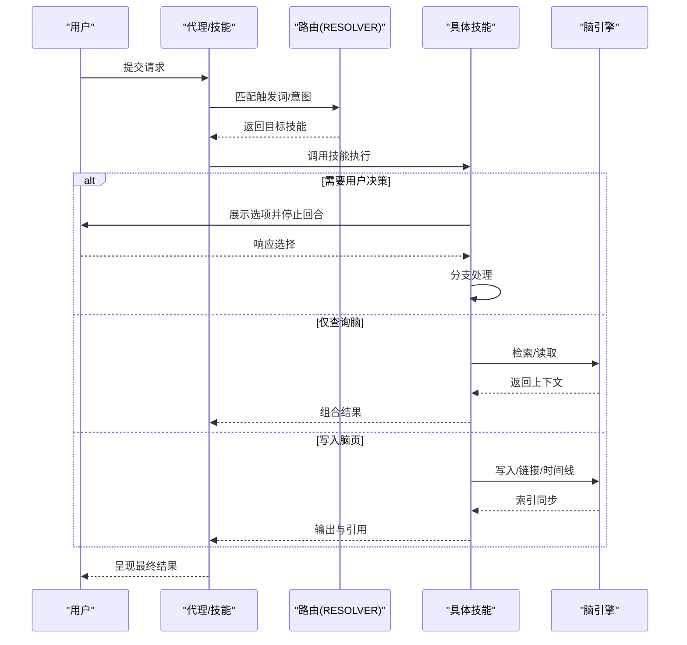
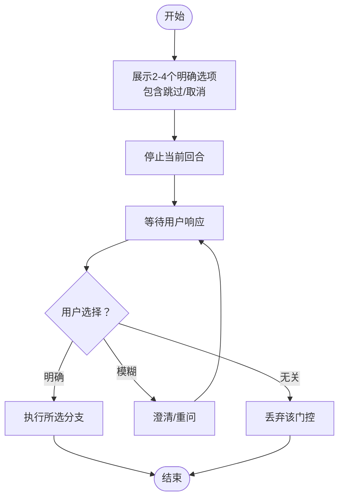
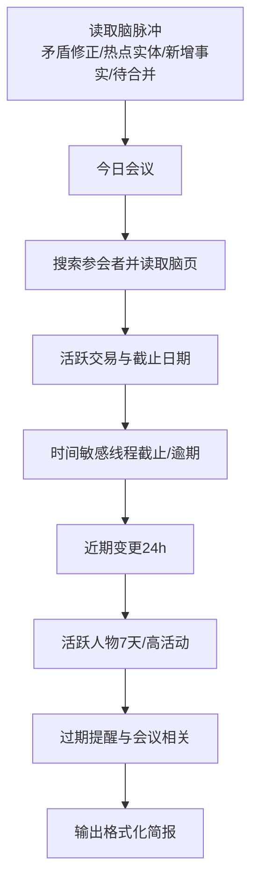
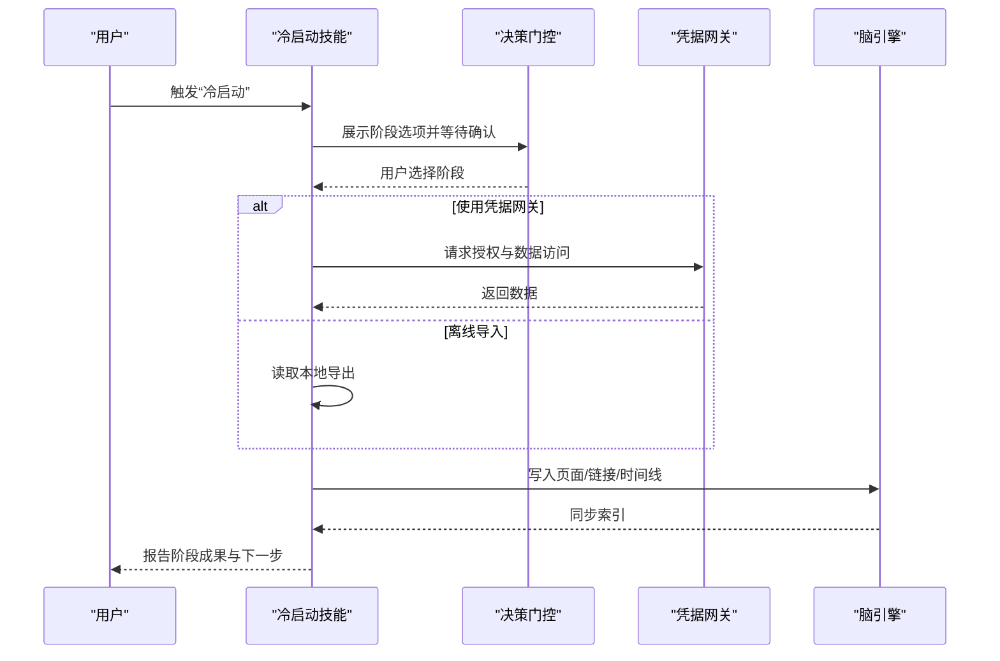
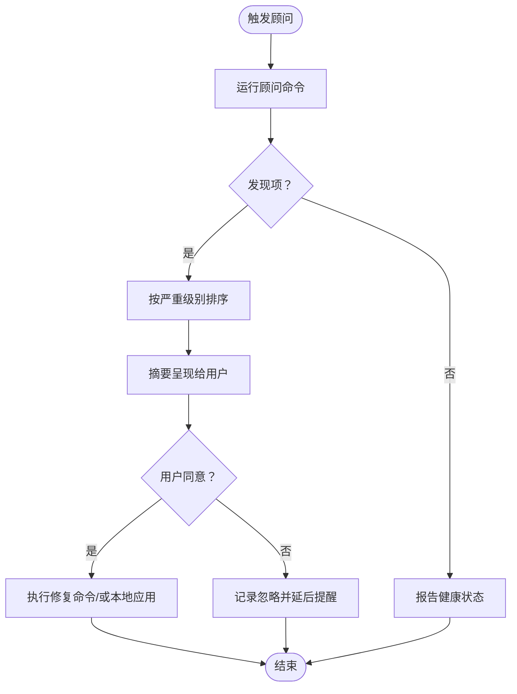
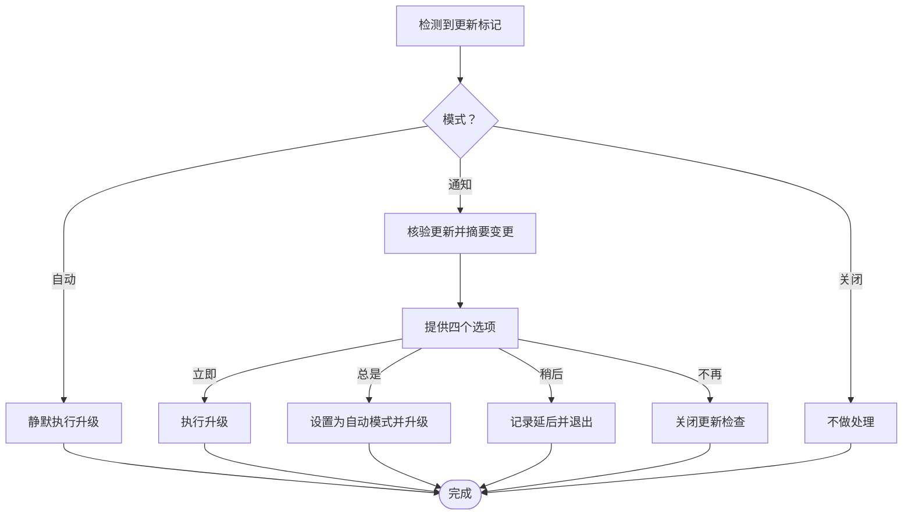
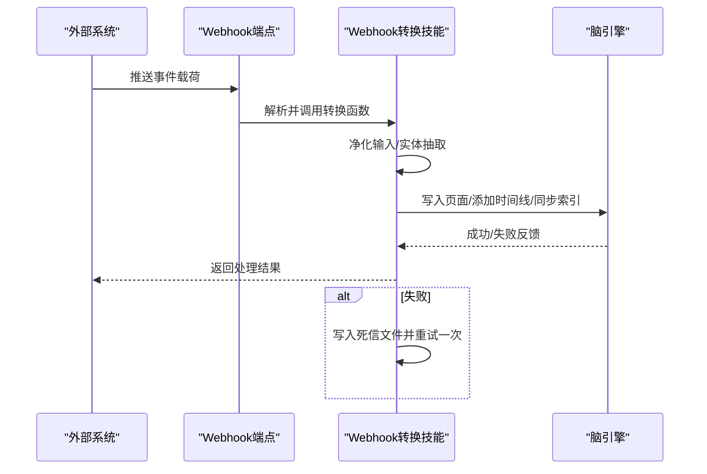
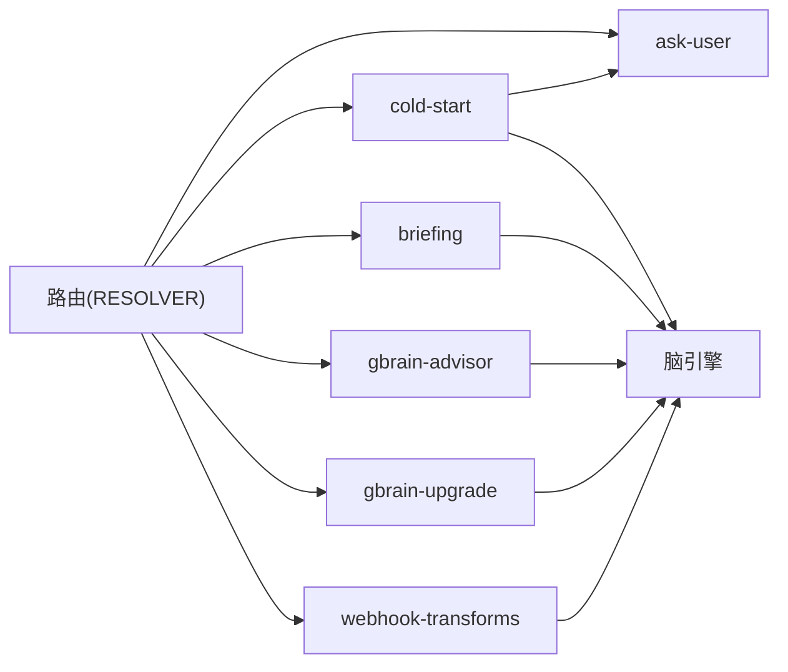

# 实用工具技能

<cite>
**本文引用的文件**
- [README.md](file://README.md)
- [skills/ask-user/SKILL.md](file://skills/ask-user/SKILL.md)
- [skills/briefing/SKILL.md](file://skills/briefing/SKILL.md)
- [skills/cold-start/SKILL.md](file://skills/cold-start/SKILL.md)
- [skills/gbrain-advisor/SKILL.md](file://skills/gbrain-advisor/SKILL.md)
- [skills/gbrain-upgrade/SKILL.md](file://skills/gbrain-upgrade/SKILL.md)
- [skills/webhook-transforms/SKILL.md](file://skills/webhook-transforms/SKILL.md)
- [skills/RESOLVER.md](file://skills/RESOLVER.md)
</cite>

## 目录
1. [简介](#简介)
2. [项目结构](#项目结构)
3. [核心组件](#核心组件)
4. [架构总览](#架构总览)
5. [详细组件分析](#详细组件分析)
6. [依赖关系分析](#依赖关系分析)
7. [性能考量](#性能考量)
8. [故障排查指南](#故障排查指南)
9. [结论](#结论)
10. [附录](#附录)

## 简介
本文件聚焦于“实用工具技能”，涵盖以下辅助性能力：用户询问（决策门控）、简报生成、冷启动、GBrain顾问、系统升级、Webhook 转换等。内容面向日常使用与团队协作，解释各工具的适用场景、配置方法、集成方式，并提供定制化与扩展建议，帮助在工作流中高效落地。

## 项目结构
实用工具技能以“技能”为单元组织，每个技能通过触发词与工具契约定义职责边界，配合路由规则进行分发。下图展示与本文相关的核心技能及其交互关系。

**图表来源**
- [skills/RESOLVER.md](file://skills/RESOLVER.md)
- [skills/ask-user/SKILL.md](file://skills/ask-user/SKILL.md)
- [skills/briefing/SKILL.md](file://skills/briefing/SKILL.md)
- [skills/cold-start/SKILL.md](file://skills/cold-start/SKILL.md)
- [skills/gbrain-advisor/SKILL.md](file://skills/gbrain-advisor/SKILL.md)
- [skills/gbrain-upgrade/SKILL.md](file://skills/gbrain-upgrade/SKILL.md)
- [skills/webhook-transforms/SKILL.md](file://skills/webhook-transforms/SKILL.md)

**章节来源**
- [skills/RESOLVER.md](file://skills/RESOLVER.md)

## 核心组件
- 用户询问（ask-user）
  - 作用：在关键决策点呈现明确选项，强制等待用户响应后再继续，避免默认假设与误操作。
  - 关键约束：2–4 个选项、自解释标签、必须包含“跳过/取消”、一次只问一个问题。
- 简报生成（briefing）
  - 作用：基于脑内上下文生成每日简报，包含会议、交易、行动项、近期变化、活跃人物与过期提醒。
  - 上下文加载：先从脑内检索与读取，再生成输出；所有事实需带来源标注。
- 冷启动（cold-start）
  - 作用：新脑初始化时，按信息密度×易导入度优先序列完成数据填充，支持安全凭据网关与离线导入。
  - 阶段化：Markdown/Obsidian、联系人、日历、邮件、对话导出、社交归档、文件归档、会议转录等。
- GBrain顾问（gbrain-advisor）
  - 作用：周期性或按需运行，给出可执行建议清单，严格“只读”，修复前必须征询用户同意。
- 系统升级（gbrain-upgrade）
  - 作用：根据版本标记自动执行升级动作，支持通知模式（确认后执行）与自动模式（静默执行）。
- Webhook转换（webhook-transforms）
  - 作用：将外部事件（短信、会议、社交提及）转换为脑内页面，保留原始载荷，执行实体抽取与时间线更新。

**章节来源**
- [skills/ask-user/SKILL.md](file://skills/ask-user/SKILL.md)
- [skills/briefing/SKILL.md](file://skills/briefing/SKILL.md)
- [skills/cold-start/SKILL.md](file://skills/cold-start/SKILL.md)
- [skills/gbrain-advisor/SKILL.md](file://skills/gbrain-advisor/SKILL.md)
- [skills/gbrain-upgrade/SKILL.md](file://skills/gbrain-upgrade/SKILL.md)
- [skills/webhook-transforms/SKILL.md](file://skills/webhook-transforms/SKILL.md)

## 架构总览
实用工具技能遵循“脑优先”的原则：在调用外部服务之前，先查询脑内已有知识；在写入脑页时，确保引用与回链完整；在需要人工决策时，使用“决策门控”模式暂停当前回合，等待用户响应。

**图表来源**
- [skills/RESOLVER.md](file://skills/RESOLVER.md)
- [skills/briefing/SKILL.md](file://skills/briefing/SKILL.md)
- [skills/cold-start/SKILL.md](file://skills/cold-start/SKILL.md)
- [skills/gbrain-advisor/SKILL.md](file://skills/gbrain-advisor/SKILL.md)
- [skills/gbrain-upgrade/SKILL.md](file://skills/gbrain-upgrade/SKILL.md)
- [skills/webhook-transforms/SKILL.md](file://skills/webhook-transforms/SKILL.md)

## 详细组件分析

### 用户询问（ask-user）—— 决策门控模式
- 使用场景
  - 多义请求的路由/归档决策
  - 风险/破坏性操作（批量删除、覆盖）
  - 优先级分流与冷启动阶段门控
- 实施要点
  - 选项数量控制在 2–4；标签自解释；必须提供“跳过/取消”
  - 展示选项后立即停止当前回合，不预设默认或继续后续动作
  - 对文本响应做模糊匹配与容错处理
- 反模式
  - 继续回合推进、默认执行、堆叠多个问题、无逃逸选项、标签含糊不清

**图表来源**
- [skills/ask-user/SKILL.md](file://skills/ask-user/SKILL.md)

**章节来源**
- [skills/ask-user/SKILL.md](file://skills/ask-user/SKILL.md)

### 简报生成（briefing）—— 日常上下文编译
- 使用场景
  - 每日晨会准备、邮件回复前的背景梳理、跨源信息整合
- 数据来源与流程
  - 先读取“脑脉冲”（矛盾修正、热点实体、新增事实、待合并提示）
  - 今日会议：按日历搜索参会者，读取其脑页 Compiled Truth 与关系
  - 活跃交易：筛选最近到期与有更新的交易
  - 时间敏感线程：临近 48 小时的截止与逾期跟进
  - 近期变更：过去 24 小时的页面更新
  - 活跃人物：近 7 天更新且高活动度
  - 过期提醒：与当日会议相关的过期页面
- 引用与回链
  - 所有事实附带来源页与更新日期；若创建/更新页面，需满足回链规则

**图表来源**
- [skills/briefing/SKILL.md](file://skills/briefing/SKILL.md)

**章节来源**
- [skills/briefing/SKILL.md](file://skills/briefing/SKILL.md)

### 冷启动（cold-start）—— 新脑初始化
- 使用场景
  - 安装完成后“现在做什么？”的引导式填充
- 优先级与阶段
  - 优先级：现有 Markdown/Obsidian > 联系人 > 日历 > 邮件 > 对话导出 > 社交归档 > 文件归档 > 会议转录
  - 安全接入：推荐通过凭据网关统一授权，避免代理持有原始密钥
  - 离线替代：如拒绝凭据网关，可使用离线导出（Takeout、归档包、本地文件）
- 关键流程
  - 阶段化门控（ask-user 模式），每阶段记录进度，支持中断后恢复
  - 导入后即刻进行实体检测与交叉链接，避免孤立页面
  - 最终健康检查与检索测试，配置增量同步节奏

**图表来源**
- [skills/cold-start/SKILL.md](file://skills/cold-start/SKILL.md)
- [skills/ask-user/SKILL.md](file://skills/ask-user/SKILL.md)

**章节来源**
- [skills/cold-start/SKILL.md](file://skills/cold-start/SKILL.md)
- [skills/ask-user/SKILL.md](file://skills/ask-user/SKILL.md)

### GBrain顾问（gbrain-advisor）—— 周期性健康检查
- 使用场景
  - 按需咨询“如何更好地使用这脑”、每周例行检查
- 行为规范
  - 严格只读，不自动执行任何修改
  - 以严重级别排序呈现发现项，首次展示“自上次以来的新事项”
  - 仅在用户同意后执行修复命令；对可自动化修复项提供 dispatch_id
- 运行方式
  - 交互式：直接运行顾问命令查看 JSON 结果
  - 计划任务：通过调度器技能每周定时运行，仅读取技能说明并调用顾问

**图表来源**
- [skills/gbrain-advisor/SKILL.md](file://skills/gbrain-advisor/SKILL.md)

**章节来源**
- [skills/gbrain-advisor/SKILL.md](file://skills/gbrain-advisor/SKILL.md)

### 系统升级（gbrain-upgrade）—— 版本管理
- 使用场景
  - 检测到可用更新时的处理：通知模式（确认后执行）、自动模式（静默执行）
- 行为规范
  - 升级动作固定为特定命令，不解析标记中的任意命令字符串
  - 在多步骤任务中途不得强制升级，需征得用户同意
  - 支持失败版本跳过与健康检查提示
- 交互流程
  - 读取配置模式（自动/通知/关闭）
  - 通知模式下先核验更新、摘要变更亮点，再提供四选项（立即升级/总是保持最新/稍后/不再提醒）

**图表来源**
- [skills/gbrain-upgrade/SKILL.md](file://skills/gbrain-upgrade/SKILL.md)

**章节来源**
- [skills/gbrain-upgrade/SKILL.md](file://skills/gbrain-upgrade/SKILL.md)

### Webhook转换（webhook-transforms）—— 外部事件入脑
- 使用场景
  - 将短信、会议完成、社交提及等外部事件标准化为脑内页面
- 流程与保障
  - 定义转换函数：输入为原始载荷，输出为脑页内容与元数据（类型、引用）
  - 注册 Webhook 地址，事件到达后解析、转换、写入脑页、实体抽取、时间线更新、索引同步
  - 安全与健壮性：输入净化（去除 HTML/脚本）、失败重试一次、死信队列保存原始载荷
- 示例
  - 短信：在发送者页面添加时间线条目并识别行动项
  - 会议：委托会议技能处理
  - 社交提及：生成媒体类页面并建立实体关系

**图表来源**
- [skills/webhook-transforms/SKILL.md](file://skills/webhook-transforms/SKILL.md)

**章节来源**
- [skills/webhook-transforms/SKILL.md](file://skills/webhook-transforms/SKILL.md)

## 依赖关系分析
- 路由与触发
  - 技能通过触发词与工具契约被路由模块识别与分发，支持链式组合（如“捕获→归档→增强”）
- 与脑引擎的耦合
  - 查询/读取/写入/链接/时间线等操作均通过脑引擎完成，保证一致性与索引同步
- 与外部系统的边界
  - 冷启动阶段通过凭据网关访问第三方 API；Webhook 转换对输入进行净化与重试，避免 XSS 与丢失事件
- 与用户交互
  - 决策门控贯穿多个技能，确保在关键路径上获得用户确认

**图表来源**
- [skills/RESOLVER.md](file://skills/RESOLVER.md)
- [skills/cold-start/SKILL.md](file://skills/cold-start/SKILL.md)
- [skills/briefing/SKILL.md](file://skills/briefing/SKILL.md)
- [skills/gbrain-advisor/SKILL.md](file://skills/gbrain-advisor/SKILL.md)
- [skills/gbrain-upgrade/SKILL.md](file://skills/gbrain-upgrade/SKILL.md)
- [skills/webhook-transforms/SKILL.md](file://skills/webhook-transforms/SKILL.md)

**章节来源**
- [skills/RESOLVER.md](file://skills/RESOLVER.md)

## 性能考量
- 冷启动阶段建议按优先级分批导入，避免一次性写入造成索引压力；导入后及时进行链接与时间线提取，缩短后续检索路径
- 简报生成应尽量复用脑内缓存与滚动聚合结果，减少重复查询
- Webhook 转换在高并发时注意幂等与重试策略，避免重复写入与资源争用
- 系统升级在自动模式下应避开业务高峰时段，通知模式下允许用户选择合适时机

## 故障排查指南
- 决策门控未生效
  - 检查是否在展示选项后仍继续后续动作；确保回合已停止
- 简报缺少引用或过期信息
  - 确认已从脑内加载上下文并按要求标注来源；对过期页面进行显式提示
- 冷启动导入后实体未链接
  - 确认导入流程中启用了实体检测与交叉链接；检查阶段状态文件是否正确记录
- GBrain顾问未显示新发现
  - 确认顾问运行频率与“自上次以来的新事项”逻辑；检查本地运行历史
- 系统升级卡住或失败
  - 查看失败版本列表与健康检查提示；必要时切换为通知模式手动确认
- Webhook 转换失败
  - 检查死信队列与重试日志；确认输入净化与实体抽取是否正常执行

**章节来源**
- [skills/ask-user/SKILL.md](file://skills/ask-user/SKILL.md)
- [skills/briefing/SKILL.md](file://skills/briefing/SKILL.md)
- [skills/cold-start/SKILL.md](file://skills/cold-start/SKILL.md)
- [skills/gbrain-advisor/SKILL.md](file://skills/gbrain-advisor/SKILL.md)
- [skills/gbrain-upgrade/SKILL.md](file://skills/gbrain-upgrade/SKILL.md)
- [skills/webhook-transforms/SKILL.md](file://skills/webhook-transforms/SKILL.md)

## 结论
实用工具技能围绕“脑优先、可审计、可治理”的设计原则，通过明确的触发词、严格的工具契约与稳健的错误处理，将日常重复性工作转化为可复用、可扩展的智能流程。结合路由总表与各技能的职责边界，可在个人助理或团队共享脑中稳定落地，持续提升知识工作的效率与质量。

## 附录
- 快速参考
  - 决策门控：2–4 选项、自解释标签、必须包含“跳过/取消”
  - 简报：先脑后外、来源标注、热点聚合、过期提醒
  - 冷启动：凭据网关优先、阶段化门控、导入即链接
  - 顾问：只读、分级呈现、修复前征询
  - 升级：固定命令、模式可控、失败跳过
  - Webhook：净化输入、死信队列、重试一次、实体抽取