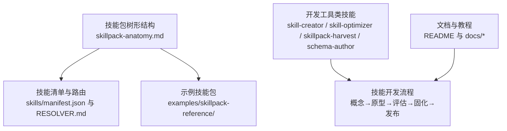
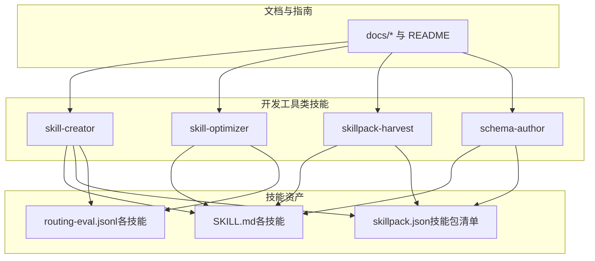
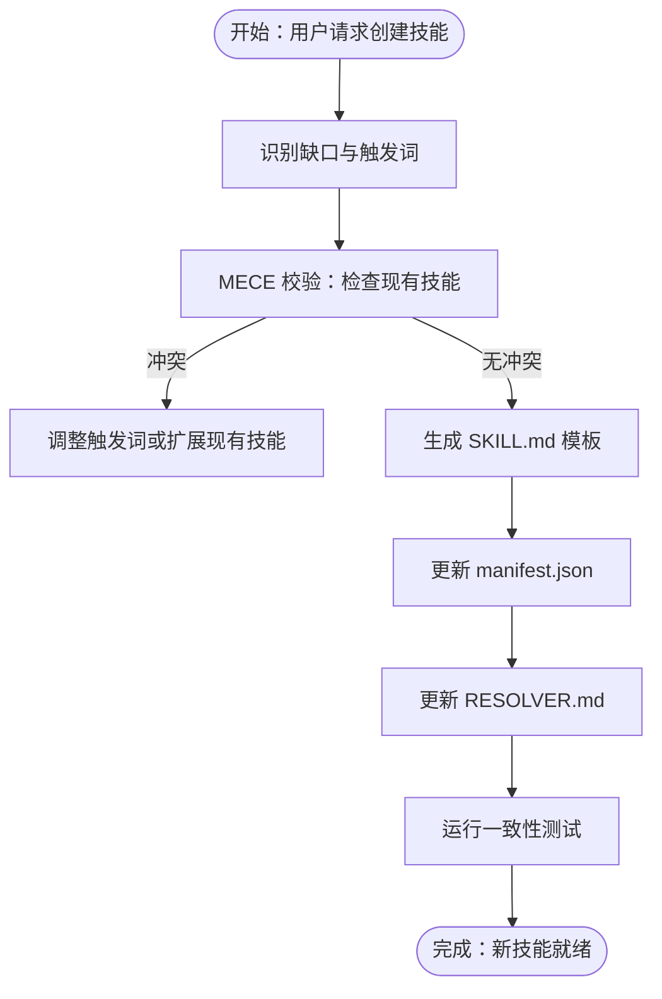
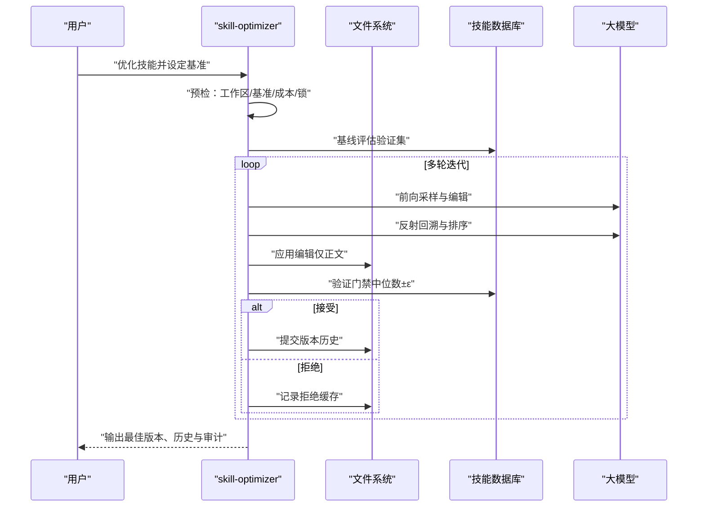
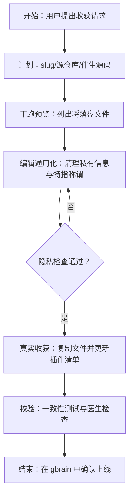
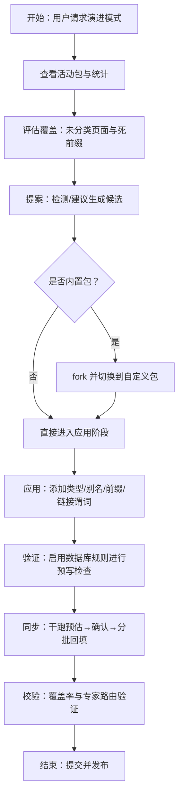
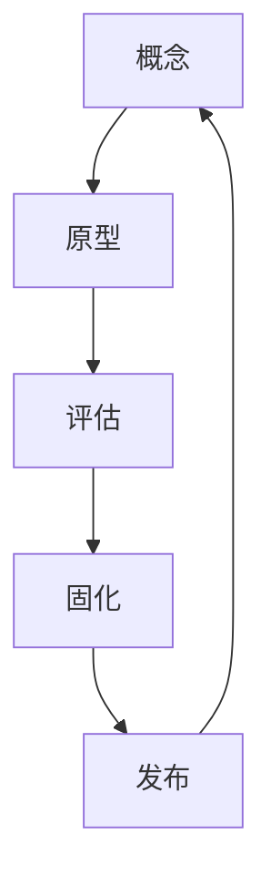
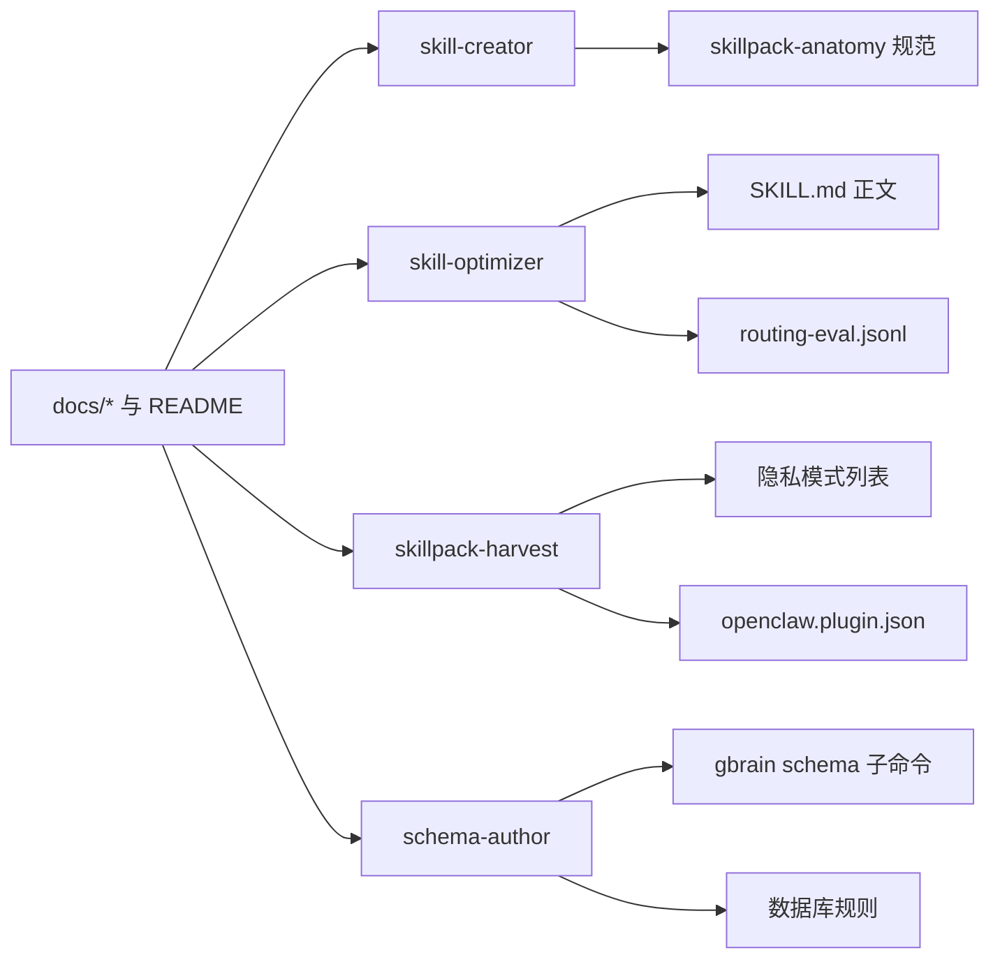

# 开发技能

<cite>
**本文引用的文件**
- [README.md](file://README.md)
- [GBRAIN_SKILLPACK.md](file://docs/GBRAIN_SKILLPACK.md)
- [skillpack-anatomy.md](file://docs/skillpack-anatomy.md)
- [SKILL.md（skill-creator）](file://skills/skill-creator/SKILL.md)
- [SKILL.md（skill-optimizer）](file://skills/skill-optimizer/SKILL.md)
- [SKILL.md（skillpack-harvest）](file://skills/skillpack-harvest/SKILL.md)
- [SKILL.md（schema-author）](file://skills/schema-author/SKILL.md)
- [routing-eval.jsonl（skill-optimizer）](file://skills/skill-optimizer/routing-eval.jsonl)
</cite>

## 目录
1. [引言](#引言)
2. [项目结构](#项目结构)
3. [核心组件](#核心组件)
4. [架构总览](#架构总览)
5. [详细组件分析](#详细组件分析)
6. [依赖关系分析](#依赖关系分析)
7. [性能考虑](#性能考虑)
8. [故障排查指南](#故障排查指南)
9. [结论](#结论)
10. [附录](#附录)

## 引言
本文件系统化梳理 GBrain 的“开发技能”体系，围绕技能创建、技能生成、技能优化、技能包收获与模式作者等开发工具类技能展开，解释技能开发流程、代码生成机制、性能优化策略与模式设计原则，并提供使用指南、最佳实践与实际示例路径，帮助开发者高效构建与迭代高质量技能与技能包。

## 项目结构
- 技能与技能包：技能以 Markdown 文件（SKILL.md）定义意图、契约、阶段、输出格式与反模式；技能包遵循统一树形结构与清单规范，支持发布、校验与打包。
- 工具类技能：skill-creator、skill-optimizer、skillpack-harvest、schema-author 等作为开发工具，贯穿从“概念—原型—评估—固化—发布”的闭环。
- 文档与教程：README 提供总体说明；docs 下的指南与教程为技能开发与运维提供参考。

**图表来源**
- [skillpack-anatomy.md:1-113](file://docs/skillpack-anatomy.md#L1-L113)
- [README.md:1-443](file://README.md#L1-L443)

**章节来源**
- [README.md:1-443](file://README.md#L1-L443)
- [skillpack-anatomy.md:1-113](file://docs/skillpack-anatomy.md#L1-L113)

## 核心组件
- 技能（Skill）
  - 以 SKILL.md 定义：frontmatter（名称、版本、描述、触发词、工具、是否变更等），正文包含契约、阶段、输出格式、反模式与工具使用说明。
  - 路由评估：每个技能配套 routing-eval.jsonl，用于验证触发词与意图匹配度。
- 技能包（Skillpack）
  - 统一树形结构：skillpack.json 清单、skills/<slug>/SKILL.md、routing-eval.jsonl、runbooks、test/e2e/evals 等。
  - 医生评分：基于 rubric 的十维检查，覆盖清单有效性、触发唯一性、评测文件存在性、测试与评测配置、许可证等。
- 开发工具类技能
  - skill-creator：生成符合标准的 SKILL.md 模板，执行 MECE 校验，更新清单与路由。
  - skill-optimizer：基于 SkillOpt 的文本空间优化器，预算受限、验证门禁、原子版本化迭代，产出历史快照与审计记录。
  - skillpack-harvest：将下游成熟技能回流到上游 gbrain 基础包，执行隐私审查与通用化处理。
  - schema-author：演进脑部模式（schema pack），新增页面类型、别名、前缀、链接谓词，支持批量突变与回填。

**章节来源**
- [SKILL.md（skill-creator）:1-83](file://skills/skill-creator/SKILL.md#L1-L83)
- [SKILL.md（skill-optimizer）:1-189](file://skills/skill-optimizer/SKILL.md#L1-L189)
- [SKILL.md（skillpack-harvest）:1-270](file://skills/skillpack-harvest/SKILL.md#L1-L270)
- [SKILL.md（schema-author）:1-306](file://skills/schema-author/SKILL.md#L1-L306)
- [routing-eval.jsonl（skill-optimizer）:1-7](file://skills/skill-optimizer/routing-eval.jsonl#L1-L7)
- [skillpack-anatomy.md:1-113](file://docs/skillpack-anatomy.md#L1-L113)

## 架构总览
下图展示开发工具类技能在技能生命周期中的位置与交互：

**图表来源**
- [SKILL.md（skill-creator）:1-83](file://skills/skill-creator/SKILL.md#L1-L83)
- [SKILL.md（skill-optimizer）:1-189](file://skills/skill-optimizer/SKILL.md#L1-L189)
- [SKILL.md（skillpack-harvest）:1-270](file://skills/skillpack-harvest/SKILL.md#L1-L270)
- [SKILL.md（schema-author）:1-306](file://skills/schema-author/SKILL.md#L1-L306)
- [skillpack-anatomy.md:1-113](file://docs/skillpack-anatomy.md#L1-L113)
- [README.md:1-443](file://README.md#L1-L443)

## 详细组件分析

### 组件A：技能创建（skill-creator）
- 目标：按 GBrain 规范生成新技能，确保 MECE、清单与路由同步更新。
- 关键流程
  - 识别缺口：明确用户意图与缺失能力。
  - MECE 校验：比对现有 manifest 与 RESOLVER，避免重复。
  - 生成模板：填充 frontmatter 与正文结构。
  - 更新清单与路由：写入 skills/manifest.json 与 skills/RESOLVER.md。
  - 验证：运行技能一致性测试。
- 输出：新的 SKILL.md、更新后的清单与路由条目。

**图表来源**
- [SKILL.md（skill-creator）:1-83](file://skills/skill-creator/SKILL.md#L1-L83)

**章节来源**
- [SKILL.md（skill-creator）:1-83](file://skills/skill-creator/SKILL.md#L1-L83)

### 组件B：技能优化（skill-optimizer）
- 目标：通过文本空间优化提升技能质量，严格验证门禁与预算控制。
- 关键机制
  - 启动门禁：工作区干净、基准有效、成本预检、技能级数据库锁。
  - 基线评估：在验证集上打分，记录最佳分数。
  - 迭代优化：前向采样、反射回溯、余弦调度裁剪、应用编辑、验证门禁。
  - 结果产出：更新 SKILL.md、最佳版本快照、历史记录与拒绝缓存、审计日志。
- 使用建议
  - 优先从现有 SKILL.md 或路由评估文件自动生成基准，人工强化规则判据后再运行。
  - 对内置技能需显式授权与独立保留集，否则仅输出拟议版本供审阅。

**图表来源**
- [SKILL.md（skill-optimizer）:1-189](file://skills/skill-optimizer/SKILL.md#L1-L189)
- [routing-eval.jsonl（skill-optimizer）:1-7](file://skills/skill-optimizer/routing-eval.jsonl#L1-L7)

**章节来源**
- [SKILL.md（skill-optimizer）:1-189](file://skills/skill-optimizer/SKILL.md#L1-L189)
- [routing-eval.jsonl（skill-optimizer）:1-7](file://skills/skill-optimizer/routing-eval.jsonl#L1-L7)

### 组件C：技能包收获（skillpack-harvest）
- 目标：将下游成熟的技能回流到 gbrain 基础包，形成可复用的上游资产。
- 关键流程
  - 计划：确定目标 slug、源仓库与是否带伴生源码。
  - 干跑预览：查看将要落地的文件集合与隐私提示。
  - 编辑通用化：去除私有实体、替换特定称谓、规范化触发词与示例。
  - 实际收获：执行复制、隐私检查、更新 openclaw.plugin.json。
  - 校验：在 gbrain 中运行一致性测试与医生检查。
- 注意事项
  - 必须先干跑预览，再真实执行。
  - 私人内容必须清理，必要时可临时绕过但需在提交信息中说明原因。
  - 不支持批量收获，每次仅处理一个技能。

**图表来源**
- [SKILL.md（skillpack-harvest）:1-270](file://skills/skillpack-harvest/SKILL.md#L1-L270)

**章节来源**
- [SKILL.md（skillpack-harvest）:1-270](file://skills/skillpack-harvest/SKILL.md#L1-L270)

### 组件D：模式作者（schema-author）
- 目标：演进脑部模式（schema pack），新增页面类型、别名、前缀、链接谓词，支持批量突变与回填。
- 关键流程
  - 明确当前包：查看活动包状态与统计。
  - 评估覆盖：统计未分类页面与死前缀，定位缺口。
  - 提案：通过检测与建议生成候选类型，结合置信度筛选。
  - 应用：若为内置包需先 fork，再逐项添加类型、别名、前缀与链接谓词；支持批量突变。
  - 同步：先干跑预估回填数量，确认后分批回填现有页面类型。
  - 校验：再次统计覆盖率与专家路由效果。
- 反模式
  - 不直接修改内置包；不为一次性导入目录建类型；不给无前缀类型开启专家路由；不跳过干跑直接应用。

**图表来源**
- [SKILL.md（schema-author）:1-306](file://skills/schema-author/SKILL.md#L1-L306)

**章节来源**
- [SKILL.md（schema-author）:1-306](file://skills/schema-author/SKILL.md#L1-L306)

### 概念总览
- 技能开发循环：概念→原型→评估→固化→发布，贯穿工具类技能的协作与迭代。
- 模式设计原则：类型驱动、MECE 触发、最小可用、可审计、可回滚。
- 性能优化策略：干跑预览、批量回填、验证门禁、预算控制、原子版本化。

（该图为概念性流程示意）

## 依赖关系分析
- 技能与技能包
  - skill-creator 依赖 skillpack-anatomy 的树形规范与 rubric 的一致性检查。
  - skill-optimizer 依赖 routing-eval.jsonl 的判据与 SKILL.md 的正文内容。
  - skillpack-harvest 依赖隐私模式列表与 openclaw.plugin.json 的技能注册。
  - schema-author 依赖 gbrain schema 子命令与数据库规则。
- 文档与指南
  - README 与 docs/* 为技能开发提供背景知识与实操指引。

**图表来源**
- [SKILL.md（schema-author）:1-306](file://skills/schema-author/SKILL.md#L1-L306)
- [SKILL.md（skill-optimizer）:1-189](file://skills/skill-optimizer/SKILL.md#L1-L189)
- [SKILL.md（skill-creator）:1-83](file://skills/skill-creator/SKILL.md#L1-L83)
- [SKILL.md（skillpack-harvest）:1-270](file://skills/skillpack-harvest/SKILL.md#L1-L270)
- [skillpack-anatomy.md:1-113](file://docs/skillpack-anatomy.md#L1-L113)
- [README.md:1-443](file://README.md#L1-L443)

**章节来源**
- [README.md:1-443](file://README.md#L1-L443)
- [skillpack-anatomy.md:1-113](file://docs/skillpack-anatomy.md#L1-L113)

## 性能考虑
- 干跑预览：在执行昂贵操作（如批量回填、隐私扫描、基准生成）前先预览，降低失败成本。
- 分批处理：schema-author 的回填采用 1000 行批次，避免阻塞并发写入。
- 验证门禁：skill-optimizer 的验证门禁（中位数±ε）减少无效迭代，控制 API 成本。
- 原子化与可审计：所有变更均产生审计日志与版本快照，便于回滚与追踪。

（本节为通用指导，无需具体文件引用）

## 故障排查指南
- 隐私检查失败（skillpack-harvest）
  - 现象：收获被拒绝，提示隐私检查命中。
  - 处理：回到编辑通用化阶段，清理私有实体与特指称谓；必要时在提交信息中说明绕过原因。
- 内置包不可变（schema-author）
  - 现象：尝试修改 gbrain-base 或 gbrain-recommended 失败。
  - 处理：先 fork 自定义包，再进行类型与链接谓词的增删改。
- 验证门禁未通过（skill-optimizer）
  - 现象：优化过程中候选未通过验证门禁。
  - 处理：强化规则判据（如 min_citations、section_present、tool_called），重新运行。
- 干跑与应用脱节（schema-author）
  - 现象：干跑结果与实际应用差异较大。
  - 处理：先运行 dry-run，核对 would_apply 数量与样本 slug，确认后再执行 --apply。

**章节来源**
- [SKILL.md（skillpack-harvest）:1-270](file://skills/skillpack-harvest/SKILL.md#L1-L270)
- [SKILL.md（schema-author）:1-306](file://skills/schema-author/SKILL.md#L1-L306)
- [SKILL.md（skill-optimizer）:1-189](file://skills/skill-optimizer/SKILL.md#L1-L189)

## 结论
通过 skill-creator、skill-optimizer、skillpack-harvest、schema-author 四大工具类技能，开发者可以实现从“概念—原型—评估—固化—发布”的闭环，同时借助医生评分、干跑预览、批量回填与验证门禁等机制，确保技能与技能包的质量、安全与可维护性。配合文档与教程，可快速上手并规模化构建高质量的 GBrain 技能生态。

## 附录
- 实际示例路径（以路径代替代码片段）
  - 技能创建：[SKILL.md（skill-creator）:1-83](file://skills/skill-creator/SKILL.md#L1-L83)
  - 技能优化：[SKILL.md（skill-optimizer）:1-189](file://skills/skill-optimizer/SKILL.md#L1-L189)，[routing-eval.jsonl（skill-optimizer）:1-7](file://skills/skill-optimizer/routing-eval.jsonl#L1-L7)
  - 技能包收获：[SKILL.md（skillpack-harvest）:1-270](file://skills/skillpack-harvest/SKILL.md#L1-L270)
  - 模式作者：[SKILL.md（schema-author）:1-306](file://skills/schema-author/SKILL.md#L1-L306)
  - 技能包结构：[skillpack-anatomy.md:1-113](file://docs/skillpack-anatomy.md#L1-L113)
  - 总体说明：[README.md:1-443](file://README.md#L1-L443)