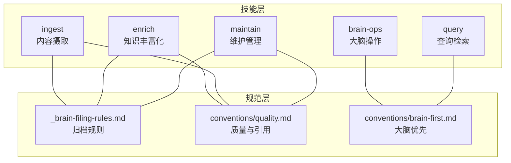
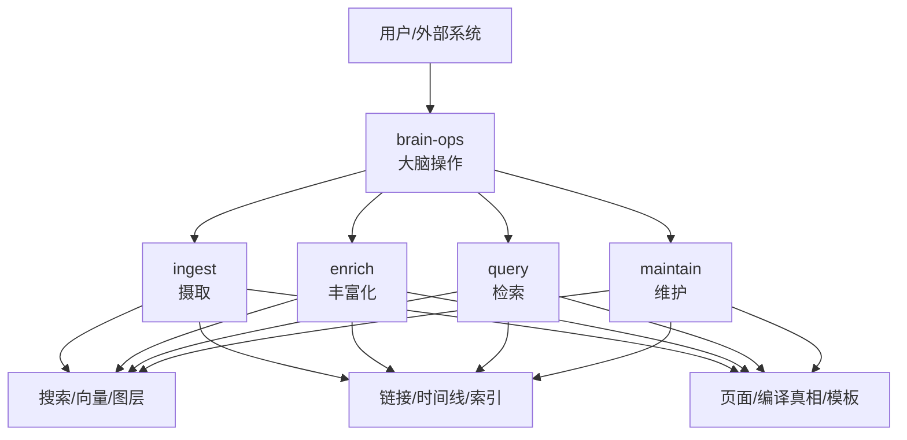
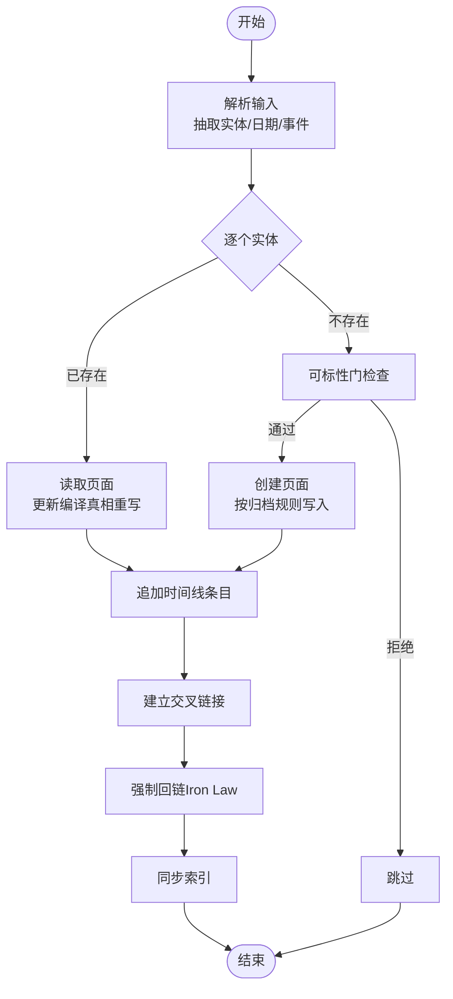
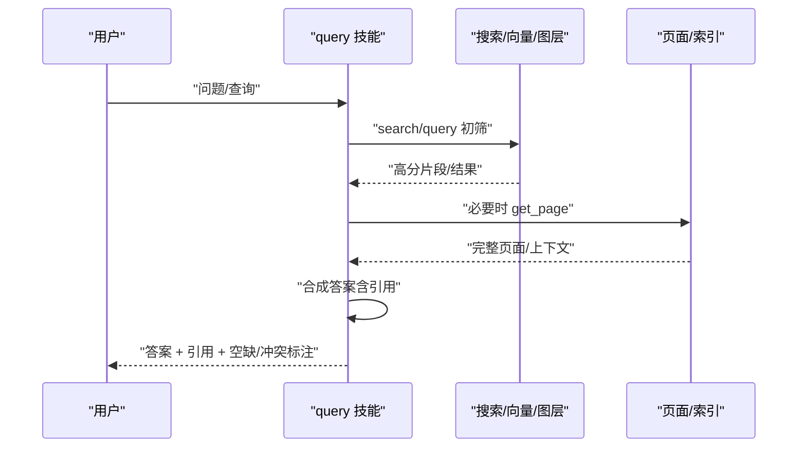
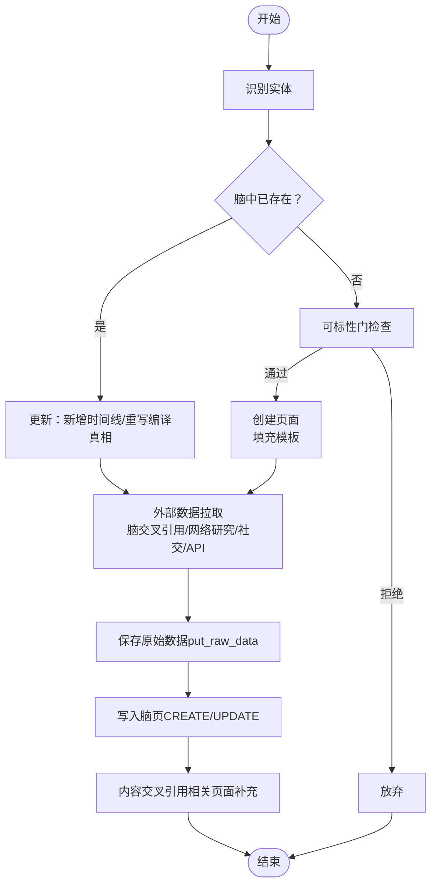
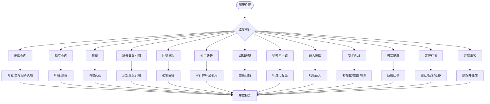
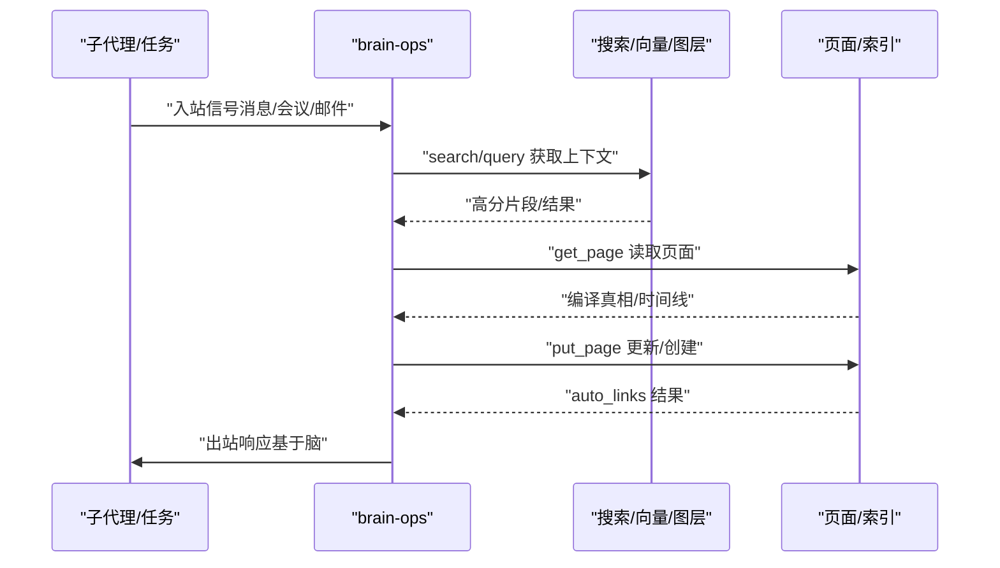
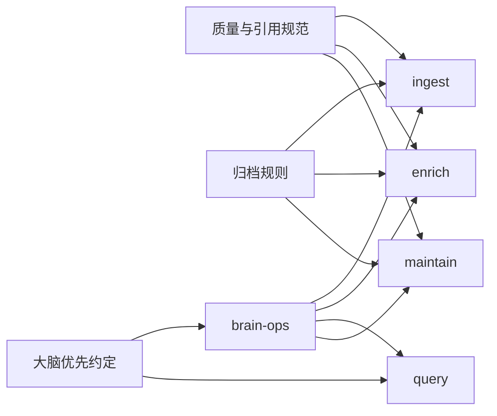

# 核心技能

<cite>
**本文引用的文件**
- [skills/ingest/SKILL.md](file://skills/ingest/SKILL.md)
- [skills/query/SKILL.md](file://skills/query/SKILL.md)
- [skills/enrich/SKILL.md](file://skills/enrich/SKILL.md)
- [skills/maintain/SKILL.md](file://skills/maintain/SKILL.md)
- [skills/brain-ops/SKILL.md](file://skills/brain-ops/SKILL.md)
- [skills/_brain-filing-rules.md](file://skills/_brain-filing-rules.md)
- [skills/conventions/quality.md](file://skills/conventions/quality.md)
- [skills/conventions/brain-first.md](file://skills/conventions/brain-first.md)
</cite>

## 目录
1. [简介](#简介)
2. [项目结构](#项目结构)
3. [核心组件](#核心组件)
4. [架构总览](#架构总览)
5. [详细组件分析](#详细组件分析)
6. [依赖关系分析](#依赖关系分析)
7. [性能考量](#性能考量)
8. [故障排查指南](#故障排查指南)
9. [结论](#结论)
10. [附录](#附录)

## 简介
本文件系统性阐述 gbrain 的五大核心技能：ingest（内容摄取）、query（查询检索）、enrich（知识丰富化）、maintain（维护管理）、brain-ops（大脑操作）。围绕设计理念、实现机制、输入输出、执行流程与性能特征展开，并给出技能间协作模式、最佳实践、配置要点与参考路径。

## 项目结构
五大技能均以“技能定义文档”形式存在，位于 skills/<skill>/SKILL.md；另有跨技能通用规范：
- 脑内归档规则：skills/_brain-filing-rules.md
- 质量与引用规范：skills/conventions/quality.md
- 大脑优先查找约定：skills/conventions/brain-first.md

图示来源
- [skills/ingest/SKILL.md](file://skills/ingest/SKILL.md)
- [skills/query/SKILL.md](file://skills/query/SKILL.md)
- [skills/enrich/SKILL.md](file://skills/enrich/SKILL.md)
- [skills/maintain/SKILL.md](file://skills/maintain/SKILL.md)
- [skills/brain-ops/SKILL.md](file://skills/brain-ops/SKILL.md)
- [skills/_brain-filing-rules.md](file://skills/_brain-filing-rules.md)
- [skills/conventions/quality.md](file://skills/conventions/quality.md)
- [skills/conventions/brain-first.md](file://skills/conventions/brain-first.md)

章节来源
- [skills/ingest/SKILL.md](file://skills/ingest/SKILL.md)
- [skills/query/SKILL.md](file://skills/query/SKILL.md)
- [skills/enrich/SKILL.md](file://skills/enrich/SKILL.md)
- [skills/maintain/SKILL.md](file://skills/maintain/SKILL.md)
- [skills/brain-ops/SKILL.md](file://skills/brain-ops/SKILL.md)
- [skills/_brain-filing-rules.md](file://skills/_brain-filing-rules.md)
- [skills/conventions/quality.md](file://skills/conventions/quality.md)
- [skills/conventions/brain-first.md](file://skills/conventions/brain-first.md)

## 核心组件
- ingest（内容摄取）
  - 设计理念：路由型摄取，按输入类型自动分派到专业摄取技能；强调实体检测、回链（Iron Law）、时间线合并与原始数据保全。
  - 关键流程：解析源内容 → 实体检测与查重 → 更新或创建页面 → 时间线追加 → 交叉链接 → 回链 → 同步索引。
  - 工具集：search、get_page、put_page、add_link、add_timeline_entry、sync_brain。
- query（查询检索）
  - 设计理念：三层检索与合成（关键词/语义/结构化），保证答案可溯源、冲突可标注、空白可标识。
  - 关键流程：问题分解 → 检索执行（search/query/列表/回链/图遍历）→ 上下文阅读 → 合成回答 → 缺口标记。
  - 工具集：search、query、get_page、list_pages、get_backlinks、traverse_graph、get_timeline。
- enrich（知识丰富化）
  - 设计理念：分级丰富化（Tier 1/2/3），以重要性匹配资源；确保编译真相、时间线与双向回链。
  - 关键流程：识别实体 → 脑状态核查 → 提取信号 → 外部数据拉取（脑交叉引用/网络研究/社交/API）→ 保存原始数据 → 写入脑页 → 内容交叉引用。
  - 工具集：get_page、put_page、search、query、add_link、add_timeline_entry、get_backlinks。
- maintain（维护管理）
  - 设计理念：健康度检查与修复闭环，覆盖回链、引用、归档、陈旧信息、孤立页、基准测试等维度。
  - 关键流程：健康检查 → 维度审计（陈旧/孤立/死链/缺失交叉引用/回链/引用/归档/标签/嵌入/安全/模式/文件存储/开放事项）→ 执行修复 → 报告输出。
  - 工具集：get_health、get_page、put_page、list_pages、get_backlinks、add_link、search。
- brain-ops（大脑操作）
  - 设计理念：大脑优先的读写循环（读-丰富-写），贯穿所有交互；强调回链、引用与环境化丰富。
  - 关键流程：大脑优先查找 → 入站信号触发的 READ→ENRICH→WRITE → 结构化图更新（自动链接）→ 出站响应前的 READ→PULL→RESPOND → 环境化丰富。
  - 工具集：search、query、get_page、put_page、add_link、add_timeline_entry、get_backlinks、sync_brain。

章节来源
- [skills/ingest/SKILL.md](file://skills/ingest/SKILL.md)
- [skills/query/SKILL.md](file://skills/query/SKILL.md)
- [skills/enrich/SKILL.md](file://skills/enrich/SKILL.md)
- [skills/maintain/SKILL.md](file://skills/maintain/SKILL.md)
- [skills/brain-ops/SKILL.md](file://skills/brain-ops/SKILL.md)

## 架构总览
五大技能围绕“脑内知识图谱”协同工作：ingest 将外部信号注入脑页并建立结构化链接与时间线；enrich 在必要时对关键实体进行深度丰富；brain-ops 规定所有交互必须遵循的大脑优先与回链规则；query 基于检索与图遍历提供可溯源的答案；maintain 则持续校验与修复脑健康。

图示来源
- [skills/ingest/SKILL.md](file://skills/ingest/SKILL.md)
- [skills/enrich/SKILL.md](file://skills/enrich/SKILL.md)
- [skills/query/SKILL.md](file://skills/query/SKILL.md)
- [skills/maintain/SKILL.md](file://skills/maintain/SKILL.md)
- [skills/brain-ops/SKILL.md](file://skills/brain-ops/SKILL.md)

## 详细组件分析

### ingest（内容摄取）
- 输入参数
  - 文本/链接/文件/转录等多模态输入
  - 可选：上下文（如会议标题、邮件主题）
- 输出结果
  - 新建/更新的页面 slug、类型
  - 检测到的实体及其创建/更新状态
  - 回链数量、时间线条目数、原始数据保全位置
- 执行流程
  - 解析输入，抽取人名、公司、日期、事件
  - 对每个实体：若存在则更新编译真相（重写而非追加），否则经可标性门后创建页面
  - 追加时间线条目，建立实体间交叉链接
  - 强制回链（从被提及实体页指向当前页）
  - 同步索引以使新内容可检索
- 性能特征
  - 关键在于实体检测与回链的批量处理效率
  - 建议在后台异步执行，避免阻塞对话
- 最佳实践
  - 遵循“按主要主题归档”的规则，不按格式或来源归档
  - 严格保留原始数据用于溯源
  - 使用 sync_brain 在批量写入后统一重建索引

图示来源
- [skills/ingest/SKILL.md](file://skills/ingest/SKILL.md)
- [skills/_brain-filing-rules.md](file://skills/_brain-filing-rules.md)
- [skills/conventions/quality.md](file://skills/conventions/quality.md)

章节来源
- [skills/ingest/SKILL.md](file://skills/ingest/SKILL.md)
- [skills/_brain-filing-rules.md](file://skills/_brain-filing-rules.md)
- [skills/conventions/quality.md](file://skills/conventions/quality.md)

### query（查询检索）
- 输入参数
  - 自然语言问题、关系查询、图遍历参数（类型、深度、方向）
- 输出结果
  - 直接回答 + 引用（来源页 slug 与段落）
  - 空缺提示（“脑中无此信息”）
  - 冲突标注（当来源相互矛盾时）
- 执行流程
  - 问题分解：关键词/语义/结构化策略
  - 检索执行：search（关键词）、query（混合）、list_pages/backlinks/graph
  - 上下文阅读：取前 3–5 页完整上下文
  - 合成回答：每条主张均可溯源至具体页面
  - 标注空缺与冲突
- 性能特征
  - 搜索返回的是片段（chunk），优先用片段回答；仅在必要时加载整页
  - 图遍历与混合检索会增加延迟，应结合业务场景权衡
- 最佳实践
  - 遵循来源优先级：用户直接陈述 > 编译真相 > 时间线 > 外部来源
  - 使用 graph-query 处理关系类问题，结合 query 提升召回

图示来源
- [skills/query/SKILL.md](file://skills/query/SKILL.md)

章节来源
- [skills/query/SKILL.md](file://skills/query/SKILL.md)

### enrich（知识丰富化）
- 输入参数
  - 实体（人/公司）或其上下文信号
  - 可选：目标层级（Tier 1/2/3）
- 输出结果
  - 新建/更新的页面（含编译真相、时间线、反向回链）
  - 模板化的页面结构（人物/公司两类）
- 执行流程
  - 识别实体 → 检查脑状态（存在则更新，不存在则创建）
  - 提取信号（观点、项目、动机、轨迹等）
  - 外部数据拉取（脑交叉引用/网络研究/社交/API）
  - 保存原始数据（put_raw_data）
  - 写入脑页（CREATE/UPDATE 分支）
  - 内容交叉引用（相关页面补充编译真相）
- 性能特征
  - Tier 越高，外部调用越多，成本越高；应按重要性分级
  - 批量丰富需节流与断点提交
- 最佳实践
  - 不创建“空壳”页面；优先脑内已有知识作为上下文
  - 避免用 API 数据覆盖用户直接陈述
  - 严格保存原始数据以便审计

图示来源
- [skills/enrich/SKILL.md](file://skills/enrich/SKILL.md)

章节来源
- [skills/enrich/SKILL.md](file://skills/enrich/SKILL.md)

### maintain（维护管理）
- 输入参数
  - 维护维度（陈旧/孤立/死链/缺失交叉引用/回链/引用/归档/标签/嵌入/安全/模式/文件存储/开放事项）
  - 可选：目标分数、预算上限、阶段选择（synthesis/patterns 等）
- 输出结果
  - 维度报告（问题数、修复数、剩余数）
  - 健康检查前后对比
  - 基准测试结果（Tier 1–4）
- 执行流程
  - 健康检查（doctor）→ 维度审计 → 修复执行（自动/手动）→ 报告生成
  - 支持“自修复计划”（按依赖顺序提交 Minion 作业，带耗时与成本估算）
  - 支持“梦周期”（dream）：lint→backlinks→sync→synthesize→extract→patterns→embed→orphans
- 性能特征
  - 大规模嵌入刷新建议在低峰时段运行
  - 基准测试定期执行，防止质量退化
- 最佳实践
  - 每日心跳集成健康检查；每周刷新嵌入；每月运行基准测试
  - 修复前先读取页面，避免凭空修改；记录所有变更到时间线

图示来源
- [skills/maintain/SKILL.md](file://skills/maintain/SKILL.md)

章节来源
- [skills/maintain/SKILL.md](file://skills/maintain/SKILL.md)

### brain-ops（大脑操作）
- 输入参数
  - 任意需要读写脑页的交互（读/写/查找/引用）
- 输出结果
  - 更新后的脑页与时间线
  - 环境化丰富（无需显式声明）
- 执行流程
  - 大脑优先查找：search → query → get_page → 回链/时间线
  - 入站信号：检测实体 → 加载脑页 → 识别新信息 → 写回（更新/创建）→ 回链
  - 出站响应：读取相关页面 → 拉取上下文 → 基于脑回答
  - 结构化图更新：每次 put_page 自动提取并重配链接
- 性能特征
  - 自动链接减少手工维护开销
  - 保持对话流畅，避免因丰富化阻塞响应
- 最佳实践
  - 用户直接陈述为最高权威；不要用低权威来源覆盖
  - 严禁在对话中宣告“正在丰富”，应静默执行

图示来源
- [skills/brain-ops/SKILL.md](file://skills/brain-ops/SKILL.md)
- [skills/conventions/brain-first.md](file://skills/conventions/brain-first.md)
- [skills/conventions/quality.md](file://skills/conventions/quality.md)

章节来源
- [skills/brain-ops/SKILL.md](file://skills/brain-ops/SKILL.md)
- [skills/conventions/brain-first.md](file://skills/conventions/brain-first.md)
- [skills/conventions/quality.md](file://skills/conventions/quality.md)

## 依赖关系分析
- 规范依赖
  - ingest、enrich、maintain 必须遵循 _brain-filing-rules.md 的“按主要主题归档”与回链规则
  - 所有技能必须满足 conventions/quality.md 的引用与来源优先级要求
  - brain-ops 与 query 必须遵循 brain-first 查找约定
- 工具依赖
  - 五项技能共享 search、query、get_page、put_page、add_link、add_timeline_entry、get_backlinks 等工具
  - maintain 还依赖 get_health、list_pages 等健康与统计工具
- 协作关系
  - brain-ops 是行为层契约，贯穿 ingest、enrich、query 的所有交互
  - maintain 为 ingest、enrich 的质量与健康保障提供闭环

图示来源
- [skills/_brain-filing-rules.md](file://skills/_brain-filing-rules.md)
- [skills/conventions/quality.md](file://skills/conventions/quality.md)
- [skills/conventions/brain-first.md](file://skills/conventions/brain-first.md)
- [skills/ingest/SKILL.md](file://skills/ingest/SKILL.md)
- [skills/enrich/SKILL.md](file://skills/enrich/SKILL.md)
- [skills/maintain/SKILL.md](file://skills/maintain/SKILL.md)
- [skills/brain-ops/SKILL.md](file://skills/brain-ops/SKILL.md)
- [skills/query/SKILL.md](file://skills/query/SKILL.md)

章节来源
- [skills/_brain-filing-rules.md](file://skills/_brain-filing-rules.md)
- [skills/conventions/quality.md](file://skills/conventions/quality.md)
- [skills/conventions/brain-first.md](file://skills/conventions/brain-first.md)
- [skills/ingest/SKILL.md](file://skills/ingest/SKILL.md)
- [skills/enrich/SKILL.md](file://skills/enrich/SKILL.md)
- [skills/maintain/SKILL.md](file://skills/maintain/SKILL.md)
- [skills/brain-ops/SKILL.md](file://skills/brain-ops/SKILL.md)
- [skills/query/SKILL.md](file://skills/query/SKILL.md)

## 性能考量
- 摄取与丰富化
  - 批量处理时采用断点提交（每 5–10 项），降低失败重试成本
  - Tier 分级控制外部调用频率与成本
- 检索与合成
  - 优先使用片段回答，仅在确认相关时加载整页
  - 混合检索与图遍历会增加延迟，建议在高质量问答场景启用
- 维护与健康
  - 嵌入刷新与基准测试安排在低峰时段
  - 定期运行 doctor 与 dream，保持索引与图结构健康

## 故障排查指南
- 常见问题与对策
  - 回链缺失：使用 get_backlinks 校验，按格式补充至被提及实体的时间线
  - 归档错误：依据 _brain-filing-rules.md 核对“按主要主题归档”
  - 引用缺失：检查编译真相与时间线条目是否包含 [Source: ...] 格式
  - 嵌入陈旧：运行 embed --stale 或 refresh，注意低峰时段
  - 健康下降：doctor --json 检查 RLS、模式版本、文件存储完整性
- 诊断工具
  - query 中的 doctor 与 doctor --json
  - maintain 的 get_health、list_pages、get_backlinks、add_link、search
  - brain-ops 的 sync_brain 与 auto_links 字段

章节来源
- [skills/maintain/SKILL.md](file://skills/maintain/SKILL.md)
- [skills/query/SKILL.md](file://skills/query/SKILL.md)
- [skills/brain-ops/SKILL.md](file://skills/brain-ops/SKILL.md)
- [skills/conventions/quality.md](file://skills/conventions/quality.md)

## 结论
五大技能共同构成 gbrain 的知识循环：以 brain-ops 为行为契约，通过 ingest 注入信号，enrich 深化关键实体，query 提供可溯源答案，maintain 保障长期健康。严格遵循归档规则、引用与回链规范，配合分级策略与自动化维护，可获得稳定、可扩展且高质量的个人知识系统。

## 附录
- 配置与命令参考
  - 归档规则与回链格式：参见 _brain-filing-rules.md
  - 质量与引用规范：参见 conventions/quality.md
  - 大脑优先查找约定：参见 conventions/brain-first.md
  - 维护与健康检查：参见 maintain/SKILL.md
  - 查询与图遍历：参见 query/SKILL.md
  - 摄取与路由：参见 ingest/SKILL.md
  - 丰富化流程与模板：参见 enrich/SKILL.md