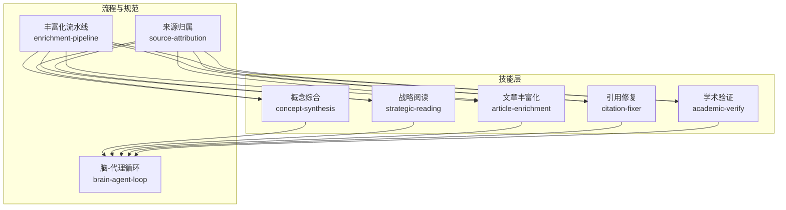
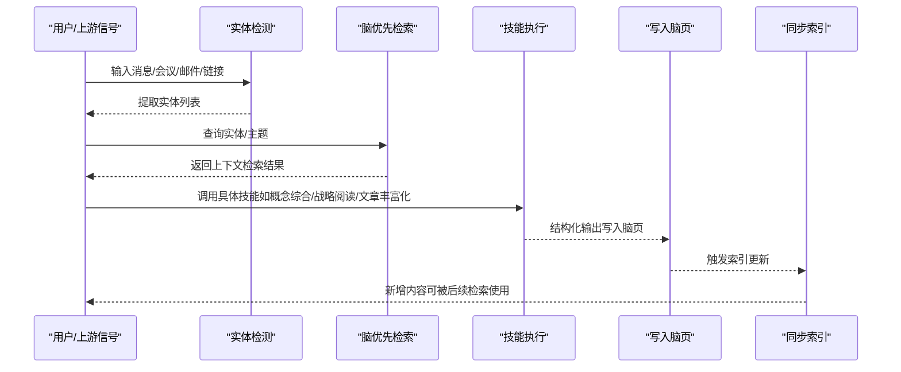
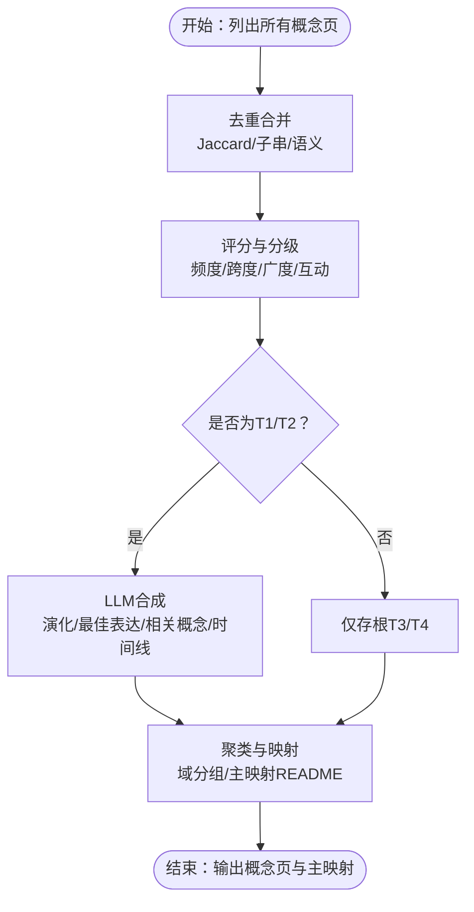
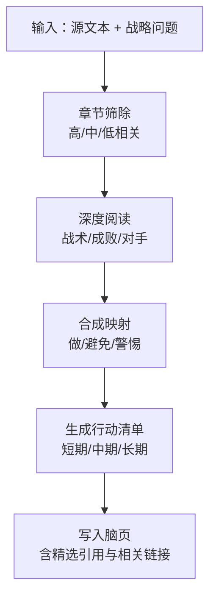
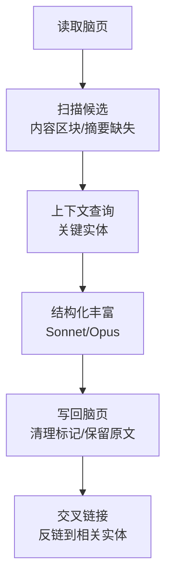
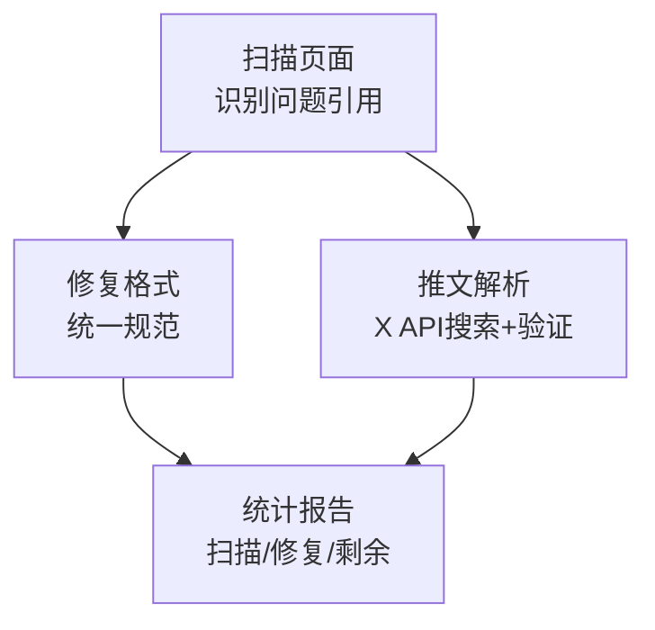
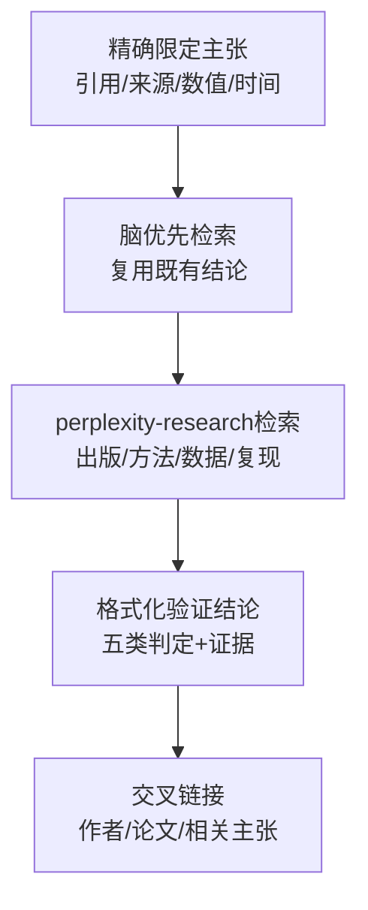
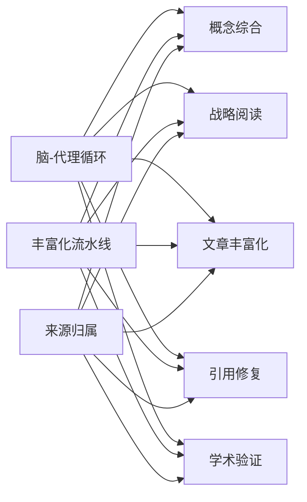

# 知识管理技能

<cite>
**本文档引用的文件**
- [README.md](file://README.md)
- [GBRAIN_SKILLPACK.md](file://docs/GBRAIN_SKILLPACK.md)
- [GBRAIN_VERIFY.md](file://docs/GBRAIN_VERIFY.md)
- [brain-agent-loop.md](file://docs/guides/brain-agent-loop.md)
- [enrichment-pipeline.md](file://docs/guides/enrichment-pipeline.md)
- [source-attribution.md](file://docs/guides/source-attribution.md)
- [concept-synthesis/SKILL.md](file://skills/concept-synthesis/README.md)
- [strategic-reading/SKILL.md](file://skills/strategic-reading/README.md)
- [article-enrichment/SKILL.md](file://skills/article-enrichment/README.md)
- [citation-fixer/SKILL.md](file://skills/citation-fixer/README.md)
- [academic-verify/SKILL.md](file://skills/academic-verify/README.md)
</cite>

## 目录
1. [引言](#引言)
2. [项目结构](#项目结构)
3. [核心组件](#核心组件)
4. [架构总览](#架构总览)
5. [详细组件分析](#详细组件分析)
6. [依赖关系分析](#依赖关系分析)
7. [性能考量](#性能考量)
8. [故障排查指南](#故障排查指南)
9. [结论](#结论)
10. [附录](#附录)

## 引言
本文件系统性阐述知识管理技能在 GBrain 中的落地与实践，围绕“概念综合、战略阅读、文章丰富化、引用修复、学术验证”五大能力，说明其在知识组织与质量保证中的作用，并给出知识合成算法、阅读策略、引用规范与学术验证机制的技术要点与操作流程。同时提供知识质量评估标准、管理流程与实际案例，帮助读者构建可复用、可审计、可持续演进的知识体系。

## 项目结构
- 文档与技能以“技能包（Skillpack）”为组织单元，每个技能以 Markdown 技能脚本形式定义输入、输出、流程、质量门禁与反模式，确保可测试、可审计、可自动化。
- 核心循环：信号检测 → 脑优先检索 → 响应 → 写入脑页 → 同步索引，贯穿所有技能，形成“知识越用越深”的正反馈闭环。
- 知识图谱：每页写入时自动抽取实体引用，建立类型化边（如 attended、works_at、invested_in），不依赖大模型调用，保证零成本自连接。

图表来源
- [brain-agent-loop.md:1-130](file://docs/guides/brain-agent-loop.md#L1-L130)
- [enrichment-pipeline.md:1-104](file://docs/guides/enrichment-pipeline.md#L1-L104)
- [source-attribution.md:1-76](file://docs/guides/source-attribution.md#L1-L76)
- [concept-synthesis/SKILL.md:1-256](file://skills/concept-synthesis/README.md#L1-L256)
- [strategic-reading/SKILL.md:1-189](file://skills/strategic-reading/README.md#L1-L189)
- [article-enrichment/SKILL.md:1-150](file://skills/article-enrichment/README.md#L1-L150)
- [citation-fixer/SKILL.md:1-209](file://skills/citation-fixer/README.md#L1-L209)
- [academic-verify/SKILL.md:1-226](file://skills/academic-verify/README.md#L1-L226)

章节来源
- [README.md:1-443](file://README.md#L1-L443)
- [GBRAIN_SKILLPACK.md:1-144](file://docs/GBRAIN_SKILLPACK.md#L1-L144)

## 核心组件
- 概念综合（concept-synthesis）
  - 目标：从海量原始概念页中去重合并、打分分级、合成摘要、聚类成图谱，形成“永久性智力指纹”。
  - 关键阶段：去重合并（Jaccard/子串/语义）、评分分级（频度、跨度、广度、互动）、合成（仅T1/T2）、聚类（域级分组与主映射）。
- 战略阅读（strategic-reading）
  - 目标：以特定战略问题为镜像，对源文本进行映射式分析，生成短中长期行动建议，强调“应用而非总结”。
  - 关键阶段：源文本摄取（PDF/EPUB/网页）、章节筛除、深度阅读、合成映射、写入脑页。
- 文章丰富化（article-enrichment）
  - 目标：将原始文章页重构为结构化内容，包含执行摘要、关键洞察、可引用语句、为何重要、相关链接与原始内容归档。
  - 关键阶段：扫描候选、上下文查询、结构化重写、写回与交叉链接、保留原始内容。
- 引用修复（citation-fixer）
  - 目标：审计并修复引用格式，识别缺失/错误引用与无确定性链接的推文引用，通过集成 API 还原确定性链接。
  - 关键阶段：扫描页面、识别问题、修复格式、解析推文引用、批量报告与状态记录。
- 学术验证（academic-verify）
  - 目标：对研究主张进行溯源追踪（出版物→方法→原始数据→独立复现），形成可复用的验证结论页。
  - 关键阶段：精确限定主张、脑优先检索、perplexity-research 引擎检索、格式化验证结论、交叉链接作者与相关主张。

章节来源
- [concept-synthesis/SKILL.md:1-256](file://skills/concept-synthesis/README.md#L1-L256)
- [strategic-reading/SKILL.md:1-189](file://skills/strategic-reading/README.md#L1-L189)
- [article-enrichment/SKILL.md:1-150](file://skills/article-enrichment/README.md#L1-L150)
- [citation-fixer/SKILL.md:1-209](file://skills/citation-fixer/README.md#L1-L209)
- [academic-verify/SKILL.md:1-226](file://skills/academic-verify/README.md#L1-L226)

## 架构总览
- 循环驱动：信号到达 → 实体检测 → 脑优先检索 → 响应 → 写入脑页 → 同步索引，持续迭代。
- 流水线协同：丰富化流水线按层级分配外部调用预算，保留原始数据以便再处理；跨引用自动建立，强化知识图谱。
- 规范约束：来源归属要求每条事实均带来源标注；冲突需显式披露，不静默裁决；引用必须具备确定性链接（尤其是社交媒体）。

图表来源
- [brain-agent-loop.md:1-130](file://docs/guides/brain-agent-loop.md#L1-L130)
- [enrichment-pipeline.md:1-104](file://docs/guides/enrichment-pipeline.md#L1-L104)
- [source-attribution.md:1-76](file://docs/guides/source-attribution.md#L1-L76)

## 详细组件分析

### 概念综合（concept-synthesis）
- 算法与流程
  - 去重合并：基于标题与首段的 Jaccard 相似度、子串包含、以及 LLM 判别进行语义去重与时间线/别名合并。
  - 评分分级：统计提及频度、首次/末次提及跨度、出现月份广度、互动指标，划分 T1 Canon、T2 Developing、T3 Speculative、T4 Riff 四级。
  - 合成摘要：仅对 T1/T2 执行 LLM 合成，产出演化叙事、最佳表达、相关概念、时间线与背景。
  - 聚类映射：将概念按领域分组，生成聚类概览与主映射 README，标注概念谱系。
- 输出形态
  - T1 全合成页：含标题、类型、层级、统计信息、别名、相关概念、合成段落、最佳表达、演化时间表、完整时间线。
  - T3/T4 仅存根：最少化合成，避免浪费预算。
  - 主映射 README：按层级展示全脑概念地图与统计。
- 质量门禁
  - 去重质量：无“同一思想不同表述”的重复；别名保留在前端元数据。
  - 分级质量：T1 应具备可识别性与稳定性；T2 表示正在打磨；T4 不应过长跨度。
  - 合成质量：演化叙述、逐字引用、相关链接、不可臆造来源或日期。
- 反模式
  - 对 T3/T4 进行合成；臆造引用或日期；泛化聚类名称；未引入新素材即重复合成。

图表来源
- [concept-synthesis/SKILL.md:1-256](file://skills/concept-synthesis/README.md#L1-L256)

章节来源
- [concept-synthesis/SKILL.md:1-256](file://skills/concept-synthesis/README.md#L1-L256)

### 战略阅读（strategic-reading）
- 阅读策略
  - 输入：源文本（PDF/EPUB/网页/历史案例）+ 明确的战略问题。
  - 处理：先筛除（高相关章节全读、中等部分读、低相关跳过），再深度阅读提炼战术、成败与对手做法，最后生成短中长期行动清单与关键引用。
- 输出结构
  - 执行摘要、核心平行映射、章节筛除、作者框架（做/成功/失败/对手）、反制策略、应用行动清单、精选引用、相关链接。
- 质量标准
  - 每条建议必须引用来源；必须使用直接引用；行动清单需覆盖短期/中期/长期；禁止通用总结与文学分析。
- 反模式
  - 与书摘/研究工具混淆；忽略脑优先检索；缺乏确定性链接。

图表来源
- [strategic-reading/SKILL.md:1-189](file://skills/strategic-reading/README.md#L1-L189)

章节来源
- [strategic-reading/SKILL.md:1-189](file://skills/strategic-reading/README.md#L1-L189)

### 文章丰富化（article-enrichment）
- 管道流程
  - 读取：打开脑页，解析前端元数据与正文。
  - 扫描：定位“内容”区块与缺失“执行摘要”。
  - 上下文：查询关键实体以生成“为何重要”的定向连接。
  - 丰富：以 Sonnet/Opus 重构为结构化段落，保留原文于折叠区。
  - 写回：替换内容区块、清除待丰富标记、添加反链。
- 质量门禁
  - 必须包含：执行摘要、≥3 条直接引用、≥3 条关键洞察、与具体上下文相关的“为何重要”、标准 Markdown 链接、折叠归档的原始内容。
- 模型选择
  - Sonnet：批量丰富，准确性良好但偶有转述。
  - Opus：高价值内容，严格遵循“逐字引用”。

图表来源
- [article-enrichment/SKILL.md:1-150](file://skills/article-enrichment/README.md#L1-L150)

章节来源
- [article-enrichment/SKILL.md:1-150](file://skills/article-enrichment/README.md#L1-L150)

### 引用修复（citation-fixer）
- 审计与修复
  - 扫描：遍历页面，识别缺失/格式错误/无日期/无来源类型的引用。
  - 修复：统一为规范格式；对无确定性链接的推文引用，通过 X API 搜索并还原为确定性 URL。
  - 报告：统计扫描页数、引用数量、修复数量、推文链接修复数与剩余缺口。
- 批处理策略
  - 优先级：近期创建/更新页、高频页、其他页；批处理约 50 页/批，每 10-20 页提交一次以避免部分失败丢失进度。
- 反模式
  - 为无来源的事实编造引用；删除无引用的事实；不检查上下文直接批量修复；猜测推文 ID 组合链接。

图表来源
- [citation-fixer/SKILL.md:1-209](file://skills/citation-fixer/README.md#L1-L209)

章节来源
- [citation-fixer/SKILL.md:1-209](file://skills/citation-fixer/README.md#L1-L209)

### 学术验证（academic-verify）
- 验证机制
  - 精确定义主张：引用、来源、数值、时间范围。
  - 脑优先检索：优先复用已有验证结论，避免重复工作。
  - 引擎检索：通过 perplexity-research 在多个数据库（Retraction Watch、PubPeer、OSF、Semantic Scholar、OpenAlex、Many Labs）中检索原始出版、方法、数据可用性与独立复现情况。
  - 结论格式：验证/部分验证/不可验证/误引/撤稿/争议五类，明确理由与限制。
- 输出形态
  - 脑页包含主张、溯源追踪表、结论、注意事项与相关链接（作者/论文/相关主张）。
- 反模式
  - 跳过脑优先检索；绕过 perplexity-research 自行检索；仅凭单一论文宣称“已验证”；将“不可验证”等同于“错误”。

图表来源
- [academic-verify/SKILL.md:1-226](file://skills/academic-verify/README.md#L1-L226)

章节来源
- [academic-verify/SKILL.md:1-226](file://skills/academic-verify/README.md#L1-L226)

## 依赖关系分析
- 技能间协作
  - 概念综合依赖脑优先检索与时间线/别名聚合；与战略阅读共享“应用映射”思路，但前者面向全脑概念，后者面向单源文本。
  - 文章丰富化依赖实体检测与上下文查询，写回后触发同步索引，供后续检索与引用修复使用。
  - 引用修复与学术验证共同维护“来源归属”规范，前者修复格式与确定性链接，后者验证真实性与可复现性。
  - 丰富化流水线贯穿多技能，按层级分配外部调用预算，保留原始响应以便再处理与审计。
- 数据与流程耦合
  - 脑优先检索是所有技能的前置步骤，确保外部调用作为补充而非起点。
  - 同步索引在每次写入后执行，保证检索与合成的时效性与一致性。

图表来源
- [brain-agent-loop.md:1-130](file://docs/guides/brain-agent-loop.md#L1-L130)
- [enrichment-pipeline.md:1-104](file://docs/guides/enrichment-pipeline.md#L1-L104)
- [source-attribution.md:1-76](file://docs/guides/source-attribution.md#L1-L76)
- [concept-synthesis/SKILL.md:1-256](file://skills/concept-synthesis/README.md#L1-L256)
- [strategic-reading/SKILL.md:1-189](file://skills/strategic-reading/README.md#L1-L189)
- [article-enrichment/SKILL.md:1-150](file://skills/article-enrichment/README.md#L1-L150)
- [citation-fixer/SKILL.md:1-209](file://skills/citation-fixer/README.md#L1-L209)
- [academic-verify/SKILL.md:1-226](file://skills/academic-verify/README.md#L1-L226)

章节来源
- [brain-agent-loop.md:1-130](file://docs/guides/brain-agent-loop.md#L1-L130)
- [enrichment-pipeline.md:1-104](file://docs/guides/enrichment-pipeline.md#L1-L104)
- [source-attribution.md:1-76](file://docs/guides/source-attribution.md#L1-L76)

## 性能考量
- 检索与合成成本控制
  - 检索模式：关键词 + 向量 + RRF + 来源层级加权 + 会话信号，支持保守/平衡/令牌最大化三种模式，按场景切换以平衡成本与召回。
  - 合成与引用修复：批量处理时采用分批提交与速率限制，避免外部服务限流与重复工作。
- 图谱与索引
  - 每页写入自动抽取实体引用，建立类型化边，减少后续 LLM 成本；定期回填历史页面以补齐图谱。
- 外部调用预算
  - 丰富化流水线按层级分配调用次数，Tier 1 最全，Tier 2/3 逐步降级，避免对无关实体过度消耗。

## 故障排查指南
- 安装与健康检查
  - 使用安装验证运行手册逐项检查：模式验证、技能包加载、自动更新配置、实时同步工作状态、嵌入覆盖率、脑优先协议、知识图谱回填、JSONB 前端完整性。
- 同步与索引
  - 若同步覆盖率远低于文件数，检查直连数据库 URL 是否可达（IPv4/IPv6 差异），必要时切换会话池器 URL 并全量重导入。
  - 若嵌入覆盖率低，确认密钥设置并重新补嵌。
- 脑优先与引用
  - 若回答未引用脑页内容，检查系统上下文是否注入了脑优先协议。
  - 若推文引用无法访问，启用引用修复的推文解析流程，通过 X API 获取确定性链接。
- 学术验证
  - 若结论页未包含独立复现证据，检查 perplexity-research 的检索是否命中目标数据库；避免仅凭单一来源断言“已验证”。

章节来源
- [GBRAIN_VERIFY.md:1-296](file://docs/GBRAIN_VERIFY.md#L1-L296)
- [citation-fixer/SKILL.md:1-209](file://skills/citation-fixer/README.md#L1-L209)
- [academic-verify/SKILL.md:1-226](file://skills/academic-verify/README.md#L1-L226)

## 结论
通过“脑-代理循环”与“技能包”体系，GBrain 将知识管理从“信息存储”升级为“可合成、可验证、可演进”的智能知识资产。概念综合与战略阅读分别承担“全脑概念图谱”与“源文本应用映射”的核心职责；文章丰富化与引用修复保障内容质量与可追溯性；学术验证则为研究主张提供可复用的溯源与结论。配合严格的来源归属与冲突披露机制，形成可审计、可扩展、可持续的知识质量保障体系。

## 附录
- 知识质量评估标准
  - 概念综合：去重有效率、分级合理性、合成可读性、聚类可解释性。
  - 战略阅读：映射贴合度、行动清单可行性、引用可追溯性。
  - 文章丰富化：摘要提炼度、引用准确性、洞察独特性、上下文关联度。
  - 引用修复：修复覆盖率、确定性链接比例、批处理一致性。
  - 学术验证：溯源完整性、结论五分类准确率、复现证据可得性。
- 管理流程建议
  - 周期性：概念综合按月/季度执行增量合成；文章丰富化按批次处理；引用修复按周扫盲；学术验证按主题热点与关键主张动态触发。
  - 审计：保留原始响应与变更日志，定期复核冲突与格式问题。
  - 升级：随技能版本演进调整阈值与提示词，保持质量门禁稳定。