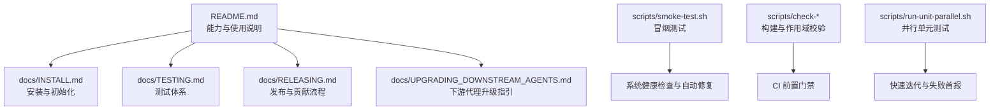
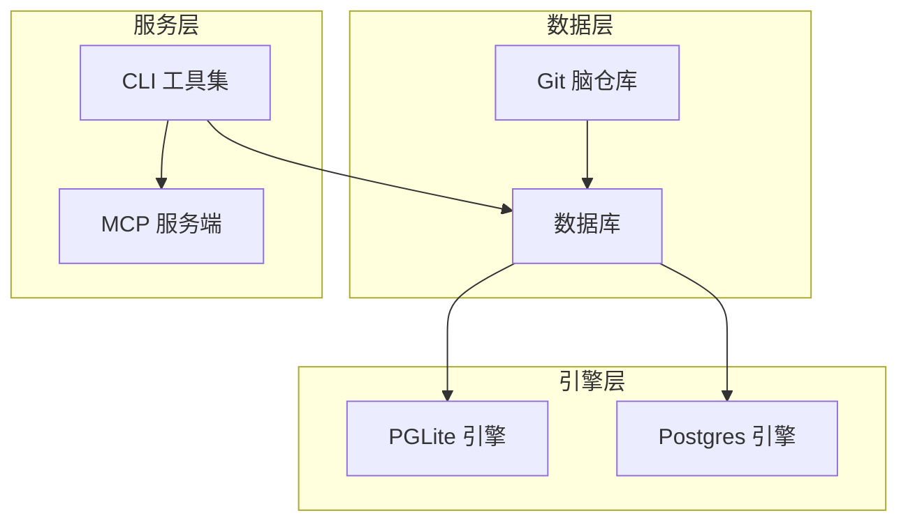
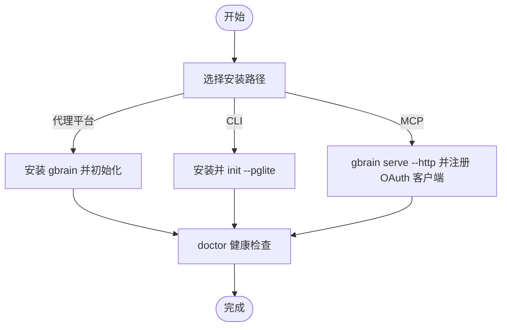
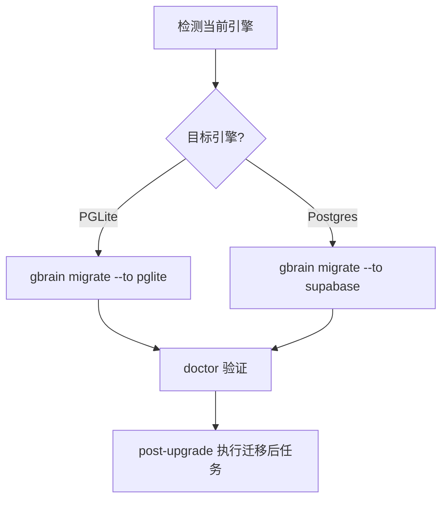
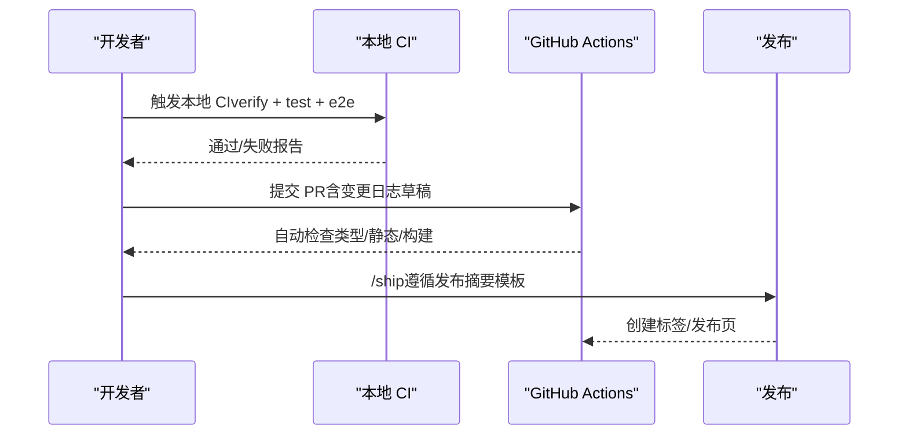
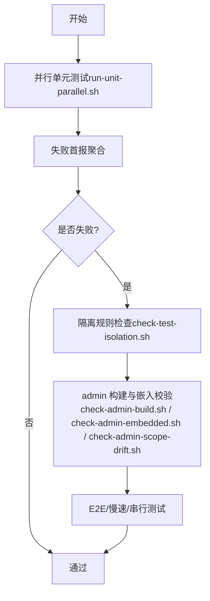
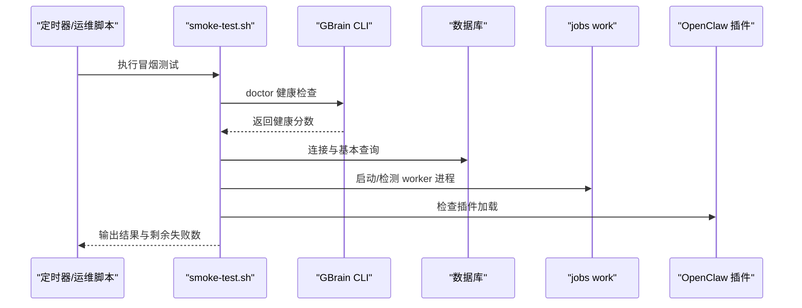
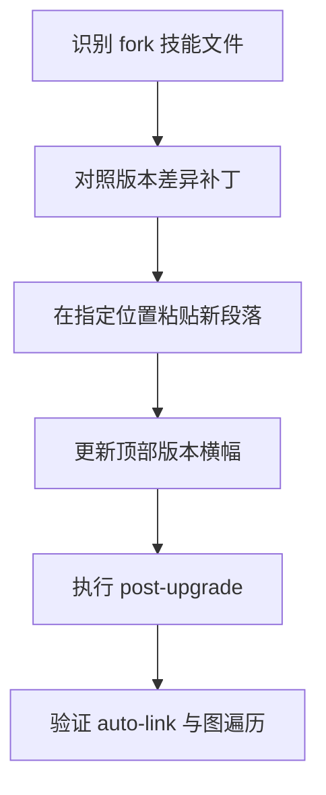
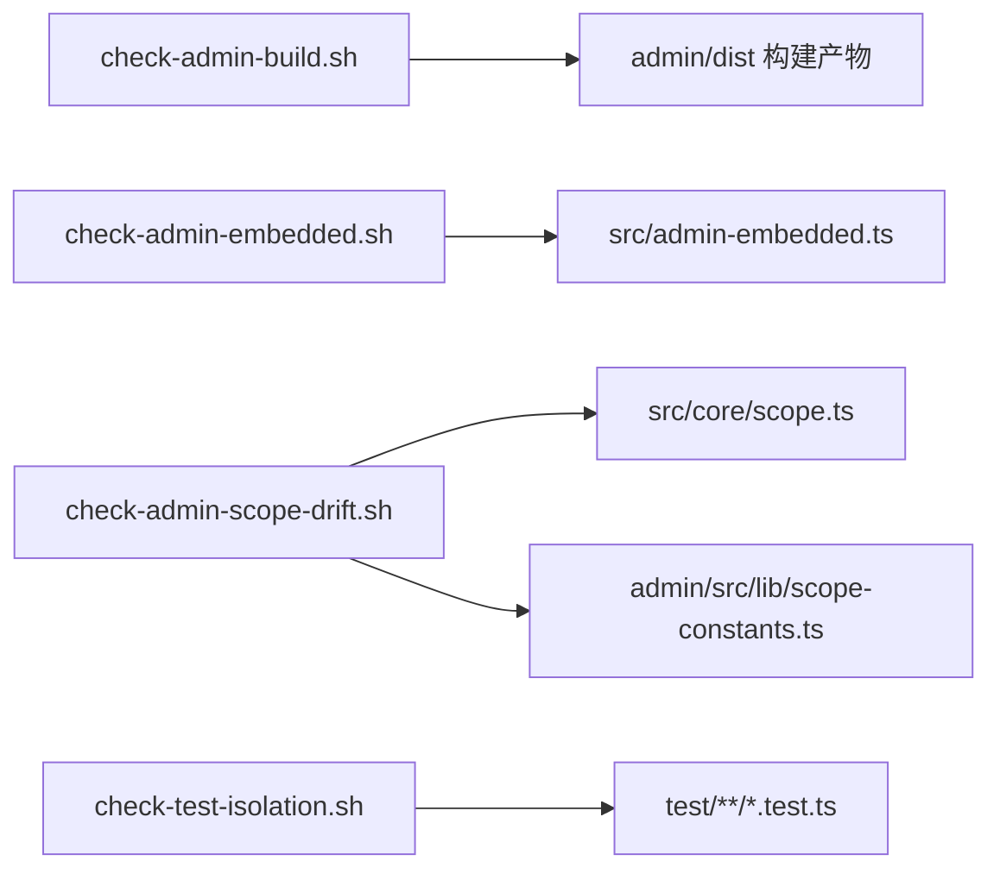

# 系统技能

<cite>
**本文引用的文件**
- [README.md](file://README.md)
- [docs/INSTALL.md](file://docs/INSTALL.md)
- [docs/RELEASING.md](file://docs/RELEASING.md)
- [docs/TESTING.md](file://docs/TESTING.md)
- [docs/UPGRADING_DOWNSTREAM_AGENTS.md](file://docs/UPGRADING_DOWNSTREAM_AGENTS.md)
- [scripts/smoke-test.sh](file://scripts/smoke-test.sh)
- [scripts/check-admin-build.sh](file://scripts/check-admin-build.sh)
- [scripts/check-admin-embedded.sh](file://scripts/check-admin-embedded.sh)
- [scripts/check-admin-scope-drift.sh](file://scripts/check-admin-scope-drift.sh)
- [scripts/check-test-isolation.sh](file://scripts/check-test-isolation.sh)
- [scripts/run-unit-parallel.sh](file://scripts/run-unit-parallel.sh)
</cite>

## 目录
1. [简介](#简介)
2. [项目结构](#项目结构)
3. [核心组件](#核心组件)
4. [架构总览](#架构总览)
5. [详细组件分析](#详细组件分析)
6. [依赖关系分析](#依赖关系分析)
7. [性能考量](#性能考量)
8. [故障排查指南](#故障排查指南)
9. [结论](#结论)
10. [附录](#附录)

## 简介
本文件面向系统管理员与平台工程师，系统化梳理 GBrain 的安装配置、系统迁移、发布部署、测试验证、冒烟测试等系统管理技能；解释系统初始化流程、版本升级策略、部署架构与质量保证体系；并提供监控、故障诊断与性能优化方法及实际运维案例。

## 项目结构
- 文档与指南：位于 docs/，覆盖安装、测试、发布、升级、集成、架构等主题。
- 运维脚本：位于 scripts/，涵盖冒烟测试、构建校验、作用域一致性检查、测试隔离检查与并行单元测试运行器。
- 核心能力：README.md 概述了检索、合成、知识图谱、作业队列、技能包、评估框架、架构与拓扑等能力边界。

**图表来源**
- [README.md](file://README.md)
- [docs/INSTALL.md](file://docs/INSTALL.md)
- [docs/TESTING.md](file://docs/TESTING.md)
- [docs/RELEASING.md](file://docs/RELEASING.md)
- [docs/UPGRADING_DOWNSTREAM_AGENTS.md](file://docs/UPGRADING_DOWNSTREAM_AGENTS.md)
- [scripts/smoke-test.sh](file://scripts/smoke-test.sh)
- [scripts/check-admin-build.sh](file://scripts/check-admin-build.sh)
- [scripts/check-admin-embedded.sh](file://scripts/check-admin-embedded.sh)
- [scripts/check-admin-scope-drift.sh](file://scripts/check-admin-scope-drift.sh)
- [scripts/check-test-isolation.sh](file://scripts/check-test-isolation.sh)
- [scripts/run-unit-parallel.sh](file://scripts/run-unit-parallel.sh)

**章节来源**
- [README.md](file://README.md)
- [docs/INSTALL.md](file://docs/INSTALL.md)
- [docs/TESTING.md](file://docs/TESTING.md)
- [docs/RELEASING.md](file://docs/RELEASING.md)
- [docs/UPGRADING_DOWNSTREAM_AGENTS.md](file://docs/UPGRADING_DOWNSTREAM_AGENTS.md)
- [scripts/smoke-test.sh](file://scripts/smoke-test.sh)
- [scripts/check-admin-build.sh](file://scripts/check-admin-build.sh)
- [scripts/check-admin-embedded.sh](file://scripts/check-admin-embedded.sh)
- [scripts/check-admin-scope-drift.sh](file://scripts/check-admin-scope-drift.sh)
- [scripts/check-test-isolation.sh](file://scripts/check-test-isolation.sh)
- [scripts/run-unit-parallel.sh](file://scripts/run-unit-parallel.sh)

## 核心组件
- 安装与初始化
  - 支持三种路径：由代理平台安装（推荐）、CLI 单机、MCP 服务端。安装后通过 doctor 验证健康状态，支持迁移至 Supabase 或回退到 PGLite。
- 版本升级与迁移
  - 提供自动化迁移流程与“升级后自修复”步骤；针对下游代理提供逐版本差异补丁清单与执行建议。
- 测试与质量保证
  - 分层测试命令、并行单元测试运行器、失败首报日志、隔离规则与 CI 门禁脚本，确保回归稳定。
- 冒烟测试
  - 自动检测 Bun、GBrain CLI、数据库、作业工作进程、OpenClaw 插件、嵌入模型密钥、脑仓库等关键要素，并具备自动修复与用户扩展点。
- 发布与贡献
  - 明确预发布要求、变更日志规范、PR 波次流程、GitHub Actions 锚定策略与发布摘要模板。

**章节来源**
- [docs/INSTALL.md](file://docs/INSTALL.md)
- [docs/UPGRADING_DOWNSTREAM_AGENTS.md](file://docs/UPGRADING_DOWNSTREAM_AGENTS.md)
- [docs/TESTING.md](file://docs/TESTING.md)
- [scripts/smoke-test.sh](file://scripts/smoke-test.sh)
- [docs/RELEASING.md](file://docs/RELEASING.md)

## 架构总览
- 引擎抽象：统一 BrainEngine 接口，同时支持 PGLite（默认本地）与 Postgres+pgvector（共享/大型/多机）两种引擎。
- 脑仓库为系统记录：以 Git 仓库为知识源，同步至数据库进行检索；删除在 Git 中映射为数据库软删。
- 两轴组织：脑（数据库实例）与源（仓库内子源），路由遵循六级优先级链路。
- 图的重要性：向量检索返回语义相近块，知识图谱返回事实关联，混合检索提升效果。

**图表来源**
- [README.md](file://README.md)

**章节来源**
- [README.md](file://README.md)

## 详细组件分析

### 组件一：安装与初始化（Install）
- 路径选择
  - 代理平台安装：适合非技术用户，一键完成初始化、技能装配、健康检查。
  - CLI 单机：适合开发者或独立使用场景，快速初始化本地 PGLite 脑。
  - MCP 服务端：面向远程客户端接入，支持 OAuth 2.1 注册、范围授权与速率限制。
- 初始化要点
  - 自动检测仓库规模并建议使用 Supabase。
  - 支持 headless/CI 场景的无交互初始化与后续迁移。
  - doctor 健康检查覆盖数据库、模型可用性、模式一致性等。
- 后续常用操作
  - 导入知识、实时同步、守护进程（夜间增强）。

**图表来源**
- [docs/INSTALL.md](file://docs/INSTALL.md)

**章节来源**
- [docs/INSTALL.md](file://docs/INSTALL.md)

### 组件二：系统迁移（System Migration）
- 引擎迁移
  - PGLite ↔ Postgres：通过 migrate 子命令切换，支持双向迁移。
- 数据迁移
  - schema 迁移由升级流程自动执行；必要时可手动触发 apply-migrations。
- 下游代理迁移
  - 针对 fork 的技能文件，按版本提供差异补丁与执行步骤，确保自动链接、图更新、富前后处理等功能正确启用。

**图表来源**
- [docs/INSTALL.md](file://docs/INSTALL.md)
- [docs/UPGRADING_DOWNSTREAM_AGENTS.md](file://docs/UPGRADING_DOWNSTREAM_AGENTS.md)

**章节来源**
- [docs/INSTALL.md](file://docs/INSTALL.md)
- [docs/UPGRADING_DOWNSTREAM_AGENTS.md](file://docs/UPGRADING_DOWNSTREAM_AGENTS.md)

### 组件三：发布与部署（Release & Deploy）
- 预发布要求
  - 必须通过本地 CI 网关（含类型检查、静态检查、并行单元测试、E2E）。
  - 变更日志必须面向用户语言撰写，禁止泄露内部细节。
- 发布摘要模板
  - 包含“一句话标题”“问题背景”“如何使用”“示例表格”“注意事项”“审查发现”等结构化字段。
- PR 波次流程
  - 社区 PR 采用“收集波次”方式批量合并，保留贡献者署名；严格控制安全边界与协议变更。
- CI 与锚定
  - GitHub Actions 使用提交锚定，发布前需检查并更新过期锚点。

**图表来源**
- [docs/RELEASING.md](file://docs/RELEASING.md)

**章节来源**
- [docs/RELEASING.md](file://docs/RELEASING.md)

### 组件四：测试与验证（Testing & Verification）
- 测试分层
  - 单元测试（并行 8 分片）、串行测试、慢速测试、E2E 测试、重型测试、模糊测试。
- 失败首报
  - 并行运行器聚合失败块到统一日志，失败时打印绝对路径与最后若干行，便于定位。
- 隔离规则
  - 禁止在模块级修改 process.env、禁止顶层 mock.module、PGLite 引擎必须在 beforeAll 上下文创建并在 afterAll 断开连接。
- CI 门禁
  - admin 构建检查、admin 嵌入资源一致性检查、作用域常量漂移检查等，防止前端与后端不一致导致的运行时错误。

**图表来源**
- [scripts/run-unit-parallel.sh](file://scripts/run-unit-parallel.sh)
- [scripts/check-test-isolation.sh](file://scripts/check-test-isolation.sh)
- [scripts/check-admin-build.sh](file://scripts/check-admin-build.sh)
- [scripts/check-admin-embedded.sh](file://scripts/check-admin-embedded.sh)
- [scripts/check-admin-scope-drift.sh](file://scripts/check-admin-scope-drift.sh)
- [docs/TESTING.md](file://docs/TESTING.md)

**章节来源**
- [docs/TESTING.md](file://docs/TESTING.md)
- [scripts/run-unit-parallel.sh](file://scripts/run-unit-parallel.sh)
- [scripts/check-test-isolation.sh](file://scripts/check-test-isolation.sh)
- [scripts/check-admin-build.sh](file://scripts/check-admin-build.sh)
- [scripts/check-admin-embedded.sh](file://scripts/check-admin-embedded.sh)
- [scripts/check-admin-scope-drift.sh](file://scripts/check-admin-scope-drift.sh)

### 组件五：冒烟测试（Smoke Test）
- 覆盖项
  - Bun 运行时、GBrain CLI、数据库健康（doctor）、作业工作进程、OpenClaw 插件、嵌入 API 密钥、脑仓库存在性。
- 行为
  - 对可修复项尝试自动修复（如重装依赖、启动 worker、重装插件），最终输出通过/修复/跳过/剩余失败统计。
- 用户扩展
  - 支持 ~/.gbrain/smoke-tests.d/*.sh 用户自定义测试脚本。

**图表来源**
- [scripts/smoke-test.sh](file://scripts/smoke-test.sh)

**章节来源**
- [scripts/smoke-test.sh](file://scripts/smoke-test.sh)

### 组件六：下游代理升级（Downstream Agents）
- 背景
  - gbrain 升级仅推送二进制与迁移；技能文件由用户维护，需手工应用差异。
- 方法
  - 逐版本提供补丁段落与执行位置，完成后执行 post-upgrade 自动化迁移后任务。
- 注意
  - 若未应用差异，可能导致重复链接调用、图更新滞后、时间线回填缺失等问题。

**图表来源**
- [docs/UPGRADING_DOWNSTREAM_AGENTS.md](file://docs/UPGRADING_DOWNSTREAM_AGENTS.md)

**章节来源**
- [docs/UPGRADING_DOWNSTREAM_AGENTS.md](file://docs/UPGRADING_DOWNSTREAM_AGENTS.md)

## 依赖关系分析
- 前端与后端一致性
  - admin 嵌入资源与打包产物需保持一致，否则会破坏 /admin 页面。
  - admin 作用域常量列表需与后端允许的作用域列表一致，避免权限面不一致。
- 测试隔离
  - 并行测试进程间禁止模块级副作用泄漏；PGLite 引擎生命周期必须受控。
- 发布与 CI
  - 变更日志与发布摘要模板约束对外沟通口径；Actions 锚定避免上游漂移。

**图表来源**
- [scripts/check-admin-build.sh](file://scripts/check-admin-build.sh)
- [scripts/check-admin-embedded.sh](file://scripts/check-admin-embedded.sh)
- [scripts/check-admin-scope-drift.sh](file://scripts/check-admin-scope-drift.sh)
- [scripts/check-test-isolation.sh](file://scripts/check-test-isolation.sh)

**章节来源**
- [scripts/check-admin-build.sh](file://scripts/check-admin-build.sh)
- [scripts/check-admin-embedded.sh](file://scripts/check-admin-embedded.sh)
- [scripts/check-admin-scope-drift.sh](file://scripts/check-admin-scope-drift.sh)
- [scripts/check-test-isolation.sh](file://scripts/check-test-isolation.sh)

## 性能考量
- 并行测试与超时
  - 并行单元测试运行器对每个分片设置超时上限，避免长时间卡住；心跳输出帮助观察进度。
- 引擎选择
  - 小型个人脑优先 PGLite；团队/公司脑建议 Postgres + pgvector，并结合 Supabase 等托管方案。
- 查询与索引
  - 混合检索（向量+关键词+RRF+来源层级+重排器）与图谱增强显著提升召回与相关性。
- 作业队列
  - Minions 作业队列支持持久化、重试、并发与超时控制，保障后台任务可靠性。

[本节为通用指导，无需特定文件引用]

## 故障排查指南
- 常见问题定位
  - doctor 健康检查：查看健康分数与具体检查项；按提示执行修复命令。
  - 嵌入维度不匹配：通过 doctor 输出的修复命令调整配置或执行迁移。
  - 同步超时：采用 per-source 循环 + 超时强制终止的模式，配合断点续跑。
  - 连接抖动：批量写入增加重试策略，worker 断连后自动重建连接。
- 日志与审计
  - 并行测试失败首报日志集中于 .context/test-failures.log，便于快速定位。
  - audit 目录下包含批量重试、数据库断连等审计文件，辅助根因分析。
- 修复与回滚
  - 升级后若出现部分迁移，可通过“自修复”块中的命令手动执行；必要时回滚到上一版本并重新升级。

**章节来源**
- [README.md](file://README.md)
- [docs/TESTING.md](file://docs/TESTING.md)

## 结论
本文件从系统管理视角，串联了安装初始化、系统迁移、发布部署、测试验证与冒烟测试的关键流程与工具，明确了引擎选择、质量门禁与升级策略。通过标准化的运维脚本与严格的测试隔离规则，确保系统在演进过程中保持稳定性与可观测性。

## 附录
- 快速参考
  - 安装：参见 docs/INSTALL.md
  - 测试：参见 docs/TESTING.md 与 scripts/run-unit-parallel.sh
  - 发布：参见 docs/RELEASING.md
  - 升级：参见 docs/UPGRADING_DOWNSTREAM_AGENTS.md
  - 冒烟：参见 scripts/smoke-test.sh
  - 前端校验：参见 scripts/check-admin-build.sh、scripts/check-admin-embedded.sh、scripts/check-admin-scope-drift.sh
  - 隔离检查：参见 scripts/check-test-isolation.sh