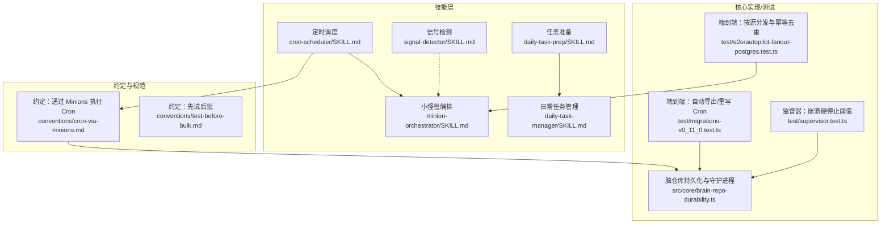
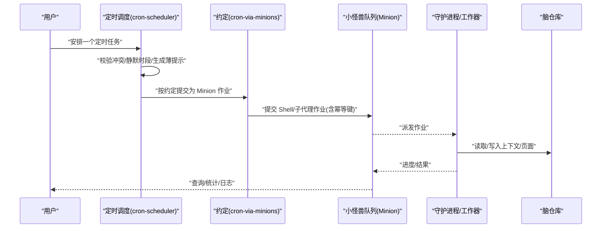
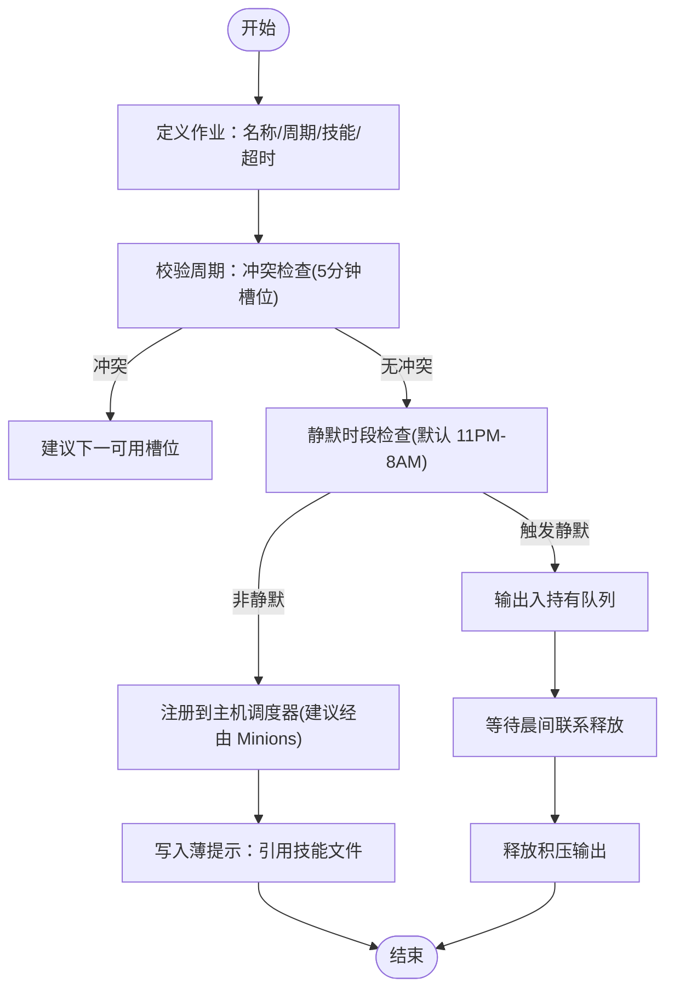
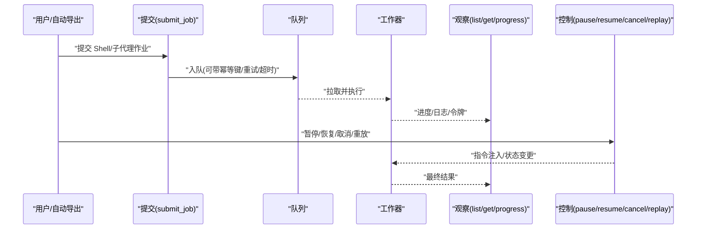
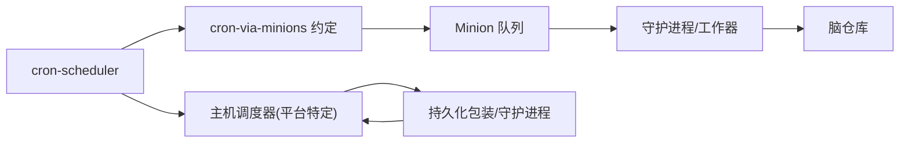

# 自动化技能

<cite>
**本文引用的文件**
- [skills/cron-scheduler/SKILL.md](file://skills/cron-scheduler/SKILL.md)
- [skills/minion-orchestrator/SKILL.md](file://skills/minion-orchestrator/SKILL.md)
- [skills/daily-task-manager/SKILL.md](file://skills/daily-task-manager/SKILL.md)
- [skills/daily-task-prep/SKILL.md](file://skills/daily-task-prep/SKILL.md)
- [skills/signal-detector/SKILL.md](file://skills/signal-detector/SKILL.md)
- [skills/conventions/cron-via-minions.md](file://skills/conventions/cron-via-minions.md)
- [skills/conventions/test-before-bulk.md](file://skills/conventions/test-before-bulk.md)
- [src/core/brain-repo-durability.ts](file://src/core/brain-repo-durability.ts)
- [test/e2e/autopilot-fanout-postgres.test.ts](file://test/e2e/autopilot-fanout-postgres.test.ts)
- [test/migrations-v0_11_0.test.ts](file://test/migrations-v0_11_0.test.ts)
- [test/supervisor.test.ts](file://test/supervisor.test.ts)
</cite>

## 目录
1. [引言](#引言)
2. [项目结构](#项目结构)
3. [核心组件](#核心组件)
4. [架构总览](#架构总览)
5. [详细组件分析](#详细组件分析)
6. [依赖关系分析](#依赖关系分析)
7. [性能考量](#性能考量)
8. [故障排查指南](#故障排查指南)
9. [结论](#结论)
10. [附录](#附录)

## 引言
本文件系统性梳理与自动化技能相关的能力：定时调度、小怪兽（Minions）编排、日常任务管理、任务准备、信号检测。围绕这些能力，文档解释任务调度算法、并发控制、状态管理与异常处理机制，并给出自动化流程设计与监控策略，辅以任务编排与故障恢复的实际示例路径，帮助读者在不直接阅读源码的情况下也能高效落地。

## 项目结构
自动化技能主要由“技能文档”与“核心实现/测试”两部分组成：
- 技能文档位于 skills/* 下，定义了每个技能的契约、阶段、输出格式与反模式，如 cron 调度、Minions 编排、日常任务管理、每日准备、信号检测等。
- 核心实现与测试位于 src/* 与 test/*，覆盖持久化、守护进程、队列与并发控制、迁移与兼容性、端到端行为验证等。

图表来源
- [skills/cron-scheduler/SKILL.md:1-94](file://skills/cron-scheduler/SKILL.md#L1-L94)
- [skills/minion-orchestrator/SKILL.md:1-303](file://skills/minion-orchestrator/SKILL.md#L1-L303)
- [skills/daily-task-manager/SKILL.md:1-71](file://skills/daily-task-manager/SKILL.md#L1-L71)
- [skills/daily-task-prep/SKILL.md:1-62](file://skills/daily-task-prep/SKILL.md#L1-L62)
- [skills/signal-detector/SKILL.md:1-113](file://skills/signal-detector/SKILL.md#L1-L113)
- [skills/conventions/cron-via-minions.md:1-94](file://skills/conventions/cron-via-minions.md#L1-L94)
- [skills/conventions/test-before-bulk.md:1-36](file://skills/conventions/test-before-bulk.md#L1-L36)
- [src/core/brain-repo-durability.ts:507-540](file://src/core/brain-repo-durability.ts#L507-L540)
- [test/migrations-v0_11_0.test.ts:222-256](file://test/migrations-v0_11_0.test.ts#L222-L256)
- [test/supervisor.test.ts:106-141](file://test/supervisor.test.ts#L106-L141)
- [test/e2e/autopilot-fanout-postgres.test.ts:96-132](file://test/e2e/autopilot-fanout-postgres.test.ts#L96-L132)

章节来源
- [skills/cron-scheduler/SKILL.md:1-94](file://skills/cron-scheduler/SKILL.md#L1-L94)
- [skills/minion-orchestrator/SKILL.md:1-303](file://skills/minion-orchestrator/SKILL.md#L1-L303)
- [skills/daily-task-manager/SKILL.md:1-71](file://skills/daily-task-manager/SKILL.md#L1-L71)
- [skills/daily-task-prep/SKILL.md:1-62](file://skills/daily-task-prep/SKILL.md#L1-L62)
- [skills/signal-detector/SKILL.md:1-113](file://skills/signal-detector/SKILL.md#L1-L113)
- [skills/conventions/cron-via-minions.md:1-94](file://skills/conventions/cron-via-minions.md#L1-L94)
- [skills/conventions/test-before-bulk.md:1-36](file://skills/conventions/test-before-bulk.md#L1-L36)
- [src/core/brain-repo-durability.ts:507-540](file://src/core/brain-repo-durability.ts#L507-L540)
- [test/migrations-v0_11_0.test.ts:222-256](file://test/migrations-v0_11_0.test.ts#L222-L256)
- [test/supervisor.test.ts:106-141](file://test/supervisor.test.ts#L106-L141)
- [test/e2e/autopilot-fanout-postgres.test.ts:96-132](file://test/e2e/autopilot-fanout-postgres.test.ts#L96-L132)

## 核心组件
- 定时调度（cron-scheduler）
  - 契约：保证错峰（每 5 分钟槽位最多一任务）、静默时段门控（本地时间 11PM-8AM，默认用户清醒可豁免）、薄提示（仅引用技能文件）、幂等、结果落盘为报告。
  - 关键点：多源合并调度建议；主机侧注册与执行（Postgres 模式 fire-and-forget + 幂等键；PGLite 模式 --follow 内联执行）。
- 小怪兽编排（minion-orchestrator）
  - 契约：Postgres 队列、可观测、可重启、可并行、可消息引导、父子 DAG 与失败策略。
  - 关键点：Shell 作业与子代理作业两类；CLI 提交与 MCP 观察/控制；安全门槛（需显式允许）。
- 日常任务管理（daily-task-manager）
  - 契约：任务存储为脑页、生命周期（新增→进行中→完成/推迟）、优先级（P0-P3）、归档与延续。
- 任务准备（daily-task-prep）
  - 契约：日程前瞻、会议上下文加载、昨日未决线程、任务优先级回顾，形成可操作的早间简报。
- 信号检测（signal-detector）
  - 契约：常驻捕获原始思考与实体提及，异步运行、不阻塞主线响应，自动回链与标注。

章节来源
- [skills/cron-scheduler/SKILL.md:19-94](file://skills/cron-scheduler/SKILL.md#L19-L94)
- [skills/minion-orchestrator/SKILL.md:45-303](file://skills/minion-orchestrator/SKILL.md#L45-L303)
- [skills/daily-task-manager/SKILL.md:21-71](file://skills/daily-task-manager/SKILL.md#L21-L71)
- [skills/daily-task-prep/SKILL.md:21-62](file://skills/daily-task-prep/SKILL.md#L21-L62)
- [skills/signal-detector/SKILL.md:25-113](file://skills/signal-detector/SKILL.md#L25-L113)

## 架构总览
下图展示从“计划—提交—执行—观测—回收”的闭环，以及与主机调度/守护进程的交互。

图表来源
- [skills/cron-scheduler/SKILL.md:32-50](file://skills/cron-scheduler/SKILL.md#L32-L50)
- [skills/conventions/cron-via-minions.md:5-30](file://skills/conventions/cron-via-minions.md#L5-L30)
- [skills/minion-orchestrator/SKILL.md:171-242](file://skills/minion-orchestrator/SKILL.md#L171-L242)

## 详细组件分析

### 定时调度（cron-scheduler）
- 调度算法与冲突避免
  - 5 分钟槽位规则：:05/:10/.../:50，冲突时建议下一个可用槽位。
  - 多源合并：当存在多个活跃源时，推荐使用“全源同步”一行 Cron，替代 N 个按源条目，提升并行度与可维护性。
- 静默时段与豁免
  - 默认本地时间 11PM-8AM；若用户处于清醒状态则豁免。
  - 静默时段内输出进入“持有队列”，晨间联系时释放积压。
- 执行与幂等
  - 主机侧注册与执行：Postgres 模式 fire-and-forget + 幂等键；PGLite 模式 --follow 内联执行。
  - 幂等要求：重复运行不产生副作用，使用检查点状态文件与已存在输出检查。
- 输出与报告
  - 保存为 reports/{job-name}/{年-月-日-小时分钟}.md，返回“已安排+下次运行时间”。

图表来源
- [skills/cron-scheduler/SKILL.md:32-50](file://skills/cron-scheduler/SKILL.md#L32-L50)
- [skills/conventions/cron-via-minions.md:5-30](file://skills/conventions/cron-via-minions.md#L5-L30)

章节来源
- [skills/cron-scheduler/SKILL.md:19-94](file://skills/cron-scheduler/SKILL.md#L19-L94)
- [skills/conventions/cron-via-minions.md:1-94](file://skills/conventions/cron-via-minions.md#L1-L94)

### 小怪兽编排（minion-orchestrator）
- 两类作业
  - Shell 作业：确定性命令/脚本执行，支持 CLI 提交、参数化（cmd/argv/cwd/env），支持队列/优先级/延迟/重试/超时/幂等键等。
  - 子代理作业：开放推理/工具使用/并行合成，支持并行清单、聚合器、消息引导、暂停/恢复/取消/重放。
- 生命周期与可观测性
  - 提交→监控（列表/详情/进度）→引导→生命周期控制→结果复盘。
  - 进度包含步骤、总步数、消息、令牌用量、最后调用工具；令牌用量会自动向上滚动汇总。
- 安全与路由
  - Shell 作业提交受保护（CLI 专用），子代理作业通过 gbrain agent run 入口；路由策略见“先痛后移”或全量 Minions 模式。

图表来源
- [skills/minion-orchestrator/SKILL.md:171-242](file://skills/minion-orchestrator/SKILL.md#L171-L242)
- [skills/minion-orchestrator/SKILL.md:244-282](file://skills/minion-orchestrator/SKILL.md#L244-L282)

章节来源
- [skills/minion-orchestrator/SKILL.md:45-303](file://skills/minion-orchestrator/SKILL.md#L45-L303)

### 日常任务管理（daily-task-manager）
- 生命周期与优先级
  - 新增→进行中→完成/推迟；完成归档记录日期；推迟保留原因并延续。
  - 优先级：P0（紧急）、P1（今日）、P2（本周）、P3（积压）。
- 存储与检索
  - 任务列表作为脑页 ops/tasks.md 维护，支持检索与更新。

章节来源
- [skills/daily-task-manager/SKILL.md:21-71](file://skills/daily-task-manager/SKILL.md#L21-L71)

### 任务准备（daily-task-prep）
- 输入：当日日程、昨日未决线程、当前任务列表。
- 输出：可操作早间简报，包含会议上下文卡片、未决线程、任务优先级。

章节来源
- [skills/daily-task-prep/SKILL.md:21-62](file://skills/daily-task-prep/SKILL.md#L21-L62)

### 信号检测（signal-detector）
- 常驻捕获两类信息：原始思考（用户原创观点/框架）与实体提及（人/公司/媒体）。
- 行为：异步子代理、不阻塞主线；自动回链与标注；对新事实写入时间线。
- 反模式：阻塞主线、改写用户原话、对非显著实体建页、跳过回链、对纯操作性消息也处理。

章节来源
- [skills/signal-detector/SKILL.md:25-113](file://skills/signal-detector/SKILL.md#L25-L113)

## 依赖关系分析
- 约定驱动的执行路径
  - cron-scheduler 通过 cron-via-minions 约定，确保 Cron 触发时不是直接调用 agentTurn，而是提交 Minion 作业，从而获得可观测、可恢复、可引导与并发安全。
- 守护进程与持久化
  - brain-repo-durability.ts 展示了如何在不同平台（macOS launchd、Linux crontab）安装/卸载持久化 Cron 条目，体现“主机调度器”与“守护进程”的协作。
- 端到端验证
  - migrations-v0_11_0.test.ts 验证 Cron 清单重写与跳过错误清单的行为。
  - autopilot-fanout-postgres.test.ts 验证按源分发与同一周期槽幂等去重。
  - supervisor.test.ts 验证监督器在崩溃硬停止阈值上的解析逻辑。

图表来源
- [skills/conventions/cron-via-minions.md:46-75](file://skills/conventions/cron-via-minions.md#L46-L75)
- [src/core/brain-repo-durability.ts:507-540](file://src/core/brain-repo-durability.ts#L507-L540)
- [test/migrations-v0_11_0.test.ts:222-256](file://test/migrations-v0_11_0.test.ts#L222-L256)
- [test/e2e/autopilot-fanout-postgres.test.ts:96-132](file://test/e2e/autopilot-fanout-postgres.test.ts#L96-L132)

章节来源
- [skills/conventions/cron-via-minions.md:1-94](file://skills/conventions/cron-via-minions.md#L1-L94)
- [src/core/brain-repo-durability.ts:507-540](file://src/core/brain-repo-durability.ts#L507-L540)
- [test/migrations-v0_11_0.test.ts:222-256](file://test/migrations-v0_11_0.test.ts#L222-L256)
- [test/e2e/autopilot-fanout-postgres.test.ts:96-132](file://test/e2e/autopilot-fanout-postgres.test.ts#L96-L132)
- [test/supervisor.test.ts:106-141](file://test/supervisor.test.ts#L106-L141)

## 性能考量
- 并发与节流
  - 多源合并 Cron（全源同步）可提升并行度，但需注意数据库连接上限，合理设置并发预算。
- 幂等与去重
  - 同一周期槽位通过幂等键去重，避免长作业重叠堆积。
- 观测与日志
  - 使用队列统计与作业进度接口进行轻量轮询，避免紧耦合轮询导致的资源争用。

章节来源
- [skills/cron-scheduler/SKILL.md:56-94](file://skills/cron-scheduler/SKILL.md#L56-L94)
- [test/e2e/autopilot-fanout-postgres.test.ts:96-132](file://test/e2e/autopilot-fanout-postgres.test.ts#L96-L132)

## 故障排查指南
- Cron 安装/卸载失败
  - 在 macOS 上通过 launchd plist 管理；在 Linux 上通过 crontab 管理；失败时检查权限与平台差异。
- Cron 清单重写失败
  - 对于格式错误或缺少识别条目的清单，测试用例显示会跳过并记录原因。
- 幂等去重未生效
  - 检查是否在同一周期槽位设置了相同的幂等键；确认队列层去重逻辑。
- 监督器崩溃硬停止阈值
  - 通过环境变量覆盖默认阈值；若为负或非法值将回退到默认。

章节来源
- [src/core/brain-repo-durability.ts:507-540](file://src/core/brain-repo-durability.ts#L507-L540)
- [test/migrations-v0_11_0.test.ts:222-256](file://test/migrations-v0_11_0.test.ts#L222-L256)
- [test/e2e/autopilot-fanout-postgres.test.ts:96-132](file://test/e2e/autopilot-fanout-postgres.test.ts#L96-L132)
- [test/supervisor.test.ts:106-141](file://test/supervisor.test.ts#L106-L141)

## 结论
通过“约定驱动的 Cron 执行、小怪兽队列的可观测与可恢复、任务生命周期与准备流程、以及信号检测的常驻捕获”，系统实现了高可靠、可扩展、可引导的自动化技能体系。建议在部署前遵循“先试后批”原则，结合幂等与静默时段策略，配合队列统计与日志进行持续监控，并在出现异常时依据上述故障排查路径快速定位与修复。

## 附录
- 实际示例路径（用于参考与复现）
  - Cron 清单重写与跳过错误清单：[test/migrations-v0_11_0.test.ts:222-256](file://test/migrations-v0_11_0.test.ts#L222-L256)
  - 按源分发与幂等去重（同一周期槽位）：[test/e2e/autopilot-fanout-postgres.test.ts:96-132](file://test/e2e/autopilot-fanout-postgres.test.ts#L96-L132)
  - 监督器崩溃硬停止阈值解析：[test/supervisor.test.ts:106-141](file://test/supervisor.test.ts#L106-L141)
  - 守护进程持久化 Cron 安装/卸载：[src/core/brain-repo-durability.ts:507-540](file://src/core/brain-repo-durability.ts#L507-L540)
  - Cron 执行约定（Postgres/PGLite）：[skills/conventions/cron-via-minions.md:1-94](file://skills/conventions/cron-via-minions.md#L1-L94)
  - 先试后批约定：[skills/conventions/test-before-bulk.md:1-36](file://skills/conventions/test-before-bulk.md#L1-L36)