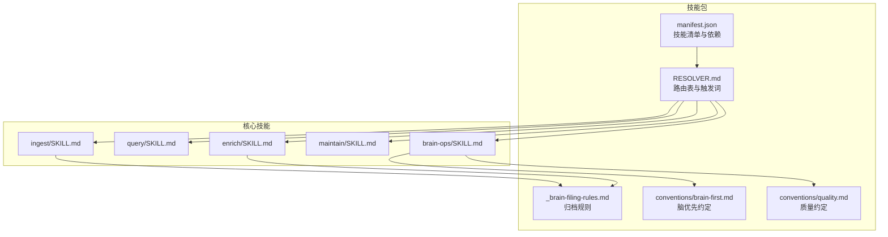
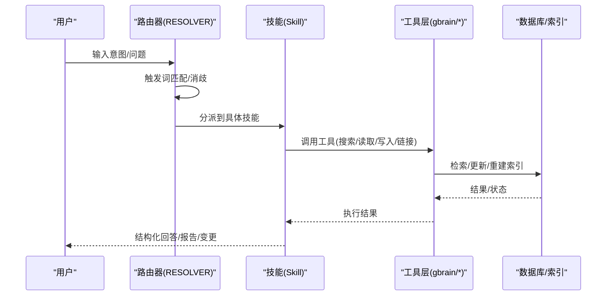
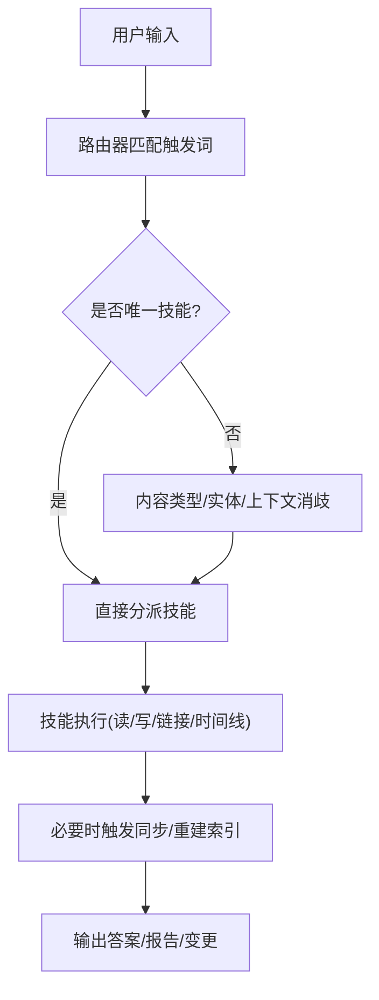
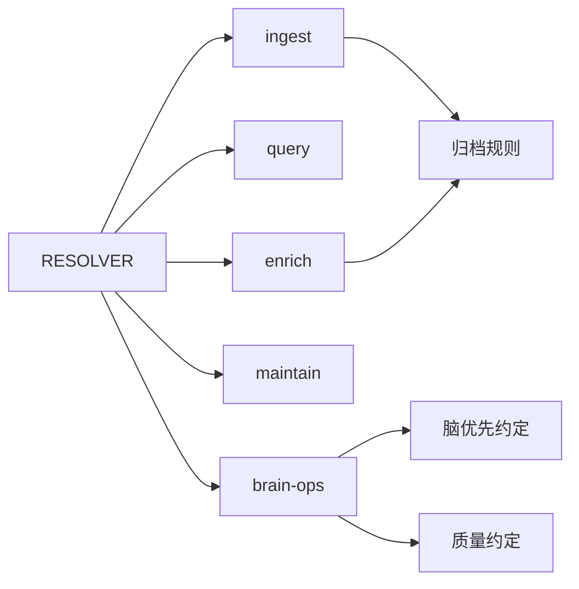

# 预定义技能详解

<cite>
**本文档引用的文件**
- [README.md](file://README.md)
- [skills/manifest.json](file://skills/manifest.json)
- [skills/RESOLVER.md](file://skills/RESOLVER.md)
- [_brain-filing-rules.md](file://skills/_brain-filing-rules.md)
- [conventions/brain-first.md](file://skills/conventions/brain-first.md)
- [conventions/quality.md](file://skills/conventions/quality.md)
- [ingest/SKILL.md](file://skills/ingest/SKILL.md)
- [query/SKILL.md](file://skills/query/SKILL.md)
- [enrich/SKILL.md](file://skills/enrich/SKILL.md)
- [maintain/SKILL.md](file://skills/maintain/SKILL.md)
- [brain-ops/SKILL.md](file://skills/brain-ops/SKILL.md)
</cite>

## 目录
1. [简介](#简介)
2. [项目结构](#项目结构)
3. [核心组件](#核心组件)
4. [架构总览](#架构总览)
5. [详细组件分析](#详细组件分析)
6. [依赖关系分析](#依赖关系分析)
7. [性能考量](#性能考量)
8. [故障排查指南](#故障排查指南)
9. [结论](#结论)
10. [附录](#附录)

## 简介
本文件面向43个预定义技能，提供系统化、可操作的功能文档与最佳实践。重点覆盖技能路由机制、参数配置、执行流程、核心技能设计理念与实现细节，并给出技能间协作模式与组合使用示例。目标是帮助开发者与使用者在不深入源码的情况下，快速理解并正确使用这些技能。

## 项目结构
- 技能清单由技能包清单统一管理，包含技能名称、路径、描述与依赖。
- 路由器（RESOLVER）负责意图识别与技能分发，支持多轮决策与链式调用。
- 质量与脑优先约定贯穿所有写入类技能，确保一致性与可审计性。

**图表来源**
- [skills/manifest.json:1-281](file://skills/manifest.json#L1-L281)
- [skills/RESOLVER.md:1-137](file://skills/RESOLVER.md#L1-L137)
- [skills/_brain-filing-rules.md:1-193](file://skills/_brain-filing-rules.md#L1-L193)
- [skills/conventions/brain-first.md:1-119](file://skills/conventions/brain-first.md#L1-L119)
- [skills/conventions/quality.md:1-41](file://skills/conventions/quality.md#L1-L41)

**章节来源**
- [skills/manifest.json:1-281](file://skills/manifest.json#L1-L281)
- [skills/RESOLVER.md:1-137](file://skills/RESOLVER.md#L1-L137)

## 核心组件
- 技能清单与版本：技能包清单定义了技能名称、路径、描述、依赖与默认设置，便于安装与升级。
- 路由器：基于触发词与上下文进行意图识别，必要时进行消歧与链式调用。
- 质量与归档：通过“脑优先”“引用格式”“回链”“可追溯原始数据”等约定，保证知识图谱的健康与可信。

**章节来源**
- [skills/manifest.json:1-281](file://skills/manifest.json#L1-L281)
- [skills/RESOLVER.md:1-137](file://skills/RESOLVER.md#L1-L137)
- [skills/conventions/brain-first.md:1-119](file://skills/conventions/brain-first.md#L1-L119)
- [skills/conventions/quality.md:1-41](file://skills/conventions/quality.md#L1-L41)
- [skills/_brain-filing-rules.md:1-193](file://skills/_brain-filing-rules.md#L1-L193)

## 架构总览
技能体系围绕“路由器—技能—工具层”的三层结构运行：
- 路由器（RESOLVER）：解析用户意图，选择最合适的技能或链路。
- 技能（SKILL.md）：定义职责边界、输入输出、执行步骤、质量与安全约束。
- 工具层（gbrain 命令/MCP 工具）：提供检索、读取、写入、链接、时间线、同步等能力。

**图表来源**
- [skills/RESOLVER.md:1-137](file://skills/RESOLVER.md#L1-L137)
- [README.md:261-261](file://README.md#L261-L261)

## 详细组件分析

### 核心技能一：ingest（内容摄取）
- 作用：将会议、文章、媒体、文档与对话等内容路由到专门的摄取流程；自动实体检测、跨页回链、时间线合并与原始数据保全。
- 输入输出：
  - 输入：文本、URL、文件、转录稿等。
  - 输出：页面创建/更新、回链、时间线条目、原始数据指针。
- 关键流程：
  1) 解析输入提取实体
  2) 对现有实体更新compiled truth，对新实体进行可标注判定后创建页面
  3) 追加时间线条目
  4) 创建交叉引用链接
  5) 强制回链（Iron Law）
  6) 时间线合并（同一事件在所有相关实体页均出现）
- 参数与配置：
  - 归档规则：按“主要主题”而非格式/来源归档
  - 原始数据保全：小文件保留在仓库，大文件/媒体上传云存储并生成重定向指针
  - 测试先行：批量处理前先试3-5项，修正后再批量
- 使用场景：
  - 会议转录、网页文章、视频/播客、PDF/截图、社交内容等
- 性能特征：
  - 写入阶段建议分批提交，避免阻塞主对话
  - 同步仅在必要时进行，减少索引重建开销

**章节来源**
- [ingest/SKILL.md:1-312](file://skills/ingest/SKILL.md#L1-L312)
- [skills/_brain-filing-rules.md:1-193](file://skills/_brain-filing-rules.md#L1-L193)

### 核心技能二：query（查询合成）
- 作用：基于三段式检索（关键词/语义/结构化）合成答案，提供带引用与缺口标记的可靠回答。
- 输入输出：
  - 输入：自然语言问题、关系型查询、图遍历请求
  - 输出：答案正文、引用列表、缺口提示、冲突标注
- 关键流程：
  1) 将问题分解为关键词/语义/结构化策略
  2) 执行关键词检索、混合检索、类型过滤/回链检查
  3) 阅读Top-N页面获取上下文
  4) 合成答案并传播引用
  5) 显式标注缺口与冲突
- 参数与配置：
  - 源权威顺序：用户直接陈述 > 编译真相 > 时间线 > 外部来源
  - 图遍历：支持多种关系类型与深度控制
- 使用场景：
  - “谁认识谁？”“发生了什么？”“背景资料”“关系网络”
- 性能特征：
  - 默认返回片段，仅在确认相关时加载全文
  - 搜索与合成成本可控，适合高频问答

**章节来源**
- [query/SKILL.md:1-156](file://skills/query/SKILL.md#L1-L156)

### 核心技能三：enrich（实体增强）
- 作用：对人/公司页面进行分级增强，产出编译真相、时间线与跨页引用，形成情报档案式页面。
- 输入输出：
  - 输入：信号（新闻、对话、外部API）
  - 输出：页面更新/创建、时间线条目、引用关系
- 关键流程：
  1) 识别实体
  2) 检查脑内状态（存在则更新，不存在则可标注后创建）
  3) 提取信号纹理（观点、项目、动机、轨迹等）
  4) 外部数据源检索（按层级优先）
  5) 保存原始数据用于溯源
  6) 写入脑内（创建/更新模板）
  7) 内容交叉引用（人/公司/项目/交易）
- 参数与配置：
  - 三级增强：关键/显著/次要，按重要性分配资源
  - 可标注门控：避免无意义页面
  - 模板化输出：人/公司页面字段与结构
- 使用场景：
  - 新联系人/新公司首次出现、新闻事件影响、定期回顾
- 性能特征：
  - 批量增强需测试样例，节流API调用，分批提交

**章节来源**
- [enrich/SKILL.md:1-350](file://skills/enrich/SKILL.md#L1-L350)

### 核心技能四：maintain（维护与健康检查）
- 作用：周期性健康检查与清理，包括回链强制、引用审计、归档校验、陈旧信息检测、孤儿页、基准测试等。
- 输入输出：
  - 输入：健康检查命令、维护任务、基准查询集
  - 输出：健康报告、修复计划、修复执行、审计日志
- 关键流程：
  1) 自动路径：生成修复方案并按依赖顺序执行，支持预算上限
  2) 手动路径：逐维度检查（陈旧、孤儿、死链、缺失交叉引用、回链、引用格式、归档、标签、嵌入新鲜度、安全、模式、文件存储、开放事项）
  3) 梦境循环：合成反思、提取模式、重新嵌入、清理孤儿
- 参数与配置：
  - 修复预算上限、冷却期、排除模式、信任边界（允许写入的slug前缀）
  - 健康指标：覆盖率、连接数、时间线条目数、嵌入新鲜度
- 使用场景：
  - 日常/周常/月常健康巡检、迁移后验证、升级后回归
- 性能特征：
  - 大脑规模较大时建议后台刷新嵌入，避开高峰时段

**章节来源**
- [maintain/SKILL.md:1-431](file://skills/maintain/SKILL.md#L1-L431)

### 核心技能五：brain-ops（脑操作——环境上下文层）
- 作用：定义“脑优先”的读写循环，确保每次交互都遵循“先脑后外”的原则，强化引用与回链。
- 输入输出：
  - 输入：任何读/写/查找/引用请求
  - 输出：更新后的脑页、增强的响应
- 关键流程：
  1) 脑优先查找：关键词/混合检索→按slug读取→检查回链/时间线
  2) 入站信号：检测实体→加载脑页→识别新信息→写回→缺失则增强
  3) 出站响应：检查脑→拉取上下文→基于脑回答
  4) 环境增强：每句话都是摄取事件，静默增强不打断对话
- 参数与配置：
  - 自动链接：写入时自动推断关系并去重
  - 跨源引用格式：包含来源ID的引用
- 使用场景：
  - 所有与脑交互的前置约定，作为其他技能的“行为基线”
- 性能特征：
  - 不阻塞对话，后台异步增强；必要时触发同步使新页可检索

**章节来源**
- [brain-ops/SKILL.md:1-164](file://skills/brain-ops/SKILL.md#L1-L164)
- [conventions/brain-first.md:1-119](file://skills/conventions/brain-first.md#L1-L119)
- [conventions/quality.md:1-41](file://skills/conventions/quality.md#L1-L41)

### 技能路由机制与参数配置
- 路由器（RESOLVER）：
  - 永远生效：每条入站消息触发信号检测；任何脑读写/引用均触发脑操作
  - 业务路由：查询、增强、归档、研究、发布、前端校验、任务管理、调度、报告、技能开发、升级、PDF导出、语音摄取、冷启动、专家解析、税务/合规等
  - 消歧规则：优先最具体技能；URL按内容类型路由；提及实体时优先增强或查询；不确定时使用“询问用户”选择门
- 触发词与链式调用：
  - 查询技能支持“谁认识谁”“关系”“图查询”等变体
  - 摄取技能支持通用“摄取此物”，自动分流到idea-ingest/media-ingest/meeting-ingestion
- 参数与配置要点：
  - 脑优先：搜索→混合检索→按slug读取→外部API
  - 引用与回链：强制inline引用与双向回链
  - 归档规则：按“主要主题”归档，避免sources/滥用
  - 跨源引用格式：包含来源ID的引用键值

**图表来源**
- [skills/RESOLVER.md:1-137](file://skills/RESOLVER.md#L1-L137)
- [conventions/brain-first.md:1-119](file://skills/conventions/brain-first.md#L1-L119)

**章节来源**
- [skills/RESOLVER.md:1-137](file://skills/RESOLVER.md#L1-L137)
- [conventions/brain-first.md:1-119](file://skills/conventions/brain-first.md#L1-L119)
- [skills/_brain-filing-rules.md:1-193](file://skills/_brain-filing-rules.md#L1-L193)

### 技能间协作模式与组合使用示例
- 摄取→增强→查询
  - 场景：收到会议转录→自动识别参会者→若无页面则增强→随后查询可直接引用
- 脑优先→合成→回链
  - 场景：回答前先搜索→混合检索→读取上下文→合成答案→传播引用→回链至实体页
- 维护→梦境循环→基准测试
  - 场景：健康检查发现陈旧页面→执行梦境循环→重新嵌入→回归测试
- 冷启动→归档→增强
  - 场景：首次导入联系人/日历/邮件→按主题归档→对关键人物/公司增强

**章节来源**
- [ingest/SKILL.md:1-312](file://skills/ingest/SKILL.md#L1-L312)
- [enrich/SKILL.md:1-350](file://skills/enrich/SKILL.md#L1-L350)
- [query/SKILL.md:1-156](file://skills/query/SKILL.md#L1-L156)
- [maintain/SKILL.md:1-431](file://skills/maintain/SKILL.md#L1-L431)

### 性能特征与适用场景
- 摄取（ingest）：写入密集，建议分批与异步；批量前先试样例
- 查询（query）：默认返回片段，仅在必要时读取全文；适合高频问答
- 增强（enrich）：外部API成本较高，按层级分配资源；批量时注意节流
- 维护（maintain）：大规模嵌入刷新建议离峰执行；健康检查可定时触发
- 脑操作（brain-ops）：不阻塞对话，后台增强；必要时同步使新页可检索

[本节为通用指导，无需特定文件来源]

### 故障排查指南
- 嵌入维度不匹配：运行健康检查，按提示修复嵌入模型配置
- 同步超时：采用按源循环+超时策略，利用部分完成状态继续后续
- 链接丢失：启用自动链接或手动提取结构化链接；检查回链
- 引用缺失：核对引用格式与来源ID；确保合成时传播引用
- 权限与安全：检查行级安全（RLS）状态；必要时重新初始化

**章节来源**
- [README.md:290-354](file://README.md#L290-L354)
- [maintain/SKILL.md:282-291](file://skills/maintain/SKILL.md#L282-L291)

## 依赖关系分析
- 路由器依赖：RESOLVER依赖各技能的触发词与职责边界，支持链式调用与消歧
- 技能依赖：写入类技能普遍依赖质量与归档约定（引用、回链、归档规则）
- 工具依赖：所有技能依赖工具层提供的检索、读取、写入、链接、时间线、同步能力

**图表来源**
- [skills/RESOLVER.md:1-137](file://skills/RESOLVER.md#L1-L137)
- [skills/_brain-filing-rules.md:1-193](file://skills/_brain-filing-rules.md#L1-L193)
- [skills/conventions/brain-first.md:1-119](file://skills/conventions/brain-first.md#L1-L119)
- [skills/conventions/quality.md:1-41](file://skills/conventions/quality.md#L1-L41)

**章节来源**
- [skills/RESOLVER.md:1-137](file://skills/RESOLVER.md#L1-L137)

## 性能考量
- 检索成本：优先使用关键词检索，必要时再用混合检索；仅在确认相关时读取全文
- 写入成本：批量写入时分批提交，避免阻塞；必要时延迟同步
- 外部调用：按层级分配API配额；批量时节流与重试
- 嵌入刷新：离峰执行；大体量时使用后台进程

[本节为通用指导，无需特定文件来源]

## 故障排查指南
- 嵌入维度不匹配：运行健康检查，按提示修复嵌入模型配置
- 同步超时：采用按源循环+超时策略，利用部分完成状态继续后续
- 链接丢失：启用自动链接或手动提取结构化链接；检查回链
- 引用缺失：核对引用格式与来源ID；确保合成时传播引用
- 权限与安全：检查行级安全（RLS）状态；必要时重新初始化

**章节来源**
- [README.md:290-354](file://README.md#L290-L354)
- [maintain/SKILL.md:282-291](file://skills/maintain/SKILL.md#L282-L291)

## 结论
43个预定义技能以路由器为核心枢纽，围绕“脑优先”“引用与回链”“按主题归档”三大约定构建，形成从摄取、增强、查询到维护的闭环。核心技能（ingest、query、enrich、maintain、brain-ops）分别承担“输入—理解—增强—治理—行为基线”的职责。通过规范化的路由、参数与执行流程，既能满足个人知识库需求，也能支撑团队级机构记忆系统的长期演进。

[本节为总结性内容，无需特定文件来源]

## 附录
- 技能清单与安装：技能包清单定义了技能集合、版本与依赖，安装后即可按路由器分派使用
- 质量与安全：所有写入类技能必须遵守引用格式、回链与可追溯性要求
- 最佳实践：先试样例再批量、离峰执行嵌入刷新、按层级分配外部API、保持健康检查常态化

**章节来源**
- [skills/manifest.json:1-281](file://skills/manifest.json#L1-L281)
- [skills/conventions/quality.md:1-41](file://skills/conventions/quality.md#L1-L41)
- [skills/_brain-filing-rules.md:1-193](file://skills/_brain-filing-rules.md#L1-L193)