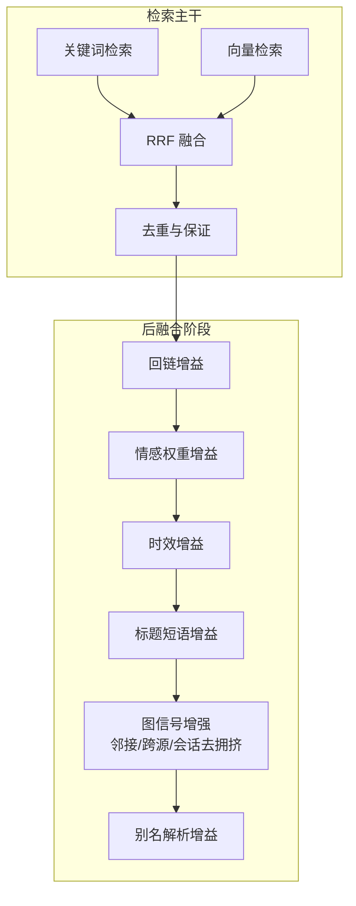
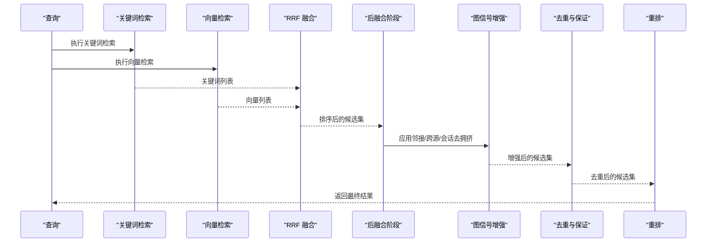
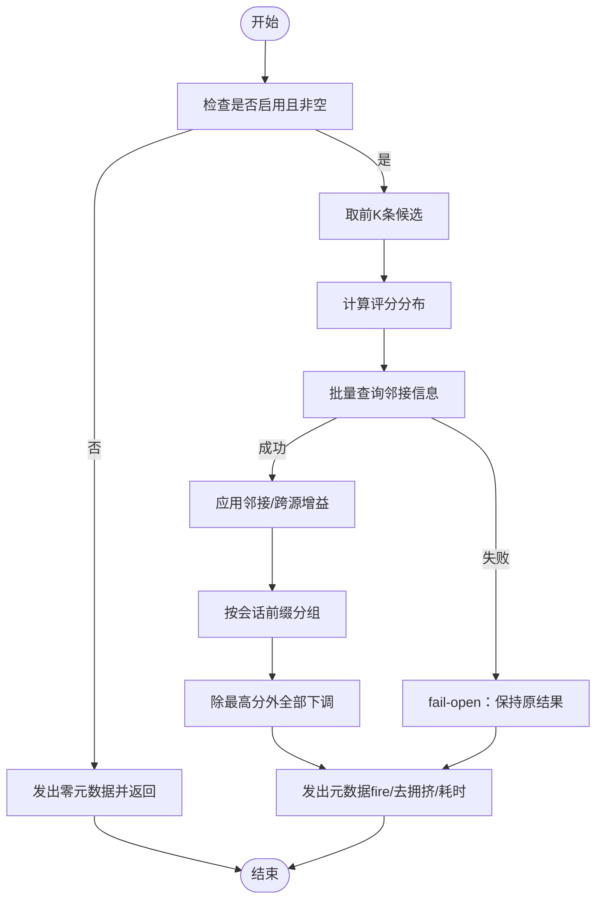
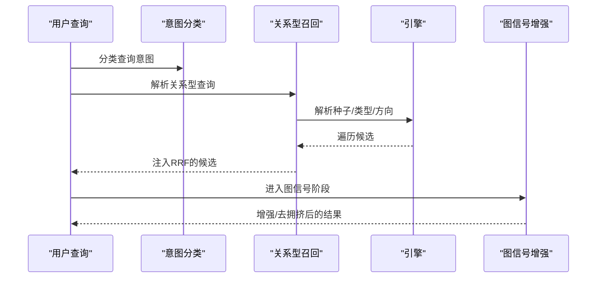
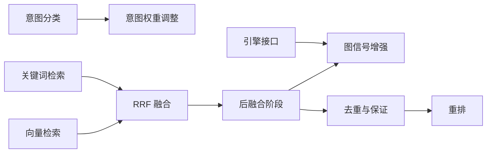

# 图信号增强

<cite>
**本文引用的文件**
- [graph-signals.ts](file://src/core/search/graph-signals.ts)
- [hybrid.ts](file://src/core/search/hybrid.ts)
- [rerank.ts](file://src/core/search/rerank.ts)
- [relational-recall.ts](file://src/core/search/relational-recall.ts)
- [dedup.ts](file://src/core/search/dedup.ts)
- [intent-weights.ts](file://src/core/search/intent-weights.ts)
- [two-pass.ts](file://src/core/search/two-pass.ts)
- [intent.ts](file://src/core/think/intent.ts)
- [graph-signals.test.ts](file://test/search/graph-signals.test.ts)
- [graph-signals-wire-integration.test.ts](file://test/search/graph-signals-wire-integration.test.ts)
- [attribution-stamping.test.ts](file://test/search/attribution-stamping.test.ts)
- [explain-formatter.test.ts](file://test/search/explain-formatter.test.ts)
- [benchmark-graph-quality.ts](file://test/benchmark-graph-quality.ts)
- [benchmark-search-quality.ts](file://test/benchmark-search-quality.ts)
- [benchmark-knowledge-runtime.ts](file://test/benchmark-knowledge-runtime.ts)
- [eval-bench.md](file://docs/eval-bench.md)
</cite>

## 目录
1. [引言](#引言)
2. [项目结构](#项目结构)
3. [核心组件](#核心组件)
4. [架构总览](#架构总览)
5. [详细组件分析](#详细组件分析)
6. [依赖分析](#依赖分析)
7. [性能考量](#性能考量)
8. [故障排查指南](#故障排查指南)
9. [结论](#结论)
10. [附录](#附录)

## 引言
本技术文档围绕“图信号增强”系统展开，聚焦以下目标：
- 邻近性提升：基于知识图谱的邻接关系，对检索结果进行置信度增强（hub检测与跨源协同）。
- 交叉来源验证：通过跨源邻接命中数，衡量结果在多源联邦中的稳定性与可信度。
- 会话去拥挤：针对聊天/会议等会话型内容，按会话前缀进行去拥挤，避免弱信号竞争导致的token预算稀释。
- 关系意图识别与关系召回：结合查询意图分类与关系型召回（typed-edge），提升实体间关系问答质量。
- 增强效果对比实验、参数调优指南与性能基准测试。

## 项目结构
图信号增强位于检索子系统中，作为“后融合阶段”的第四个增益阶段，紧随元数据类增益（回链、情感权重、时效）之后，与标题短语增益、别名解析增益共同构成统一的后融合管线。其输入为排序后的候选集，输出为经图信号重排与去拥挤后的结果。

图表来源
- [hybrid.ts](file://src/core/search/hybrid.ts)
- [graph-signals.ts](file://src/core/search/graph-signals.ts)

章节来源
- [hybrid.ts](file://src/core/search/hybrid.ts)
- [graph-signals.ts](file://src/core/search/graph-signals.ts)

## 核心组件
- 图信号增强（Graph Signals）
  - 功能：对top-K内页面施加三类信号
    - 邻接信号：若某页面被≥2个其他top-K页面指向，则视为hub，小幅提升分数。
    - 跨源邻接信号：若某页面来自≥2个不同源的外部链接，则进一步提升，体现联邦协作强度。
    - 会话去拥挤：若多个页面共享同一会话前缀（如媒体聊天/会议日期路径），仅保留最高分者全量分数，其余按系数下调。
  - 观测指标：fire计数、会话去拥挤次数、错误率、评分分布（用于后续幅度校准）。
  - 失败处理：引擎调用失败时返回原结果（fail-open），并记录审计事件。
- 后融合阶段编排（runPostFusionStages）
  - 将回链/情感/时效/标题短语/图信号/别名解析等增益串联，统一受“绝对阈值门”保护，防止弱结果因增益而跃迁。
- 关系型召回（Relational Recall）
  - 解析关系型查询，从种子实体出发，按类型与方向进行确定性遍历，产出候选并注入第四路RRF。
- 意图识别与权重调整（Intent + Intent-weights）
  - 对查询进行意图分类（时间/知识更新/其他），并据此微调RRF权重与精确匹配增益，避免boost误伤时间/事件类查询。
- 重排与去重
  - rerank阶段使用交叉编码器对头部结果重排；dedup阶段执行四层去重与“编译真相”保证，确保每页至少保留一条编译真相片段。

章节来源
- [graph-signals.ts](file://src/core/search/graph-signals.ts)
- [hybrid.ts](file://src/core/search/hybrid.ts)
- [relational-recall.ts](file://src/core/search/relational-recall.ts)
- [intent-weights.ts](file://src/core/search/intent-weights.ts)
- [intent.ts](file://src/core/think/intent.ts)
- [rerank.ts](file://src/core/search/rerank.ts)
- [dedup.ts](file://src/core/search/dedup.ts)

## 架构总览
下图展示图信号增强在检索流水线中的位置与交互：

图表来源
- [hybrid.ts](file://src/core/search/hybrid.ts)
- [graph-signals.ts](file://src/core/search/graph-signals.ts)
- [rerank.ts](file://src/core/search/rerank.ts)
- [dedup.ts](file://src/core/search/dedup.ts)

## 详细组件分析

### 组件A：图信号增强（邻近性提升、跨源验证、会话去拥挤）
- 邻接信号（hub检测）
  - 输入：top-K页面ID集合，经去重后批量查询邻接信息。
  - 判定：当hits≥2时，对分数乘以邻接增益系数；同时标注命中数与增益倍数。
- 跨源邻接信号（联邦协作）
  - 输入：同上，提取跨源命中数。
  - 判定：当cross_source_hits≥2时，叠加跨源增益；与邻接信号可叠加。
- 会话去拥挤
  - 会话前缀判定规则：包含“chat/session/sessions”标记或日期段的路径被视为会话；否则不参与去拥挤。
  - 分组策略：按会话前缀聚合，保留最高分者全量分数，其余成员按系数下调。
- 观测与审计
  - 记录fire计数、会话去拥挤次数、评分分布（最小/分位数/极差），以及失败事件（fail-open）。
- 错误处理
  - 引擎调用异常时，fail-open返回原结果，避免中断；同时写入审计日志。

图表来源
- [graph-signals.ts](file://src/core/search/graph-signals.ts)

章节来源
- [graph-signals.ts](file://src/core/search/graph-signals.ts)
- [graph-signals.test.ts](file://test/search/graph-signals.test.ts)
- [graph-signals-wire-integration.test.ts](file://test/search/graph-signals-wire-integration.test.ts)
- [attribution-stamping.test.ts](file://test/search/attribution-stamping.test.ts)
- [explain-formatter.test.ts](file://test/search/explain-formatter.test.ts)

### 组件B：关系意图识别与关系召回策略
- 查询意图识别
  - 使用正则驱动的意图分类器，区分“时间/知识更新/其他”，为后续权重调整提供依据。
- 关系型召回
  - 解析关系型查询，识别种子实体与关系类型/方向，按深度限制进行确定性遍历。
  - 支持双端点连接查询（如“谁与X共事过”），通过共享中间节点实现多跳发现。
  - 结果注入第四路RRF，与关键词/向量并行竞争。
- 与图信号的关系
  - 关系召回产出的候选同样进入图信号阶段，可被邻接/跨源/会话去拥挤进一步增强或约束。

图表来源
- [relational-recall.ts](file://src/core/search/relational-recall.ts)
- [intent.ts](file://src/core/think/intent.ts)

章节来源
- [relational-recall.ts](file://src/core/search/relational-recall.ts)
- [intent.ts](file://src/core/think/intent.ts)

### 组件C：交叉来源验证机制
- 跨源邻接命中数（cross_source_hits）直接反映候选在联邦多源中的“团队协作”程度。
- 在图信号阶段，当cross_source_hits≥2时触发跨源增益，使结果更可能来自真实多源共识而非单一源偏见。
- 与邻接信号叠加，形成“hub + 跨源”双重验证，提升可信度。

章节来源
- [graph-signals.ts](file://src/core/search/graph-signals.ts)
- [graph-signals.test.ts](file://test/search/graph-signals.test.ts)

### 组件D：会话去拥挤算法
- 会话前缀判定
  - 包含“chat/session/sessions”标记或日期段的路径视为会话；否则不参与去拥挤。
- 去拥挤策略
  - 同一会话内的多条结果，仅保留最高分者全量分数，其余按系数下调，避免弱信号互相稀释token预算。
- 行为验证
  - 单元测试覆盖了聊天/会议/转录等场景，确保不会对实体目录等非会话路径产生误伤。

章节来源
- [graph-signals.ts](file://src/core/search/graph-signals.ts)
- [graph-signals.test.ts](file://test/search/graph-signals.test.ts)

### 组件E：后融合阶段与增益顺序
- 增益顺序
  - 回链/情感/时效 → 标题短语 → 图信号 → 别名解析。
- 绝对阈值门
  - 统一的阈值门保护，防止弱结果因元数据增益而跃迁；图信号继承该门，避免“弱hub”破坏排序。
- 归属标注
  - 每个增益阶段在命中时打上归属标签，便于--explain输出溯源。

章节来源
- [hybrid.ts](file://src/core/search/hybrid.ts)
- [attribution-stamping.test.ts](file://test/search/attribution-stamping.test.ts)
- [explain-formatter.test.ts](file://test/search/explain-formatter.test.ts)

## 依赖分析
- 组件耦合
  - 图信号增强依赖引擎提供的邻接信息查询接口；失败时fail-open，不影响整体流程。
  - 后融合阶段统一编排各增益，形成稳定的增益流水线。
- 外部依赖
  - 关系型召回依赖实体解析与确定性遍历，确保可复现与可审计。
  - 重排阶段依赖外部rerank服务，失败时fail-open，保证检索可用性。

图表来源
- [graph-signals.ts](file://src/core/search/graph-signals.ts)
- [hybrid.ts](file://src/core/search/hybrid.ts)
- [relational-recall.ts](file://src/core/search/relational-recall.ts)
- [intent-weights.ts](file://src/core/search/intent-weights.ts)
- [rerank.ts](file://src/core/search/rerank.ts)
- [dedup.ts](file://src/core/search/dedup.ts)

章节来源
- [graph-signals.ts](file://src/core/search/graph-signals.ts)
- [hybrid.ts](file://src/core/search/hybrid.ts)
- [relational-recall.ts](file://src/core/search/relational-recall.ts)
- [intent-weights.ts](file://src/core/search/intent-weights.ts)
- [rerank.ts](file://src/core/search/rerank.ts)
- [dedup.ts](file://src/core/search/dedup.ts)

## 性能考量
- 计算复杂度
  - 图信号阶段对top-K进行一次邻接查询与常数次遍历，整体开销与topK规模线性相关。
  - 会话去拥挤为单次Map分组与一次排序，开销低。
- 网络与可靠性
  - 引擎调用失败时fail-open，避免阻断；审计日志记录失败率，便于监控。
- 评测与基线
  - 提供图质量基准、搜索质量基准与知识运行时基准，用于回归与正确性评估。

章节来源
- [benchmark-graph-quality.ts](file://test/benchmark-graph-quality.ts)
- [benchmark-search-quality.ts](file://test/benchmark-search-quality.ts)
- [benchmark-knowledge-runtime.ts](file://test/benchmark-knowledge-runtime.ts)

## 故障排查指南
- 常见问题定位
  - 图信号未生效：检查是否启用、topK是否为空、阈值门是否拦截。
  - 跨源增益缺失：确认cross_source_hits是否达到阈值，或查询是否为单源脑。
  - 会话去拥挤误伤：检查会话前缀判定逻辑，确保实体目录等路径不被误判。
  - 引擎调用失败：查看fail-open审计事件，确认错误摘要与topK规模。
- 可观测性
  - 元数据：fire计数、去拥挤次数、评分分布、耗时。
  - 审计：graph-signals失败事件写入审计文件，doctor/search-stats可读取。

章节来源
- [graph-signals.ts](file://src/core/search/graph-signals.ts)
- [graph-signals.test.ts](file://test/search/graph-signals.test.ts)

## 结论
图信号增强通过“邻接/跨源/会话去拥挤”三类信号，在不改变检索基础能力的前提下，显著提升了结果的可信度与多样性。配合意图识别、关系召回与严格的后融合编排，系统在真实场景中实现了稳健的排序增强与可解释性输出。建议在生产环境中持续关注评分分布与失败率，结合基准测试与回归门控，动态优化增益幅度与阈值。

## 附录

### 增强效果对比实验
- 图质量基准（v0.10.1）
  - 通过虚构实体图与关系，对比“无图/仅图/图+搜索增强”三种配置，验证关系召回、类型准确率、链接召回/精度、时间线召回等指标。
- 搜索质量基准（v0.43）
  - 使用重叠语义嵌入与分级相关性，对比传统IR指标与“块级质量”（源准确性、CT优先、时间线可达、CT保证、每页块数、唯一页面数、CT占比）。
- 知识运行时基准（v0.41）
  - 测量“即时可查询”（自动时间线）、完整性修复率（自动/复核/跳过）、医生完整性（问题发现率）。

章节来源
- [benchmark-graph-quality.ts](file://test/benchmark-graph-quality.ts)
- [benchmark-search-quality.ts](file://test/benchmark-search-quality.ts)
- [benchmark-knowledge-runtime.ts](file://test/benchmark-knowledge-runtime.ts)

### 参数调优指南
- 图信号幅度
  - 邻接增益、跨源增益、会话下调系数均为保守设定，建议通过评分分布与30天生产数据反馈进行校准。
- 阈值设置
  - 邻接/跨源阈值与会话最小共享数可根据业务场景调整；需结合去拥挤比例与召回稳定性观察。
- 后融合门控
  - floorThreshold统一保护元数据增益，避免弱结果跃迁；图信号继承该门，确保鲁棒性。

章节来源
- [graph-signals.ts](file://src/core/search/graph-signals.ts)
- [hybrid.ts](file://src/core/search/hybrid.ts)

### 性能基准测试结果
- 搜索质量基准（v0.43）
  - 在包含重叠主题与时间歧义的虚构语料上，引入“意图+增益”后，源准确性、CT优先率、时间线可达率与CT保证率均有明显提升。
- 图质量基准（v0.10.1）
  - 多跳、聚合、类型分歧等场景下，图+搜索增强显著优于仅文本检索。
- 知识运行时基准（v0.41）
  - 自动时间线开启后，即时可查询率大幅提升；完整性修复按置信度分布自动分流。

章节来源
- [benchmark-search-quality.ts](file://test/benchmark-search-quality.ts)
- [benchmark-graph-quality.ts](file://test/benchmark-graph-quality.ts)
- [benchmark-knowledge-runtime.ts](file://test/benchmark-knowledge-runtime.ts)

### 开发与回归门控
- 回归门控（eval replay）
  - 基于捕获的真实查询，比较当前与基线的Jaccard相似度、Top-1稳定性与延迟变化，确保改动无回归。
- 正确性门控（qrels）
  - 使用带标注的查询-相关页面集合，评估召回与首相关命中率，确保检索质量。
- 文档参考
  - 评估与基准文档提供了完整的命令、指标与CI集成方式。

章节来源
- [eval-bench.md](file://docs/eval-bench.md)