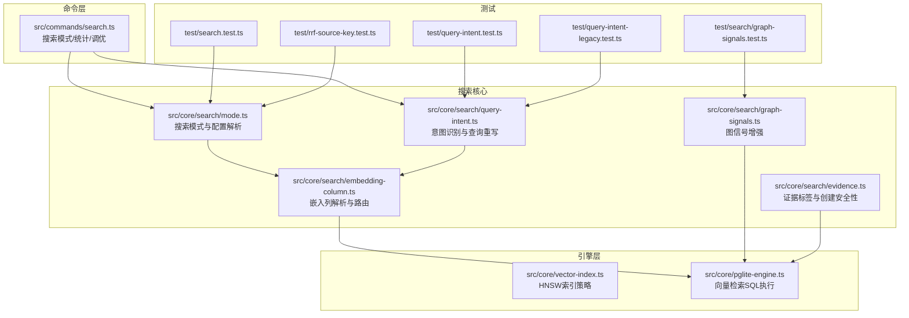
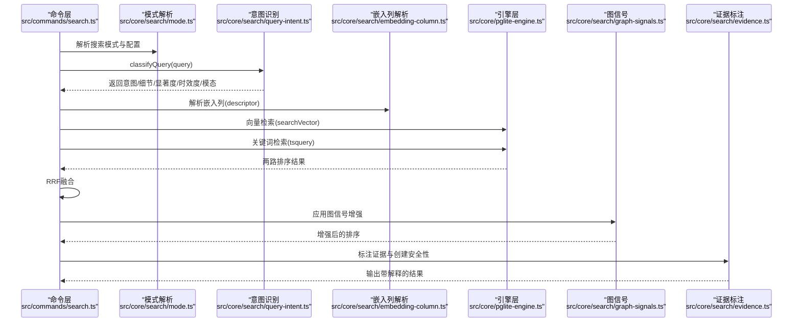
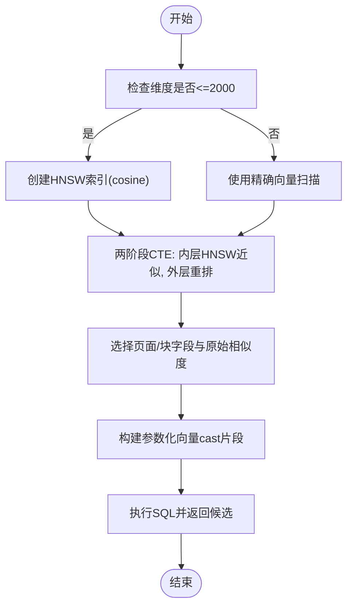
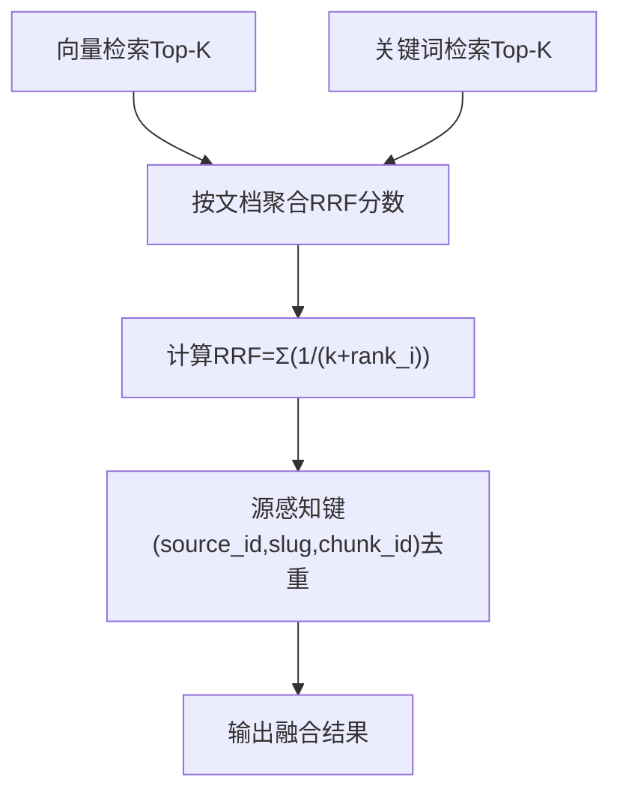
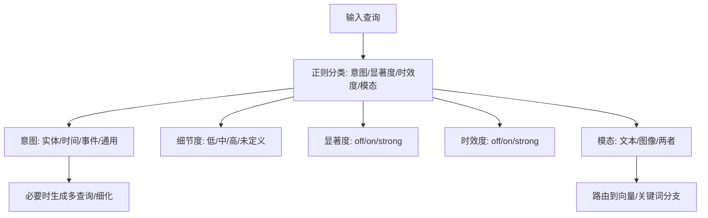
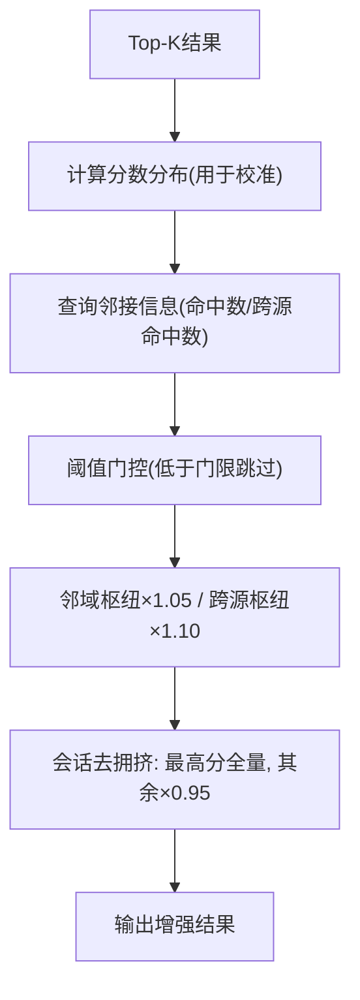
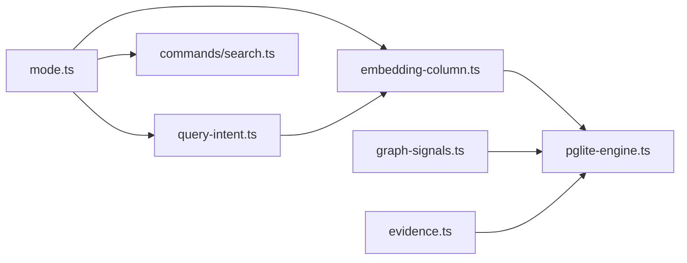

# 搜索与检索

<cite>
**本文引用的文件**
- [hybrid-search.md](file://test/e2e/fixtures/concepts/hybrid-search.md)
- [vector-index.ts](file://src/core/vector-index.ts)
- [embedding-column.ts](file://src/core/search/embedding-column.ts)
- [pglite-engine.ts](file://src/core/pglite-engine.ts)
- [query-intent.ts](file://src/core/search/query-intent.ts)
- [mode.ts](file://src/core/search/mode.ts)
- [search.ts](file://src/commands/search.ts)
- [graph-signals.ts](file://src/core/search/graph-signals.ts)
- [evidence.ts](file://src/core/search/evidence.ts)
- [search.test.ts](file://test/search.test.ts)
- [rrf-source-key.test.ts](file://test/rrf-source-key.test.ts)
- [graph-signals.test.ts](file://test/search/graph-signals.test.ts)
- [embedding-column-postgres.test.ts](file://test/e2e/embedding-column-postgres.test.ts)
- [v0_28_5-fix-wave.test.ts](file://test/e2e/v0_28_5-fix-wave.test.ts)
- [query-intent-legacy.test.ts](file://test/query-intent-legacy.test.ts)
- [query-intent.test.ts](file://test/query-intent.test.ts)
- [search.ts](file://src/core/operations.ts)
</cite>

## 目录
1. [简介](#简介)
2. [项目结构](#项目结构)
3. [核心组件](#核心组件)
4. [架构总览](#架构总览)
5. [详细组件分析](#详细组件分析)
6. [依赖关系分析](#依赖关系分析)
7. [性能考量](#性能考量)
8. [故障排除指南](#故障排除指南)
9. [结论](#结论)
10. [附录](#附录)

## 简介
本技术文档面向 GBrain 的混合搜索与检索系统，系统以“向量检索（pgvector + HNSW）+ 关键词检索（PostgreSQL tsquery）+ RRF 融合”为核心，结合意图识别与查询重写、跨模态路由、图信号增强（邻近性提升、交叉来源验证、会话去拥挤）、结果解释（证据标签与创建安全性提示）等能力，形成可配置、可观测、可调优的搜索流水线。文档同时覆盖搜索模式配置、成本与质量权衡、查询优化技巧与性能调优建议，并提供实际查询示例与结果分析。

## 项目结构
- 核心搜索逻辑位于 src/core/search 下，包含意图分类、嵌入列解析、图信号增强、证据标注等模块。
- 引擎层在 src/core 下，负责向量检索与 SQL 构造；命令层在 src/commands 下，提供搜索模式仪表盘、统计与推荐调优。
- 测试用例覆盖混合检索流程、RRF 融合、图信号增强、证据标注、意图分类等关键行为。

图表来源
- [search.ts:1-583](file://src/commands/search.ts#L1-L583)
- [mode.ts:1-800](file://src/core/search/mode.ts#L1-L800)
- [query-intent.ts:1-343](file://src/core/search/query-intent.ts#L1-L343)
- [embedding-column.ts:1-583](file://src/core/search/embedding-column.ts#L1-L583)
- [vector-index.ts:1-31](file://src/core/vector-index.ts#L1-L31)
- [pglite-engine.ts:1824-1922](file://src/core/pglite-engine.ts#L1824-L1922)
- [graph-signals.ts:1-419](file://src/core/search/graph-signals.ts#L1-L419)
- [evidence.ts:1-79](file://src/core/search/evidence.ts#L1-L79)
- [search.test.ts:1-76](file://test/search.test.ts#L1-L76)
- [rrf-source-key.test.ts:1-36](file://test/rrf-source-key.test.ts#L1-L36)
- [graph-signals.test.ts:197-468](file://test/search/graph-signals.test.ts#L197-L468)
- [query-intent.test.ts:1-157](file://test/query-intent.test.ts#L1-L157)
- [query-intent-legacy.test.ts:36-163](file://test/query-intent-legacy.test.ts#L36-L163)

章节来源
- [search.ts:1-583](file://src/commands/search.ts#L1-L583)
- [mode.ts:1-800](file://src/core/search/mode.ts#L1-L800)

## 核心组件
- 向量检索与索引：使用 pgvector 的 HNSW 进行近似最近邻检索，支持维度上限与降级策略。
- 关键词检索：基于 PostgreSQL tsquery 与 tsvector 索引，返回 ts_rank 排序结果。
- RRF 融合：对向量与关键词两路结果进行秩倒数融合，k 常数（典型 60）抑制单一列表主导效应。
- 意图识别与查询重写：通过正则规则识别查询意图（实体/时间/事件/通用），并给出细节度、显著度、时效度建议，以及跨模态路由（文本/图像/两者）。
- 嵌入列解析：统一解析当前使用的嵌入列（名称、类型、维度、提供商），确保缓存一致性与跨列迁移安全。
- 图信号增强：在后融合阶段应用邻近性提升、交叉来源验证与会话去拥挤，受阈值门控保护。
- 结果解释：为每个候选标注证据类别与创建安全性提示，避免重复创建。

章节来源
- [hybrid-search.md:29-63](file://test/e2e/fixtures/concepts/hybrid-search.md#L29-L63)
- [vector-index.ts:1-31](file://src/core/vector-index.ts#L1-L31)
- [embedding-column.ts:1-583](file://src/core/search/embedding-column.ts#L1-L583)
- [pglite-engine.ts:1824-1922](file://src/core/pglite-engine.ts#L1824-L1922)
- [query-intent.ts:1-343](file://src/core/search/query-intent.ts#L1-L343)
- [graph-signals.ts:1-419](file://src/core/search/graph-signals.ts#L1-L419)
- [evidence.ts:1-79](file://src/core/search/evidence.ts#L1-L79)

## 架构总览
混合搜索从命令层接收请求，解析搜索模式与配置，进入意图识别与查询重写，随后分别触发向量检索与关键词检索，再经 RRF 融合并进入后融合阶段（元数据增强、图信号、去重、截断等），最终输出带证据标签的结果。

图表来源
- [search.ts:1-583](file://src/commands/search.ts#L1-L583)
- [mode.ts:571-639](file://src/core/search/mode.ts#L571-L639)
- [query-intent.ts:248-287](file://src/core/search/query-intent.ts#L248-L287)
- [embedding-column.ts:372-444](file://src/core/search/embedding-column.ts#L372-L444)
- [pglite-engine.ts:1824-1922](file://src/core/pglite-engine.ts#L1824-L1922)
- [graph-signals.ts:289-418](file://src/core/search/graph-signals.ts#L289-L418)
- [evidence.ts:72-79](file://src/core/search/evidence.ts#L72-L79)

## 详细组件分析

### 向量检索与索引（pgvector + HNSW）
- 索引策略：默认使用 HNSW + cosine 距离；当维度超过上限时降级为精确向量扫描，保证稳定性。
- 引擎执行：两阶段 CTE 保持 HNSW 近似效率，外层按来源因子重排，支持按偏移扩展候选池。
- 跨模态路由：根据解析出的嵌入列（文本/图像/统一多模态）选择对应列与类型（vector/halfvec）并生成参数化 cast 片段。

图表来源
- [vector-index.ts:19-31](file://src/core/vector-index.ts#L19-L31)
- [pglite-engine.ts:1824-1922](file://src/core/pglite-engine.ts#L1824-L1922)
- [embedding-column.ts:240-270](file://src/core/search/embedding-column.ts#L240-L270)

章节来源
- [vector-index.ts:1-31](file://src/core/vector-index.ts#L1-L31)
- [pglite-engine.ts:1824-1922](file://src/core/pglite-engine.ts#L1824-L1922)
- [embedding-column-postgres.test.ts:91-125](file://test/e2e/embedding-column-postgres.test.ts#L91-L125)
- [v0_28_5-fix-wave.test.ts:181-207](file://test/e2e/v0_28_5-fix-wave.test.ts#L181-L207)

### 关键词检索（PostgreSQL tsquery + ts_rank）
- 使用 tsquery 对 tsvector 列进行全文检索，返回按 ts_rank 排序的结果。
- 与向量检索并行或串行，最终由 RRF 融合。

章节来源
- [hybrid-search.md:35-36](file://test/e2e/fixtures/concepts/hybrid-search.md#L35-L36)

### RRF 融合与去重
- RRF 计算公式：对每条文档，其 RRF 分数为各结果列表中出现该文档的秩的倒数之和；k 常数（典型 60）抑制单一列表主导。
- 源感知键：RRF 与去重键包含 source_id，避免联邦来源间同 slug 合并导致召回偏差。
- 单源排序不变：同一来源内排序保持稳定。

图表来源
- [hybrid-search.md:38-52](file://test/e2e/fixtures/concepts/hybrid-search.md#L38-L52)
- [rrf-source-key.test.ts:33-36](file://test/rrf-source-key.test.ts#L33-L36)
- [search.test.ts:39-76](file://test/search.test.ts#L39-L76)

章节来源
- [hybrid-search.md:38-52](file://test/e2e/fixtures/concepts/hybrid-search.md#L38-L52)
- [rrf-source-key.test.ts:1-36](file://test/rrf-source-key.test.ts#L1-L36)
- [search.test.ts:1-76](file://test/search.test.ts#L1-L76)

### 意图识别与查询重写
- 查询意图：实体/时间/事件/通用，细节度映射：实体低、时间/事件高、通用未定义。
- 显著度与时效度：独立于意图，分别衡量“当前上下文重要性”和“近期性”，可同时开启或关闭。
- 跨模态路由：保守默认文本；显式视觉名词触发图像路径；两者可并行加权融合。
- 自动检测：根据查询自动推断细节度（实体→低、时间→高）。

图表来源
- [query-intent.ts:248-287](file://src/core/search/query-intent.ts#L248-L287)
- [query-intent.test.ts:15-157](file://test/query-intent.test.ts#L15-L157)
- [query-intent-legacy.test.ts:36-163](file://test/query-intent-legacy.test.ts#L36-L163)

章节来源
- [query-intent.ts:1-343](file://src/core/search/query-intent.ts#L1-L343)
- [query-intent.test.ts:1-157](file://test/query-intent.test.ts#L1-L157)
- [query-intent-legacy.test.ts:36-163](file://test/query-intent-legacy.test.ts#L36-L163)

### 嵌入列解析与缓存安全
- 注册表：内置列（embedding、embedding_image）与用户声明列合并，严格校验键名、类型、维度、提供商。
- 路由：根据调用方选项与配置解析具体列描述符，传递给引擎执行。
- 缓存安全：仅当列名为默认 embedding 且维度/提供商与配置一致时才复用语义查询缓存，避免空间不兼容。

章节来源
- [embedding-column.ts:1-583](file://src/core/search/embedding-column.ts#L1-L583)

### 图信号增强（邻近性提升、交叉来源验证、会话去拥挤）
- 邻近性提升（~1.05×）：若某页被≥2个其他Top-K页链接，则视为查询的邻域枢纽。
- 交叉来源验证（~1.10×）：若某页来自≥2个不同来源的外部链接，则视为跨源枢纽。
- 会话去拥挤（×0.95）：对共享会话前缀的多个候选，保留最高分者全量得分，其余降权。
- 阈值门控：低于阈值的结果不参与任何图信号增强，防止弱匹配被推升。
- 失败开路：引擎调用失败时静默回退，记录审计日志。

图表来源
- [graph-signals.ts:289-418](file://src/core/search/graph-signals.ts#L289-L418)
- [graph-signals.test.ts:197-468](file://test/search/graph-signals.test.ts#L197-L468)

章节来源
- [graph-signals.ts:1-419](file://src/core/search/graph-signals.ts#L1-L419)
- [graph-signals.test.ts:197-468](file://test/search/graph-signals.test.ts#L197-L468)

### 结果解释（证据标签与创建安全性）
- 证据类别优先级：别名命中 > 标题精确匹配 > 高置信向量匹配 > 关键词精确匹配 > 弱语义匹配。
- 创建安全性：强证据（存在）→ 不要新建；关键词精确（可能）→ 更倾向更新；弱语义（未知）→ 需进一步核验。
- 标注时机：在别名跳转与切片之前一次性标注，供 MCP 调用与 explain 输出。

章节来源
- [evidence.ts:1-79](file://src/core/search/evidence.ts#L1-L79)
- [search.ts:1639-1665](file://src/core/operations.ts#L1639-L1665)

## 依赖关系分析
- 模式层（mode.ts）为搜索提供完整的参数集，支持 per-call、配置覆盖与模式默认三段解析链。
- 命令层（search.ts）提供模式仪表盘、统计与推荐调优，读取模式解析与遥测数据。
- 引擎层（pglite-engine.ts）封装向量检索 SQL，依赖嵌入列解析结果。
- 图信号与证据模块作为后融合阶段插件，与主流程解耦。

图表来源
- [mode.ts:571-639](file://src/core/search/mode.ts#L571-L639)
- [query-intent.ts:248-287](file://src/core/search/query-intent.ts#L248-L287)
- [embedding-column.ts:372-444](file://src/core/search/embedding-column.ts#L372-L444)
- [pglite-engine.ts:1824-1922](file://src/core/pglite-engine.ts#L1824-L1922)
- [search.ts:1-583](file://src/commands/search.ts#L1-L583)
- [graph-signals.ts:289-418](file://src/core/search/graph-signals.ts#L289-L418)
- [evidence.ts:72-79](file://src/core/search/evidence.ts#L72-L79)

章节来源
- [mode.ts:1-800](file://src/core/search/mode.ts#L1-L800)
- [search.ts:1-583](file://src/commands/search.ts#L1-L583)

## 性能考量
- 索引与查询
  - HNSW + cosine 在合理维度内提供高效近似检索；超限自动降级为精确扫描，避免索引无效。
  - 两阶段 CTE 保持 HNSW 近似，外层窄候选池重排，兼顾延迟与精度。
- 模式与预算
  - 保守模式：较低 token 预算与较小 limit，适合成本敏感场景。
  - 平衡模式：启用重排序器与图信号，兼顾质量与成本。
  - 令牌最大模式：扩大 limit 与启用扩展，追求召回上限。
- 图信号与重排序
  - 图信号在 reranked 模式下更可信，可配合 autocut 基于分数断崖裁剪结果集，减少下游 LLM 成本。
- 观测与调优
  - 使用 `gbrain search stats` 查看缓存命中率、意图分布、预算丢弃数等指标。
  - 使用 `gbrain search tune` 获取推荐配置变更，支持一键应用与回滚。

章节来源
- [mode.ts:285-439](file://src/core/search/mode.ts#L285-L439)
- [search.ts:206-287](file://src/commands/search.ts#L206-L287)
- [search.ts:368-498](file://src/commands/search.ts#L368-L498)

## 故障排除指南
- 向量检索异常
  - 现象：HNSW 索引无法建立或查询无结果。
  - 排查：确认维度不超过上限；检查索引是否存在；验证向量列类型与 cast 片段。
  - 参考：维度上限降级、索引生命周期管理、向量 cast 生成。
- 嵌入列解析错误
  - 现象：提示列未注册或配置非法。
  - 排查：核对列名正则、类型与维度范围；确认注册表合并与校验逻辑。
- 图信号失败
  - 现象：图信号增强未生效或报错。
  - 排查：检查邻接查询是否成功；查看审计日志；确认阈值门控是否过滤了结果。
- 结果解释异常
  - 现象：证据类别与预期不符。
  - 排查：确认 base_score 是否存在；标题/别名命中标志是否正确设置。

章节来源
- [vector-index.ts:19-31](file://src/core/vector-index.ts#L19-L31)
- [embedding-column.ts:104-148](file://src/core/search/embedding-column.ts#L104-L148)
- [graph-signals.ts:332-349](file://src/core/search/graph-signals.ts#L332-L349)
- [evidence.ts:45-52](file://src/core/search/evidence.ts#L45-L52)

## 结论
GBrain 的混合搜索以“向量 + 关键词 + RRF”为基础，结合意图识别、跨模态路由、图信号增强与结果解释，形成可配置、可观测、可调优的搜索体系。通过模式层的参数化与命令层的仪表盘/统计/调优工具，用户可在成本与质量之间灵活权衡，并借助证据标注与解释能力降低误判风险。

## 附录

### 搜索模式配置与成本质量权衡
- 保守模式：低预算、小 limit、禁用重排序器与图信号，适合成本敏感与低复杂度场景。
- 平衡模式：启用重排序器与图信号，兼顾召回与排序质量，适配多数用户。
- 令牌最大模式：扩大 limit 与启用扩展，追求召回上限，适合高价值场景但成本更高。
- 调优建议：根据缓存命中率、预算丢弃数与意图分布调整模式；在 reranked 模式下启用 autocut 以控制结果规模。

章节来源
- [mode.ts:285-439](file://src/core/search/mode.ts#L285-L439)
- [search.ts:206-287](file://src/commands/search.ts#L206-L287)
- [search.ts:368-498](file://src/commands/search.ts#L368-L498)

### 查询优化技巧与示例
- 明确意图：实体类问题（Who/What）→ 细节度低；时间类问题（When/Recent/Latest）→ 细节度高。
- 跨模态查询：明确视觉需求（照片/图片/截图/图表）→ 触发图像分支或两者融合。
- 示例
  - “NovaMind CEO 的背景” → 实体类，细节度低；可直接文本向量检索。
  - “最近关于 AI agent 的进展” → 时间类，细节度高；可结合时效度与时序检索。
  - “展示会议纪要中的图表” → 跨模态，建议图像分支或两者融合。

章节来源
- [query-intent.ts:63-109](file://src/core/search/query-intent.ts#L63-L109)
- [query-intent.test.ts:15-157](file://test/query-intent.test.ts#L15-L157)

### 结果解释与逐阶段归属追踪
- 证据类别：别名命中 > 标题精确匹配 > 高置信向量匹配 > 关键词精确匹配 > 弱语义匹配。
- 创建安全性：强证据（存在）→ 不要新建；关键词精确（可能）→ 更新优先；弱语义（未知）→ 需人工核验。
- 归属追踪：在别名跳转与切片前标注证据与创建安全性，便于 explain 与审计。

章节来源
- [evidence.ts:1-79](file://src/core/search/evidence.ts#L1-L79)
- [search.ts:1639-1665](file://src/core/operations.ts#L1639-L1665)