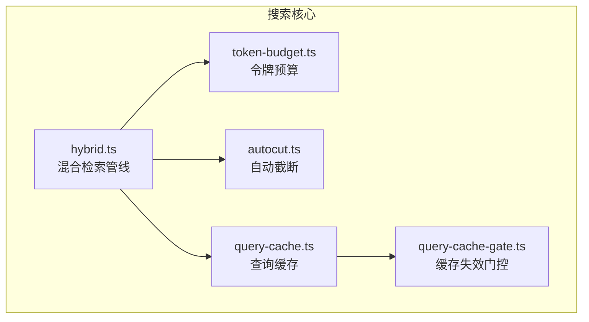
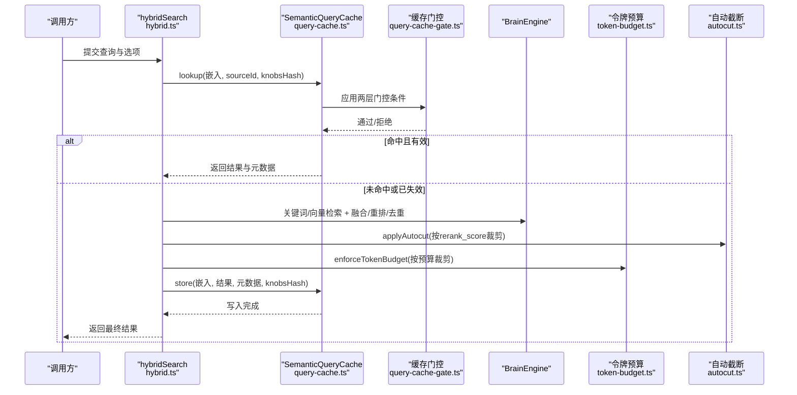
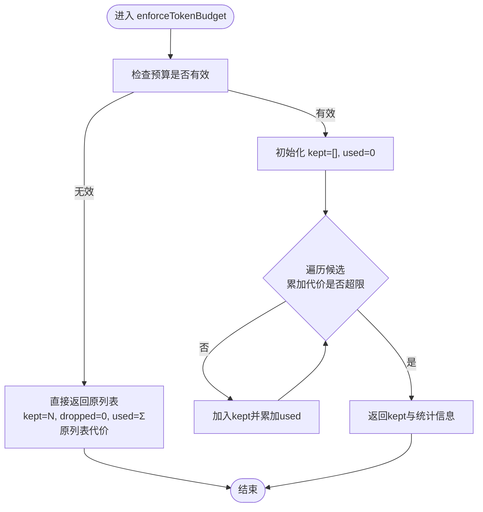
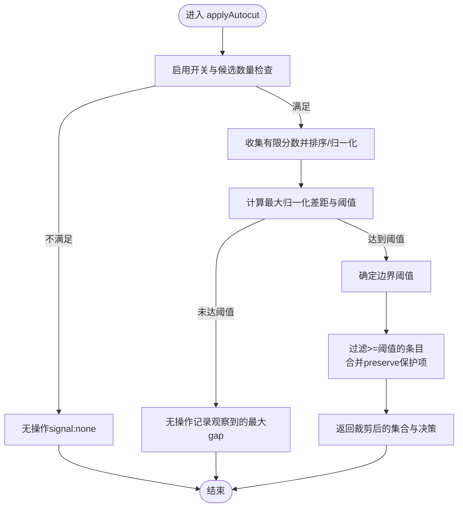
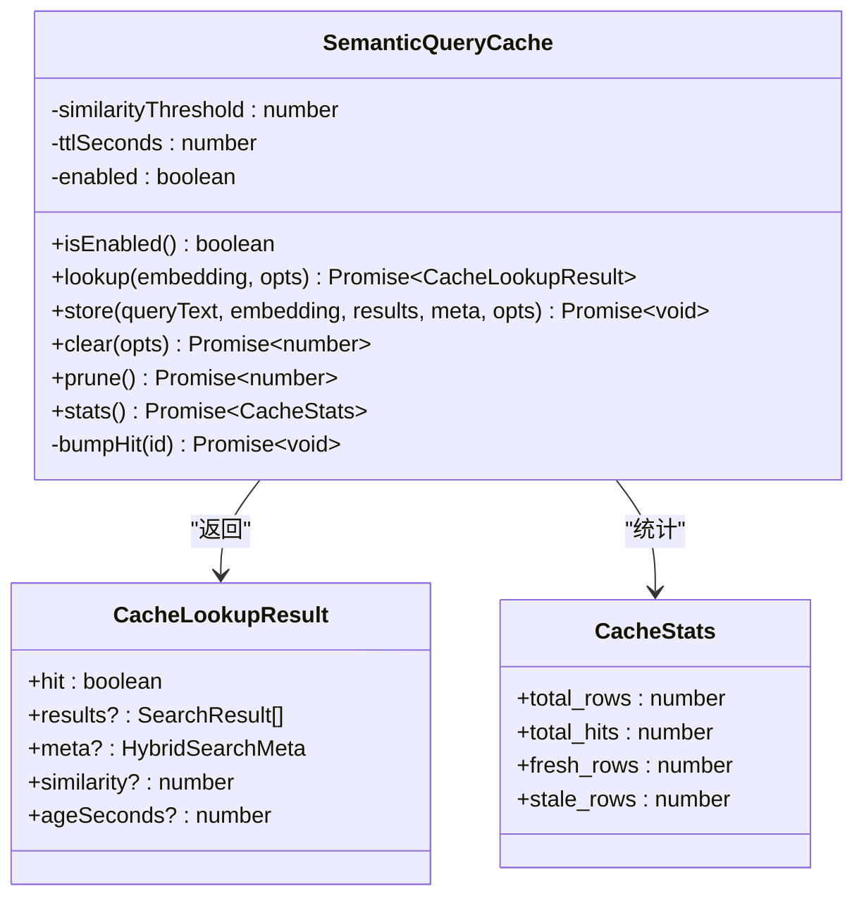
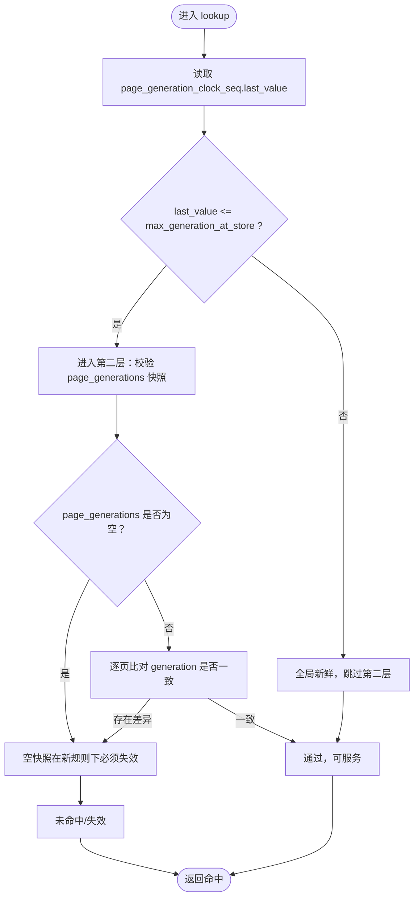
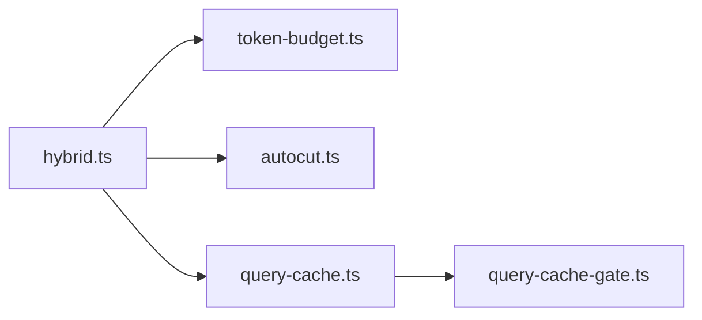

# 搜索性能优化

<cite>
**本文引用的文件**
- [token-budget.ts](file://src/core/search/token-budget.ts)
- [autocut.ts](file://src/core/search/autocut.ts)
- [query-cache.ts](file://src/core/search/query-cache.ts)
- [query-cache-gate.ts](file://src/core/search/query-cache-gate.ts)
- [hybrid.ts](file://src/core/search/hybrid.ts)
- [token-budget.test.ts](file://test/token-budget.test.ts)
- [query-op-autocut.test.ts](file://test/search/query-op-autocut.test.ts)
- [autocut-eval.test.ts](file://test/search/autocut-eval.test.ts)
- [query-cache.test.ts](file://test/query-cache.test.ts)
- [query-cache-gate.test.ts](file://test/query-cache-gate.test.ts)
- [query-cache-knobs-hash.serial.test.ts](file://test/query-cache-knobs-hash.serial.test.ts)
- [schema-pack-query-cache-invalidator.test.ts](file://test/schema-pack-query-cache-invalidator.test.ts)
- [benchmark-search-quality.ts](file://test/benchmark-search-quality.ts)
- [benchmark-knowledge-runtime.ts](file://test/benchmark-knowledge-runtime.ts)
- [search-diagnose.test.ts](file://test/search/search-diagnose.test.ts)
- [_read_latency_workload.ts](file://tests/heavy/_read_latency_workload.ts)
- [measure_rss.sh](file://tests/heavy/measure_rss.sh)
- [rss-baseline.json](file://tests/heavy/rss-baseline.json)
</cite>

## 目录
1. [引言](#引言)
2. [项目结构](#项目结构)
3. [核心组件](#核心组件)
4. [架构总览](#架构总览)
5. [详细组件分析](#详细组件分析)
6. [依赖关系分析](#依赖关系分析)
7. [性能考量](#性能考量)
8. [故障排除指南](#故障排除指南)
9. [结论](#结论)
10. [附录](#附录)

## 引言
本技术文档聚焦于 gbrain 搜索性能优化系统，围绕以下关键能力展开：  
- 令牌预算管理（Token Budget），在搜索管线末端以贪心方式控制上下文窗口占用，确保下游模型调用安全；  
- 自动截断（Autocut），基于重排序器相关性分数的“悬崖”检测，智能裁剪结果集，提升精度与响应时间平衡；  
- 查询缓存（Semantic Query Cache），以向量相似度为依据进行命中判定，结合两层失效门控保障一致性；  
- 缓存失效策略与一致性保证，通过页面生成时钟与快照实现跨模式隔离与正确过期；  
- 性能基准与监控，包括检索质量评估、延迟与内存占用测量工具链；  
- 最佳实践与故障排除建议。

## 项目结构
该系统位于 src/core/search 下，核心模块包括：
- 令牌预算：token-budget.ts
- 自动截断：autocut.ts
- 混合检索管线：hybrid.ts（串联关键词/向量融合、重排、去重、增强等）
- 查询缓存：query-cache.ts 及其失效门控：query-cache-gate.ts
- 测试覆盖：上述模块均有对应的单元/集成测试与基准脚本

图示来源
- [hybrid.ts:772-800](file://src/core/search/hybrid.ts#L772-L800)
- [token-budget.ts:76-112](file://src/core/search/token-budget.ts#L76-L112)
- [autocut.ts:134-221](file://src/core/search/autocut.ts#L134-L221)
- [query-cache.ts:97-336](file://src/core/search/query-cache.ts#L97-L336)
- [query-cache-gate.ts:163-190](file://src/core/search/query-cache-gate.ts#L163-L190)

章节来源
- [hybrid.ts:1-120](file://src/core/search/hybrid.ts#L1-L120)
- [token-budget.ts:1-113](file://src/core/search/token-budget.ts#L1-L113)
- [autocut.ts:1-222](file://src/core/search/autocut.ts#L1-L222)
- [query-cache.ts:1-397](file://src/core/search/query-cache.ts#L1-L397)
- [query-cache-gate.ts:1-232](file://src/core/search/query-cache-gate.ts#L1-L232)

## 核心组件
- 令牌预算管理：对最终候选集按标题与块文本的字符估算进行累计计数，在不改变原始顺序的前提下，从顶部开始贪心裁剪，直至累计超出预算或无法再容纳首个候选项。  
- 自动截断：在重排序器给出的 rerank_score 上寻找最大归一化差距（悬崖），据此决定保留数量，避免固定 Top-K 带来的噪声与“20 vs 1”精度问题。  
- 查询缓存：以查询嵌入的余弦距离阈值判断命中，命中后直接返回存储的结果与元数据；未命中则执行完整检索流程并将结果写回缓存。  
- 缓存门控：两层失效检查（全局页面生成时钟 + 结果页快照），空快照在新规则下不再作为“真空有效”通过，确保写入升级后的脑库不会误服旧空缓存。

章节来源
- [token-budget.ts:27-112](file://src/core/search/token-budget.ts#L27-L112)
- [autocut.ts:23-221](file://src/core/search/autocut.ts#L23-L221)
- [query-cache.ts:97-336](file://src/core/search/query-cache.ts#L97-L336)
- [query-cache-gate.ts:163-231](file://src/core/search/query-cache-gate.ts#L163-L231)

## 架构总览
下图展示混合检索主干流程与关键优化点的交互：

图示来源
- [hybrid.ts:772-800](file://src/core/search/hybrid.ts#L772-L800)
- [query-cache.ts:127-196](file://src/core/search/query-cache.ts#L127-L196)
- [query-cache-gate.ts:163-190](file://src/core/search/query-cache-gate.ts#L163-L190)
- [autocut.ts:134-221](file://src/core/search/autocut.ts#L134-L221)
- [token-budget.ts:76-112](file://src/core/search/token-budget.ts#L76-L112)

## 详细组件分析

### 令牌预算管理（Token Budget）
- 计数策略：采用字符/4 的启发式估算，避免引入重型分词器；对空串返回 0，单字符也至少计 1 令牌，向上取整确保安全预算。  
- 执行时机：在所有评分、重排、去重、两阶段扩展之后，作为最后裁剪阶段，不重新排序，保持调用者提供的顺序契约。  
- 边界行为：未设置预算或非正数时视为无操作；首个候选项即超预算时返回空集；输入为空时直接返回空集。  
- 统计输出：返回 kept/dropped/used/budget 等元信息，便于可观测性与调试。

图示来源
- [token-budget.ts:76-112](file://src/core/search/token-budget.ts#L76-L112)

章节来源
- [token-budget.ts:27-112](file://src/core/search/token-budget.ts#L27-L112)
- [token-budget.test.ts:1-123](file://test/token-budget.test.ts#L1-L123)

### 自动截断（Autocut）
- 输入信号：仅使用 cross-encoder rerank_score，当少于两个有有限分数项时无操作；若最高分为非正值或非有限数亦无操作。  
- 判定逻辑：对有限分数降序排序并归一化，寻找最大归一化差距（jumpRatio 阈值），保留不低于阈值边界的所有条目；支持可选 preserve 回调保护特定条目（如别名精确匹配注入）。  
- 默认配置：enabled=true，jumpRatio=0.2，minKeep=1；可通过配置与调用参数覆盖。  
- 评估验证：在枚举类查询上保持召回稳定，在一般查询上显著提升精度，同时限制召回回退幅度。

图示来源
- [autocut.ts:134-221](file://src/core/search/autocut.ts#L134-L221)

章节来源
- [autocut.ts:23-221](file://src/core/search/autocut.ts#L23-L221)
- [autocut-eval.test.ts:116-180](file://test/search/autocut-eval.test.ts#L116-L180)
- [query-op-autocut.test.ts:1-33](file://test/search/query-op-autocut.test.ts#L1-L33)

### 查询缓存（Semantic Query Cache）
- 命中判定：以查询嵌入与缓存中最接近的向量进行余弦距离比较，低于阈值且未过期才命中；命中后异步提升命中计数。  
- 存储内容：查询文本、source_id、knobsHash、嵌入、结果数组、元数据、TTL、页面生成快照与最大生成号。  
- 多源隔离：按 source_id 限定作用域，避免跨脑缓存污染；knobsHash 将不同模式写入独立行，防止交叉污染。  
- 清理与统计：支持全量清空、仅清理过期行、统计总数/新鲜/陈旧/命中次数；后台写入采用挂起任务集合并带超时的冲刷机制。  
- 配置加载：从 config 表读取开关、相似度阈值与 TTL，默认值安全上限（例如 TTL 不超过 30 天）。

图示来源
- [query-cache.ts:97-336](file://src/core/search/query-cache.ts#L97-L336)

章节来源
- [query-cache.ts:1-397](file://src/core/search/query-cache.ts#L1-L397)
- [query-cache.test.ts:211-260](file://test/query-cache.test.ts#L211-L260)
- [query-cache-knobs-hash.serial.test.ts:184-214](file://test/query-cache-knobs-hash.serial.test.ts#L184-L214)

### 缓存失效门控（Two-Layer Gate）
- 第一层（全局时钟）：通过页面生成序列的 last_value 与缓存行存储的 max_generation_at_store 比较，若未推进则认为全局新鲜；该序列由每条语句触发器推进，非事务内读取，只可能过度失效，绝不提供陈旧。  
- 第二层（页面快照）：若第一层通过，则进一步比对 page_generations JSONB 快照；任一页面被删除或 generation 改变即失效；v0.41.19+ 规定空快照不可作为“真空有效”，必须依赖第一层判定。  
- 严格性演进：修复了旧版 MAX(generation) 读取与 DELETE 不触发触发器导致的静默陈旧问题；升级路径短暂时允许一次缓存缺失，随后自然填充。  
- 一致性保证：缓存行包含 per-mode knobsHash，避免不同模式写入互相污染；查询时按 source_id 与 knobsHash 过滤，确保多源与多模式隔离。

图示来源
- [query-cache-gate.ts:163-190](file://src/core/search/query-cache-gate.ts#L163-L190)
- [query-cache-gate.test.ts:1-30](file://test/query-cache-gate.test.ts#L1-L30)

章节来源
- [query-cache-gate.ts:1-232](file://src/core/search/query-cache-gate.ts#L1-L232)
- [query-cache-gate.test.ts:1-30](file://test/query-cache-gate.test.ts#L1-L30)
- [schema-pack-query-cache-invalidator.test.ts:34-83](file://test/schema-pack-query-cache-invalidator.test.ts#L34-L83)

### 混合检索管线（Hybrid Search）
- 主要阶段：关键词检索 → 向量检索 → RRF 融合 → 归一化 → Boost（编译真相/标题/别名/情感/时效/反向链接/图信号等）→ 重排（可选）→ 去重 → 自动截断（可选）→ 令牌预算（必经）→ 返回。  
- 并发与稳定性：后台写入采用挂起任务集合并带超时冲刷，避免长时间阻塞断开；查询嵌入支持共享截止时间，确保在 CLI 强制退出前完成清理。  
- 可观测性：通过 onMeta/onGraphMeta/onScoreDistribution 等回调输出中间状态，便于评估与诊断。

章节来源
- [hybrid.ts:772-800](file://src/core/search/hybrid.ts#L772-L800)
- [hybrid.ts:406-520](file://src/core/search/hybrid.ts#L406-L520)
- [hybrid.ts:707-771](file://src/core/search/hybrid.ts#L707-L771)

## 依赖关系分析
- 模块耦合
  - hybrid.ts 依赖 token-budget.ts、autocut.ts、query-cache.ts 与 query-cache-gate.ts，形成“融合→裁剪→缓存→预算”的线性优化链。
  - query-cache.ts 依赖 query-cache-gate.ts 的 WHERE 片段与纯函数校验，确保查询端与测试端一致。
- 外部依赖
  - 向量嵌入与重排器通过异步接口接入，失败时遵循“降级开放”策略（如关键词检索、RRF 排序）。
  - 数据库引擎提供页面、别名、反向链接、情感权重、有效日期等后融合信号。

图示来源
- [hybrid.ts:35-45](file://src/core/search/hybrid.ts#L35-L45)
- [query-cache.ts:32-35](file://src/core/search/query-cache.ts#L32-L35)

章节来源
- [hybrid.ts:1-80](file://src/core/search/hybrid.ts#L1-L80)
- [query-cache.ts:1-40](file://src/core/search/query-cache.ts#L1-L40)

## 性能考量
- 令牌预算
  - 优势：常数时间贪心裁剪，避免昂贵的重排；对英文近似误差约±10-15%，对混合代码/Unicode 约±5-25%，保守估算更利于安全预算。  
  - 使用建议：在高成本下游（如大模型对话）前设置预算；若需要更高精度，可在事后用真实 token 数与估算差值调整预算再次裁剪。  
- 自动截断
  - 优势：基于 rerank_score 的悬崖检测，避免固定 Top-K 带来的噪声；在枚举类查询上保持召回稳定，在一般查询上显著提升精度。  
  - 使用建议：默认开启；针对特定场景微调 jumpRatio 与 minKeep；确保 reranker 已启用并产生有限分数。  
- 查询缓存
  - 优势：命中可绕过关键词/向量/重排/去重等全部步骤，显著降低延迟；两层门控确保一致性；多源与多模式隔离避免污染。  
  - 使用建议：合理设置相似度阈值与 TTL；定期清理陈旧行；在模式切换时利用 knobsHash 避免交叉污染；必要时禁用缓存进行对比测试。  
- 指标与监控
  - 延迟：使用 _read_latency_workload.ts 产出 p50/p95/p99 百分位与回归阈值；rss 测量脚本 measure_rss.sh 对峰值内存进行回归控制。  
  - 质量：benchmark-search-quality.ts 提供 P@K、Recall、MRR、nDCG 与“块级指标”（源类型准确率、CT 首条率、时间线可达率等）。

章节来源
- [token-budget.ts:12-25](file://src/core/search/token-budget.ts#L12-L25)
- [autocut-eval.test.ts:135-180](file://test/search/autocut-eval.test.ts#L135-L180)
- [benchmark-search-quality.ts:542-751](file://test/benchmark-search-quality.ts#L542-L751)
- [_read_latency_workload.ts:27-74](file://tests/heavy/_read_latency_workload.ts#L27-L74)
- [measure_rss.sh:25-113](file://tests/heavy/measure_rss.sh#L25-L113)
- [rss-baseline.json:1-12](file://tests/heavy/rss-baseline.json#L1-L12)

## 故障排除指南
- 自动截断未生效
  - 检查 reranker 是否启用且产生有限分数；确认调用参数 autocut 非 false；核对 jumpRatio 与 minKeep 设置。  
  - 参考：[autocut-eval.test.ts:116-180](file://test/search/autocut-eval.test.ts#L116-L180)、[query-op-autocut.test.ts:1-33](file://test/search/query-op-autocut.test.ts#L1-L33)  
- 缓存命中异常
  - 确认 source_id 与 knobsHash 一致；检查页面生成时钟是否推进；空快照在新规则下会失效，属预期行为。  
  - 参考：[query-cache-gate.ts:163-190](file://src/core/search/query-cache-gate.ts#L163-L190)、[query-cache-gate.test.ts:1-30](file://test/query-cache-gate.test.ts#L1-L30)  
- 嵌入超时或卡顿
  - hybridSearchCached 会共享查询嵌入截止时间并设置最小预算，确保健康嵌入不会被饥饿；必要时调整环境变量阈值。  
  - 参考：[hybrid.ts:707-771](file://src/core/search/hybrid.ts#L707-L771)  
- 结果质量下降
  - 使用 search diagnose 命令查看各层排名与诊断报告，定位问题发生在关键词、向量、融合还是后融合阶段。  
  - 参考：[search-diagnose.test.ts:1-66](file://test/search/search-diagnose.test.ts#L1-L66)  
- 缓存一致性问题
  - 使用 invalidateQueryCache 按 source_id 或全库清理；确认写入后门控逻辑正确识别变更。  
  - 参考：[schema-pack-query-cache-invalidator.test.ts:34-83](file://test/schema-pack-query-cache-invalidator.test.ts#L34-L83)

章节来源
- [autocut-eval.test.ts:116-180](file://test/search/autocut-eval.test.ts#L116-L180)
- [query-cache-gate.ts:163-190](file://src/core/search/query-cache-gate.ts#L163-L190)
- [hybrid.ts:707-771](file://src/core/search/hybrid.ts#L707-L771)
- [search-diagnose.test.ts:1-66](file://test/search/search-diagnose.test.ts#L1-L66)
- [schema-pack-query-cache-invalidator.test.ts:34-83](file://test/schema-pack-query-cache-invalidator.test.ts#L34-L83)

## 结论
本系统通过“令牌预算 + 自动截断 + 查询缓存 + 两层门控”的组合拳，在保证检索质量的同时显著优化响应时间与资源占用。令牌预算与自动截断分别从“长度/复杂度”和“结果规模”两个维度进行控制；查询缓存与门控确保在多源/多模式场景下的正确性与一致性。配合完善的基准测试与监控工具，可持续迭代优化策略并快速定位问题。

## 附录
- 最佳实践清单
  - 在高成本下游前设置明确的令牌预算；对长查询优先启用自动截断；为不同模式配置独立 knobsHash 以避免交叉污染；定期清理陈旧缓存行；使用诊断命令与基准脚本持续评估质量与性能。
- 优化案例研究（来自测试与基准）
  - 自动截断在枚举类查询上保持召回稳定，在一般查询上显著提升精度，同时限制召回回退幅度；参见 [autocut-eval.test.ts:135-180](file://test/search/autocut-eval.test.ts#L135-L180)。  
  - 检索质量基准提供传统 IR 指标与“块级指标”综合评估，便于发现 Boost/意图分类带来的收益与潜在回归；参见 [benchmark-search-quality.ts:542-751](file://test/benchmark-search-quality.ts#L542-L751)。  
  - 延迟与内存占用基准脚本用于回归控制，确保改动不会引入显著性能退化；参见 [_read_latency_workload.ts:27-74](file://tests/heavy/_read_latency_workload.ts#L27-L74)、[measure_rss.sh:25-113](file://tests/heavy/measure_rss.sh#L25-L113)、[rss-baseline.json:1-12](file://tests/heavy/rss-baseline.json#L1-L12)。