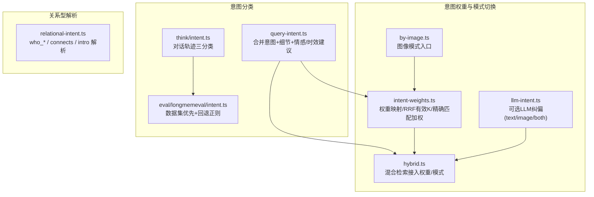
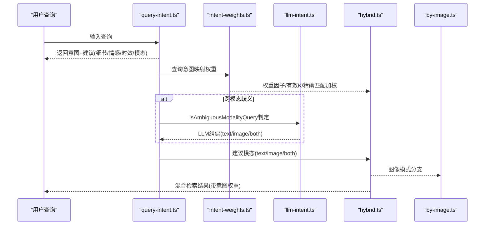
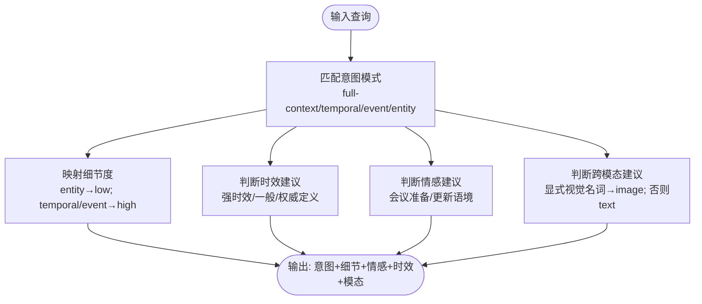
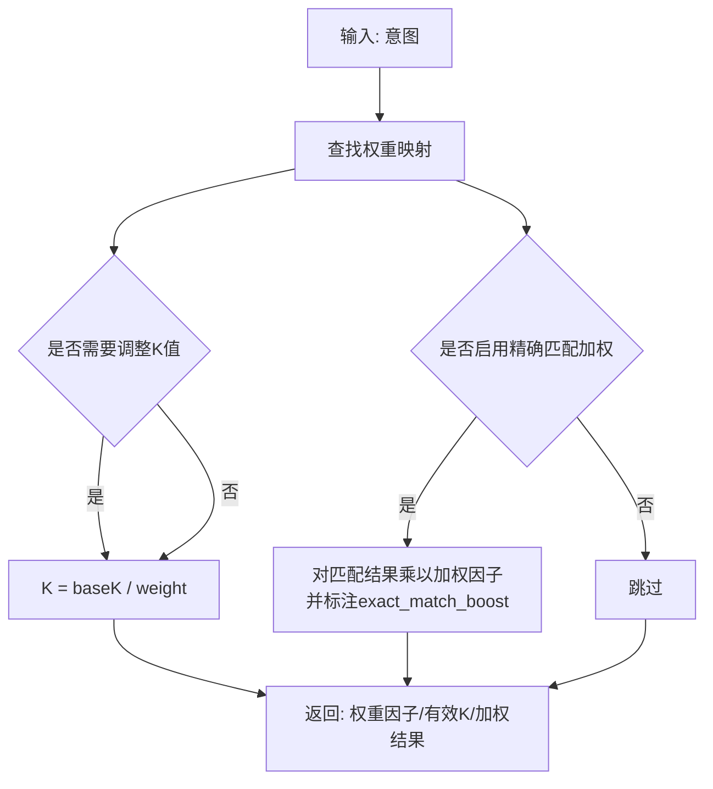
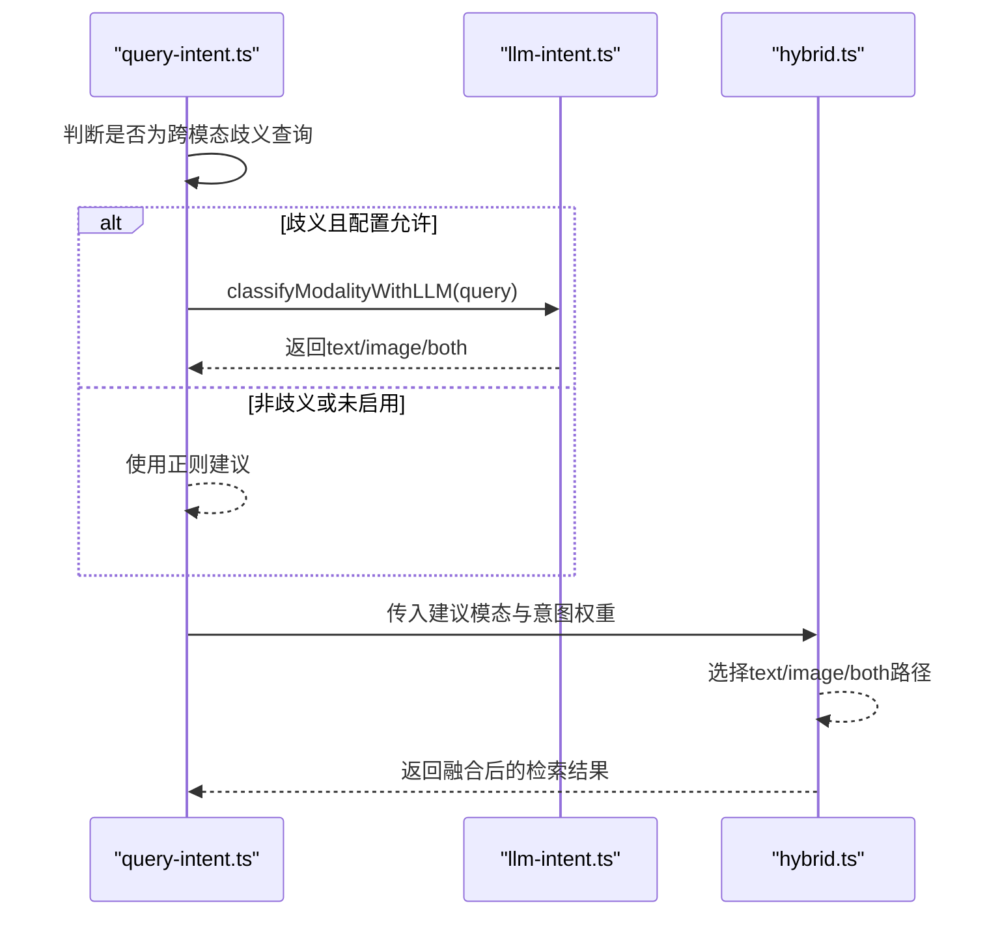
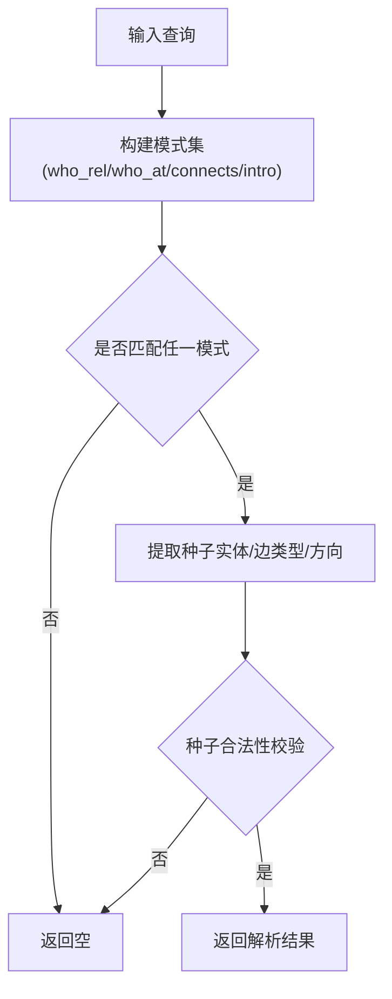
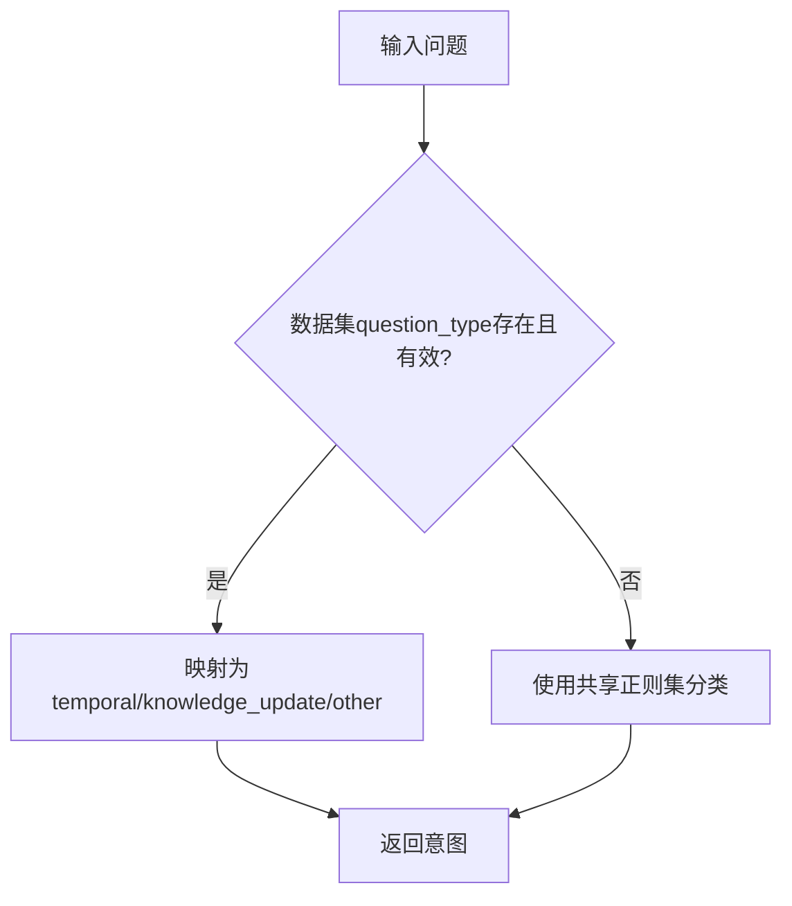
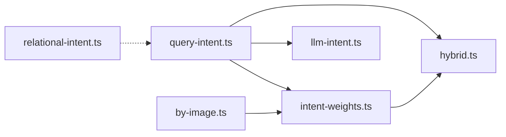

# 查询意图识别

<cite>
**本文引用的文件**
- [src/core/search/query-intent.ts](file://src/core/search/query-intent.ts)
- [src/core/search/intent-weights.ts](file://src/core/search/intent-weights.ts)
- [src/core/search/llm-intent.ts](file://src/core/search/llm-intent.ts)
- [src/core/search/relational-intent.ts](file://src/core/search/relational-intent.ts)
- [src/core/think/intent.ts](file://src/core/think/intent.ts)
- [src/eval/longmemeval/intent.ts](file://src/eval/longmemeval/intent.ts)
- [test/query-intent.test.ts](file://test/query-intent.test.ts)
- [test/intent-weights.test.ts](file://test/intent-weights.test.ts)
- [test/llm-intent-escalation.test.ts](file://test/llm-intent-escalation.test.ts)
- [test/longmemeval-intent.test.ts](file://test/longmemeval-intent.test.ts)
- [test/relational-intent.test.ts](file://test/relational-intent.test.ts)
- [test/think-intent.test.ts](file://test/think-intent.test.ts)
- [test/query-intent-legacy.test.ts](file://test/query-intent-legacy.test.ts)
- [src/core/search/hybrid.ts](file://src/core/search/hybrid.ts)
- [src/core/search/by-image.ts](file://src/core/search/by-image.ts)
- [src/commands/search.ts](file://src/commands/search.ts)
- [src/core/config.ts](file://src/core/config.ts)
- [docs/architecture/KEY_FILES.md](file://docs/architecture/KEY_FILES.md)
- [docs/architecture/thin-client.md](file://docs/architecture/thin-client.md)
</cite>

## 目录
1. [引言](#引言)
2. [项目结构](#项目结构)
3. [核心组件](#核心组件)
4. [架构总览](#架构总览)
5. [详细组件分析](#详细组件分析)
6. [依赖关系分析](#依赖关系分析)
7. [性能考量](#性能考量)
8. [故障排查指南](#故障排查指南)
9. [结论](#结论)
10. [附录](#附录)

## 引言
本文件面向“查询意图识别系统”的技术文档，聚焦于基于规则与轻量模型的意图分类与模式切换机制。系统通过多轴意图分类（信息检索、推理问答、创作辅助等）为检索与路由提供默认权重与策略，并在跨模态场景中引入可选的LLM纠偏能力，确保在高歧义查询上保持稳健性。文档同时覆盖意图权重系统、模式切换机制、不同查询类型的处理策略与优化方法，并给出评估与错误分析建议。

## 项目结构
围绕查询意图识别的关键代码分布在以下模块：
- 查询意图分类：query-intent.ts（主分类器）、think/intent.ts（对话轨迹分类）、eval/longmemeval/intent.ts（评测数据集优先）
- 意图权重系统：intent-weights.ts（权重映射、RRF有效K计算、精确匹配加权）
- 跨模态与模式切换：llm-intent.ts（可选LLM纠偏）、hybrid.ts（混合检索管线接入权重与模式）
- 关系型查询解析：relational-intent.ts（关系型问题的种子实体与边类型解析）
- 测试与评估：各 test/*.ts 文件验证分类准确性与边界行为

图表来源
- [src/core/search/query-intent.ts:1-343](file://src/core/search/query-intent.ts#L1-L343)
- [src/core/search/intent-weights.ts:1-145](file://src/core/search/intent-weights.ts#L1-L145)
- [src/core/search/llm-intent.ts:1-81](file://src/core/search/llm-intent.ts#L1-L81)
- [src/core/search/relational-intent.ts:1-244](file://src/core/search/relational-intent.ts#L1-L244)
- [src/core/search/hybrid.ts:1-1300](file://src/core/search/hybrid.ts#L1-L1300)
- [src/core/search/by-image.ts:1-120](file://src/core/search/by-image.ts#L1-L120)
- [src/core/think/intent.ts:1-75](file://src/core/think/intent.ts#L1-L75)
- [src/eval/longmemeval/intent.ts:1-55](file://src/eval/longmemeval/intent.ts#L1-L55)

章节来源
- [src/core/search/query-intent.ts:1-343](file://src/core/search/query-intent.ts#L1-L343)
- [src/core/search/intent-weights.ts:1-145](file://src/core/search/intent-weights.ts#L1-L145)
- [src/core/search/llm-intent.ts:1-81](file://src/core/search/llm-intent.ts#L1-L81)
- [src/core/search/relational-intent.ts:1-244](file://src/core/search/relational-intent.ts#L1-L244)
- [src/core/search/hybrid.ts:1-1300](file://src/core/search/hybrid.ts#L1-L1300)
- [src/core/search/by-image.ts:1-120](file://src/core/search/by-image.ts#L1-L120)
- [src/core/think/intent.ts:1-75](file://src/core/think/intent.ts#L1-L75)
- [src/eval/longmemeval/intent.ts:1-55](file://src/eval/longmemeval/intent.ts#L1-L55)

## 核心组件
- 查询意图分类器（query-intent.ts）
  - 输出四类意图：实体(entity)、时间(temporal)、事件(event)、通用(general)，并给出建议的细节度、情感权重、时效权重与跨模态建议。
  - 支持显式时间边界覆盖“权威定义”模式，保证“谁是X今天”这类查询偏向时效。
- 意图权重系统（intent-weights.ts）
  - 将意图映射到RRF融合权重、推荐时效强度与精确匹配加权因子；默认保守调整（最大1.25倍），避免翻转排序。
  - 提供有效RRF K计算与精确匹配加权应用函数，支持结果重排前的微调。
- 跨模态与模式切换（llm-intent.ts + hybrid.ts）
  - 在正则无法明确区分时，通过可选LLM纠偏将查询归类为text/image/both，成本低且失败即回退。
  - 混合检索管线在权重阶段与模式分支处接入意图权重与LLM纠偏结果。
- 关系型查询解析（relational-intent.ts）
  - 从自然语言中解析出关系型问题的种子实体、边类型与遍历方向，支持schema-pack扩展。
- 对话轨迹意图（think/intent.ts + eval/longmemeval/intent.ts）
  - 对话场景下将问题分为temporal、knowledge_update、other三类，知识更新优先级高于时间类；评测版优先使用数据集标签，否则回退到共享正则库。

章节来源
- [src/core/search/query-intent.ts:248-287](file://src/core/search/query-intent.ts#L248-L287)
- [src/core/search/intent-weights.ts:46-96](file://src/core/search/intent-weights.ts#L46-L96)
- [src/core/search/llm-intent.ts:37-81](file://src/core/search/llm-intent.ts#L37-L81)
- [src/core/search/relational-intent.ts:36-47](file://src/core/search/relational-intent.ts#L36-L47)
- [src/core/think/intent.ts:69-74](file://src/core/think/intent.ts#L69-L74)
- [src/eval/longmemeval/intent.ts:29-55](file://src/eval/longmemeval/intent.ts#L29-L55)

## 架构总览
意图识别与路由的整体流程如下：

图表来源
- [src/core/search/query-intent.ts:248-314](file://src/core/search/query-intent.ts#L248-L314)
- [src/core/search/intent-weights.ts:94-144](file://src/core/search/intent-weights.ts#L94-L144)
- [src/core/search/llm-intent.ts:37-81](file://src/core/search/llm-intent.ts#L37-L81)
- [src/core/search/hybrid.ts:800-960](file://src/core/search/hybrid.ts#L800-L960)
- [src/core/search/by-image.ts:1-120](file://src/core/search/by-image.ts#L1-L120)

## 详细组件分析

### 组件A：查询意图分类器（query-intent.ts）
- 多轴信号
  - 意图轴：full-context/temporal > temporal > event > entity > general（v0.29.0优先级）
  - 细节度：实体→低；时间/事件→高；通用→未定义
  - 情感轴：salience（会议准备、更新语境等触发）
  - 时效轴：强时效(today/right now) > 一般时效 > 权威定义(off)
  - 跨模态轴：显式视觉名词触发image；默认text
- 决策规则
  - 显式时间边界覆盖权威定义模式；salience与recency独立
  - 跨模态仅在显式视觉名词出现时触发，避免误判
- 兼容性
  - 保留旧版意图与自动细节检测接口，向后兼容

图表来源
- [src/core/search/query-intent.ts:248-314](file://src/core/search/query-intent.ts#L248-L314)

章节来源
- [src/core/search/query-intent.ts:248-343](file://src/core/search/query-intent.ts#L248-L343)
- [test/query-intent.test.ts:15-158](file://test/query-intent.test.ts#L15-L158)
- [test/query-intent-legacy.test.ts:104-163](file://test/query-intent-legacy.test.ts#L104-L163)

### 组件B：意图权重系统（intent-weights.ts）
- 权重映射
  - 实体：关键词权重提升、精确匹配加权、不改变时效建议
  - 时间：不改变关键词/向量权重、建议开启时效
  - 事件：关键词权重提升、轻微向量权重下调、建议开启时效、精确匹配适度加权
  - 通用：默认无调整
- RRF有效K
  - 依据权重反比降低K值，使高权重列表在顶部排名获得更强贡献
- 精确匹配加权
  - 对slug或title完全匹配的结果进行分数乘法修正，并标注来源以便解释输出

图表来源
- [src/core/search/intent-weights.ts:94-144](file://src/core/search/intent-weights.ts#L94-L144)

章节来源
- [src/core/search/intent-weights.ts:46-144](file://src/core/search/intent-weights.ts#L46-L144)
- [test/intent-weights.test.ts:35-121](file://test/intent-weights.test.ts#L35-L121)

### 组件C：跨模态与模式切换（llm-intent.ts + hybrid.ts）
- 可选LLM纠偏
  - 仅在正则无法明确区分且满足启发式条件时触发，Haiku模型、1秒超时、失败即回退
  - 输出单字(text/image/both)，容忍大小写与尾部标点
- 混合检索接入
  - 在嵌入与融合阶段接入意图权重；跨模态分支根据建议模态选择文本/图像/并行双通道
  - 配置项search.cross_modal.llm_intent控制是否启用纠偏

图表来源
- [src/core/search/llm-intent.ts:37-81](file://src/core/search/llm-intent.ts#L37-L81)
- [src/core/search/query-intent.ts:280-314](file://src/core/search/query-intent.ts#L280-L314)
- [src/core/search/hybrid.ts:800-960](file://src/core/search/hybrid.ts#L800-L960)

章节来源
- [src/core/search/llm-intent.ts:1-81](file://src/core/search/llm-intent.ts#L1-L81)
- [src/core/search/query-intent.ts:280-314](file://src/core/search/query-intent.ts#L280-L314)
- [src/core/search/hybrid.ts:800-960](file://src/core/search/hybrid.ts#L800-L960)
- [test/llm-intent-escalation.test.ts:1-200](file://test/llm-intent-escalation.test.ts#L1-L200)

### 组件D：关系型查询解析（relational-intent.ts）
- 四类范式
  - who_rel：谁对某实体做了某动作（如invested in、founded等）
  - who_at：谁在某组织从事某职责
  - connects：连接两个实体的关系
  - intro：介绍/关联某人
- 精度优先
  - 种子实体必须可解析且非代词/停用词；邻接要求严格，避免误匹配
  - 默认词汇库与schema-pack扩展，所有边类型均受已知集合约束

图表来源
- [src/core/search/relational-intent.ts:116-243](file://src/core/search/relational-intent.ts#L116-L243)

章节来源
- [src/core/search/relational-intent.ts:36-244](file://src/core/search/relational-intent.ts#L36-L244)
- [test/relational-intent.test.ts:17-137](file://test/relational-intent.test.ts#L17-L137)

### 组件E：对话轨迹意图（think/intent.ts + eval/longmemeval/intent.ts）
- think/intent.ts
  - 三分类：temporal、knowledge_update、other；知识更新优先级更高
- eval/longmemeval/intent.ts
  - 优先采用数据集question_type字段，缺失或未知时回退到共享正则集
  - 与think正则共享底层模式，避免漂移

图表来源
- [src/core/think/intent.ts:69-74](file://src/core/think/intent.ts#L69-L74)
- [src/eval/longmemeval/intent.ts:29-55](file://src/eval/longmemeval/intent.ts#L29-L55)

章节来源
- [src/core/think/intent.ts:1-75](file://src/core/think/intent.ts#L1-L75)
- [src/eval/longmemeval/intent.ts:1-55](file://src/eval/longmemeval/intent.ts#L1-L55)
- [test/think-intent.test.ts:1-71](file://test/think-intent.test.ts#L1-L71)
- [test/longmemeval-intent.test.ts:1-73](file://test/longmemeval-intent.test.ts#L1-L73)

## 依赖关系分析
- query-intent.ts 作为中枢，输出意图与建议给 intent-weights.ts 与 hybrid.ts
- intent-weights.ts 与 by-image.ts 在混合检索与图像模式中被调用
- llm-intent.ts 仅在跨模态歧义场景下被 hybrid.ts 条件调用
- relational-intent.ts 与 query-intent.ts 的关系在于“关系型问题”属于“通用”意图下的特定子类，解析后由关系召回链路处理

图表来源
- [src/core/search/query-intent.ts:248-314](file://src/core/search/query-intent.ts#L248-L314)
- [src/core/search/intent-weights.ts:94-144](file://src/core/search/intent-weights.ts#L94-L144)
- [src/core/search/llm-intent.ts:37-81](file://src/core/search/llm-intent.ts#L37-L81)
- [src/core/search/hybrid.ts:800-960](file://src/core/search/hybrid.ts#L800-L960)
- [src/core/search/by-image.ts:1-120](file://src/core/search/by-image.ts#L1-L120)
- [src/core/search/relational-intent.ts:222-243](file://src/core/search/relational-intent.ts#L222-L243)

章节来源
- [src/core/search/hybrid.ts:800-960](file://src/core/search/hybrid.ts#L800-L960)
- [src/core/search/by-image.ts:1-120](file://src/core/search/by-image.ts#L1-L120)

## 性能考量
- 正则分类纯同步、无外部依赖，延迟极低，适合高频查询的快速分流
- 意图权重系统采用纯数值运算，开销可忽略；精确匹配加权按结果集线性扫描
- LLM纠偏仅在极少数歧义查询触发，成本可控（约$0.0001/次），且失败即回退
- 混合检索的RRF有效K调整在融合阶段完成，避免重复排序

## 故障排查指南
- 分类不准确
  - 检查查询是否命中显式时间边界导致权威定义模式被覆盖
  - 确认跨模态正则是否过于保守，必要时通过配置启用LLM纠偏
- 权重未生效
  - 确认调用方未显式覆盖权重或模式
  - 检查精确匹配加权是否因大小写/空白/slug格式未命中
- LLM纠偏未触发
  - 确认search.cross_modal.llm_intent配置为true
  - 检查查询是否已被正则明确分类为text/image
- 结果解释
  - 使用--explain查看每个阶段的加权来源（如exact_match_boost）

章节来源
- [src/core/search/intent-weights.ts:124-144](file://src/core/search/intent-weights.ts#L124-L144)
- [src/core/search/llm-intent.ts:37-81](file://src/core/search/llm-intent.ts#L37-L81)
- [docs/architecture/KEY_FILES.md:15-30](file://docs/architecture/KEY_FILES.md#L15-L30)
- [docs/architecture/thin-client.md:47-52](file://docs/architecture/thin-client.md#L47-L52)

## 结论
该系统以规则为主、LLM为辅的意图识别方案，在保证低延迟与高鲁棒性的前提下，实现了对信息检索、推理问答与关系型查询的细粒度路由与权重调整。通过意图权重与跨模态纠偏，系统在常见查询上无需额外成本即可显著提升相关性；在歧义场景下，可选LLM纠偏进一步降低误判风险。建议持续以测试用例与评测数据集驱动迭代，逐步完善正则模式与权重映射。

## 附录

### 不同类型查询的处理策略与优化方法
- 实体查询（entity）
  - 策略：关键词权重提升 + 精确匹配加权；不强制时效
  - 优化：确保slug/title规范化，提高精确匹配命中率
- 时间查询（temporal）
  - 策略：建议开启时效；关键词/向量权重平衡
  - 优化：显式时间边界会覆盖权威定义模式，注意正则覆盖范围
- 事件查询（event）
  - 策略：关键词权重适度提升；建议开启时效；轻微向量权重下调
  - 优化：事件动词与命名实体组合更易被关键词捕获
- 通用查询（general）
  - 策略：默认权重；若为关系型问题，交由relational-intent解析
  - 优化：通过relational召回链路与关系边类型约束提升精度

章节来源
- [src/core/search/intent-weights.ts:64-96](file://src/core/search/intent-weights.ts#L64-L96)
- [src/core/search/query-intent.ts:248-343](file://src/core/search/query-intent.ts#L248-L343)
- [src/core/search/relational-intent.ts:222-243](file://src/core/search/relational-intent.ts#L222-L243)

### 模式切换机制与配置
- 跨模态建议来自query-intent.ts的显式视觉名词正则
- LLM纠偏仅在isAmbiguousModalityQuery返回true且配置开启时触发
- 混合检索在嵌入与融合阶段接入意图权重与模式建议

章节来源
- [src/core/search/query-intent.ts:280-314](file://src/core/search/query-intent.ts#L280-L314)
- [src/core/search/llm-intent.ts:37-81](file://src/core/search/llm-intent.ts#L37-L81)
- [src/core/search/hybrid.ts:800-960](file://src/core/search/hybrid.ts#L800-L960)
- [src/core/config.ts:845](file://src/core/config.ts#L845)
- [src/commands/search.ts:46](file://src/commands/search.ts#L46)

### 准确率统计与错误案例分析
- 准确率统计
  - 评测数据集（LongMemEval）通过question_type字段优先标注，缺失时回退至共享正则；两者共享底层正则，避免漂移
- 错误案例与改进建议
  - 歧义跨模态查询：启用search.cross_modal.llm_intent，结合isAmbiguousModalityQuery减少误判
  - 权重误用：确认调用方未显式覆盖权重；检查精确匹配加权的slug/title规范化
  - 正则覆盖不足：针对新场景补充正则模式，保持与think正则的一致性

章节来源
- [src/eval/longmemeval/intent.ts:29-55](file://src/eval/longmemeval/intent.ts#L29-L55)
- [src/core/think/intent.ts:23-60](file://src/core/think/intent.ts#L23-L60)
- [test/longmemeval-intent.test.ts:24-73](file://test/longmemeval-intent.test.ts#L24-L73)
- [test/think-intent.test.ts:10-71](file://test/think-intent.test.ts#L10-L71)

### 查询示例与意图分类结果展示
- 示例1：“show me photos of the offsite”
  - 分类：建议模态=image（显式视觉名词）
  - 处理：走图像搜索路径，跳过关键词扩展
- 示例2：“when did widget-co IPO”
  - 分类：意图=temporal；时效=off（无显式时间边界）
  - 处理：平衡权重，不强制时效
- 示例3：“who invested in acme”
  - 分类：意图=entity；细节=low；情感/时效=off
  - 处理：关键词权重提升 + 精确匹配加权
- 示例4：“catch me up on acme”
  - 分类：情感/时效=on
  - 处理：情感与时效信号共同提升相关结果

章节来源
- [src/core/search/query-intent.ts:183-211](file://src/core/search/query-intent.ts#L183-L211)
- [src/core/search/intent-weights.ts:64-96](file://src/core/search/intent-weights.ts#L64-L96)
- [test/query-intent.test.ts:55-85](file://test/query-intent.test.ts#L55-L85)
- [test/relational-intent.test.ts:17-70](file://test/relational-intent.test.ts#L17-L70)