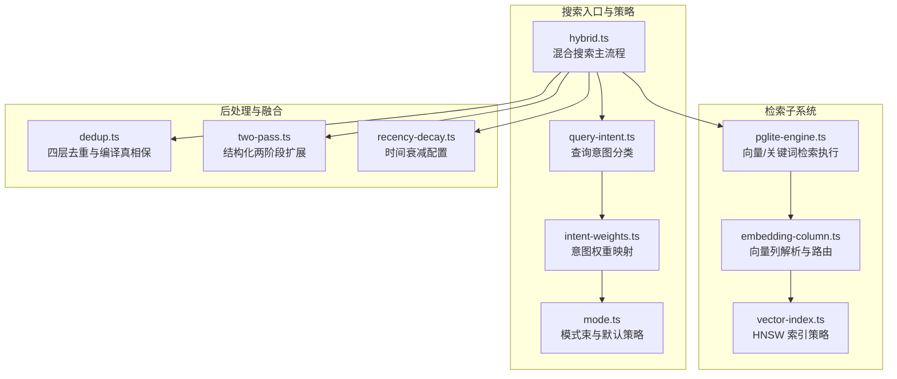
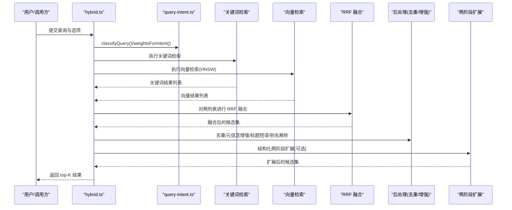
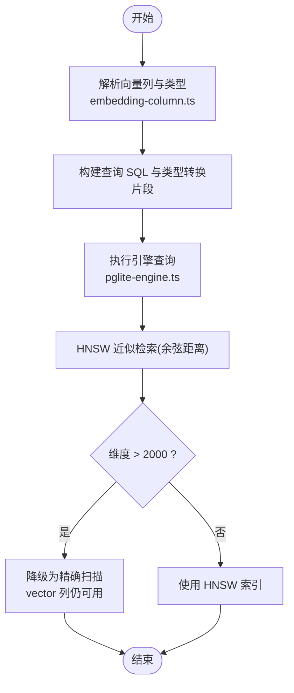
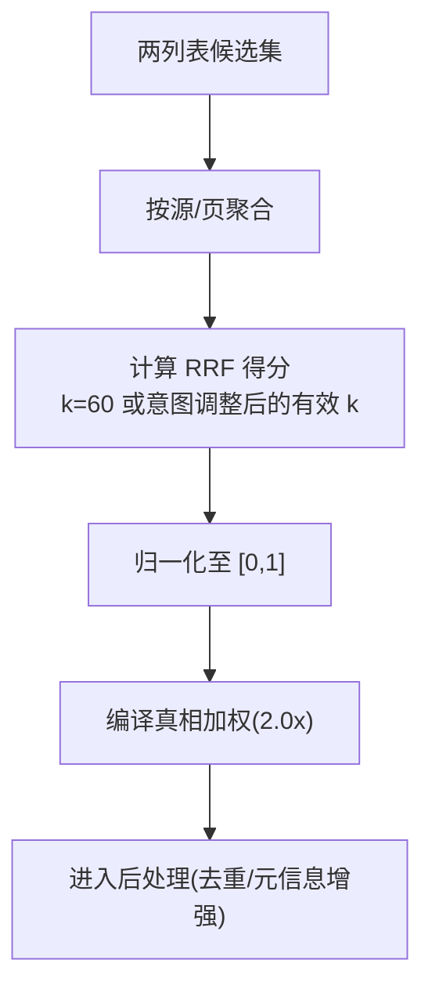
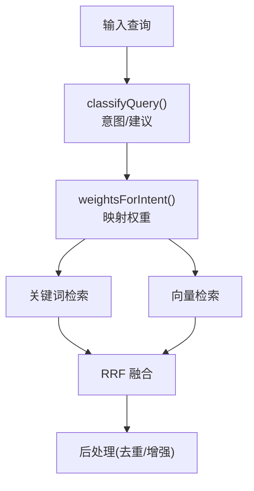
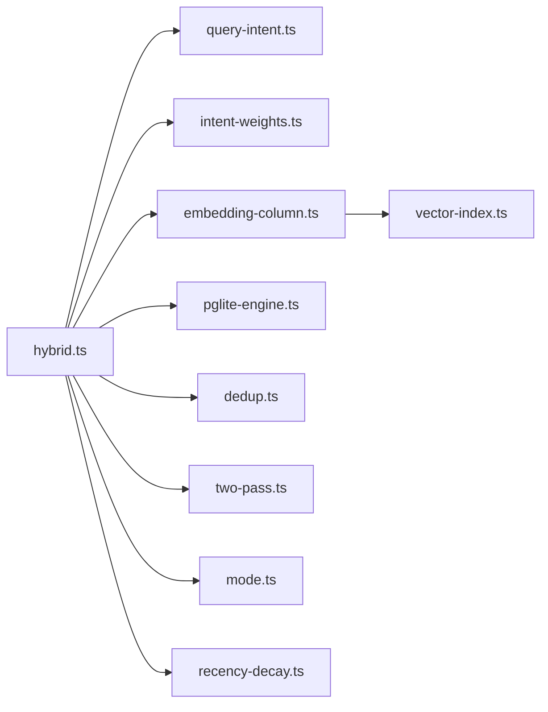

# 混合搜索算法

<cite>
**本文引用的文件**
- [hybrid.ts](file://src/core/search/hybrid.ts)
- [query-intent.ts](file://src/core/search/query-intent.ts)
- [intent-weights.ts](file://src/core/search/intent-weights.ts)
- [dedup.ts](file://src/core/search/dedup.ts)
- [two-pass.ts](file://src/core/search/two-pass.ts)
- [mode.ts](file://src/core/search/mode.ts)
- [embedding-column.ts](file://src/core/search/embedding-column.ts)
- [vector-index.ts](file://src/core/vector-index.ts)
- [pglite-engine.ts](file://src/core/pglite-engine.ts)
- [recency-decay.ts](file://src/core/search/recency-decay.ts)
- [hybrid-search.md](file://test/e2e/fixtures/concepts/hybrid-search.md)
- [embedding-column-postgres.test.ts](file://test/e2e/embedding-column-postgres.test.ts)
- [pglite-engine.test.ts](file://test/pglite-engine.test.ts)
- [rrf-source-key.test.ts](file://test/rrf-source-key.test.ts)
- [search.test.ts](file://test/search.test.ts)
- [query-intent.test.ts](file://test/query-intent.test.ts)
- [query-intent-legacy.test.ts](file://test/query-intent-legacy.test.ts)
- [operations.ts](file://src/core/operations.ts)
</cite>

## 目录
1. [简介](#简介)
2. [项目结构](#项目结构)
3. [核心组件](#核心组件)
4. [架构总览](#架构总览)
5. [详细组件分析](#详细组件分析)
6. [依赖关系分析](#依赖关系分析)
7. [性能考量](#性能考量)
8. [故障排查指南](#故障排查指南)
9. [结论](#结论)
10. [附录](#附录)

## 简介
本文件系统性阐述 GBrain 的混合搜索算法，覆盖以下关键能力与实现细节：
- 向量检索：基于 pgvector 的 HNSW 近似最近邻索引，支持多种向量类型与维度约束。
- 关键词检索：PostgreSQL tsquery + tsvector + ts_rank，提供语料级相关性排序。
- RRF 融合：Reciprocal Rank Fusion 在多列表间进行秩级融合，支持权重调节与源感知去重。
- 两阶段搜索：第一阶段快速过滤（关键词锚定 + 结构化扩展），第二阶段精确排序（向量重打分 + 多轴元信息增强）。
- 查询意图识别：零 LLM 分类器驱动的权重与策略选择，提升不同意图下的召回与排序质量。
- 参数配置与优化：模式束（mode bundles）、意图权重、去重策略、两阶段扩展、重排器等。

## 项目结构
围绕混合搜索的核心模块分布如下：
- 搜索主流程与融合：src/core/search/hybrid.ts
- 查询意图与权重：src/core/search/query-intent.ts、src/core/search/intent-weights.ts
- 去重与后处理：src/core/search/dedup.ts、src/core/search/two-pass.ts
- 模式束与默认策略：src/core/search/mode.ts
- 向量列解析与引擎路由：src/core/search/embedding-column.ts、src/core/vector-index.ts、src/core/pglite-engine.ts
- 时间衰减与元信息增强：src/core/search/recency-decay.ts
- 元数据与端到端概念说明：test/e2e/fixtures/concepts/hybrid-search.md
- 行为验证与回归测试：多个 test/*.ts 文件

图表来源
- [hybrid.ts](file://src/core/search/hybrid.ts)
- [query-intent.ts](file://src/core/search/query-intent.ts)
- [intent-weights.ts](file://src/core/search/intent-weights.ts)
- [mode.ts](file://src/core/search/mode.ts)
- [pglite-engine.ts](file://src/core/pglite-engine.ts)
- [embedding-column.ts](file://src/core/search/embedding-column.ts)
- [vector-index.ts](file://src/core/vector-index.ts)
- [dedup.ts](file://src/core/search/dedup.ts)
- [two-pass.ts](file://src/core/search/two-pass.ts)
- [recency-decay.ts](file://src/core/search/recency-decay.ts)

章节来源
- [hybrid.ts](file://src/core/search/hybrid.ts)
- [pglite-engine.ts](file://src/core/pglite-engine.ts)
- [embedding-column.ts](file://src/core/search/embedding-column.ts)
- [vector-index.ts](file://src/core/vector-index.ts)
- [dedup.ts](file://src/core/search/dedup.ts)
- [two-pass.ts](file://src/core/search/two-pass.ts)
- [mode.ts](file://src/core/search/mode.ts)
- [query-intent.ts](file://src/core/search/query-intent.ts)
- [intent-weights.ts](file://src/core/search/intent-weights.ts)
- [recency-decay.ts](file://src/core/search/recency-decay.ts)

## 核心组件
- 混合搜索主流程（RRF 融合、后处理、两阶段扩展）
  - 关键点：keyword + vector 双路检索 → RRF 融合 → 归一化与多轴增强 → 两阶段扩展 → 去重与编译真相保
  - 参考路径：[hybrid.ts](file://src/core/search/hybrid.ts)
- 查询意图识别与权重映射
  - 关键点：实体/时间/事件/一般 四类意图；对 keywordWeight、vectorWeight、建议 recency、精确匹配加权进行微调
  - 参考路径：[query-intent.ts](file://src/core/search/query-intent.ts)、[intent-weights.ts](file://src/core/search/intent-weights.ts)
- 向量检索与索引
  - 关键点：HNSW 索引（cosine 距离）、半精度向量支持、跨模态列路由、大维度降级为精确扫描
  - 参考路径：[vector-index.ts](file://src/core/vector-index.ts)、[embedding-column.ts](file://src/core/search/embedding-column.ts)、[pglite-engine.ts](file://src/core/pglite-engine.ts)
- 关键词检索
  - 关键点：tsquery + tsvector + ts_rank；CJK 支持与命中计数；大文本场景下 bigram 排序
  - 参考路径：[pglite-engine.test.ts](file://test/pglite-engine.test.ts)
- 去重与后处理
  - 关键点：按源/文本相似度/类型/页上限四层去重；保证每页至少一个编译真相；标题短语加权
  - 参考路径：[dedup.ts](file://src/core/search/dedup.ts)
- 两阶段扩展（结构化邻居）
  - 关键点：从锚点出发最多 2 跳，按 hop 衰减合并邻居；可结合符号名限定
  - 参考路径：[two-pass.ts](file://src/core/search/two-pass.ts)
- 模式束与默认策略
  - 关键点：conservative/balanced/tokenmax 三档模式；缓存、意图加权、扩展、限制、重排器、图信号、自动截断、关系检索等
  - 参考路径：[mode.ts](file://src/core/search/mode.ts)
- 时间衰减与元信息增强
  - 关键点：按前缀的超几何衰减系数；回链、显著度、时效、标题短语、别名解析等后处理阶段
  - 参考路径：[recency-decay.ts](file://src/core/search/recency-decay.ts)、[hybrid.ts](file://src/core/search/hybrid.ts)

章节来源
- [hybrid.ts](file://src/core/search/hybrid.ts)
- [query-intent.ts](file://src/core/search/query-intent.ts)
- [intent-weights.ts](file://src/core/search/intent-weights.ts)
- [vector-index.ts](file://src/core/vector-index.ts)
- [embedding-column.ts](file://src/core/search/embedding-column.ts)
- [pglite-engine.ts](file://src/core/pglite-engine.ts)
- [dedup.ts](file://src/core/search/dedup.ts)
- [two-pass.ts](file://src/core/search/two-pass.ts)
- [mode.ts](file://src/core/search/mode.ts)
- [recency-decay.ts](file://src/core/search/recency-decay.ts)

## 架构总览
混合搜索以“意图驱动 + 模式束”为核心，形成“双检索 → RRF 融合 → 多轴增强 → 两阶段扩展 → 去重”的流水线。向量检索通过 HNSW 近似加速，关键词检索提供强命名实体召回，意图分类在不改变调用者显式选项的前提下提供温和权重偏置，最终由去重与后处理确保结果多样性与代表性。

图表来源
- [hybrid.ts](file://src/core/search/hybrid.ts)
- [query-intent.ts](file://src/core/search/query-intent.ts)
- [pglite-engine.ts](file://src/core/pglite-engine.ts)
- [dedup.ts](file://src/core/search/dedup.ts)
- [two-pass.ts](file://src/core/search/two-pass.ts)

## 详细组件分析

### 向量检索（HNSW on pgvector）
- HNSW 索引策略
  - 使用向量余弦距离索引，支持半精度向量（halfvec）与全精度向量（vector），最大维度限制为 2000；超过则降级为精确扫描并保留提示。
  - 参考路径：[vector-index.ts](file://src/core/vector-index.ts)
- 引擎路由与列解析
  - 通过解析配置与运行时参数，确定使用的向量列（如 embedding、embedding_image、embedding_multimodal），并生成安全的 SQL 片段与类型转换。
  - 参考路径：[embedding-column.ts](file://src/core/search/embedding-column.ts)
- 实际执行
  - 引擎在内部构建 HNSW 候选池，应用可见性、类型、时间范围、来源隔离等过滤，再计算余弦相似度作为原始分数。
  - 参考路径：[pglite-engine.ts](file://src/core/pglite-engine.ts)
- 端到端验证
  - 验证不同维度（含超过 2000 维）与不同向量类型（vector/halfvec）的兼容性与索引行为。
  - 参考路径：[embedding-column-postgres.test.ts](file://test/e2e/embedding-column-postgres.test.ts)

图表来源
- [vector-index.ts](file://src/core/vector-index.ts)
- [embedding-column.ts](file://src/core/search/embedding-column.ts)
- [pglite-engine.ts](file://src/core/pglite-engine.ts)

章节来源
- [vector-index.ts](file://src/core/vector-index.ts)
- [embedding-column.ts](file://src/core/search/embedding-column.ts)
- [pglite-engine.ts](file://src/core/pglite-engine.ts)
- [embedding-column-postgres.test.ts](file://test/e2e/embedding-column-postgres.test.ts)

### 关键词检索（BM25/ts_rank）
- 检索模型
  - 使用 PostgreSQL tsquery + tsvector + ts_rank，支持多语言与 CJK 字符串匹配。
  - 参考路径：[pglite-engine.test.ts](file://test/pglite-engine.test.ts)
- 大文本与命中计数
  - 通过 bigram 计数等策略提升命中页面的相对排序稳定性。
  - 参考路径：[pglite-engine.test.ts](file://test/pglite-engine.test.ts)

章节来源
- [pglite-engine.test.ts](file://test/pglite-engine.test.ts)

### RRF 融合与权重调整
- RRF 公式与参数
  - 对每个文档，其 RRF 得分为各列表贡献之和：sum(1 / (k + rank_i))。默认 k=60，可通过意图权重映射动态调整有效 k（更高权重对应更低有效 k，使该列表对顶部排名更强）。
  - 参考路径：[hybrid.ts](file://src/core/search/hybrid.ts)、[intent-weights.ts](file://src/core/search/intent-weights.ts)
- 源感知去重
  - RRF/去重键为 (source_id, slug, chunk_id)，避免联邦多源同名页面被错误折叠。
  - 参考路径：[rrf-source-key.test.ts](file://test/rrf-source-key.test.ts)
- 归一化与增强
  - 融合后对得分归一化至 [0,1] 区间，并对编译真相块施加 2.0 倍加权；随后进入后处理阶段。
  - 参考路径：[search.test.ts](file://test/search.test.ts)

图表来源
- [hybrid.ts](file://src/core/search/hybrid.ts)
- [intent-weights.ts](file://src/core/search/intent-weights.ts)
- [search.test.ts](file://test/search.test.ts)
- [rrf-source-key.test.ts](file://test/rrf-source-key.test.ts)

章节来源
- [hybrid.ts](file://src/core/search/hybrid.ts)
- [intent-weights.ts](file://src/core/search/intent-weights.ts)
- [search.test.ts](file://test/search.test.ts)
- [rrf-source-key.test.ts](file://test/rrf-source-key.test.ts)

### 两阶段搜索流程
- 第一阶段：快速过滤
  - 关键词锚定 + 可选的结构化两阶段扩展（从锚点出发最多 2 跳，邻居按 hop 衰减合并）。此阶段侧重召回与覆盖面。
  - 参考路径：[two-pass.ts](file://src/core/search/two-pass.ts)
- 第二阶段：精确排序
  - 向量重打分（融合 RRF 与余弦相似度）、多轴元信息增强（回链、显著度、时效、标题短语、别名解析）、去重与编译真相保。
  - 参考路径：[hybrid.ts](file://src/core/search/hybrid.ts)、[dedup.ts](file://src/core/search/dedup.ts)

章节来源
- [two-pass.ts](file://src/core/search/two-pass.ts)
- [hybrid.ts](file://src/core/search/hybrid.ts)
- [dedup.ts](file://src/core/search/dedup.ts)

### 查询意图识别与策略选择
- 意图分类
  - 四类意图：entity/temporal/event/general；同时给出建议的 detail/salience/recency/modality。
  - 参考路径：[query-intent.ts](file://src/core/search/query-intent.ts)、[query-intent.test.ts](file://test/query-intent.test.ts)、[query-intent-legacy.test.ts](file://test/query-intent-legacy.test.ts)
- 权重映射
  - 不同意图对 keywordWeight/vectorWeight、建议 recency、精确匹配加权进行温和调整，不覆盖调用者显式选项。
  - 参考路径：[intent-weights.ts](file://src/core/search/intent-weights.ts)
- 模式束联动
  - 模式束决定是否启用意图权重、扩展、重排器、图信号、自动截断、关系检索等，形成一致的行为基线。
  - 参考路径：[mode.ts](file://src/core/search/mode.ts)

图表来源
- [query-intent.ts](file://src/core/search/query-intent.ts)
- [intent-weights.ts](file://src/core/search/intent-weights.ts)
- [hybrid.ts](file://src/core/search/hybrid.ts)

章节来源
- [query-intent.ts](file://src/core/search/query-intent.ts)
- [query-intent.test.ts](file://test/query-intent.test.ts)
- [query-intent-legacy.test.ts](file://test/query-intent-legacy.test.ts)
- [intent-weights.ts](file://src/core/search/intent-weights.ts)
- [mode.ts](file://src/core/search/mode.ts)

### 去重与后处理
- 四层去重
  - 按源：每页保留最高分前若干块；按文本相似度（Jaccard）去除高度重复；按类型比例限制；按页上限控制每页块数。
  - 参考路径：[dedup.ts](file://src/core/search/dedup.ts)
- 编译真相保
  - 若某页无编译真相块，则从去重前集合中挑选最高分编译真相块替换最低分块，确保权威事实呈现。
  - 参考路径：[dedup.ts](file://src/core/search/dedup.ts)
- 标题短语加权与别名解析
  - 标题包含查询短语时给予加权；别名解析阶段对命中或注入的页面施加额外加权。
  - 参考路径：[hybrid.ts](file://src/core/search/hybrid.ts)

章节来源
- [dedup.ts](file://src/core/search/dedup.ts)
- [hybrid.ts](file://src/core/search/hybrid.ts)

### 时间衰减与元信息增强
- 时间衰减
  - 按 slug 前缀定义超几何衰减系数与半衰期，支持环境变量与配置文件覆盖，默认前缀覆盖常见内容域。
  - 参考路径：[recency-decay.ts](file://src/core/search/recency-decay.ts)
- 元信息增强
  - 回链、显著度（情感权重+话题热度）、时效、标题短语、别名解析等阶段，均受“地板阈值门”保护，避免弱候选通过元信息堆叠跃迁。
  - 参考路径：[hybrid.ts](file://src/core/search/hybrid.ts)

章节来源
- [recency-decay.ts](file://src/core/search/recency-decay.ts)
- [hybrid.ts](file://src/core/search/hybrid.ts)

## 依赖关系分析
- 模块耦合
  - hybrid.ts 是中枢，依赖 query-intent.ts、intent-weights.ts、embedding-column.ts、pglite-engine.ts、dedup.ts、two-pass.ts、mode.ts、recency-decay.ts。
  - vector-index.ts 与 embedding-column.ts 为向量检索提供索引策略与列解析。
- 外部依赖
  - PostgreSQL/PostGIS（tsquery/tsvector）、pgvector（HNSW 索引与向量类型）。
  - 可选：重排器（cross-encoder）、关系检索图遍历、图信号等，均由模式束与开关控制。

图表来源
- [hybrid.ts](file://src/core/search/hybrid.ts)
- [query-intent.ts](file://src/core/search/query-intent.ts)
- [intent-weights.ts](file://src/core/search/intent-weights.ts)
- [embedding-column.ts](file://src/core/search/embedding-column.ts)
- [pglite-engine.ts](file://src/core/pglite-engine.ts)
- [dedup.ts](file://src/core/search/dedup.ts)
- [two-pass.ts](file://src/core/search/two-pass.ts)
- [mode.ts](file://src/core/search/mode.ts)
- [recency-decay.ts](file://src/core/search/recency-decay.ts)
- [vector-index.ts](file://src/core/vector-index.ts)

章节来源
- [hybrid.ts](file://src/core/search/hybrid.ts)
- [embedding-column.ts](file://src/core/search/embedding-column.ts)
- [vector-index.ts](file://src/core/vector-index.ts)
- [pglite-engine.ts](file://src/core/pglite-engine.ts)
- [dedup.ts](file://src/core/search/dedup.ts)
- [two-pass.ts](file://src/core/search/two-pass.ts)
- [mode.ts](file://src/core/search/mode.ts)
- [query-intent.ts](file://src/core/search/query-intent.ts)
- [intent-weights.ts](file://src/core/search/intent-weights.ts)
- [recency-decay.ts](file://src/core/search/recency-decay.ts)

## 性能考量
- 向量检索
  - HNSW 近似检索显著降低向量扫描成本；当维度超过 2000 时自动降级为精确扫描，避免索引不可用。
  - 参考路径：[vector-index.ts](file://src/core/vector-index.ts)
- 关键词检索
  - 利用 tsvector 索引与 ts_rank 排序，支持 CJK 与 bigram 计数，平衡召回与稳定性。
  - 参考路径：[pglite-engine.test.ts](file://test/pglite-engine.test.ts)
- RRF 与后处理
  - RRF 对不同列表权重进行秩级融合，避免直接归一化导致的不稳定；去重与编译真相保减少冗余输出。
  - 参考路径：[hybrid.ts](file://src/core/search/hybrid.ts)、[dedup.ts](file://src/core/search/dedup.ts)
- 模式束
  - 通过保守/均衡/极致三种模式束，在成本与效果之间折中；重排器、图信号、自动截断等可按需开启。
  - 参考路径：[mode.ts](file://src/core/search/mode.ts)

## 故障排查指南
- 向量列未注册/类型不匹配
  - 症状：抛出“向量列未注册”或“类型/维度无效”错误。
  - 排查：检查 embedding_columns 注册表、列名正则、类型与维度范围。
  - 参考路径：[embedding-column.ts](file://src/core/search/embedding-column.ts)
- HNSW 索引不可用
  - 症状：高维向量无法建立 HNSW 索引，系统降级为精确扫描。
  - 排查：确认维度不超过限制；必要时切换到半精度向量类型。
  - 参考路径：[vector-index.ts](file://src/core/vector-index.ts)
- RRF 结果异常
  - 症状：融合后排序不符合预期。
  - 排查：检查意图权重映射、k 值设置、编译真相加权、去重阈值。
  - 参考路径：[hybrid.ts](file://src/core/search/hybrid.ts)、[intent-weights.ts](file://src/core/search/intent-weights.ts)
- 多源联邦召回问题
  - 症状：相同 slug 的不同来源页面被错误折叠。
  - 排查：确认 RRF/去重键包含 source_id。
  - 参考路径：[rrf-source-key.test.ts](file://test/rrf-source-key.test.ts)
- 重排器/关系检索/图信号导致延迟
  - 症状：查询耗时增加。
  - 排查：根据模式束关闭相应功能或调整阈值。
  - 参考路径：[mode.ts](file://src/core/search/mode.ts)

章节来源
- [embedding-column.ts](file://src/core/search/embedding-column.ts)
- [vector-index.ts](file://src/core/vector-index.ts)
- [hybrid.ts](file://src/core/search/hybrid.ts)
- [intent-weights.ts](file://src/core/search/intent-weights.ts)
- [rrf-source-key.test.ts](file://test/rrf-source-key.test.ts)
- [mode.ts](file://src/core/search/mode.ts)

## 结论
GBrain 的混合搜索以意图驱动与模式束为基础，结合 HNSW 向量近似检索与 BM25 关键词检索，通过 RRF 秩级融合与多轴后处理，实现了高召回、高稳定性的检索体验。通过严格的源感知去重、编译真相保与结构化两阶段扩展，进一步提升了结果的代表性与可解释性。针对不同成本与效果目标，模式束提供了可配置的默认策略，便于在生产环境中灵活部署与演进。

## 附录

### 算法参数与配置清单
- RRF 默认参数
  - k 常量：60（可通过意图权重映射调整有效 k）
  - 编译真相加权：2.0x
  - 参考路径：[hybrid.ts](file://src/core/search/hybrid.ts)、[intent-weights.ts](file://src/core/search/intent-weights.ts)
- 向量列与索引
  - 列解析：embedding / embedding_image / embedding_multimodal
  - 类型：vector / halfvec；最大维度 2000（超过则降级）
  - 参考路径：[embedding-column.ts](file://src/core/search/embedding-column.ts)、[vector-index.ts](file://src/core/vector-index.ts)
- 去重策略
  - 层次：按源/文本相似度/类型比例/每页上限；保证每页至少一个编译真相块
  - 参考路径：[dedup.ts](file://src/core/search/dedup.ts)
- 两阶段扩展
  - 最大深度：2；每跳邻居上限：50；按 hop 衰减合并
  - 参考路径：[two-pass.ts](file://src/core/search/two-pass.ts)
- 模式束（节选）
  - conservative：低预算、低 reranker 成本、较低 limit
  - balanced：中等预算、启用 reranker、适度 limit
  - tokenmax：高预算、启用 reranker 与扩展、较高 limit
  - 参考路径：[mode.ts](file://src/core/search/mode.ts)

章节来源
- [hybrid.ts](file://src/core/search/hybrid.ts)
- [intent-weights.ts](file://src/core/search/intent-weights.ts)
- [embedding-column.ts](file://src/core/search/embedding-column.ts)
- [vector-index.ts](file://src/core/vector-index.ts)
- [dedup.ts](file://src/core/search/dedup.ts)
- [two-pass.ts](file://src/core/search/two-pass.ts)
- [mode.ts](file://src/core/search/mode.ts)

### 实际查询示例（概念性说明）
- 实体查询（如“谁是张三？”）
  - 建议：低 detail、off salience、off recency；keyword 权重略高，精确匹配加权生效
  - 参考路径：[query-intent.ts](file://src/core/search/query-intent.ts)、[intent-weights.ts](file://src/core/search/intent-weights.ts)
- 时间查询（如“上周发生了什么？”）
  - 建议：high detail、on recency、salience 可视情况开启
  - 参考路径：[query-intent.ts](file://src/core/search/query-intent.ts)、[recency-decay.ts](file://src/core/search/recency-decay.ts)
- 事件查询（如“公司完成融资”）
  - 建议：keyword 权重更高，recency 轻微倾斜
  - 参考路径：[query-intent.ts](file://src/core/search/query-intent.ts)、[intent-weights.ts](file://src/core/search/intent-weights.ts)

章节来源
- [query-intent.ts](file://src/core/search/query-intent.ts)
- [intent-weights.ts](file://src/core/search/intent-weights.ts)
- [recency-decay.ts](file://src/core/search/recency-decay.ts)