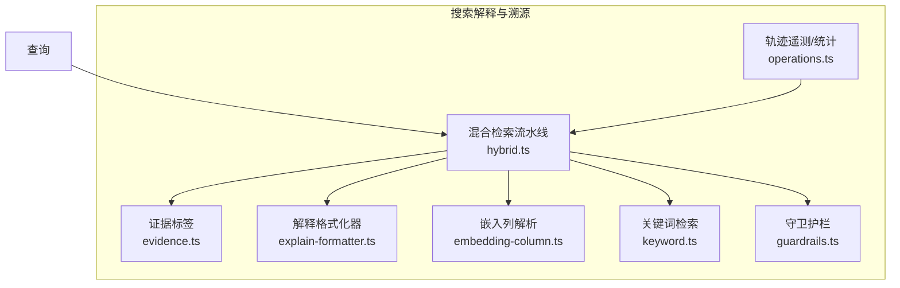
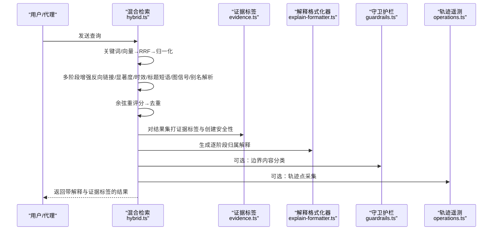
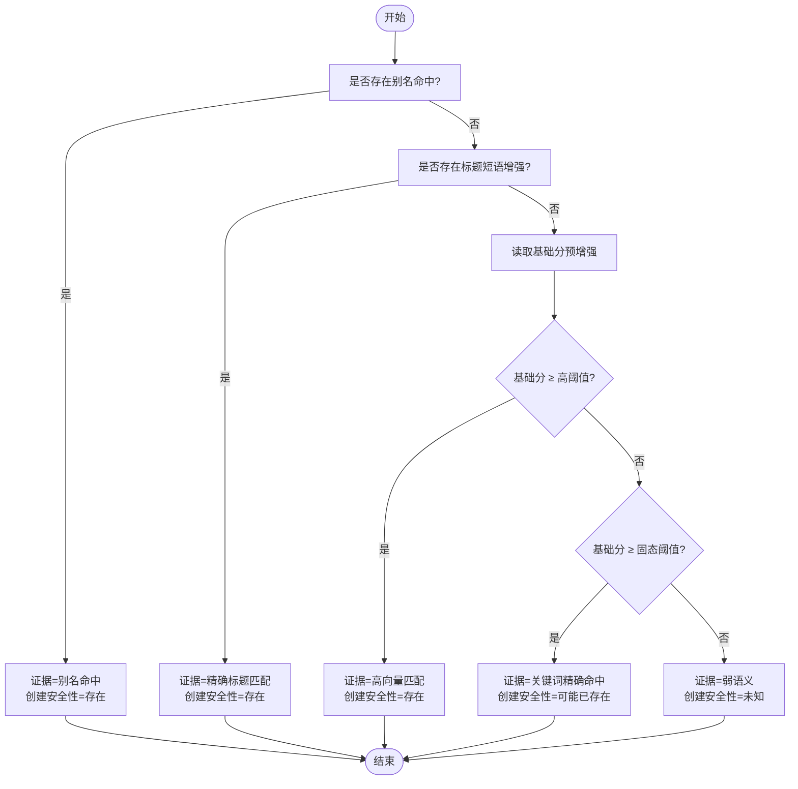
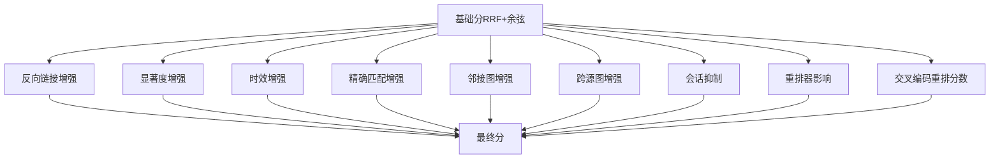
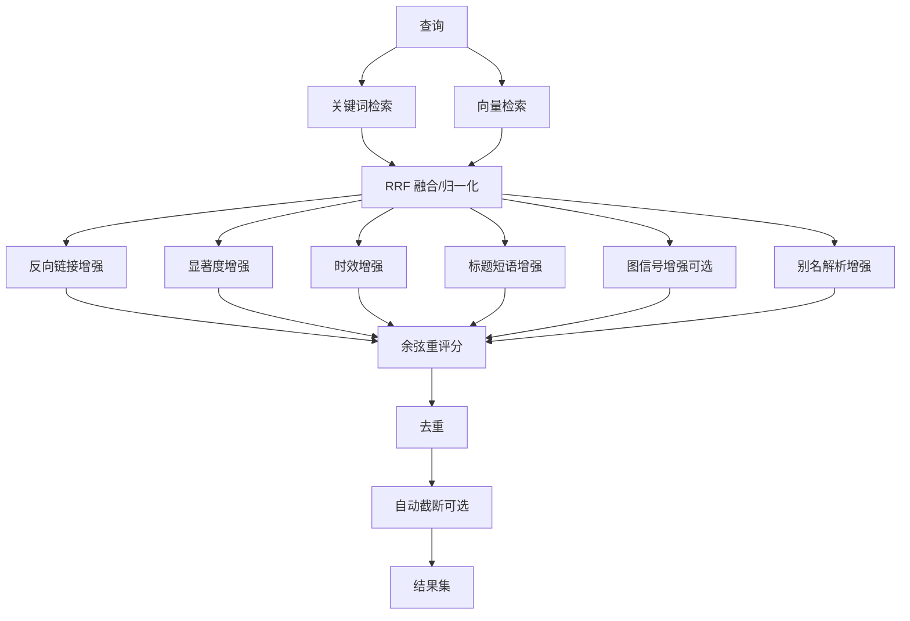
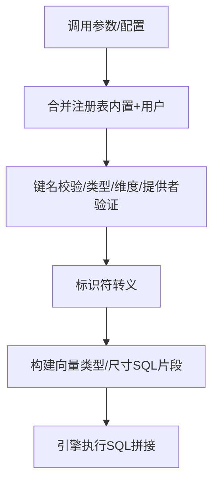
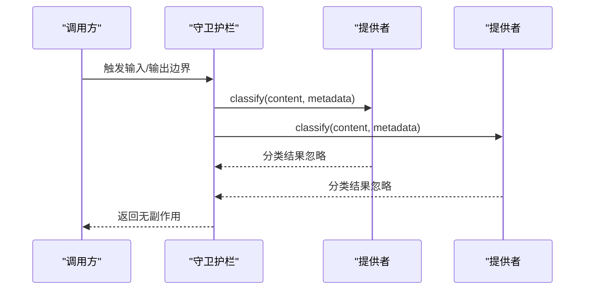
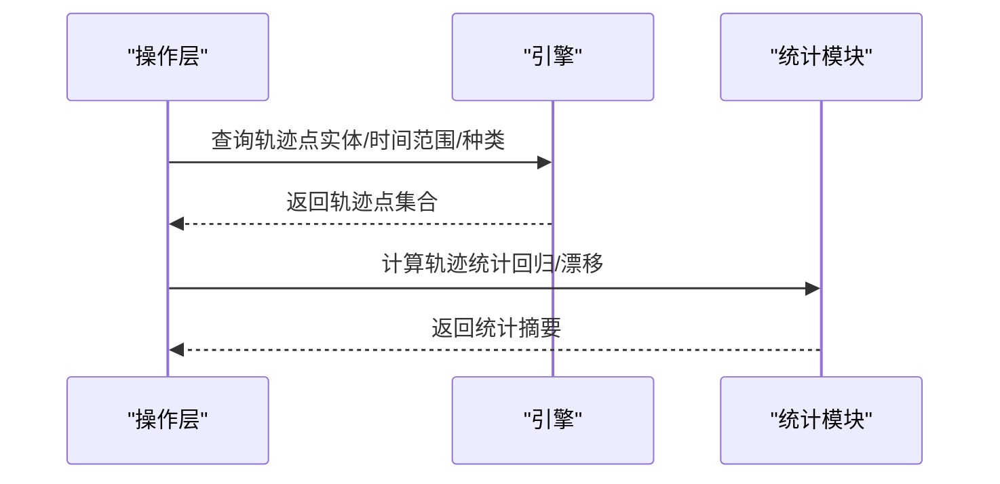
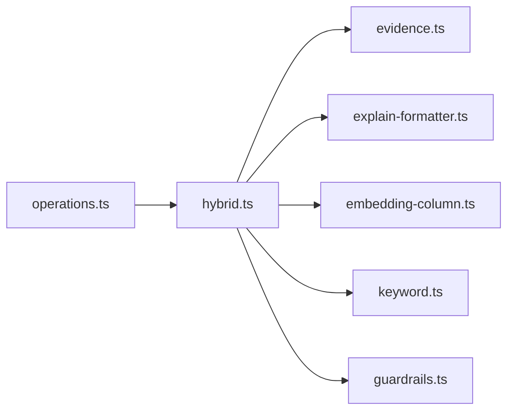

# 结果解释与溯源

<cite>
**本文引用的文件**
- [src/core/search/evidence.ts](file://src/core/search/evidence.ts)
- [test/search/evidence.test.ts](file://test/search/evidence.test.ts)
- [src/core/search/explain-formatter.ts](file://src/core/search/explain-formatter.ts)
- [src/core/search/hybrid.ts](file://src/core/search/hybrid.ts)
- [src/core/search/keyword.ts](file://src/core/search/keyword.ts)
- [src/core/search/embedding-column.ts](file://src/core/search/embedding-column.ts)
- [src/core/guardrails.ts](file://src/core/guardrails.ts)
- [src/core/operations.ts](file://src/core/operations.ts)
- [test/search/explain-formatter.test.ts](file://test/search/explain-formatter.test.ts)
- [test/regressions/v0_40_2_0-trajectory-backcompat.test.ts](file://test/regressions/v0_40_2_0-trajectory-backcompat.test.ts)
</cite>

## 目录
1. [简介](#简介)
2. [项目结构](#项目结构)
3. [核心组件](#核心组件)
4. [架构总览](#架构总览)
5. [详细组件分析](#详细组件分析)
6. [依赖关系分析](#依赖关系分析)
7. [性能考量](#性能考量)
8. [故障排查指南](#故障排查指南)
9. [结论](#结论)
10. [附录](#附录)

## 简介
本文件面向“搜索结果解释系统”的技术实现，聚焦以下目标：
- 证据标签生成机制：来源标注、相关性评分、上下文片段提取
- 安全性提示系统：帮助用户识别潜在的不准确或误导性信息
- 逐阶段归属追踪（逐级溯源）：让用户了解每个结果的生成过程
- 遥测数据收集与分析：轨迹统计与回归检测
- 结果解释示例与用户体验优化建议

该系统通过“证据标签 + 归属追踪 + 安全性提示 + 遥测”四维能力，提升检索结果的可解释性、可信度与可审计性。

## 项目结构
围绕搜索解释与溯源的关键模块如下：
- 搜索解释格式化器：将结果按阶段归属输出为人类可读的解释文本
- 证据标签与安全性提示：对每个结果打上证据类型与创建安全等级
- 混合检索流水线：关键词/向量融合、RRF、归一化、多阶段增强、重排与去重
- 嵌入列解析：统一向量列选择与提供者路由
- 守卫护栏（可选）：在边界处进行内容分类与观察
- 轨迹遥测：采集与统计搜索行为与质量指标

图表来源
- [src/core/search/hybrid.ts](file://src/core/search/hybrid.ts)
- [src/core/search/evidence.ts](file://src/core/search/evidence.ts)
- [src/core/search/explain-formatter.ts](file://src/core/search/explain-formatter.ts)
- [src/core/search/embedding-column.ts](file://src/core/search/embedding-column.ts)
- [src/core/search/keyword.ts](file://src/core/search/keyword.ts)
- [src/core/guardrails.ts](file://src/core/guardrails.ts)
- [src/core/operations.ts](file://src/core/operations.ts)

章节来源
- [src/core/search/hybrid.ts](file://src/core/search/hybrid.ts)
- [src/core/search/explain-formatter.ts](file://src/core/search/explain-formatter.ts)
- [src/core/search/evidence.ts](file://src/core/search/evidence.ts)
- [src/core/search/embedding-column.ts](file://src/core/search/embedding-column.ts)
- [src/core/search/keyword.ts](file://src/core/search/keyword.ts)
- [src/core/guardrails.ts](file://src/core/guardrails.ts)
- [src/core/operations.ts](file://src/core/operations.ts)

## 核心组件
- 证据标签与创建安全性
  - 证据类型：别名命中、精确标题匹配、高向量匹配、关键词精确命中、弱语义
  - 创建安全性：已存在、可能已存在、未知
  - 对每个结果在混合检索末尾一次性打标，确保代理与命令行解释一致
- 解释格式化器
  - 输出每条结果的“基础分（RRF+余弦）→各阶段增强→最终分”
  - 支持自动截断摘要、交叉编码重排分数展示
- 混合检索流水线
  - 关键词 + 向量 → RRF 融合 → 归一化 → 多阶段增强（反向链接/显著度/时效/标题短语/图信号/别名解析）→ 余弦重评分 → 去重
  - 提供可观测性回调（图信号元数据、得分分布）
- 嵌入列解析
  - 统一向量列选择、类型与维度校验、提供者路由，保证引擎纯 SQL 组装
- 守卫护栏
  - 在输入/输出边界对内容进行分类，失败开路，不影响主流程
- 轨迹遥测
  - 采集轨迹点并计算统计量，支持事件与指标混合回溯

章节来源
- [src/core/search/evidence.ts](file://src/core/search/evidence.ts)
- [src/core/search/explain-formatter.ts](file://src/core/search/explain-formatter.ts)
- [src/core/search/hybrid.ts](file://src/core/search/hybrid.ts)
- [src/core/search/embedding-column.ts](file://src/core/search/embedding-column.ts)
- [src/core/guardrails.ts](file://src/core/guardrails.ts)
- [src/core/operations.ts](file://src/core/operations.ts)

## 架构总览
下图展示了从查询到结果解释与溯源的关键路径，以及证据标签与安全性提示如何贯穿整个流程。

图表来源
- [src/core/search/hybrid.ts](file://src/core/search/hybrid.ts)
- [src/core/search/evidence.ts](file://src/core/search/evidence.ts)
- [src/core/search/explain-formatter.ts](file://src/core/search/explain-formatter.ts)
- [src/core/guardrails.ts](file://src/core/guardrails.ts)
- [src/core/operations.ts](file://src/core/operations.ts)

## 详细组件分析

### 证据标签与创建安全性
证据标签用于明确“为何该页面被匹配”，并据此给出“是否应创建新页面”的安全建议。其优先级与判定逻辑如下：
- 别名命中 > 精确标题匹配 > 高向量匹配（阈值之上） > 关键词精确命中（固态区间） > 弱语义
- 创建安全性映射：强证据（存在）、中证据（可能已存在）、弱证据（未知）

图表来源
- [src/core/search/evidence.ts](file://src/core/search/evidence.ts)

章节来源
- [src/core/search/evidence.ts](file://src/core/search/evidence.ts)
- [test/search/evidence.test.ts](file://test/search/evidence.test.ts)

### 逐阶段归属追踪（解释格式化器）
解释格式化器将“基础分（RRF+余弦）”与“各阶段增强因子/权重”可视化呈现，帮助用户理解排名变化来源。典型阶段包括：
- 基础分（RRF+余弦）
- 反向链接增强、显著度增强、时效增强
- 精确匹配增强、邻接图增强、跨源图增强
- 会话抑制、重排器增量/减量、交叉编码重排分数
- 自动截断摘要（当发生时）

图表来源
- [src/core/search/explain-formatter.ts](file://src/core/search/explain-formatter.ts)

章节来源
- [src/core/search/explain-formatter.ts](file://src/core/search/explain-formatter.ts)
- [test/search/explain-formatter.test.ts](file://test/search/explain-formatter.test.ts)

### 混合检索流水线与阶段增强
混合检索采用“关键词 + 向量”的融合策略，随后进行多阶段增强与重排：
- RRF 融合与归一化
- 反向链接增强（基于日志/图谱统计）
- 显著度增强（情感权重、话题热度等）
- 时效增强（按前缀半衰期衰减）
- 标题短语增强（避免弱语义被标题短语掩盖）
- 图信号增强（可选，作为第4阶段叠加）
- 别名解析增强（权威别名优先）
- 余弦重评分与去重
- 自动截断（Autocut）与可观测性回调

图表来源
- [src/core/search/hybrid.ts](file://src/core/search/hybrid.ts)
- [src/core/search/keyword.ts](file://src/core/search/keyword.ts)

章节来源
- [src/core/search/hybrid.ts](file://src/core/search/hybrid.ts)
- [src/core/search/keyword.ts](file://src/core/search/keyword.ts)

### 嵌入列解析与提供者路由
为确保向量检索的一致性与安全性，系统通过“嵌入列解析器”统一管理：
- 注册表合并（内置键 + 用户配置）
- 键名校验、类型与维度验证、提供者字符串解析
- SQL 标识符转义与向量类型/尺寸的 SQL 片段构建
- 缓存安全检查（仅默认列且模型/维度匹配时才使用缓存）

图表来源
- [src/core/search/embedding-column.ts](file://src/core/search/embedding-column.ts)

章节来源
- [src/core/search/embedding-column.ts](file://src/core/search/embedding-column.ts)

### 安全性提示系统（守卫护栏）
在输入/输出边界对内容进行分类，以辅助用户识别潜在风险：
- 可注册多个提供者，按需启用
- 失败开路：任一提供者异常不影响主流程
- 元数据透传：记录工具名、模型、来源等上下文

图表来源
- [src/core/guardrails.ts](file://src/core/guardrails.ts)

章节来源
- [src/core/guardrails.ts](file://src/core/guardrails.ts)

### 遥测数据收集与分析
系统支持轨迹点采集与统计，便于回归检测与稳定性评估：
- 采集指标与事件（含历史兼容）
- 计算轨迹统计（回归评分、漂移分数等）
- 在传输层剥离大二进制向量字段，降低带宽与序列化成本

图表来源
- [src/core/operations.ts](file://src/core/operations.ts)
- [test/regressions/v0_40_2_0-trajectory-backcompat.test.ts](file://test/regressions/v0_40_2_0-trajectory-backcompat.test.ts)

章节来源
- [src/core/operations.ts](file://src/core/operations.ts)
- [test/regressions/v0_40_2_0-trajectory-backcompat.test.ts](file://test/regressions/v0_40_2_0-trajectory-backcompat.test.ts)

## 依赖关系分析
- 证据标签依赖于混合检索结果中的基础分、标题增强标记、别名命中等字段
- 解释格式化器依赖于混合检索阶段对结果集的增强与归因字段
- 嵌入列解析器为向量检索提供统一的列描述与SQL片段
- 守卫护栏与混合检索解耦，仅在边界处运行
- 轨迹遥测由操作层驱动，统计模块独立计算

图表来源
- [src/core/search/hybrid.ts](file://src/core/search/hybrid.ts)
- [src/core/search/evidence.ts](file://src/core/search/evidence.ts)
- [src/core/search/explain-formatter.ts](file://src/core/search/explain-formatter.ts)
- [src/core/search/embedding-column.ts](file://src/core/search/embedding-column.ts)
- [src/core/search/keyword.ts](file://src/core/search/keyword.ts)
- [src/core/guardrails.ts](file://src/core/guardrails.ts)
- [src/core/operations.ts](file://src/core/operations.ts)

章节来源
- [src/core/search/hybrid.ts](file://src/core/search/hybrid.ts)
- [src/core/search/evidence.ts](file://src/core/search/evidence.ts)
- [src/core/search/explain-formatter.ts](file://src/core/search/explain-formatter.ts)
- [src/core/search/embedding-column.ts](file://src/core/search/embedding-column.ts)
- [src/core/search/keyword.ts](file://src/core/search/keyword.ts)
- [src/core/guardrails.ts](file://src/core/guardrails.ts)
- [src/core/operations.ts](file://src/core/operations.ts)

## 性能考量
- 增强阶段的数据库访问采用“一次性批量查询 + 内存映射”策略，减少往返次数
- 自动截断（Autocut）在重排后进行，避免对长尾结果的无效处理
- 嵌入列解析在边界完成，引擎保持纯 SQL 组装，利于缓存与复用
- 轨迹点在传输前剥离大二进制字段，降低网络与序列化开销
- 守卫护栏异步并行执行，失败开路，不影响主链路

## 故障排查指南
- 证据标签与创建安全性不符
  - 检查基础分与标题增强标记是否正确写入
  - 确认证据阈值与创建安全性映射逻辑
- 解释格式化器未显示增强项
  - 确认对应阶段是否应用了增强因子（如反向链接/显著度/时效等）
  - 检查是否存在“无增强应用”的分支
- 嵌入列解析报错
  - 核对列名是否符合标识符规范
  - 校验类型/维度/提供者配置是否有效
- 守卫护栏未生效
  - 确认是否已注册提供者
  - 检查内容是否为空或空白
- 轨迹统计异常
  - 确认轨迹点采集是否成功
  - 检查事件与指标混合场景下的兼容性

章节来源
- [src/core/search/evidence.ts](file://src/core/search/evidence.ts)
- [src/core/search/explain-formatter.ts](file://src/core/search/explain-formatter.ts)
- [src/core/search/embedding-column.ts](file://src/core/search/embedding-column.ts)
- [src/core/guardrails.ts](file://src/core/guardrails.ts)
- [src/core/operations.ts](file://src/core/operations.ts)

## 结论
本系统通过“证据标签 + 归属追踪 + 安全性提示 + 遥测统计”形成闭环，既提升了结果的可解释性与可信度，也为后续优化与审计提供了坚实基础。建议在生产环境中：
- 默认开启证据标签与解释格式化输出
- 在高风险场景启用守卫护栏
- 定期审查轨迹统计与回归趋势
- 将阈值与权重纳入A/B实验与回归监控

## 附录
- 结果解释示例（概念性说明）
  - 示例1：标题短语命中 + 反向链接增强 → 证据=精确标题匹配；创建安全性=存在
  - 示例2：关键词精确命中但无标题/别名增强 → 证据=关键词精确命中；创建安全性=可能已存在
  - 示例3：弱语义匹配 → 证据=弱语义；创建安全性=未知
- 用户体验优化建议
  - 在CLI中默认输出解释与证据标签
  - 提供“证据详情”交互式说明（点击展开）
  - 将“创建安全性=可能已存在”的结果置顶并加粗提示
  - 在Web界面中以颜色/图标区分证据强度
  - 提供“自动截断”说明，帮助用户理解截断原因与保留数量