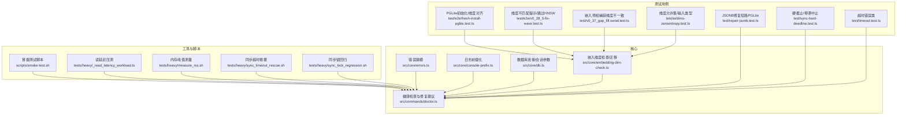
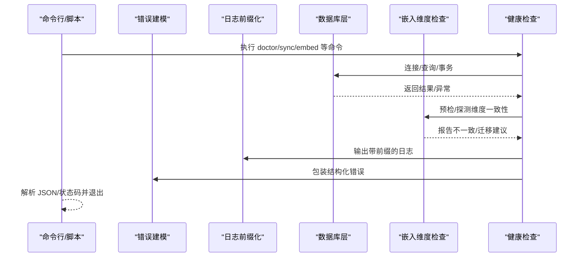
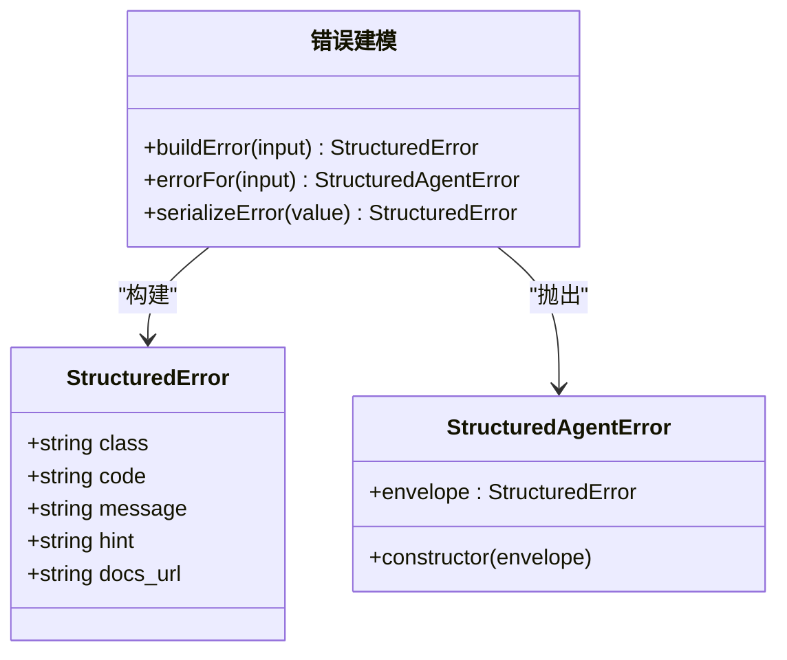
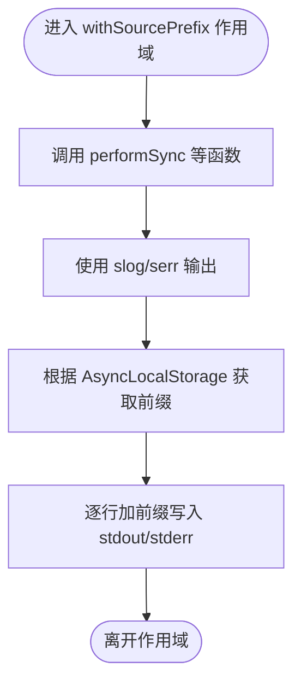
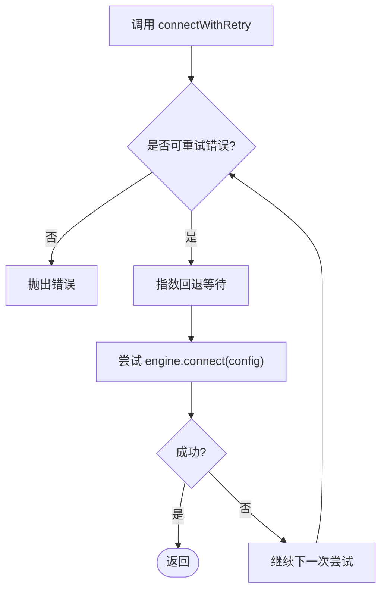
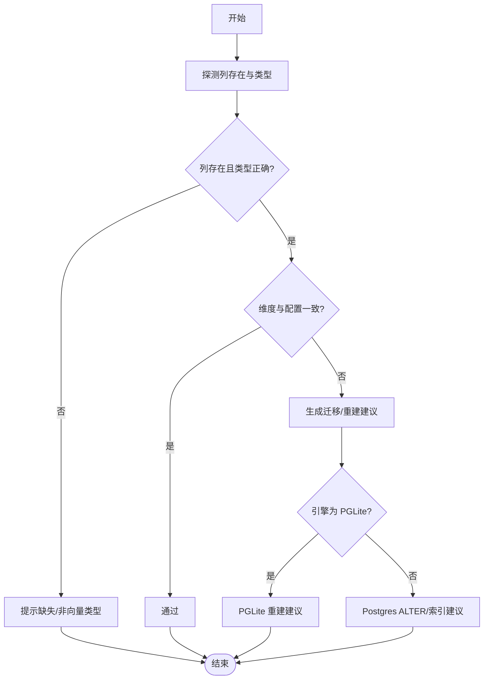
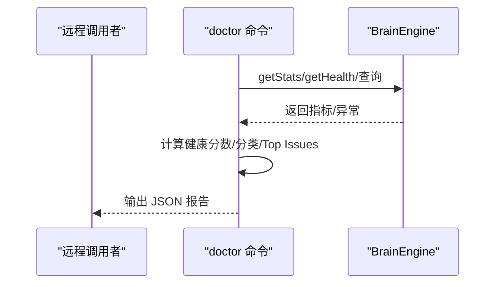
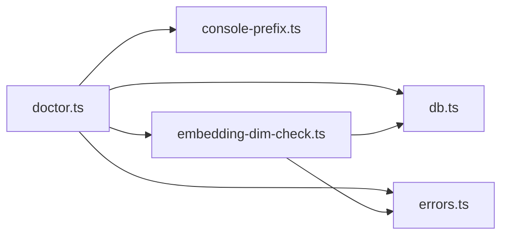

# 故障排除

<cite>
**本文引用的文件**
- [src/core/errors.ts](file://src/core/errors.ts)
- [src/core/console-prefix.ts](file://src/core/console-prefix.ts)
- [src/core/db.ts](file://src/core/db.ts)
- [src/core/embedding-dim-check.ts](file://src/core/embedding-dim-check.ts)
- [src/commands/doctor.ts](file://src/commands/doctor.ts)
- [docs/embedding-migrations.md](file://docs/embedding-migrations.md)
- [scripts/smoke-test.sh](file://scripts/smoke-test.sh)
- [tests/heavy/_read_latency_workload.ts](file://tests/heavy/_read_latency_workload.ts)
- [tests/heavy/measure_rss.sh](file://tests/heavy/measure_rss.sh)
- [tests/heavy/sync_timeout_rescue.sh](file://tests/heavy/sync_timeout_rescue.sh)
- [tests/heavy/sync_lock_regression.sh](file://tests/heavy/sync_lock_regression.sh)
- [test/e2e/fresh-install-pglite.test.ts](file://test/e2e/fresh-install-pglite.test.ts)
- [test/e2e/v0_28_5-fix-wave.test.ts](file://test/e2e/v0_28_5-fix-wave.test.ts)
- [test/v0_37_gap_fill.serial.test.ts](file://test/v0_37_gap_fill.serial.test.ts)
- [test/ai/dims-zeroentropy.test.ts](file://test/ai/dims-zeroentropy.test.ts)
- [test/repair-jsonb.test.ts](file://test/repair-jsonb.test.ts)
- [test/sync-hard-deadline.test.ts](file://test/sync-hard-deadline.test.ts)
- [test/timeout.test.ts](file://test/timeout.test.ts)
</cite>

## 目录
1. 引言
2. 项目结构
3. 核心组件
4. 架构总览
5. 详细组件分析
6. 依赖关系分析
7. 性能注意事项
8. 故障排除指南
9. 结论
10. 附录

## 引言
本指南面向运维与开发人员，系统化解析 GBrain 在运行期可能遇到的典型问题：嵌入维度不匹配、同步超时、数据库连接异常、并发锁竞争、性能退化与资源瓶颈等，并提供可操作的诊断流程、调试技巧、紧急恢复步骤与数据修复方案。文档同时覆盖错误建模、日志前缀化、健康检查与自动修复脚本，帮助快速定位根因并闭环处置。

## 项目结构
围绕故障排除的关键模块与测试用例分布如下：
- 错误建模与统一输出：src/core/errors.ts
- 日志前缀化与并行源隔离：src/core/console-prefix.ts
- 数据库连接与会话参数：src/core/db.ts
- 嵌入维度一致性与迁移指引：src/core/embedding-dim-check.ts、docs/embedding-migrations.md
- 健康检查与修复建议：src/commands/doctor.ts
- 端到端与重负载回归脚本：scripts/smoke-test.sh、tests/heavy/*
- 维度校验与预检：test/e2e/*、test/v0_37_gap_fill.serial.test.ts、test/ai/dims-zeroentropy.test.ts
- 并发与超时控制：test/sync-hard-deadline.test.ts、test/timeout.test.ts

图表来源
- [src/core/errors.ts:1-94](file://src/core/errors.ts#L1-L94)
- [src/core/console-prefix.ts:1-146](file://src/core/console-prefix.ts#L1-L146)
- [src/core/db.ts:1-377](file://src/core/db.ts#L1-L377)
- [src/core/embedding-dim-check.ts:1-708](file://src/core/embedding-dim-check.ts#L1-L708)
- [src/commands/doctor.ts:1-800](file://src/commands/doctor.ts#L1-L800)
- [scripts/smoke-test.sh:1-205](file://scripts/smoke-test.sh#L1-L205)
- [tests/heavy/_read_latency_workload.ts:27-266](file://tests/heavy/_read_latency_workload.ts#L27-L266)
- [tests/heavy/measure_rss.sh:91-113](file://tests/heavy/measure_rss.sh#L91-L113)
- [tests/heavy/sync_timeout_rescue.sh:57-86](file://tests/heavy/sync_timeout_rescue.sh#L57-L86)
- [tests/heavy/sync_lock_regression.sh:26-56](file://tests/heavy/sync_lock_regression.sh#L26-L56)
- [test/e2e/fresh-install-pglite.test.ts:121-189](file://test/e2e/fresh-install-pglite.test.ts#L121-L189)
- [test/e2e/v0_28_5-fix-wave.test.ts:261-286](file://test/e2e/v0_28_5-fix-wave.test.ts#L261-L286)
- [test/v0_37_gap_fill.serial.test.ts:214-284](file://test/v0_37_gap_fill.serial.test.ts#L214-L284)
- [test/ai/dims-zeroentropy.test.ts:1-69](file://test/ai/dims-zeroentropy.test.ts#L1-L69)
- [test/repair-jsonb.test.ts:1-37](file://test/repair-jsonb.test.ts#L1-L37)
- [test/sync-hard-deadline.test.ts:1-36](file://test/sync-hard-deadline.test.ts#L1-L36)
- [test/timeout.test.ts:59-83](file://test/timeout.test.ts#L59-L83)

章节来源
- [src/core/errors.ts:1-94](file://src/core/errors.ts#L1-L94)
- [src/core/console-prefix.ts:1-146](file://src/core/console-prefix.ts#L1-L146)
- [src/core/db.ts:1-377](file://src/core/db.ts#L1-L377)
- [src/core/embedding-dim-check.ts:1-708](file://src/core/embedding-dim-check.ts#L1-L708)
- [src/commands/doctor.ts:1-800](file://src/commands/doctor.ts#L1-L800)
- [scripts/smoke-test.sh:1-205](file://scripts/smoke-test.sh#L1-L205)
- [tests/heavy/_read_latency_workload.ts:27-266](file://tests/heavy/_read_latency_workload.ts#L27-L266)
- [tests/heavy/measure_rss.sh:91-113](file://tests/heavy/measure_rss.sh#L91-L113)
- [tests/heavy/sync_timeout_rescue.sh:57-86](file://tests/heavy/sync_timeout_rescue.sh#L57-L86)
- [tests/heavy/sync_lock_regression.sh:26-56](file://tests/heavy/sync_lock_regression.sh#L26-L56)
- [test/e2e/fresh-install-pglite.test.ts:121-189](file://test/e2e/fresh-install-pglite.test.ts#L121-L189)
- [test/e2e/v0_28_5-fix-wave.test.ts:261-286](file://test/e2e/v0_28_5-fix-wave.test.ts#L261-L286)
- [test/v0_37_gap_fill.serial.test.ts:214-284](file://test/v0_37_gap_fill.serial.test.ts#L214-L284)
- [test/ai/dims-zeroentropy.test.ts:1-69](file://test/ai/dims-zeroentropy.test.ts#L1-L69)
- [test/repair-jsonb.test.ts:1-37](file://test/repair-jsonb.test.ts#L1-L37)
- [test/sync-hard-deadline.test.ts:1-36](file://test/sync-hard-deadline.test.ts#L1-L36)
- [test/timeout.test.ts:59-83](file://test/timeout.test.ts#L59-L83)

## 核心组件
- 错误建模与统一输出：提供结构化错误体、人类可读消息与机器可解析字段，便于在 CLI/JSON 输出中稳定呈现。
- 日志前缀化：在多源并行同步场景下为每条日志添加来源前缀，避免输出交错，提升可观测性。
- 数据库连接与会话参数：封装连接池、准备语句策略、会话超时参数、连接重试与断开保护，降低 PgBouncer 事务模式下的异常风险。
- 嵌入维度检查与迁移：检测现有脑库的向量维度与配置不一致，生成针对 PGLite/Postgres 的迁移或重建建议。
- 健康检查与修复建议：集中执行多项检查，输出带分类与优先级的修复清单，支持远程/薄客户端调用。

章节来源
- [src/core/errors.ts:13-94](file://src/core/errors.ts#L13-L94)
- [src/core/console-prefix.ts:50-146](file://src/core/console-prefix.ts#L50-L146)
- [src/core/db.ts:107-377](file://src/core/db.ts#L107-L377)
- [src/core/embedding-dim-check.ts:78-234](file://src/core/embedding-dim-check.ts#L78-L234)
- [src/commands/doctor.ts:55-195](file://src/commands/doctor.ts#L55-L195)

## 架构总览
下图展示从命令入口到各子系统的交互路径，以及关键的错误与日志流经点：

图表来源
- [src/commands/doctor.ts:1-800](file://src/commands/doctor.ts#L1-L800)
- [src/core/db.ts:217-281](file://src/core/db.ts#L217-L281)
- [src/core/embedding-dim-check.ts:165-234](file://src/core/embedding-dim-check.ts#L165-L234)
- [src/core/console-prefix.ts:84-108](file://src/core/console-prefix.ts#L84-L108)
- [src/core/errors.ts:55-93](file://src/core/errors.ts#L55-L93)

## 详细组件分析

### 组件A：错误建模与统一输出
- 能力要点
  - 提供结构化错误体（类名、代码、消息、提示、文档链接）
  - 将任意异常序列化为统一格式，便于 CLI/JSON 消费
  - 通过包装类保留原始堆栈与提示，兼顾人类可读与机器解析
- 典型用途
  - doctor 报告中的错误字段
  - 命令失败时的标准化输出
- 关键接口
  - 构造器与序列化函数
  - 结构化错误类

图表来源
- [src/core/errors.ts:13-94](file://src/core/errors.ts#L13-L94)

章节来源
- [src/core/errors.ts:13-94](file://src/core/errors.ts#L13-L94)

### 组件B：日志前缀化（并行源隔离）
- 能力要点
  - 使用异步存储在多源并行场景下为每条日志添加来源前缀
  - 对 stdout/stderr 分别处理，避免污染 JSON 输出
  - 支持多行字符串逐行加前缀，保持可读性
- 典型用途
  - 多源同步、嵌入进度、心跳输出
- 关键接口
  - withSourcePrefix 包裹作用域
  - slog/serr 替代 console.log/error

图表来源
- [src/core/console-prefix.ts:65-108](file://src/core/console-prefix.ts#L65-L108)

章节来源
- [src/core/console-prefix.ts:50-146](file://src/core/console-prefix.ts#L50-L146)

### 组件C：数据库连接与会话参数
- 能力要点
  - 连接池大小、空闲/连接超时、准备语句策略
  - 自动检测 PgBouncer 事务模式并禁用准备语句以避免“未找到预处理”错误
  - 会话级超时参数（语句/空闲事务），防止孤儿会话占用锁
  - 连接重试与可重试错误模式识别
  - 断开连接的限时保护，避免长时间阻塞
- 典型用途
  - doctor/sync/embed 等命令的数据库访问
- 关键接口
  - connect/connectWithRetry/endPoolBounded
  - resolvePrepare/resolvePoolSize/resolveSessionTimeouts

图表来源
- [src/core/db.ts:346-377](file://src/core/db.ts#L346-L377)
- [src/core/db.ts:325-337](file://src/core/db.ts#L325-L337)

章节来源
- [src/core/db.ts:107-377](file://src/core/db.ts#L107-L377)

### 组件D：嵌入维度检查与迁移
- 能力要点
  - 探测 content_chunks.embedding 与 facts.embedding 的实际维度与类型
  - 生成针对 PGLite（重建）与 Postgres（ALTER/索引）的迁移建议
  - 预检：在 init/embed 前发现不一致，避免静默破坏
  - 针对不同模型（如 ZeroEntropy/Voyage/OpenAI）的维度允许集校验
- 典型用途
  - doctor 报告中的维度一致性检查
  - init/embed 前置校验
- 关键接口
  - readContentChunksEmbeddingDim/readFactsEmbeddingDim
  - embeddingMismatchMessage/buildFactsAlterRecipe
  - resolveSchemaEmbeddingDim/resolveSchemaMultimodalDim

图表来源
- [src/core/embedding-dim-check.ts:93-123](file://src/core/embedding-dim-check.ts#L93-L123)
- [src/core/embedding-dim-check.ts:165-234](file://src/core/embedding-dim-check.ts#L165-L234)
- [src/core/embedding-dim-check.ts:275-462](file://src/core/embedding-dim-check.ts#L275-L462)

章节来源
- [src/core/embedding-dim-check.ts:78-234](file://src/core/embedding-dim-check.ts#L78-L234)
- [docs/embedding-migrations.md:1-185](file://docs/embedding-migrations.md#L1-L185)

### 组件E：健康检查与修复建议
- 能力要点
  - 远程/薄客户端医生：连接性、版本、脑评分、队列健康、同步失败、多源漂移等
  - 本地医生：更广泛的检查集合，支持修复计划/修复执行
  - 分类与优先级：按类别打分、Top Issues 排序
- 典型用途
  - 定期巡检、CI 阈值、远程诊断
- 关键接口
  - computeDoctorReport、各类检查函数

图表来源
- [src/commands/doctor.ts:467-799](file://src/commands/doctor.ts#L467-L799)

章节来源
- [src/commands/doctor.ts:55-195](file://src/commands/doctor.ts#L55-L195)

## 依赖关系分析
- 组件耦合
  - doctor 依赖 db（连接/查询）、errors（错误封装）、console-prefix（日志）、embedding-dim-check（维度检查）
  - db 与环境变量强相关（池大小、准备语句、会话超时、Notice 控制）
  - 嵌入维度检查依赖 AI 模型/配方解析与维度允许集
- 外部集成点
  - Postgres/PgBouncer、PGLite、AI 提供商网关
- 潜在循环依赖
  - 当前模块间为单向依赖，无明显循环

图表来源
- [src/commands/doctor.ts:1-800](file://src/commands/doctor.ts#L1-L800)
- [src/core/db.ts:1-377](file://src/core/db.ts#L1-L377)
- [src/core/errors.ts:1-94](file://src/core/errors.ts#L1-L94)
- [src/core/console-prefix.ts:1-146](file://src/core/console-prefix.ts#L1-L146)
- [src/core/embedding-dim-check.ts:1-708](file://src/core/embedding-dim-check.ts#L1-L708)

章节来源
- [src/commands/doctor.ts:1-800](file://src/commands/doctor.ts#L1-L800)
- [src/core/db.ts:1-377](file://src/core/db.ts#L1-L377)
- [src/core/errors.ts:1-94](file://src/core/errors.ts#L1-L94)
- [src/core/console-prefix.ts:1-146](file://src/core/console-prefix.ts#L1-L146)
- [src/core/embedding-dim-check.ts:1-708](file://src/core/embedding-dim-check.ts#L1-L708)

## 性能注意事项
- 查询延迟与回归检测
  - 通过压测脚本统计 p50/p95/p99、查询数、写入完成/失败、耗时与阈值，支持严格/宽松模式
- 内存峰值回归
  - 基线对比（Linux）与阈值判断，区分信息性/失败
- 并发与锁竞争
  - 并发同步场景下的锁回归脚本，验证多进程/多源不会互相阻塞
- 硬截止与停滞中止
  - 同步硬截止与停滞中止时间可由环境变量配置，避免无限等待

章节来源
- [tests/heavy/_read_latency_workload.ts:27-266](file://tests/heavy/_read_latency_workload.ts#L27-L266)
- [tests/heavy/measure_rss.sh:91-113](file://tests/heavy/measure_rss.sh#L91-L113)
- [tests/heavy/sync_lock_regression.sh:26-56](file://tests/heavy/sync_lock_regression.sh#L26-L56)
- [test/sync-hard-deadline.test.ts:1-36](file://test/sync-hard-deadline.test.ts#L1-L36)

## 故障排除指南

### 一、嵌入维度不匹配
- 症状
  - doctor 报告出现维度不一致警告/失败
  - init/embed 前置校验抛出维度不匹配错误
  - PGLite 上 ALTER COLUMN TYPE 向量类型失败
- 根因
  - 已有脑库的 content_chunks.embedding 或 facts.embedding 维度与当前配置不一致
  - 不同模型（如 ZeroEntropy/Voyage/OpenAI）的默认维度或自定义维度不在允许集
- 处理步骤
  - PGLite：使用重建命令或手动备份后重新初始化，再同步与增量嵌入
  - Postgres：按迁移文档执行 DROP/ALTER/UPDATE/重建索引（HNSW ≤2000维）
  - 预防：init 前先进行维度预检；同一维度模型切换无需 ALTER
- 参考
  - 迁移文档与维度检查逻辑

章节来源
- [src/core/embedding-dim-check.ts:165-234](file://src/core/embedding-dim-check.ts#L165-L234)
- [docs/embedding-migrations.md:54-152](file://docs/embedding-migrations.md#L54-L152)
- [test/e2e/fresh-install-pglite.test.ts:121-189](file://test/e2e/fresh-install-pglite.test.ts#L121-L189)
- [test/e2e/v0_28_5-fix-wave.test.ts:261-286](file://test/e2e/v0_28_5-fix-wave.test.ts#L261-L286)
- [test/v0_37_gap_fill.serial.test.ts:214-284](file://test/v0_37_gap_fill.serial.test.ts#L214-L284)
- [test/ai/dims-zeroentropy.test.ts:1-69](file://test/ai/dims-zeroentropy.test.ts#L1-L69)

### 二、同步超时与停滞
- 症状
  - sync --all 长时间无进展或最终失败
  - doctor 报告队列健康/停滞任务
- 根因
  - 网络抖动、上游服务不可达、PgBouncer 事务模式导致准备语句异常
  - 任务卡死/孤儿会话占用锁
- 处理步骤
  - 设置硬截止与停滞中止时间，避免无限等待
  - 检查队列中 active 超时任务并取消/重试
  - 使用同步超时救援脚本模拟级联恢复，观察收敛情况
  - 降低并发或调整连接参数
- 参考
  - 硬截止/停滞中止解析、同步超时救援脚本

章节来源
- [test/sync-hard-deadline.test.ts:1-36](file://test/sync-hard-deadline.test.ts#L1-L36)
- [tests/heavy/sync_timeout_rescue.sh:57-86](file://tests/heavy/sync_timeout_rescue.sh#L57-L86)
- [src/commands/doctor.ts:669-693](file://src/commands/doctor.ts#L669-L693)

### 三、数据库连接问题
- 症状
  - 连接失败、认证失败、连接被拒、系统启动中、连接意外终止
- 根因
  - URL/凭据错误、网络不稳定、数据库未就绪、PgBouncer 事务模式
- 处理步骤
  - 使用带重试的连接器，指数回退并记录失败原因
  - 自动检测 PgBouncer 端口并禁用准备语句
  - 设置会话级超时参数，避免孤儿会话
  - 断开连接时采用限时保护，避免阻塞
- 参考
  - 连接/重试/断开实现

章节来源
- [src/core/db.ts:325-337](file://src/core/db.ts#L325-L337)
- [src/core/db.ts:346-377](file://src/core/db.ts#L346-L377)
- [src/core/db.ts:86-105](file://src/core/db.ts#L86-L105)
- [src/core/db.ts:160-175](file://src/core/db.ts#L160-L175)
- [src/core/db.ts:283-303](file://src/core/db.ts#L283-L303)

### 四、并发锁竞争与多源冲突
- 症状
  - 多源并行时日志交错、任务互相阻塞
- 根因
  - 缺少来源前缀、锁粒度不当
- 处理步骤
  - 使用日志前缀化确保输出可追踪
  - 降低并发、增加冷却窗口、避免重复提交
  - 使用锁回归脚本验证多源稳定性
- 参考
  - 日志前缀化、锁回归脚本

章节来源
- [src/core/console-prefix.ts:50-146](file://src/core/console-prefix.ts#L50-L146)
- [tests/heavy/sync_lock_regression.sh:26-56](file://tests/heavy/sync_lock_regression.sh#L26-L56)

### 五、性能退化与资源瓶颈
- 症状
  - 查询延迟上升、内存峰值异常
- 根因
  - 索引策略不当（HNSW 维度过高）、写放大、缓存命中率低
- 处理步骤
  - 使用读延迟压测脚本评估 p50/p95/p99
  - 对比内存峰值基线，设置阈值判断
  - 调整模型/维度、索引策略与连接参数
- 参考
  - 压测与内存测量脚本

章节来源
- [tests/heavy/_read_latency_workload.ts:27-266](file://tests/heavy/_read_latency_workload.ts#L27-L266)
- [tests/heavy/measure_rss.sh:91-113](file://tests/heavy/measure_rss.sh#L91-L113)

### 六、紧急恢复与数据修复
- JSONB 双编码修复（Postgres）
  - 仅对旧版 JSONB 存储问题生效，PGLite 短路跳过
- 嵌入维度迁移
  - PGLite：重建；Postgres：ALTER/索引重建
- 健康检查与自动修复
  - doctor 报告修复建议；远程医生聚焦关键健康面
- 参考
  - JSONB 修复测试、迁移文档、doctor 报告

章节来源
- [test/repair-jsonb.test.ts:1-37](file://test/repair-jsonb.test.ts#L1-37)
- [docs/embedding-migrations.md:107-152](file://docs/embedding-migrations.md#L107-L152)
- [src/commands/doctor.ts:467-799](file://src/commands/doctor.ts#L467-L799)

### 七、日志分析与错误解读
- 日志前缀化
  - 通过 withSourcePrefix 为每条日志添加来源标识，便于 grep/过滤
- 结构化错误
  - 使用统一错误体，包含 class/code/message/hint/docs_url
- 参考
  - 日志前缀化、错误建模

章节来源
- [src/core/console-prefix.ts:50-146](file://src/core/console-prefix.ts#L50-L146)
- [src/core/errors.ts:13-94](file://src/core/errors.ts#L13-L94)

### 八、根因分析流程
- 快速定位
  - doctor --json 获取健康分数与分类得分
  - 查看 Top Issues 与修复建议
- 深入排查
  - 检查数据库连接/会话参数、队列健康、维度一致性
  - 使用冒烟测试脚本验证 CLI/数据库/工作进程健康
- 闭环处置
  - 应用修复建议，再次运行 doctor 验证
  - 记录变更与观测指标，纳入回归脚本

章节来源
- [src/commands/doctor.ts:166-195](file://src/commands/doctor.ts#L166-L195)
- [scripts/smoke-test.sh:1-205](file://scripts/smoke-test.sh#L1-L205)

## 结论
通过统一的错误建模、日志前缀化、数据库连接治理、嵌入维度一致性检查与健康检查体系，结合压测与回归脚本，GBrain 能够在复杂运行环境中快速定位并解决常见问题。建议将 doctor 作为日常巡检与 CI 阈值的核心手段，并配合冒烟测试与迁移文档形成完整的故障排除闭环。

## 附录

### A. 常见问题对照表
- 问题类型：嵌入维度不匹配
  - 症状：doctor 报告失败/警告；init/embed 前置校验失败
  - 处理：PGLite 重建；Postgres ALTER/索引重建
  - 参考：迁移文档、维度检查
- 问题类型：同步超时/停滞
  - 症状：sync --all 卡住；doctor 报告队列健康异常
  - 处理：设置硬截止/停滞中止；取消/重试卡死任务
  - 参考：硬截止测试、超时救援脚本
- 问题类型：数据库连接异常
  - 症状：认证失败/连接被拒/系统启动中
  - 处理：连接重试；PgBouncer 事务模式自动降级；设置会话超时
  - 参考：连接/重试/断开实现
- 问题类型：并发锁竞争
  - 症状：日志交错；任务互相阻塞
  - 处理：启用日志前缀化；降低并发；使用锁回归脚本
  - 参考：日志前缀化、锁回归脚本

章节来源
- [docs/embedding-migrations.md:1-185](file://docs/embedding-migrations.md#L1-L185)
- [src/core/embedding-dim-check.ts:165-234](file://src/core/embedding-dim-check.ts#L165-L234)
- [test/sync-hard-deadline.test.ts:1-36](file://test/sync-hard-deadline.test.ts#L1-L36)
- [tests/heavy/sync_timeout_rescue.sh:57-86](file://tests/heavy/sync_timeout_rescue.sh#L57-L86)
- [src/core/db.ts:325-337](file://src/core/db.ts#L325-L337)
- [src/core/console-prefix.ts:50-146](file://src/core/console-prefix.ts#L50-L146)
- [tests/heavy/sync_lock_regression.sh:26-56](file://tests/heavy/sync_lock_regression.sh#L26-L56)

### B. 社区支持与问题报告
- 仓库与模板
  - GitHub Issues/Pull Requests 工作流与模板
- 问题报告建议
  - 提供 doctor --json 输出、日志路径、环境变量摘要、复现步骤与期望/实际行为
- 参考
  - 仓库根目录 .github 相关文件

[本节为通用指导，不直接分析具体文件，故不附“章节来源”]