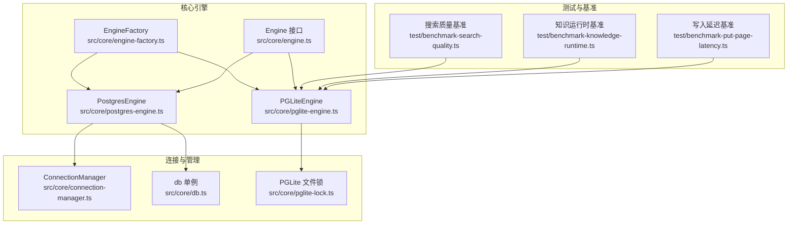
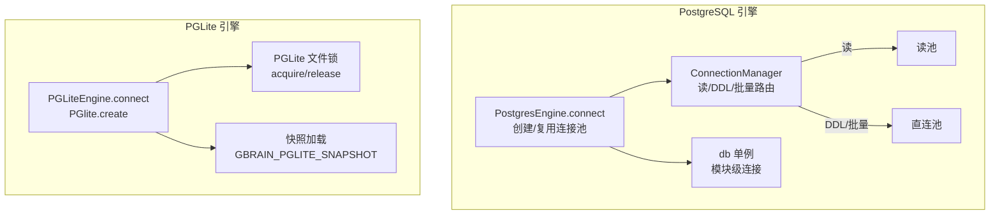
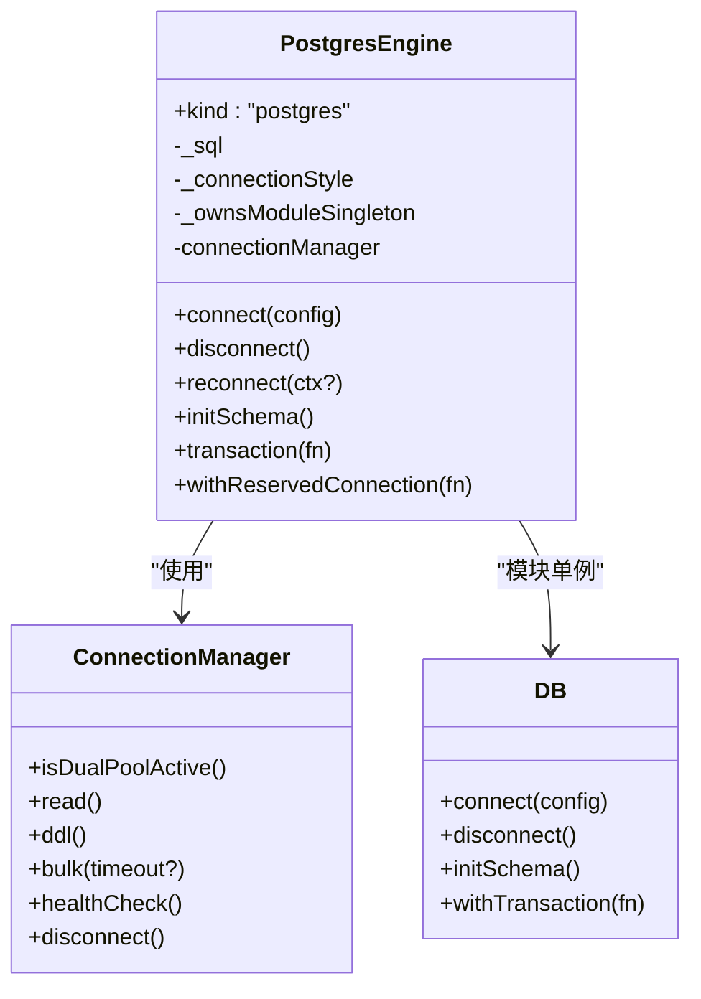
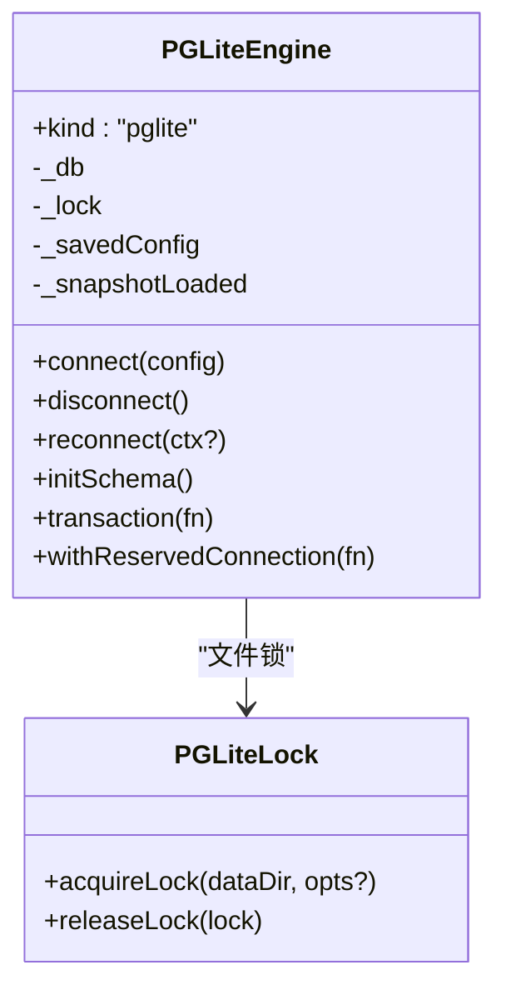
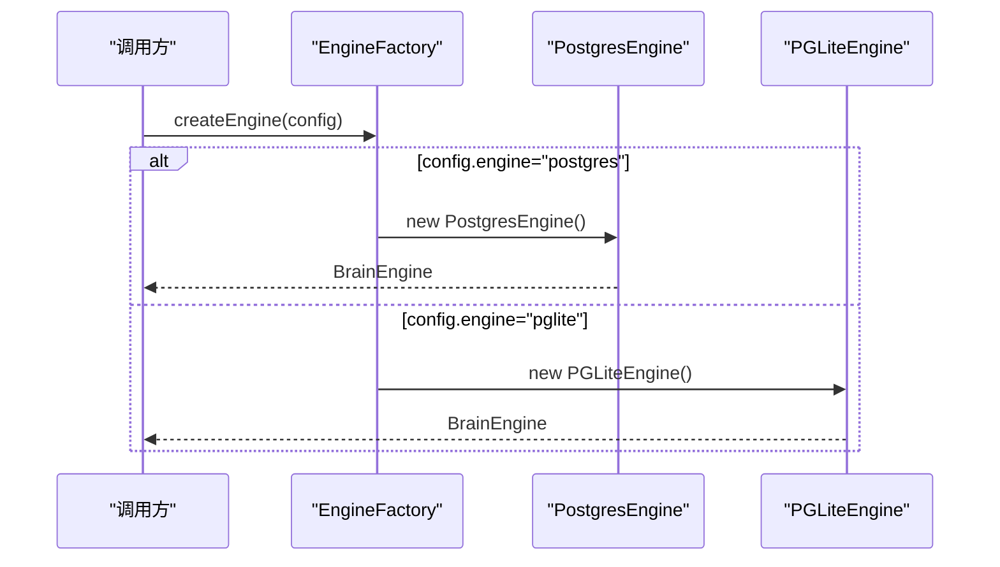
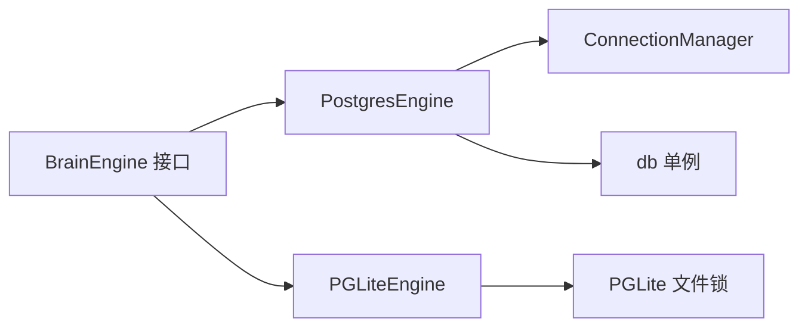

# 引擎实现对比

<cite>
**本文档引用的文件**
- [postgres-engine.ts](file://src/core/postgres-engine.ts)
- [pglite-engine.ts](file://src/core/pglite-engine.ts)
- [engine-factory.ts](file://src/core/engine-factory.ts)
- [engine.ts](file://src/core/engine.ts)
- [connection-manager.ts](file://src/core/connection-manager.ts)
- [pglite-lock.ts](file://src/core/pglite-lock.ts)
- [db.ts](file://src/core/db.ts)
- [benchmark-search-quality.ts](file://test/benchmark-search-quality.ts)
- [benchmark-knowledge-runtime.ts](file://test/benchmark-knowledge-runtime.ts)
- [benchmark-put-page-latency.ts](file://test/benchmark-put-page-latency.ts)
</cite>

## 目录
1. [引言](#引言)
2. [项目结构](#项目结构)
3. [核心组件](#核心组件)
4. [架构概览](#架构概览)
5. [详细组件分析](#详细组件分析)
6. [依赖关系分析](#依赖关系分析)
7. [性能考量](#性能考量)
8. [故障排查指南](#故障排查指南)
9. [结论](#结论)
10. [附录](#附录)

## 引言
本文件对 GBrain 的两种数据库引擎实现进行系统性对比：PostgresEngine（基于 postgres.js 的 PostgreSQL 引擎）与 PGLiteEngine（基于 @electric-sql/pglite 的嵌入式 Postgres 引擎）。我们将从设计差异、适用场景、性能特点、连接管理、事务处理、并发控制、内存与持久化选择、引擎切换与迁移策略、配置参数与部署差异、以及引擎抽象层的扩展性等方面进行全面分析，并结合基准测试结果给出实践建议。

## 项目结构
围绕数据库引擎的核心代码主要位于 src/core 目录下，包含引擎实现、连接管理、锁机制、模块级连接单例等关键模块；测试目录提供了多种基准测试以验证性能与质量。

**图表来源**
- [postgres-engine.ts](file://src/core/postgres-engine.ts)
- [pglite-engine.ts](file://src/core/pglite-engine.ts)
- [engine-factory.ts](file://src/core/engine-factory.ts)
- [engine.ts](file://src/core/engine.ts)
- [connection-manager.ts](file://src/core/connection-manager.ts)
- [db.ts](file://src/core/db.ts)
- [pglite-lock.ts](file://src/core/pglite-lock.ts)
- [benchmark-search-quality.ts](file://test/benchmark-search-quality.ts)
- [benchmark-knowledge-runtime.ts](file://test/benchmark-knowledge-runtime.ts)
- [benchmark-put-page-latency.ts](file://test/benchmark-put-page-latency.ts)

**章节来源**
- [postgres-engine.ts](file://src/core/postgres-engine.ts)
- [pglite-engine.ts](file://src/core/pglite-engine.ts)
- [engine-factory.ts](file://src/core/engine-factory.ts)
- [engine.ts](file://src/core/engine.ts)
- [connection-manager.ts](file://src/core/connection-manager.ts)
- [db.ts](file://src/core/db.ts)
- [pglite-lock.ts](file://src/core/pglite-lock.ts)
- [benchmark-search-quality.ts](file://test/benchmark-search-quality.ts)
- [benchmark-knowledge-runtime.ts](file://test/benchmark-knowledge-runtime.ts)
- [benchmark-put-page-latency.ts](file://test/benchmark-put-page-latency.ts)

## 核心组件
- PostgresEngine：面向生产环境的 PostgreSQL 引擎，支持连接池、双路径路由（读/DDL）、会话超时、重连与幂等断开、迁移与模式校验等。
- PGLiteEngine：面向本地开发与测试的嵌入式 Postgres 引擎，通过 WASM 提供进程内数据库，支持快照恢复、文件锁避免并发冲突、可选持久化数据目录。
- EngineFactory：根据配置动态选择并实例化引擎，避免不必要的 WASM 加载。
- ConnectionManager：在 PostgreSQL 场景中负责读/DDL/批量操作的连接路由与生命周期管理。
- db 单例：模块级连接单例，用于 CLI 主引擎路径，支持幂等断开与硬上限关闭。
- PGLite 文件锁：确保同一数据目录不被多进程同时访问，防止并发写入导致的异常。

**章节来源**
- [postgres-engine.ts](file://src/core/postgres-engine.ts)
- [pglite-engine.ts](file://src/core/pglite-engine.ts)
- [engine-factory.ts](file://src/core/engine-factory.ts)
- [connection-manager.ts](file://src/core/connection-manager.ts)
- [db.ts](file://src/core/db.ts)
- [pglite-lock.ts](file://src/core/pglite-lock.ts)

## 架构概览
PostgreSQL 引擎采用“模块单例 + 连接池 + 双路径路由”的架构，支持在 Supabase/PgBouncer 环境下的自动检测与优化；PGLite 引擎采用“进程内 WASM 数据库 + 文件锁 + 可选快照”的架构，适合本地开发与测试。

**图表来源**
- [postgres-engine.ts](file://src/core/postgres-engine.ts)
- [connection-manager.ts](file://src/core/connection-manager.ts)
- [db.ts](file://src/core/db.ts)
- [pglite-engine.ts](file://src/core/pglite-engine.ts)
- [pglite-lock.ts](file://src/core/pglite-lock.ts)

## 详细组件分析

### PostgresEngine 设计与实现
- 连接管理
  - 支持实例级连接池与模块级单例两种路径，通过 _connectionStyle 与 _ownsModuleSingleton 区分所有权，避免误删共享连接。
  - 通过 ConnectionManager 实现读/DDL/批量三类连接的路由，自动识别 Supabase 池化环境并启用直连池以规避事务模式下的语句超时问题。
  - 断开连接时采用硬上限结束（endPoolBounded），避免长时间阻塞导致的退出延迟。
- 事务处理
  - 提供 transaction(fn) 与 withReservedConnection(fn) 两类事务接口，前者在连接池中执行，后者为需要会话级保留连接的场景提供单一后端。
  - 与 db 单例配合，支持跨引擎调用的一致性事务封装。
- 并发控制
  - 通过 ConnectionManager 的双路径与会话超时设置（statement_timeout/idle_in_transaction_session_timeout）降低长事务与孤儿会话的风险。
  - 在模块单例路径下，connect 返回是否“创建了单例”的布尔值，确保只有创建者才能断开，避免竞态。
- 模式初始化与迁移
  - initSchema 内部使用 pg_advisory_lock(42) 防止并发初始化；先应用前向引导（bootstrap）再执行模式脚本，最后运行迁移并进行自愈性校验。
  - 对于存在事务池器的环境，DDL 路由到直连池，保证 DDL 不受 2 分钟语句超时限制。
- 重连与幂等断开
  - reconnect(ctx?) 统一重连入口，避免裸断开丢失配置导致的不可恢复错误。
  - disconnect() 幂等且安全，区分实例池与模块单例路径，避免误删共享连接。

**图表来源**
- [postgres-engine.ts](file://src/core/postgres-engine.ts)
- [connection-manager.ts](file://src/core/connection-manager.ts)
- [db.ts](file://src/core/db.ts)

**章节来源**
- [postgres-engine.ts](file://src/core/postgres-engine.ts)
- [connection-manager.ts](file://src/core/connection-manager.ts)
- [db.ts](file://src/core/db.ts)

### PGLiteEngine 设计与实现
- 连接管理
  - 通过 PGlite.create 创建进程内数据库，支持可选持久化数据目录（database_path）与快照恢复（GBRAIN_PGLITE_SNAPSHOT）。
  - 使用文件锁（.gbrain-lock）避免多进程同时访问同一数据目录，防止并发写入导致的 Aborted 错误。
- 事务处理
  - 由于无连接池，事务即会话级操作；withReservedConnection 作为占位接口，所有调用均在同一后端执行。
- 并发控制
  - 文件锁具备心跳与过期回收机制，避免死锁与僵尸锁；支持可调的“窃取宽限”时间窗口。
- 模式初始化与迁移
  - initSchema 先执行前向引导（bootstrap），再应用模式脚本与迁移；支持快照命中时跳过初始化。
- 重连与断开
  - reconnect(ctx?) 在有持久化数据目录时重新打开同一数据目录；无持久化目录时为无操作（状态无法恢复）。
  - disconnect() 采用“快照 + 早期置空 + try/finally 释放锁”的模式，确保并发安全。

**图表来源**
- [pglite-engine.ts](file://src/core/pglite-engine.ts)
- [pglite-lock.ts](file://src/core/pglite-lock.ts)

**章节来源**
- [pglite-engine.ts](file://src/core/pglite-engine.ts)
- [pglite-lock.ts](file://src/core/pglite-lock.ts)

### 引擎工厂与抽象层
- EngineFactory 根据配置选择引擎类型，动态导入以避免在 PostgreSQL 用户侧加载 PGLite WASM。
- Engine 接口定义统一能力集（connect/disconnect/reconnect/initSchema/transaction/withReservedConnection 等），确保两种引擎在上层调用层面保持一致。

**图表来源**
- [engine-factory.ts](file://src/core/engine-factory.ts)
- [engine.ts](file://src/core/engine.ts)

**章节来源**
- [engine-factory.ts](file://src/core/engine-factory.ts)
- [engine.ts](file://src/core/engine.ts)

## 依赖关系分析
- PostgreSQL 引擎依赖 postgres.js 客户端、ConnectionManager（读/DDL/批量路由）、db 单例（模块级连接）。
- PGLite 引擎依赖 @electric-sql/pglite、文件锁模块、可选快照加载逻辑。
- 两者均实现统一的 BrainEngine 接口，便于上层业务解耦。

**图表来源**
- [engine.ts](file://src/core/engine.ts)
- [postgres-engine.ts](file://src/core/postgres-engine.ts)
- [pglite-engine.ts](file://src/core/pglite-engine.ts)
- [connection-manager.ts](file://src/core/connection-manager.ts)
- [db.ts](file://src/core/db.ts)
- [pglite-lock.ts](file://src/core/pglite-lock.ts)

**章节来源**
- [engine.ts](file://src/core/engine.ts)
- [postgres-engine.ts](file://src/core/postgres-engine.ts)
- [pglite-engine.ts](file://src/core/pglite-engine.ts)
- [connection-manager.ts](file://src/core/connection-manager.ts)
- [db.ts](file://src/core/db.ts)
- [pglite-lock.ts](file://src/core/pglite-lock.ts)

## 性能考量
- 搜索质量基准（test/benchmark-search-quality.ts）
  - 基准覆盖实体检索、时间线事件、主题聚合、歧义消解等场景，比较“基础版”、“仅提升”、“意图分类+提升”三种配置。
  - 关键指标包括 P@1/P@5、召回率、MRR、nDCG、源准确性（Top Chunk 类型正确率）、编译真相优先率、时间线可达性、每页块数、唯一页面数、编译真相占比等。
  - 结果显示：引入意图分类与提升策略可显著提升源准确性、CT 优先率与时间线可达性，同时保持或提升传统 IR 指标。
- 知识运行时基准（test/benchmark-knowledge-runtime.ts）
  - 测量“即时可查询”（auto_timeline 开启 vs 关闭）、完整性修复率（高/中/低置信度桶分布）、医生完整性（问题发现率）。
  - 结果表明：开启 auto_timeline 后，即时可查询比例显著提升；完整性修复按置信度分布合理分流；医生完整性扫描准确捕获已植入问题。
- 写入延迟基准（test/benchmark-put-page-latency.ts）
  - 通过 200 次 put_page 操作记录 p50/p95/p99 延迟与新增时间线条目数量，验证 Step B 的自动时间线是否带来明显写入开销。
  - 结果可用于对比分支与主干在写入延迟上的差异。

**章节来源**
- [benchmark-search-quality.ts](file://test/benchmark-search-quality.ts)
- [benchmark-knowledge-runtime.ts](file://test/benchmark-knowledge-runtime.ts)
- [benchmark-put-page-latency.ts](file://test/benchmark-put-page-latency.ts)

## 故障排查指南
- PostgreSQL 引擎
  - 连接失败与幂等断开：db.disconnect() 采用“快照 + 置空 + 硬上限结束”，避免并发断开导致的单例丢失；PostgresEngine.disconnect() 区分实例池与模块单例路径，确保幂等。
  - 会话超时与孤儿会话：通过 resolveSessionTimeouts 设置 statement_timeout 与 idle_in_transaction_session_timeout，减少 PgBouncer 事务模式下的孤儿会话风险。
  - 连接池耗尽：可通过 GBRAIN_POOL_SIZE 与 GBRAIN_DIRECT_POOL_SIZE 调整读池与直连池大小；在 Supabase 环境下 ConnectionManager 自动识别并启用直连池。
- PGLite 引擎
  - 初始化失败：支持对 bunfs/macOS 26.3 等常见错误进行分类提示；失败时自动释放锁，避免卡死。
  - 并发冲突：若多个进程尝试访问同一数据目录，将因文件锁等待超时而报错；可清理 .gbrain-lock 或更换数据目录。
  - 快照不匹配：当快照版本与当前迁移不一致时，自动回退到正常初始化流程。

**章节来源**
- [db.ts](file://src/core/db.ts)
- [postgres-engine.ts](file://src/core/postgres-engine.ts)
- [pglite-engine.ts](file://src/core/pglite-engine.ts)
- [pglite-lock.ts](file://src/core/pglite-lock.ts)

## 结论
- 适用场景
  - PostgreSQL 引擎适用于生产环境、高并发、需要连接池与复杂事务的场景；在 Supabase/PgBouncer 环境下具备自动优化能力。
  - PGLite 引擎适用于本地开发、测试与小规模场景；具备快照恢复与文件锁保障，避免并发冲突。
- 性能与可靠性
  - PostgreSQL 引擎在复杂查询与 DDL 场景表现稳定，通过双路径路由与会话超时降低风险。
  - PGLite 引擎在轻量场景下延迟低、易部署，基准测试显示其检索质量与运行时行为可满足大多数本地需求。
- 切换与迁移
  - 通过 EngineFactory 与配置项 engine 可无缝切换；迁移时注意模式初始化顺序与快照一致性。
- 最佳实践
  - 生产环境优先 PostgreSQL，结合 ConnectionManager 与会话超时策略；本地开发优先 PGLite，配合快照与文件锁。
  - 在大规模写入或 DDL 场景，优先使用 PostgreSQL；在快速迭代与离线任务中，PGLite 更具灵活性。

## 附录

### 引擎对比表（设计差异、适用场景、性能特点）
- 设计差异
  - 连接模型：PostgreSQL 使用连接池与模块单例；PGLite 使用进程内数据库与文件锁。
  - 路由策略：PostgreSQL 通过 ConnectionManager 实现读/DDL/批量路由；PGLite 无池化，路由为进程内。
  - 并发控制：PostgreSQL 通过会话超时与池化策略；PGLite 通过文件锁与心跳机制。
- 适用场景
  - PostgreSQL：生产、高并发、复杂事务、Supabase/PgBouncer。
  - PGLite：本地开发、测试、小规模、离线任务。
- 性能特点
  - PostgreSQL：吞吐高、稳定性强、DDL 受限于事务池器时需直连池；基准测试显示检索质量与运行时行为良好。
  - PGLite：延迟低、易部署、快照加速初始化；并发访问需文件锁保护。

### 引擎切换与迁移策略
- 切换条件
  - 从 PGLite 切换至 PostgreSQL：需要可用的数据库 URL 与网络访问；通过配置 engine=postgres 实现。
  - 从 PostgreSQL 切换至 PGLite：需要本地磁盘空间与合适的快照；通过配置 engine=pglite 实现。
- 迁移步骤
  - 备份/导出：PostgreSQL 可通过标准工具备份；PGLite 可通过快照或数据目录复制。
  - 模式同步：PostgreSQL 与 PGLite 均执行 initSchema 与迁移；注意 PGLite 的快照命中可跳过初始化。
  - 验证：运行基准测试（搜索质量、知识运行时、写入延迟）确认一致性与性能。

### 配置参数与部署差异
- PostgreSQL
  - 关键参数：database_url、GBRAIN_POOL_SIZE、GBRAIN_DIRECT_POOL_SIZE、GBRAIN_PREPARE、GBRAIN_STATEMENT_TIMEOUT、GBRAIN_IDLE_TX_TIMEOUT、GBRAIN_CLIENT_CHECK_INTERVAL、GBRAIN_DIRECT_DATABASE_URL。
  - 部署要点：Supabase 环境自动识别并启用直连池；事务池器环境下避免 prepare 缓存失效问题。
- PGLite
  - 关键参数：database_path（可选持久化）、GBRAIN_PGLITE_SNAPSHOT（快照路径）、锁相关环境变量（如 GBRAIN_PGLITE_LOCK_STEAL_GRACE_SECONDS）。
  - 部署要点：WASM 运行时需可写文件系统；快照需与迁移哈希一致；文件锁保护同一数据目录。

### 引擎抽象层与扩展性
- 抽象层
  - Engine 接口统一生命周期与能力；EngineFactory 动态选择引擎，避免不必要的 WASM 加载。
- 扩展性
  - 新增引擎只需实现 Engine 接口与工厂分支；连接管理与锁机制可复用现有模式（如 ConnectionManager 与文件锁）。

**章节来源**
- [engine.ts](file://src/core/engine.ts)
- [engine-factory.ts](file://src/core/engine-factory.ts)
- [postgres-engine.ts](file://src/core/postgres-engine.ts)
- [pglite-engine.ts](file://src/core/pglite-engine.ts)
- [connection-manager.ts](file://src/core/connection-manager.ts)
- [pglite-lock.ts](file://src/core/pglite-lock.ts)
- [db.ts](file://src/core/db.ts)