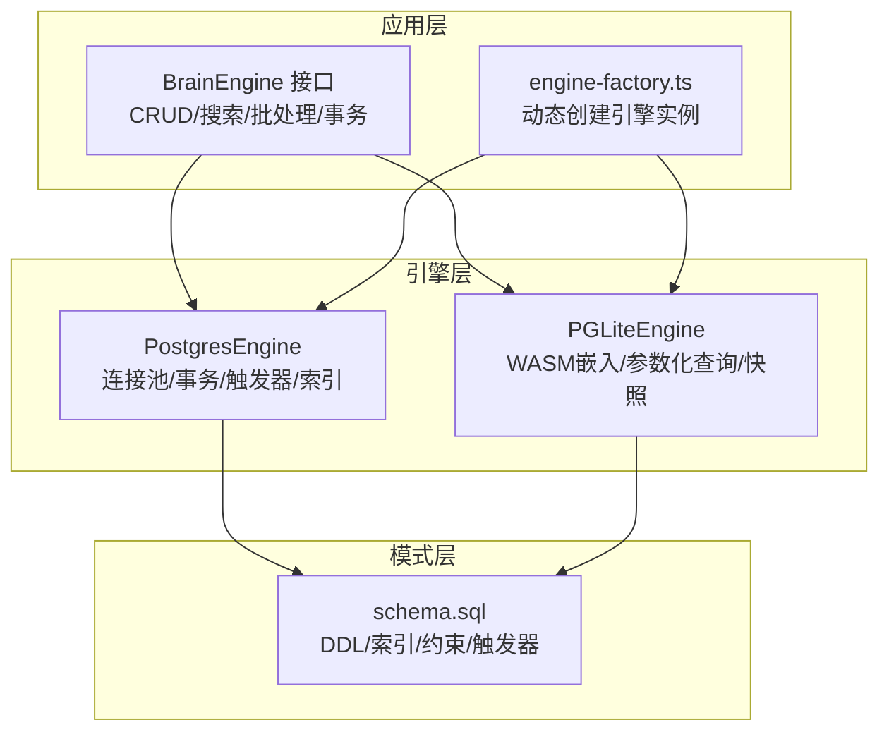
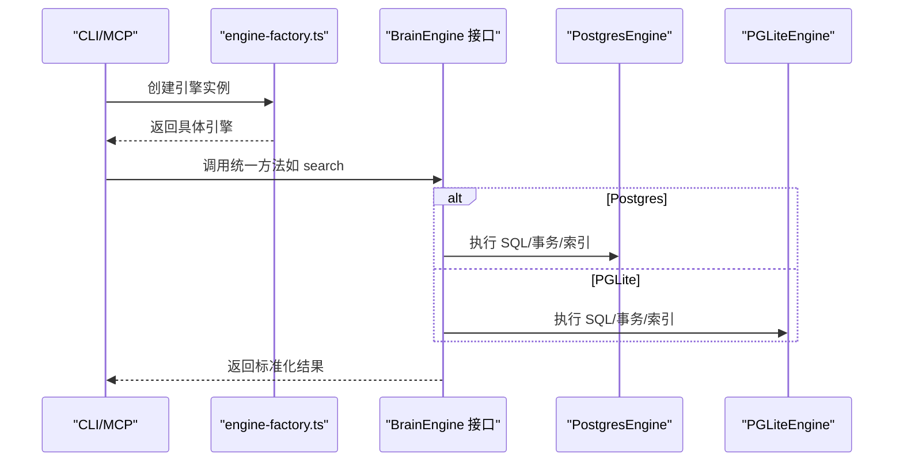
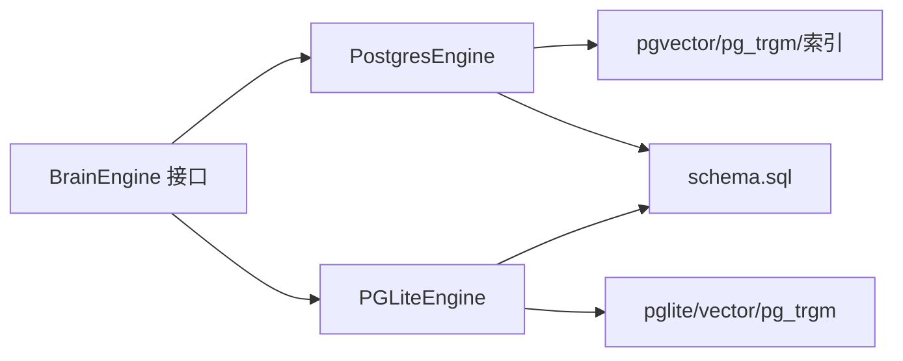

# 数据库设计

<cite>
**本文引用的文件**
- [schema.sql](file://src/schema.sql)
- [ENGINES.md](file://docs/ENGINES.md)
- [engine.ts](file://src/core/engine.ts)
- [postgres-engine.ts](file://src/core/postgres-engine.ts)
- [pglite-engine.ts](file://src/core/pglite-engine.ts)
- [types.ts](file://src/core/types.ts)
- [engine-factory.ts](file://src/core/engine-factory.ts)
- [migrate.test.ts](file://test/migrate.test.ts)
- [phantom-redirect-engine-parity.test.ts](file://test/phantom-redirect-engine-parity.test.ts)
- [frontmatter-migration.test.ts](file://test/e2e/frontmatter-migration.test.ts)
- [migrations-v0_13_1-grandfather.test.ts](file://test/migrations-v0_13_1-grandfather.test.ts)
</cite>

## 目录
1. [简介](#简介)
2. [项目结构](#项目结构)
3. [核心组件](#核心组件)
4. [架构总览](#架构总览)
5. [详细组件分析](#详细组件分析)
6. [依赖分析](#依赖分析)
7. [性能考量](#性能考量)
8. [故障排除指南](#故障排除指南)
9. [结论](#结论)
10. [附录](#附录)

## 简介
本文件系统化梳理 GBrain 的数据库设计与实现，覆盖表结构、字段与数据类型、索引与约束、关系映射；对比两种存储引擎（PostgresEngine 与 PGLiteEngine）的差异与选型依据；阐述数据访问模式、缓存策略与性能优化；给出数据生命周期、保留与归档策略；说明迁移管理、版本控制与数据完整性保障；并提供多租户隔离与权限控制的实现要点。

## 项目结构
- 数据库模式由单一 SQL 脚本集中定义，涵盖核心内容表、向量索引、全文检索、图结构、标签、时间线、原始数据、配置、令牌与审计日志等。
- 引擎抽象通过统一接口屏蔽底层差异，支持在 Postgres 与 PGLite 之间无缝切换。
- 迁移测试与端到端测试确保跨引擎一致性与数据完整性。

图表来源
- [ENGINES.md:134-177](file://docs/ENGINES.md#L134-L177)
- [engine.ts:646-90](file://src/core/engine.ts#L646-L90)
- [postgres-engine.ts:94-200](file://src/core/postgres-engine.ts#L94-L200)
- [pglite-engine.ts:1-200](file://src/core/pglite-engine.ts#L1-L200)
- [schema.sql:1-120](file://src/schema.sql#L1-L120)
- [engine-factory.ts:1-26](file://src/core/engine-factory.ts#L1-L26)

章节来源
- [ENGINES.md:1-235](file://docs/ENGINES.md#L1-L235)
- [engine.ts:646-90](file://src/core/engine.ts#L646-L90)
- [postgres-engine.ts:94-200](file://src/core/postgres-engine.ts#L94-L200)
- [pglite-engine.ts:1-200](file://src/core/pglite-engine.ts#L1-L200)
- [schema.sql:1-120](file://src/schema.sql#L1-L120)
- [engine-factory.ts:1-26](file://src/core/engine-factory.ts#L1-L26)

## 核心组件
- 统一引擎接口：定义 CRUD、搜索、批处理、事务、健康统计、迁移等能力，屏蔽底层差异。
- 引擎实现：PostgresEngine 使用连接池与事务，PGLiteEngine 使用 WASM 嵌入式运行时。
- 模式定义：schema.sql 集中声明表、列、约束、索引、触发器与扩展。
- 类型系统：types.ts 定义页面、块、链接、时间线、事实、得分卡等核心数据模型。

章节来源
- [engine.ts:646-90](file://src/core/engine.ts#L646-L90)
- [postgres-engine.ts:94-200](file://src/core/postgres-engine.ts#L94-L200)
- [pglite-engine.ts:1-200](file://src/core/pglite-engine.ts#L1-L200)
- [schema.sql:1-120](file://src/schema.sql#L1-L120)
- [types.ts:1-200](file://src/core/types.ts#L1-L200)

## 架构总览
- 引擎工厂按配置动态加载 Postgres 或 PGLite 实现。
- PostgresEngine 通过连接池与事务管理，使用 pgvector、pg_trgm、GIN/HNSW 等扩展。
- PGLiteEngine 在本地以单机文件形式运行，提供与 Postgres 相同的 SQL 语义与索引能力。
- 搜索路径在引擎内实现：关键词检索（tsvector/ts_rank）、向量检索（HNSW/cosine），并由上层混合融合与去重。

图表来源
- [engine-factory.ts:1-26](file://src/core/engine-factory.ts#L1-L26)
- [engine.ts:646-90](file://src/core/engine.ts#L646-L90)
- [ENGINES.md:134-177](file://docs/ENGINES.md#L134-L177)

章节来源
- [ENGINES.md:105-177](file://docs/ENGINES.md#L105-L177)
- [engine-factory.ts:1-26](file://src/core/engine-factory.ts#L1-L26)

## 详细组件分析

### 表结构与字段定义
- sources：多源租户标识，包含软删除、上下文检索模式、信任前言开关、最新内容时间戳等。
- pages：核心内容表，含页面类型、情感权重、有效日期、最后检索时间、链接提取时间水印、上下文检索模式与生成版本等。
- content_chunks：分块文本与嵌入，支持代码元数据、符号路径、多模态向量与部分表达式索引。
- code_edges_chunk / code_edges_symbol：结构化代码边（已解析与未解析）。
- links：跨页链接，支持来源标签、类型、解析类型、提及种类、原点页等。
- tags：页面标签。
- raw_data：侧车数据（JSONB）。
- timeline_entries：结构化时间线。
- page_versions：页面历史快照。
- ingest_log：导入日志。
- config：脑级配置。
- access_tokens / mcp_request_log：令牌与请求日志。
- oauth_clients / oauth_tokens / oauth_codes：OAuth 客户端、令牌与授权码。
- op_checkpoints / op_checkpoint_paths：长任务检查点。
- context_volunteer_events：上下文自愿事件。
- files / file_migration_ledger：二进制附件与迁移清单。
- facts / takes / slug_aliases：事实、带权重断言、别名。

章节来源
- [schema.sql:26-80](file://src/schema.sql#L26-L80)
- [schema.sql:85-153](file://src/schema.sql#L85-L153)
- [schema.sql:296-353](file://src/schema.sql#L296-L353)
- [schema.sql:387-432](file://src/schema.sql#L387-L432)
- [schema.sql:464-495](file://src/schema.sql#L464-L495)
- [schema.sql:505-525](file://src/schema.sql#L505-L525)
- [schema.sql:532-547](file://src/schema.sql#L532-L547)
- [schema.sql:552-558](file://src/schema.sql#L552-L558)
- [schema.sql:570-578](file://src/schema.sql#L570-L578)
- [schema.sql:586-596](file://src/schema.sql#L586-L596)
- [schema.sql:601-610](file://src/schema.sql#L601-L610)
- [schema.sql:616-626](file://src/schema.sql#L616-L626)
- [schema.sql:631-686](file://src/schema.sql#L631-L686)
- [schema.sql:702-729](file://src/schema.sql#L702-L729)
- [schema.sql:736-749](file://src/schema.sql#L736-L749)
- [schema.sql:766-800](file://src/schema.sql#L766-L800)

### 索引策略与约束
- 全文检索：tsvector + GIN，trigram + GIN 支持模糊匹配；标题 trigram 索引加速排序与模糊。
- 向量检索：HNSW + cosine_ops；图像向量与统一多模态向量分别建立部分索引。
- 复合与选择性索引：按 source_id、updated_at、deleted_at、last_retrieved_at、links_extracted_at 等维度建立复合与部分索引。
- JSONB 查询：frontmatter 使用 GIN 索引；GitHub 仓库字段建立部分表达式索引。
- 唯一与检查约束：页面 (source_id, slug) 唯一；链接唯一性包含来源与原点；类型与来源格式校验等。

章节来源
- [schema.sql:155-195](file://src/schema.sql#L155-L195)
- [schema.sql:256-291](file://src/schema.sql#L256-L291)
- [schema.sql:331-353](file://src/schema.sql#L331-L353)
- [schema.sql:497-501](file://src/schema.sql#L497-L501)
- [schema.sql:580-581](file://src/schema.sql#L580-L581)
- [schema.sql:657-661](file://src/schema.sql#L657-L661)

### 关系映射与外键
- pages.source_id → sources(id)，软删除级联。
- content_chunks.page_id → pages(id)，软删除级联。
- code_edges_*、links、tags、raw_data、timeline_entries、page_versions、files、oauth_tokens、oauth_codes 等均通过外键与 pages 或 sources 建立关联。
- files.page_id 可为空（软删除后置空）。

章节来源
- [schema.sql:87-88](file://src/schema.sql#L87-L88)
- [schema.sql:298-299](file://src/schema.sql#L298-L299)
- [schema.sql:389-395](file://src/schema.sql#L389-L395)
- [schema.sql:466-468](file://src/schema.sql#L466-L468)
- [schema.sql:507-509](file://src/schema.sql#L507-L509)
- [schema.sql:519-521](file://src/schema.sql#L519-L521)
- [schema.sql:534-535](file://src/schema.sql#L534-L535)
- [schema.sql:554-555](file://src/schema.sql#L554-L555)
- [schema.sql:769-771](file://src/schema.sql#L769-L771)

### 引擎实现差异与选择标准
- PostgresEngine
  - 依赖：postgres-js、pgvector、pg_trgm、GIN/HNSW、递归 CTE、触发器、连接池。
  - 特性：事务、连接池、远程托管（Supabase）、触发器驱动搜索向量更新。
- PGLiteEngine
  - 依赖：@electric-sql/pglite、vector、pg_trgm。
  - 特性：WASM 嵌入、参数化查询、单机文件、快照恢复、与 Postgres 相同 SQL 语义。
- 选择建议：入门与单机优先 PGLite；生产与高并发优先 Postgres；需要分析导出或复杂查询可考虑 DuckDB 作为辅助引擎。

章节来源
- [ENGINES.md:134-177](file://docs/ENGINES.md#L134-L177)
- [ENGINES.md:211-235](file://docs/ENGINES.md#L211-L235)

### 数据访问模式与缓存策略
- 访问模式
  - 页面：slug 唯一，支持软删除过滤、来源限定、前言投影、情感权重与有效日期参与排序。
  - 分块：按 page_id + chunk_index 唯一，支持代码元数据、符号路径、多模态向量。
  - 图与链接：支持 BFS/CTE 遍历、提及过滤、类型与来源区分。
  - 批处理：批量链接、时间线、断言写入，具备自适应重试与信号中断。
- 缓存策略
  - 查询缓存：基于 per-page generation 与全局时钟（序列）实现层级失效；支持 per-statement 时钟提升并发。
  - 结果融合：关键词与向量搜索在引擎层返回统一结果，上层执行 RRF 融合与去重。
  - 会话级缓存：通过 reserved connection 与会话级 GUC 控制（如超时）。

章节来源
- [engine.ts:646-90](file://src/core/engine.ts#L646-L90)
- [engine.ts:118-121](file://src/core/engine.ts#L118-L121)
- [engine.ts:671-791](file://src/core/engine.ts#L671-L791)
- [schema.sql:155-195](file://src/schema.sql#L155-L195)
- [schema.sql:218-241](file://src/schema.sql#L218-L241)

### 性能特性与优化
- 索引优化：HNSW、GIN、部分表达式索引、复合索引覆盖常见过滤与排序。
- 写入优化：触发器仅在关键列变化时重建搜索向量；批量写入减少往返。
- 并发与锁：PGLite 使用序列时钟避免行级锁争用；Postgres 使用连接池与会话超时。
- 搜索路径：关键词（tsvector/ts_rank）、向量（HNSW/cosine）、图信号、回链与标题命中等多路融合。

章节来源
- [schema.sql:354-373](file://src/schema.sql#L354-L373)
- [schema.sql:256-291](file://src/schema.sql#L256-L291)
- [ENGINES.md:105-133](file://docs/ENGINES.md#L105-L133)

### 数据生命周期、保留与归档
- 软删除：页面与来源支持 deleted_at/archived 标记与回收期；自动清理阶段在回收期后硬删除。
- 链接提取水印：links_extracted_at 与 updated_at 协作判定过期，支撑“过期提取”扫描。
- 日志与审计：mcp_request_log、oauth_*、op_checkpoints 等记录操作轨迹与状态。
- 归档与迁移：迁移测试覆盖幂等性、容忍浮点噪声、保留审计轨迹。

章节来源
- [schema.sql:38-56](file://src/schema.sql#L38-L56)
- [schema.sql:106-110](file://src/schema.sql#L106-L110)
- [schema.sql:127-134](file://src/schema.sql#L127-L134)
- [schema.sql:616-626](file://src/schema.sql#L616-L626)
- [schema.sql:662-686](file://src/schema.sql#L662-L686)
- [schema.sql:702-729](file://src/schema.sql#L702-L729)
- [migrate.test.ts:1397-1416](file://test/migrate.test.ts#L1397-L1416)

### 迁移管理、版本控制与数据完整性
- 迁移框架：版本化迁移，支持事务/非事务、回滚日志、幂等性与容忍浮点噪声。
- 跨引擎一致性：端到端测试验证引擎间行为一致（如事实迁移只移动活动行，保留审计轨迹）。
- 前言修复：端到端测试覆盖嵌套引号与空字节等边界情况修复。

章节来源
- [migrate.test.ts:1391-1419](file://test/migrate.test.ts#L1391-L1419)
- [phantom-redirect-engine-parity.test.ts:178-210](file://test/phantom-redirect-engine-parity.test.ts#L178-L210)
- [frontmatter-migration.test.ts:28-58](file://test/e2e/frontmatter-migration.test.ts#L28-L58)
- [migrations-v0_13_1-grandfather.test.ts:89-119](file://test/migrations-v0_13_1-grandfather.test.ts#L89-L119)

### 多租户隔离与权限控制
- 多源租户：每个页面与文件绑定 source_id，查询与写入可通过 sourceId/sourceIds 限定范围。
- 权限与可见性：事实表支持 visibility 字段；远程调用通过 remote 标记强制世界可见过滤。
- OAuth：客户端绑定来源与工具、预算上限、并发限制；令牌与授权码安全存储。
- 访问令牌：Bearer 令牌与作用域管理，撤销标记与哈希索引。

章节来源
- [types.ts:573-602](file://src/core/types.ts#L573-L602)
- [schema.sql:644-651](file://src/schema.sql#L644-L651)
- [schema.sql:662-670](file://src/schema.sql#L662-L670)
- [schema.sql:675-686](file://src/schema.sql#L675-L686)
- [schema.sql:601-610](file://src/schema.sql#L601-L610)

## 依赖分析
- 引擎与模式耦合：引擎通过统一接口访问 schema.sql 定义的表与索引；PostgresEngine 依赖扩展与连接池；PGLiteEngine 依赖 WASM 运行时与扩展。
- 上层依赖：搜索融合、批处理、事务与保留连接等能力由引擎提供，上层逻辑无感知差异。

图表来源
- [engine.ts:646-90](file://src/core/engine.ts#L646-L90)
- [postgres-engine.ts:94-200](file://src/core/postgres-engine.ts#L94-L200)
- [pglite-engine.ts:1-200](file://src/core/pglite-engine.ts#L1-L200)
- [schema.sql:1-120](file://src/schema.sql#L1-L120)

章节来源
- [engine.ts:646-90](file://src/core/engine.ts#L646-L90)
- [postgres-engine.ts:94-200](file://src/core/postgres-engine.ts#L94-L200)
- [pglite-engine.ts:1-200](file://src/core/pglite-engine.ts#L1-L200)
- [schema.sql:1-120](file://src/schema.sql#L1-L120)

## 性能考量
- 索引选择：根据查询模式选择 B-tree/GIN/HNSW/部分表达式索引；避免对软删除高基数列建立普通索引。
- 写入路径：利用触发器与表达式索引减少全表扫描；批量写入降低往返次数。
- 并发与锁：PGLite 使用序列时钟避免行级锁；Postgres 使用连接池与会话超时。
- 搜索融合：在上层进行 RRF 融合与去重，避免重复计算。

## 故障排除指南
- 初始化失败（PGLite）：分类错误类型（如 Bun VFS、macOS 26.3 WASM），按提示升级或改用 Node。
- 连接问题（Postgres）：检查连接池大小、会话超时、准备语句检测；必要时重启连接。
- 迁移异常：确认迁移幂等性与容忍浮点噪声；核对回滚日志与审计轨迹。
- 软删除与回收：确认 deleted_at/archived 时间窗与自动清理阶段逻辑。

章节来源
- [pglite-engine.ts:159-196](file://src/core/pglite-engine.ts#L159-L196)
- [postgres-engine.ts:160-200](file://src/core/postgres-engine.ts#L160-L200)
- [migrate.test.ts:1397-1416](file://test/migrate.test.ts#L1397-L1416)
- [phantom-redirect-engine-parity.test.ts:178-210](file://test/phantom-redirect-engine-parity.test.ts#L178-L210)

## 结论
GBrain 的数据库设计以统一引擎接口为核心，结合 schema.sql 的强约束与丰富索引，实现了从关键词到向量、从结构化到图谱的多维检索；通过软删除、回收期与审计日志保障数据生命周期管理；借助迁移测试与端到端验证确保跨引擎一致性与数据完整性；在多租户隔离与权限控制方面，通过 sourceId、visibility 与 OAuth 机制实现细粒度访问治理。

## 附录
- 引擎能力矩阵与差异详见 ENGINES 文档。
- 类型系统与模型定义参见 types.ts。
- 引擎工厂与动态加载参见 engine-factory.ts。