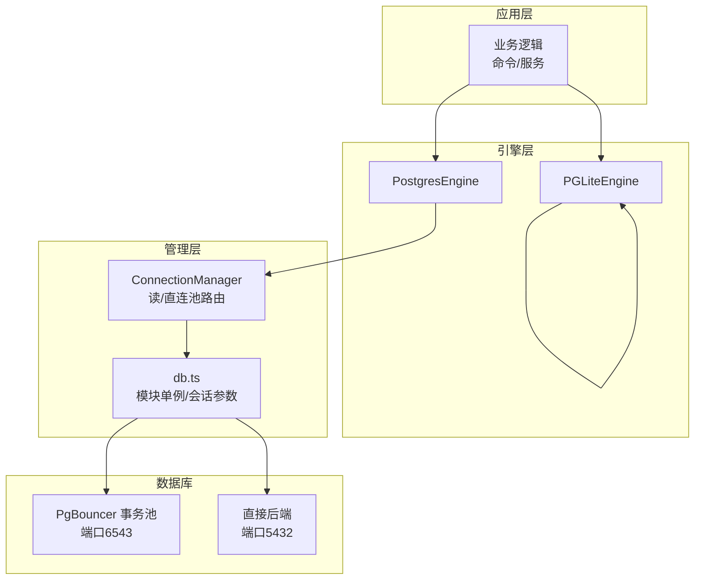
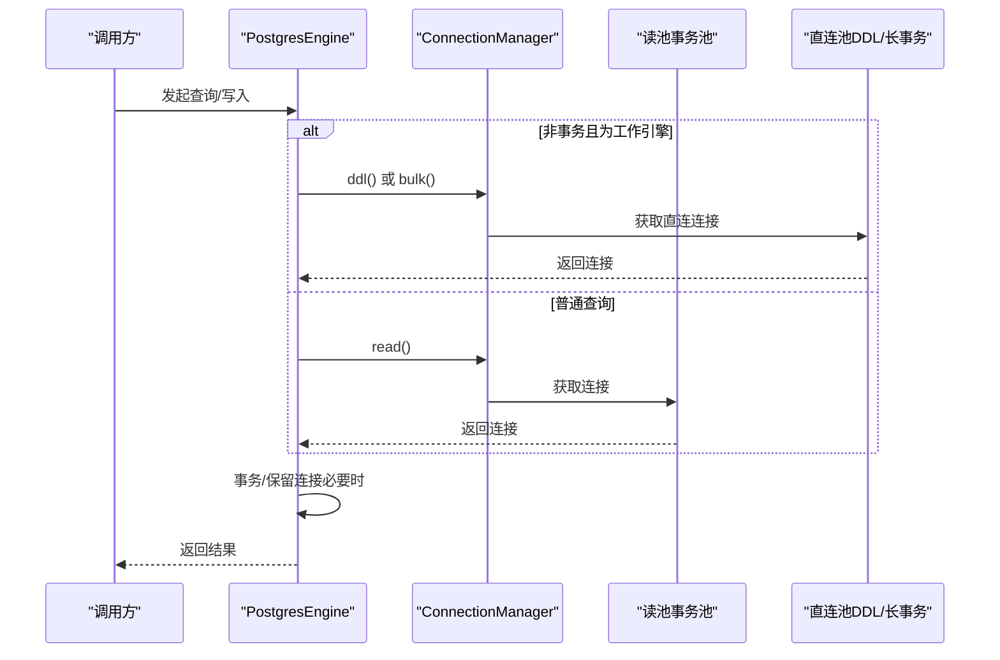
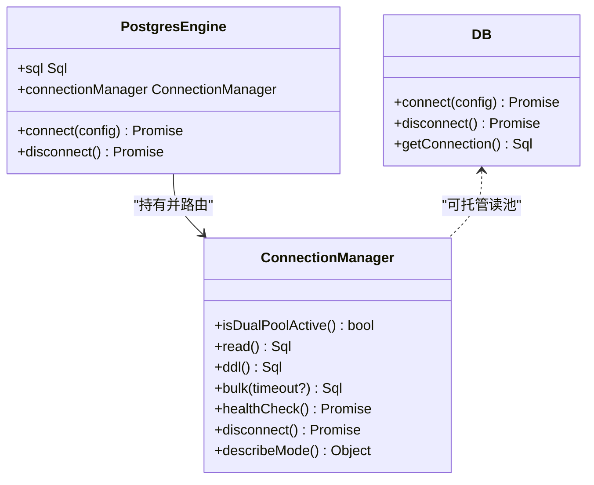
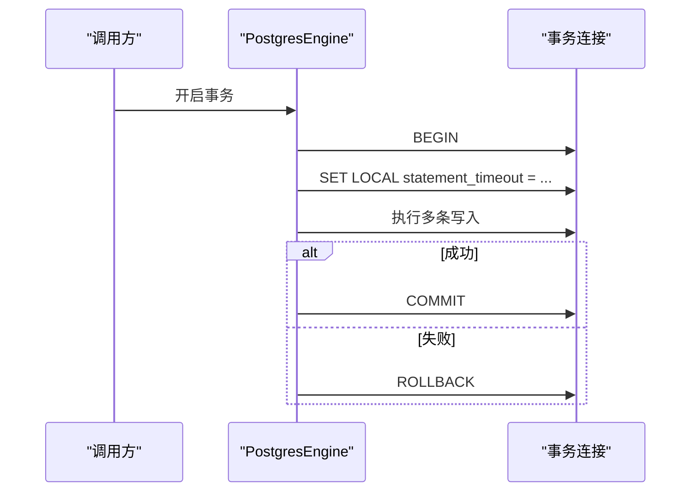
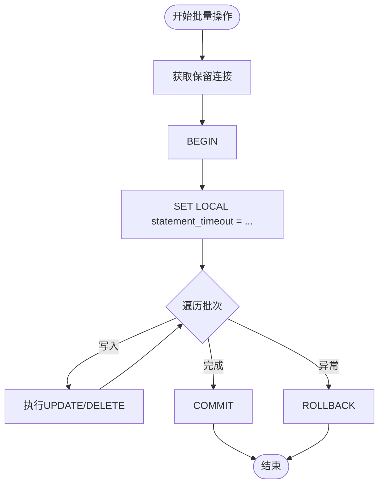
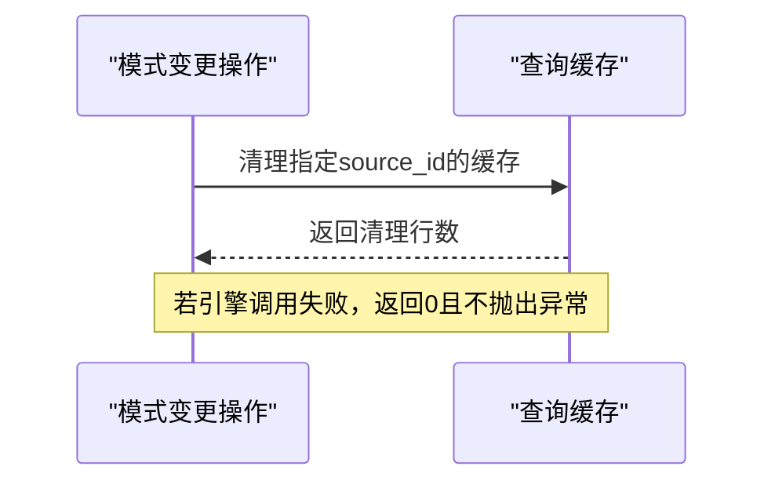
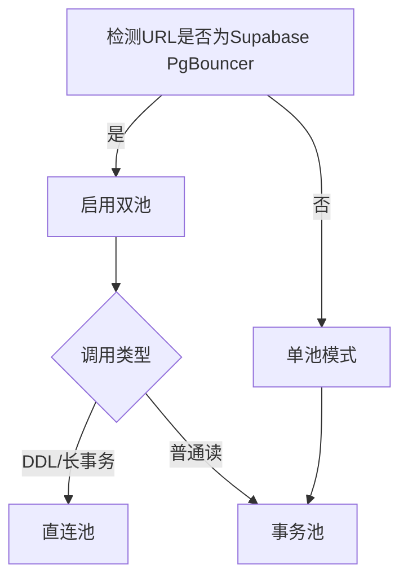
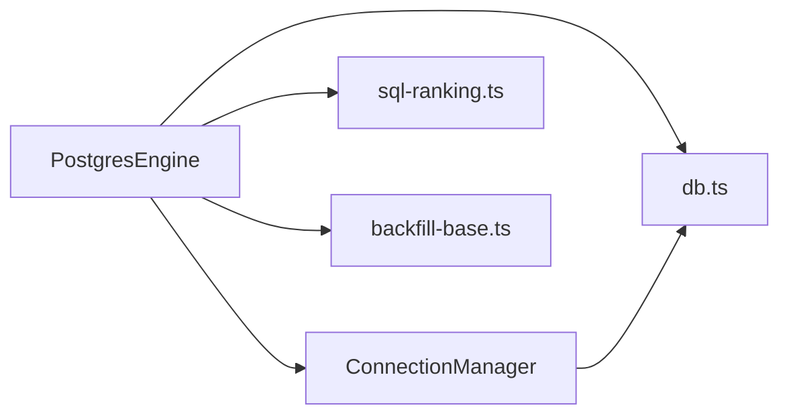

# 数据访问模式

<cite>
**本文引用的文件**
- [postgres-engine.ts](file://src/core/postgres-engine.ts)
- [connection-manager.ts](file://src/core/connection-manager.ts)
- [db.ts](file://src/core/db.ts)
- [backfill-base.ts](file://src/core/backfill-base.ts)
- [sql-ranking.ts](file://src/core/search/sql-ranking.ts)
- [pglite-engine.ts](file://src/core/pglite-engine.ts)
- [postgres-execute-raw-direct.test.ts](file://test/postgres-execute-raw-direct.test.ts)
- [postgres-engine.test.ts](file://test/postgres-engine.test.ts)
- [schema-pack-query-cache-invalidator.test.ts](file://test/schema-pack-query-cache-invalidator.test.ts)
- [sync-delete-batch.slow.test.ts](file://test/sync-delete-batch.slow.test.ts)
- [migrate.test.ts](file://test/migrate.test.ts)
- [pgbouncer-teardown.test.ts](file://test/e2e/pgbouncer-teardown.test.ts)
- [postgres-engine-disconnect-idempotency.test.ts](file://test/e2e/postgres-engine-disconnect-idempotency.test.ts)
- [engine-parity.test.ts](file://test/e2e/engine-parity.test.ts)
</cite>

## 目录
1. [引言](#引言)
2. [项目结构](#项目结构)
3. [核心组件](#核心组件)
4. [架构总览](#架构总览)
5. [详细组件分析](#详细组件分析)
6. [依赖关系分析](#依赖关系分析)
7. [性能考量](#性能考量)
8. [故障排查指南](#故障排查指南)
9. [结论](#结论)
10. [附录](#附录)

## 引言
本技术文档聚焦于GBrain的数据访问模式与缓存策略，系统性阐述以下主题：
- ORM模式、原生SQL查询与批量操作的最佳实践
- 连接池管理、事务边界与并发控制策略
- 缓存层次结构与失效机制
- 数据读写分离的实现方案
- 批量操作的性能优化技巧与错误处理策略
- 数据一致性保证与ACID特性实现
- 查询优化器的使用与执行计划分析方法
- 常见数据访问场景的代码示例与性能建议

## 项目结构
GBrain采用“引擎 + 管理层”的分层设计：
- 引擎层：PostgresEngine（生产环境）、PGLiteEngine（测试/轻量化）
- 管理层：ConnectionManager（连接路由与双池策略）、db.ts（模块级单例与会话参数）
- 搜索与排序：sql-ranking.ts（构建SQL排序片段）
- 批量与迁移：backfill-base.ts（批量回填与保留连接）、migrate系列（版本迁移）

图示来源
- [postgres-engine.ts](file://src/core/postgres-engine.ts)
- [connection-manager.ts](file://src/core/connection-manager.ts)
- [db.ts](file://src/core/db.ts)

章节来源
- [postgres-engine.ts](file://src/core/postgres-engine.ts)
- [connection-manager.ts](file://src/core/connection-manager.ts)
- [db.ts](file://src/core/db.ts)

## 核心组件
- PostgresEngine：提供统一的数据库接口，支持实例级连接池与模块级单例；封装事务、迁移、搜索等能力。
- ConnectionManager：在Supabase PgBouncer环境下实现“读池（事务池）+ 直连池（DDL/长事务）”的双池路由；支持杀开关（禁用直连池）与外部读池托管。
- db.ts：模块级单例连接管理，负责连接参数解析（prepare、超时）、安全断开与重连辅助。
- backfill-base.ts：批量回填的核心流程，强调“保留连接”以确保BEGIN/SET LOCAL/UPDATE/COMMIT在同一后端执行，避免PgBouncer事务模式下的语句隔离问题。
- sql-ranking.ts：构建源感知的排序因子、可见性过滤、最近度衰减等SQL片段，确保引擎间一致性。

章节来源
- [postgres-engine.ts](file://src/core/postgres-engine.ts)
- [connection-manager.ts](file://src/core/connection-manager.ts)
- [db.ts](file://src/core/db.ts)
- [backfill-base.ts](file://src/core/backfill-base.ts)
- [sql-ranking.ts](file://src/core/search/sql-ranking.ts)

## 架构总览
下图展示生产环境中的连接与路由策略，以及事务与批量操作的边界：

图示来源
- [postgres-engine.ts](file://src/core/postgres-engine.ts)
- [connection-manager.ts](file://src/core/connection-manager.ts)

章节来源
- [postgres-engine.ts](file://src/core/postgres-engine.ts)
- [connection-manager.ts](file://src/core/connection-manager.ts)

## 详细组件分析

### 连接池与路由（ConnectionManager）
- 双池策略
  - 读池（事务池，端口6543）：默认大小由环境变量或自动推断决定；针对PgBouncer事务模式，强制关闭prepare以避免“预处理语句不存在”错误。
  - 直连池（端口5432）：默认大小较小（受环境变量控制），用于DDL、长时间运行的批量任务；设置较长的statement_timeout与idle_in_transaction_session_timeout，避免被PgBouncer截断。
- 自动检测与杀开关
  - 自动识别Supabase PgBouncer端点；若未检测到或显式禁用（环境变量），则回退为单池模式。
- 外部托管
  - 支持将读池交由外部（如db.ts模块单例）托管，ConnectionManager仅进行路由而不负责释放。

图示来源
- [connection-manager.ts](file://src/core/connection-manager.ts)
- [postgres-engine.ts](file://src/core/postgres-engine.ts)
- [db.ts](file://src/core/db.ts)

章节来源
- [connection-manager.ts](file://src/core/connection-manager.ts)
- [db.ts](file://src/core/db.ts)

### 事务与并发控制（PostgresEngine）
- 事务边界
  - 使用引擎提供的事务包装，确保多条语句在同一事务中执行，避免中间态暴露。
  - 对于需要跨语句保持会话参数（如statement_timeout）的场景，使用BEGIN块内的SET LOCAL，确保参数在事务内生效并在提交/回滚后自动恢复。
- 并发控制
  - 通过ConnectionManager的双池策略隔离长事务与短事务，降低锁竞争与超时风险。
  - 在批量写入中，使用withReservedConnection确保同一后端执行，避免PgBouncer事务模式导致的语句隔离问题。

图示来源
- [postgres-engine.ts](file://src/core/postgres-engine.ts)
- [backfill-base.ts](file://src/core/backfill-base.ts)

章节来源
- [postgres-engine.ts](file://src/core/postgres-engine.ts)
- [backfill-base.ts](file://src/core/backfill-base.ts)

### ORM模式、原生SQL与批量操作
- ORM模式
  - 项目主要采用原生SQL（postgres.js模板字符串）与纯函数式SQL片段拼装（sql-ranking.ts），以获得更强的可控性与可维护性。
- 原生SQL查询
  - 使用BEGIN块包裹需要会话参数的查询，避免全局SET对共享连接造成副作用。
  - 通过buildSourceFactorCase、buildVisibilityClause等构建器生成可复用的SQL片段，确保不同引擎与路径的一致性。
- 批量操作
  - 回填与删除等批量操作通过withReservedConnection在单一后端执行，减少跨连接的语义漂移。
  - 删除批测试验证了批量删除在PGLite上的性能目标，体现批量策略的可落地性。

图示来源
- [backfill-base.ts](file://src/core/backfill-base.ts)

章节来源
- [postgres-engine.test.ts](file://test/postgres-engine.test.ts)
- [sql-ranking.ts](file://src/core/search/sql-ranking.ts)
- [sync-delete-batch.slow.test.ts](file://test/sync-delete-batch.slow.test.ts)

### 缓存层次结构与失效机制
- 层次结构
  - 查询缓存表：query_cache，按source_id维度存储查询结果与元信息，支持按来源清理。
  - 元数据与序列：通过序列与触发器保障幂等性与单调递增，避免缓存过期带来的不一致。
- 失效机制
  - 模式变更时主动清理受影响source_id的缓存行，防止旧schema下的结果污染。
  - 提供幂等的清理接口，即使底层引擎调用失败也返回安全的空结果计数。

图示来源
- [schema-pack-query-cache-invalidator.test.ts](file://test/schema-pack-query-cache-invalidator.test.ts)

章节来源
- [schema-pack-query-cache-invalidator.test.ts](file://test/schema-pack-query-cache-invalidator.test.ts)

### 读写分离实现方案
- 实现方式
  - 通过ConnectionManager在Supabase环境下自动启用双池：读取走事务池（端口6543），DDL/长事务走直连池（端口5432）。
  - 杀开关（环境变量）可禁用直连池，回退为单池模式，适用于非Supabase或特殊部署。
- 路由决策
  - 工作引擎在非事务且非事务克隆场景优先选择直连池；事务克隆则沿用当前事务连接，确保原子性。

图示来源
- [connection-manager.ts](file://src/core/connection-manager.ts)
- [postgres-execute-raw-direct.test.ts](file://test/postgres-execute-raw-direct.test.ts)

章节来源
- [connection-manager.ts](file://src/core/connection-manager.ts)
- [postgres-execute-raw-direct.test.ts](file://test/postgres-execute-raw-direct.test.ts)

### 数据一致性与ACID实现
- 一致性
  - 通过保留连接与BEGIN/SET LOCAL确保跨语句的会话参数一致性，避免事务模式下的语句隔离问题。
  - 序列与触发器配合，保障生成键的单调性与幂等性，避免缓存过期导致的重复命中。
- ACID要点
  - 原子性：事务块内所有写入要么全部成功，要么全部回滚。
  - 一致性：通过保留连接与严格路由，避免跨连接状态不一致。
  - 隔离性：双池策略隔离长事务与短事务，降低锁冲突。
  - 持久性：依赖数据库持久化能力，应用层通过事务与保留连接保障语义正确。

章节来源
- [backfill-base.ts](file://src/core/backfill-base.ts)
- [page-generation-counter.test.ts](file://test/page-generation-counter.test.ts)

### 查询优化与执行计划分析
- 优化器使用
  - 使用两阶段CTE（先近似检索，再精细重排）提升向量检索效率；通过最佳页面池化（per-page max-pool）确保每页只保留最高分块。
  - 排序因子（source boost）、可见性过滤（软删/归档/隔离）与最近度衰减（recency decay）均以内联SQL表达，便于执行计划稳定。
- 计划分析
  - 通过引擎对比（Postgres vs PGLite）验证排序与过滤行为一致性，确保SQL片段在不同后端的等价性。
  - 关注LIKE前缀匹配与ESCAPE处理，避免索引失效与注入风险。

章节来源
- [pglite-engine.ts](file://src/core/pglite-engine.ts)
- [sql-ranking.ts](file://src/core/search/sql-ranking.ts)
- [engine-parity.test.ts](file://test/e2e/engine-parity.test.ts)

## 依赖关系分析
- 组件耦合
  - PostgresEngine依赖ConnectionManager进行连接路由；db.ts提供模块单例与会话参数解析。
  - backfill-base与迁移相关逻辑依赖保留连接以确保跨语句一致性。
- 外部依赖
  - postgres.js作为核心驱动；Supabase PgBouncer在事务模式下对prepare与超时参数有特殊约束。

图示来源
- [postgres-engine.ts](file://src/core/postgres-engine.ts)
- [connection-manager.ts](file://src/core/connection-manager.ts)
- [db.ts](file://src/core/db.ts)
- [sql-ranking.ts](file://src/core/search/sql-ranking.ts)
- [backfill-base.ts](file://src/core/backfill-base.ts)

章节来源
- [postgres-engine.ts](file://src/core/postgres-engine.ts)
- [connection-manager.ts](file://src/core/connection-manager.ts)
- [db.ts](file://src/core/db.ts)

## 性能考量
- 连接池
  - 事务池默认较大，适合高并发短事务；直连池较小但具备更长的statement_timeout，适合DDL与批量。
  - 通过环境变量调整池大小与prepare策略，适配不同部署形态。
- 批量操作
  - 使用保留连接与BEGIN/COMMIT减少上下文切换与锁竞争；合理设置批次大小与超时，避免PgBouncer截断。
- 查询优化
  - 利用两阶段CTE与最佳页面池化，平衡召回质量与性能；通过排序因子与可见性过滤减少无效扫描。
- 断开与重连
  - 严格的断开时限（硬上限）避免长时间阻塞；重连采用指数退避与可配置尝试次数。

## 故障排查指南
- 连接问题
  - 检查URL与端口（6543为PgBouncer，5432为直连）；确认prepare策略与会话超时参数。
  - 使用健康检查接口探测读池与直连池延迟。
- 事务与超时
  - 避免在共享连接上使用全局SET；改用BEGIN块内的SET LOCAL。
  - 针对长事务设置更高的statement_timeout，并在保留连接内执行。
- 批量回填
  - 遇到语句超时自动缩小批次；连接中断时短暂休眠后重试。
- 缓存失效
  - 模式变更后主动清理对应source_id的缓存；若引擎调用失败，清理接口返回0且不抛错。

章节来源
- [postgres-engine.test.ts](file://test/postgres-engine.test.ts)
- [migrate.test.ts](file://test/migrate.test.ts)
- [pgbouncer-teardown.test.ts](file://test/e2e/pgbouncer-teardown.test.ts)
- [postgres-engine-disconnect-idempotency.test.ts](file://test/e2e/postgres-engine-disconnect-idempotency.test.ts)

## 结论
GBrain通过“引擎 + 管理层 + 纯SQL”的组合实现了高性能、可维护、可扩展的数据访问体系：
- 双池路由有效规避PgBouncer事务模式的限制，保障DDL与长事务稳定性
- 事务与保留连接确保跨语句一致性，满足ACID要求
- 批量操作与查询优化结合，兼顾吞吐与质量
- 缓存与失效机制完善，配合模式变更清理，维持数据新鲜度
- 通过严格的断开时限与重连策略，提升系统鲁棒性

## 附录
- 常见场景与建议
  - 高频读取：使用读池，避免全局SET；必要时开启自定义prepare策略
  - DDL/迁移：使用直连池，设置更高超时；在保留连接内执行
  - 批量回填/删除：使用保留连接，分批执行并监控超时；失败时缩小批次
  - 查询优化：利用两阶段CTE与最佳页面池化；合理设置排序因子与可见性过滤
  - 缓存治理：按source_id粒度清理；关注序列与触发器的幂等性