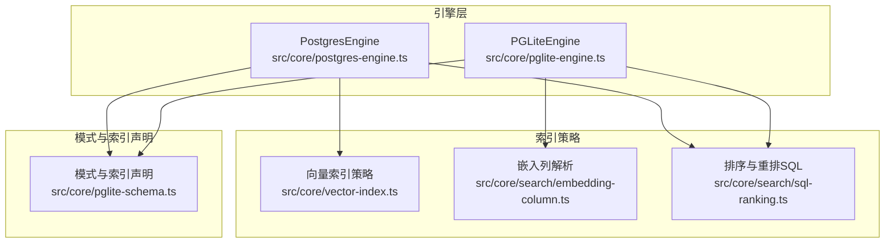
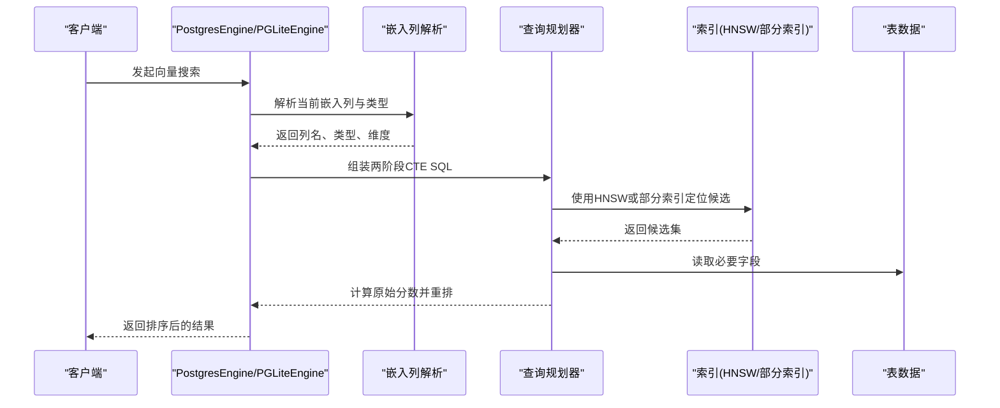
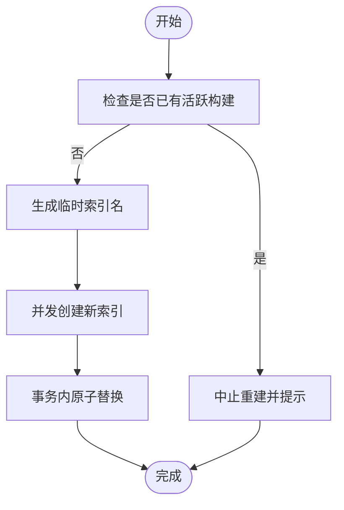
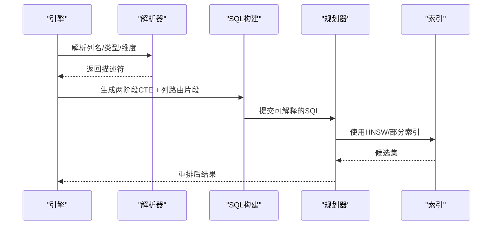
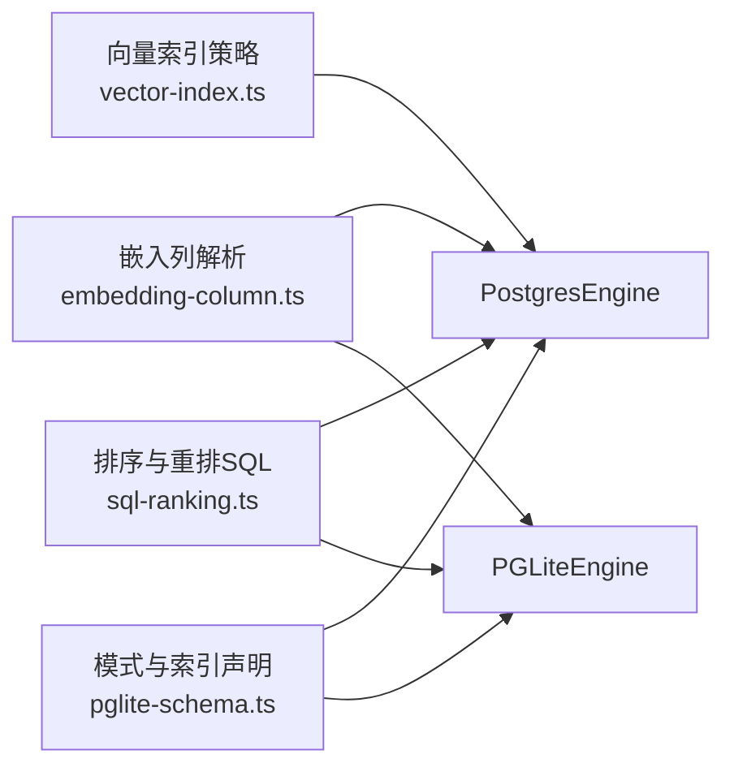

# 索引与性能优化

<cite>
**本文引用的文件**
- [src/core/vector-index.ts](file://src/core/vector-index.ts)
- [src/core/pglite-schema.ts](file://src/core/pglite-schema.ts)
- [src/core/postgres-engine.ts](file://src/core/postgres-engine.ts)
- [src/core/pglite-engine.ts](file://src/core/pglite-engine.ts)
- [src/core/search/embedding-column.ts](file://src/core/search/embedding-column.ts)
- [src/core/search/sql-ranking.ts](file://src/core/search/sql-ranking.ts)
- [test/vector-index-lifecycle.test.ts](file://test/vector-index-lifecycle.test.ts)
- [test/e2e/embedding-column-postgres.test.ts](file://test/e2e/embedding-column-postgres.test.ts)
- [test/e2e/v0_28_5-fix-wave.test.ts](file://test/e2e/v0_28_5-fix-wave.test.ts)
- [test/migrations-v0_27_1.test.ts](file://test/migrations-v0_27_1.test.ts)
- [test/pglite-engine.test.ts](file://test/pglite-engine.test.ts)
- [test/query-cache.test.ts](file://test/query-cache.test.ts)
- [test/schema-bootstrap-coverage.test.ts](file://test/schema-bootstrap-coverage.test.ts)
</cite>

## 目录
1. [简介](#简介)
2. [项目结构](#项目结构)
3. [核心组件](#核心组件)
4. [架构总览](#架构总览)
5. [详细组件分析](#详细组件分析)
6. [依赖关系分析](#依赖关系分析)
7. [性能考量](#性能考量)
8. [故障排查指南](#故障排查指南)
9. [结论](#结论)
10. [附录](#附录)

## 简介
本文件系统性梳理 GBrain 的数据库索引策略与性能优化方案，覆盖以下主题：
- 索引类型选择：B-tree、GIN、HNSW 向量索引的适用场景与边界
- 复合索引设计原则与查询优化效果
- 部分索引在特定查询场景中的应用
- 全文检索 TSVECTOR 的构建与使用
- 向量相似度搜索的索引策略与性能调优
- 索引生命周期管理与维护策略
- 查询计划分析与性能监控指标
- 不同查询模式下的索引选择最佳实践

## 项目结构
围绕索引与性能优化的关键代码分布在如下模块：
- 向量索引策略与生命周期管理：src/core/vector-index.ts
- 模式定义与索引声明：src/core/pglite-schema.ts
- 引擎层查询实现与索引使用：src/core/postgres-engine.ts、src/core/pglite-engine.ts
- 嵌入列路由与动态解析：src/core/search/embedding-column.ts
- 排序与重排 SQL 构建：src/core/search/sql-ranking.ts
- 测试用例验证索引行为与回归：多个 test/* 文件

图表来源
- [src/core/postgres-engine.ts](file://src/core/postgres-engine.ts)
- [src/core/pglite-engine.ts](file://src/core/pglite-engine.ts)
- [src/core/vector-index.ts](file://src/core/vector-index.ts)
- [src/core/search/embedding-column.ts](file://src/core/search/embedding-column.ts)
- [src/core/search/sql-ranking.ts](file://src/core/search/sql-ranking.ts)
- [src/core/pglite-schema.ts](file://src/core/pglite-schema.ts)

章节来源
- [src/core/vector-index.ts](file://src/core/vector-index.ts)
- [src/core/pglite-schema.ts](file://src/core/pglite-schema.ts)
- [src/core/postgres-engine.ts](file://src/core/postgres-engine.ts)
- [src/core/pglite-engine.ts](file://src/core/pglite-engine.ts)
- [src/core/search/embedding-column.ts](file://src/core/search/embedding-column.ts)
- [src/core/search/sql-ranking.ts](file://src/core/search/sql-ranking.ts)

## 核心组件
- 向量索引策略与生命周期管理
  - HNSW 维度上限与条件索引：当维度超过阈值时跳过 HNSW，保留精确扫描能力；对图像等子集建立部分索引以降低存储与扫描成本。
  - 原子重建与竞态防护：通过临时名 + 事务原子替换，避免重建期间服务中断；并发构建不阻塞写入。
  - 僵尸索引清理：启动时探测并安全删除失效索引，避免与活跃构建冲突。
- 模式与索引声明
  - PGLite 与 Postgres 共享模式，差异在于扩展与部分索引；模式中声明了多类索引，包括 B-tree、GIN、HNSW。
- 引擎层查询实现
  - 向量搜索：两阶段 CTE，先用 HNSW 聚焦候选，再按来源因子重排，保证性能与结果质量。
  - 关键词搜索：基于 TSVECTOR 的 GIN/GIN_trgm 索引，触发器自动维护。
- 嵌入列路由
  - 动态解析当前查询使用的嵌入列（支持 vector/halfvec），并生成安全的 SQL 片段与参数绑定。

章节来源
- [src/core/vector-index.ts](file://src/core/vector-index.ts)
- [src/core/pglite-schema.ts](file://src/core/pglite-schema.ts)
- [src/core/pglite-engine.ts](file://src/core/pglite-engine.ts)
- [src/core/postgres-engine.ts](file://src/core/postgres-engine.ts)
- [src/core/search/embedding-column.ts](file://src/core/search/embedding-column.ts)

## 架构总览
下图展示向量搜索在引擎层的执行路径与索引交互：

图表来源
- [src/core/pglite-engine.ts](file://src/core/pglite-engine.ts)
- [src/core/postgres-engine.ts](file://src/core/postgres-engine.ts)
- [src/core/search/embedding-column.ts](file://src/core/search/embedding-column.ts)
- [src/core/vector-index.ts](file://src/core/vector-index.ts)

## 详细组件分析

### 向量索引策略与生命周期管理
- HNSW 维度限制
  - 当维度超过 2000 时，跳过 HNSW 创建，保留精确扫描能力，避免底层扩展不支持高维 HNSW 的问题。
- 条件索引（部分索引）
  - 图像向量仅对非空行建立 HNSW 索引，显著降低存储与扫描成本。
  - 基于时间/状态的过滤索引用于清理与增量任务。
- 原子重建流程
  - 通过临时索引名 + 事务原子替换，确保重建过程中旧索引可用，失败也不影响服务。
  - 并发构建（CONCURRENTLY）不阻塞写入。
- 僵尸索引清理
  - 启动时扫描无效索引，若无活跃构建则删除，避免碎片与查询误用。

图表来源
- [src/core/vector-index.ts](file://src/core/vector-index.ts)

章节来源
- [src/core/vector-index.ts](file://src/core/vector-index.ts)
- [test/vector-index-lifecycle.test.ts](file://test/vector-index-lifecycle.test.ts)
- [test/e2e/embedding-column-postgres.test.ts](file://test/e2e/embedding-column-postgres.test.ts)
- [test/e2e/v0_28_5-fix-wave.test.ts](file://test/e2e/v0_28_5-fix-wave.test.ts)

### 模式与索引声明（B-tree、GIN、HNSW）
- B-tree 索引
  - pages 上的类型、前端查询过滤、软删除标记、日期范围表达式等索引，支撑常见筛选与排序。
- GIN 索引
  - pages.frontmatter（JSONB）、pages.title（trigram GIN）与 content_chunks.search_vector（TSVECTOR）用于高效全文检索。
- HNSW 向量索引
  - content_chunks.embedding（主向量）与 embedding_image（图像向量）分别建立 HNSW；对图像向量采用部分索引仅覆盖非空行。

章节来源
- [src/core/pglite-schema.ts](file://src/core/pglite-schema.ts)
- [test/migrations-v0_27_1.test.ts](file://test/migrations-v0_27_1.test.ts)
- [test/pglite-engine.test.ts](file://test/pglite-engine.test.ts)

### 引擎层向量搜索实现
- 两阶段 CTE
  - 内层：利用 HNSW 或部分索引快速聚焦候选，保持纯距离排序以发挥索引优势。
  - 外层：按来源因子与页面级池化规则重排，确保每页最佳块被选中。
- 列路由与类型安全
  - 通过解析器确定列名、类型（vector/halfvec）与维度，生成安全的 SQL 片段与参数绑定，避免注入风险。
- 多模态与统一列
  - 支持 embedding_image 与 embedding_multimodal 等列，按列名与类型动态路由到对应索引。

图表来源
- [src/core/pglite-engine.ts](file://src/core/pglite-engine.ts)
- [src/core/search/embedding-column.ts](file://src/core/search/embedding-column.ts)

章节来源
- [src/core/pglite-engine.ts](file://src/core/pglite-engine.ts)
- [src/core/postgres-engine.ts](file://src/core/postgres-engine.ts)
- [src/core/search/embedding-column.ts](file://src/core/search/embedding-column.ts)

### 全文检索（TSVECTOR）构建与使用
- 触发器自动维护
  - 在插入/更新时基于 chunk_text/doc_comment/symbol_name_qualified 构建 TSVECTOR，并设置权重，减少不必要的全表扫描。
- 索引策略
  - content_chunks.search_vector 使用 GIN；title 使用 trigram GIN，提升模糊匹配效率。
- 查询路径
  - 引擎层通过关键词搜索接口直接命中 TSVECTOR 索引，测试覆盖触发器生效与短语检索。

章节来源
- [test/pglite-engine.test.ts](file://test/pglite-engine.test.ts)
- [test/migrations-v0_21_0.test.ts](file://test/migrations-v0_21_0.test.ts)
- [src/core/pglite-schema.ts](file://src/core/pglite-schema.ts)

### 复合索引设计原则与查询优化
- 设计原则
  - 将最左前缀列放在前面，使复合索引能有效支撑过滤与排序；对高选择性列优先。
  - 对于多源联邦场景，复合键需包含 source_id 以避免跨源误判。
- 实践示例
  - pages 上的 (source_id, links_extracted_at) 复合索引，支撑“按源 + 最新提取时间”的扫描。
  - content_chunks 上的 (page_id, chunk_index) 唯一索引，保障块定位与去重。
- 自动覆盖校验
  - 通过解析 schema 中的 CREATE INDEX 声明，自动生成覆盖集合，防止遗漏新增索引导致的部署楔形。

章节来源
- [src/core/pglite-schema.ts](file://src/core/pglite-schema.ts)
- [test/schema-bootstrap-coverage.test.ts](file://test/schema-bootstrap-coverage.test.ts)

### 部分索引的应用场景
- 图像向量子集
  - embedding_image 非空行才建立 HNSW，大幅降低索引规模与扫描成本。
- 清理与增量任务
  - content_chunks_stale_idx 基于 embedding IS NULL 的部分索引，支撑“仅扫描未嵌入块”的清理任务。
- 软删除与归档
  - pages_deleted_at_purge_idx 仅覆盖已删除行，便于清理流程高效扫描。

章节来源
- [src/core/pglite-schema.ts](file://src/core/pglite-schema.ts)
- [test/migrations-v0_27_1.test.ts](file://test/migrations-v0_27_1.test.ts)

### 向量相似度搜索的索引策略与性能调优
- 索引选择
  - 文本向量：HNSW（cosine 距离）；高维（>2000）时跳过 HNSW，保留精确扫描。
  - 图像向量：部分 HNSW（embedding_image IS NOT NULL）。
  - 多模态统一列：embedding_multimodal，按列名路由至对应索引。
- 性能调优
  - 两阶段 CTE：先用 HNSW 聚焦，再按来源因子重排，兼顾速度与公平性。
  - 分页与候选池化：通过 per-page 最佳块池化，避免弱块挤占有限的 top-N。
  - 列路由与类型安全：根据列类型生成正确的 cast 片段，避免隐式转换开销。

章节来源
- [src/core/vector-index.ts](file://src/core/vector-index.ts)
- [src/core/pglite-engine.ts](file://src/core/pglite-engine.ts)
- [src/core/search/embedding-column.ts](file://src/core/search/embedding-column.ts)

### 索引维护策略与定期优化建议
- 原子重建
  - 使用临时索引名 + 事务替换，失败不影响服务；并发构建不阻塞写入。
- 僵尸索引清理
  - 启动时扫描并删除失效索引，避免误删与误用。
- 监控与告警
  - 通过轮询 pg_stat_activity 与关系大小变化，跟踪长时重建进度。
- 管理命令
  - 提供强制重建开关，谨慎使用以避免与自动维护冲突。

章节来源
- [src/core/vector-index.ts](file://src/core/vector-index.ts)
- [test/vector-index-lifecycle.test.ts](file://test/vector-index-lifecycle.test.ts)

### 查询计划分析与性能监控
- 查询计划
  - 向量搜索：两阶段 CTE + HNSW 候选 + 来源因子重排；复合索引用于过滤与排序。
  - 关键词搜索：TSVECTOR GIN + trigram GIN，触发器自动维护。
- 性能监控
  - 语义缓存命中率：cosine 相似度阈值控制缓存命中粒度。
  - 查询缓存键：结合查询文本、向量启用、细节级别、扩展策略等生成唯一键，避免重复计算。
  - 建议指标：索引扫描行数、回表次数、重建耗时、缓存命中率、重排代价占比。

章节来源
- [src/core/search/sql-ranking.ts](file://src/core/search/sql-ranking.ts)
- [test/query-cache.test.ts](file://test/query-cache.test.ts)
- [test/e2e/search-quality.test.ts](file://test/e2e/search-quality.test.ts)

### 不同查询模式下的索引选择最佳实践
- 向量搜索
  - 默认使用主 embedding 列；多模态场景使用 embedding_image 或 embedding_multimodal。
  - 高维模型（>2000）自动降级为精确扫描，避免 HNSW 不支持。
- 关键词搜索
  - 优先使用 TSVECTOR GIN；标题模糊匹配使用 trigram GIN。
- 复合查询
  - 结合 B-tree + GIN/HNSW，确保过滤列在复合索引最左前缀，减少回表与全表扫描。
- 多源联邦
  - 复合键必须包含 source_id，避免跨源误判与结果污染。

章节来源
- [src/core/pglite-engine.ts](file://src/core/pglite-engine.ts)
- [src/core/pglite-schema.ts](file://src/core/pglite-schema.ts)
- [src/core/search/embedding-column.ts](file://src/core/search/embedding-column.ts)

## 依赖关系分析
- 引擎层依赖解析器进行列路由，解析器依赖配置与网关状态，最终生成安全 SQL 片段。
- PostgresEngine 在初始化时应用向量索引策略，确保 schema 与运行时一致。
- 排序与重排 SQL 构建器为引擎层提供统一的重排逻辑，保证向量与关键词搜索的一致性。

图表来源
- [src/core/search/embedding-column.ts](file://src/core/search/embedding-column.ts)
- [src/core/vector-index.ts](file://src/core/vector-index.ts)
- [src/core/search/sql-ranking.ts](file://src/core/search/sql-ranking.ts)
- [src/core/pglite-schema.ts](file://src/core/pglite-schema.ts)
- [src/core/postgres-engine.ts](file://src/core/postgres-engine.ts)
- [src/core/pglite-engine.ts](file://src/core/pglite-engine.ts)

章节来源
- [src/core/search/embedding-column.ts](file://src/core/search/embedding-column.ts)
- [src/core/vector-index.ts](file://src/core/vector-index.ts)
- [src/core/search/sql-ranking.ts](file://src/core/search/sql-ranking.ts)
- [src/core/pglite-schema.ts](file://src/core/pglite-schema.ts)
- [src/core/postgres-engine.ts](file://src/core/postgres-engine.ts)
- [src/core/pglite-engine.ts](file://src/core/pglite-engine.ts)

## 性能考量
- 索引选择
  - B-tree：适合等值/范围过滤与排序；对高选择性列优先。
  - GIN：适合 JSONB、全文检索；注意权重与 trigram 的组合使用。
  - HNSW：适合高维向量近似最近邻；超过维度上限自动降级。
- 查询优化
  - 两阶段 CTE：先聚焦后重排，平衡性能与公平性。
  - 复合索引：将过滤列置于最左前缀，减少回表与全表扫描。
  - 部分索引：仅覆盖子集，降低索引维护成本。
- 运行时优化
  - 语义缓存：基于向量相似度阈值命中，减少重复计算。
  - 列路由：按类型生成正确 cast，避免隐式转换。

## 故障排查指南
- HNSW 建造失败或僵尸索引
  - 使用生命周期管理工具清理失效索引；确认无活跃构建后再操作。
- 并发重建冲突
  - 若检测到活跃构建（含自动维护），避免强制重建；等待完成后重试。
- 维度上限问题
  - 高维模型（>2000）会跳过 HNSW，使用精确扫描；确认模型维度与索引策略一致。
- 缓存命中异常
  - 检查查询缓存键（查询文本、向量启用、细节级别、扩展策略）是否一致；核对向量空间一致性。

章节来源
- [src/core/vector-index.ts](file://src/core/vector-index.ts)
- [test/vector-index-lifecycle.test.ts](file://test/vector-index-lifecycle.test.ts)
- [test/query-cache.test.ts](file://test/query-cache.test.ts)

## 结论
GBrain 的索引体系以“类型适配 + 场景优化”为核心：B-tree 与 GIN 覆盖结构化与全文检索，HNSW 与部分索引满足高维向量近似检索需求；通过两阶段 CTE、复合索引与列路由，实现高性能与可维护性的平衡。配合生命周期管理与监控指标，可在生产环境中稳定运行并持续优化。

## 附录
- 相关测试用例
  - 向量索引生命周期与原子重建：[test/vector-index-lifecycle.test.ts](file://test/vector-index-lifecycle.test.ts)
  - Postgres 下半精度向量与 HNSW 可见性：[test/e2e/embedding-column-postgres.test.ts](file://test/e2e/embedding-column-postgres.test.ts)
  - 大维度模型（>2000）跳过 HNSW：[test/e2e/v0_28_5-fix-wave.test.ts](file://test/e2e/v0_28_5-fix-wave.test.ts)
  - 部分 HNSW 索引可查询性验证：[test/migrations-v0_27_1.test.ts](file://test/migrations-v0_27_1.test.ts)
  - TSVECTOR 触发器与全文检索：[test/pglite-engine.test.ts](file://test/pglite-engine.test.ts)
  - 语义缓存命中与阈值：[test/query-cache.test.ts](file://test/query-cache.test.ts)
  - 模式索引声明自检：[test/schema-bootstrap-coverage.test.ts](file://test/schema-bootstrap-coverage.test.ts)