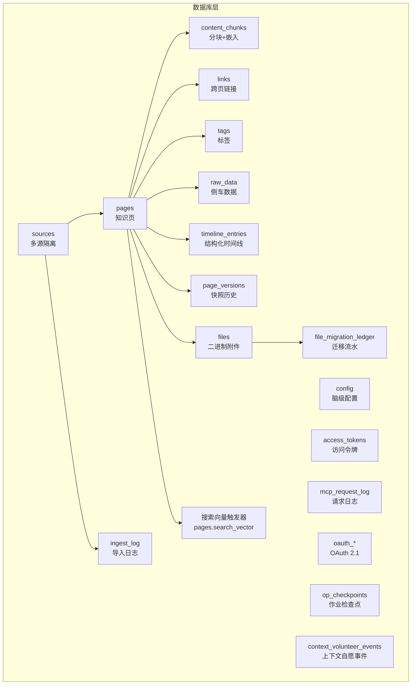
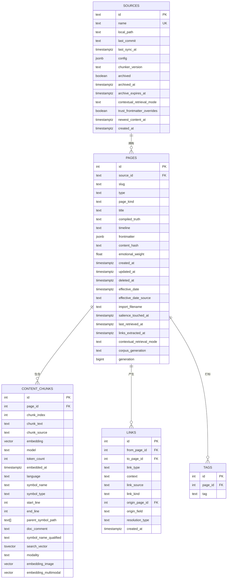
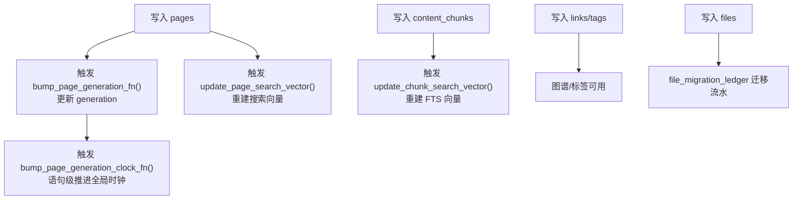

# 表结构设计

<cite>
**本文档引用的文件**
- [schema.sql](file://src/schema.sql)
- [GBRAIN_RECOMMENDED_SCHEMA.md](file://docs/GBRAIN_RECOMMENDED_SCHEMA.md)
- [GBRAIN_V0.md](file://docs/GBRAIN_V0.md)
- [embedding-migrations.md](file://docs/embedding-migrations.md)
- [v0.18.0.md](file://skills/migrations/v0.18.0.md)
- [build-schema.sh](file://scripts/build-schema.sh)
</cite>

## 目录
1. [引言](#引言)
2. [项目结构](#项目结构)
3. [核心组件](#核心组件)
4. [架构总览](#架构总览)
5. [详细组件分析](#详细组件分析)
6. [依赖分析](#依赖分析)
7. [性能考量](#性能考量)
8. [故障排查指南](#故障排查指南)
9. [结论](#结论)
10. [附录](#附录)

## 引言
本文件系统化梳理 GBrain 的数据库表结构设计，聚焦核心表（sources、pages、content_chunks、links、tags）的设计目标、字段语义与数据类型选择，解释外键关系、唯一约束与检查约束的作用机制，阐述 JSONB 字段的使用模式与查询优化策略，给出表间关系映射与数据流分析，并补充表结构演进历史与版本兼容性说明，最后讨论软删除、时间戳字段与审计日志的设计考虑。

## 项目结构
GBrain 的数据库层以 Postgres + pgvector 为核心，采用“知识页 + 嵌入 + 关系图”的三层结构：页面内容（compiled_truth + timeline）、向量嵌入（semantic chunk + multimodal）、跨页链接（typed links）。schema.sql 是单一事实来源，通过脚本生成嵌入式常量供编译产物使用。

图表来源
- [schema.sql:26-806](file://src/schema.sql#L26-L806)
- [schema.sql:813-843](file://src/schema.sql#L813-L843)

章节来源
- [schema.sql:1-80](file://src/schema.sql#L1-L80)
- [build-schema.sh:1-16](file://scripts/build-schema.sh#L1-L16)

## 核心组件
本节对关键表进行逐项解析，包括字段含义、数据类型、约束与索引策略，以及与业务流程的对应关系。

- sources（多源隔离）
  - 设计目的：统一管理“知识域”或“仓库”，支持联邦/隔离两种搜索模式；为每条页面、文件、导入记录提供逻辑归属。
  - 关键字段与类型：id（主键，文本）、name（唯一）、local_path（可选）、config（JSONB，前向兼容）、chunker_version（升级触发重切分）、archived/archived_at/archive_expires_at（软删除与回收期）、contextual_retrieval_mode/trust_frontmatter_overrides（检索模式与信任边界）、newest_content_at（远端最新提交时间缓存）、created_at（默认 now）。
  - 约束与索引：主键；唯一索引 name；部分表达式索引基于 config->>'github_repo' 支持按仓库查找；种子行 default 源并设置 federated=true。
  - 版本演进：v0.18.0 引入多源隔离；v0.40.3.0 新增 per-source CR 模式覆盖与信任边界；v0.41.32.0 新增 newest_content_at 以维持信任边界。
  
- pages（知识页）
  - 设计目的：承载 compiled_truth（综合评估）、timeline（追加证据）、frontmatter（结构化元数据）、标签、时间戳与软删除。
  - 关键字段与类型：id（自增主键）、source_id（外键到 sources）、slug（与 source_id 组合唯一）、type/page_kind（类型与种类，含检查约束）、title、compiled_truth、timeline、frontmatter（JSONB）、content_hash、emotional_weight（情感权重）、created_at/updated_at（默认 now）、deleted_at（软删除）、effective_date/effective_date_source/import_filename/salience_touched_at（日期有效性与热度追踪）、last_retrieved_at（检索新鲜度）、links_extracted_at（链接抽取水位）、contextual_retrieval_mode/corpus_generation（检索模式与生成版本）、generation（缓存失效门闩）。
  - 约束与索引：UNIQUE(source_id, slug)；多类表达式/部分索引支持检索过滤与排序；generation 列与全局时钟序列配合实现无锁缓存失效。
  - 触发器：bump_page_generation_fn 在写入时更新 generation；bump_page_generation_clock_fn 在语句级提升全局时钟，避免删除/非最大页导致的静默陈旧缓存。
  
- content_chunks（分块与嵌入）
  - 设计目的：对页面内容进行细粒度切分，存储文本、代码符号信息、向量嵌入及多模态向量，支撑语义检索与代码图谱。
  - 关键字段与类型：id（自增主键）、page_id（外键到 pages）、chunk_index、chunk_text、chunk_source（默认 compiled_truth）、embedding（向量，维度由模型决定）、model、token_count、embedded_at、语言/符号相关列（nullable，仅代码块填充）、search_vector（FTS 向量）、modality（text/image/multimodal）、embedding_image/embedding_multimodal（多模态向量）。
  - 约束与索引：UNIQUE(page_id, chunk_index)；HNSW 索引（cosine 距离）；部分索引覆盖代码符号/语言；多模态向量 HNSW 索引；FTS GIN 索引；针对 stale 查询的复合索引。
  - 触发器：update_chunk_search_vector 在特定列变更时重建 FTS 向量。
  
- links（跨页链接）
  - 设计目的：建立 typed links，支持来源溯源（link_source）、类型（link_type）、上下文（context）、解析方式（resolution_type）、提及类链接（link_kind）与前端字段（origin_*）。
  - 关键字段与类型：id（自增主键）、from_page_id/to_page_id（双向外键）、link_type/context、link_source（检查约束，kebab 格式且长度限制）、link_kind（plain/typed_ner）、origin_page_id/origin_field（前端派生边溯源）、resolution_type（qualified/unqualified/NULL）、created_at、唯一约束包含 link_source 与 origin_page_id，确保手写边与前端派生边共存。
  - 约束与索引：UNIQUE NULLS NOT DISTINCT；多维索引支持来源、目标、类型、解析方式等过滤。
  
- tags（标签）
  - 设计目的：轻量标记，便于分类与过滤。
  - 关键字段与类型：id（自增主键）、page_id（外键）、tag（唯一索引）。
  - 约束与索引：UNIQUE(page_id, tag)；独立 tag 索引。

章节来源
- [schema.sql:26-80](file://src/schema.sql#L26-L80)
- [schema.sql:85-153](file://src/schema.sql#L85-L153)
- [schema.sql:296-329](file://src/schema.sql#L296-L329)
- [schema.sql:464-495](file://src/schema.sql#L464-L495)
- [schema.sql:505-510](file://src/schema.sql#L505-L510)

## 架构总览
下图展示核心表之间的关系与典型数据流向：页面写入触发 generation 更新与搜索向量重建；分块写入触发 FTS 向量重建；链接写入用于构建图谱；标签与侧车数据提供结构化与旁路信息；软删除与回收期保障数据治理；时间戳字段贯穿检索新鲜度与审计需求。

图表来源
- [schema.sql:26-80](file://src/schema.sql#L26-L80)
- [schema.sql:85-153](file://src/schema.sql#L85-L153)
- [schema.sql:296-329](file://src/schema.sql#L296-L329)
- [schema.sql:464-495](file://src/schema.sql#L464-L495)
- [schema.sql:505-510](file://src/schema.sql#L505-L510)

## 详细组件分析

### sources 表设计
- 多源隔离与联邦搜索：通过 config.federated 控制是否参与默认搜索；v0.18.0 引入 per-source CR 模式覆盖与信任边界字段。
- 软删除：archived/archived_at/archive_expires_at 支持 72 小时回收期，Autopilot 清理过期软删记录。
- 版本兼容：seed default 源并设置 federated=true，保证旧版行为一致。

章节来源
- [schema.sql:26-58](file://src/schema.sql#L26-L58)
- [v0.18.0.md:1-26](file://skills/migrations/v0.18.0.md#L1-L26)

### pages 表设计
- 结构化两层：compiled_truth（综合评估）+ timeline（追加证据），frontmatter（JSONB）承载可查询元数据。
- 写入一致性：generation 列与全局时钟序列配合，确保缓存失效门闩在写入路径上被正确推进，避免删除/非最大页导致的静默陈旧。
- 搜索向量：通过触发器在 pages 上维护 search_vector，聚合标题、compiled_truth、timeline 与结构化时间线摘要，支持混合检索。
- 时间戳与新鲜度：last_retrieved_at、links_extracted_at 用于“陈旧页面”与“链接抽取陈旧”检测；effective_date 与 salience_touched_at 支持热度/时效窗口。

章节来源
- [schema.sql:85-153](file://src/schema.sql#L85-L153)
- [schema.sql:155-195](file://src/schema.sql#L155-L195)
- [schema.sql:218-254](file://src/schema.sql#L218-L254)
- [schema.sql:813-843](file://src/schema.sql#L813-L843)

### content_chunks 表设计
- 分块粒度：支持语义分块（面向 compiled_truth）与递归分块（面向 timeline），并保留 LLM 指导分块能力。
- 向量与多模态：embedding（文本向量）、embedding_image（图像向量）、embedding_multimodal（统一多模态向量），维度由模型决定。
- FTS 与索引：search_vector（doc_comment + symbol_name_qualified + chunk_text）；HNSW 索引（cosine 距离）；部分索引覆盖代码符号/语言/多模态向量。
- 触发器：update_chunk_search_vector 在 chunk_text/doc_comment/symbol_name_qualified 变更时重建 FTS 向量。

章节来源
- [schema.sql:296-329](file://src/schema.sql#L296-L329)
- [schema.sql:354-373](file://src/schema.sql#L354-L373)

### links 表设计
- 来源溯源：link_source 使用 kebab 格式校验，长度不超过 64；origin_page_id/origin_field 支持前端派生边溯源。
- 类型与解析：link_type、context、resolution_type（qualified/unqualified/NULL）；link_kind 区分“纯提及”与“命名实体识别派生类型链接”。
- 唯一性：包含 link_source 与 origin_page_id，允许同一 (from,to,type) 下手写边与前端派生边并存。

章节来源
- [schema.sql:464-495](file://src/schema.sql#L464-L495)

### tags 表设计
- 轻量标记：UNIQUE(page_id, tag)，支持快速过滤与聚合。

章节来源
- [schema.sql:505-510](file://src/schema.sql#L505-L510)

### JSONB 字段使用模式与查询优化
- frontmatter（pages）：支持复杂元数据查询与过滤，配合 GIN 索引；建议使用参数化查询避免计划抖动。
- config（sources）：前向兼容槽位，支持 webhook 配置与 ACL；部分表达式索引加速按仓库查找。
- raw_data.data：侧车数据，按 source 分组存储，支持按页查询与去重。
- links.origin_*：前端派生边溯源字段，配合 link_source 实现“手写边 vs 派生边”的共存。
- eval_candidates.eval_capture_failures：审计与失败重试，配合 TTL 清理。

章节来源
- [schema.sql:32-32](file://src/schema.sql#L32-L32)
- [schema.sql:98-98](file://src/schema.sql#L98-L98)
- [schema.sql:219-220](file://src/schema.sql#L219-L220)
- [schema.sql:521-521](file://src/schema.sql#L521-L521)
- [schema.sql:482-483](file://src/schema.sql#L482-L483)
- [schema.sql:1148-1149](file://src/schema.sql#L1148-L1149)

### 缓存失效与版本兼容
- generation 列（pages）+ 全局时钟序列：写入路径推进 generation；语句级触发器提升全局时钟，避免删除/非最大页导致的静默陈旧缓存。
- embedding 模型切换：相同维度模型可自动重嵌；不同维度需执行“清空 + ALTER COLUMN TYPE + 重建索引”或 PGLite 的“备份 + 重新初始化 + 重同步”。

章节来源
- [schema.sql:155-195](file://src/schema.sql#L155-L195)
- [schema.sql:218-254](file://src/schema.sql#L218-L254)
- [embedding-migrations.md:1-53](file://docs/embedding-migrations.md#L1-L53)

### 软删除、时间戳与审计
- 软删除：sources 的 archived/archived_at/archive_expires_at；pages 的 deleted_at；Autopilot 清理过期软删记录。
- 审计日志：mcp_request_log 记录操作、状态、耗时与错误；ingest_log 记录导入摘要与影响范围；access_tokens 记录令牌生命周期；oauth_* 记录客户端与令牌；migration_impact_log 记录整改前后指标变化。
- 时间戳：大量字段使用 TIMESTAMPTZ，默认 now()，支持新鲜度检测与排序。

章节来源
- [schema.sql:43-45](file://src/schema.sql#L43-L45)
- [schema.sql:106-110](file://src/schema.sql#L106-L110)
- [schema.sql:616-626](file://src/schema.sql#L616-L626)
- [schema.sql:570-578](file://src/schema.sql#L570-L578)
- [schema.sql:601-609](file://src/schema.sql#L601-L609)
- [schema.sql:631-653](file://src/schema.sql#L631-L653)
- [schema.sql:949-983](file://src/schema.sql#L949-L983)

## 依赖分析
- 外键关系
  - pages.source_id → sources.id（级联删除）
  - content_chunks.page_id → pages.id（级联删除）
  - links.from_page_id/to_page_id → pages.id（级联删除）
  - tags.page_id → pages.id（级联删除）
  - raw_data.page_id → pages.id（级联删除）
  - files.page_id → pages.id（SET NULL）
  - file_migration_ledger.file_id → files.id（级联删除）
  - oauth_clients.source_id → sources.id（RESTRICT）
- 约束与检查
  - page_kind 的 CHECK (IN 'markdown','code','image')
  - link_source 的格式与长度检查
  - link_kind 的枚举检查
  - op_checkpoints.completed_keys 的数组检查
  - 多表的非负数/正数检查与状态枚举检查
- 索引策略
  - pages：多类表达式/部分索引覆盖检索、排序、软删清理、链接抽取陈旧扫描、日期范围过滤。
  - content_chunks：HNSW（cosine）、部分 HNSW（多模态）、FTS GIN、符号/语言/陈旧扫描索引。
  - links：来源/目标/类型/解析方式索引。
  - tags：tag/page_id 独立索引。

图表来源
- [schema.sql:163-188](file://src/schema.sql#L163-L188)
- [schema.sql:243-254](file://src/schema.sql#L243-L254)
- [schema.sql:818-843](file://src/schema.sql#L818-L843)
- [schema.sql:359-373](file://src/schema.sql#L359-L373)
- [schema.sql:798-806](file://src/schema.sql#L798-L806)

章节来源
- [schema.sql:88-88](file://src/schema.sql#L88-L88)
- [schema.sql:298-298](file://src/schema.sql#L298-L298)
- [schema.sql:466-467](file://src/schema.sql#L466-L467)
- [schema.sql:507-507](file://src/schema.sql#L507-L507)
- [schema.sql:519-520](file://src/schema.sql#L519-L520)
- [schema.sql:799-799](file://src/schema.sql#L799-L799)

## 性能考量
- 混合检索：HNSW（cosine）+ tsvector（FTS）+ pg_trgm（模糊匹配）组合，结合 RRF 融合与去重策略。
- 索引选择：按查询模式选择 B-tree/GIN/HNSW；部分索引覆盖常见过滤条件；表达式索引加速 COALESCE(effective_date, updated_at)。
- 写入路径：触发器最小化重建范围；批量写入时优先使用语句级触发器推进全局时钟。
- 向量维度：相同维度可自动重嵌；不同维度需清空 + ALTER COLUMN TYPE + 重建索引（Postgres）或 PGLite 备份重初始化。
- 并发控制：全局时钟使用 nextval() 替代行级锁，减少写入竞争。

## 故障排查指南
- 向量维度不一致：执行“清空 + ALTER COLUMN TYPE + 重建索引”（Postgres）或“备份 + 重新初始化 + 重同步”（PGLite）。
- 软删除误删：确认 archived/deleted_at 是否处于回收期；Autopilot 会在到期后硬删除。
- 检索结果异常：检查 pages.search_vector 是否重建；确认 links_extracted_at 是否陈旧；核对 effective_date 与 salience_touched_at。
- 导入失败：查看 ingest_log 摘要与 pages_updated；检查 mcp_request_log 错误信息。
- 缓存陈旧：确认 generation 与时钟序列是否推进；必要时触发“重嵌陈旧”流程。

章节来源
- [embedding-migrations.md:107-152](file://docs/embedding-migrations.md#L107-L152)
- [schema.sql:1148-1151](file://src/schema.sql#L1148-L1151)
- [schema.sql:570-578](file://src/schema.sql#L570-L578)
- [schema.sql:616-626](file://src/schema.sql#L616-L626)

## 结论
GBrain 的表结构围绕“知识页 + 嵌入 + 关系图”展开，通过多源隔离、软删除、时间戳与缓存失效门闩、JSONB 前向兼容、表达式与部分索引等手段，在可扩展性、可维护性与查询性能之间取得平衡。演进过程中持续引入联邦搜索、检索模式覆盖、多模态向量与缓存时钟等特性，逐步完善检索质量与运维可观测性。

## 附录
- 表结构演进要点
  - v0.18.0：引入 sources 表与多源隔离，页面 slug 从全局唯一改为 source_id + slug 复合唯一。
  - v0.26.5：软删除字段引入，Autopilot 清理回收期过期记录。
  - v0.40.3.0：per-source 检索模式覆盖、信任边界、缓存失效门闩与时钟序列。
  - v0.41.32.0：新增 newest_content_at 以维持远端信任边界。
  - v0.42.7：新增 links_extracted_at 与 pages_links_extracted_at 索引，支持链接抽取陈旧检测。
- 数据模型参考
  - GBRAIN_RECOMMENDED_SCHEMA.md 提供知识页两层结构（compiled_truth + timeline）与文件层约定。
  - GBRAIN_V0.md 展示 v0 的整体架构与搜索管线。

章节来源
- [v0.18.0.md:28-50](file://skills/migrations/v0.18.0.md#L28-L50)
- [schema.sql:33-56](file://src/schema.sql#L33-L56)
- [schema.sql:127-134](file://src/schema.sql#L127-L134)
- [GBRAIN_RECOMMENDED_SCHEMA.md:37-47](file://docs/GBRAIN_RECOMMENDED_SCHEMA.md#L37-L47)
- [GBRAIN_V0.md:24-61](file://docs/GBRAIN_V0.md#L24-L61)