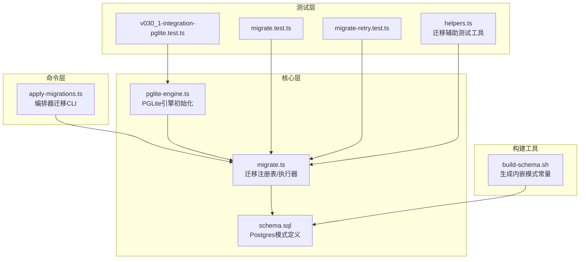
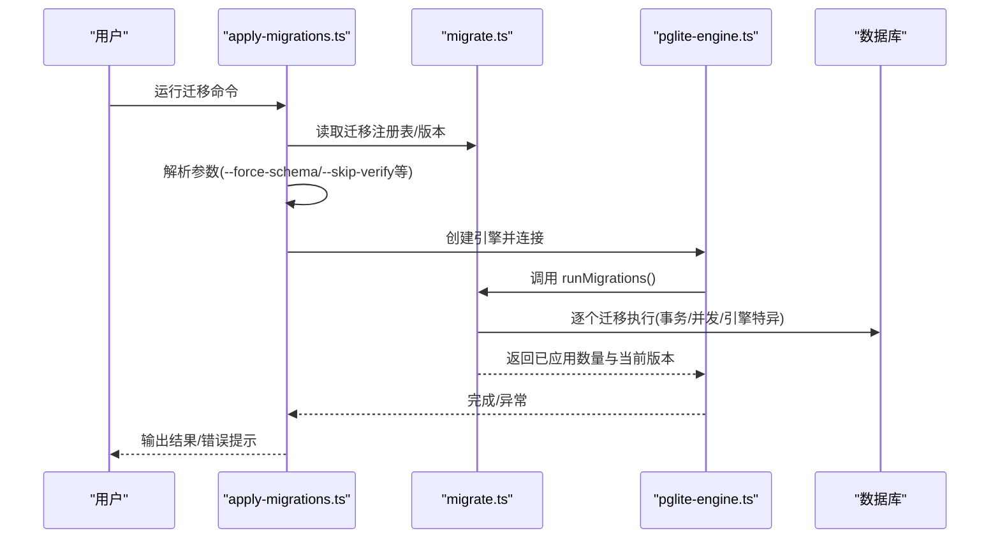
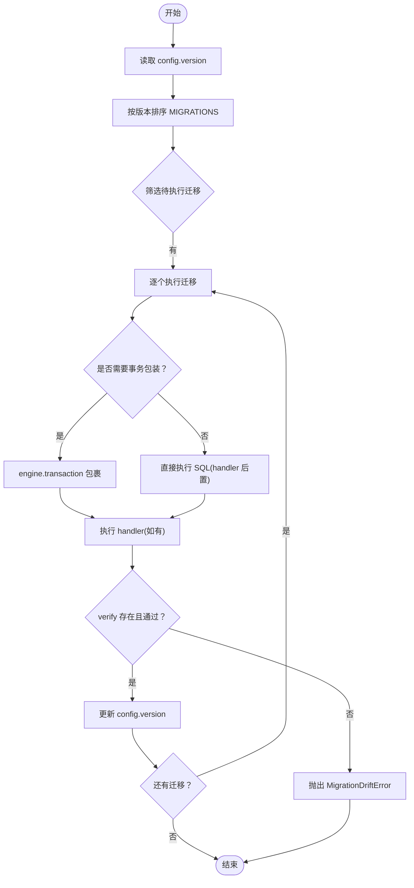
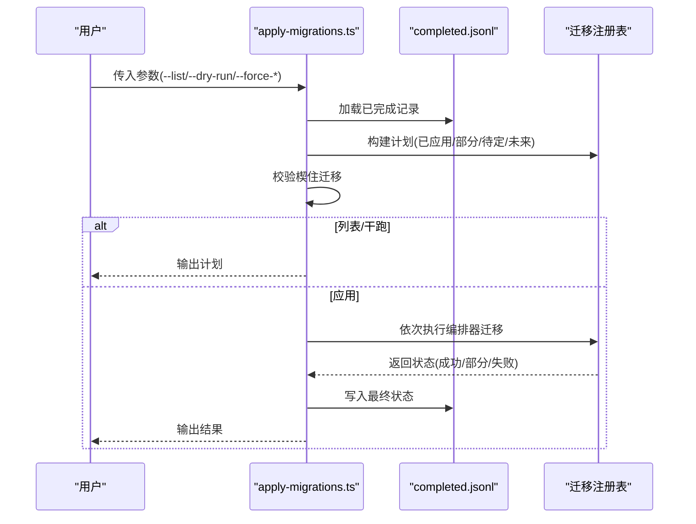
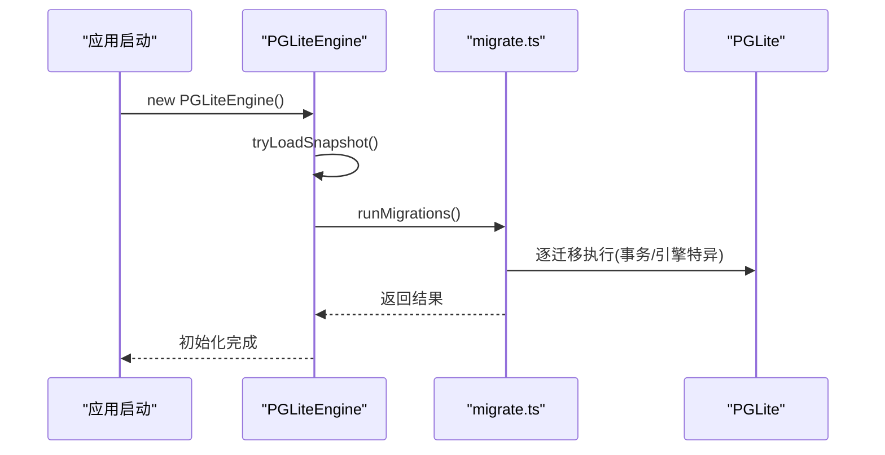
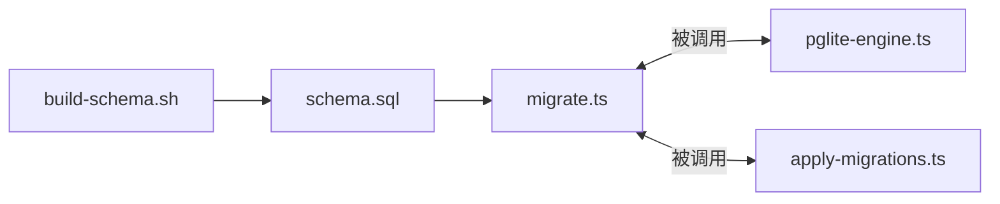

# 迁移与版本管理

<cite>
**本文引用的文件**
- [migrate.ts](file://src/core/migrate.ts)
- [apply-migrations.ts](file://src/commands/apply-migrations.ts)
- [pglite-engine.ts](file://src/core/pglite-engine.ts)
- [schema.sql](file://src/schema.sql)
- [helpers.ts](file://test/e2e/helpers.ts)
- [migrate.test.ts](file://test/migrate.test.ts)
- [migrate-retry.test.ts](file://test/migrate-retry.test.ts)
- [build-schema.sh](file://scripts/build-schema.sh)
- [v030_1-integration-pglite.test.ts](file://test/e2e/v030_1-integration-pglite.test.ts)
</cite>

## 目录
1. [简介](#简介)
2. [项目结构](#项目结构)
3. [核心组件](#核心组件)
4. [架构总览](#架构总览)
5. [详细组件分析](#详细组件分析)
6. [依赖关系分析](#依赖关系分析)
7. [性能考量](#性能考量)
8. [故障排查指南](#故障排查指南)
9. [结论](#结论)
10. [附录](#附录)

## 简介
本文件系统化阐述 GBrain 的数据库迁移与版本管理体系：涵盖迁移架构设计、版本号管理、迁移脚本组织、回滚机制、增量与全量迁移差异、测试策略与验证方法、数据完整性与约束校验、向后兼容与破坏性变更处理、失败恢复与手动修复路径，以及最佳实践与常见问题。

## 项目结构
- 迁移核心在 src/core/migrate.ts 中以“内嵌迁移注册表”的方式维护，每个迁移条目包含版本号、名称、SQL（或引擎特定 SQL）、事务控制、处理器函数与可选的自检钩子。
- CLI 命令 src/commands/apply-migrations.ts 负责应用“编排器迁移”（文件系统/主机侧），并与 schema 迁移解耦。
- 引擎层 src/core/pglite-engine.ts 在 PGLite 初始化时调用 runMigrations，确保本地嵌入式数据库的模式一致性。
- 模式定义 src/schema.sql 是 Postgres 的权威来源；scripts/build-schema.sh 将其转为内嵌常量供二进制使用。
- 测试覆盖包括迁移执行、重试、幂等性、回滚日志、PGLite 集成等场景。

图表来源
- [apply-migrations.ts:1-507](file://src/commands/apply-migrations.ts#L1-L507)
- [migrate.ts:1-800](file://src/core/migrate.ts#L1-L800)
- [pglite-engine.ts:1-200](file://src/core/pglite-engine.ts#L1-L200)
- [schema.sql:1-800](file://src/schema.sql#L1-L800)
- [migrate.test.ts:1075-1181](file://test/migrate.test.ts#L1075-L1181)
- [migrate-retry.test.ts:65-191](file://test/migrate-retry.test.ts#L65-L191)
- [helpers.ts:232-294](file://test/e2e/helpers.ts#L232-L294)
- [v030_1-integration-pglite.test.ts:28-65](file://test/e2e/v030_1-integration-pglite.test.ts#L28-L65)
- [build-schema.sh:1-16](file://scripts/build-schema.sh#L1-L16)

章节来源
- [migrate.ts:1-800](file://src/core/migrate.ts#L1-L800)
- [apply-migrations.ts:1-507](file://src/commands/apply-migrations.ts#L1-L507)
- [pglite-engine.ts:1-200](file://src/core/pglite-engine.ts#L1-L200)
- [schema.sql:1-800](file://src/schema.sql#L1-L800)
- [build-schema.sh:1-16](file://scripts/build-schema.sh#L1-L16)

## 核心组件
- 迁移注册表与元数据
  - 每个迁移对象包含：version、name、sql/sqlFor、transaction、handler、idempotent、verify。
  - 默认 idempotent 为 true（除非显式设为 false）；verify 用于“后置条件探测”，非幂等迁移需通过 verify 防止漂移。
- 执行器与错误模型
  - runMigrations 对比当前配置版本与注册表，按顺序执行未完成迁移；每个迁移在独立事务中运行（除非显式关闭 transaction）。
  - 提供 MigrationRetryExhausted、MigrationDriftError 等错误类型，指导重试与手动修复。
- 版本管理
  - config.version 记录当前模式版本；LATEST_VERSION 通过 Math.max 注册表版本计算，避免数组索引错误。
- 引擎适配
  - 支持引擎特定 SQL（如 Postgres 的 CONCURRENTLY），PGLite 与 Postgres 分离执行路径。
- 编排器迁移
  - apply-migrations.ts 管理“文件系统/主机侧”的编排器迁移，与 schema 迁移解耦，支持强制重试、跳过验证、列表/干跑等。

章节来源
- [migrate.ts:17-85](file://src/core/migrate.ts#L17-L85)
- [migrate.ts:115-796](file://src/core/migrate.ts#L115-L796)
- [migrate.ts:5696-5720](file://src/core/migrate.ts#L5696-L5720)
- [apply-migrations.ts:23-46](file://src/commands/apply-migrations.ts#L23-L46)
- [apply-migrations.ts:329-355](file://src/commands/apply-migrations.ts#L329-L355)

## 架构总览
下图展示从 CLI 到引擎再到迁移执行的整体流程，以及关键错误与恢复点：

图表来源
- [apply-migrations.ts:333-355](file://src/commands/apply-migrations.ts#L333-L355)
- [pglite-engine.ts:383-386](file://src/core/pglite-engine.ts#L383-L386)
- [migrate.ts:5696-5720](file://src/core/migrate.ts#L5696-L5720)

## 详细组件分析

### 组件A：迁移注册表与执行器
- 数据结构
  - Migration 接口字段：version、name、sql、sqlFor、transaction、handler、idempotent、verify。
  - MIGRATIONS 数组按版本顺序维护，新增迁移追加到末尾，严禁修改既有条目。
- 执行流程
  - 读取 config.version，排序后筛选待执行项。
  - 逐项执行：优先使用 sqlFor[engine.kind]，否则回退到 sql；若存在 handler 则在 SQL 后执行。
  - transaction=false 的迁移由调用方自行包装，典型用于 Postgres 的 CONCURRENTLY。
- 幂等性与自检
  - 默认 idempotent=true；对非幂等迁移，verify 成功后才允许标记完成，失败抛出 MigrationDriftError。
- 错误与重试
  - MigrationRetryExhausted 包含锁阻塞者信息，便于快速终止长事务。
  - runMigrations 内部对死锁/超时等进行诊断与提示。

图表来源
- [migrate.ts:17-85](file://src/core/migrate.ts#L17-L85)
- [migrate.ts:115-796](file://src/core/migrate.ts#L115-L796)
- [migrate.ts:5696-5720](file://src/core/migrate.ts#L5696-L5720)

章节来源
- [migrate.ts:17-85](file://src/core/migrate.ts#L17-L85)
- [migrate.ts:115-796](file://src/core/migrate.ts#L115-L796)
- [migrate.ts:5696-5720](file://src/core/migrate.ts#L5696-L5720)

### 组件B：编排器迁移 CLI（apply-migrations）
- 功能职责
  - 读取 ~/.gbrain/migrations/completed.jsonl，与迁移注册表对比，生成“已应用/部分/待定/未来”计划。
  - 支持 --dry-run、--list、--force-*、--skip-verify 等参数。
  - 对“连续部分状态”超过阈值的迁移标记为“楔住”，需 --force-retry 显式重试。
- 执行策略
  - 先处理“部分”迁移（恢复），再处理“待定”迁移。
  - 失败时写入 partial 状态，保证幂等性；成功时写入 terminal 状态。
- 与 schema 迁移的关系
  - 该 CLI 不负责执行 migrate.ts 的 schema 迁移；schema 迁移由 connectEngine/initSchema 自动触发。
  - 若发现 schema 版本落后，给出警告并建议使用 gbrain init --migrate-only。

图表来源
- [apply-migrations.ts:168-204](file://src/commands/apply-migrations.ts#L168-L204)
- [apply-migrations.ts:395-498](file://src/commands/apply-migrations.ts#L395-L498)

章节来源
- [apply-migrations.ts:168-204](file://src/commands/apply-migrations.ts#L168-L204)
- [apply-migrations.ts:395-498](file://src/commands/apply-migrations.ts#L395-L498)

### 组件C：PGLite 引擎中的迁移集成
- 初始化流程
  - PGLiteEngine 在初始化时调用 runMigrations，确保本地数据库模式与注册表一致。
  - 支持快照加速：根据迁移与模式哈希匹配决定是否加载快照。
- 并发与稳定性
  - 对于需要 CONCURRENTLY 的索引，PGLite 使用普通 CREATE（无并发写冲突）。
  - 对历史遗留迁移的 DDL 采用 idempotent 方案，避免重复执行导致的不一致。

图表来源
- [pglite-engine.ts:383-386](file://src/core/pglite-engine.ts#L383-L386)
- [pglite-engine.ts:71-135](file://src/core/pglite-engine.ts#L71-L135)

章节来源
- [pglite-engine.ts:383-386](file://src/core/pglite-engine.ts#L383-L386)
- [pglite-engine.ts:71-135](file://src/core/pglite-engine.ts#L71-L135)

### 组件D：测试与验证
- 结构化断言
  - migrate.test.ts 验证 LATEST_VERSION 正确性、迁移幂等分类、特定迁移的 SQL 行为（如 v48 的权重四舍五入与容差比较）。
- 重试与死锁
  - migrate-retry.test.ts 模拟死锁与超时，验证重试策略、轮询与超时处理、错误归类。
- 集成测试
  - helpers.ts 提供 runMigrationsUpTo/setConfigVersion 辅助，支持在测试中将脑库回放到中间版本并逐步升级。
  - v030_1-integration-pglite.test.ts 验证 PGLite 下迁移执行与版本一致性。

章节来源
- [migrate.test.ts:1075-1098](file://test/migrate.test.ts#L1075-L1098)
- [migrate.test.ts:1391-1419](file://test/migrate.test.ts#L1391-L1419)
- [migrate-retry.test.ts:65-191](file://test/migrate-retry.test.ts#L65-L191)
- [helpers.ts:232-294](file://test/e2e/helpers.ts#L232-L294)
- [v030_1-integration-pglite.test.ts:28-65](file://test/e2e/v030_1-integration-pglite.test.ts#L28-L65)

## 依赖关系分析
- 组件耦合
  - migrate.ts 作为纯逻辑模块，被 pglite-engine.ts 与 apply-migrations.ts 间接依赖。
  - apply-migrations.ts 仅负责“编排器迁移”，不直接操作数据库 DDL。
- 外部依赖
  - PGLite/WASM 运行时、Postgres 扩展（vector/pg_trgm/pgcrypto）。
  - 构建脚本 build-schema.sh 将 schema.sql 转换为内嵌常量，供运行时使用。

图表来源
- [migrate.ts:1-800](file://src/core/migrate.ts#L1-L800)
- [pglite-engine.ts:1-200](file://src/core/pglite-engine.ts#L1-L200)
- [apply-migrations.ts:1-507](file://src/commands/apply-migrations.ts#L1-L507)
- [schema.sql:1-800](file://src/schema.sql#L1-L800)
- [build-schema.sh:1-16](file://scripts/build-schema.sh#L1-L16)

章节来源
- [migrate.ts:1-800](file://src/core/migrate.ts#L1-L800)
- [pglite-engine.ts:1-200](file://src/core/pglite-engine.ts#L1-L200)
- [apply-migrations.ts:1-507](file://src/commands/apply-migrations.ts#L1-L507)
- [build-schema.sh:1-16](file://scripts/build-schema.sh#L1-L16)

## 性能考量
- 并发索引创建
  - Postgres 使用 CONCURRENTLY 避免写锁；PGLite 直接创建，避免并发写冲突。
- 批量去重与辅助索引
  - 针对大规模重复数据（链接、时间线）先建立辅助索引，再执行 O(n log n) 删除，避免超时。
- 查询缓存与生成计数器
  - pages.generation 与 page_generation_clock_seq 协同，减少 MAX(generation) 的扫描成本，提升缓存失效检测效率。
- 快照优化
  - PGLite 支持基于迁移与模式哈希的快照加载，显著缩短初始化时间。

章节来源
- [migrate.ts:498-524](file://src/core/migrate.ts#L498-L524)
- [migrate.ts:325-338](file://src/core/migrate.ts#L325-L338)
- [migrate.ts:348-359](file://src/core/migrate.ts#L348-L359)
- [pglite-engine.ts:71-135](file://src/core/pglite-engine.ts#L71-L135)
- [schema.sql:163-254](file://src/schema.sql#L163-L254)

## 故障排查指南
- 常见错误与恢复
  - 迁移失败（非幂等）：出现 MigrationDriftError，需使用 --skip-verify 或手动修复后重试。
  - 死锁/长时间占用事务：MigrationRetryExhausted 提示 PID 与终止命令，必要时清理阻塞者。
  - 超时：runMigrations 对 57014（statement timeout）进行诊断并提示。
- 楔住迁移
  - 连续多次“部分”状态达到阈值会被标记为“楔住”，需使用 --force-retry 写入重试标记后再执行。
- 手动修复路径
  - --force-schema：重放 runMigrations 从当前 config.version 开始，修复 DDL 与版本漂移。
  - --force-orchestrator/--force-all：批量重置所有楔住的编排器迁移。
- 测试辅助
  - runMigrationsUpTo/setConfigVersion 可将脑库回退到中间版本，配合测试夹具验证回滚与幂等性。

章节来源
- [migrate.ts:86-109](file://src/core/migrate.ts#L86-L109)
- [migrate.ts:5696-5720](file://src/core/migrate.ts#L5696-L5720)
- [migrate-retry.test.ts:65-191](file://test/migrate-retry.test.ts#L65-L191)
- [apply-migrations.ts:329-355](file://src/commands/apply-migrations.ts#L329-L355)
- [helpers.ts:232-294](file://test/e2e/helpers.ts#L232-L294)

## 结论
GBrain 的迁移体系以“内嵌迁移注册表 + 引擎适配 + 编排器分离”的方式实现高可靠与可演进性：通过幂等性与 verify 钩子保障数据一致性，通过事务与重试机制应对并发与异常，通过快照与批处理优化性能，并辅以完善的测试与故障恢复手段。该体系既满足生产环境的稳定性要求，也为破坏性变更提供了可控的演进路径。

## 附录

### 增量迁移与全量迁移
- 增量迁移
  - 仅执行未完成的版本迁移，按 config.version 与注册表差集计算，逐个应用。
  - 适合日常升级与小步演进。
- 全量迁移
  - 通过 --force-schema 重放 runMigrations，从当前版本起重新应用全部待定迁移。
  - 适合修复 DDL 与版本漂移或回滚后恢复。

章节来源
- [migrate.ts:5696-5720](file://src/core/migrate.ts#L5696-L5720)
- [apply-migrations.ts:329-355](file://src/commands/apply-migrations.ts#L329-L355)

### 版本号管理与向后兼容
- 版本号规则
  - 新增迁移追加到 MIGRATIONS 末尾，严禁修改既有版本内容。
  - LATEST_VERSION 通过 Math.max 计算，避免依赖数组索引。
- 向后兼容
  - 大多数迁移使用 IF NOT EXISTS/ON CONFLICT 等幂等语句，允许重复执行。
  - 非幂等迁移必须提供 verify 钩子，失败时阻止漂移。

章节来源
- [migrate.ts:1075-1098](file://test/migrate.test.ts#L1075-L1098)
- [migrate.ts:60-85](file://src/core/migrate.ts#L60-L85)

### 回滚机制
- 数据层回滚
  - 通过迁移注册表的幂等性与 IF NOT EXISTS 实现“可回退”的 DDL；对破坏性变更提供 verify 钩子。
- 日志与审计
  - v0.13.1 引入回滚日志（rollback.jsonl），记录受影响页面与来源标识，便于审计与二次修复。
- 人工干预
  - --force-schema 与 --force-retry 提供明确的人工修复入口。

章节来源
- [migrate.ts:40-85](file://src/core/migrate.ts#L40-L85)
- [migrate.ts:5696-5720](file://src/core/migrate.ts#L5696-L5720)
- [migrate.test.ts:1075-1098](file://test/migrate.test.ts#L1075-L1098)

### 数据完整性与约束验证
- 约束与索引
  - 多处迁移引入唯一约束、检查约束与索引，配合辅助索引与去重逻辑，避免 O(n²) 删除导致的超时。
- 生成计数器
  - page_generation_clock_seq 与 pages.generation 协同，确保缓存失效检测的单调性与正确性。

章节来源
- [migrate.ts:325-338](file://src/core/migrate.ts#L325-L338)
- [migrate.ts:348-359](file://src/core/migrate.ts#L348-L359)
- [schema.sql:163-254](file://src/schema.sql#L163-L254)

### 迁移测试策略与验证方法
- 结构化断言
  - 断言 LATEST_VERSION 的正确性、迁移幂等分类、特定迁移的 SQL 行为（如权重网格化与容差比较）。
- 重试与并发
  - 模拟死锁、超时、长时间占用事务，验证重试、轮询与错误归类。
- 集成与回归
  - 使用 runMigrationsUpTo/setConfigVersion 将脑库回退到中间版本，验证升级链路与幂等性。
  - PGLite 集成测试确保本地嵌入式数据库迁移一致性。

章节来源
- [migrate.test.ts:1075-1098](file://test/migrate.test.ts#L1075-L1098)
- [migrate.test.ts:1391-1419](file://test/migrate.test.ts#L1391-L1419)
- [migrate-retry.test.ts:65-191](file://test/migrate-retry.test.ts#L65-L191)
- [helpers.ts:232-294](file://test/e2e/helpers.ts#L232-L294)
- [v030_1-integration-pglite.test.ts:28-65](file://test/e2e/v030_1-integration-pglite.test.ts#L28-L65)

### 最佳实践与常见问题
- 最佳实践
  - 新增迁移必须声明 idempotent（默认 true），必要时提供 verify 钩子。
  - 对需要 CONCURRENTLY 的索引使用 sqlFor 并设置 transaction=false。
  - 大规模删除前先建立辅助索引，避免超时。
  - 使用 --dry-run 预演编排器迁移，确认影响范围。
- 常见问题
  - “楔住迁移”：使用 --force-retry 清除连续部分状态，再执行。
  - “schema 版本落后”：使用 gbrain init --migrate-only 或 --force-schema。
  - “死锁/长时间占用事务”：参考 MigrationRetryExhausted 提示终止阻塞进程。

章节来源
- [apply-migrations.ts:395-498](file://src/commands/apply-migrations.ts#L395-L498)
- [migrate.ts:86-109](file://src/core/migrate.ts#L86-L109)
- [migrate-retry.test.ts:65-191](file://test/migrate-retry.test.ts#L65-L191)