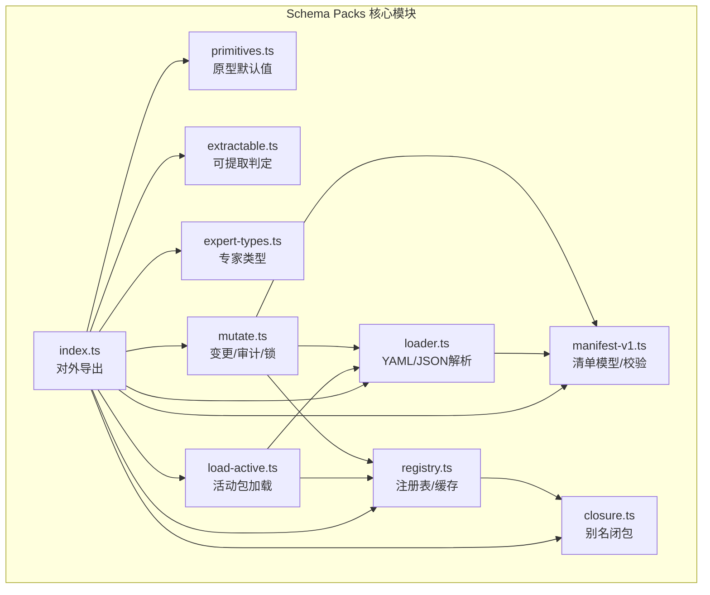
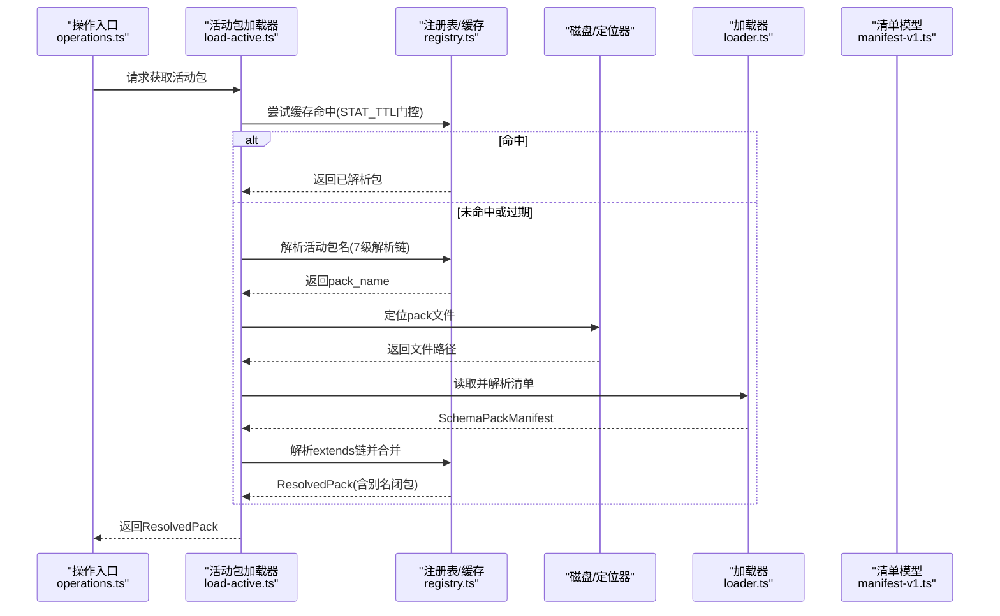
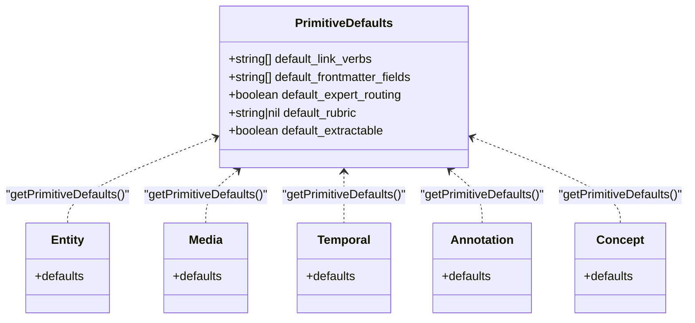
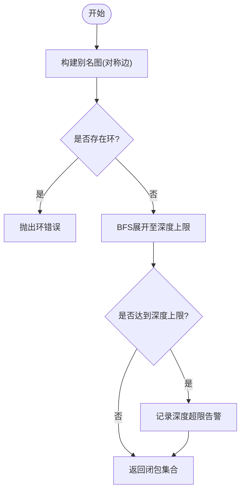
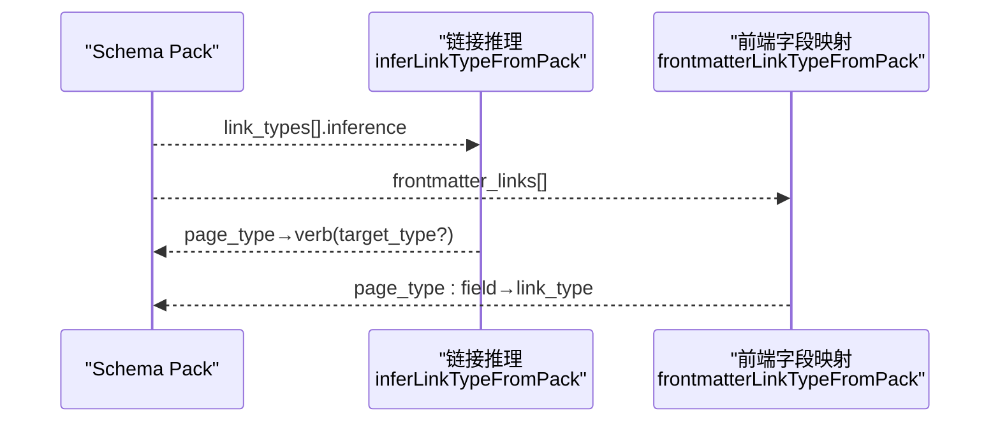
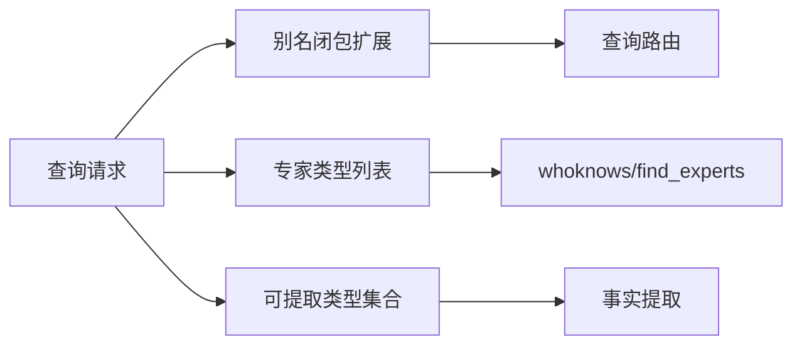
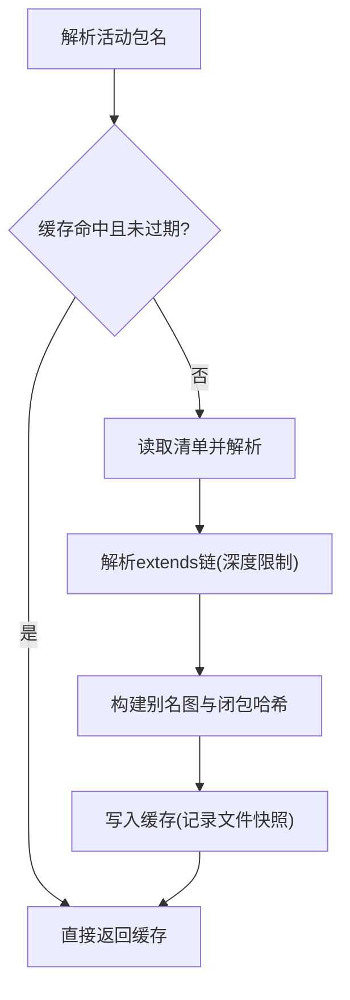
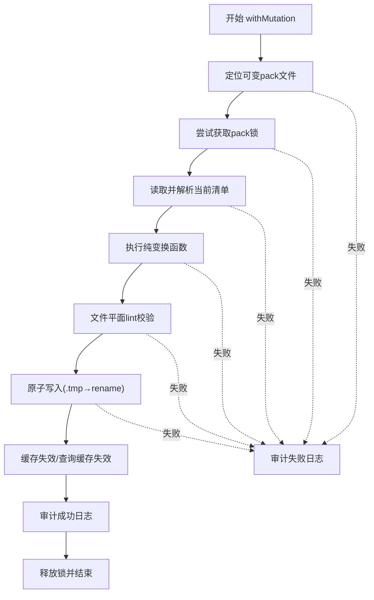
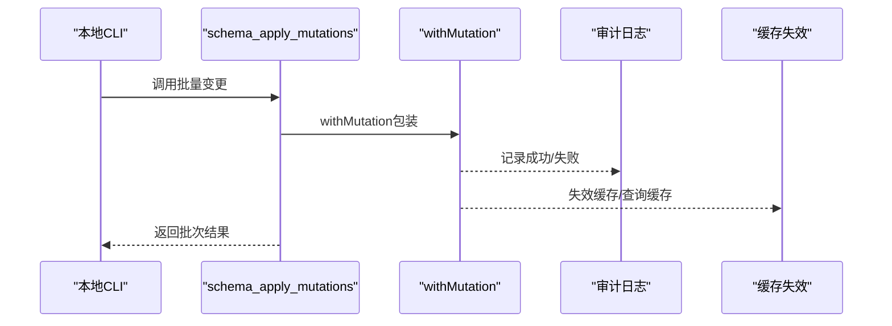
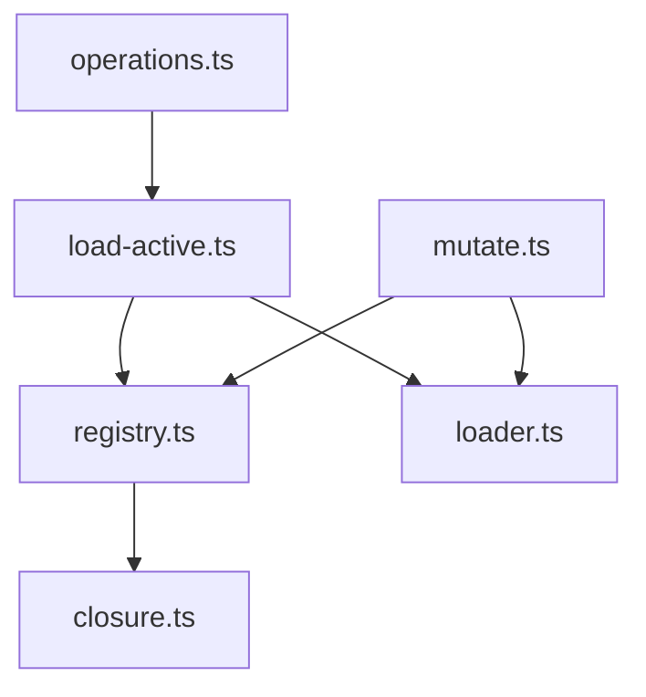

# Schema Packs架构

<cite>
**本文引用的文件**
- [index.ts](file://src/core/schema-pack/index.ts)
- [manifest-v1.ts](file://src/core/schema-pack/manifest-v1.ts)
- [loader.ts](file://src/core/schema-pack/loader.ts)
- [primitives.ts](file://src/core/schema-pack/primitives.ts)
- [closure.ts](file://src/core/schema-pack/closure.ts)
- [extractable.ts](file://src/core/schema-pack/extractable.ts)
- [expert-types.ts](file://src/core/schema-pack/expert-types.ts)
- [registry.ts](file://src/core/schema-pack/registry.ts)
- [load-active.ts](file://src/core/schema-pack/load-active.ts)
- [mutate.ts](file://src/core/schema-pack/mutate.ts)
- [operations.ts](file://src/core/operations.ts)
- [link-inference-pack.test.ts](file://test/link-inference-pack.test.ts)
- [schema-pack-loader.test.ts](file://test/schema-pack-loader.test.ts)
- [schema-pack-mutate.test.ts](file://test/schema-pack-mutate.test.ts)
- [operations-schema-pack.test.ts](file://test/operations-schema-pack.test.ts)
- [schema-pack-trust-boundary.test.ts](file://test/schema-pack-trust-boundary.test.ts)
- [schema-pack-manifest-v041_2.test.ts](file://test/schema-pack-manifest-v041_2.test.ts)
- [schema-pack-lint-rules.test.ts](file://test/schema-pack-lint-rules.test.ts)
</cite>

## 目录
1. [引言](#引言)
2. [项目结构](#项目结构)
3. [核心组件](#核心组件)
4. [架构总览](#架构总览)
5. [详细组件分析](#详细组件分析)
6. [依赖关系分析](#依赖关系分析)
7. [性能考量](#性能考量)
8. [故障排查指南](#故障排查指南)
9. [结论](#结论)
10. [附录：Schema Authoring工作流与最佳实践](#附录schema-authoring工作流与最佳实践)

## 引言
本文件系统化阐述GBrain的Schema Packs架构：如何通过“页面类型(page_types)、链接类型(link_types)、提取规则(extractable)”定义知识图谱的语义边界；如何以primitive types、type aliases、前缀匹配与类型继承构建可组合的类型系统；以及Schema Packs在查询路由、专家搜索、事实提取中的应用路径。同时给出加载、验证、应用、变更、审计与回滚的机制说明，并提供不同场景下的设计示例与作者工作流。

## 项目结构
Schema Packs相关代码集中在src/core/schema-pack目录，采用按职责分层的模块化组织：
- 入口与对外导出：index.ts
- 清单模型与校验：manifest-v1.ts
- 文件加载与解析：loader.ts
- 原型与默认行为：primitives.ts
- 类型别名闭包与查询扩展：closure.ts
- 提取能力声明与判定：extractable.ts
- 专家类型声明与路由：expert-types.ts
- 注册表与缓存：registry.ts
- 活动包加载器：load-active.ts
- 变更与审计：mutate.ts、mutate-audit.ts
- 运维操作接口：operations.ts（schema_*系列）

图表来源
- [index.ts:1-212](file://src/core/schema-pack/index.ts#L1-L212)
- [manifest-v1.ts:1-473](file://src/core/schema-pack/manifest-v1.ts#L1-L473)
- [loader.ts:1-269](file://src/core/schema-pack/loader.ts#L1-L269)
- [primitives.ts:1-91](file://src/core/schema-pack/primitives.ts#L1-L91)
- [closure.ts:1-181](file://src/core/schema-pack/closure.ts#L1-L181)
- [extractable.ts:1-129](file://src/core/schema-pack/extractable.ts#L1-L129)
- [expert-types.ts:1-63](file://src/core/schema-pack/expert-types.ts#L1-L63)
- [registry.ts:1-337](file://src/core/schema-pack/registry.ts#L1-L337)
- [load-active.ts:1-296](file://src/core/schema-pack/load-active.ts#L1-L296)
- [mutate.ts:1-645](file://src/core/schema-pack/mutate.ts#L1-L645)

章节来源
- [index.ts:1-212](file://src/core/schema-pack/index.ts#L1-L212)

## 核心组件
- 清单模型与校验：定义pack的字段、默认值、约束与版本兼容策略，支持v0.41起的校准域(calibration_domains)、v0.42起的映射规则(mapping_rules)等扩展。
- 加载器：支持YAML/JSON两种格式，提供mini YAML解析器与错误定位，确保清单一致性。
- 原型系统：五种primitive(types)驱动默认链接动词、前端字段、专家路由开关、提取能力与增强rubric。
- 别名闭包：基于显式aliases构建对称边的邻接表，BFS展开至深度上限，用于查询扩展。
- 可提取规则：声明页面类型是否可进行事实提取，支持结构化提示模板、夹具与评估维度。
- 专家类型：声明哪些类型参与专家搜索/whoknows路由。
- 注册表与缓存：多级解析链(resolveActivePackName)、extends链深度控制、进程内缓存与stat-TTL门控。
- 活动包加载器：封装解析链、磁盘定位、extends解析与缓存命中逻辑。
- 变更与审计：原子写入、变更锁、文件平面lint、审计日志、查询缓存失效与回滚保障。

章节来源
- [manifest-v1.ts:1-473](file://src/core/schema-pack/manifest-v1.ts#L1-L473)
- [loader.ts:1-269](file://src/core/schema-pack/loader.ts#L1-L269)
- [primitives.ts:1-91](file://src/core/schema-pack/primitives.ts#L1-L91)
- [closure.ts:1-181](file://src/core/schema-pack/closure.ts#L1-L181)
- [extractable.ts:1-129](file://src/core/schema-pack/extractable.ts#L1-L129)
- [expert-types.ts:1-63](file://src/core/schema-pack/expert-types.ts#L1-L63)
- [registry.ts:1-337](file://src/core/schema-pack/registry.ts#L1-L337)
- [load-active.ts:1-296](file://src/core/schema-pack/load-active.ts#L1-L296)
- [mutate.ts:1-645](file://src/core/schema-pack/mutate.ts#L1-L645)

## 架构总览
Schema Packs的运行时生命周期由“解析—加载—合并—缓存—应用”构成，贯穿查询、专家搜索、事实提取与变更管理：

图表来源
- [load-active.ts:161-175](file://src/core/schema-pack/load-active.ts#L161-L175)
- [registry.ts:107-119](file://src/core/schema-pack/registry.ts#L107-L119)
- [registry.ts:237-308](file://src/core/schema-pack/registry.ts#L237-L308)
- [loader.ts:40-72](file://src/core/schema-pack/loader.ts#L40-L72)

## 详细组件分析

### 类型系统与primitive types
- primitive种类：entity/media/temporal/annotation/concept，每种提供默认链接动词、前端字段、专家路由默认值、提取默认值与增强rubric。
- 继承与覆盖：类型仅能继承现有primitive，不能新增primitive；类型可覆盖默认值。
- 与查询扩展解耦：类型是否参与专家路由/可提取由类型字段决定，而非primitive。

图表来源
- [primitives.ts:23-90](file://src/core/schema-pack/primitives.ts#L23-L90)

章节来源
- [primitives.ts:1-91](file://src/core/schema-pack/primitives.ts#L1-L91)
- [manifest-v1.ts:28-31](file://src/core/schema-pack/manifest-v1.ts#L28-L31)

### 类型别名、前缀匹配与类型继承
- 别名闭包：显式aliases声明形成对称边，BFS展开至深度上限；检测环并在装载阶段拒绝；闭包哈希用于候选快照稳定性。
- 前缀匹配：类型声明path_prefixes，按顺序优先匹配，用于推断类型与子类型。
- 继承：extends链深度软警告(>4)与硬限制(>8)，支持从内置或用户pack继承。

图表来源
- [closure.ts:65-116](file://src/core/schema-pack/closure.ts#L65-L116)
- [closure.ts:126-158](file://src/core/schema-pack/closure.ts#L126-L158)

章节来源
- [closure.ts:1-181](file://src/core/schema-pack/closure.ts#L1-L181)
- [manifest-v1.ts:106-114](file://src/core/schema-pack/manifest-v1.ts#L106-L114)
- [registry.ts:262-275](file://src/core/schema-pack/registry.ts#L262-L275)

### 链接关系与抽取规则
- 链接类型：link_types声明名称、逆向链接、推理规则(inference.regex/page_type/target_type)。
- 前端字段链接：frontmatter_links将特定页面类型的字段映射到link_type，便于从frontmatter自动推断关系。
- 推理优先级：pack声明的推理优先于遗留逻辑；frontmatter规则独立于正则规则。

图表来源
- [link-inference-pack.test.ts:20-97](file://test/link-inference-pack.test.ts#L20-L97)
- [link-inference-pack.test.ts:99-134](file://test/link-inference-pack.test.ts#L99-L134)
- [operations.ts:4569-4583](file://src/core/operations.ts#L4569-L4583)

章节来源
- [link-inference-pack.test.ts:1-134](file://test/link-inference-pack.test.ts#L1-L134)
- [operations.ts:4569-4583](file://src/core/operations.ts#L4569-L4583)

### 查询路由、专家搜索与事实提取中的应用
- 查询路由：使用别名闭包expandClosure扩展查询类型集合，保证同primitive类型不被无差别聚合。
- 专家搜索：expertTypesFromPack列出expert_routing=true的类型，whoknows/find_experts据此路由。
- 事实提取：extractableTypesFromPack判断可提取类型集合，配合结构化ExtractableSpec提供提示模板、夹具与评估维度。

图表来源
- [expert-types.ts:35-62](file://src/core/schema-pack/expert-types.ts#L35-L62)
- [extractable.ts:46-92](file://src/core/schema-pack/extractable.ts#L46-L92)
- [closure.ts:126-158](file://src/core/schema-pack/closure.ts#L126-L158)

章节来源
- [expert-types.ts:1-63](file://src/core/schema-pack/expert-types.ts#L1-L63)
- [extractable.ts:1-129](file://src/core/schema-pack/extractable.ts#L1-L129)
- [closure.ts:1-181](file://src/core/schema-pack/closure.ts#L1-L181)

### 加载、验证与应用机制
- 解析链：7级解析优先级(调用参数→环境变量→源配置→全局配置→gbrain.yml→用户配置→默认)。
- 缓存：按包名缓存，记录extends链文件快照；stat-TTL门控避免频繁I/O；mtime变化触发级联失效。
- 应用：ResolvedPack包含manifest_sha8、alias_closure_hash与alias_graph，供后续查询与统计使用。

图表来源
- [load-active.ts:161-175](file://src/core/schema-pack/load-active.ts#L161-L175)
- [registry.ts:107-119](file://src/core/schema-pack/registry.ts#L107-L119)
- [registry.ts:237-308](file://src/core/schema-pack/registry.ts#L237-L308)
- [registry.ts:321-336](file://src/core/schema-pack/registry.ts#L321-L336)

章节来源
- [load-active.ts:1-296](file://src/core/schema-pack/load-active.ts#L1-L296)
- [registry.ts:1-337](file://src/core/schema-pack/registry.ts#L1-L337)

### Schema Packs的原子性变更、审计与回滚
- 原子写入：.tmp + fsync + rename，失败清理临时文件，保证磁盘状态一致。
- 锁机制：withPackLock提供互斥，避免并发修改；支持自定义TTL与刷新间隔。
- 变更管线：BUNDLED保护→加锁→读取解析→纯变换→文件平面lint→原子写入→缓存失效→审计日志→释放锁。
- 回滚：变更失败自动回滚；缓存失效后下次访问重新加载最新内容；查询缓存可选择性失效。

图表来源
- [mutate.ts:320-408](file://src/core/schema-pack/mutate.ts#L320-L408)
- [mutate.ts:262-283](file://src/core/schema-pack/mutate.ts#L262-L283)
- [mutate.ts:393-407](file://src/core/schema-pack/mutate.ts#L393-L407)

章节来源
- [mutate.ts:1-645](file://src/core/schema-pack/mutate.ts#L1-L645)

### 运维操作与信任边界
- 运维操作：get_active_schema_pack、list_schema_packs、schema_stats、schema_lint、schema_graph、schema_explain_type、schema_review_orphans、schema_apply_mutations、reload_schema_pack等。
- 信任边界：per-call schema_pack仅允许本地调用(远程/MCP调用被拒绝)，防止越权覆盖解析链。

图表来源
- [operations-schema-pack.test.ts:250-297](file://test/operations-schema-pack.test.ts#L250-L297)
- [schema-pack-trust-boundary.test.ts:28-32](file://test/schema-pack-trust-boundary.test.ts#L28-L32)

章节来源
- [operations-schema-pack.test.ts:96-127](file://test/operations-schema-pack.test.ts#L96-L127)
- [operations-schema-pack.test.ts:344-356](file://test/operations-schema-pack.test.ts#L344-L356)
- [schema-pack-trust-boundary.test.ts:1-32](file://test/schema-pack-trust-boundary.test.ts#L1-L32)

## 依赖关系分析
- 模块内聚：各功能模块职责清晰，通过index.ts统一导出，降低跨模块耦合。
- 关键依赖链：
  - load-active.ts依赖registry.ts与loader.ts，负责解析与缓存。
  - registry.ts依赖closure.ts生成别名图与闭包哈希。
  - mutate.ts依赖loader.ts与registry.ts，提供变更与缓存失效。
  - operations.ts通过loadActivePack获取ResolvedPack，驱动schema_*运维操作。

图表来源
- [load-active.ts:161-175](file://src/core/schema-pack/load-active.ts#L161-L175)
- [registry.ts:237-308](file://src/core/schema-pack/registry.ts#L237-L308)
- [mutate.ts:320-408](file://src/core/schema-pack/mutate.ts#L320-L408)
- [operations.ts:4569-4599](file://src/core/operations.ts#L4569-L4599)

章节来源
- [load-active.ts:1-296](file://src/core/schema-pack/load-active.ts#L1-L296)
- [registry.ts:1-337](file://src/core/schema-pack/registry.ts#L1-L337)
- [mutate.ts:1-645](file://src/core/schema-pack/mutate.ts#L1-L645)
- [operations.ts:4569-4599](file://src/core/operations.ts#L4569-L4599)

## 性能考量
- 缓存热路径：STAT_TTL门控使大多数调用在窗口内(默认1秒)返回，避免stat与I/O开销。
- 扩展链深度：深度软警告与硬限制防止过深extends链导致解析与合并成本过高。
- 正则安全：ReDoS预算与超时控制，避免恶意/异常模式引发性能问题。
- 闭包计算：别名闭包一次性构建，后续查询复用，避免重复计算。

## 故障排查指南
- 清单解析错误：检查api_version、字段类型与必填项；参考SchemaPackManifestError的错误码与路径信息。
- 环/深度超限：别名环会在装载阶段报错；深度超限会触发告警，必要时拆分pack或减少aliases链长度。
- 变更失败：核对withMutation的错误码(如PACK_READONLY、INVALID_RESULT、IO_ERROR)，查看审计日志定位原因。
- 信任边界：远程/MCP调用传入per-call schema_pack会被拒绝，需通过环境变量或配置设置。

章节来源
- [manifest-v1.ts:398-414](file://src/core/schema-pack/manifest-v1.ts#L398-L414)
- [closure.ts:30-48](file://src/core/schema-pack/closure.ts#L30-L48)
- [mutate.ts:72-94](file://src/core/schema-pack/mutate.ts#L72-L94)
- [schema-pack-trust-boundary.test.ts:28-32](file://test/schema-pack-trust-boundary.test.ts#L28-L32)

## 结论
Schema Packs通过“类型+链接+提取”的声明式模型，将语义规则与运行时行为解耦，借助primitive默认值、别名闭包与extends链实现可组合、可演进的知识图谱定义。其加载、验证与应用机制在保证安全性的同时兼顾性能与可观测性；变更与审计体系确保了生产可用的原子性与可追溯性。

## 附录：Schema Authoring工作流与最佳实践
- 设计原则
  - 明确primitive选择：根据领域语义选择最贴近的primitive，利用默认值减少重复声明。
  - 合理使用aliases：仅在需要查询扩展时添加，避免形成环与过深链。
  - 前缀匹配优先：为类型提供明确的path_prefixes，提升类型推断准确性。
  - 提取规则结构化：v0.42起建议使用ExtractableSpec提供提示模板、夹具与评估维度。
- 工作流步骤
  - 初始化：使用gbrain schema init/fork创建可变pack。
  - 声明类型：add_type/add_alias/add_prefix，设置expert_routing与extractable。
  - 声明链接：add_link_type，配置inference(regex/page_type/target_type)或frontmatter_links。
  - 校验与预览：schema_lint/schema_graph/schema_explain_type，确认闭包与路由预期。
  - 批量变更：schema_apply_mutations进行原子批处理，结合审计日志追踪。
  - 生效与回滚：reload_schema_pack使缓存失效，必要时回滚至上一个稳定版本。
- 最佳实践
  - 分层设计：通过extends与borrow_from复用通用类型，避免重复。
  - 逐步演进：小步提交，先在测试环境中验证schema_graph与专家路由效果。
  - 文档化：为每个类型与链接动词补充简要描述，便于团队协作与维护。
  - 安全与合规：避免在extractable中引入不可信的verifier_path，遵循版本发布节奏。

章节来源
- [operations-schema-pack.test.ts:250-297](file://test/operations-schema-pack.test.ts#L250-L297)
- [schema-pack-mutate.test.ts:34-71](file://test/schema-pack-mutate.test.ts#L34-L71)
- [schema-pack-loader.test.ts:111-161](file://test/schema-pack-loader.test.ts#L111-L161)
- [schema-pack-manifest-v041_2.test.ts:65-104](file://test/schema-pack-manifest-v041_2.test.ts#L65-L104)
- [schema-pack-lint-rules.test.ts:51-74](file://test/schema-pack-lint-rules.test.ts#L51-L74)