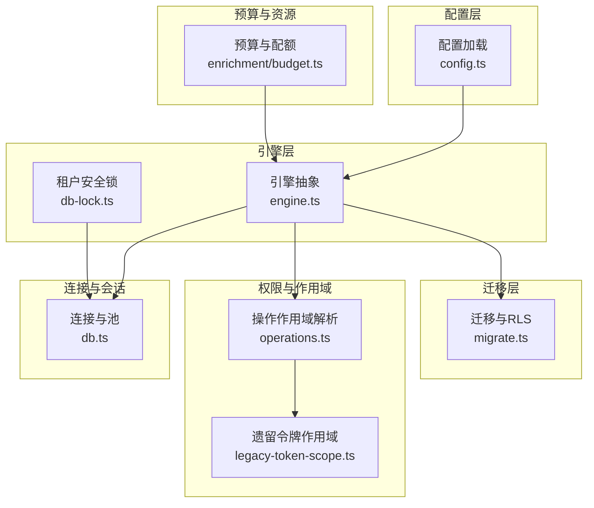
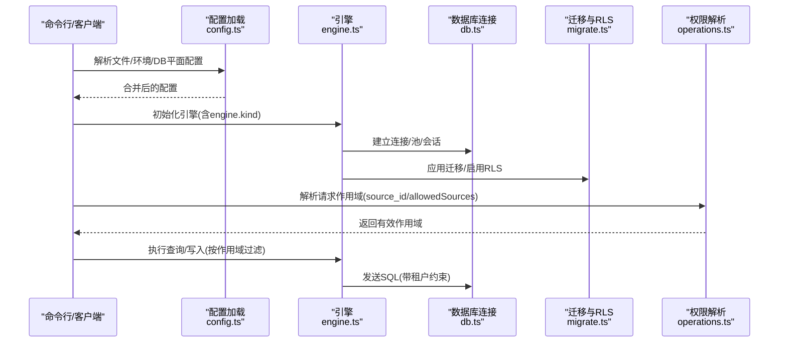
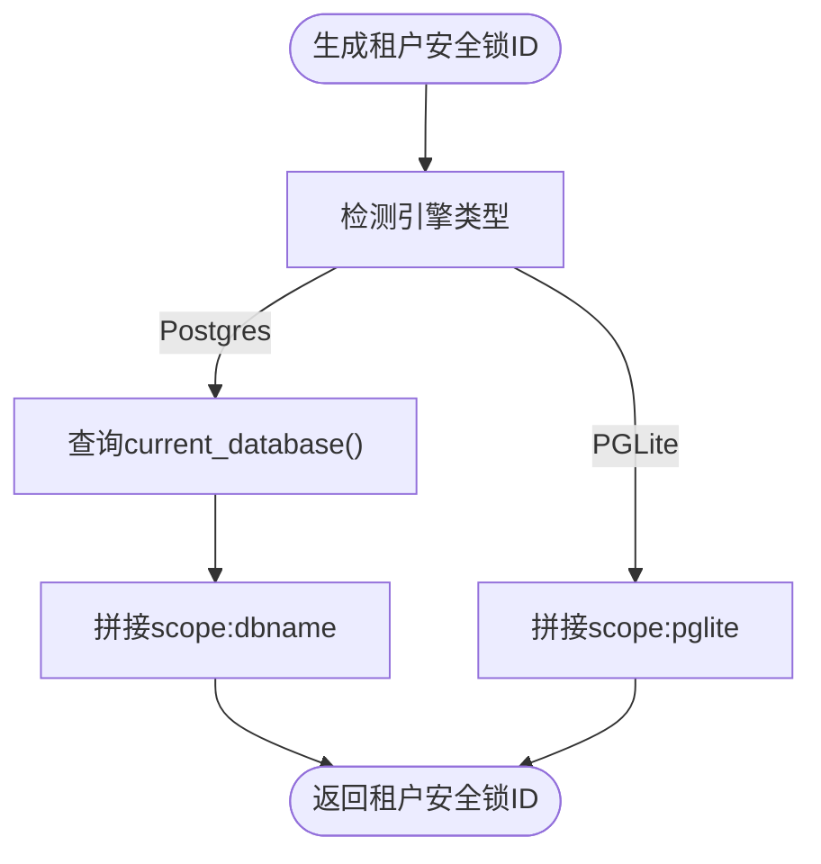
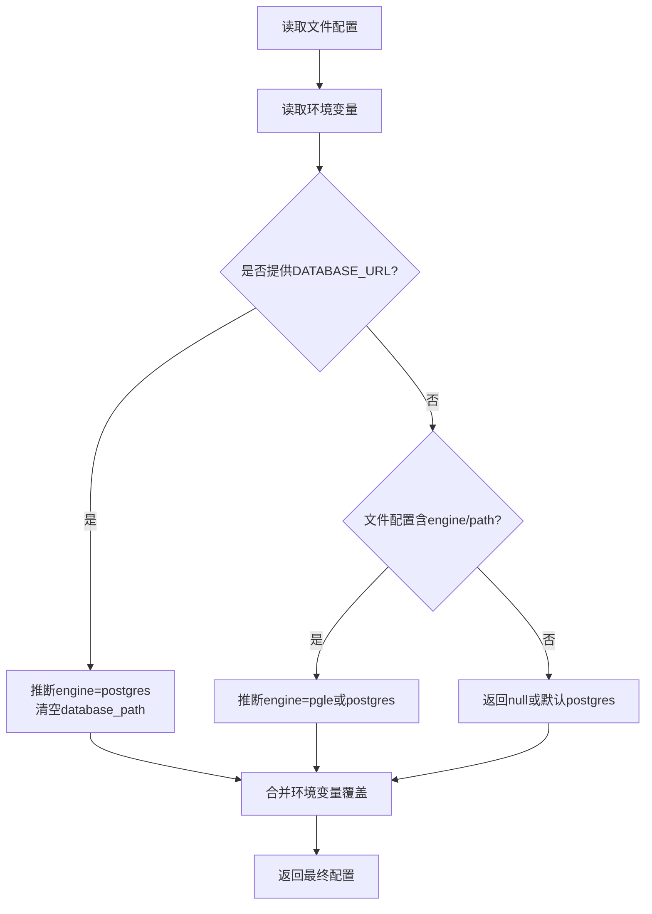
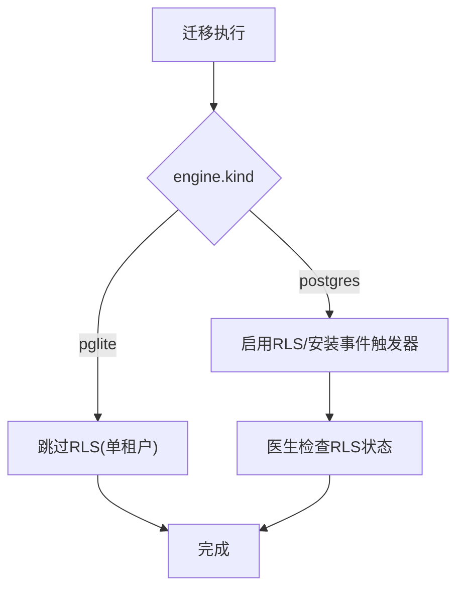
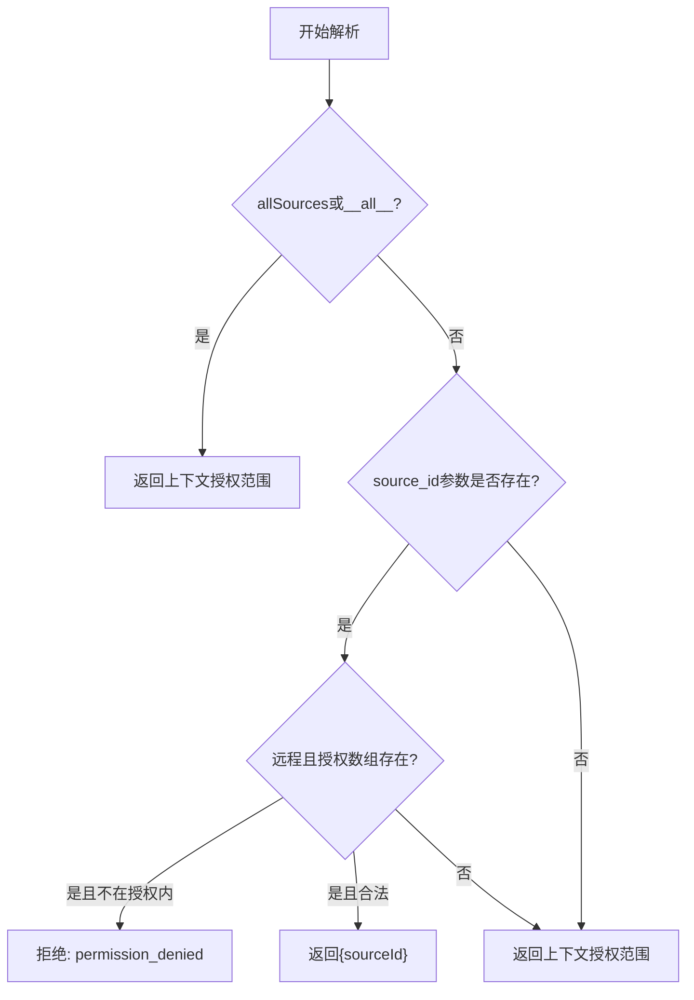
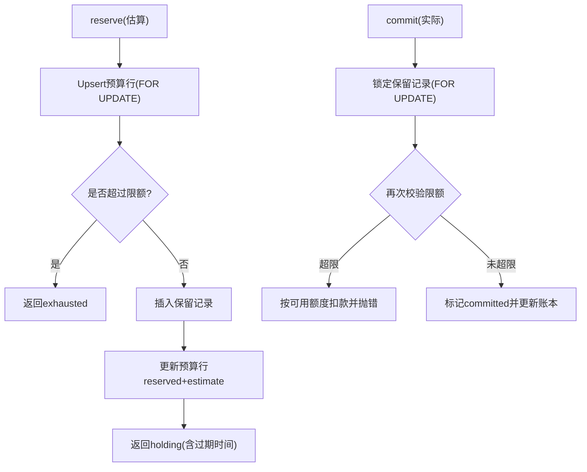
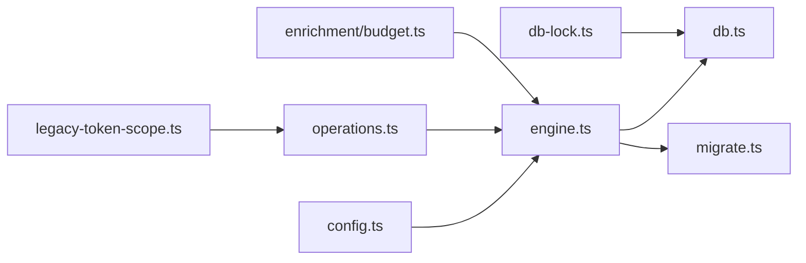

# 多租户设计

<cite>
**本文引用的文件**
- [src/core/db-lock.ts](file://src/core/db-lock.ts)
- [src/core/config.ts](file://src/core/config.ts)
- [src/core/db.ts](file://src/core/db.ts)
- [src/core/migrate.ts](file://src/core/migrate.ts)
- [src/core/enrichment/budget.ts](file://src/core/enrichment/budget.ts)
- [src/core/engine.ts](file://src/core/engine.ts)
- [src/core/legacy-token-scope.ts](file://src/core/legacy-token-scope.ts)
- [src/core/operations.ts](file://src/core/operations.ts)
- [src/cli.ts](file://src/cli.ts)
- [src/commands/doctor.ts](file://src/commands/doctor.ts)
- [test/e2e/mechanical.test.ts](file://test/e2e/mechanical.test.ts)
- [test/migrate.test.ts](file://test/migrate.test.ts)
- [test/e2e/migration-v35-auto-rls.test.ts](file://test/e2e/migration-v35-auto-rls.test.ts)
- [test/e2e/auth-permissions.test.ts](file://test/e2e/auth-permissions.test.ts)
- [test/core/base-phase.test.ts](file://test/core/base-phase.test.ts)
- [test/legacy-token-federated-scope.test.ts](file://test/legacy-token-federated-scope.test.ts)
</cite>

## 目录
1. [简介](#简介)
2. [项目结构](#项目结构)
3. [核心组件](#核心组件)
4. [架构总览](#架构总览)
5. [详细组件分析](#详细组件分析)
6. [依赖关系分析](#依赖关系分析)
7. [性能考量](#性能考量)
8. [故障排除指南](#故障排除指南)
9. [结论](#结论)
10. [附录](#附录)

## 简介
本文件系统化阐述 GBrain 的多租户设计与实现，覆盖数据隔离、权限控制、资源管理、租户边界与安全保证、索引与缓存策略、性能优化、团队协作（共享资源、权限继承与访问控制）、多租户查询实现示例、部署配置与最佳实践，以及监控、审计与故障排除方法。内容基于仓库中的实际代码与测试用例进行提炼与可视化，确保技术深度与可操作性。

## 项目结构
- 多租户能力由“配置层”“引擎层”“迁移层”“权限与作用域解析层”“连接与会话层”共同构成：
  - 配置层：统一加载与合并文件/环境/数据库平面配置，支持多租户场景下的差异化参数。
  - 引擎层：抽象数据库引擎接口，区分 Postgres/PGLite，支撑多租户隔离与一致性。
  - 迁移层：通过版本化迁移启用 RLS、事件触发器等安全基线，保障表级隔离。
  - 权限与作用域：在操作上下文中解析请求源 ID 或联邦源数组，严格限制跨租户访问。
  - 连接与会话：连接池大小、准备语句策略、会话超时等在多租户场景下需谨慎配置。

图表来源
- [src/core/config.ts:497-794](file://src/core/config.ts#L497-L794)
- [src/core/engine.ts:1-200](file://src/core/engine.ts#L1-L200)
- [src/core/db.ts:192-303](file://src/core/db.ts#L192-L303)
- [src/core/migrate.ts:1675-1746](file://src/core/migrate.ts#L1675-L1746)
- [src/core/operations.ts:473-494](file://src/core/operations.ts#L473-L494)
- [src/core/legacy-token-scope.ts:1-22](file://src/core/legacy-token-scope.ts#L1-L22)
- [src/core/db-lock.ts:916-928](file://src/core/db-lock.ts#L916-L928)
- [src/core/enrichment/budget.ts:82-365](file://src/core/enrichment/budget.ts#L82-L365)

章节来源
- [src/core/config.ts:497-794](file://src/core/config.ts#L497-L794)
- [src/core/db.ts:192-303](file://src/core/db.ts#L192-L303)
- [src/core/migrate.ts:1675-1746](file://src/core/migrate.ts#L1675-L1746)
- [src/core/operations.ts:473-494](file://src/core/operations.ts#L473-L494)
- [src/core/legacy-token-scope.ts:1-22](file://src/core/legacy-token-scope.ts#L1-L22)
- [src/core/db-lock.ts:916-928](file://src/core/db-lock.ts#L916-L928)
- [src/core/enrichment/budget.ts:82-365](file://src/core/enrichment/budget.ts#L82-L365)

## 核心组件
- 配置加载与合并
  - 支持文件/环境/数据库平面三层优先级；多租户部署允许通过环境变量或数据库配置覆盖默认值。
  - 关键点：避免误读工作目录 .env 中 DATABASE_URL；对 PGLite 与 Postgres 的 engine 类型推断与配置合并逻辑不同。
- 数据库连接与会话
  - 连接池大小、准备语句策略、会话超时在多租户场景下影响并发与稳定性；PgBouncer 场景自动禁用准备语句以避免行级缓存失效。
- 迁移与安全基线
  - 版本化迁移启用 RLS 并安装事件触发器，确保新表默认具备行级安全；PGLite 单租户场景无 RLS。
- 权限与作用域解析
  - 在操作上下文中解析请求的 source_id 或 allowedSources 数组，拒绝越权访问；遗留令牌解析兼容数组与字符串，失败回退到默认租户。
- 租户安全锁
  - 构造多租户安全的锁 ID，附加当前数据库名后缀，避免共享集群中不同数据库实例间的锁争用。
- 预算与资源管理
  - 基于 scope/resolver_id/date 的每日预算账本，支持 TTL 过期回收与 FOR UPDATE 并发控制，防止超支。

章节来源
- [src/core/config.ts:497-794](file://src/core/config.ts#L497-L794)
- [src/core/db.ts:51-115](file://src/core/db.ts#L51-L115)
- [src/core/migrate.ts:1675-1746](file://src/core/migrate.ts#L1675-L1746)
- [src/core/operations.ts:473-494](file://src/core/operations.ts#L473-L494)
- [src/core/legacy-token-scope.ts:1-22](file://src/core/legacy-token-scope.ts#L1-L22)
- [src/core/db-lock.ts:916-928](file://src/core/db-lock.ts#L916-L928)
- [src/core/enrichment/budget.ts:82-365](file://src/core/enrichment/budget.ts#L82-L365)

## 架构总览
多租户架构围绕“配置—引擎—迁移—权限—连接—预算”六大支柱展开，形成从入口到执行的完整闭环：

图表来源
- [src/core/config.ts:497-794](file://src/core/config.ts#L497-L794)
- [src/core/engine.ts:1-200](file://src/core/engine.ts#L1-L200)
- [src/core/db.ts:192-303](file://src/core/db.ts#L192-L303)
- [src/core/migrate.ts:1675-1746](file://src/core/migrate.ts#L1675-L1746)
- [src/core/operations.ts:473-494](file://src/core/operations.ts#L473-L494)

## 详细组件分析

### 组件A：多租户安全锁与租户边界
- 设计要点
  - 通过在锁 ID 中附加数据库名后缀，避免共享集群中不同数据库实例的锁冲突。
  - 对 PGLite 单租户场景采用“视觉后缀”，不改变行为但保持一致性。
- 安全保证
  - 锁释放幂等，异常情况下锁自动过期，避免死锁。
- 适用场景
  - 跨进程/跨实例的并发控制，如升级、索引构建、批量写入等长事务。

图表来源
- [src/core/db-lock.ts:916-928](file://src/core/db-lock.ts#L916-L928)

章节来源
- [src/core/db-lock.ts:916-928](file://src/core/db-lock.ts#L916-L928)

### 组件B：配置加载与多租户参数
- 设计要点
  - 三段式优先级：环境变量 > 文件配置 > 数据库平面配置；数据库平面仅对运行时可变项生效。
  - 对 PGLite 与 Postgres 的 engine 推断与配置合并路径不同，确保多租户部署的一致性。
- 多租户应用
  - 通过环境变量或数据库配置为不同租户设置独立的嵌入模型、存储后端、检索列等。
- 安全注意
  - 防止工作目录 .env 中 DATABASE_URL 意外劫持，提供显式警告与忽略策略。

图表来源
- [src/core/config.ts:497-595](file://src/core/config.ts#L497-L595)

章节来源
- [src/core/config.ts:497-595](file://src/core/config.ts#L497-L595)

### 组件C：迁移与RLS（数据隔离）
- 设计要点
  - 版本化迁移启用 RLS，并安装事件触发器自动为新表启用 RLS；PGLite 单租户场景无 RLS。
  - 通过“RLS_EXEMPT”注释豁免特定表，医生检查会验证 RLS 状态与事件触发器存在性。
- 多租户意义
  - 表级安全边界确保不同租户数据相互隔离，避免跨租户读取。
- 测试与回归
  - E2E 与单元测试覆盖 RLS 启用、事件触发器存在性与回填逻辑。

图表来源
- [src/core/migrate.ts:1675-1746](file://src/core/migrate.ts#L1675-L1746)
- [src/commands/doctor.ts:5213-5392](file://src/commands/doctor.ts#L5213-L5392)
- [test/e2e/mechanical.test.ts:943-962](file://test/e2e/mechanical.test.ts#L943-L962)
- [test/migrate.test.ts:381-465](file://test/migrate.test.ts#L381-L465)
- [test/e2e/migration-v35-auto-rls.test.ts:251-261](file://test/e2e/migration-v35-auto-rls.test.ts#L251-L261)

章节来源
- [src/core/migrate.ts:1675-1746](file://src/core/migrate.ts#L1675-L1746)
- [src/commands/doctor.ts:5213-5392](file://src/commands/doctor.ts#L5213-L5392)
- [test/e2e/mechanical.test.ts:943-962](file://test/e2e/mechanical.test.ts#L943-L962)
- [test/migrate.test.ts:381-465](file://test/migrate.test.ts#L381-L465)
- [test/e2e/migration-v35-auto-rls.test.ts:251-261](file://test/e2e/migration-v35-auto-rls.test.ts#L251-L261)

### 组件D：权限与作用域解析（访问控制）
- 设计要点
  - 请求作用域解析支持 allSources/__all__、显式 source_id、以及远程调用的 allowedSources 数组。
  - 遗留令牌解析兼容数组与字符串，非法输入回退到默认租户，绝不放宽至全源。
- 多租户边界
  - 当远程调用携带 allowedSources 时，显式 source_id 必须在授权范围内，否则拒绝。
- 测试覆盖
  - 单元测试验证数组授权、空数组回退、空值回退、以及优先级规则。

图表来源
- [src/core/operations.ts:473-494](file://src/core/operations.ts#L473-L494)
- [src/core/legacy-token-scope.ts:1-22](file://src/core/legacy-token-scope.ts#L1-L22)
- [test/core/base-phase.test.ts:104-134](file://test/core/base-phase.test.ts#L104-L134)
- [test/legacy-token-federated-scope.test.ts:27-45](file://test/legacy-token-federated-scope.test.ts#L27-L45)

章节来源
- [src/core/operations.ts:473-494](file://src/core/operations.ts#L473-L494)
- [src/core/legacy-token-scope.ts:1-22](file://src/core/legacy-token-scope.ts#L1-L22)
- [test/core/base-phase.test.ts:104-134](file://test/core/base-phase.test.ts#L104-L134)
- [test/legacy-token-federated-scope.test.ts:27-45](file://test/legacy-token-federated-scope.test.ts#L27-L45)

### 组件E：连接与会话（多租户部署）
- 设计要点
  - 连接池大小、准备语句策略、会话超时在多租户场景下尤为关键；PgBouncer 交易模式下自动禁用准备语句。
  - 提供会话级 GUC 设置，防止孤儿会话占用锁或长时间运行事务。
- 多租户建议
  - 使用环境变量调整池大小与准备语句策略；在共享池场景下降低池大小以避免 MaxClients 冲突。

章节来源
- [src/core/db.ts:51-115](file://src/core/db.ts#L51-L115)
- [src/core/db.ts:157-175](file://src/core/db.ts#L157-L175)

### 组件F：预算与资源管理（多租户配额）
- 设计要点
  - 基于 scope/resolver_id/date 的每日预算账本，支持 TTL 过期回收与 FOR UPDATE 并发控制。
  - 支持 cap 限额与超额处理，commit 时再次校验 cap，防止超支。
- 多租户意义
  - 不同租户/解析器/日期维度隔离预算，避免跨租户资源竞争。

图表来源
- [src/core/enrichment/budget.ts:82-365](file://src/core/enrichment/budget.ts#L82-L365)

章节来源
- [src/core/enrichment/budget.ts:82-365](file://src/core/enrichment/budget.ts#L82-L365)

### 组件G：团队协作与共享资源（访问控制）
- 设计要点
  - 通过 access_tokens.permissions.takes_holders 等字段控制可见性与访问范围，工具调用时按持有者白名单过滤。
  - 允许列表/禁止列表/可选操作集合用于限制高风险写操作。
- 多租户意义
  - 将“谁能看到什么”“谁可以写什么”落实到租户边界内的细粒度控制。

章节来源
- [test/e2e/auth-permissions.test.ts:47-119](file://test/e2e/auth-permissions.test.ts#L47-L119)
- [src/cli.ts:2010-2010](file://src/cli.ts#L2010-L2010)

## 依赖关系分析
- 组件耦合与内聚
  - 配置层与引擎层松耦合：引擎通过配置决定连接与行为；多租户部署通过配置切换 engine.kind。
  - 权限解析与引擎解耦：权限解析发生在操作上下文，引擎只负责执行带租户约束的 SQL。
  - 迁移层与医生检查强关联：RLS 与事件触发器的存在性由医生检查验证。
- 外部依赖与集成点
  - Postgres/PgBouncer：准备语句策略、会话超时、RLS 与事件触发器。
  - 环境变量与数据库配置：作为多租户差异化参数的主要来源。

图表来源
- [src/core/config.ts:497-794](file://src/core/config.ts#L497-L794)
- [src/core/engine.ts:1-200](file://src/core/engine.ts#L1-L200)
- [src/core/db.ts:192-303](file://src/core/db.ts#L192-L303)
- [src/core/migrate.ts:1675-1746](file://src/core/migrate.ts#L1675-L1746)
- [src/core/operations.ts:473-494](file://src/core/operations.ts#L473-L494)
- [src/core/legacy-token-scope.ts:1-22](file://src/core/legacy-token-scope.ts#L1-L22)
- [src/core/db-lock.ts:916-928](file://src/core/db-lock.ts#L916-L928)
- [src/core/enrichment/budget.ts:82-365](file://src/core/enrichment/budget.ts#L82-L365)

章节来源
- [src/core/config.ts:497-794](file://src/core/config.ts#L497-L794)
- [src/core/engine.ts:1-200](file://src/core/engine.ts#L1-L200)
- [src/core/db.ts:192-303](file://src/core/db.ts#L192-L303)
- [src/core/migrate.ts:1675-1746](file://src/core/migrate.ts#L1675-L1746)
- [src/core/operations.ts:473-494](file://src/core/operations.ts#L473-L494)
- [src/core/legacy-token-scope.ts:1-22](file://src/core/legacy-token-scope.ts#L1-L22)
- [src/core/db-lock.ts:916-928](file://src/core/db-lock.ts#L916-L928)
- [src/core/enrichment/budget.ts:82-365](file://src/core/enrichment/budget.ts#L82-L365)

## 性能考量
- 连接与池
  - 在共享池（如 PgBouncer）场景下禁用准备语句以避免行级缓存失效；合理设置池大小，避免 MaxClients 冲突。
- 会话超时
  - 通过会话级 GUC 设置短超时，防止孤儿会话长期占用锁或事务。
- 索引与查询
  - 多租户查询应尽量利用基于 source_id 的索引前缀，减少全表扫描。
- 缓存与重试
  - 批量写入具备自适应重试与信号中断能力，避免重复重试放大负载。

章节来源
- [src/core/db.ts:51-115](file://src/core/db.ts#L51-L115)
- [src/core/db.ts:157-175](file://src/core/db.ts#L157-L175)
- [src/core/engine.ts:98-121](file://src/core/engine.ts#L98-L121)

## 故障排除指南
- RLS 未启用或事件触发器缺失
  - 使用医生检查确认 RLS 状态与事件触发器存在性；必要时手动启用 RLS 或安装事件触发器。
- 连接失败与准备语句错误
  - 在 PgBouncer 交易模式下自动禁用准备语句；可通过环境变量强制开启或关闭。
- 预算超支或保留未释放
  - 检查 TTL 过期回收任务是否正常运行；查看保留记录状态与账本余额。
- 作用域解析失败
  - 确认远程调用的 allowedSources 是否包含显式 source_id；遗留令牌解析失败应回退到默认租户。

章节来源
- [src/commands/doctor.ts:5213-5392](file://src/commands/doctor.ts#L5213-L5392)
- [src/core/db.ts:86-105](file://src/core/db.ts#L86-L105)
- [src/core/enrichment/budget.ts:308-338](file://src/core/enrichment/budget.ts#L308-L338)
- [src/core/operations.ts:473-494](file://src/core/operations.ts#L473-L494)
- [src/core/legacy-token-scope.ts:1-22](file://src/core/legacy-token-scope.ts#L1-L22)

## 结论
GBrain 的多租户设计以“配置—引擎—迁移—权限—连接—预算”为核心，通过 RLS、事件触发器、作用域解析与租户安全锁等手段，实现了跨租户的数据隔离与访问控制。配合连接池与会话超时策略、预算账本与 TTL 回收，系统在多租户环境下具备良好的安全性、可维护性与可扩展性。建议在生产部署中结合环境变量与数据库配置实现租户差异化参数，并定期使用医生检查与测试用例验证安全基线。

## 附录
- 多租户查询实现示例（路径参考）
  - 作用域解析：[src/core/operations.ts:473-494](file://src/core/operations.ts#L473-L494)
  - 遗留令牌作用域解析：[src/core/legacy-token-scope.ts:1-22](file://src/core/legacy-token-scope.ts#L1-L22)
  - 租户安全锁：[src/core/db-lock.ts:916-928](file://src/core/db-lock.ts#L916-L928)
  - 预算预留与提交：[src/core/enrichment/budget.ts:90-253](file://src/core/enrichment/budget.ts#L90-L253)
- 多租户部署配置与最佳实践
  - 配置加载与合并：[src/core/config.ts:497-794](file://src/core/config.ts#L497-L794)
  - 连接与池策略：[src/core/db.ts:51-115](file://src/core/db.ts#L51-L115)
  - RLS 与事件触发器：[src/core/migrate.ts:1675-1746](file://src/core/migrate.ts#L1675-L1746)
  - 医生检查：[src/commands/doctor.ts:5213-5392](file://src/commands/doctor.ts#L5213-L5392)
- 监控、审计与故障排除
  - 医生检查 RLS 状态与事件触发器：[test/e2e/mechanical.test.ts:943-962](file://test/e2e/mechanical.test.ts#L943-L962)、[test/e2e/migration-v35-auto-rls.test.ts:251-261](file://test/e2e/migration-v35-auto-rls.test.ts#L251-L261)
  - 访问控制与持有者白名单：[test/e2e/auth-permissions.test.ts:47-119](file://test/e2e/auth-permissions.test.ts#L47-L119)
  - 作用域解析与遗留令牌测试：[test/core/base-phase.test.ts:104-134](file://test/core/base-phase.test.ts#L104-L134)、[test/legacy-token-federated-scope.test.ts:27-45](file://test/legacy-token-federated-scope.test.ts#L27-L45)