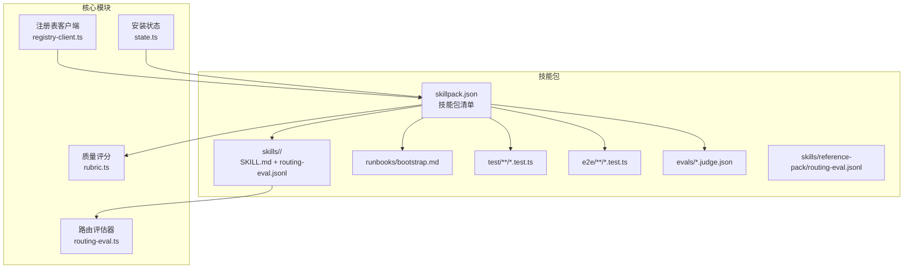
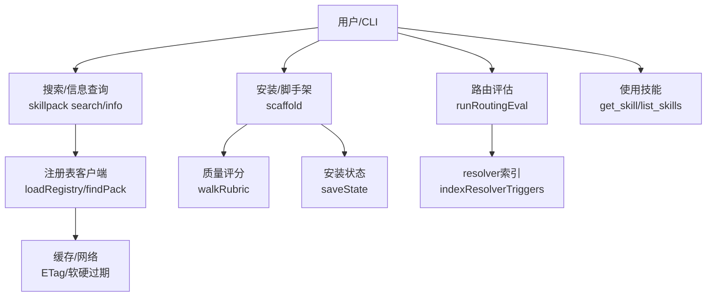
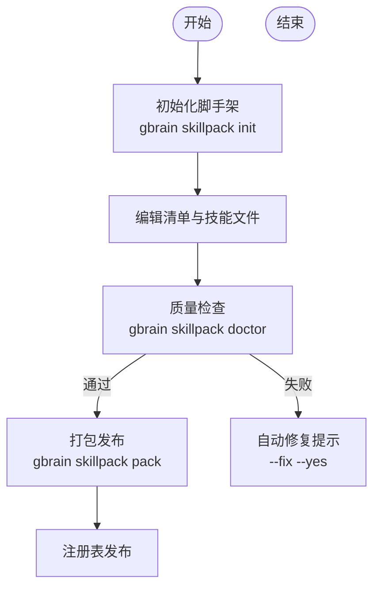
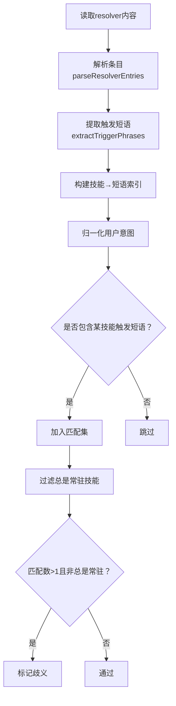
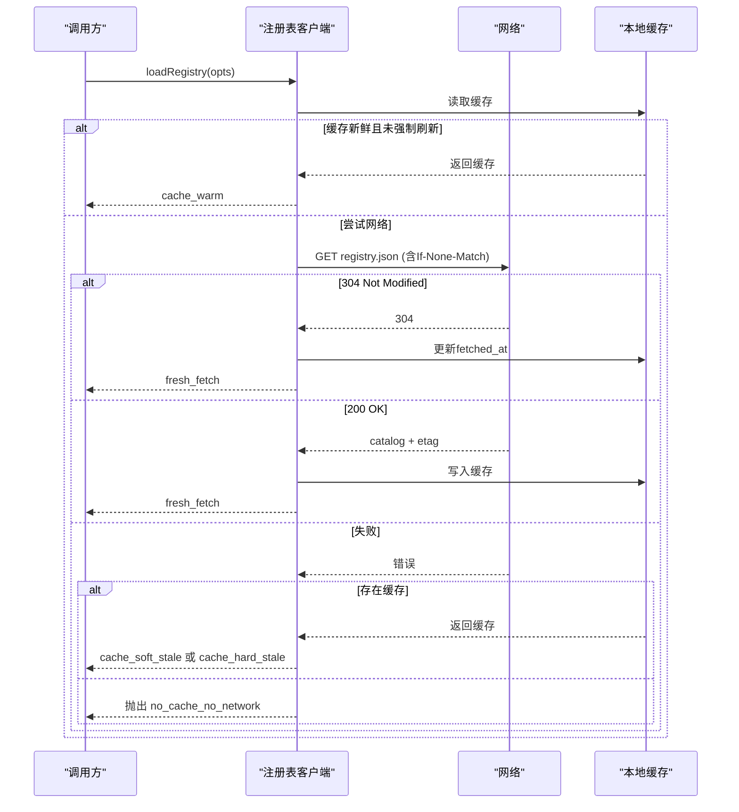
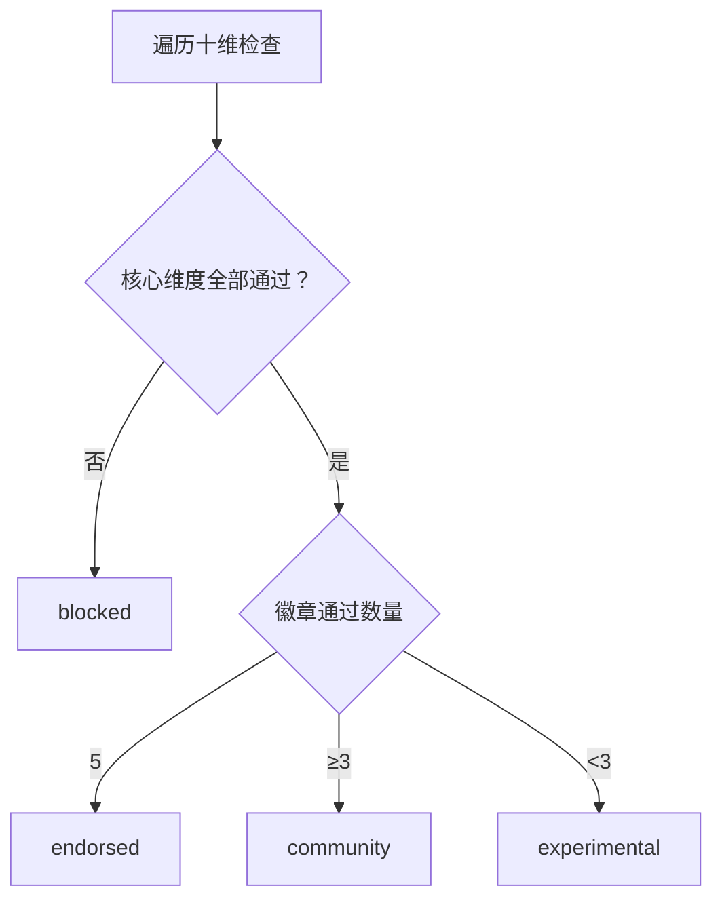
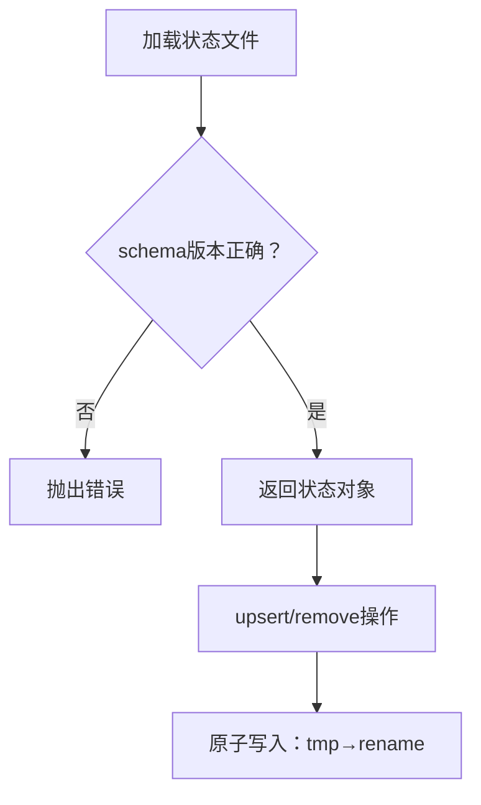
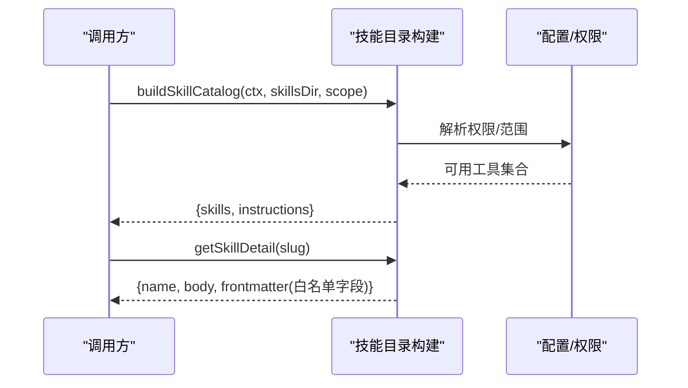
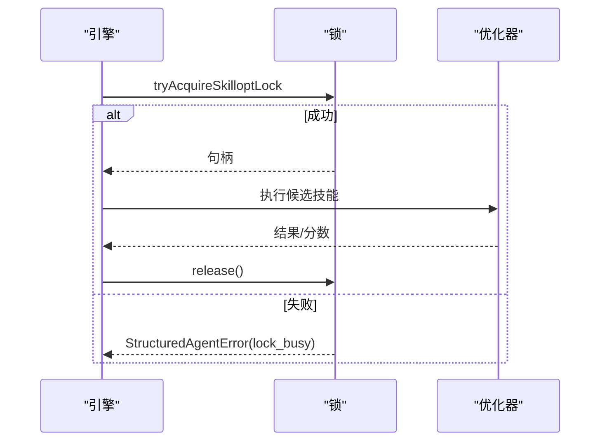
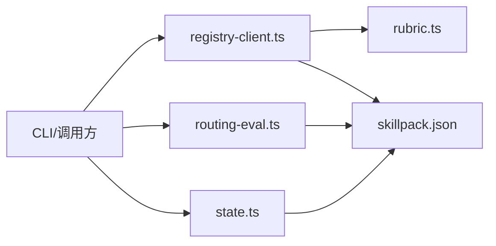

# 技能系统架构

<cite>
**本文引用的文件**
- [skillpack-anatomy.md](file://docs/skillpack-anatomy.md)
- [GBRAIN_SKILLPACK.md](file://docs/GBRAIN_SKILLPACK.md)
- [rubric.ts](file://src/core/skillpack/rubric.ts)
- [state.ts](file://src/core/skillpack/state.ts)
- [registry-client.ts](file://src/core/skillpack/registry-client.ts)
- [routing-eval.ts](file://src/core/routing-eval.ts)
- [skillpack.json](file://examples/skillpack-reference/skillpack.json)
- [SKILL.md](file://examples/skillpack-reference/skills/reference-pack/SKILL.md)
- [skill-catalog.test.ts](file://test/skill-catalog.test.ts)
- [routing-eval.test.ts](file://test/routing-eval.test.ts)
- [skillpack-registry-client.test.ts](file://test/skillpack-registry-client.test.ts)
- [skillpack-registry-schema.test.ts](file://test/skillpack-registry-schema.test.ts)
- [post-install-advisory.test.ts](file://test/post-install-advisory.test.ts)
- [e2e\skillopt-pglite.serial.test.ts](file://test\e2e\skillopt-pglite.serial.test.ts)
- [concurrent-runs.serial.test.ts](file://test\skillopt\adversarial\concurrent-runs.serial.test.ts)
</cite>

## 目录
1. [引言](#引言)
2. [项目结构](#项目结构)
3. [核心组件](#核心组件)
4. [架构总览](#架构总览)
5. [详细组件分析](#详细组件分析)
6. [依赖分析](#依赖分析)
7. [性能考虑](#性能考虑)
8. [故障排查指南](#故障排查指南)
9. [结论](#结论)
10. [附录](#附录)

## 引言
本文件面向GBrain的技能系统，系统性阐述技能定义格式、路由机制与执行流程；解释技能包（SkillPack）的概念、管理方式（内置与第三方）、生命周期与版本控制、依赖关系；说明技能与搜索系统的集成方式及通过技能扩展系统能力的路径；并提供开发最佳实践、插件化架构与扩展机制、调试与性能优化建议。

## 项目结构
技能系统围绕“技能包”组织：每个技能包包含清单（skillpack.json）、技能目录（skills/<slug>）、可选的运行手册（runbooks）、测试与评估文件等。系统提供注册表客户端、路由评估器、质量评分（rubric）与安装状态存储等核心模块，支撑技能包的发现、校验、安装与使用。

图示来源
- [skillpack-anatomy.md:10-29](file://docs/skillpack-anatomy.md#L10-L29)
- [rubric.ts:14-512](file://src/core/skillpack/rubric.ts#L14-L512)
- [registry-client.ts:1-366](file://src/core/skillpack/registry-client.ts#L1-L366)
- [routing-eval.ts:1-397](file://src/core/routing-eval.ts#L1-L397)
- [state.ts:1-196](file://src/core/skillpack/state.ts#L1-L196)

章节来源
- [skillpack-anatomy.md:1-113](file://docs/skillpack-anatomy.md#L1-L113)
- [GBRAIN_SKILLPACK.md:105-144](file://docs/GBRAIN_SKILLPACK.md#L105-L144)

## 核心组件
- 技能包清单（skillpack.json）
  - 定义包元数据、最低版本、技能列表、运行手册、变更日志、测试与评估文件位置等。
  - 示例参考：[skillpack.json:1-30](file://examples/skillpack-reference/skillpack.json#L1-L30)。
- 技能定义（SKILL.md）
  - 前言字段包含名称、描述、是否变更型（mutating）、触发词（triggers）等；正文作为上下文指令。
  - 参考：[SKILL.md:1-79](file://examples/skillpack-reference/skills/reference-pack/SKILL.md#L1-L79)。
- 路由评估（routing-eval.jsonl）
  - 每个技能至少包含若干意图样本，用于验证触发词与预期技能的匹配度。
  - 参考：[SKILL.md:1-79](file://examples/skillpack-reference/skills/reference-pack/SKILL.md#L1-L79) 中对路由评估的要求。
- 注册表客户端（registry-client.ts）
  - 提供注册表拉取、缓存、软/硬过期策略与离线回退。
- 质量评分（rubric.ts）
  - 第三方技能包的十项二值维度检查，分为“核心（必须全部通过）”和“徽章（决定等级）”两类。
- 安装状态（state.ts）
  - 机器可读的已安装技能包记录，支持原子更新与信任确认。

章节来源
- [skillpack-anatomy.md:10-29](file://docs/skillpack-anatomy.md#L10-L29)
- [rubric.ts:66-386](file://src/core/skillpack/rubric.ts#L66-L386)
- [registry-client.ts:179-312](file://src/core/skillpack/registry-client.ts#L179-L312)
- [state.ts:88-148](file://src/core/skillpack/state.ts#L88-L148)

## 架构总览
技能系统采用“清单驱动 + 质量门禁 + 注册表分发 + 路由评估 + 状态管理”的整体架构。用户通过CLI或内部调用进行技能包的检索、安装、校验与使用；系统在安装时写入状态文件，并在后续使用中基于技能清单与路由评估进行决策。

图示来源
- [registry-client.ts:179-312](file://src/core/skillpack/registry-client.ts#L179-L312)
- [rubric.ts:450-494](file://src/core/skillpack/rubric.ts#L450-L494)
- [state.ts:132-148](file://src/core/skillpack/state.ts#L132-L148)
- [routing-eval.ts:329-396](file://src/core/routing-eval.ts#L329-L396)

## 详细组件分析

### 组件A：技能包清单与树形结构
- 清单字段与职责
  - api_version、name、version、description、author、license、homepage、gbrain_min_version
  - skills、runbooks、changelog、unit_tests、e2e_tests、llm_evals、routing_evals
- 树形结构
  - 必备：skillpack.json、skills/<slug>/SKILL.md、routing-eval.jsonl
  - 可选：runbooks/bootstrap.md、测试与评估文件、变更日志、许可证
- 使用场景
  - 初始化脚手架、质量评分、打包发布、安装后状态记录

图示来源
- [skillpack-anatomy.md:31-35](file://docs/skillpack-anatomy.md#L31-L35)
- [skillpack-anatomy.md:92-106](file://docs/skillpack-anatomy.md#L92-L106)
- [skillpack.json:1-30](file://examples/skillpack-reference/skillpack.json#L1-L30)

章节来源
- [skillpack-anatomy.md:8-35](file://docs/skillpack-anatomy.md#L8-L35)
- [skillpack.json:1-30](file://examples/skillpack-reference/skillpack.json#L1-L30)

### 组件B：路由评估与触发匹配
- 触发提取与归一化
  - 从resolver单元提取触发短语，进行大小写折叠、标点替换、空白压缩与长度过滤。
- 结构化匹配
  - 对意图进行归一化后，判断其是否包含某技能的任一触发短语；排除总是常驻技能后的歧义判定。
- 夹带评估
  - 支持显式允许的共现（ambiguous_with），以及负例（expected_skill=null）与错误案例统计。
- 测试覆盖
  - 单元测试覆盖正负例、歧义检测、夹带白名单、解析与规范化等。

图示来源
- [routing-eval.ts:137-183](file://src/core/routing-eval.ts#L137-L183)
- [routing-eval.ts:208-254](file://src/core/routing-eval.ts#L208-L254)
- [routing-eval.ts:329-396](file://src/core/routing-eval.ts#L329-L396)

章节来源
- [routing-eval.ts:1-397](file://src/core/routing-eval.ts#L1-L397)
- [routing-eval.test.ts:1-342](file://test/routing-eval.test.ts#L1-L342)

### 组件C：注册表客户端与缓存策略
- 缓存与回退
  - 软TTL（1小时）优先使用缓存；超过7天发出“陈旧”警告；网络失败时回退到缓存。
  - 首次运行无缓存且无网络时抛出明确错误。
- ETag轮询
  - 若命中304则仅刷新时间戳，避免重复下载。
- 查询与排序
  - 支持按关键词与等级筛选，按等级与名称排序返回。

图示来源
- [registry-client.ts:179-312](file://src/core/skillpack/registry-client.ts#L179-L312)

章节来源
- [registry-client.ts:1-366](file://src/core/skillpack/registry-client.ts#L1-L366)
- [skillpack-registry-client.test.ts:1-45](file://test/skillpack-registry-client.test.ts#L1-L45)
- [skillpack-registry-schema.test.ts:40-88](file://test/skillpack-registry-schema.test.ts#L40-L88)

### 组件D：质量评分与等级规则
- 核心维度（必须全部通过）
  - 清单合法、每个技能有有效SKILL.md、每个技能有≥5路由评估样本、触发唯一、变更日志存在且包含当前版本。
- 徽章维度（决定等级）
  - 单测/端到端/LLM评测存在且有效、运行手册存在且非空、许可证存在。
- 等级规则
  - 全部核心通过：blocked；全部徽章通过：endorsed；≥3徽章：community；否则：experimental。

图示来源
- [rubric.ts:450-494](file://src/core/skillpack/rubric.ts#L450-L494)

章节来源
- [rubric.ts:66-386](file://src/core/skillpack/rubric.ts#L66-L386)
- [skillpack-anatomy.md:83-91](file://docs/skillpack-anatomy.md#L83-L91)

### 组件E：安装状态与信任模型
- 状态文件
  - 位于~/.gbrain/skillpack-state.json，schema版本化，支持原子写入。
- 信任确认
  - 首次安装确认时，若名称、作者与提交SHA或tarball哈希一致，则跳过二次确认。
- 用途
  - 记录已安装包、贡献的技能、来源与时间戳，供后续安装/卸载/升级使用。

图示来源
- [state.ts:88-148](file://src/core/skillpack/state.ts#L88-L148)
- [state.ts:179-195](file://src/core/skillpack/state.ts#L179-L195)

章节来源
- [state.ts:1-196](file://src/core/skillpack/state.ts#L1-L196)
- [post-install-advisory.test.ts:75-85](file://test/post-install-advisory.test.ts#L75-L85)

### 组件F：技能目录与工具描述
- 技能目录构建
  - 依据上下文权限与范围过滤可用工具，生成技能目录与使用说明。
- 工具描述
  - 列出可用/不可用工具，指导客户端如何调用（如list_skills、get_skill）。

图示来源
- [skill-catalog.test.ts:62-116](file://test/skill-catalog.test.ts#L62-L116)
- [operations-descriptions.test.ts:172-189](file://test/operations-descriptions.test.ts#L172-L189)

章节来源
- [skill-catalog.test.ts:62-116](file://test/skill-catalog.test.ts#L62-L116)
- [operations-descriptions.test.ts:172-189](file://test/operations-descriptions.test.ts#L172-L189)

### 组件G：技能优化与锁机制（可选）
- 技能优化循环
  - 通过版本存储与历史记录，支持多轮迭代、接受/拒绝与恢复。
- 并发控制
  - 通过锁确保竞态下的串行化，避免资源冲突。

图示来源
- [e2e\skillopt-pglite.serial.test.ts:20-23](file://test\e2e\skillopt-pglite.serial.test.ts#L20-L23)
- [concurrent-runs.serial.test.ts:44-77](file://test\skillopt\adversarial\concurrent-runs.serial.test.ts#L44-L77)

章节来源
- [e2e\skillopt-pglite.serial.test.ts:1-52](file://test\e2e\skillopt-pglite.serial.test.ts#L1-L52)
- [concurrent-runs.serial.test.ts:40-77](file://test\skillopt\adversarial\concurrent-runs.serial.test.ts#L40-L77)

## 依赖分析
- 组件耦合
  - 路由评估依赖解析器条目解析；质量评分依赖清单与文件系统；注册表客户端依赖缓存与网络；安装状态独立但被安装流程依赖。
- 外部依赖
  - 注册表默认来自GitHub仓库，支持自定义URL；网络请求使用Bun原生fetch；缓存目录位于~/.gbrain。
- 循环依赖
  - 各模块以纯函数为主，未见循环导入；状态模块不反向依赖安装流程，避免环路。

图示来源
- [registry-client.ts:1-366](file://src/core/skillpack/registry-client.ts#L1-L366)
- [rubric.ts:1-512](file://src/core/skillpack/rubric.ts#L1-L512)
- [routing-eval.ts:1-397](file://src/core/routing-eval.ts#L1-L397)
- [state.ts:1-196](file://src/core/skillpack/state.ts#L1-L196)

章节来源
- [registry-client.ts:1-366](file://src/core/skillpack/registry-client.ts#L1-L366)
- [rubric.ts:1-512](file://src/core/skillpack/rubric.ts#L1-L512)
- [routing-eval.ts:1-397](file://src/core/routing-eval.ts#L1-L397)
- [state.ts:1-196](file://src/core/skillpack/state.ts#L1-L196)

## 性能考虑
- 路由评估
  - 归一化与子串匹配为轻量计算；触发短语数量与意图长度影响复杂度；建议保持触发短语简洁且唯一，减少歧义与匹配开销。
- 注册表访问
  - ETag轮询与缓存显著降低网络负载；软/硬过期策略平衡时效与稳定性。
- 安装状态
  - 原子写入避免部分写入风险；状态文件小而固定，读写成本低。
- 评测与优化
  - 路由评估样本数量直接影响覆盖率与稳定性；技能优化循环应限制并发，避免资源争用。

## 故障排查指南
- 注册表相关
  - 网络失败但有缓存：检查缓存年龄，必要时使用刷新选项；无缓存且无网络：首次安装需联网。
  - schema无效：检查返回的catalog结构与字段类型。
- 质量评分
  - 未满足核心维度：根据提示修复清单、SKILL.md、路由评估样本、触发唯一性或变更日志。
  - 徽章不足：补充单元/端到端/LLM评测、运行手册与许可证。
- 路由评估
  - 歧义与漏匹配：调整触发短语、添加夹带白名单、增加样本；负例误匹配：提高触发特异性。
- 安装状态
  - JSON损坏或版本未知：删除/修复状态文件；原子写失败：检查磁盘权限与空间。

章节来源
- [registry-client.ts:264-312](file://src/core/skillpack/registry-client.ts#L264-L312)
- [rubric.ts:80-232](file://src/core/skillpack/rubric.ts#L80-L232)
- [routing-eval.ts:329-396](file://src/core/routing-eval.ts#L329-L396)
- [state.ts:92-148](file://src/core/skillpack/state.ts#L92-L148)

## 结论
GBrain的技能系统以“清单+评估+注册表+状态”为核心，形成可审计、可扩展、可评测的技能生态。通过严格的路由评估与质量评分，确保技能的确定性与可维护性；通过注册表与缓存策略保障分发与离线可用；通过安装状态与锁机制保证安装一致性与并发安全。该架构既适合内置技能的统一治理，也便于第三方技能包的规模化引入与演进。

## 附录
- 开发最佳实践
  - 触发短语：简洁、唯一、可泛化；避免复制触发文本到意图。
  - 路由评估：每技能≥5样本，覆盖正负例与边界情况。
  - 质量门禁：先通过doctor再发布；利用自动修复提示完善缺失项。
  - 版本与依赖：严格遵循清单字段与最小版本要求；变更日志与许可证齐全。
- 插件化与扩展
  - 通过resolver与技能目录构建，客户端可按权限动态展示可用工具与技能。
  - 注册表支持自定义URL，便于企业私有化部署与分级治理。
- 调试与性能
  - 使用路由评估的夹带白名单与负例样例提升稳定性；在优化循环中合理设置并发与重试策略。