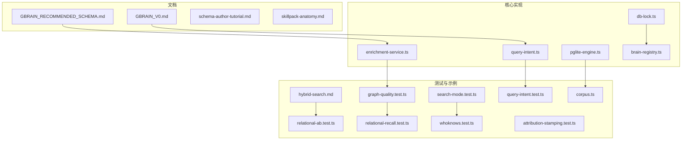
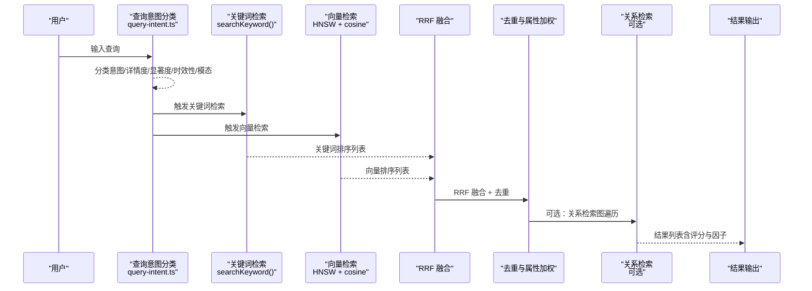
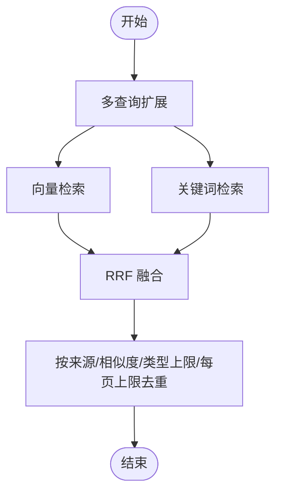
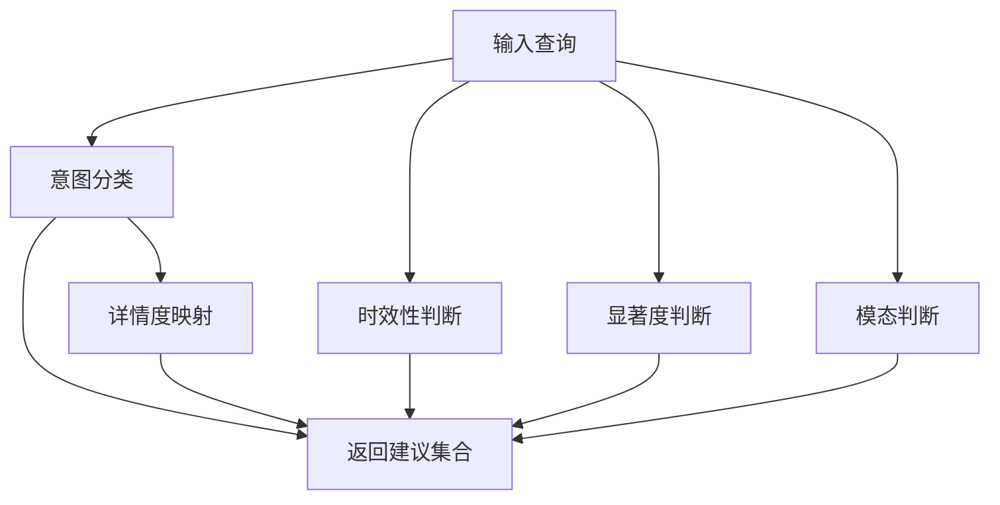
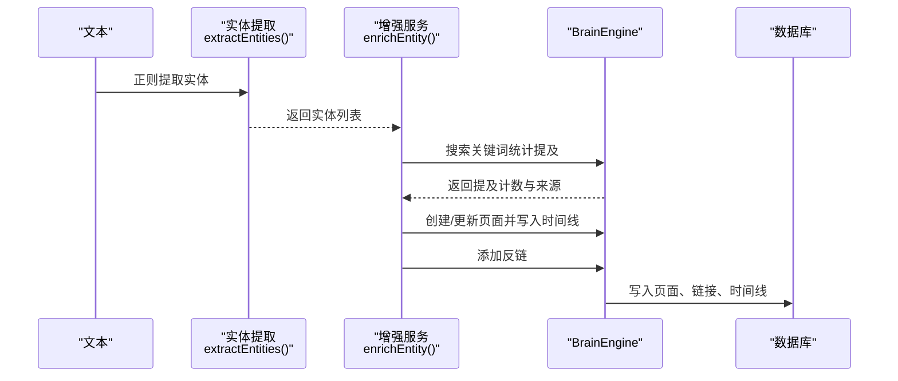
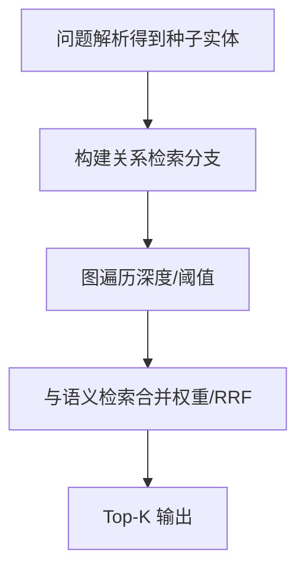
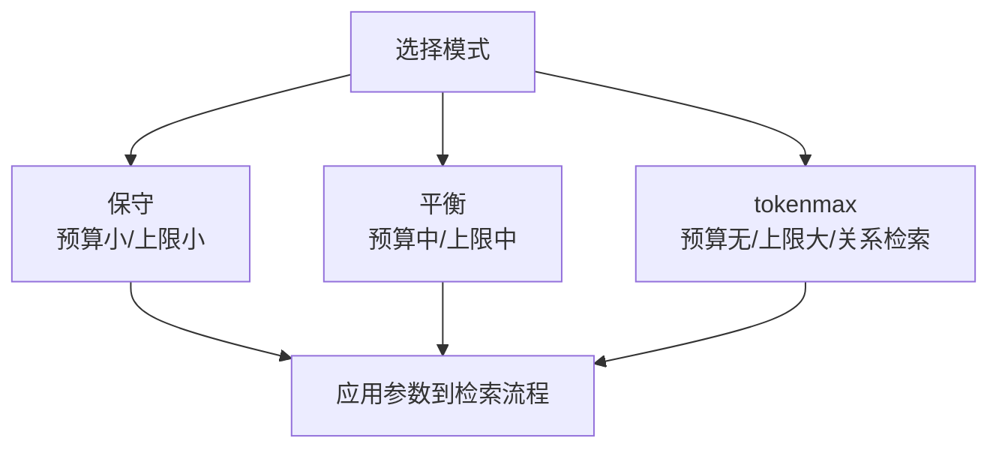
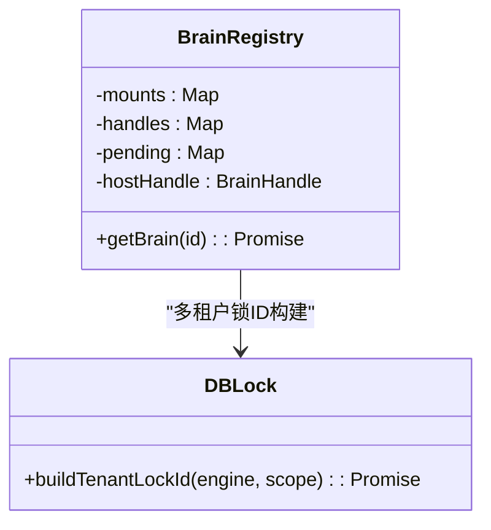
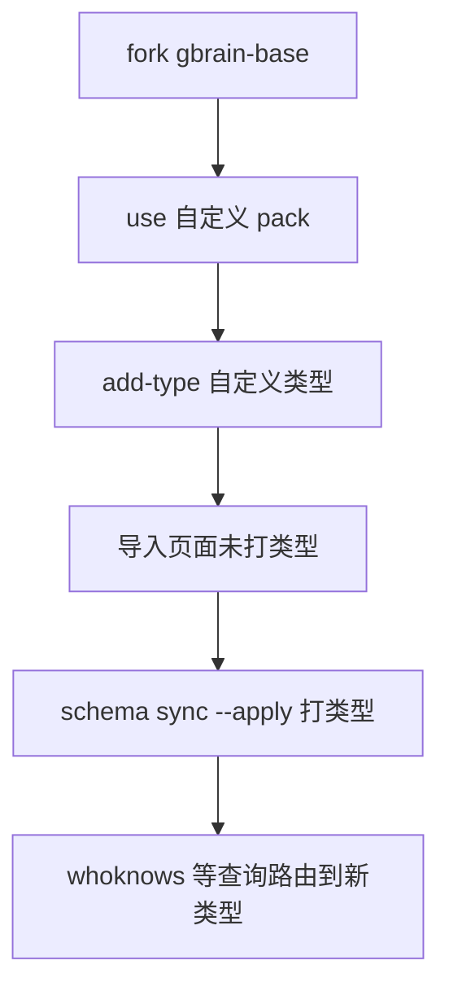
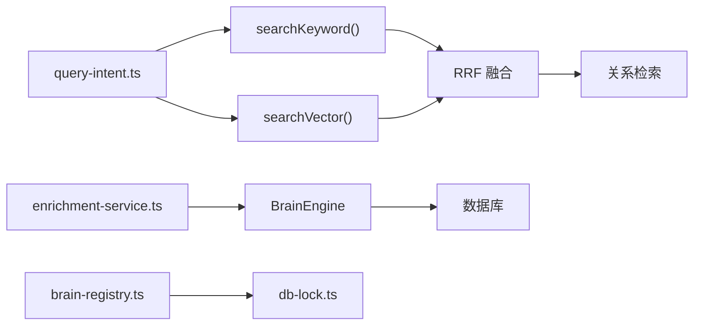

# 核心概念

<cite>
**本文引用的文件**
- [GBRAIN_V0.md](file://docs/GBRAIN_V0.md)
- [GBRAIN_RECOMMENDED_SCHEMA.md](file://docs/GBRAIN_RECOMMENDED_SCHEMA.md)
- [schema-author-tutorial.md](file://docs/schema-author-tutorial.md)
- [skillpack-anatomy.md](file://docs/skillpack-anatomy.md)
- [query-intent.ts](file://src/core/search/query-intent.ts)
- [enrichment-service.ts](file://src/core/enrichment-service.ts)
- [hybrid-search.md](file://test/e2e/fixtures/concepts/hybrid-search.md)
- [graph-quality.test.ts](file://test/e2e/graph-quality.test.ts)
- [relational-ab.test.ts](file://test/relational-ab.test.ts)
- [relational-recall.test.ts](file://test/relational-recall.test.ts)
- [search-mode.test.ts](file://test/search-mode.test.ts)
- [engine-parity.test.ts](file://test/e2e/engine-parity.test.ts)
- [db-lock.ts](file://src/core/db-lock.ts)
- [brain-registry.ts](file://src/core/brain-registry.ts)
- [pglite-engine.ts](file://src/core/pglite-engine.ts)
- [whoknows.test.ts](file://test/e2e/whoknows.test.ts)
- [query-intent.test.ts](file://test/query-intent.test.ts)
- [attribution-stamping.test.ts](file://test/search/attribution-stamping.test.ts)
- [corpus.ts](file://test/fixtures/retrieval-quality/relational/corpus.ts)
</cite>

## 目录
1. [引言](#引言)
2. [项目结构](#项目结构)
3. [核心组件](#核心组件)
4. [架构总览](#架构总览)
5. [详细组件分析](#详细组件分析)
6. [依赖分析](#依赖分析)
7. [性能考量](#性能考量)
8. [故障排查指南](#故障排查指南)
9. [结论](#结论)
10. [附录](#附录)

## 引言
本文件面向初学者与资深开发者，系统化阐述 GBrain 的核心概念与实现：混合搜索（向量检索、关键词匹配、RRF 融合、意图识别）、知识图谱自连接机制、技能系统架构、多租户设计与“脑仓库”理念；并详解三种搜索模式（保守、平衡、tokenmax）的差异与适用场景。文档还说明了在不调用 LLM 的前提下如何完成实体提取与类型化边创建，并解释 schema packs 如何定义页面类型与关系。文中配有多种图示帮助理解。

## 项目结构
- 文档层：docs 下包含架构与使用指南，如 GBRAIN_V0.md、GBRAIN_RECOMMENDED_SCHEMA.md、schema-author-tutorial.md、skillpack-anatomy.md 等，覆盖系统目标、数据库模型、推荐 schema、schema 作者教程与技能包结构。
- 核心实现层：src/core 下包含引擎、搜索、增强服务等模块，例如 query-intent.ts（查询意图分类）、enrichment-service.ts（实体增强）、pglite-engine.ts（嵌入式引擎）等。
- 测试与示例：test 下包含大量端到端与单元测试，涵盖混合搜索、图谱质量、关系检索、搜索模式、意图识别、属性加权等主题，用于验证行为与性能。

**章节来源**
- [GBRAIN_V0.md:1-552](file://docs/GBRAIN_V0.md#L1-L552)
- [GBRAIN_RECOMMENDED_SCHEMA.md:1-800](file://docs/GBRAIN_RECOMMENDED_SCHEMA.md#L1-L800)
- [schema-author-tutorial.md:1-225](file://docs/schema-author-tutorial.md#L1-L225)
- [skillpack-anatomy.md:1-113](file://docs/skillpack-anatomy.md#L1-L113)

## 核心组件
- 混合搜索与意图识别：通过 query-intent.ts 对用户查询进行意图与多轴建议（详情度、显著度、时效性、模态），驱动检索策略与后处理。
- 实体增强与无 LLM 实现：enrichment-service.ts 提供基于正则的实体抽取、提及统计与层级建议，再以关键词搜索推断来源域，完成实体创建、时间线与反链补全。
- 知识图谱自连接：测试用例展示自动链接与类型化边创建，结合关系检索提升问答召回。
- 搜索模式：search-mode.test.ts 定义保守/平衡/tokenmax 三档模式，分别对应不同的预算、限制与关系检索开关。
- 多租户与脑仓库：db-lock.ts 与 brain-registry.ts 支持按数据库名构建带租户的锁 ID，确保跨实例隔离；脑仓库作为统一知识存储与操作入口。

**章节来源**
- [query-intent.ts:1-343](file://src/core/search/query-intent.ts#L1-L343)
- [enrichment-service.ts:1-274](file://src/core/enrichment-service.ts#L1-L274)
- [graph-quality.test.ts:69-100](file://test/e2e/graph-quality.test.ts#L69-L100)
- [relational-ab.test.ts:27-58](file://test/relational-ab.test.ts#L27-L58)
- [relational-recall.test.ts:27-55](file://test/relational-recall.test.ts#L27-L55)
- [search-mode.test.ts:140-598](file://test/search-mode.test.ts#L140-L598)
- [db-lock.ts:894-928](file://src/core/db-lock.ts#L894-L928)
- [brain-registry.ts:300-339](file://src/core/brain-registry.ts#L300-L339)

## 架构总览
下图展示了 GBrain 的核心数据流：查询经意图分类后，触发关键词与向量双通道检索，采用 RRF 融合并进行去重与属性加权；同时可选开启关系检索与专家路由，最终输出带评分与因子分解的结果。

**图示来源**
- [query-intent.ts:248-287](file://src/core/search/query-intent.ts#L248-L287)
- [hybrid-search.md:29-63](file://test/e2e/fixtures/concepts/hybrid-search.md#L29-L63)
- [relational-ab.test.ts:35-58](file://test/relational-ab.test.ts#L35-L58)
- [attribution-stamping.test.ts:99-133](file://test/search/attribution-stamping.test.ts#L99-L133)

## 详细组件分析

### 组件A：混合搜索与 RRF 融合
- 向量检索：使用 HNSW 索引与余弦相似度对嵌入向量进行近邻搜索。
- 关键词检索：基于 tsvector 与 ts_rank 对内容进行全文检索。
- RRF 融合：对两个排序列表进行融合，提升同时出现在两路中的文档得分。
- 多查询扩展与去重：针对单次提问生成多个查询，再对重复结果去重保留最高分项。

**图示来源**
- [hybrid-search.md:29-63](file://test/e2e/fixtures/concepts/hybrid-search.md#L29-L63)

**章节来源**
- [hybrid-search.md:29-63](file://test/e2e/fixtures/concepts/hybrid-search.md#L29-L63)

### 组件B：意图识别与多轴建议
- 查询意图分类：区分实体型、时间型、事件型与通用型。
- 详情度映射：实体型低详情，时间/事件型高详情。
- 显著度与时效性：独立于意图，分别反映“当前重要性”和“时间新鲜度”，支持强/中/关。
- 模态选择：文本/图像/两者并行的路由决策。

**图示来源**
- [query-intent.ts:248-287](file://src/core/search/query-intent.ts#L248-L287)

**章节来源**
- [query-intent.ts:1-343](file://src/core/search/query-intent.ts#L1-L343)
- [query-intent.test.ts:1-157](file://test/query-intent.test.ts#L1-L157)

### 组件C：实体提取与无 LLM 的类型化边创建
- 实体提取：使用正则匹配识别大小写连写的多词名称，简单启发式判定人/公司类型，并截取上下文。
- 提及统计与层级建议：通过关键词搜索统计提及次数与来源域，决定增强层级（Tier 1/2/3）。
- 页面创建与时间线追加：若不存在则创建新页，写入编译真相与时间线，并添加反链。
- 类型化边创建：根据上下文推断链接类型（如投资、工作、创办、建议），并在图谱中建立 typed link。

**图示来源**
- [enrichment-service.ts:174-190](file://src/core/enrichment-service.ts#L174-L190)
- [enrichment-service.ts:245-273](file://src/core/enrichment-service.ts#L245-L273)
- [enrichment-service.ts:196-218](file://src/core/enrichment-service.ts#L196-L218)

**章节来源**
- [enrichment-service.ts:1-274](file://src/core/enrichment-service.ts#L1-L274)
- [graph-quality.test.ts:69-100](file://test/e2e/graph-quality.test.ts#L69-L100)

### 组件D：关系检索与专家路由
- 关系检索：针对涉及实体关系的问题，从种子节点出发进行图遍历，收集路径上的实体与边类型，补充语义检索的不足。
- 专家路由：通过激活的 schema pack 中的 expert_routing 类型参与专家查询，使自定义类型也能被纳入专家搜索。

**图示来源**
- [relational-ab.test.ts:35-58](file://test/relational-ab.test.ts#L35-L58)
- [relational-recall.test.ts:37-55](file://test/relational-recall.test.ts#L37-L55)
- [whoknows.test.ts:210-235](file://test/e2e/whoknows.test.ts#L210-L235)
- [corpus.ts:110-149](file://test/fixtures/retrieval-quality/relational/corpus.ts#L110-L149)

**章节来源**
- [relational-ab.test.ts:27-58](file://test/relational-ab.test.ts#L27-L58)
- [relational-recall.test.ts:27-55](file://test/relational-recall.test.ts#L27-L55)
- [whoknows.test.ts:210-235](file://test/e2e/whoknows.test.ts#L210-L235)
- [corpus.ts:110-149](file://test/fixtures/retrieval-quality/relational/corpus.ts#L110-L149)

### 组件E：搜索模式（保守/平衡/tokenmax）
- 保守：较低 token 预算与较小搜索上限，适合资源受限或需要严格控制成本的场景。
- 平衡：适中的预算与上限，兼顾召回与成本，适用于大多数日常查询。
- tokenmax：不限制预算，更大的搜索上限与关系检索开启，适合需要极致召回的场景。

**图示来源**
- [search-mode.test.ts:140-598](file://test/search-mode.test.ts#L140-L598)

**章节来源**
- [search-mode.test.ts:140-598](file://test/search-mode.test.ts#L140-L598)

### 组件F：多租户与脑仓库
- 多租户安全：通过构建带数据库名的锁 ID，避免共享集群中不同数据库间的竞争。
- 脑仓库注册：延迟初始化与缓存的 BrainHandle 注册表，支持主机脑与多脑挂载。

**图示来源**
- [brain-registry.ts:300-339](file://src/core/brain-registry.ts#L300-L339)
- [db-lock.ts:894-928](file://src/core/db-lock.ts#L894-L928)

**章节来源**
- [brain-registry.ts:300-339](file://src/core/brain-registry.ts#L300-L339)
- [db-lock.ts:894-928](file://src/core/db-lock.ts#L894-L928)

### 组件G：schema packs 与页面类型/关系定义
- schema packs：通过 pack.json 定义页面类型、前缀、可抽取性与专家路由等元数据。
- 教程与实践：fork/activate/add-type/sync 等命令串联起从定义到生效的完整流程。
- 图谱与关系：通过 add-link-type 定义 typed link，graph 可视化展示关系。

**图示来源**
- [schema-author-tutorial.md:17-186](file://docs/schema-author-tutorial.md#L17-L186)
- [whoknows.test.ts:210-235](file://test/e2e/whoknows.test.ts#L210-L235)

**章节来源**
- [schema-author-tutorial.md:1-225](file://docs/schema-author-tutorial.md#L1-L225)
- [whoknows.test.ts:210-235](file://test/e2e/whoknows.test.ts#L210-L235)

## 依赖分析
- 查询意图模块与检索模块解耦：query-intent.ts 仅做纯正则分类，不依赖数据库或 LLM，降低耦合。
- 增强服务与引擎解耦：enrichment-service.ts 通过 BrainEngine 接口抽象访问数据库能力，便于替换实现。
- 关系检索与语义检索并行：relational-ab.test.ts 与 relational-recall.test.ts 验证关系检索对召回的增益。
- 多租户与注册表：db-lock.ts 与 brain-registry.ts 共同保障跨实例隔离与多脑管理。

**图示来源**
- [query-intent.ts:248-287](file://src/core/search/query-intent.ts#L248-L287)
- [relational-ab.test.ts:35-58](file://test/relational-ab.test.ts#L35-L58)
- [enrichment-service.ts:68-145](file://src/core/enrichment-service.ts#L68-L145)
- [brain-registry.ts:300-339](file://src/core/brain-registry.ts#L300-L339)
- [db-lock.ts:894-928](file://src/core/db-lock.ts#L894-L928)

**章节来源**
- [query-intent.ts:1-343](file://src/core/search/query-intent.ts#L1-L343)
- [relational-ab.test.ts:27-58](file://test/relational-ab.test.ts#L27-L58)
- [enrichment-service.ts:1-274](file://src/core/enrichment-service.ts#L1-L274)
- [brain-registry.ts:300-339](file://src/core/brain-registry.ts#L300-L339)
- [db-lock.ts:894-928](file://src/core/db-lock.ts#L894-L928)

## 性能考量
- 模式级权衡：保守模式限制预算与上限，适合轻量场景；tokenmax 模式代价更高但召回更强。
- 关系检索成本：relationalRetrieval 在平衡/极限模式开启，有助于提升关系密集问题的召回，需评估执行成本。
- 属性加权：精确匹配与时效性/显著度加权可提升相关性，但需注意对整体排序的影响。
- 嵌入与索引：HNSW 索引与向量维度直接影响检索速度与内存占用，应结合业务规模与硬件条件选择。

[本节为通用指导，无需特定文件来源]

## 故障排查指南
- 查询意图误判：检查 query-intent.ts 的正则规则是否覆盖目标场景，必要时扩展模式或调整优先级。
- 关系检索无效：确认问题是否涉及实体关系，否则关系检索不会触发；核对种子实体解析与图遍历深度设置。
- 搜索模式异常：核对 resolveSearchMode 的优先级链（per-call > per-key > bundle），确保覆盖配置正确传递。
- 多租户冲突：检查租户锁 ID 是否包含数据库名，避免跨库竞争；确认数据库连接字符串正确。
- 属性加权未生效：检查 applyExactMatchBoost 与 applyRecencyBoost 的触发条件与阈值。

**章节来源**
- [query-intent.test.ts:1-157](file://test/query-intent.test.ts#L1-L157)
- [relational-ab.test.ts:27-58](file://test/relational-ab.test.ts#L27-L58)
- [search-mode.test.ts:140-598](file://test/search-mode.test.ts#L140-L598)
- [db-lock.ts:894-928](file://src/core/db-lock.ts#L894-L928)
- [attribution-stamping.test.ts:99-133](file://test/search/attribution-stamping.test.ts#L99-L133)

## 结论
GBrain 将“编译真相 + 时间线”的知识模型与“向量 + 关键词 + RRF”的混合检索相结合，辅以意图识别与属性加权，形成可解释、可调优的检索体系。通过无 LLM 的实体提取与类型化边创建，系统在保持低成本的同时实现了知识图谱的自组织增长。schema packs 与专家路由进一步增强了领域适应性，而多租户与脑仓库设计则保障了规模化部署的安全与稳定。

[本节为总结性内容，无需特定文件来源]

## 附录
- 数据库与引擎：PGLiteEngine 提供嵌入式 Postgres 能力，pglite-engine.ts 展示了边记录的数据结构。
- 引擎一致性：engine-parity.test.ts 验证不同引擎实现的一致性，确保关系检索在不同后端的行为一致。

**章节来源**
- [pglite-engine.ts:5648-5659](file://src/core/pglite-engine.ts#L5648-L5659)
- [engine-parity.test.ts:572-589](file://test/e2e/engine-parity.test.ts#L572-L589)