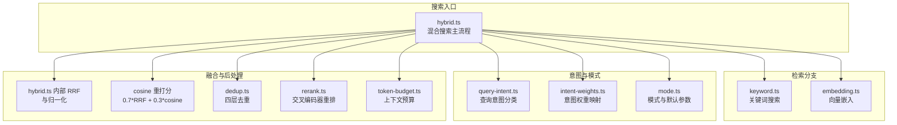
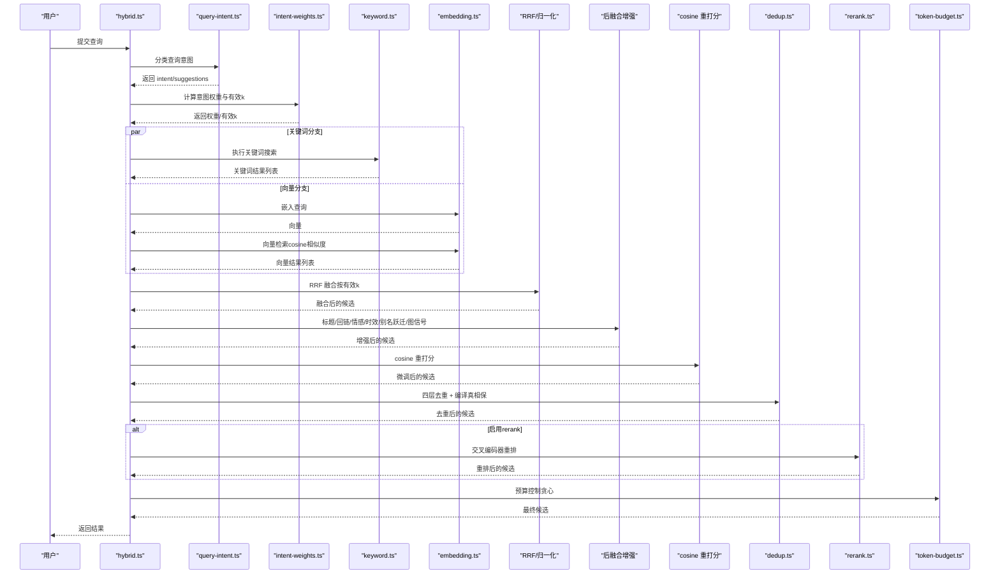
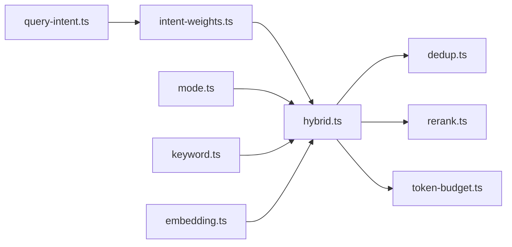

# 混合搜索原理

<cite>
**本文引用的文件**
- [hybrid.ts](file://src/core/search/hybrid.ts)
- [keyword.ts](file://src/core/search/keyword.ts)
- [mode.ts](file://src/core/search/mode.ts)
- [intent-weights.ts](file://src/core/search/intent-weights.ts)
- [query-intent.ts](file://src/core/search/query-intent.ts)
- [dedup.ts](file://src/core/search/dedup.ts)
- [embedding.ts](file://src/core/embedding.ts)
- [rerank.ts](file://src/core/search/rerank.ts)
- [token-budget.ts](file://src/core/search/token-budget.ts)
- [search-mode.test.ts](file://test/search-mode.test.ts)
- [search.test.ts](file://test/search.test.ts)
- [hybrid-search.md](file://test/e2e/fixtures/concepts/hybrid-search.md)
</cite>

## 目录
1. [引言](#引言)
2. [项目结构](#项目结构)
3. [核心组件](#核心组件)
4. [架构总览](#架构总览)
5. [详细组件分析](#详细组件分析)
6. [依赖关系分析](#依赖关系分析)
7. [性能考量](#性能考量)
8. [故障排查指南](#故障排查指南)
9. [结论](#结论)
10. [附录](#附录)

## 引言
本文件系统化阐述 GBrain 的混合搜索原理与实现，覆盖以下关键主题：
- 向量检索：基于嵌入空间的余弦相似度匹配
- 关键词匹配：基于 PostgreSQL tsquery 的全文检索
- RRF（逆秩融合）：对多路检索结果进行融合与归一化
- 查询意图识别：区分“保守/平衡/tokenmax”三种搜索模式及其权重策略
- 数学公式与权重分配：RRF 融合、意图权重、后融合增强（标题、回链、情感、时效等）
- 完整搜索流程：从查询到最终结果排序的端到端路径
- 面向初学者的概念性理解与面向开发者的实现细节及优化建议

## 项目结构
混合搜索位于 src/core/search 目录下，围绕 hybrid.ts 的主流程组织多个子模块：
- 模式与权重：mode.ts、intent-weights.ts、query-intent.ts
- 检索分支：keyword.ts（关键词）、embedding.ts（向量）
- 融合与后处理：hybrid.ts（RRF、cosine 重打分、去重、重排、预算控制）
- 可选增强：rerank.ts（交叉编码器重排）、token-budget.ts（上下文预算）

图表来源
- [hybrid.ts](file://src/core/search/hybrid.ts)
- [keyword.ts](file://src/core/search/keyword.ts)
- [embedding.ts](file://src/core/embedding.ts)
- [query-intent.ts](file://src/core/search/query-intent.ts)
- [intent-weights.ts](file://src/core/search/intent-weights.ts)
- [mode.ts](file://src/core/search/mode.ts)
- [dedup.ts](file://src/core/search/dedup.ts)
- [rerank.ts](file://src/core/search/rerank.ts)
- [token-budget.ts](file://src/core/search/token-budget.ts)

章节来源
- [hybrid.ts](file://src/core/search/hybrid.ts)
- [mode.ts](file://src/core/search/mode.ts)

## 核心组件
- 混合搜索主流程（hybrid.ts）
  - 管道：关键词 + 向量 → RRF 融合 → 归一化 → 增强（标题、回链、情感、时效、别名跃迁、图信号等）→ cosine 重打分 → 去重 → 交叉编码器重排（可选）→ 上下文预算 → 返回
  - 默认 RRF 常数 k=60；标题提升因子 1.25；编译真相保因子 2.0；cosine 重打分权重 0.7/0.3
- 关键词搜索（keyword.ts）
  - 封装引擎的全文检索接口，返回按相关度排序的结果
- 向量嵌入（embedding.ts）
  - 对查询文本进行嵌入，支持对称/非对称模型与多模态
- 查询意图识别（query-intent.ts）
  - 输出 intent（实体/时间/事件/一般）、建议详情度、建议情感/时效强度、建议模态（文本/图像/两者）
- 意图权重（intent-weights.ts）
  - 将意图映射为关键词/向量列表权重、建议时效强度、精确匹配提升因子，并计算有效 RRF k
- 模式与默认参数（mode.ts）
  - 三档模式（保守/平衡/tokenmax）的默认开关与阈值：缓存、意图加权、扩展、limit、reranker、floor_ratio、标题提升、跨模态权重、图信号、上下文检索、自动截断、关系检索等
- 去重（dedup.ts）
  - 四层去重：每页取前 3 块、文本相似度去重（Jaccard）、类型多样性、每页最大块数；最后保证每页至少保留一个编译真相块
- 交叉编码器重排（rerank.ts）
  - 仅在启用时执行，失败时降级回原顺序
- 上下文预算（token-budget.ts）
  - 基于字符估算的贪心预算控制，确保下游上下文窗口不超限

章节来源
- [hybrid.ts](file://src/core/search/hybrid.ts)
- [keyword.ts](file://src/core/search/keyword.ts)
- [embedding.ts](file://src/core/embedding.ts)
- [query-intent.ts](file://src/core/search/query-intent.ts)
- [intent-weights.ts](file://src/core/search/intent-weights.ts)
- [mode.ts](file://src/core/search/mode.ts)
- [dedup.ts](file://src/core/search/dedup.ts)
- [rerank.ts](file://src/core/search/rerank.ts)
- [token-budget.ts](file://src/core/search/token-budget.ts)

## 架构总览
混合搜索以“意图驱动 + 多源融合”的方式组织，核心思想是：
- 使用意图识别决定权重与后处理策略
- 通过 RRF 将不同来源的排序统一到同一尺度
- 在融合后引入多种“元信息”增强（标题、回链、情感、时效、图信号、别名跃迁），并用 cosine 重打分微调
- 最终通过去重、可选重排与预算控制输出稳定且可控的候选集

图表来源
- [hybrid.ts](file://src/core/search/hybrid.ts)
- [keyword.ts](file://src/core/search/keyword.ts)
- [embedding.ts](file://src/core/embedding.ts)
- [query-intent.ts](file://src/core/search/query-intent.ts)
- [intent-weights.ts](file://src/core/search/intent-weights.ts)
- [dedup.ts](file://src/core/search/dedup.ts)
- [rerank.ts](file://src/core/search/rerank.ts)
- [token-budget.ts](file://src/core/search/token-budget.ts)

## 详细组件分析

### 组件A：混合搜索主流程（hybrid.ts）
- 管道阶段
  - 关键词 + 向量检索
  - RRF 融合（默认 k=60；意图权重会转换为有效 k）
  - 归一化（使各路贡献可比）
  - 后融合增强：标题短语提升、回链/情感/时效/别名跃迁/图信号等
  - cosine 重打分（0.7×RRF + 0.3×cosine）
  - 去重（四层 + 编译真相保）
  - 可选：交叉编码器重排
  - 预算控制（贪心）
- 关键常量与策略
  - RRF_K=60；标题提升因子 1.25；编译真相提升 2.0；cosine 重打分权重 0.7/0.3
  - floor_ratio 门限用于限制元信息增强对长尾的影响
  - 支持 per-call/配置/模式三段式覆盖的参数解析
- 并发与容错
  - 查询嵌入带共享截止时间，避免卡顿导致 CLI 强制退出
  - 重排失败降级回原序，审计日志记录失败原因
  - 去重写入后台 drain，避免阻塞

章节来源
- [hybrid.ts](file://src/core/search/hybrid.ts)

### 组件B：关键词检索（keyword.ts）
- 封装引擎的全文检索接口，直接返回按相关度排序的结果
- 作为混合搜索的一路输入参与 RRF 融合

章节来源
- [keyword.ts](file://src/core/search/keyword.ts)

### 组件C：向量检索与嵌入（embedding.ts）
- 查询嵌入：根据当前配置选择对称/非对称嵌入路径
- 文档嵌入：批量嵌入，支持中英文字符计数与进度回调
- 多模态支持：文本/图像嵌入与安全回退路径

章节来源
- [embedding.ts](file://src/core/embedding.ts)

### 组件D：查询意图识别（query-intent.ts）
- 输出维度
  - intent：实体/时间/事件/一般
  - suggestedDetail：低/高（实体→低，时间/事件→高）
  - suggestedSalience：情感强度（off/on/strong）
  - suggestedRecency：时效强度（off/on/strong）
  - suggestedModality：模态（text/image/both）
- 规则要点
  - 正则库按轴划分（时间/事件/实体/全量上下文/规范定义/显式时间边界/情感/模态）
  - 显式时间边界优先于规范定义
  - 模态分类保守，默认 text；当明确出现视觉名词+模糊指代时，可触发 LLM 拨测

章节来源
- [query-intent.ts](file://src/core/search/query-intent.ts)

### 组件E：意图权重与 RRF 有效 k（intent-weights.ts）
- 权重映射
  - 实体：提升精确匹配与关键词权重
  - 时间：建议时效增强
  - 事件：提升关键词权重并软化向量权重
  - 一般：默认权重
- 有效 k 计算
  - 有效 k = 基础 k / 列表权重；权重越高，对应列表的 k 越小，对前排更敏感

章节来源
- [intent-weights.ts](file://src/core/search/intent-weights.ts)

### 组件F：模式与默认参数（mode.ts）
- 三档模式默认值
  - 保守：低 token 预算、低 limit、禁用 rerank、禁用关系检索、禁用图信号、禁用扩展
  - 平衡：中等 token 预算、中等 limit、启用 rerank、启用图信号、启用关系检索
  - tokenmax：无 token 预算上限、高 limit、启用 rerank、启用图信号、启用关系检索、启用扩展
- 参数解析链
  - per-call > per-key config > 模式包 > 安全回退（balanced）
- 其他关键项
  - floor_ratio（元信息增强门限）
  - 标题提升因子
  - 跨模态权重（文本/图像/两者）
  - 自动截断（autocut）与跳变阈值
  - 关系检索深度

章节来源
- [mode.ts](file://src/core/search/mode.ts)
- [search-mode.test.ts](file://test/search-mode.test.ts)

### 组件G：RRF 融合与归一化（hybrid.ts）
- 数学公式
  - 对每个候选，其 RRF 得分为各路列表贡献之和：sum(1 / (k + rank_in_list))
  - 默认 k=60；意图权重会转换为有效 k
  - 贡献归一化后，再叠加标题/回链/情感/时效/别名跃迁/图信号等增强
  - cosine 重打分：0.7×RRF + 0.3×cosine
- 测试验证
  - 单列表与双列表融合、自定义 k 的影响、归一化一致性

章节来源
- [hybrid.ts](file://src/core/search/hybrid.ts)
- [search.test.ts](file://test/search.test.ts)

### 组件H：去重与编译真相保（dedup.ts）
- 四层去重
  - 每页取前 3 块
  - 文本相似度去重（Jaccard）
  - 类型多样性约束（单类型不超过 60%）
  - 每页最多 N 块（默认 2）
- 编译真相保
  - 若去重后某页无编译真相块，则从原始集合中挑选该页最高分编译真相块替换最低分块

章节来源
- [dedup.ts](file://src/core/search/dedup.ts)

### 组件I：交叉编码器重排（rerank.ts）
- 输入：前 topNIn 结果
- 输出：按交叉编码器相关性重新排序
- 行为：失败时降级回原序，审计日志记录失败原因

章节来源
- [rerank.ts](file://src/core/search/rerank.ts)

### 组件J：上下文预算（token-budget.ts）
- 估算：char/4 的粗略估算，偏向高估以保证安全
- 控制：贪心从上向下累积，遇超预算即停止
- 兼容：未设置预算时等同于无操作

章节来源
- [token-budget.ts](file://src/core/search/token-budget.ts)

### 组件K：后融合增强（标题/回链/情感/时效/别名跃迁/图信号）
- 标题短语提升：当查询是页面标题的连续词序列或完全匹配时，乘以 1.25
- 回链提升：基于回链数量的对数压缩提升
- 情感/时效：基于情绪权重与生效日期的对数/半衰期衰减
- 别名跃迁：当查询精确匹配页面别名时，提升或注入该页面
- 图信号：邻接枢纽、跨源枢纽、会话去重等信号叠加
- 门限：floor_ratio 限制元信息增强对弱信号的影响

章节来源
- [hybrid.ts](file://src/core/search/hybrid.ts)

## 依赖关系分析
- 模块耦合
  - hybrid.ts 是中枢，依赖 query-intent.ts、intent-weights.ts、mode.ts、keyword.ts、embedding.ts、dedup.ts、rerank.ts、token-budget.ts
  - intent-weights.ts 依赖 query-intent.ts 的分类结果
  - mode.ts 提供参数解析与默认值，贯穿整个流程
- 外部依赖
  - 引擎接口：关键词检索、向量检索、元数据查询（回链/情感/时效/别名/图信号）
  - 网关：嵌入与重排服务调用
- 潜在循环依赖
  - 无直接循环；hybrid.ts 作为唯一聚合点，避免双向依赖

图表来源
- [hybrid.ts](file://src/core/search/hybrid.ts)
- [query-intent.ts](file://src/core/search/query-intent.ts)
- [intent-weights.ts](file://src/core/search/intent-weights.ts)
- [mode.ts](file://src/core/search/mode.ts)
- [keyword.ts](file://src/core/search/keyword.ts)
- [embedding.ts](file://src/core/embedding.ts)
- [dedup.ts](file://src/core/search/dedup.ts)
- [rerank.ts](file://src/core/search/rerank.ts)
- [token-budget.ts](file://src/core/search/token-budget.ts)

## 性能考量
- RRF 与意图权重
  - 通过有效 k 抑制单一列表的主导效应，提升融合稳定性
  - 意图权重仅做轻微调整，避免大幅重排带来的额外开销
- 去重与重排
  - 去重采用 Jaccard 文本相似度与类型多样性，兼顾召回与多样性
  - 重排仅对 topNIn 进行，长尾保持原序，减少重排成本
- 预算控制
  - char/4 估算简单高效，避免引入重型分词器
- 并发与截止时间
  - 查询嵌入共享截止时间，防止慢提供方拖垮整体
- 模式选择
  - 保守模式关闭 rerank 与关系检索，显著降低延迟与成本
  - tokenmax 模式启用扩展与重排，适合高召回场景

## 故障排查指南
- 重排失败
  - 现象：返回原序，审计日志记录失败原因
  - 排查：检查网络/鉴权/超时/配额；必要时临时关闭重排
- 嵌入卡顿
  - 现象：CLI 强制退出或超时
  - 排查：检查查询嵌入截止时间与提供方响应；适当提高超时或降级
- 结果过少或过多
  - 检查模式配置（limit、budget、rerank 开关）
  - 检查 floor_ratio 是否过度抑制元信息增强
- 去重异常
  - 检查类型多样性阈值与每页最大块数设置
  - 确认编译真相保是否正确替换

章节来源
- [rerank.ts](file://src/core/search/rerank.ts)
- [hybrid.ts](file://src/core/search/hybrid.ts)
- [dedup.ts](file://src/core/search/dedup.ts)

## 结论
GBrain 的混合搜索通过“意图驱动 + 多源融合 + 多维增强”的设计，在准确性、稳定性与成本之间取得良好平衡。RRF 融合与意图权重使不同来源的排序得以公平比较；标题/回链/情感/时效/别名跃迁/图信号等后融合增强进一步提升相关性；去重与预算控制保障结果质量与资源使用可控。开发者可根据业务目标选择合适模式，并在测试中验证意图权重与门限参数的效果。

## 附录

### A. 数学公式与权重分配
- RRF 融合
  - 对候选 i，RRF 得分 = Σ(1 / (k + rank_in_list_i))
  - 默认 k=60；意图权重转换为有效 k：k_effective = k_base / weight
- cosine 重打分
  - score_final = 0.7×RRF + 0.3×cosine_similarity
- 标题提升
  - 当查询是标题的连续词序列或完全匹配时，乘以 1.25
- 编译真相保
  - 若去重后缺失，从原始集合中选取该页最高分编译真相块替换最低分块

章节来源
- [hybrid.ts](file://src/core/search/hybrid.ts)
- [intent-weights.ts](file://src/core/search/intent-weights.ts)
- [search.test.ts](file://test/search.test.ts)

### B. 搜索流程示例（代码路径）
- 混合搜索主流程
  - [hybrid.ts](file://src/core/search/hybrid.ts)
- 关键词搜索
  - [keyword.ts](file://src/core/search/keyword.ts)
- 向量嵌入
  - [embedding.ts](file://src/core/embedding.ts)
- 查询意图分类
  - [query-intent.ts](file://src/core/search/query-intent.ts)
- 意图权重与有效 k
  - [intent-weights.ts](file://src/core/search/intent-weights.ts)
- 模式与默认参数
  - [mode.ts](file://src/core/search/mode.ts)
- 去重
  - [dedup.ts](file://src/core/search/dedup.ts)
- 交叉编码器重排
  - [rerank.ts](file://src/core/search/rerank.ts)
- 上下文预算
  - [token-budget.ts](file://src/core/search/token-budget.ts)

章节来源
- [hybrid.ts](file://src/core/search/hybrid.ts)
- [keyword.ts](file://src/core/search/keyword.ts)
- [embedding.ts](file://src/core/embedding.ts)
- [query-intent.ts](file://src/core/search/query-intent.ts)
- [intent-weights.ts](file://src/core/search/intent-weights.ts)
- [mode.ts](file://src/core/search/mode.ts)
- [dedup.ts](file://src/core/search/dedup.ts)
- [rerank.ts](file://src/core/search/rerank.ts)
- [token-budget.ts](file://src/core/search/token-budget.ts)