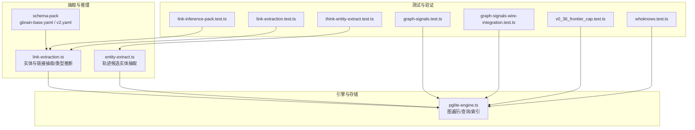
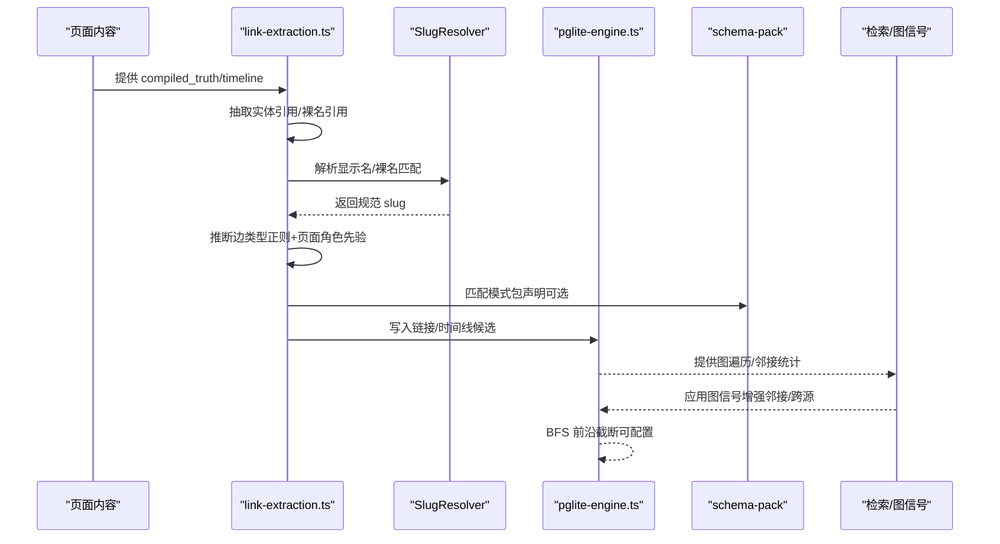
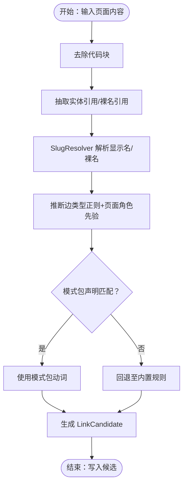
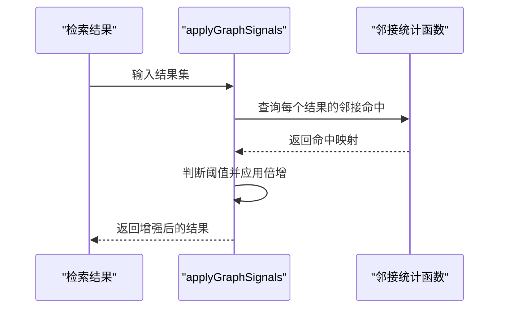
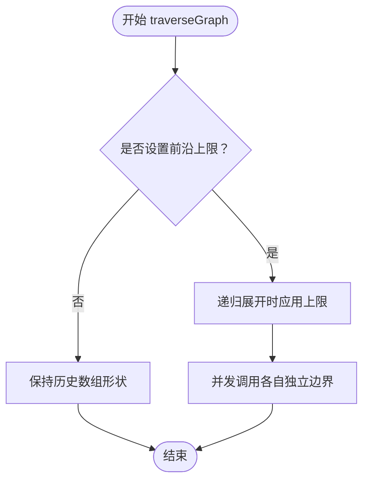
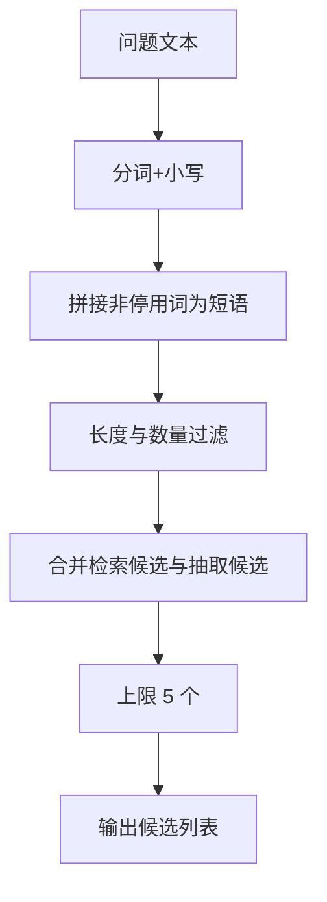
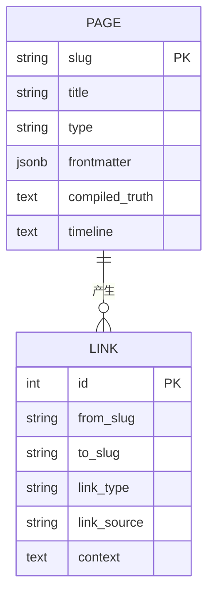
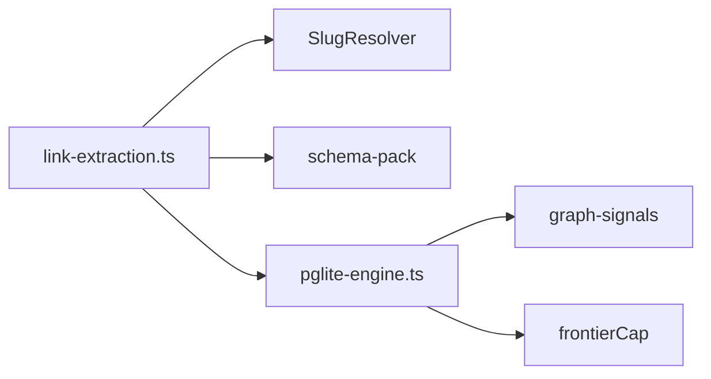

# 知识图谱自连接

<cite>
**本文引用的文件**
- [link-extraction.ts](file://src/core/link-extraction.ts)
- [entity-extract.ts](file://src/core/think/entity-extract.ts)
- [link-inference-pack.test.ts](file://test/link-inference-pack.test.ts)
- [link-extraction.test.ts](file://test/link-extraction.test.ts)
- [graph-signals.test.ts](file://test/search/graph-signals.test.ts)
- [graph-signals-wire-integration.test.ts](file://test/search/graph-signals-wire-integration.test.ts)
- [v0_36_frontier_cap.test.ts](file://test/regressions/v0_36_frontier_cap.test.ts)
- [pglite-engine.ts](file://src/core/pglite-engine.ts)
- [gbrain-base.yaml](file://src/core/schema-pack/base/gbrain-base.yaml)
- [gbrain-base-v2.yaml](file://src/core/schema-pack/base/gbrain-base-v2.yaml)
- [whoknows.test.ts](file://test/e2e/whoknows.test.ts)
- [think-entity-extract.test.ts](file://test/think-entity-extract.test.ts)
- [enrichment-service.ts](file://src/core/enrichment-service.ts)
- [operations.ts](file://src/core/operations.ts)
</cite>

## 目录
1. [引言](#引言)
2. [项目结构](#项目结构)
3. [核心组件](#核心组件)
4. [架构总览](#架构总览)
5. [详细组件分析](#详细组件分析)
6. [依赖分析](#依赖分析)
7. [性能考量](#性能考量)
8. [故障排查指南](#故障排查指南)
9. [结论](#结论)
10. [附录](#附录)

## 引言
本技术文档聚焦于 GBrain 的“知识图谱自连接”机制，系统阐述其在不依赖大语言模型（LLM）的前提下，如何通过纯规则与启发式方法完成实体抽取、类型化边创建、存储与查询优化、以及专家路由与关系发现。文档还覆盖实体消歧与链接推理的实现细节，并给出图遍历查询的性能调优与扩展性建议。

## 项目结构
围绕知识图谱自连接的关键模块与测试如下：
- 实体与链接抽取：src/core/link-extraction.ts
- 轨迹路由候选实体抽取：src/core/think/entity-extract.ts
- 链接类型推断与模式包：test/link-inference-pack.test.ts、src/core/schema-pack/base/gbrain-base.yaml、src/core/schema-pack/base/gbrain-base-v2.yaml
- 图信号增强与查询优化：test/search/graph-signals.test.ts、test/search/graph-signals-wire-integration.test.ts
- 图遍历与前沿截断：test/regressions/v0_36_frontier_cap.test.ts、src/core/pglite-engine.ts
- 专家路由与检索：test/e2e/whoknows.test.ts
- 增强服务与简单实体抽取：src/core/enrichment-service.ts
- 操作接口与参数：src/core/operations.ts

**图表来源**
- [link-extraction.ts:1-1230](file://src/core/link-extraction.ts#L1-L1230)
- [entity-extract.ts:1-197](file://src/core/think/entity-extract.ts#L1-L197)
- [gbrain-base.yaml:109-162](file://src/core/schema-pack/base/gbrain-base.yaml#L109-L162)
- [gbrain-base-v2.yaml:305-328](file://src/core/schema-pack/base/gbrain-base-v2.yaml#L305-L328)
- [pglite-engine.ts:1-200](file://src/core/pglite-engine.ts#L1-L200)

**章节来源**
- [link-extraction.ts:1-1230](file://src/core/link-extraction.ts#L1-L1230)
- [entity-extract.ts:1-197](file://src/core/think/entity-extract.ts#L1-L197)
- [gbrain-base.yaml:109-162](file://src/core/schema-pack/base/gbrain-base.yaml#L109-L162)
- [gbrain-base-v2.yaml:305-328](file://src/core/schema-pack/base/gbrain-base-v2.yaml#L305-L328)
- [pglite-engine.ts:1-200](file://src/core/pglite-engine.ts#L1-L200)

## 核心组件
- 实体与链接抽取器：负责从页面内容中抽取实体引用、裸名引用与前言字段生成的边，同时进行上下文窗口截取与去重。
- 类型化边推断：基于正则与页面角色先验，确定边类型（如 founded、invested_in、advises、works_at、mentions），并支持模式包扩展。
- 专家路由与检索：通过图邻接信号与多路信号增强，提升专家查找与关系发现质量。
- 图遍历与前沿截断：在大规模图上以 BFS 前沿上限控制输出规模，保证稳定性与可预测性。
- 存储与查询优化：利用索引与查询信号增强，结合邻接度与跨源命中进行打分调整。

**章节来源**
- [link-extraction.ts:465-577](file://src/core/link-extraction.ts#L465-L577)
- [link-extraction.ts:694-724](file://src/core/link-extraction.ts#L694-L724)
- [graph-signals.test.ts:151-185](file://test/search/graph-signals.test.ts#L151-L185)
- [v0_36_frontier_cap.test.ts:79-134](file://test/regressions/v0_36_frontier_cap.test.ts#L79-L134)

## 架构总览
下图展示了从内容到图谱、再到查询与增强的整体流程：

**图表来源**
- [link-extraction.ts:465-577](file://src/core/link-extraction.ts#L465-L577)
- [link-extraction.ts:694-724](file://src/core/link-extraction.ts#L694-L724)
- [link-inference-pack.test.ts:20-64](file://test/link-inference-pack.test.ts#L20-L64)
- [graph-signals.test.ts:151-185](file://test/search/graph-signals.test.ts#L151-L185)
- [v0_36_frontier_cap.test.ts:79-106](file://test/regressions/v0_36_frontier_cap.test.ts#L79-L106)

## 详细组件分析

### 组件A：实体抽取与类型化边推断（纯规则，无LLM）
- 实体引用抽取：支持 Markdown 链接与 Obsidian 风格维基链接，过滤代码块，避免误抽。
- 裸名引用抽取：限定在实体目录白名单内，避免误抽非实体文本。
- 边类型推断：基于正则表达式与页面角色先验，优先级为 founded > invested_in > advises > works_at > 角色先验 > mentions。
- 模式包扩展：通过 link_types[].inference.regex 与 page_type 条件声明新动词，不影响既有规则回退路径。
- 全局裸名解析：当开启全局基础名解析时，对未命中目录前缀的 `[[bare]]` 进行全库 basename 匹配，生成 wikilink_basename 边。

**图表来源**
- [link-extraction.ts:301-386](file://src/core/link-extraction.ts#L301-L386)
- [link-extraction.ts:465-577](file://src/core/link-extraction.ts#L465-L577)
- [link-extraction.ts:694-724](file://src/core/link-extraction.ts#L694-L724)
- [link-inference-pack.test.ts:20-64](file://test/link-inference-pack.test.ts#L20-L64)

**章节来源**
- [link-extraction.ts:301-386](file://src/core/link-extraction.ts#L301-L386)
- [link-extraction.ts:465-577](file://src/core/link-extraction.ts#L465-L577)
- [link-extraction.ts:694-724](file://src/core/link-extraction.ts#L694-L724)
- [link-inference-pack.test.ts:20-64](file://test/link-inference-pack.test.ts#L20-L64)
- [link-extraction.test.ts:506-620](file://test/link-extraction.test.ts#L506-L620)

### 组件B：专家路由与关系发现（基于图邻接信号）
- 邻接度增强：当目标实体在 top-K 中拥有较高入链命中数时，按倍数提升其分数，并标注图邻接命中数与倍增系数。
- 跨源增强：当命中来自多个来源时叠加增强效果。
- 端到端回归验证：通过小子图设置多来源共同指向同一实体，确保邻接增强生效且不误触发。

**图表来源**
- [graph-signals.test.ts:151-185](file://test/search/graph-signals.test.ts#L151-L185)
- [graph-signals-wire-integration.test.ts:29-53](file://test/search/graph-signals-wire-integration.test.ts#L29-L53)

**章节来源**
- [graph-signals.test.ts:151-185](file://test/search/graph-signals.test.ts#L151-L185)
- [graph-signals-wire-integration.test.ts:29-53](file://test/search/graph-signals-wire-integration.test.ts#L29-L53)

### 组件C：图遍历与前沿截断（可配置上限）
- BFS 前沿上限：在递归展开时对每层结果施加上限，防止输出爆炸；上限未设置时保持历史数组形状兼容。
- 并发隔离：不同并发调用各自独立的上限，互不干扰。
- MCP 线路契约：返回数组而非结构体，保证跨进程通信契约稳定。

**图表来源**
- [v0_36_frontier_cap.test.ts:79-134](file://test/regressions/v0_36_frontier_cap.test.ts#L79-L134)

**章节来源**
- [v0_36_frontier_cap.test.ts:79-134](file://test/regressions/v0_36_frontier_cap.test.ts#L79-L134)
- [pglite-engine.ts:1-200](file://src/core/pglite-engine.ts#L1-L200)

### 组件D：实体消歧与链接推理（轨迹候选抽取）
- 来自检索的高精度实体候选：优先采用检索返回的实体前缀 slug。
- 问题文本的名词短语抽取：停用词过滤后拼接多词短语，限制长度与数量。
- 候选上限与来源标记：最多 5 个候选，来源区分“检索”与“抽取”，便于下游解析门控。

**图表来源**
- [entity-extract.ts:114-173](file://src/core/think/entity-extract.ts#L114-L173)
- [think-entity-extract.test.ts:1-102](file://test/think-entity-extract.test.ts#L1-L102)

**章节来源**
- [entity-extract.ts:114-173](file://src/core/think/entity-extract.ts#L114-L173)
- [think-entity-extract.test.ts:1-102](file://test/think-entity-extract.test.ts#L1-L102)

### 组件E：存储结构与查询优化（索引与列）
- 页面类型与提取开关：基础模式包定义了页面类型、可提取性与专家路由开关，用于控制抽取与路由行为。
- 关系类型与反向关系：基础模式包声明了多种关系类型及其反向关系，便于双向查询与一致性校验。
- 增强服务的简单实体抽取：基于正则匹配大写多词名称并进行公司/人类型粗判，作为补充。

**图表来源**
- [gbrain-base.yaml:109-162](file://src/core/schema-pack/base/gbrain-base.yaml#L109-L162)
- [gbrain-base-v2.yaml:305-328](file://src/core/schema-pack/base/gbrain-base-v2.yaml#L305-L328)
- [enrichment-service.ts:249-273](file://src/core/enrichment-service.ts#L249-L273)

**章节来源**
- [gbrain-base.yaml:109-162](file://src/core/schema-pack/base/gbrain-base.yaml#L109-L162)
- [gbrain-base-v2.yaml:305-328](file://src/core/schema-pack/base/gbrain-base-v2.yaml#L305-L328)
- [enrichment-service.ts:249-273](file://src/core/enrichment-service.ts#L249-L273)

## 依赖分析
- link-extraction.ts 依赖：
  - 正则与上下文窗口工具（excerpt）
  - SlugResolver（解析显示名与裸名，支持模糊匹配与关键词搜索回退）
  - 模式包（link_types[].inference.regex 与 page_type 条件）
- pglite-engine.ts 依赖：
  - 图遍历与邻接统计接口
  - 查询信号增强（applyGraphSignals）
  - 前沿截断参数（frontierCap）

**图表来源**
- [link-extraction.ts:887-1002](file://src/core/link-extraction.ts#L887-L1002)
- [pglite-engine.ts:1-200](file://src/core/pglite-engine.ts#L1-L200)
- [graph-signals.test.ts:151-185](file://test/search/graph-signals.test.ts#L151-L185)
- [v0_36_frontier_cap.test.ts:79-106](file://test/regressions/v0_36_frontier_cap.test.ts#L79-L106)

**章节来源**
- [link-extraction.ts:887-1002](file://src/core/link-extraction.ts#L887-L1002)
- [pglite-engine.ts:1-200](file://src/core/pglite-engine.ts#L1-L200)

## 性能考量
- 正则与角色先验：类型推断完全由正则与页面角色先验驱动，避免 LLM 调用，延迟低、吞吐高。
- 前沿截断：通过 frontierCap 控制图遍历输出规模，避免大规模图导致的内存与时间膨胀。
- 查询信号增强：仅在启用时执行邻接统计与打分调整，失败时 fail-open 不影响主流程。
- 候选上限：轨迹候选抽取限制在 5 个以内，降低后续解析成本。
- 存储与索引：合理使用索引与列设计（如反向关系、类型过滤）可显著提升查询效率。

[本节为通用指导，无需特定文件引用]

## 故障排查指南
- 链接类型推断异常
  - 检查正则是否覆盖目标语境；必要时通过模式包添加 link_types[].inference.regex。
  - 使用测试用例定位边界场景（如“board member”与“advisor”的区分）。
- 全局裸名解析未生效
  - 确认已开启 global_basename 配置或环境变量，并检查 SlugResolver 的 basename 索引构建是否成功。
- 图遍历输出过大
  - 设置 frontierCap 并观察并发调用是否互相影响；确认未误用历史数组形状。
- 查询信号增强无效
  - 检查 applyGraphSignals 是否启用、邻接统计函数是否返回命中映射、阈值设置是否合理。
- 专家路由命中不足
  - 确认实体前缀与页面类型正确；检查邻接度与跨源命中是否满足阈值。

**章节来源**
- [link-inference-pack.test.ts:20-64](file://test/link-inference-pack.test.ts#L20-L64)
- [link-extraction.test.ts:506-620](file://test/link-extraction.test.ts#L506-L620)
- [v0_36_frontier_cap.test.ts:79-134](file://test/regressions/v0_36_frontier_cap.test.ts#L79-L134)
- [graph-signals.test.ts:151-185](file://test/search/graph-signals.test.ts#L151-L185)
- [whoknows.test.ts:193-235](file://test/e2e/whoknows.test.ts#L193-L235)

## 结论
GBrain 的知识图谱自连接以“纯规则 + 模式包扩展 + 图信号增强”为核心，实现了在不依赖 LLM 的前提下高质量地抽取实体、推断类型化边、构建与优化图谱。通过前沿截断、查询信号增强与候选上限等手段，系统在大规模脑库上仍能保持稳定与高效。专家路由与关系发现进一步提升了检索质量与可用性，为知识合成与智能路由奠定坚实基础。

[本节为总结性内容，无需特定文件引用]

## 附录
- 操作接口参数参考：near_symbol 与 walk_depth 参数用于查询操作的近似符号与遍历深度控制。
- E2E 专家路由评估：whoknows 测试用例验证类型过滤与零匹配场景下的稳健性与评分分解。

**章节来源**
- [operations.ts:174-181](file://src/core/operations.ts#L174-L181)
- [whoknows.test.ts:157-235](file://test/e2e/whoknows.test.ts#L157-L235)