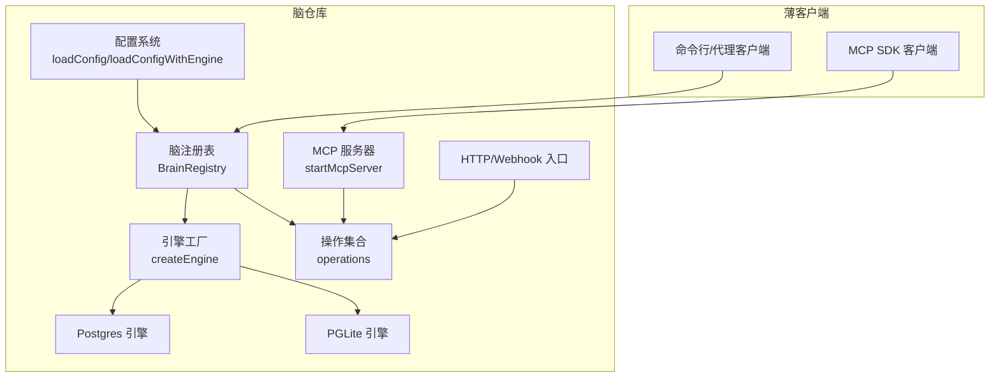
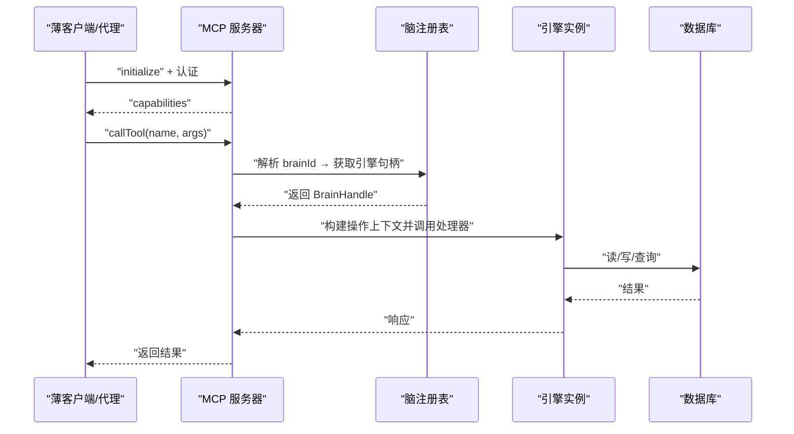
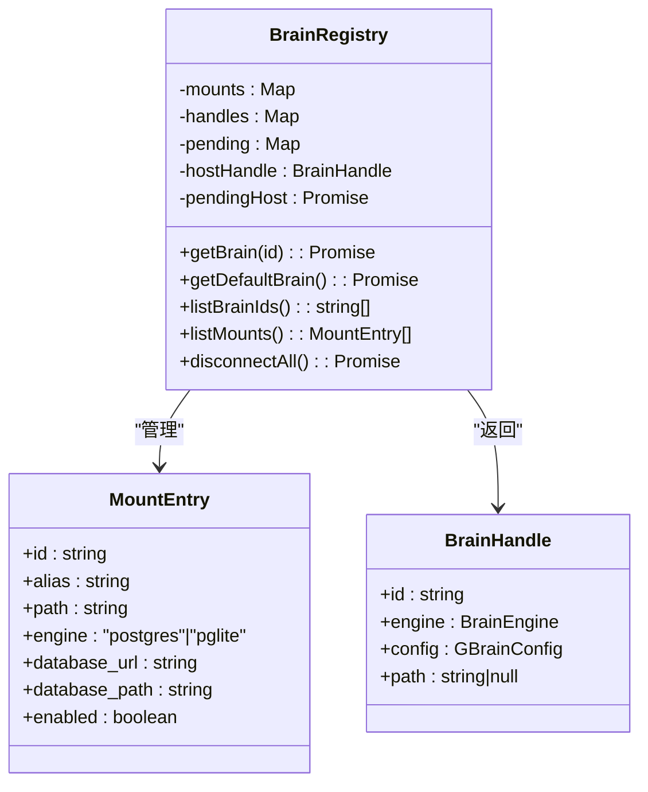
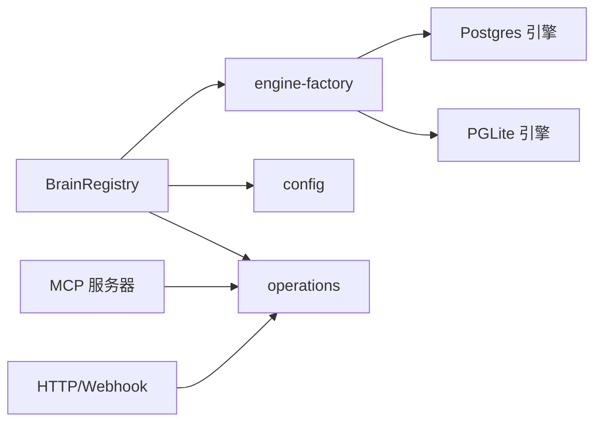

# 脑仓库概念

<cite>
**本文引用的文件**
- [src/core/brain-registry.ts](file://src/core/brain-registry.ts)
- [src/core/engine-factory.ts](file://src/core/engine-factory.ts)
- [src/core/config.ts](file://src/core/config.ts)
- [src/core/pglite-engine.ts](file://src/core/pglite-engine.ts)
- [src/core/operations.ts](file://src/core/operations.ts)
- [src/mcp/server.ts](file://src/mcp/server.ts)
- [src/core/remote-mcp-probe.ts](file://src/core/remote-mcp-probe.ts)
- [test/e2e/thin-client.test.ts](file://test/e2e/thin-client.test.ts)
- [test/e2e/connect-bearer.test.ts](file://test/e2e/connect-bearer.test.ts)
- [test/e2e/serve-http-ingest-webhook.test.ts](file://test/e2e/serve-http-ingest-webhook.test.ts)
- [test/e2e/mcp.test.ts](file://test/e2e/mcp.test.ts)
- [test/e2e/fixtures/concepts/compiled-truth.md](file://test/e2e/fixtures/concepts/compiled-truth.md)
- [test/e2e/fixtures/projects/gbrain.md](file://test/e2e/fixtures/projects/gbrain.md)
- [test/fixtures/skill-catalog/skills/brain-ops/README.md](file://test/fixtures/skill-catalog/skills/brain-ops/README.md)
- [test/fixtures/brain-first-skills/missing-brain-first/README.md](file://test/fixtures/brain-first-skills/missing-brain-first/README.md)
- [test/fixtures/brain-first-skills/negation-prose/README.md](file://test/fixtures/brain-first-skills/negation-prose/README.md)
</cite>

## 目录
1. [引言](#引言)
2. [项目结构](#项目结构)
3. [核心组件](#核心组件)
4. [架构总览](#架构总览)
5. [详细组件分析](#详细组件分析)
6. [依赖关系分析](#依赖关系分析)
7. [性能考量](#性能考量)
8. [故障排查指南](#故障排查指南)
9. [结论](#结论)
10. [附录](#附录)

## 引言
本文件围绕 GBrain 的“脑仓库”（Brain）概念，系统化阐述其作为系统记录（System of Record）的核心地位与职责边界；解释薄客户端架构的设计理念与实现路径；说明多脑挂载、分布式拓扑与一致性保障；梳理与外部系统（MCP 协议、Webhook、HTTP API）的集成方式；并给出状态管理、健康检查与故障转移的实现要点。最后总结知识管理、检索服务与技能执行中的协调机制，并提供部署、监控与运维最佳实践。

## 项目结构
- 脑注册表与路由：通过脑注册表解析操作上下文中的 brainId 到具体引擎实例，支持“主机脑”与“挂载脑”的统一调度。
- 引擎工厂：按配置动态选择 Postgres 或 PGLite 引擎，避免不必要的 WASM 加载。
- 配置系统：集中管理数据库连接、模型参数、远程薄客户端模式、内容安全策略等。
- MCP 服务器：暴露工具清单与调用能力，支持本地 stdio 与远端 MCP 客户端。
- Webhook/HTTP 接入：提供受控的 HTTP 入口，用于外部系统向脑仓库提交内容与触发处理。
- 健康与状态：统一的健康检查与统计接口，支撑薄客户端展示与诊断。

图表来源
- [src/core/brain-registry.ts](file://src/core/brain-registry.ts)
- [src/core/engine-factory.ts](file://src/core/engine-factory.ts)
- [src/core/config.ts](file://src/core/config.ts)
- [src/mcp/server.ts](file://src/mcp/server.ts)

章节来源
- [src/core/brain-registry.ts](file://src/core/brain-registry.ts)
- [src/core/engine-factory.ts](file://src/core/engine-factory.ts)
- [src/core/config.ts](file://src/core/config.ts)
- [src/mcp/server.ts](file://src/mcp/server.ts)

## 核心组件
- 脑注册表（BrainRegistry）
  - 维护“主机脑”与“挂载脑”的映射，惰性初始化与缓存，支持并发去重。
  - 提供默认脑与指定脑句柄解析，未知或禁用脑抛出明确错误。
- 引擎工厂（createEngine）
  - 根据配置动态导入并实例化引擎，避免非必要模块加载。
- 配置系统（loadConfig/loadConfigWithEngine）
  - 合并环境变量、文件与数据库平面配置，支持远程薄客户端模式与内容安全策略等。
- MCP 服务器（startMcpServer）
  - 暴露工具清单与调用，支持 stdio 与远端 MCP 客户端，内置 IPC 实体指针解析通道。
- HTTP/Webhook 入口
  - 受控的内容类型白名单、头部覆盖、幂等队列与作业分发。

章节来源
- [src/core/brain-registry.ts](file://src/core/brain-registry.ts)
- [src/core/engine-factory.ts](file://src/core/engine-factory.ts)
- [src/core/config.ts](file://src/core/config.ts)
- [src/mcp/server.ts](file://src/mcp/server.ts)
- [test/e2e/serve-http-ingest-webhook.test.ts](file://test/e2e/serve-http-ingest-webhook.test.ts)

## 架构总览
脑仓库以“单一可信事实源”为核心，通过以下机制实现：
- 系统记录（SoR）：所有写入与变更经由统一的引擎与操作集，确保知识页、块、链接、时间线等实体的一致性。
- 薄客户端：CLI/代理仅负责路由与认证，不直接持有本地数据库；通过 MCP 或 HTTP 访问远程脑仓库。
- 分布式拓扑：支持多脑挂载（同一物理机多实例），通过挂载路径与连接池隔离；远程薄客户端通过 OAuth/MCP 访问。
- 数据一致性：通过严格的配置合并优先级、连接池隔离、健康检查与迁移检查，降低冲突与漂移风险。
- 外部集成：MCP 工具面与 HTTP/Webhook 提供多入口，结合权限与头部覆盖实现可控接入。

图表来源
- [src/mcp/server.ts](file://src/mcp/server.ts)
- [src/core/brain-registry.ts](file://src/core/brain-registry.ts)
- [src/core/operations.ts](file://src/core/operations.ts)

## 详细组件分析

### 脑注册表与多脑挂载
- 设计要点
  - 主机脑：来自用户配置文件与环境变量，惰性初始化。
  - 挂载脑：来自挂载清单，支持本地克隆路径与不同引擎类型。
  - 并发去重：同一 id 的首次初始化只进行一次，后续复用 Promise。
  - 连接池隔离：挂载脑强制使用实例级连接池，避免跨实例共享导致的连接竞争。
- 错误与边界
  - 重复挂载路径：阻止两个挂载指向同一本地路径。
  - 未知/禁用脑：抛出可诊断错误，提示可用列表与添加方式。

图表来源
- [src/core/brain-registry.ts](file://src/core/brain-registry.ts)

章节来源
- [src/core/brain-registry.ts](file://src/core/brain-registry.ts)

### 引擎工厂与运行时选择
- 动态导入：根据配置选择 Postgres 或 PGLite 引擎，避免非必要模块加载。
- 运行时差异：PGLite 适合轻量场景，Postgres 适合团队共享与高并发。

章节来源
- [src/core/engine-factory.ts](file://src/core/engine-factory.ts)

### 配置系统与薄客户端模式
- 配置来源优先级：环境变量 > 文件配置 > 数据库平面配置 > 默认值。
- 薄客户端开关：当存在远程 MCP 配置时，CLI 会拒绝需要本地数据库的子命令，强制走远程传输。
- 内容安全策略：可通过文件/环境/数据库平面配置，统一控制页面大小、标记比例与垃圾内容处置。

章节来源
- [src/core/config.ts](file://src/core/config.ts)
- [test/e2e/thin-client.test.ts](file://test/e2e/thin-client.test.ts)

### MCP 服务器与工具面
- 工具定义：从操作集合自动生成工具清单，保证 CLI、MCP 与工具 JSON 的契约一致。
- 远端调用：默认视为远端调用，限制可见范围与来源隔离。
- IPC 实体指针：在 PGLite 场景下，通过本地套接字提供实体指针解析通道，提升上下文注入效率。

章节来源
- [src/mcp/server.ts](file://src/mcp/server.ts)
- [test/e2e/mcp.test.ts](file://test/e2e/mcp.test.ts)

### HTTP/Webhook 入口与集成
- 受控内容类型：基于白名单与头部覆盖，确保输入可控且可追溯。
- 幂等与作业：相同内容在相同客户端下产生相同作业 ID，避免重复处理。
- 权限与令牌：通过 OAuth 客户端凭据发放访问令牌，限定作用域与过期。

章节来源
- [test/e2e/serve-http-ingest-webhook.test.ts](file://test/e2e/serve-http-ingest-webhook.test.ts)

### 健康检查与状态管理
- 健康指标：综合页面数、嵌入覆盖率、链接覆盖率、时间线索引覆盖率等，形成健康评分与状态快照。
- 远程薄客户端诊断：通过远程 doctor 报告与健康快照，定位连接、模式版本、队列健康等问题。
- 轻量身份：薄客户端横幅展示版本、引擎类型与统计信息，便于快速识别目标脑。

章节来源
- [src/core/operations.ts](file://src/core/operations.ts)
- [src/core/pglite-engine.ts](file://src/core/pglite-engine.ts)
- [test/e2e/thin-client.test.ts](file://test/e2e/thin-client.test.ts)

### 知识管理、检索与技能执行的协调
- 编译真相与时间线：采用两段式页面模式，编译真相为当前权威认知，时间线保留证据链，便于溯源与验证。
- 检索增强生成（RAG）：采用混合检索（向量+关键词）与重排融合，提升结果质量与召回。
- 技能执行：强调“脑优先”，先查脑再查外网，减少对外部依赖与噪声污染。

章节来源
- [test/e2e/fixtures/concepts/compiled-truth.md](file://test/e2e/fixtures/concepts/compiled-truth.md)
- [test/e2e/fixtures/projects/gbrain.md](file://test/e2e/fixtures/projects/gbrain.md)
- [test/fixtures/skill-catalog/skills/brain-ops/README.md](file://test/fixtures/skill-catalog/skills/brain-ops/README.md)
- [test/fixtures/brain-first-skills/missing-brain-first/README.md](file://test/fixtures/brain-first-skills/missing-brain-first/README.md)
- [test/fixtures/brain-first-skills/negation-prose/README.md](file://test/fixtures/brain-first-skills/negation-prose/README.md)

## 依赖关系分析
- 耦合与内聚
  - 脑注册表对引擎工厂与配置系统有强依赖，但通过接口抽象保持良好内聚。
  - MCP 服务器与操作集合解耦，工具定义与调用通过统一分发层完成。
- 外部依赖
  - MCP SDK、HTTP 服务器、数据库驱动；通过环境变量与配置文件隔离外部影响。
- 循环依赖
  - 未见循环导入；模块职责清晰，分层明确。

图表来源
- [src/core/brain-registry.ts](file://src/core/brain-registry.ts)
- [src/core/engine-factory.ts](file://src/core/engine-factory.ts)
- [src/mcp/server.ts](file://src/mcp/server.ts)
- [src/core/operations.ts](file://src/core/operations.ts)

章节来源
- [src/core/brain-registry.ts](file://src/core/brain-registry.ts)
- [src/core/engine-factory.ts](file://src/core/engine-factory.ts)
- [src/mcp/server.ts](file://src/mcp/server.ts)
- [src/core/operations.ts](file://src/core/operations.ts)

## 性能考量
- 引擎选择：PGLite 适合单机/轻量，Postgres 适合多实例与高并发；按需选择以平衡延迟与吞吐。
- 连接池隔离：挂载脑强制实例级连接池，避免全局单例导致的争用与抖动。
- 操作批量化：批量写入与查询可显著降低往返开销；注意内存与事务粒度的平衡。
- 检索优化：混合检索与重排融合在质量与性能间取得平衡；合理设置维度与索引可降低延迟。
- 薄客户端：远端调用引入网络开销，建议缓存横幅信息与健康快照，减少频繁查询。

## 故障排查指南
- 远程薄客户端连通性
  - 使用 MCP 探针验证授权与连通性，区分鉴权失败、网络不可达与超时。
- 健康检查
  - 通过 doctor 报告与健康快照定位连接、模式版本、队列健康等关键问题。
- 配置冲突
  - 检查环境变量、文件与数据库平面配置的优先级，确认是否被意外覆盖。
- Webhook 幂等与类型
  - 确认内容类型白名单与头部覆盖是否正确；重复内容应得到相同作业 ID。
- 引擎工厂
  - 确认引擎类型与连接参数匹配；PGLite 与 Postgres 的差异点需单独校验。

章节来源
- [src/core/remote-mcp-probe.ts](file://src/core/remote-mcp-probe.ts)
- [test/e2e/connect-bearer.test.ts](file://test/e2e/connect-bearer.test.ts)
- [test/e2e/thin-client.test.ts](file://test/e2e/thin-client.test.ts)
- [test/e2e/serve-http-ingest-webhook.test.ts](file://test/e2e/serve-http-ingest-webhook.test.ts)

## 结论
脑仓库作为系统记录，通过严格的配置优先级、多脑挂载与连接池隔离、健康检查与薄客户端模式，实现了在分布式与多入口场景下的高可靠与可运维性。其“编译真相+时间线”的知识组织范式与“脑优先”的技能执行策略，进一步强化了知识的可发现性与可审计性。配合 MCP 与 HTTP/Webhook 的集成，脑仓库既能满足本地开发与团队协作，也能面向外部系统提供稳定、可控的入口。

## 附录
- 部署建议
  - 生产环境优先使用 Postgres；PGLite 适合本地开发与演示。
  - 为每个挂载脑配置独立连接池与日志，避免串扰。
  - 开启健康检查与迁移检查，定期审查 doctor 报告。
- 监控与告警
  - 关注健康评分、队列长度、嵌入覆盖率与时间线覆盖率。
  - 对薄客户端横幅与 doctor 报告建立基线，异常波动及时告警。
- 维护最佳实践
  - 严格遵循“脑优先”原则，减少对外部 API 的依赖。
  - 使用头部覆盖与白名单控制输入，避免不受控内容进入。
  - 定期升级与回滚演练，利用升级检查点与迁移脚本保障平滑演进。