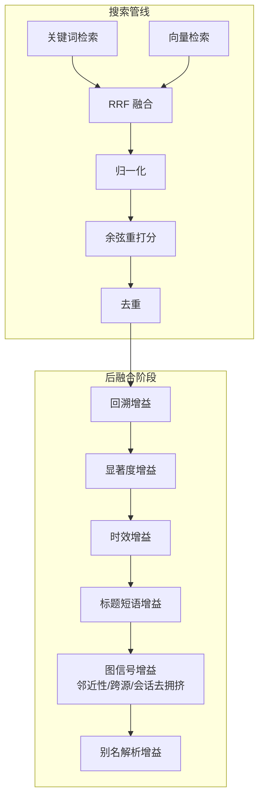
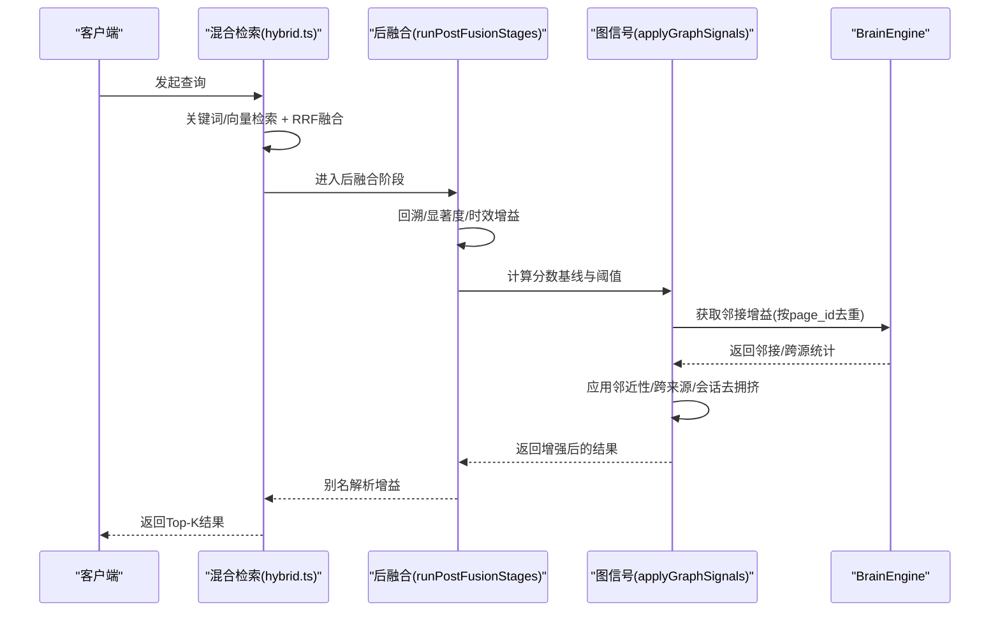
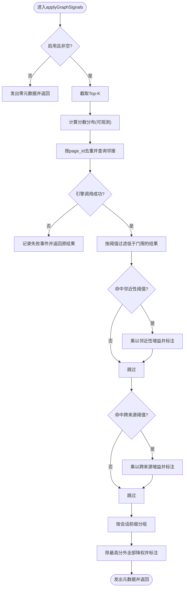
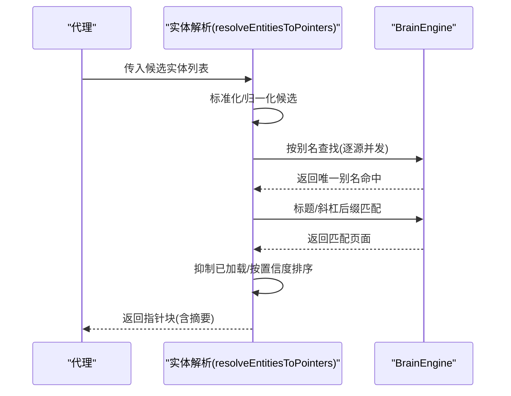
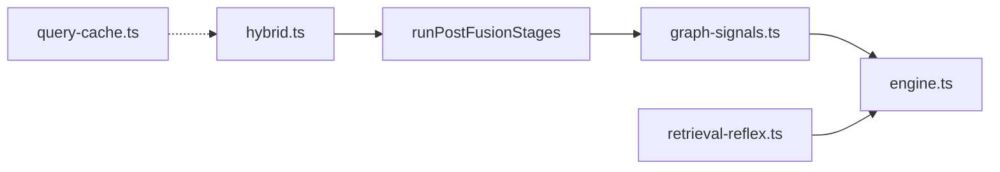

# 图信号与搜索增强

<cite>
**本文档引用的文件**
- [graph-signals.ts](file://src/core/search/graph-signals.ts)
- [hybrid.ts](file://src/core/search/hybrid.ts)
- [retrieval-reflex.ts](file://src/core/context/retrieval-reflex.ts)
- [graph-query.ts](file://src/commands/graph-query.ts)
- [graph-signals.test.ts](file://test/search/graph-signals.test.ts)
- [graph-signals-eval.test.ts](file://test/e2e/graph-signals-eval.test.ts)
- [graph-signals-engine.test.ts](file://test/e2e/graph-signals-engine.test.ts)
- [graph-signals-wire-integration.test.ts](file://test/search/graph-signals-wire-integration.test.ts)
- [search-mode.test.ts](file://test/search-mode.test.ts)
- [query-cache.ts](file://src/core/search/query-cache.ts)
- [query-cache.test.ts](file://test/query-cache.test.ts)
- [query-cache-knobs-hash.serial.test.ts](file://test/query-cache-knobs-hash.serial.test.ts)
- [engine.ts](file://src/core/engine.ts)
- [SKILL.md（信号检测器）](file://skills/signal-detector/README.md)
- [SKILL.md（检索反射）](file://recipes/retrieval-reflex/skills/retrieval-reflex/README.md)
</cite>

## 目录
1. [引言](#引言)
2. [项目结构](#项目结构)
3. [核心组件](#核心组件)
4. [架构总览](#架构总览)
5. [详细组件分析](#详细组件分析)
6. [依赖关系分析](#依赖关系分析)
7. [性能考量](#性能考量)
8. [故障排查指南](#故障排查指南)
9. [结论](#结论)
10. [附录](#附录)

## 引言
本文件系统化阐述“图信号”在搜索中的作用与实现，覆盖以下关键主题：
- 邻近性提升：基于结果集内部链接关系的微增益
- 跨来源验证：跨源链接强度作为可信度信号
- 会话去拥挤：同一会话片段的降权以避免重复信息主导
- 检索反射器：实体触发与按需打开页面的机制
- 图模式识别与异常检测：通过图信号统计与失败审计进行质量监控
- 实时计算与缓存策略：查询缓存与图信号观测指标
- 增强搜索结果的实际示例与配置调优
- 对搜索质量与性能的影响评估

## 项目结构
围绕“图信号”的核心代码分布在以下模块：
- 搜索后融合阶段：在混合检索完成向量与关键词融合、归一化之后，执行元数据级增益与图信号增强
- 图信号应用：在后融合阶段第4步执行，叠加于回溯、显著度、时效等元数据增益之上
- 检索反射器：在对话中按需触发，打开与当前话题相关的脑页，辅助交叉来源验证
- 查询缓存：为不同模式与参数组合提供可区分的缓存键，支撑图信号的可重复实验与回归测试

图表来源
- [hybrid.ts:406-520](file://src/core/search/hybrid.ts#L406-L520)

章节来源
- [hybrid.ts:406-520](file://src/core/search/hybrid.ts#L406-L520)

## 核心组件
- 图信号应用（graph-signals）
  - 在后融合阶段第4步执行，对Top-K结果施加三类信号：邻近性提升、跨来源验证、会话去拥挤
  - 提供失败开路策略与可观测性指标（fire计数、耗时、分数分布）
- 检索反射器（retrieval-reflex）
  - 在对话中按需触发，解析候选实体并生成指向脑页的指针块，避免凭记忆回答
- 图查询命令（graph-query）
  - 支持按类型与方向遍历图，统计跨源边数量，辅助理解图信号的来源与影响
- 查询缓存（query-cache）
  - 以knobs哈希区分不同模式/参数组合，支撑图信号的A/B评估与回归测试

章节来源
- [graph-signals.ts:289-418](file://src/core/search/graph-signals.ts#L289-L418)
- [retrieval-reflex.ts:124-277](file://src/core/context/retrieval-reflex.ts#L124-L277)
- [graph-query.ts:130-189](file://src/commands/graph-query.ts#L130-L189)
- [query-cache.ts](file://src/core/search/query-cache.ts)

## 架构总览
图信号在混合检索流水线中的位置如下：

图表来源
- [hybrid.ts:406-520](file://src/core/search/hybrid.ts#L406-L520)
- [graph-signals.ts:289-418](file://src/core/search/graph-signals.ts#L289-L418)

章节来源
- [hybrid.ts:406-520](file://src/core/search/hybrid.ts#L406-L520)
- [graph-signals.ts:289-418](file://src/core/search/graph-signals.ts#L289-L418)

## 详细组件分析

### 组件A：图信号应用（邻近性/跨来源/会话去拥挤）
- 功能要点
  - 邻近性提升：当Top-K内存在≥2个其他Top-K页面链接到该页面时，小幅提升其分数
  - 跨来源验证：当该页面被≥2个不同来源链接时，进一步提升分数；在单源脑中通常为0
  - 会话去拥挤：若多个Top-K条目共享同一会话前缀，则仅保留最高分者全量分数，其余按系数降权
  - 保护门限：基于后融合阶段统一计算的绝对阈值，低于阈值的结果不参与任何图信号增益
  - 失败开路：引擎调用异常时返回原结果不变，并记录失败事件以便诊断
  - 可观测性：输出fire计数、耗时、Top-K分数分布等指标，用于后续校准
- 关键常量与阈值
  - 邻近性增益倍率、跨来源增益倍率、会话降权系数、Top-K大小、最小命中阈值、会话最小共享数
- 输入/输出
  - 输入：排序后的SearchResult数组、BrainEngine实例、可选注入函数与回调
  - 输出：在原数组上就地修改分数，附加图信号相关属性字段

图表来源
- [graph-signals.ts:289-418](file://src/core/search/graph-signals.ts#L289-L418)

章节来源
- [graph-signals.ts:289-418](file://src/core/search/graph-signals.ts#L289-L418)
- [graph-signals.test.ts:120-136](file://test/search/graph-signals.test.ts#L120-L136)
- [graph-signals.test.ts:197-221](file://test/search/graph-signals.test.ts#L197-L221)
- [graph-signals.test.ts:223-302](file://test/search/graph-signals.test.ts#L223-L302)
- [graph-signals.test.ts:304-363](file://test/search/graph-signals.test.ts#L304-L363)
- [graph-signals.test.ts:365-401](file://test/search/graph-signals.test.ts#L365-L401)
- [graph-signals.test.ts:403-426](file://test/search/graph-signals.test.ts#L403-L426)
- [graph-signals.test.ts:428-453](file://test/search/graph-signals.test.ts#L428-L453)
- [graph-signals.test.ts:455-468](file://test/search/graph-signals.test.ts#L455-L468)

### 组件B：检索反射器（按需打开页面）
- 触发条件
  - 当消息中出现显著实体、存在脑页指针提示、或需要验证非平凡细节时触发
- 解析流程
  - 候选标准化与归一化
  - 先按别名精确匹配，再按标题/斜杠后缀匹配
  - 基于隐私边界提取摘要，渲染指针块
- 交互方式
  - 仅生成指针块，不直接注入页面内容；由代理在实际需要时调用get_page打开页面

图表来源
- [retrieval-reflex.ts:124-277](file://src/core/context/retrieval-reflex.ts#L124-L277)

章节来源
- [retrieval-reflex.ts:124-277](file://src/core/context/retrieval-reflex.ts#L124-L277)
- [SKILL.md（检索反射）](file://recipes/retrieval-reflex/skills/retrieval-reflex/README.md)

### 组件C：图查询命令（遍历与跨源边计数）
- 功能
  - 支持按边类型与方向遍历图，打印树形结构
  - 统计隐藏的跨源边数量，帮助用户理解跨来源验证的潜在影响
- 使用场景
  - 调试图信号对跨来源验证的影响
  - 理解“别名解析增益”与“跨来源验证”之间的协同

章节来源
- [graph-query.ts:130-189](file://src/commands/graph-query.ts#L130-L189)

### 组件D：查询缓存与图信号评估
- 缓存键
  - 以knobs哈希区分不同模式/参数组合，确保图信号开关与相关参数变化导致不同的缓存行
- 评估方法
  - E2E评估对比开启/关闭图信号的召回与稳定性指标，使用配对bootstrap检验
  - 单元测试覆盖图信号在不同阈值、失败开路、分数分布等场景的行为

章节来源
- [query-cache.ts](file://src/core/search/query-cache.ts)
- [query-cache.test.ts:178-260](file://test/query-cache.test.ts#L178-L260)
- [query-cache-knobs-hash.serial.test.ts:126-214](file://test/query-cache-knobs-hash.serial.test.ts#L126-L214)
- [graph-signals-eval.test.ts:199-230](file://test/e2e/graph-signals-eval.test.ts#L199-L230)
- [graph-signals.test.ts:403-426](file://test/search/graph-signals.test.ts#L403-L426)

## 依赖关系分析
- 模块耦合
  - hybrid.ts在runPostFusionStages中统一调度元数据增益与图信号，形成稳定的执行顺序
  - graph-signals.ts依赖BrainEngine的邻接统计接口，同时通过注入函数支持单元测试
- 外部依赖
  - 引擎接口定义位于engine.ts，图信号与反射器均通过该接口访问数据库
  - 查询缓存独立于图信号，但通过knobs哈希与模式解析共同支撑A/B评估

图表来源
- [hybrid.ts:406-520](file://src/core/search/hybrid.ts#L406-L520)
- [graph-signals.ts:289-418](file://src/core/search/graph-signals.ts#L289-L418)
- [engine.ts:1-200](file://src/core/engine.ts#L1-L200)

章节来源
- [hybrid.ts:406-520](file://src/core/search/hybrid.ts#L406-L520)
- [graph-signals.ts:289-418](file://src/core/search/graph-signals.ts#L289-L418)
- [engine.ts:1-200](file://src/core/engine.ts#L1-L200)

## 性能考量
- 计算复杂度
  - 图信号阶段对Top-K执行一次SQL邻接查询，随后在内存中按阈值与会话前缀进行O(K)处理
  - 会话分组使用单次Map扫描，排序按分数与slug稳定化，整体为O(K log K)
- 缓存与可观测性
  - 查询缓存以knobs哈希区分不同模式，避免误命中
  - 图信号阶段输出分数分布与耗时，便于后续校准与容量规划
- 失败开路
  - 引擎调用异常时立即返回原结果，保证服务可用性与可诊断性

章节来源
- [graph-signals.ts:289-418](file://src/core/search/graph-signals.ts#L289-L418)
- [query-cache.ts](file://src/core/search/query-cache.ts)
- [query-cache.test.ts:178-260](file://test/query-cache.test.ts#L178-L260)

## 故障排查指南
- 常见问题
  - 图信号未生效：检查模式解析与per-call覆盖是否正确传递graph_signals开关
  - 结果未降权：确认会话前缀识别规则与最小共享数阈值
  - 引擎调用失败：查看失败审计JSONL，定位错误摘要与Top-K规模
- 排查步骤
  - 启用可观测性回调，收集fire计数与分数分布
  - 使用graph-query命令观察跨源边数量，辅助判断跨来源验证强度
  - 对比开启/关闭图信号的E2E评估指标，确认是否显著改善

章节来源
- [graph-signals.ts:152-157](file://src/core/search/graph-signals.ts#L152-L157)
- [graph-signals.ts:332-349](file://src/core/search/graph-signals.ts#L332-L349)
- [graph-signals-eval.test.ts:199-230](file://test/e2e/graph-signals-eval.test.ts#L199-L230)
- [graph-signals.test.ts:365-401](file://test/search/graph-signals.test.ts#L365-L401)

## 结论
图信号通过“邻近性提升—跨来源验证—会话去拥挤”三重机制，在混合检索的后融合阶段对Top-K结果进行精细化增强。它与检索反射器、查询缓存、模式解析等组件协同工作，既提升了搜索质量，又保持了系统的可诊断性与可扩展性。通过严格的评估与失败开路策略，图信号在生产环境中实现了稳健的收益。

## 附录

### A. 图信号在搜索中的作用与示例
- 邻近性提升：当多个Top-K页面共同指向某实体页面时，该页面获得小幅分数提升，体现“共识”信号
- 跨来源验证：来自不同来源的链接越多，页面越具可信度，尤其在联邦多源场景下
- 会话去拥挤：同一会话下的多个片段仅保留最高分者，避免重复信息主导

章节来源
- [graph-signals.test.ts:197-221](file://test/search/graph-signals.test.ts#L197-L221)
- [graph-signals.test.ts:223-302](file://test/search/graph-signals.test.ts#L223-L302)

### B. 检索反射器与交叉来源验证
- 反射器在对话中按需触发，解析候选实体并生成指针块，避免凭记忆回答
- 与图信号的跨来源验证相辅相成：反射器打开页面以交叉验证，图信号从结构上强化可信度

章节来源
- [retrieval-reflex.ts:124-277](file://src/core/context/retrieval-reflex.ts#L124-L277)
- [SKILL.md（检索反射）](file://recipes/retrieval-reflex/skills/retrieval-reflex/README.md)

### C. 配置选项与调优参数
- 模式与开关
  - graph_signals：由模式bundle与per-call覆盖共同决定，默认在某些模式下开启
  - title_boost：标题短语增益的倍率，与图信号同属后融合阶段
- 图信号参数
  - 邻近性/跨来源/会话降权倍率、Top-K大小、最小命中阈值、会话最小共享数
- 缓存键
  - knobsHash区分不同模式/参数组合，确保A/B评估隔离

章节来源
- [search-mode.test.ts:536-572](file://test/search-mode.test.ts#L536-L572)
- [graph-signals.ts:50-67](file://src/core/search/graph-signals.ts#L50-L67)
- [query-cache-knobs-hash.serial.test.ts:126-214](file://test/query-cache-knobs-hash.serial.test.ts#L126-L214)

### D. 实时计算与缓存策略
- 实时计算
  - 图信号在后融合阶段执行，分数基线在阶段入口一次性标注，确保解释一致性
- 缓存策略
  - 查询缓存以knobs哈希区分不同模式/参数组合，支持清理、修剪与统计
  - E2E评估通过配对bootstrap检验，确保图信号带来的收益稳定可靠

章节来源
- [hybrid.ts:406-520](file://src/core/search/hybrid.ts#L406-L520)
- [query-cache.ts](file://src/core/search/query-cache.ts)
- [query-cache.test.ts:178-260](file://test/query-cache.test.ts#L178-L260)
- [graph-signals-eval.test.ts:199-230](file://test/e2e/graph-signals-eval.test.ts#L199-L230)