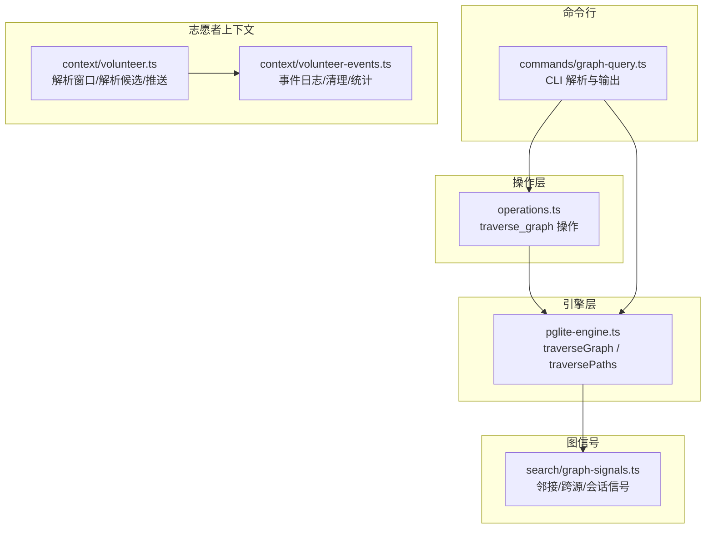
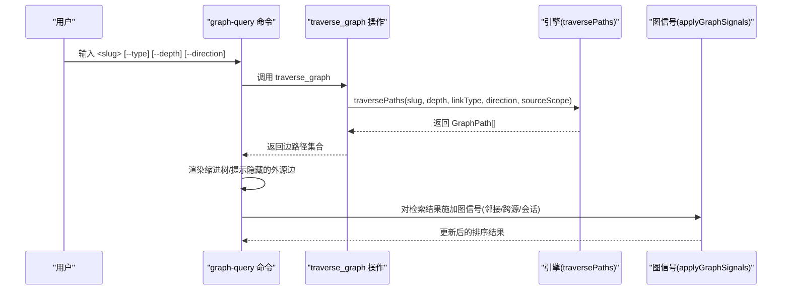
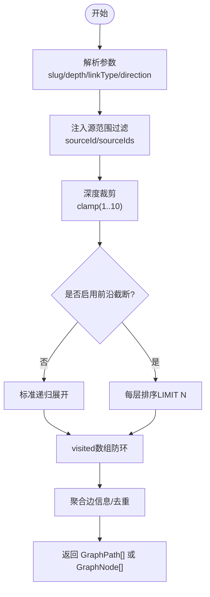
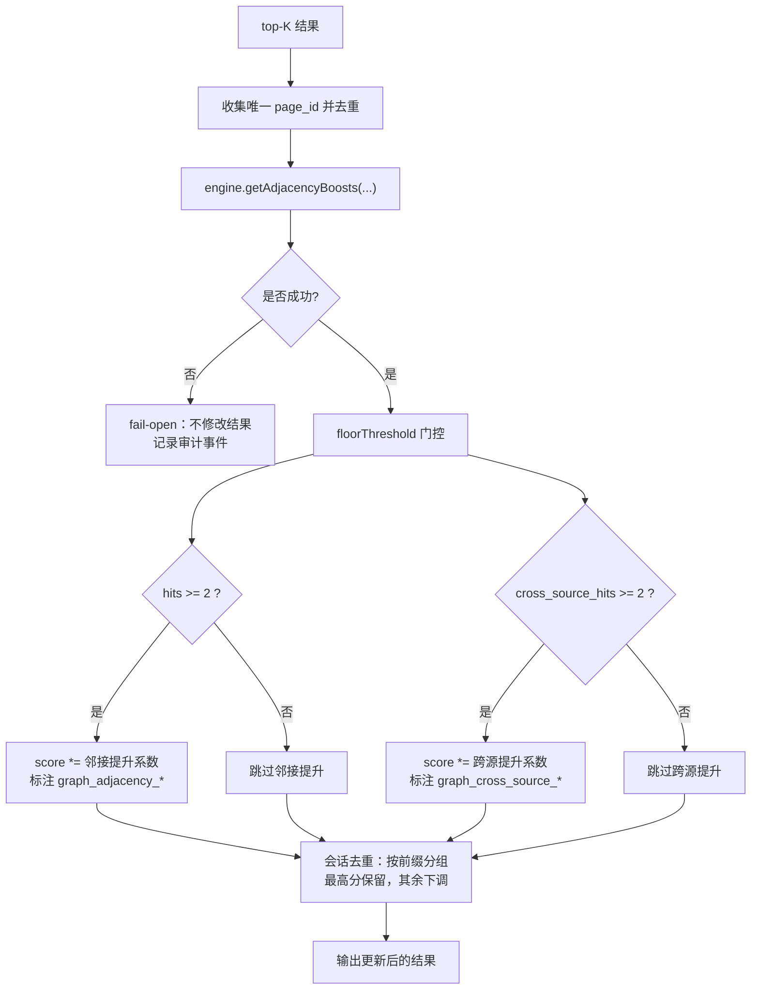
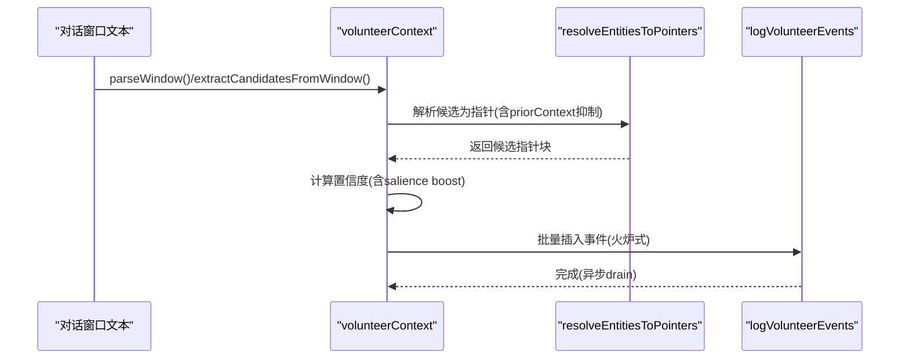
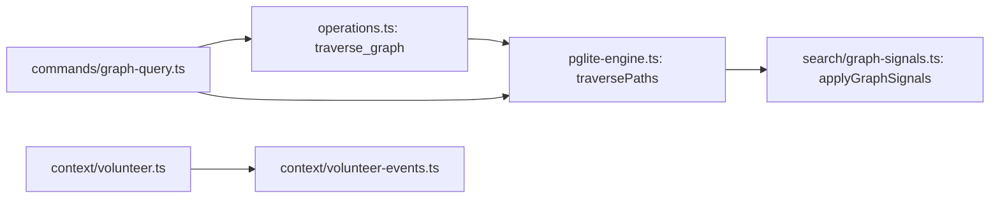

# 图遍历查询

<cite>
**本文引用的文件**
- [src/core/operations.ts](file://src/core/operations.ts)
- [src/core/pglite-engine.ts](file://src/core/pglite-engine.ts)
- [src/commands/graph-query.ts](file://src/commands/graph-query.ts)
- [src/core/search/graph-signals.ts](file://src/core/search/graph-signals.ts)
- [src/core/context/volunteer.ts](file://src/core/context/volunteer.ts)
- [src/core/context/volunteer-events.ts](file://src/core/context/volunteer-events.ts)
- [test/e2e/source-isolation-pglite.test.ts](file://test/e2e/source-isolation-pglite.test.ts)
- [test/e2e/graph-signals-engine.test.ts](file://test/e2e/graph-signals-engine.test.ts)
- [test/search/graph-signals.test.ts](file://test/search/graph-signals.test.ts)
- [test/e2e/volunteer-context-postgres.test.ts](file://test/e2e/volunteer-context-postgres.test.ts)
- [test/volunteer-context.test.ts](file://test/volunteer-context.test.ts)
- [test/retrieval-reflex.test.ts](file://test/retrieval-reflex.test.ts)
- [test/query-cache.test.ts](file://test/query-cache.test.ts)
</cite>

## 目录
1. [简介](#简介)
2. [项目结构](#项目结构)
3. [核心组件](#核心组件)
4. [架构总览](#架构总览)
5. [详细组件分析](#详细组件分析)
6. [依赖分析](#依赖分析)
7. [性能考量](#性能考量)
8. [故障排查指南](#故障排查指南)
9. [结论](#结论)
10. [附录](#附录)

## 简介
本文件系统化阐述图遍历查询子系统的设计与实现，覆盖多跳查询（1跳、2跳、N跳）的算法与控制流、路径选择策略与权重计算、图信号在检索中的应用（邻近性提升与交叉来源验证）、志愿者上下文机制与动态图扩展、实际使用示例、性能优化与缓存策略，以及限制条件与最佳实践。目标是帮助开发者与使用者在理解代码实现的同时，高效、安全地构建与运行基于图的复杂关系查询。

## 项目结构
围绕图遍历查询的关键模块与测试如下：
- 操作层：traverse_graph 操作封装了图遍历的统一入口，支持深度裁剪、方向与类型过滤。
- 引擎层：PGLite/Postgres 引擎提供 traverseGraph（节点集合）与 traversePaths（边路径）两类递归遍历实现。
- 命令行：graph-query 提供本地 CLI 与 MCP 远程调用两种路径，支持类型/方向/深度参数与外源边计数提示。
- 图信号：在检索后阶段对 top-K 结果施加邻近性与跨源信号，结合会话去重。
- 志愿者上下文：从对话窗口中主动推送相关页面，形成动态图扩展与反馈闭环。
- 测试：覆盖源隔离、邻接提升、跨源计数、志愿者事件记录等端到端场景。

图表来源
- [src/core/operations.ts:2057-2089](file://src/core/operations.ts#L2057-L2089)
- [src/core/pglite-engine.ts:2735-2929](file://src/core/pglite-engine.ts#L2735-L2929)
- [src/commands/graph-query.ts:130-189](file://src/commands/graph-query.ts#L130-L189)
- [src/core/search/graph-signals.ts:289-418](file://src/core/search/graph-signals.ts#L289-L418)
- [src/core/context/volunteer.ts:129-181](file://src/core/context/volunteer.ts#L129-L181)
- [src/core/context/volunteer-events.ts:67-151](file://src/core/context/volunteer-events.ts#L67-L151)

章节来源
- [src/core/operations.ts:2057-2089](file://src/core/operations.ts#L2057-L2089)
- [src/core/pglite-engine.ts:2735-2929](file://src/core/pglite-engine.ts#L2735-L2929)
- [src/commands/graph-query.ts:130-189](file://src/commands/graph-query.ts#L130-L189)
- [src/core/search/graph-signals.ts:289-418](file://src/core/search/graph-signals.ts#L289-L418)
- [src/core/context/volunteer.ts:129-181](file://src/core/context/volunteer.ts#L129-L181)
- [src/core/context/volunteer-events.ts:67-151](file://src/core/context/volunteer-events.ts#L67-L151)

## 核心组件
- traverse_graph 操作：统一入口，支持深度裁剪、方向与类型过滤；默认返回节点集合，当指定 link_type 或 direction 时返回边路径集合。
- traverseGraph/traversePaths 引擎方法：基于 SQL 的递归查询，内置源范围过滤、环检测、可选的前沿截断、结果去重与链接聚合。
- graph-query 命令：解析参数并调用引擎或 MCP 工具，输出缩进树形边路径；支持外源边计数提示。
- 图信号 applyGraphSignals：对 top-K 结果施加邻接提升、跨源提升与会话去重，失败时 fail-open。
- 志愿者上下文 volunteerContext：从对话窗口提取候选、解析指针、按置信度门控与上限推送，并通过事件表记录。

章节来源
- [src/core/operations.ts:2057-2089](file://src/core/operations.ts#L2057-L2089)
- [src/core/pglite-engine.ts:2735-2929](file://src/core/pglite-engine.ts#L2735-L2929)
- [src/commands/graph-query.ts:130-189](file://src/commands/graph-query.ts#L130-L189)
- [src/core/search/graph-signals.ts:289-418](file://src/core/search/graph-signals.ts#L289-L418)
- [src/core/context/volunteer.ts:129-181](file://src/core/context/volunteer.ts#L129-L181)

## 架构总览
下图展示从 CLI 到引擎再到图信号的整体流程，以及志愿者上下文的反馈闭环。

图表来源
- [src/commands/graph-query.ts:130-189](file://src/commands/graph-query.ts#L130-L189)
- [src/core/operations.ts:2057-2089](file://src/core/operations.ts#L2057-L2089)
- [src/core/pglite-engine.ts:2831-2929](file://src/core/pglite-engine.ts#L2831-L2929)
- [src/core/search/graph-signals.ts:289-418](file://src/core/search/graph-signals.ts#L289-L418)

## 详细组件分析

### 多跳查询算法与控制流
- 1跳查询：通过 direction='out'/'in' 或 'both' 配合 depth=1 实现；SQL 使用单层递归步。
- 2跳查询：设置 depth=2，递归展开两层；引擎在每一步进行 visited 数组环检测与源范围过滤。
- N跳查询：depth 默认 5，最大裁剪至 10（防止指数爆炸），支持 frontierCap 前沿截断以稳定每层选择。

图表来源
- [src/core/operations.ts:2066-2086](file://src/core/operations.ts#L2066-L2086)
- [src/core/pglite-engine.ts:2761-2788](file://src/core/pglite-engine.ts#L2761-L2788)
- [src/core/pglite-engine.ts:2866-2929](file://src/core/pglite-engine.ts#L2866-L2929)

章节来源
- [src/core/operations.ts:2057-2089](file://src/core/operations.ts#L2057-L2089)
- [src/core/pglite-engine.ts:2735-2929](file://src/core/pglite-engine.ts#L2735-L2929)

### 路径选择策略与权重计算
- 方向与类型过滤：根据 direction 生成 out/in/both 三类 SQL；link_type 作为 per-edge 过滤器。
- 源范围隔离：通过 sourceId/sourceIds 在种子、步骤与聚合阶段注入过滤条件，确保跨源拓扑泄露防护。
- 前沿截断：frontierCap 对每层递归结果进行排序与 LIMIT，保证稳定选择与性能可控。
- 排序与去重：按 depth 与 slug 排序；JSONB 聚合去重相同 (to_slug, link_type) 边。

章节来源
- [src/core/pglite-engine.ts:2740-2759](file://src/core/pglite-engine.ts#L2740-L2759)
- [src/core/pglite-engine.ts:2866-2929](file://src/core/pglite-engine.ts#L2866-L2929)

### 图信号在查询中的应用
- 邻近性提升：top-K 内部若某页被 ≥2 其他 top-K 页面入链，则乘以邻接提升系数；仅对不低于 floorThreshold 的结果生效。
- 跨源提升：若某页来自 ≥2 不同源的入链（排除目标自身源），则乘以跨源提升系数；与邻接提升叠加。
- 会话去重：识别会话前缀（chat/session/sessions 或日期段），同一组内最高分保留全量，其余按系数下调。
- fail-open：引擎调用异常时返回原结果不变，并记录审计事件。

图表来源
- [src/core/search/graph-signals.ts:289-418](file://src/core/search/graph-signals.ts#L289-L418)
- [test/search/graph-signals.test.ts:151-221](file://test/search/graph-signals.test.ts#L151-L221)
- [test/e2e/graph-signals-engine.test.ts:90-134](file://test/e2e/graph-signals-engine.test.ts#L90-L134)

章节来源
- [src/core/search/graph-signals.ts:289-418](file://src/core/search/graph-signals.ts#L289-L418)
- [test/search/graph-signals.test.ts:151-221](file://test/search/graph-signals.test.ts#L151-L221)
- [test/e2e/graph-signals-engine.test.ts:90-134](file://test/e2e/graph-signals-engine.test.ts#L90-L134)

### 志愿者上下文机制与动态图扩展
- 窗口解析：识别 user/assistant 行前缀，构造 turns；无前缀视为单轮 user。
- 候选提取：基于别名归一化、出现频次与最新轮次权重，生成候选集。
- 指针解析：在源范围内解析候选为指针，支持 slug-only 抑制与最大指针上限。
- 置信度门控：按匹配臂置信度加成（≥2轮或最新轮有额外加成），低于阈值丢弃。
- 动态扩展：推送的页面写入事件表，后续检索可结合图信号增强；watch 与 reflex 通道共享此反馈闭环。

图表来源
- [src/core/context/volunteer.ts:83-181](file://src/core/context/volunteer.ts#L83-L181)
- [src/core/context/volunteer-events.ts:67-151](file://src/core/context/volunteer-events.ts#L67-L151)
- [test/volunteer-context.test.ts:300-354](file://test/volunteer-context.test.ts#L300-L354)
- [test/e2e/volunteer-context-postgres.test.ts:38-73](file://test/e2e/volunteer-context-postgres.test.ts#L38-L73)
- [test/retrieval-reflex.test.ts:306-337](file://test/retrieval-reflex.test.ts#L306-L337)

章节来源
- [src/core/context/volunteer.ts:83-181](file://src/core/context/volunteer.ts#L83-L181)
- [src/core/context/volunteer-events.ts:67-151](file://src/core/context/volunteer-events.ts#L67-L151)
- [test/volunteer-context.test.ts:300-354](file://test/volunteer-context.test.ts#L300-L354)
- [test/e2e/volunteer-context-postgres.test.ts:38-73](file://test/e2e/volunteer-context-postgres.test.ts#L38-L73)
- [test/retrieval-reflex.test.ts:306-337](file://test/retrieval-reflex.test.ts#L306-L337)

### 实际使用示例
- 1跳查询：查询某人直接关联（如 attended/works_at），设置 direction='out'，depth=1。
- 2跳查询：查询“与Alice参加过会议的人”（2跳），设置 depth=2。
- N跳查询：复杂关系链（如“Bob的同事的同事”），设置 depth=3~5。
- 外源边提示：未开启 --include-foreign 时，若存在跨源边会被隐藏并在底部提示数量。

章节来源
- [src/commands/graph-query.ts:48-75](file://src/commands/graph-query.ts#L48-L75)
- [src/commands/graph-query.ts:130-189](file://src/commands/graph-query.ts#L130-L189)

## 依赖分析
- traverse_graph 操作依赖引擎的 traverseGraph/traversePaths，并注入 sourceScope 以实现源隔离。
- graph-query 命令在薄客户端模式下经由 MCP 调用 traverse_graph，否则直接调用引擎。
- 图信号 applyGraphSignals 依赖 engine.getAdjacencyBoosts 获取邻接统计，失败时 fail-open。
- 志愿者上下文依赖实体解析与事件日志模块，事件表用于统计“已使用”指标。

图表来源
- [src/core/operations.ts:2057-2089](file://src/core/operations.ts#L2057-L2089)
- [src/core/pglite-engine.ts:2831-2929](file://src/core/pglite-engine.ts#L2831-L2929)
- [src/commands/graph-query.ts:130-189](file://src/commands/graph-query.ts#L130-L189)
- [src/core/search/graph-signals.ts:289-418](file://src/core/search/graph-signals.ts#L289-L418)
- [src/core/context/volunteer.ts:129-181](file://src/core/context/volunteer.ts#L129-L181)
- [src/core/context/volunteer-events.ts:67-151](file://src/core/context/volunteer-events.ts#L67-L151)

章节来源
- [src/core/operations.ts:2057-2089](file://src/core/operations.ts#L2057-L2089)
- [src/core/pglite-engine.ts:2831-2929](file://src/core/pglite-engine.ts#L2831-L2929)
- [src/commands/graph-query.ts:130-189](file://src/commands/graph-query.ts#L130-L189)
- [src/core/search/graph-signals.ts:289-418](file://src/core/search/graph-signals.ts#L289-L418)
- [src/core/context/volunteer.ts:129-181](file://src/core/context/volunteer.ts#L129-L181)
- [src/core/context/volunteer-events.ts:67-151](file://src/core/context/volunteer-events.ts#L67-L151)

## 性能考量
- 深度裁剪：默认深度 5，最大 10，避免指数爆炸；建议根据业务合理设置 depth。
- 前沿截断：frontierCap 可限制每层选择数量，提高稳定性与可预测性。
- 源范围过滤：在种子、步骤与聚合阶段注入 sourceId/sourceIds，减少无关扫描。
- 图信号 fail-open：引擎调用失败不影响主流程，但可能影响排序稳定性。
- 缓存策略：语义查询缓存（query_cache）支持 TTL 清理与命中统计，适用于相似查询复用。

章节来源
- [src/core/operations.ts:2055-2073](file://src/core/operations.ts#L2055-L2073)
- [src/core/pglite-engine.ts:2761-2788](file://src/core/pglite-engine.ts#L2761-L2788)
- [src/core/search/graph-signals.ts:337-349](file://src/core/search/graph-signals.ts#L337-L349)
- [test/query-cache.test.ts:211-260](file://test/query-cache.test.ts#L211-L260)

## 故障排查指南
- 源隔离问题：若 traverseGraph/traversePaths 返回空，检查 sourceId/sourceIds 是否正确传递；测试覆盖了默认源与特定源的隔离行为。
- 外源边隐藏：未开启 --include-foreign 时，若存在跨源边会被隐藏并在底部提示数量。
- 图信号异常：applyGraphSignals 在引擎调用失败时 fail-open；可通过审计事件定位失败原因。
- 志愿者事件：确认事件表插入成功并通过 drain 完成；使用统计接口核对“已使用”指标。

章节来源
- [test/e2e/source-isolation-pglite.test.ts:153-178](file://test/e2e/source-isolation-pglite.test.ts#L153-L178)
- [src/commands/graph-query.ts:163-188](file://src/commands/graph-query.ts#L163-L188)
- [src/core/search/graph-signals.ts:337-349](file://src/core/search/graph-signals.ts#L337-L349)
- [src/core/context/volunteer-events.ts:122-151](file://src/core/context/volunteer-events.ts#L122-L151)

## 结论
该图遍历查询系统通过操作层抽象、引擎层递归 SQL 实现、CLI/MCP 双通道访问、图信号增强与志愿者上下文反馈闭环，形成了安全、可控且可扩展的关系查询能力。深度裁剪、前沿截断与源范围过滤保障性能与隔离；图信号在检索后阶段提供邻近性与跨源增强；志愿者上下文驱动动态图扩展与使用统计。建议在生产中合理设置 depth 与 frontierCap，并结合图信号与缓存策略获得更佳体验。

## 附录
- 最佳实践
  - 合理设置 depth，优先使用 1~3 跳以平衡召回与性能。
  - 开启源范围过滤，避免跨源拓扑泄露。
  - 使用 frontierCap 控制每层规模，提升稳定性。
  - 在检索后阶段启用图信号，结合会话去重避免重复内容主导。
  - 使用语义查询缓存降低重复查询成本。
- 限制条件
  - 深度最大裁剪至 10，防止资源滥用。
  - 图信号 fail-open，异常时不改变结果但需关注审计事件。
  - 志愿者上下文默认最小置信度较高，低阈值需谨慎评估噪声风险。