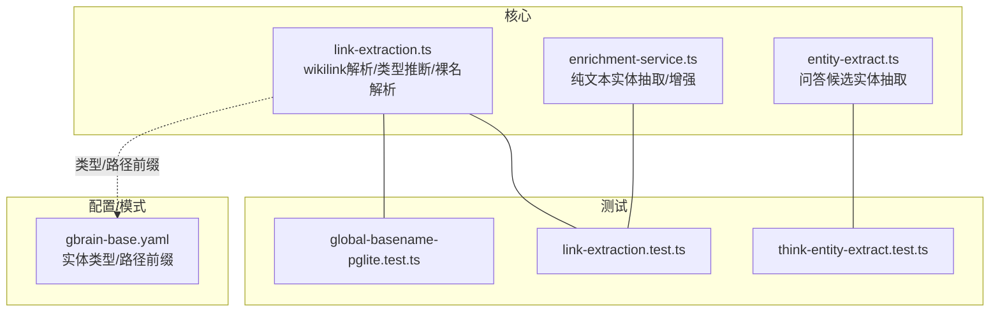
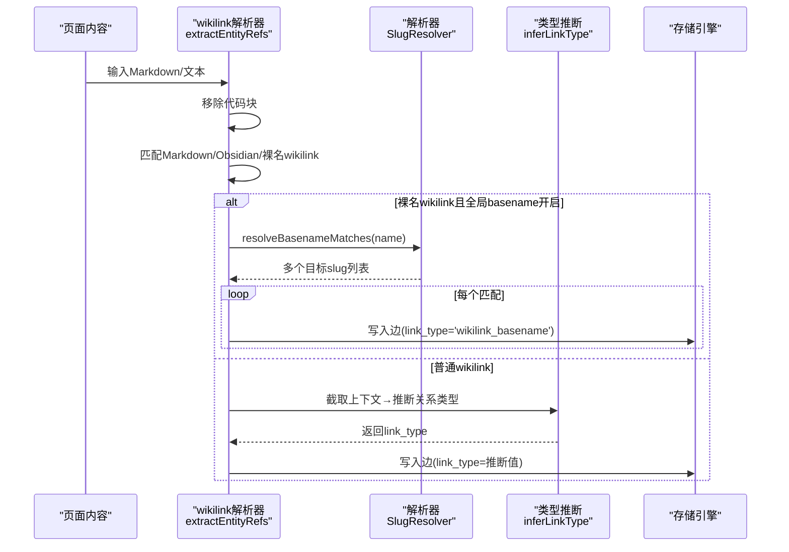
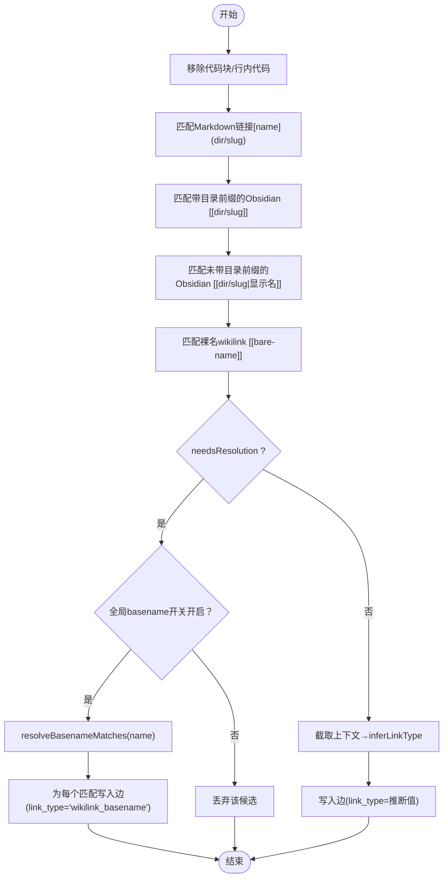
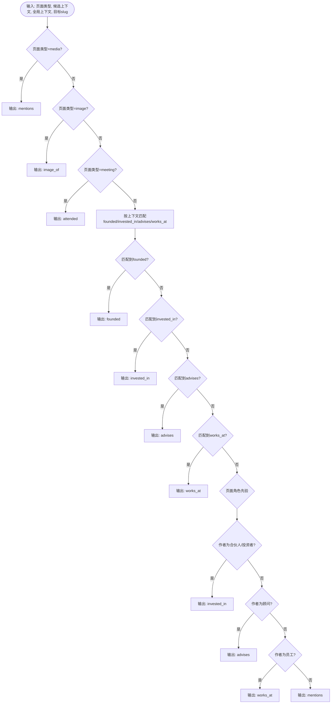
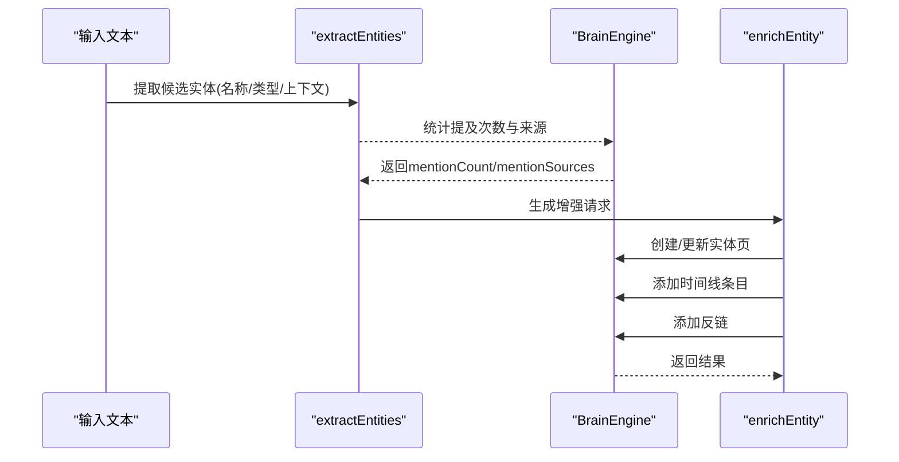
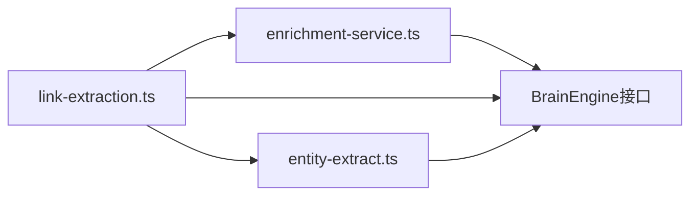

# 实体提取

<cite>
**本文引用的文件**
- [link-extraction.ts](file://src/core/link-extraction.ts)
- [enrichment-service.ts](file://src/core/enrichment-service.ts)
- [entity-extract.ts](file://src/core/think/entity-extract.ts)
- [link-extraction.test.ts](file://test/link-extraction.test.ts)
- [global-basename-pglite.test.ts](file://test/e2e/global-basename-pglite.test.ts)
- [think-entity-extract.test.ts](file://test/think-entity-extract.test.ts)
- [gbrain-base.yaml](file://src/core/schema-pack/base/gbrain-base.yaml)
</cite>

## 目录
1. [简介](#简介)
2. [项目结构](#项目结构)
3. [核心组件](#核心组件)
4. [架构总览](#架构总览)
5. [详细组件分析](#详细组件分析)
6. [依赖关系分析](#依赖关系分析)
7. [性能考量](#性能考量)
8. [故障排查指南](#故障排查指南)
9. [结论](#结论)
10. [附录](#附录)

## 简介
本文件系统性阐述 gbrain 的“实体提取”能力，重点覆盖以下方面：
- Wikilink 解析机制：支持 Obsidian 风格的 [[公司/苹果]]、[概念/混合搜索] 等格式，并对裸名 `[[bare-name]]` 提供全局 basename 解析路径（可选开关）。
- 关系类型推断：在不调用大模型的前提下，基于正则与页面角色先验，从上下文中判定“创办/投资/顾问/就职/出席/提及”等关系。
- 纯文本实体提取：通过正则与上下文分析，从自然语言中抽取人名与公司名，无需 LLM。
- 配置项与自定义规则：如何启用全局 basename 解析、自动链接与时间线、以及前端字段映射规则。

## 项目结构
围绕实体提取的关键模块与测试如下：
- 核心解析与类型推断：src/core/link-extraction.ts
- 纯文本实体抽取与增强：src/core/enrichment-service.ts
- 思维候选实体抽取（问答场景）：src/core/think/entity-extract.ts
- 测试与验证：
  - link-extraction.test.ts：覆盖 wikilink、qualified/unqualified、裸名、显示名、锚点、代码块屏蔽等
  - global-basename-pglite.test.ts：端到端验证全局 basename 开关行为
  - think-entity-extract.test.ts：问答场景候选实体抽取
- 架构与类型定义：src/core/schema-pack/base/gbrain-base.yaml（实体类型与路径前缀）

图表来源
- [link-extraction.ts](file://src/core/link-extraction.ts)
- [enrichment-service.ts](file://src/core/enrichment-service.ts)
- [entity-extract.ts](file://src/core/think/entity-extract.ts)
- [link-extraction.test.ts](file://test/link-extraction.test.ts)
- [global-basename-pglite.test.ts](file://test/e2e/global-basename-pglite.test.ts)
- [think-entity-extract.test.ts](file://test/think-entity-extract.test.ts)
- [gbrain-base.yaml](file://src/core/schema-pack/base/gbrain-base.yaml)

章节来源
- [link-extraction.ts](file://src/core/link-extraction.ts)
- [enrichment-service.ts](file://src/core/enrichment-service.ts)
- [entity-extract.ts](file://src/core/think/entity-extract.ts)
- [link-extraction.test.ts](file://test/link-extraction.test.ts)
- [global-basename-pglite.test.ts](file://test/e2e/global-basename-pglite.test.ts)
- [think-entity-extract.test.ts](file://test/think-entity-extract.test.ts)
- [gbrain-base.yaml](file://src/core/schema-pack/base/gbrain-base.yaml)

## 核心组件
- Wikilink 解析与候选生成
  - 支持三类 wikilink：
    - Markdown 链接：`[名称](people/slug)`，直接产出候选，无需解析。
    - 已带目录前缀的 Obsidian 链接：`[[people/slug]]` 或 `[[people/slug|显示名]]`，直接产出候选。
    - 裸名 wikilink：`[[bare-name]]`，标记 needsResolution，需经全局 basename 解析或本地解析器决定去留。
  - 代码块屏蔽：所有 pass 前会移除代码块与行内代码，避免误匹配。
  - 上下文窗口：为每条候选截取约 240 字符上下文，用于关系类型推断。
- 全局 basename 解析（可选）
  - 当开启时，`[[bare-name]]` 将查询全库 basename 匹配，返回多个目标页；每个匹配生成一条边，类型为 `wikilink_basename`。
  - 解析器内置缓存与索引，按“更短 slug 优先、字典序次之”的稳定顺序返回。
- 关系类型推断（零 LLM）
  - 基于一组精心校准的正则表达式与页面角色先验，从候选上下文判断关系类型：
    - founded（创办）、invested_in（投资）、advises（顾问）、works_at（就职）、mentions（提及）
  - 页面级角色先验：当源页面描述作者为“合伙人/投资者/顾问/员工”，可对特定出向边进行偏置（如对人→公司的出向边偏向 invested_in）。
- 纯文本实体抽取与增强
  - 使用正则抽取“2-4 个首字母大写的连续单词”作为候选实体，结合简单启发式判断“公司/人名”类别。
  - 对每个实体抽取上下文，统计现有提及次数与来源，建议增强优先级（Tier），并自动创建/更新实体页、添加时间线与反链。
- 问答场景候选实体抽取
  - 来自检索的实体前缀 slug 优先（高精度），随后从问题文本中抽取名词短语（停用词过滤、最大 5 个候选）。

章节来源
- [link-extraction.ts](file://src/core/link-extraction.ts)
- [enrichment-service.ts](file://src/core/enrichment-service.ts)
- [entity-extract.ts](file://src/core/think/entity-extract.ts)

## 架构总览
实体提取贯穿“内容解析 → 候选生成 → 类型推断/解析 → 结果落库”的流程。下图展示关键交互：

图表来源
- [link-extraction.ts](file://src/core/link-extraction.ts)

## 详细组件分析

### 组件A：wikilink 解析与候选生成
- 功能要点
  - 三阶段扫描：Markdown 链接 → 已带目录前缀的 Obsidian 链接 → 裸名 wikilink（带 needsResolution 标记）。
  - 代码块屏蔽：先剥离代码块与行内代码，再进行正则匹配，避免误触发。
  - 显示名与锚点处理：保留显示名，剥离 .md 与 #锚点。
  - 上下文截取：为每条候选截取约 240 字符上下文，确保远距离动词也能被捕捉（如“投资”出现在句子末尾）。
- 关键数据结构
  - EntityRef：包含显示名、slug、顶层目录、来源标识（qualified/unqualified）、是否需要解析（needsResolution）。
  - LinkCandidate：扩展版候选，包含 fromSlug、targetSlug、linkType、context、linkSource、origin 等。
- 正则与流程
  - 两遍扫描：先匹配带目录前缀的 wikilink，再匹配裸名 wikilink；裸名 wikilink 仅在未命中前两类时才发射。
  - 标记与掩码：为避免嵌套/重复匹配，使用掩码策略屏蔽已处理区间。
- 全局 basename 解析
  - 仅在开关开启时生效；对每个匹配的 bare-name 查询全库 basename，返回多目标时逐个写边。
  - 自身指向（自环）会被剔除，避免无意义边。
- 关系类型推断
  - 基于正则与页面角色先验，优先 founded > invested_in > advises > works_at > 角色先验 > mentions。
  - 页面类型特殊处理：媒体页固定为 mentions；会议页为 attended；图片页为 image_of。

图表来源
- [link-extraction.ts](file://src/core/link-extraction.ts)

章节来源
- [link-extraction.ts](file://src/core/link-extraction.ts)
- [link-extraction.test.ts](file://test/link-extraction.test.ts)
- [global-basename-pglite.test.ts](file://test/e2e/global-basename-pglite.test.ts)

### 组件B：关系类型推断（零 LLM）
- 推断规则
  - founded：发现“创办/联合创办/成立/加入”等动词
  - invested_in：发现“投资/参与/领投/跟投/早期投资/组合公司”等动词
  - advises：限定以“advisor/advisory”为核心的动词短语
  - works_at：发现“就职/任职/工作/担任/头衔”等动词
  - 页面角色先验：当源页面为“人”且目标为“公司”，若页面描述作者为“合伙人/投资者/顾问/员工”，对出向边进行偏置
- 上下文窗口
  - 默认 80 字符；对于裸名 wikilink，采用更宽的 240 字符窗口，提升远距离动词识别率
- 特殊类型
  - 媒体页固定为 mentions；会议页为 attended；图片页为 image_of

图表来源
- [link-extraction.ts](file://src/core/link-extraction.ts)

章节来源
- [link-extraction.ts](file://src/core/link-extraction.ts)

### 组件C：纯文本实体抽取与增强
- 抽取策略
  - 使用正则抽取“2-4 个首字母大写的连续单词”作为候选实体
  - 通过简单启发式判断“公司/人名”类别（如包含 Inc/Corp/Ltd/LLC/Co/Labs/Tech/AI/Capital/Ventures/Fund 等后缀）
  - 为每个实体抽取上下文（各 50 字符），用于后续增强与溯源
- 增强流程
  - 计算现有提及次数与来源（按路径前缀归类），建议 Tier（低数值代表高优先级）
  - 若实体不存在，则创建新页（people/companies 前缀），填充标题、类型、初始内容与时间线
  - 添加反链与时间线条目，记录来源与上下文

图表来源
- [enrichment-service.ts](file://src/core/enrichment-service.ts)

章节来源
- [enrichment-service.ts](file://src/core/enrichment-service.ts)

### 组件D：问答场景候选实体抽取
- 来源与优先级
  - 来自检索的实体前缀 slug（people/companies/deals 等）优先，高置信度
  - 其次从问题文本中抽取名词短语（停用词过滤、长度限制、最多 5 个）
- 去重与上限
  - 同一来源去重，总量不超过 5；retrieved 优先于 extracted

章节来源
- [entity-extract.ts](file://src/core/think/entity-extract.ts)
- [think-entity-extract.test.ts](file://test/think-entity-extract.test.ts)

## 依赖关系分析
- 模块耦合
  - link-extraction.ts 为核心入口，依赖正则、上下文截取、类型推断与解析器接口
  - enrichment-service.ts 依赖 BrainEngine 进行页面读写、搜索与时间线管理
  - entity-extract.ts 为纯函数，依赖外部检索结果与停用词表
- 外部依赖
  - 引擎接口：getPage、findByTitleFuzzy、searchKeyword、addTimelineEntry、addLink、getAllSlugs、getConfig 等
  - 配置项：auto_link、auto_timeline、link_resolution.global_basename
- 可能的循环依赖
  - 三个模块职责清晰，无直接循环依赖

图表来源
- [link-extraction.ts](file://src/core/link-extraction.ts)
- [enrichment-service.ts](file://src/core/enrichment-service.ts)
- [entity-extract.ts](file://src/core/think/entity-extract.ts)

章节来源
- [link-extraction.ts](file://src/core/link-extraction.ts)
- [enrichment-service.ts](file://src/core/enrichment-service.ts)
- [entity-extract.ts](file://src/core/think/entity-extract.ts)

## 性能考量
- 正则扫描
  - 三阶段扫描与掩码策略避免重复匹配，减少回溯成本
  - 代码块预处理一次性完成，降低后续正则复杂度
- 上下文截取
  - 默认 80 字符；裸名 wikilink 使用 240 字符窗口，注意对长文本的内存占用
- 全局 basename 解析
  - 解析器内置缓存；首次构建索引需遍历全库 slug，建议在批量任务中复用同一解析器实例
  - 索引键包含原始/小写/slugified 三种形式，兼顾大小写与连字符差异
- 类型推断
  - 正则规则已针对丰富文本调优，避免过度匹配；页面角色先验仅在必要时触发
- 批量增强
  - 增强流程支持节流与进度回调，适合大规模实体批量处理

[本节为通用指导，不直接分析具体文件]

## 故障排查指南
- 裸名 wikilink 未生成边
  - 检查开关：link_resolution.global_basename 是否开启
  - 若关闭，裸名 wikilink 将被静默丢弃，符合兼容性设计
- 裸名 wikilink 生成多条边
  - 表明存在多个同名 basename 的页面，系统会为每个匹配生成一条边
- 误将代码块中的链接识别为实体
  - 确认代码块已被正确屏蔽（stripCodeBlocks）
- 关系类型推断异常
  - 检查候选上下文是否过短；必要时扩大窗口或调整页面角色先验条件
- 增强流程失败
  - 检查 mention 统计与来源分类；确认实体页创建/更新权限与时间线字段可用性

章节来源
- [link-extraction.test.ts](file://test/link-extraction.test.ts)
- [global-basename-pglite.test.ts](file://test/e2e/global-basename-pglite.test.ts)
- [link-extraction.ts](file://src/core/link-extraction.ts)
- [enrichment-service.ts](file://src/core/enrichment-service.ts)

## 结论
本方案通过“wikilink 解析 + 全局 basename 解析 + 零 LLM 类型推断 + 纯文本实体抽取”的组合，在保证高准确率的同时，实现了可扩展、可观测、可配置的实体提取流水线。其关键优势在于：
- 不依赖外部大模型，推理确定、可审计
- 支持多种链接格式与显示名、锚点、代码块屏蔽等细节
- 提供可选的全局 basename 解析，兼顾易用性与精确性
- 与存储层深度集成，自动创建/更新实体页、时间线与反链

[本节为总结，不直接分析具体文件]

## 附录

### A. 配置项与开关
- link_resolution.global_basename
  - 作用：启用/禁用全局 basename 解析（默认关闭）
  - 优先级：环境变量 > 数据库配置 > 默认 false
  - 影响：开启后，`[[bare-name]]` 将查询全库 basename 并为每个匹配生成边
- auto_link
  - 作用：控制 put_page 后是否自动生成链接
  - 默认：开启
- auto_timeline
  - 作用：控制 put_page 后是否解析并插入时间线条目
  - 默认：开启

章节来源
- [link-extraction.ts](file://src/core/link-extraction.ts)
- [global-basename-pglite.test.ts](file://test/e2e/global-basename-pglite.test.ts)

### B. 自定义规则与扩展点
- 自定义 SlugResolver
  - 可实现 resolve 与 resolveBasenameMatches，以适配不同来源与命名约定
  - 支持 dirHint 与模糊匹配阈值，便于跨目录/跨来源解析
- 自定义类型推断
  - 可在 inferLinkType 中增加新的正则或先验逻辑
  - 注意保持与现有优先级顺序一致（founded > invested_in > advises > works_at > 角色先验 > mentions）
- 自定义前端字段映射
  - 通过 FRONTMATTER_LINK_MAP 定义字段到关系类型的映射，支持多目录提示与方向控制

章节来源
- [link-extraction.ts](file://src/core/link-extraction.ts)

### C. 实体类型与路径前缀
- 基础类型与路径前缀由 schema-pack 定义，影响实体页的创建与路由
- 示例类型：person、company、deal、yc、civic、project、source、media、email、slack、calendar-event、note、meeting 等

章节来源
- [gbrain-base.yaml](file://src/core/schema-pack/base/gbrain-base.yaml)