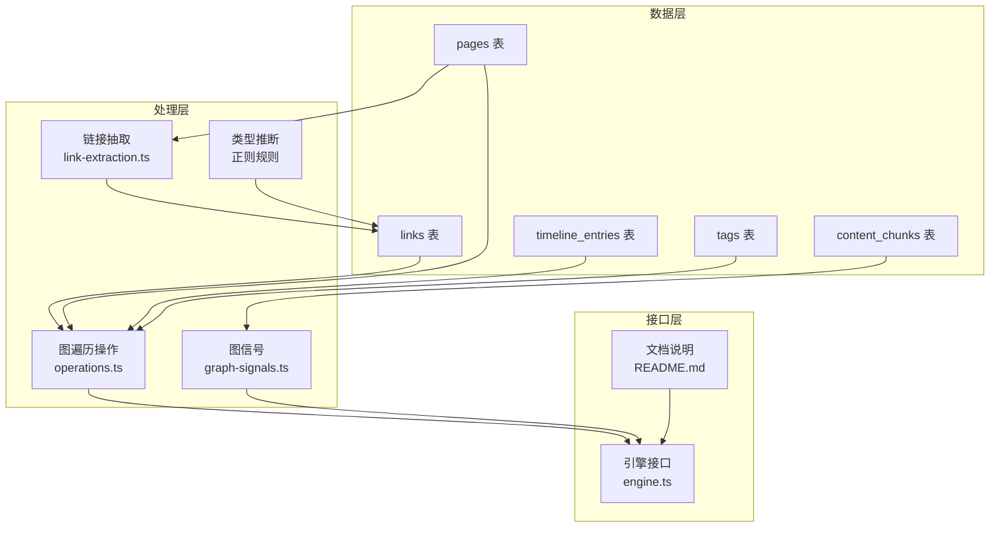
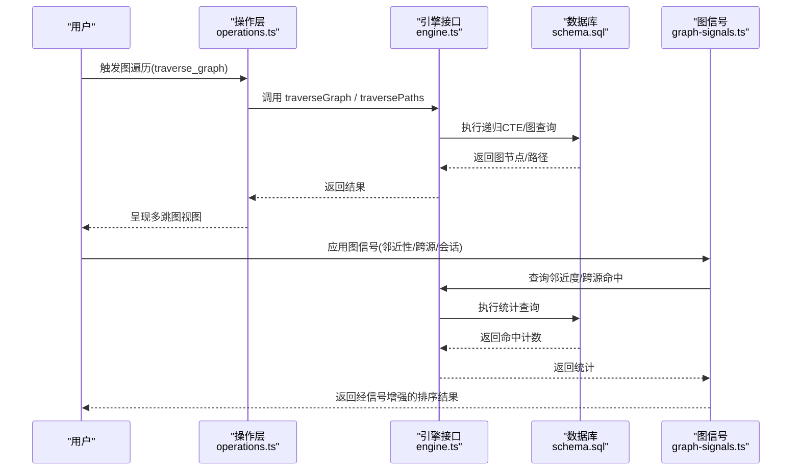
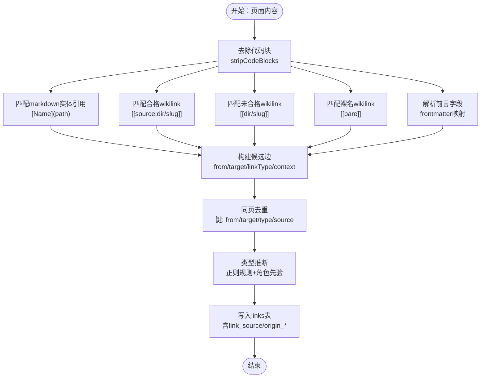
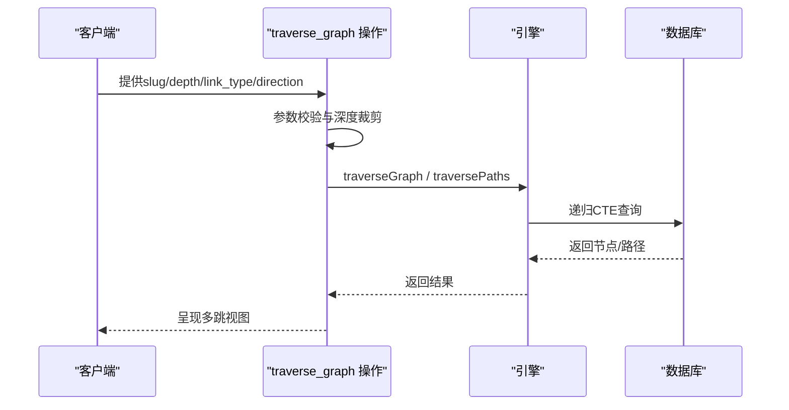
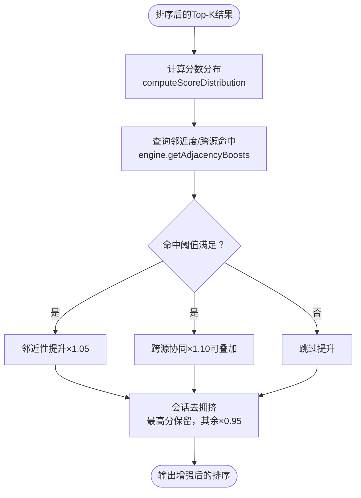
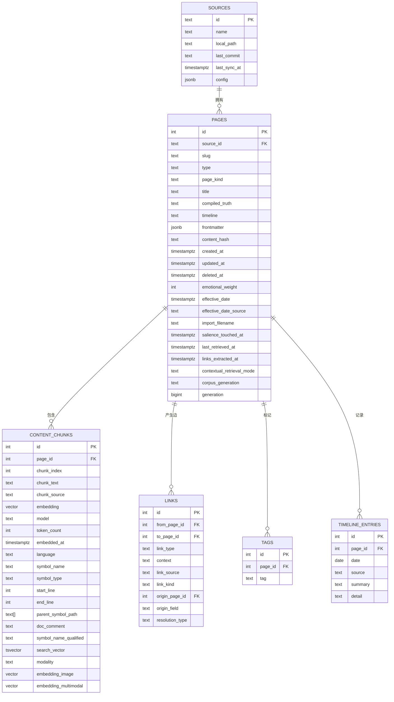

# 知识图谱

<cite>
**本文引用的文件**
- [README.md](file://README.md)
- [schema.sql](file://src/schema.sql)
- [link-extraction.ts](file://src/core/link-extraction.ts)
- [entity-extract.ts](file://src/core/think/entity-extract.ts)
- [operations.ts](file://src/core/operations.ts)
- [graph-signals.ts](file://src/core/search/graph-signals.ts)
- [engine.ts](file://src/core/engine.ts)
- [graph-signals.test.ts](file://test/search/graph-signals.test.ts)
- [link-extraction.test.ts](file://test/link-extraction.test.ts)
- [global-basename-pglite.test.ts](file://test/e2e/global-basename-pglite.test.ts)
- [think-entity-extract.test.ts](file://test/think-entity-extract.test.ts)
</cite>

## 目录
1. [简介](#简介)
2. [项目结构](#项目结构)
3. [核心组件](#核心组件)
4. [架构总览](#架构总览)
5. [详细组件分析](#详细组件分析)
6. [依赖关系分析](#依赖关系分析)
7. [性能考量](#性能考量)
8. [故障排查指南](#故障排查指南)
9. [结论](#结论)
10. [附录](#附录)

## 简介
本文件面向GBrain知识图谱系统，聚焦以下目标：  
- 实体提取机制：wikilink解析、类型化边创建、零LLM实现  
- 图遍历与多跳查询能力  
- 搜索中图信号的应用：邻近性提升、交叉来源验证、会话去拥挤  
- Obsidian风格链接解析与全局basename解析  
- 图查询示例与性能优化建议  
- 图结构设计、索引策略与维护最佳实践  
- 知识发现与洞察生成的工作原理  

## 项目结构
- 核心数据模型位于数据库模式文件中，定义了页面、内容块、链接、标签、时间线等表及索引，支撑检索与图遍历  
- 链接抽取与类型推断逻辑集中在链接抽取模块，支持多种wikilink格式与前言字段（frontmatter）  
- 图信号在检索后融合阶段应用，对结果进行邻近性、跨源协同与会话去拥挤增强  
- 图遍历通过操作注册与引擎接口暴露，支持深度限制与方向/类型过滤  
- 文档README提供了系统目标、能力与使用路径的高层说明

图表来源
- [schema.sql:85-547](file://src/schema.sql#L85-L547)
- [link-extraction.ts:465-577](file://src/core/link-extraction.ts#L465-L577)
- [graph-signals.ts:289-418](file://src/core/search/graph-signals.ts#L289-L418)
- [operations.ts:2057-2089](file://src/core/operations.ts#L2057-L2089)
- [engine.ts:1-200](file://src/core/engine.ts#L1-L200)

章节来源
- [README.md:280-288](file://README.md#L280-L288)
- [schema.sql:85-547](file://src/schema.sql#L85-L547)

## 核心组件
- 链接抽取与类型推断：从markdown、wikilink与前言字段中提取实体引用，推断关系类型（如工作于、投资于、创办、顾问、出席、提及），零LLM  
- 图信号增强：基于邻近性、跨源协同与会话去拥挤对检索结果进行乘性调整  
- 图遍历：以指定节点为起点，按深度、方向与类型过滤进行多跳探索  
- 全局basename解析：可选地将裸wikilink解析到同名basename的多个目标页  
- 结构化存储：以pages、content_chunks、links等表承载内容与图结构，配合索引加速

章节来源
- [link-extraction.ts:465-724](file://src/core/link-extraction.ts#L465-L724)
- [graph-signals.ts:1-419](file://src/core/search/graph-signals.ts#L1-L419)
- [operations.ts:2057-2089](file://src/core/operations.ts#L2057-L2089)
- [schema.sql:85-547](file://src/schema.sql#L85-L547)

## 架构总览
下图展示检索后融合阶段如何应用图信号，以及图遍历操作如何通过引擎执行：

图表来源
- [operations.ts:2057-2089](file://src/core/operations.ts#L2057-L2089)
- [engine.ts:1-200](file://src/core/engine.ts#L1-L200)
- [graph-signals.ts:289-418](file://src/core/search/graph-signals.ts#L289-L418)
- [schema.sql:464-495](file://src/schema.sql#L464-L495)

## 详细组件分析

### 组件A：实体提取与类型化边创建
- 多源输入：markdown实体引用、Obsidian风格wikilink、裸slug引用、前言字段  
- 解析与去重：对wikilink进行目录白名单匹配、合格/未合格解析、裸名解析（可选）；同一页面内重复候选去重  
- 类型推断：基于上下文窗口内的动词与角色先验规则，确定关系类型（创办、投资于、顾问、工作于、出席、提及）  
- 写入策略：候选边写入links表，带来源（markdown、frontmatter、wikilink-resolved等）与可选的origin信息，便于后续对齐与清理

图表来源
- [link-extraction.ts:301-577](file://src/core/link-extraction.ts#L301-L577)
- [link-extraction.ts:599-724](file://src/core/link-extraction.ts#L599-L724)

章节来源
- [link-extraction.ts:301-577](file://src/core/link-extraction.ts#L301-L577)
- [link-extraction.ts:599-724](file://src/core/link-extraction.ts#L599-L724)
- [link-extraction.test.ts:299-329](file://test/link-extraction.test.ts#L299-L329)
- [global-basename-pglite.test.ts:99-130](file://test/e2e/global-basename-pglite.test.ts#L99-L130)

### 组件B：图遍历与多跳查询
- 深度限制：防止指数级扩展导致资源耗尽，默认上限常量保护  
- 方向与类型过滤：支持in/out/both与单类型筛选，返回路径或节点  
- 权限与作用域：遍历时遵循调用方的source作用域，避免拓扑泄漏  
- 引擎实现：通过递归CTE实现BFS式多跳，支持每层边界限制参数（frontierCap）

图表来源
- [operations.ts:2057-2089](file://src/core/operations.ts#L2057-L2089)
- [engine.ts:28-65](file://src/core/engine.ts#L28-L65)

章节来源
- [operations.ts:2057-2089](file://src/core/operations.ts#L2057-L2089)
- [engine.ts:28-65](file://src/core/engine.ts#L28-L65)

### 组件C：搜索中的图信号应用
- 邻近性提升：若top-K中有≥2个其他top-K页面指向某页，则视为该查询的枢纽，小幅提升其分数  
- 跨源协同：若某页被≥2个不同来源指向，则额外提升，与邻近性叠加  
- 会话去拥挤：对共享会话前缀（如chat/日期）的多条结果，仅保留最高分，其余降权  
- 不可变增强：在融合阶段之后、去重之前应用，失败时“失败即开”，不改变整体流程

图表来源
- [graph-signals.ts:289-418](file://src/core/search/graph-signals.ts#L289-L418)
- [graph-signals.test.ts:1-468](file://test/search/graph-signals.test.ts#L1-L468)

章节来源
- [graph-signals.ts:1-419](file://src/core/search/graph-signals.ts#L1-L419)
- [graph-signals.test.ts:1-468](file://test/search/graph-signals.test.ts#L1-L468)

### 组件D：Obsidian风格链接与全局basename解析
- Obsidian风格wikilink：支持[[dir/slug]]与[[source:dir/slug|显示文本]]  
- 全局basename解析：当开启标志位时，裸wikilink（如[[struktura]]）按basename解析到所有匹配页，产生多条边  
- 安全与审计：保留link_source与link_type区分来源与类型，便于审计与修剪

章节来源
- [link-extraction.ts:111-154](file://src/core/link-extraction.ts#L111-L154)
- [link-extraction.ts:465-577](file://src/core/link-extraction.ts#L465-L577)
- [link-extraction.ts:928-933](file://src/core/link-extraction.ts#L928-L933)
- [link-extraction.ts:1219-1229](file://src/core/link-extraction.ts#L1219-L1229)
- [link-extraction.test.ts:299-329](file://test/link-extraction.test.ts#L299-L329)
- [global-basename-pglite.test.ts:99-130](file://test/e2e/global-basename-pglite.test.ts#L99-L130)

### 组件E：知识发现与洞察生成
- 实体候选提取：结合检索回传的实体前缀slug与问题文本的名词短语，生成高精候选  
- 轨迹路由：对候选实体发起轨迹查询，整合上下文形成合成答案与缺口分析  
- 限制与延迟控制：候选上限与单次调用超时，平衡质量与响应时间

章节来源
- [entity-extract.ts:1-197](file://src/core/think/entity-extract.ts#L1-L197)
- [think-entity-extract.test.ts:1-65](file://test/think-entity-extract.test.ts#L1-L65)
- [README.md:153-171](file://README.md#L153-L171)

## 依赖关系分析
- 数据模型依赖：pages与content_chunks承载内容与嵌入；links承载图边；timeline与tags辅助检索与排序  
- 处理链路：link-extraction依赖schema中的pages/links定义；graph-signals依赖links与content_chunks统计；operations依赖engine接口与schema约束  
- 索引与约束：links唯一性与来源/原点字段确保对齐与可审计；pages与content_chunks索引支撑检索与图遍历

图表来源
- [schema.sql:26-153](file://src/schema.sql#L26-L153)
- [schema.sql:296-345](file://src/schema.sql#L296-L345)
- [schema.sql:464-495](file://src/schema.sql#L464-L495)
- [schema.sql:505-513](file://src/schema.sql#L505-L513)
- [schema.sql:532-547](file://src/schema.sql#L532-L547)

章节来源
- [schema.sql:26-153](file://src/schema.sql#L26-L153)
- [schema.sql:296-345](file://src/schema.sql#L296-L345)
- [schema.sql:464-495](file://src/schema.sql#L464-L495)
- [schema.sql:505-513](file://src/schema.sql#L505-L513)
- [schema.sql:532-547](file://src/schema.sql#L532-L547)

## 性能考量
- 检索后融合阶段的图信号：邻近性与跨源提升为小幅度乘性调整，会话去拥挤避免弱片段挤占token预算，整体保持稳定排序  
- 遍历深度限制：默认上限常量防止指数爆炸，结合frontierCap可进一步限制每层扩展数量  
- 索引策略：links表按from/to/source/origin建立索引；pages按type/frontmatter/title/trgm等建立索引；content_chunks按embedding/HNSW与部分列建立索引  
- 批量写入自适应重试：批量插入/更新在瞬断时自动重试，降低外部连接池波动影响  
- 代码引用边：针对符号/调用关系建立专用索引，加速代码图遍历

章节来源
- [graph-signals.ts:52-67](file://src/core/search/graph-signals.ts#L52-L67)
- [operations.ts:2050-2055](file://src/core/operations.ts#L2050-L2055)
- [engine.ts:98-121](file://src/core/engine.ts#L98-L121)
- [schema.sql:497-501](file://src/schema.sql#L497-L501)
- [schema.sql:256-291](file://src/schema.sql#L256-L291)
- [schema.sql:333-352](file://src/schema.sql#L333-L352)
- [schema.sql:399-431](file://src/schema.sql#L399-L431)

## 故障排查指南
- 图信号失败开路：当邻近度/跨源统计查询失败时，返回原始结果并记录审计日志，不影响整体流程  
- 遍历深度异常：若出现深度过大导致CPU飙升，检查调用端是否超过默认上限，必要时显式设置较小深度  
- 全局basename解析：关闭标志位时裸wikilink会被静默丢弃；开启后需确认是否存在同名冲突页  
- 会话去拥挤误判：若实体类结果被错误分组，确认slug是否符合会话前缀识别规则（包含chat/session/sessions或日期段）  
- 代码引用边：符号/调用关系边需正确设置source_id，避免跨源fan-out导致错误边

章节来源
- [graph-signals.ts:332-349](file://src/core/search/graph-signals.ts#L332-L349)
- [graph-signals.ts:199-231](file://src/core/search/graph-signals.ts#L199-L231)
- [operations.ts:2069-2072](file://src/core/operations.ts#L2069-L2072)
- [link-extraction.ts:1219-1229](file://src/core/link-extraction.ts#L1219-L1229)
- [link-extraction.test.ts:299-329](file://test/link-extraction.test.ts#L299-L329)
- [schema.sql:399-431](file://src/schema.sql#L399-L431)

## 结论
GBrain通过“零LLM”的实体提取与类型化边创建，构建了自洽的知识图谱；在检索后融合阶段引入图信号，有效提升枢纽与跨源协同页面的可见性，并通过会话去拥挤避免弱片段干扰；图遍历提供安全可控的多跳探索能力；全局basename解析增强了wikilink的表达力。配合完善的索引与批处理重试机制，系统在大规模知识库上实现了高效、稳健的检索与推理。

## 附录
- 使用示例（概念性）
  - 实体提取：在页面写入后，自动扫描wikilink与前言字段，生成typed edges并持久化  
  - 图信号：启用graph_signals后，检索结果在融合阶段获得邻近性/跨源/会话去拥挤增强  
  - 多跳查询：以某人/公司为起点，按“工作于/投资于/顾问”等类型过滤，设定深度上限进行探索  
  - 全局basename：开启后，[[struktura]]可解析到多个同名页，分别生成边  
- 最佳实践
  - 启用全局basename前评估冲突页数量，必要时先进行重命名  
  - 对高频图信号场景，关注失败审计日志，定位上游查询瓶颈  
  - 在大图遍历中合理设置frontierCap与深度上限，避免资源耗尽  
  - 定期审查links唯一性与来源字段，确保对齐与可审计性