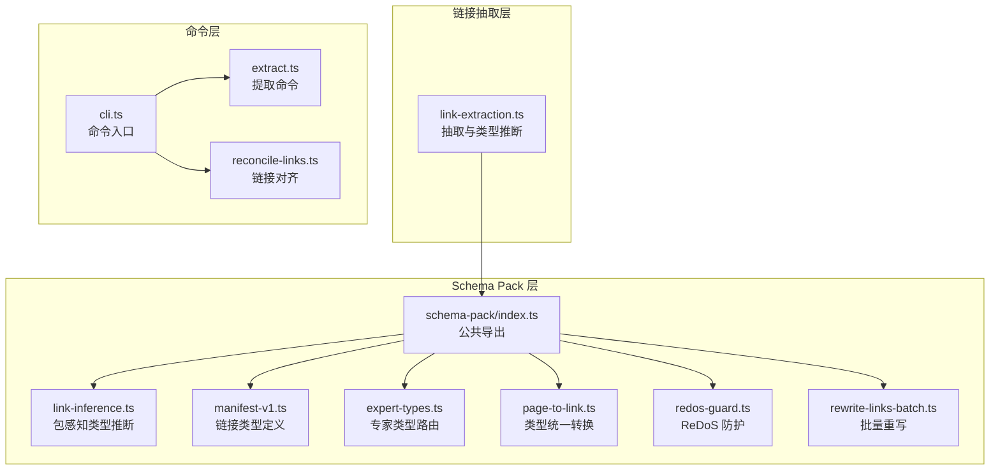
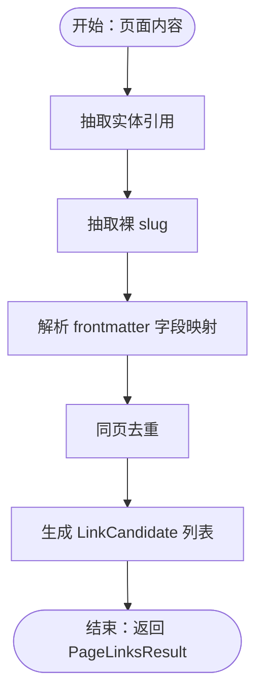
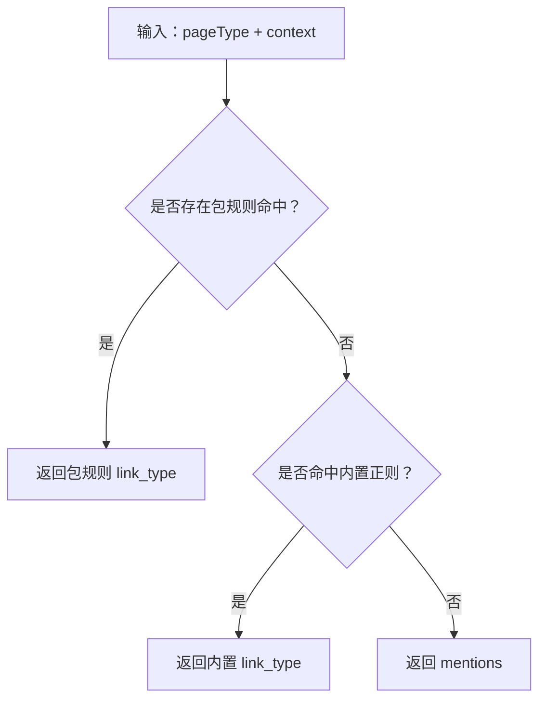
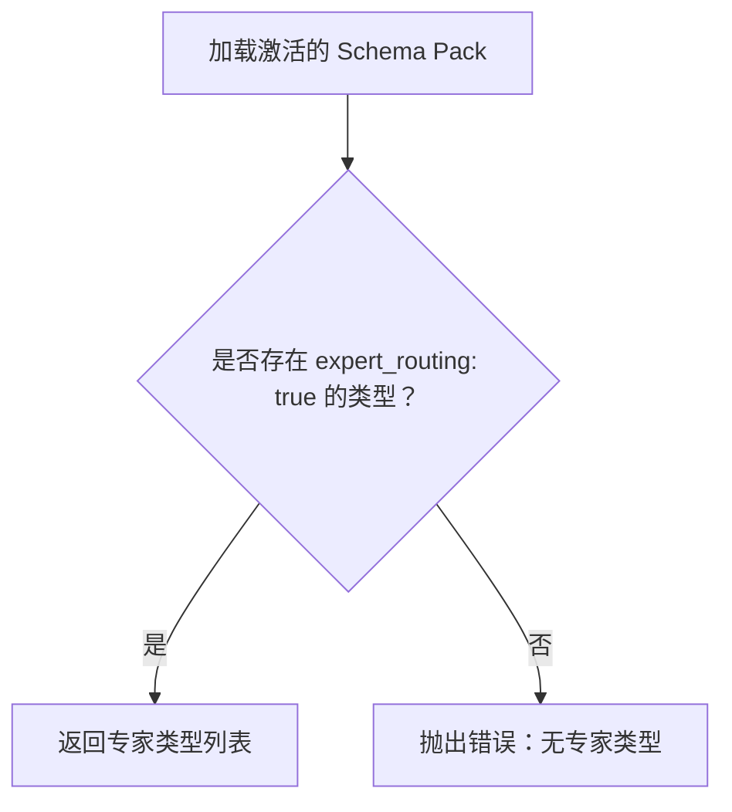
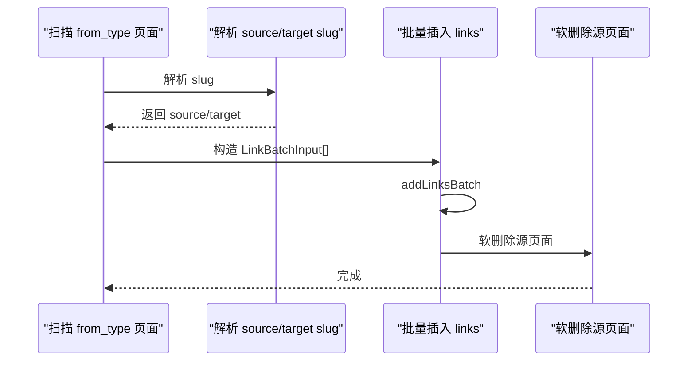
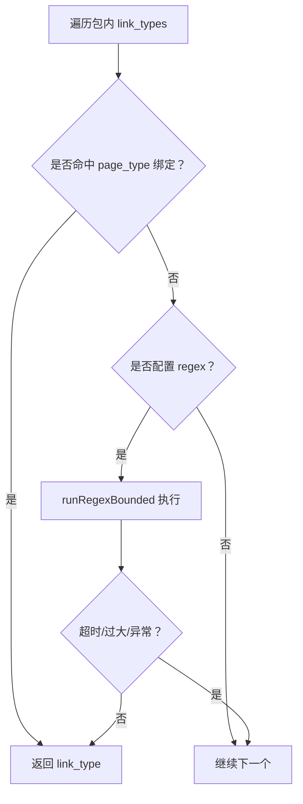
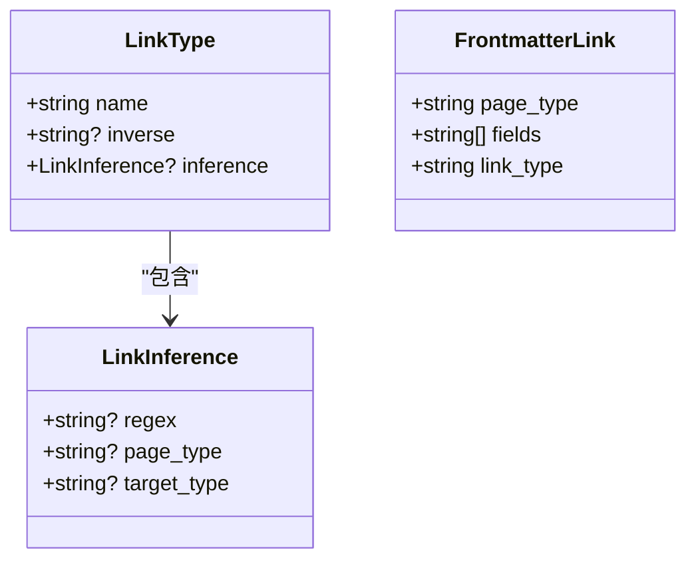
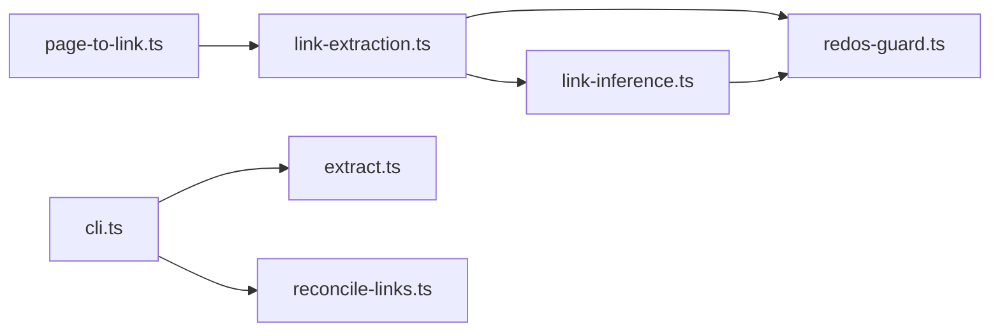

# 链接类型与关系

<cite>
**本文档引用的文件**
- [link-extraction.ts](file://src/core/link-extraction.ts)
- [link-inference.ts](file://src/core/schema-pack/link-inference.ts)
- [manifest-v1.ts](file://src/core/schema-pack/manifest-v1.ts)
- [index.ts](file://src/core/schema-pack/index.ts)
- [expert-types.ts](file://src/core/schema-pack/expert-types.ts)
- [page-to-link.ts](file://src/core/schema-pack/page-to-link.ts)
- [redos-guard.ts](file://src/core/schema-pack/redos-guard.ts)
- [rewrite-links-batch.ts](file://src/core/schema-pack/rewrite-links-batch.ts)
- [link-inference-pack.test.ts](file://test/link-inference-pack.test.ts)
- [traverse-graph-dedup.test.ts](file://test/traverse-graph-dedup.test.ts)
- [schema-pack-loader.test.ts](file://test/schema-pack-loader.test.ts)
- [cli.ts](file://src/cli.ts)
- [extract.ts](file://src/commands/extract.ts)
- [reconcile-links.ts](file://src/commands/reconcile-links.ts)
</cite>

## 目录
1. [引言](#引言)
2. [项目结构](#项目结构)
3. [核心组件](#核心组件)
4. [架构总览](#架构总览)
5. [详细组件分析](#详细组件分析)
6. [依赖分析](#依赖分析)
7. [性能考量](#性能考量)
8. [故障排查指南](#故障排查指南)
9. [结论](#结论)
10. [附录](#附录)

## 引言
本文件系统性阐述 gbrain 的“链接类型与关系”体系：从类型化边（typed edge）的概念与实现，到实体关系的分类与建模；从专家类型系统与类型统一处理器的工作机制，到链接的双向性与继承关系；再到 schema packs 对链接类型的影响与扩展能力。文档还提供“属于”“包含”“引用”等典型关系的实际示例，总结设计原则与维护指南，并解释链接冲突的解决机制与一致性保证。

## 项目结构
围绕链接类型与关系的核心代码主要分布在以下模块：
- 链接抽取与类型推断：src/core/link-extraction.ts
- Schema Pack 链接类型声明与推理：src/core/schema-pack/*
- 专家类型与路由：src/core/schema-pack/expert-types.ts
- 类型统一与页面转链接：src/core/schema-pack/page-to-link.ts
- 安全防护（ReDoS）：src/core/schema-pack/redos-guard.ts
- 批量重写链接：src/core/schema-pack/rewrite-links-batch.ts
- 命令行与命令入口：src/cli.ts、src/commands/extract.ts、src/commands/reconcile-links.ts
- 测试用例：test/link-inference-pack.test.ts、test/traverse-graph-dedup.test.ts 等



图表来源
- [link-extraction.ts:1-1230](file://src/core/link-extraction.ts#L1-L1230)
- [link-inference.ts:1-119](file://src/core/schema-pack/link-inference.ts#L1-L119)
- [manifest-v1.ts:1-473](file://src/core/schema-pack/manifest-v1.ts#L1-L473)
- [index.ts:1-212](file://src/core/schema-pack/index.ts#L1-L212)
- [expert-types.ts:1-63](file://src/core/schema-pack/expert-types.ts#L1-L63)
- [page-to-link.ts:1-240](file://src/core/schema-pack/page-to-link.ts#L1-L240)
- [redos-guard.ts:1-169](file://src/core/schema-pack/redos-guard.ts#L1-L169)
- [rewrite-links-batch.ts:1-90](file://src/core/schema-pack/rewrite-links-batch.ts#L1-L90)
- [cli.ts:2239-2242](file://src/cli.ts#L2239-L2242)
- [extract.ts:21-1751](file://src/commands/extract.ts#L21-L1751)
- [reconcile-links.ts:45-51](file://src/commands/reconcile-links.ts#L45-L51)

章节来源
- [link-extraction.ts:1-1230](file://src/core/link-extraction.ts#L1-L1230)
- [link-inference.ts:1-119](file://src/core/schema-pack/link-inference.ts#L1-L119)
- [manifest-v1.ts:1-473](file://src/core/schema-pack/manifest-v1.ts#L1-L473)
- [index.ts:1-212](file://src/core/schema-pack/index.ts#L1-L212)
- [expert-types.ts:1-63](file://src/core/schema-pack/expert-types.ts#L1-L63)
- [page-to-link.ts:1-240](file://src/core/schema-pack/page-to-link.ts#L1-L240)
- [redos-guard.ts:1-169](file://src/core/schema-pack/redos-guard.ts#L1-L169)
- [rewrite-links-batch.ts:1-90](file://src/core/schema-pack/rewrite-links-batch.ts#L1-L90)
- [cli.ts:2239-2242](file://src/cli.ts#L2239-L2242)
- [extract.ts:21-1751](file://src/commands/extract.ts#L21-L1751)
- [reconcile-links.ts:45-51](file://src/commands/reconcile-links.ts#L45-L51)

## 核心组件
- 类型化边与链接候选
  - 链接候选（LinkCandidate）承载来源页、目标页、关系类型、上下文、来源等信息，用于后续持久化或审计。
  - 页面级链接提取（extractPageLinks）整合多种来源：Markdown 实体引用、裸 slug、以及 frontmatter 字段映射。
- 关系类型推断
  - 传统规则：基于正则表达式在上下文中识别“创始人/投资/顾问/就职/出席/提及”等关系。
  - 包感知规则：Schema Pack 中声明的 link_types 可以补充或覆盖内置规则，支持按页面类型绑定与正则匹配，并受 ReDoS 预算保护。
- 专家类型系统
  - 通过 expert_routing 标记页面类型为专家类型，用于 whoknows/find_experts 查询路由。
- 类型统一与页面转链接
  - page-to-link 规则将“边形状”的页面转换为真实链接表记录，并软删除源页面，确保原子性与幂等性。
- 安全与一致性
  - ReDoS 防护：每页预算与单次超时限制，超过后剩余谓词降级为“提及”，保证 CPU 与内存安全。
  - 批量重写：提供批量更新 links 表中 from/to_page_id 的能力，保持跨源隔离与一致性。

章节来源
- [link-extraction.ts:404-577](file://src/core/link-extraction.ts#L404-L577)
- [link-extraction.ts:694-724](file://src/core/link-extraction.ts#L694-L724)
- [link-inference.ts:55-97](file://src/core/schema-pack/link-inference.ts#L55-L97)
- [manifest-v1.ts:39-43](file://src/core/schema-pack/manifest-v1.ts#L39-L43)
- [expert-types.ts:35-62](file://src/core/schema-pack/expert-types.ts#L35-L62)
- [page-to-link.ts:31-76](file://src/core/schema-pack/page-to-link.ts#L31-L76)
- [redos-guard.ts:88-130](file://src/core/schema-pack/redos-guard.ts#L88-L130)
- [rewrite-links-batch.ts:27-44](file://src/core/schema-pack/rewrite-links-batch.ts#L27-L44)

## 架构总览
下图展示了从内容解析到链接落库的关键流程，以及 Schema Pack 在其中的扩展点：

```mermaid
sequenceDiagram
participant Content as "页面内容"
participant Extract as "extractPageLinks<br/>link-extraction.ts"
participant Pack as "Schema Pack<br/>link-inference.ts"
participant Engine as "BrainEngine"
participant Links as "links 表"
Content->>Extract : 解析实体引用/裸 slug/frontmatter
Extract->>Pack : 尝试包感知类型推断
Pack-->>Extract : 返回 link_type 或 null
alt 未命中包规则
Extract->>Extract : 使用内置正则推断
end
Extract->>Engine : addLinksBatch/insert
Engine->>Links : 写入 from/to/link_type/context/link_source
Links-->>Engine : 成功
Engine-->>Extract : 结果
```

图表来源
- [link-extraction.ts:465-577](file://src/core/link-extraction.ts#L465-L577)
- [link-inference.ts:55-97](file://src/core/schema-pack/link-inference.ts#L55-L97)
- [index.ts:107-109](file://src/core/schema-pack/index.ts#L107-L109)

## 详细组件分析

### 组件一：类型化边与链接候选
- 数据结构
  - LinkCandidate：包含 fromSlug/targetSlug/linkType/context/linkSource/originSlug/originField 等字段，用于精确溯源与审计。
  - PageLinksResult：聚合 candidates 与 unresolved（frontmatter 无法解析的引用）。
- 处理逻辑
  - 先抽取 Markdown 实体引用，再抽取裸 slug，最后处理 frontmatter 字段映射。
  - 同页去重：同一 (fromSlug, targetSlug, linkType, linkSource) 的重复条目仅保留首次出现。
- 上下文截取
  - excerpt 函数在 UTF-16 边界处进行安全截取，避免孤立代理导致 JSON 序列化失败。



图表来源
- [link-extraction.ts:465-577](file://src/core/link-extraction.ts#L465-L577)
- [link-extraction.ts:590-595](file://src/core/link-extraction.ts#L590-L595)

章节来源
- [link-extraction.ts:404-577](file://src/core/link-extraction.ts#L404-L577)
- [link-extraction.ts:590-595](file://src/core/link-extraction.ts#L590-L595)

### 组件二：关系类型推断（内置与包感知）
- 内置规则
  - 基于多组正则表达式识别 founded/invested_in/advises/works_at/attended/mentions 等关系，并在特定页面角色（如投资人/顾问/员工）存在时进行优先级偏置。
- 包感知规则
  - 支持两类规则：
    - page_type 绑定：例如 meeting → attended，直接确定关系类型。
    - 正则匹配：在 manifest 中声明 inference.regex，运行于 ReDoS 预算之下，首个匹配获胜。
  - 优先顺序：包感知规则优先于内置规则，未命中时回退至内置推断。



图表来源
- [link-inference.ts:55-97](file://src/core/schema-pack/link-inference.ts#L55-L97)
- [link-extraction.ts:694-724](file://src/core/link-extraction.ts#L694-L724)

章节来源
- [link-inference.ts:1-39](file://src/core/schema-pack/link-inference.ts#L1-L39)
- [link-inference.ts:55-97](file://src/core/schema-pack/link-inference.ts#L55-L97)
- [link-extraction.ts:694-724](file://src/core/link-extraction.ts#L694-L724)

### 组件三：专家类型系统与路由
- 专家类型
  - 通过 expert_routing: true 标记页面类型为专家类型，供 whoknows/find_experts 查询使用。
  - 若当前激活的 Schema Pack 未声明任何专家类型，将抛出明确错误提示，避免静默无结果。
- 默认行为
  - gbrain-base 仍保留 person/company 作为默认专家类型，确保向后兼容。



图表来源
- [expert-types.ts:35-62](file://src/core/schema-pack/expert-types.ts#L35-L62)

章节来源
- [expert-types.ts:1-63](file://src/core/schema-pack/expert-types.ts#L1-L63)

### 组件四：类型统一与页面转链接（Page-to-Link）
- 设计目标
  - 将“边形状”的页面（如 atom-partner-link）转换为标准链接记录，并软删除源页面，确保原子性与幂等性。
- 规则模型
  - PageToLinkRule：指定 from_type、link_type、source/target 解析器（slug/body_first_link/frontmatter_field 等），可选 inverse、preserve_notes。
- 执行流程
  - 按规则扫描匹配页面，解析 source/target slug，构造 LinkBatchInput，批量插入 links 表，随后软删除源页面。
  - 提供 per_rule_limit 控制单次处理上限，支持进度回调。



图表来源
- [page-to-link.ts:117-240](file://src/core/schema-pack/page-to-link.ts#L117-L240)

章节来源
- [page-to-link.ts:31-76](file://src/core/schema-pack/page-to-link.ts#L31-L76)
- [page-to-link.ts:117-240](file://src/core/schema-pack/page-to-link.ts#L117-L240)

### 组件五：安全与一致性保障（ReDoS 与批量重写）
- ReDoS 防护
  - 单页总预算：LINK_EXTRACTION_TOTAL_BUDGET_MS（毫秒），累计超支后剩余谓词降级为 mentions。
  - 单次超时：PER_REGEX_TIMEOUT_MS（毫秒），vm 超时视为降级信号。
  - 输入长度上限：MAX_REGEX_INPUT_CHARS，超过则直接跳过该正则，避免路径上长文本引发灾难性回溯。
- 批量重写
  - 提供 rewriteLinksBatch 接口，按对更新 links 表中的 from/to_page_id 与 origin_page_id，支持 sourceId 隔离，返回总更新行数。



图表来源
- [link-inference.ts:68-97](file://src/core/schema-pack/link-inference.ts#L68-L97)
- [redos-guard.ts:88-130](file://src/core/schema-pack/redos-guard.ts#L88-L130)

章节来源
- [redos-guard.ts:37-80](file://src/core/schema-pack/redos-guard.ts#L37-L80)
- [redos-guard.ts:143-169](file://src/core/schema-pack/redos-guard.ts#L143-L169)
- [rewrite-links-batch.ts:45-90](file://src/core/schema-pack/rewrite-links-batch.ts#L45-L90)

### 组件六：Schema Pack 对链接类型的影响与扩展
- 链接类型定义
  - link_types 数组中的每个元素包含 name、可选 inverse、可选 inference（regex/page_type/target_type）。
- 前端字段映射
  - frontmatter_links 支持根据 (page_type, field) 直接映射到 link_type，替代硬编码映射表。
- 加载与校验
  - parseSchemaPackManifest 进行结构与版本校验，computeManifestSha8 生成标识，index.ts 暴露统一入口。



图表来源
- [manifest-v1.ts:39-43](file://src/core/schema-pack/manifest-v1.ts#L39-L43)
- [manifest-v1.ts:33-37](file://src/core/schema-pack/manifest-v1.ts#L33-L37)
- [manifest-v1.ts:146-150](file://src/core/schema-pack/manifest-v1.ts#L146-L150)

章节来源
- [manifest-v1.ts:320-388](file://src/core/schema-pack/manifest-v1.ts#L320-L388)
- [index.ts:7-24](file://src/core/schema-pack/index.ts#L7-L24)

### 组件七：实际示例与设计原则
- 示例关系
  - 属于：例如 person → company 的 works_at，由 frontmatter 或正文语境推断。
  - 包含：例如 meeting → attended，由 page_type 绑定直接确定。
  - 引用：例如 mentions，当上下文无法进一步细分时的默认关系。
- 设计原则
  - 可扩展：通过 Schema Pack 声明 link_types 与 frontmatter_links，无需修改核心代码。
  - 安全：ReDoS 预算与超时控制，避免路径上长文本导致资源耗尽。
  - 一致：批量插入与软删除的原子性设计，以及 sourceId 隔离，确保联邦脑的一致性。
  - 可审计：linkSource/link_type 的区分与上下文截取，便于审计与排障。

章节来源
- [link-extraction.ts:777-797](file://src/core/link-extraction.ts#L777-L797)
- [link-inference-pack.test.ts:31-96](file://test/link-inference-pack.test.ts#L31-L96)
- [page-to-link.ts:117-240](file://src/core/schema-pack/page-to-link.ts#L117-L240)

## 依赖分析
- 组件耦合
  - link-extraction.ts 与 schema-pack/link-inference.ts 双路径协作：先尝试包感知规则，再回退内置规则。
  - page-to-link.ts 依赖激活的 Schema Pack，按规则将页面转换为链接。
  - redos-guard.ts 为 link-inference.ts 与 frontmatter 解析提供 ReDoS 保护。
- 外部集成
  - CLI 与命令入口（extract、reconcile-links）调用核心引擎接口，完成链接的批量写入与对齐。



图表来源
- [link-extraction.ts:1-1230](file://src/core/link-extraction.ts#L1-L1230)
- [link-inference.ts:1-119](file://src/core/schema-pack/link-inference.ts#L1-L119)
- [redos-guard.ts:1-169](file://src/core/schema-pack/redos-guard.ts#L1-L169)
- [page-to-link.ts:1-240](file://src/core/schema-pack/page-to-link.ts#L1-L240)
- [cli.ts:2239-2242](file://src/cli.ts#L2239-L2242)
- [extract.ts:21-1751](file://src/commands/extract.ts#L21-L1751)
- [reconcile-links.ts:45-51](file://src/commands/reconcile-links.ts#L45-L51)

章节来源
- [index.ts:107-109](file://src/core/schema-pack/index.ts#L107-L109)

## 性能考量
- 正则执行成本
  - 采用单次超时与每页总预算双重限制，避免路径上长文本引发灾难性回溯。
  - 输入长度上限在进入 VM 前拦截，减少无效计算。
- 批量操作
  - addLinksBatch 与 rewriteLinksBatch 降低多次往返开销，提升大规模数据迁移效率。
- 去重与幂等
  - 同页去重与 ON CONFLICT DO NOTHING 幂等插入，减少重复工作与锁竞争。

章节来源
- [redos-guard.ts:37-80](file://src/core/schema-pack/redos-guard.ts#L37-L80)
- [link-extraction.ts:560-577](file://src/core/link-extraction.ts#L560-L577)
- [rewrite-links-batch.ts:45-90](file://src/core/schema-pack/rewrite-links-batch.ts#L45-L90)

## 故障排查指南
- 链接类型推断异常
  - 检查 Schema Pack 中 link_types 的 inference.regex 是否合理，必要时调整或移除。
  - 若命中 ReDoS 预算，剩余谓词会降级为 mentions，可通过缩短上下文或优化正则缓解。
- 专家类型查询无结果
  - 确认激活的 Schema Pack 是否声明了 expert_routing: true 的类型；若无，需编辑清单或切换 pack。
- 图遍历重复边
  - 同一 (fromSlug, targetSlug, linkType, linkSource) 的重复会被去重，若发现缺失，请检查来源（wikilink-resolved 与 typed markdown edge 的区别）。
- 批量重写无效
  - 确认 pairs 中的 from_slug/to_slug 与 source_id 正确，且目标页面存在；检查返回的更新行数。

章节来源
- [link-inference-pack.test.ts:100-134](file://test/link-inference-pack.test.ts#L100-L134)
- [traverse-graph-dedup.test.ts:86-106](file://test/traverse-graph-dedup.test.ts#L86-L106)
- [expert-types.ts:49-62](file://src/core/schema-pack/expert-types.ts#L49-L62)
- [redos-guard.ts:73-80](file://src/core/schema-pack/redos-guard.ts#L73-L80)
- [rewrite-links-batch.ts:45-90](file://src/core/schema-pack/rewrite-links-batch.ts#L45-L90)

## 结论
gbrain 的链接类型与关系系统通过“类型化边 + Schema Pack 扩展 + 安全防护 + 原子性处理”实现了高可扩展、高性能、可审计的关系建模。内置规则与包感知规则的分层设计既保证了默认可用性，又允许领域定制；ReDoS 预算与批量重写确保了大规模场景下的稳定性与一致性。结合专家类型系统与类型统一处理器，用户可以灵活地表达“属于/包含/引用”等复杂关系，并在需要时进行结构化迁移。

## 附录
- 命令行与入口
  - CLI 提供 link/add-link 等命令，extract 命令负责从文件系统或数据库提取链接，reconcile-links 命令负责对齐与修复。
- 测试参考
  - link-inference-pack.test.ts 验证包感知类型推断与 frontmatter 映射。
  - traverse-graph-dedup.test.ts 验证同页重复边的去重行为。
  - schema-pack-loader.test.ts 验证 Schema Pack 清单解析与校验。

章节来源
- [cli.ts:2239-2242](file://src/cli.ts#L2239-L2242)
- [extract.ts:21-1751](file://src/commands/extract.ts#L21-L1751)
- [reconcile-links.ts:45-51](file://src/commands/reconcile-links.ts#L45-L51)
- [link-inference-pack.test.ts:1-134](file://test/link-inference-pack.test.ts#L1-L134)
- [traverse-graph-dedup.test.ts:86-106](file://test/traverse-graph-dedup.test.ts#L86-L106)
- [schema-pack-loader.test.ts:1-46](file://test/schema-pack-loader.test.ts#L1-L46)