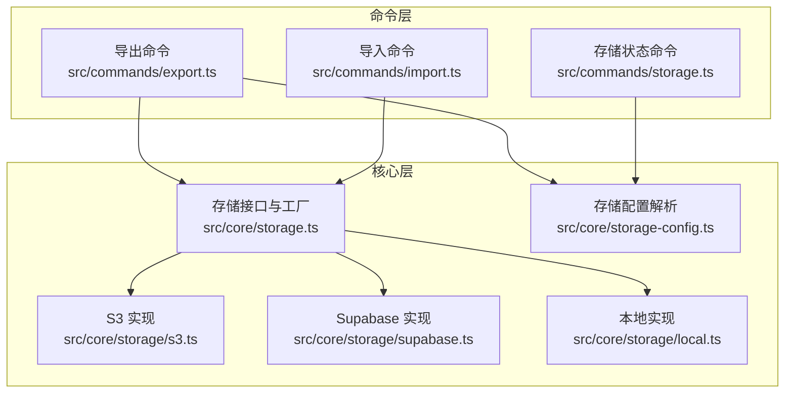
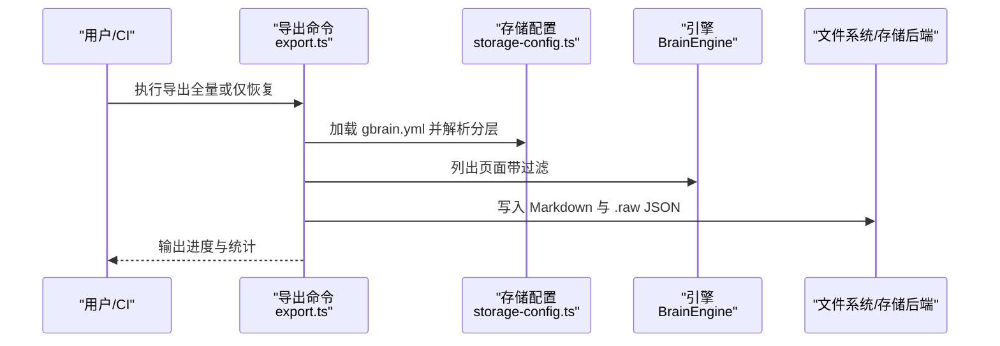
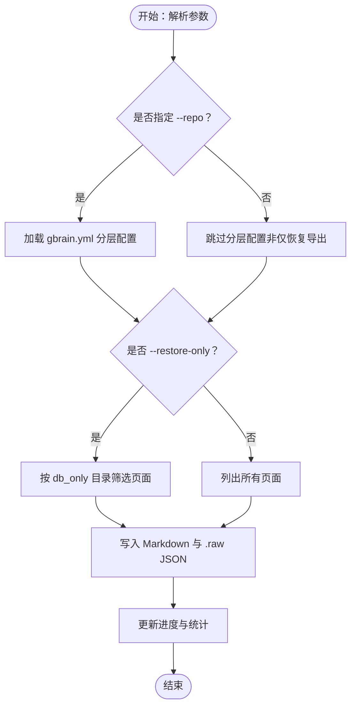
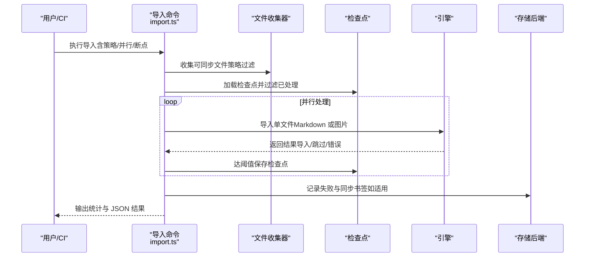
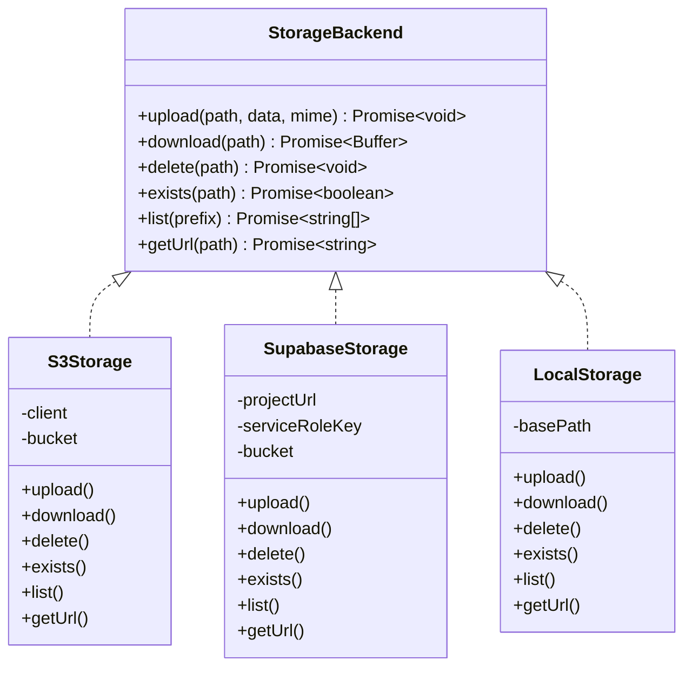
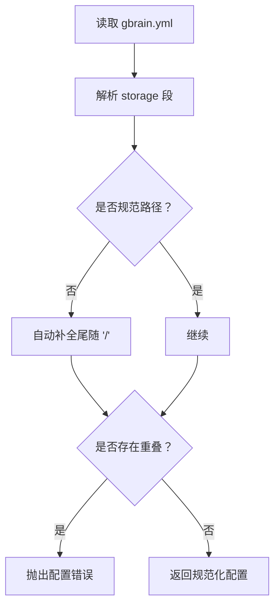
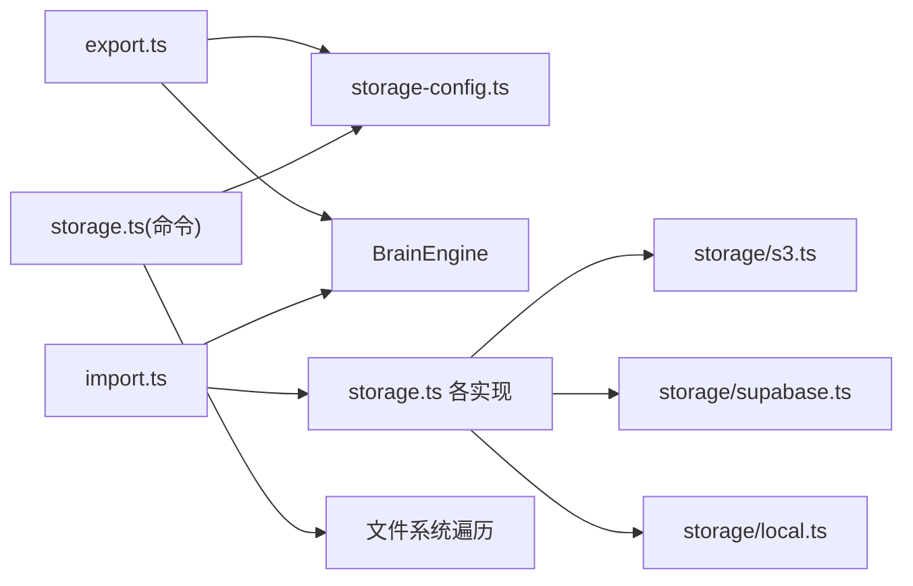

# 备份与恢复

<cite>
**本文引用的文件**
- [export.ts](file://src/commands/export.ts)
- [import.ts](file://src/commands/import.ts)
- [storage.ts](file://src/core/storage.ts)
- [storage-config.ts](file://src/core/storage-config.ts)
- [storage/s3.ts](file://src/core/storage/s3.ts)
- [storage/supabase.ts](file://src/core/storage/supabase.ts)
- [storage/local.ts](file://src/core/storage/local.ts)
- [storage.ts](file://src/commands/storage.ts)
- [storage-export.test.ts](file://test/storage-export.test.ts)
- [storage.test.ts](file://test/storage.test.ts)
- [gbrain.yml](file://gbrain.yml)
</cite>

## 目录
1. [简介](#简介)
2. [项目结构](#项目结构)
3. [核心组件](#核心组件)
4. [架构总览](#架构总览)
5. [详细组件分析](#详细组件分析)
6. [依赖关系分析](#依赖关系分析)
7. [性能考量](#性能考量)
8. [故障排查指南](#故障排查指南)
9. [结论](#结论)
10. [附录](#附录)

## 简介
本指南面向运维与平台工程团队，系统性阐述 GBrain 的备份与恢复能力：覆盖数据备份策略（全量与增量）、导出/导入流程与数据格式、存储后端配置（本地、S3/S3 兼容、Supabase）、备份传输安全、灾难恢复计划、版本保留策略、跨环境迁移与一致性保障。文档以仓库中现有实现为依据，结合测试用例与配置示例，给出可落地的操作步骤与最佳实践。

## 项目结构
围绕备份与恢复的关键模块分布如下：
- 命令层
  - 导出命令：负责生成可恢复的页面 Markdown 及侧载原始数据 JSON
  - 导入命令：负责从目录批量导入页面，支持断点续传与并行处理
  - 存储状态命令：用于诊断存储分层配置与缺失文件
- 核心层
  - 存储抽象与工厂：统一的 StorageBackend 接口与按需创建逻辑
  - 后端实现：S3/S3 兼容、Supabase、本地文件系统
  - 存储配置解析与校验：gbrain.yml 的解析、规范化与冲突检测
- 配置与示例
  - gbrain.yml：定义“数据库追踪”与“仅数据库”两类存储分层

图表来源
- [export.ts:11-149](file://src/commands/export.ts#L11-L149)
- [import.ts:45-468](file://src/commands/import.ts#L45-L468)
- [storage.ts:8-52](file://src/core/storage.ts#L8-L52)
- [storage-config.ts:185-236](file://src/core/storage-config.ts#L185-L236)
- [storage/s3.ts:15-109](file://src/core/storage/s3.ts#L15-L109)
- [storage/supabase.ts:16-210](file://src/core/storage/supabase.ts#L16-L210)
- [storage/local.ts:9-67](file://src/core/storage/local.ts#L9-L67)

章节来源
- [export.ts:11-149](file://src/commands/export.ts#L11-L149)
- [import.ts:45-468](file://src/commands/import.ts#L45-L468)
- [storage.ts:8-52](file://src/core/storage.ts#L8-L52)
- [storage-config.ts:185-236](file://src/core/storage-config.ts#L185-L236)

## 核心组件
- 导出命令
  - 支持全量导出与“仅恢复”导出；后者基于存储分层配置筛选 db_only 页面并写入目标目录
  - 输出格式：每个页面一个 Markdown 文件，以及同名目录下的 .raw 子目录存放侧载原始 JSON
  - 进度与统计输出到标准错误与标准输出，便于脚本解析
- 导入命令
  - 支持策略式收集（markdown/code/auto），并行工作器、断点续传、失败记录与同步书签管理
  - 提供 JSON 输出模式，便于自动化集成
- 存储抽象与工厂
  - 统一上传/下载/删除/存在性检查/列举/获取 URL 接口
  - 工厂根据配置选择后端实现（S3、Supabase、本地）
- 存储配置
  - 解析 gbrain.yml 中的 storage 段，规范化路径尾随斜杠，校验重叠与格式问题
  - 提供匹配器：判断页面 slug 属于哪一类存储分层
- 存储状态命令
  - 基于引擎列出页面与一次仓库遍历，统计各分层页数与磁盘用量，识别 db_only 缺失文件

章节来源
- [export.ts:11-149](file://src/commands/export.ts#L11-L149)
- [import.ts:45-468](file://src/commands/import.ts#L45-L468)
- [storage.ts:8-52](file://src/core/storage.ts#L8-L52)
- [storage-config.ts:185-377](file://src/core/storage-config.ts#L185-L377)
- [storage.ts:108-147](file://src/commands/storage.ts#L108-L147)

## 架构总览
下图展示备份与恢复在系统中的交互关系：导出命令依赖存储配置与引擎；导入命令依赖存储后端与引擎；存储状态命令用于诊断与规划恢复。

图表来源
- [export.ts:11-149](file://src/commands/export.ts#L11-L149)
- [storage-config.ts:185-236](file://src/core/storage-config.ts#L185-L236)

## 详细组件分析

### 导出命令（备份）
- 关键行为
  - 解析参数：--dir、--repo、--type、--slug-prefix、--restore-only
  - “仅恢复”导出：基于存储分层配置，仅查询 db_only 目录内的页面，避免全表扫描
  - 输出：每个页面一个 .md；若存在原始数据则在同级 .raw 目录下生成同名 .json
  - 进度：通过进度条输出到标准错误，统计信息输出到标准输出
- 数据格式
  - Markdown：包含页面头信息、编译真相、时间线与标签
  - 侧载原始数据：JSON 对象，键为数据源标识，值为对应原始数据
- 完整性与批量
  - 通过“仅恢复”导出可快速定位 db_only 中缺失的页面文件，便于批量恢复
  - 测试覆盖了“仅恢复”导出在无存储配置时的拒绝行为，防止静默全量导出

图表来源
- [export.ts:11-149](file://src/commands/export.ts#L11-L149)
- [storage-config.ts:351-363](file://src/core/storage-config.ts#L351-L363)

章节来源
- [export.ts:11-149](file://src/commands/export.ts#L11-L149)
- [storage-export.test.ts:116-146](file://test/storage-export.test.ts#L116-L146)

### 导入命令（恢复）
- 关键行为
  - 策略式收集：支持 markdown/code/auto 三种策略，自动忽略符号链接与特定目录
  - 断点续传：基于路径的完成列表，支持每 100 次成功写入检查点
  - 并行处理：Postgres 引擎下默认每工人池大小为 2，串行连接工人以确保清理
  - 失败记录：将失败项写入中心 JSONL，便于后续诊断
  - 同步书签：在 git 仓库场景下，记录 last_commit 与 last_run
- 数据格式
  - 输入：Markdown 页面与 .raw 下的同名 JSON（若存在）
  - 输出：页面写入数据库，同时生成内容块与向量嵌入（可选）
- 批量与幂等
  - 通过检查点与“已处理集合”，重复运行可自动跳过已完成文件
  - 错误计数抑制：同类错误超过阈值后进行抑制输出

图表来源
- [import.ts:45-468](file://src/commands/import.ts#L45-L468)

章节来源
- [import.ts:45-468](file://src/commands/import.ts#L45-L468)

### 存储抽象与后端实现
- 抽象接口
  - upload/download/delete/exists/list/getUrl
- 后端实现
  - S3/S3 兼容：基于 @aws-sdk/client-s3，支持自定义 endpoint、路径风格与凭据
  - Supabase：标准上传与 TUS 断点续传（≥100MB），支持签名 URL
  - 本地：文件系统存取，路径穿越防护
- 工厂创建
  - 根据配置 backend 字段动态导入并实例化具体实现

图表来源
- [storage.ts:8-52](file://src/core/storage.ts#L8-L52)
- [storage/s3.ts:15-109](file://src/core/storage/s3.ts#L15-L109)
- [storage/supabase.ts:16-210](file://src/core/storage/supabase.ts#L16-L210)
- [storage/local.ts:9-67](file://src/core/storage/local.ts#L9-L67)

章节来源
- [storage.ts:8-52](file://src/core/storage.ts#L8-L52)
- [storage/s3.ts:15-109](file://src/core/storage/s3.ts#L15-L109)
- [storage/supabase.ts:16-210](file://src/core/storage/supabase.ts#L16-L210)
- [storage/local.ts:9-67](file://src/core/storage/local.ts#L9-L67)
- [storage.test.ts:145-168](file://test/storage.test.ts#L145-L168)

### 存储配置与分层
- 配置文件
  - gbrain.yml 的 storage 段定义 db_tracked 与 db_only 两类目录
- 解析与校验
  - 解析 YAML，规范化路径尾随斜杠，检测重叠与格式问题
  - 提供匹配器：isDbTracked/isDbOnly/getStorageTier
- 状态报告
  - 统计各分层页数与磁盘用量，识别 db_only 缺失文件，指导“仅恢复”导出

图表来源
- [storage-config.ts:289-330](file://src/core/storage-config.ts#L289-L330)
- [gbrain.yml:1-19](file://gbrain.yml#L1-L19)

章节来源
- [storage-config.ts:185-377](file://src/core/storage-config.ts#L185-L377)
- [storage.ts:108-147](file://src/commands/storage.ts#L108-L147)
- [gbrain.yml:1-19](file://gbrain.yml#L1-L19)

## 依赖关系分析
- 命令对核心模块的依赖
  - 导出命令依赖存储配置与引擎，用于筛选页面与序列化输出
  - 导入命令依赖存储后端与引擎，用于写入数据库与并行处理
  - 存储状态命令依赖存储配置与文件系统遍历，用于诊断
- 外部依赖
  - S3 后端依赖 @aws-sdk/client-s3
  - Supabase 后端依赖服务角色密钥与 REST/TUS 协议
  - 本地后端依赖 Node.js fs 能力

图表来源
- [export.ts:7-44](file://src/commands/export.ts#L7-L44)
- [import.ts:1-24](file://src/commands/import.ts#L1-L24)
- [storage.ts:1-7](file://src/commands/storage.ts#L1-L7)

章节来源
- [export.ts:7-44](file://src/commands/export.ts#L7-L44)
- [import.ts:1-24](file://src/commands/import.ts#L1-L24)
- [storage.ts:1-7](file://src/commands/storage.ts#L1-L7)

## 性能考量
- 导出
  - “仅恢复”导出通过分层过滤显著减少查询与 IO；db_only 目录越多，收益越大
  - 侧载原始数据按页面粒度写入，避免大体积数据进入主 Markdown
- 导入
  - 并行工作器数量由 CPU、内存与数据库连接池共同约束，默认上限为 8
  - 断点续传每 100 次成功写入检查点，降低大规模导入中断成本
  - git 工作树场景优先使用 git ls-files，避免遍历被 .gitignore 忽略的目录
- 存储
  - Supabase 对大文件采用 TUS 断点续传，提升网络不稳定场景的可靠性
  - S3 支持自定义 endpoint，适配 R2/MinIO 等兼容服务

[本节为通用性能建议，不直接分析具体文件]

## 故障排查指南
- 导出“仅恢复”报错
  - 现象：提示需要存储配置或默认源未设置本地路径
  - 处理：确认 gbrain.yml 存在且包含 storage 段；或显式提供 --repo；或为默认源配置 local_path
- 导入前嵌入凭证缺失
  - 现象：未使用 --no-embed 时，若嵌入提供商凭证缺失，导入会提前失败
  - 处理：先执行 --no-embed 导入，再离线回填嵌入
- 导入失败与断点
  - 现象：部分文件失败，检查点保留
  - 处理：再次运行导入，自动跳过已完成；失败详情可在 JSONL 中查看
- 存储后端认证错误
  - 现象：S3/Supabase 创建存储实例时报错
  - 处理：核对 accessKeyId/secretAccessKey、projectUrl、serviceRoleKey 等配置

章节来源
- [export.ts:31-59](file://src/commands/export.ts#L31-L59)
- [import.ts:58-88](file://src/commands/import.ts#L58-L88)
- [storage.test.ts:157-167](file://test/storage.test.ts#L157-L167)

## 结论
GBrain 的备份与恢复以“导出/导入 + 存储分层”为核心：通过 gbrain.yml 将内容分为“数据库追踪”与“仅数据库”，既能保证小体量的人类编辑内容常驻 Git，又能高效地对海量机器生成内容进行备份与恢复。配合断点续传、并行导入与多后端存储，可在不同规模与环境下稳定落地。建议在生产中结合 CI/CD 实施定期全量导出与“仅恢复”导出，以满足合规与灾备需求。

[本节为总结性内容，不直接分析具体文件]

## 附录

### 备份策略与实施要点
- 全量备份
  - 使用导出命令的全量模式，将所有页面写入目标目录；适合首次归档或周期性快照
- 增量备份
  - 使用“仅恢复”导出，针对 db_only 目录筛选缺失文件，减少传输与存储开销
- 数据格式
  - 页面：Markdown；侧载原始数据：.raw 目录下的同名 JSON
- 完整性验证
  - 通过存储状态命令识别 db_only 缺失文件，结合导出统计核对页数
- 批量操作
  - 导入命令支持并行与断点续传，适合大规模恢复；导出命令支持 --slug-prefix 与 --type 过滤

章节来源
- [export.ts:69-97](file://src/commands/export.ts#L69-L97)
- [storage.ts:108-147](file://src/commands/storage.ts#L108-L147)

### 存储后端配置与传输安全
- 本地存储
  - 适用于开发与测试；注意路径穿越防护
- S3/S3 兼容
  - 需要 accessKeyId/secretAccessKey；支持自定义 endpoint 与路径风格
- Supabase
  - 需要 projectUrl/serviceRoleKey；大文件自动采用 TUS 断点续传
- 传输安全
  - S3 使用 SDK 自动签名；Supabase 使用服务角色密钥与签名 URL（私有桶）

章节来源
- [storage.ts:17-30](file://src/core/storage.ts#L17-L30)
- [storage/s3.ts:19-38](file://src/core/storage/s3.ts#L19-L38)
- [storage/supabase.ts:21-28](file://src/core/storage/supabase.ts#L21-L28)
- [storage/local.ts:12-23](file://src/core/storage/local.ts#L12-L23)

### 灾难恢复计划与跨环境迁移
- 灾难恢复
  - 使用“仅恢复”导出定位缺失文件，结合导入命令批量恢复
  - 若数据库损坏，可重建引擎后导入历史导出产物
- 跨环境迁移
  - 在新环境中配置相同存储后端与 gbrain.yml 分层，先导入再导出“仅恢复”以补齐缺失文件
  - 注意迁移前后嵌入提供商配置一致，避免检索质量差异

[本节为概念性内容，不直接分析具体文件]

### 调度、存储管理与版本保留
- 调度
  - 建议在 CI/CD 中定时执行全量导出；在变更频繁的 db_only 目录中执行“仅恢复”导出
- 存储管理
  - 使用后端对象生命周期管理策略（如 S3 生命周期规则、Supabase 存储桶策略）
- 版本保留
  - 建议保留最近 N 个全量导出与若干“仅恢复”导出，结合元数据标记版本号与时间戳

[本节为通用实践建议，不直接分析具体文件]