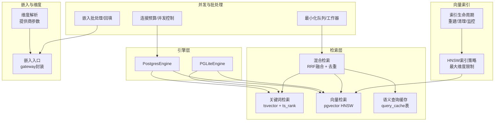
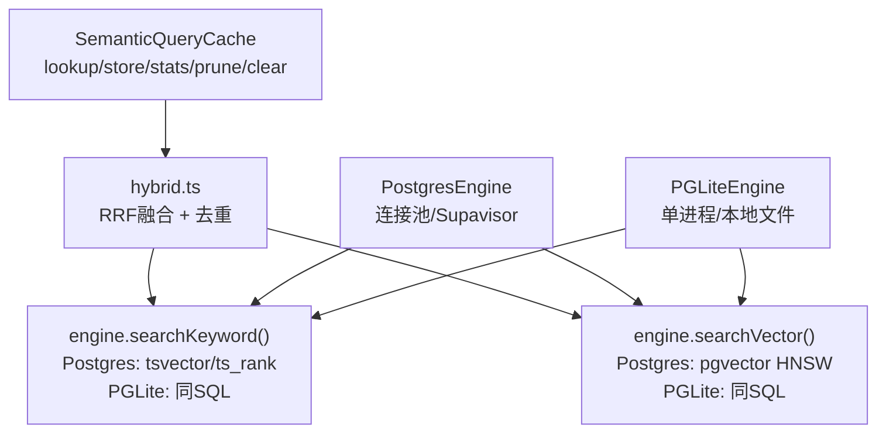
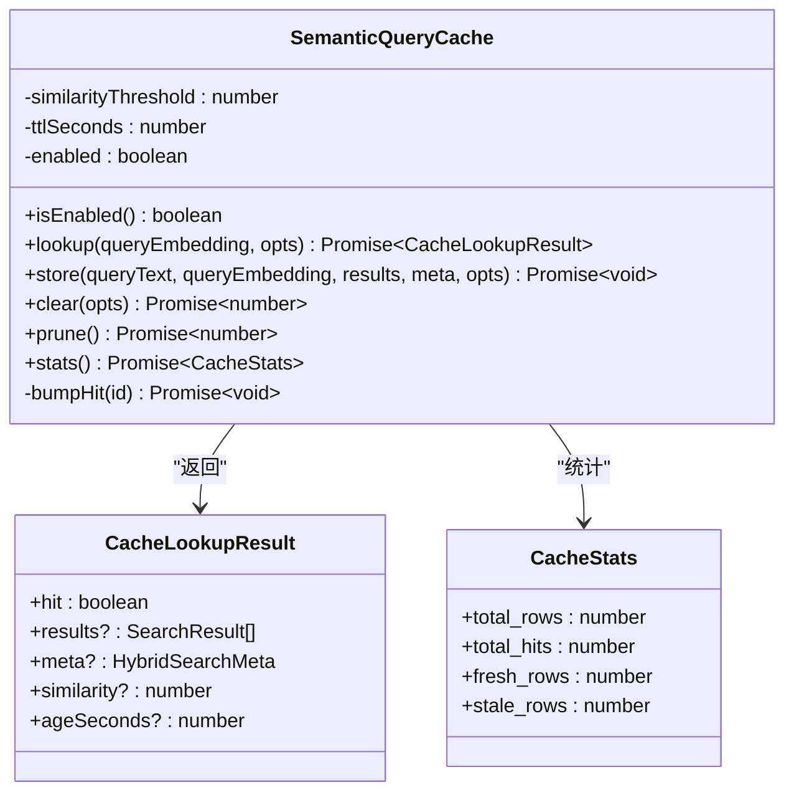
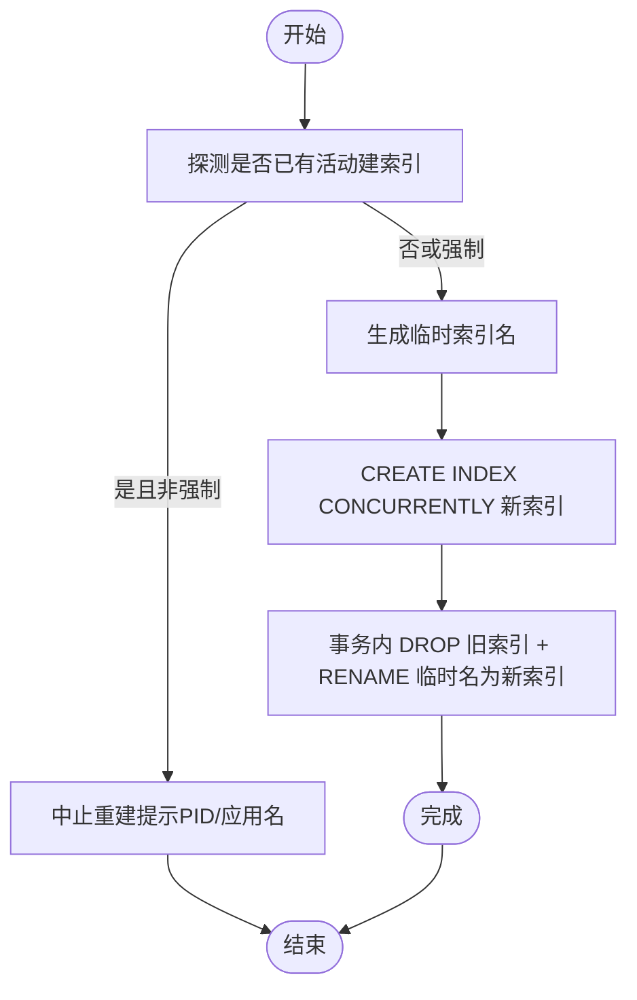
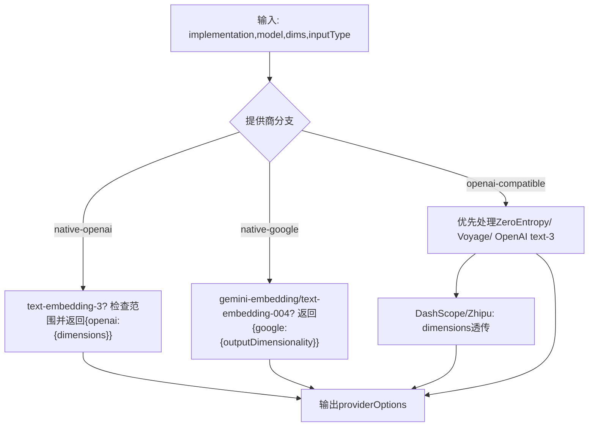
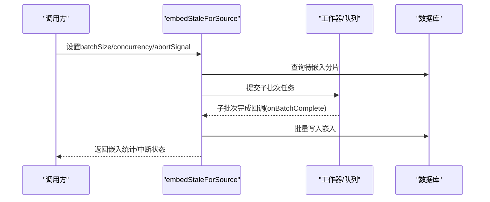
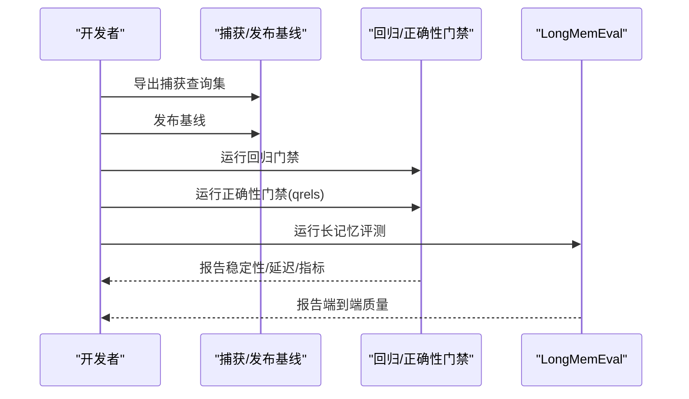
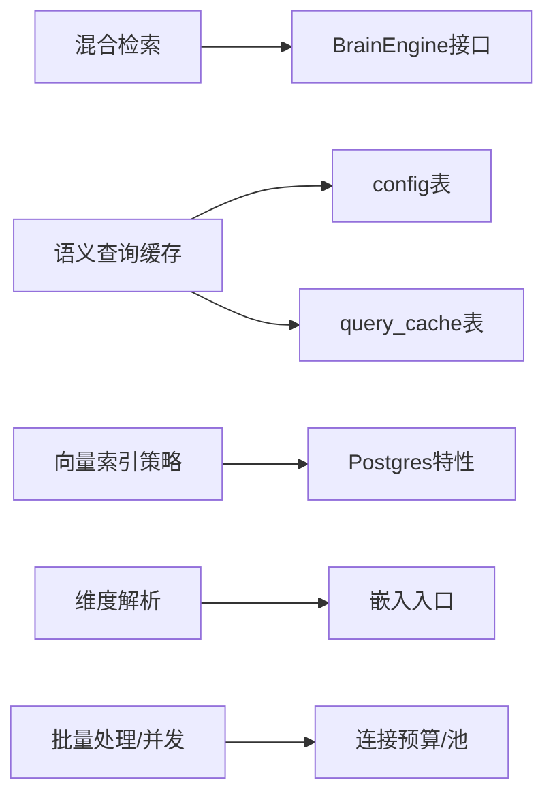

# 性能调优

<cite>
**本文档引用的文件**
- [src/core/search/query-cache.ts](file://src/core/search/query-cache.ts)
- [test/query-cache.test.ts](file://test/query-cache.test.ts)
- [test/query-cache-knobs-hash.serial.test.ts](file://test/query-cache-knobs-hash.serial.test.ts)
- [src/core/vector-index.ts](file://src/core/vector-index.ts)
- [src/core/ai/dims.ts](file://src/core/ai/dims.ts)
- [src/core/embedding.ts](file://src/core/embedding.ts)
- [src/core/pglite-engine.ts](file://src/core/pglite-engine.ts)
- [docs/ENGINES.md](file://docs/ENGINES.md)
- [docs/storage-tiering.md](file://docs/storage-tiering.md)
- [docs/eval-bench.md](file://docs/eval-bench.md)
- [test/e2e/bench-vs-openclaw/memory.bench.ts](file://test/e2e/bench-vs-openclaw/memory.bench.ts)
- [test/e2e/bench-vs-openclaw/harness.ts](file://test/e2e/bench-vs-openclaw/harness.ts)
- [test/sync-resumable-import.serial.test.ts](file://test/sync-resumable-import.serial.test.ts)
- [test/minions.test.ts](file://test/minions.test.ts)
- [test/sync-concurrency.test.ts](file://test/sync-concurrency.test.ts)
- [src/core/embed-stale.ts](file://src/core/embed-stale.ts)
- [test/ai/dims-zeroentropy.test.ts](file://test/ai/dims-zeroentropy.test.ts)
- [test/ai/recipe-zhipu.test.ts](file://test/ai/recipe-zhipu.test.ts)
- [tests/heavy/rss-baseline.json](file://tests/heavy/rss-baseline.json)
</cite>

## 目录
1. [简介](#简介)
2. [项目结构](#项目结构)
3. [核心组件](#核心组件)
4. [架构总览](#架构总览)
5. [详细组件分析](#详细组件分析)
6. [依赖关系分析](#依赖关系分析)
7. [性能考量与优化建议](#性能考量与优化建议)
8. [故障排查指南](#故障排查指南)
9. [结论](#结论)
10. [附录](#附录)

## 简介
本指南聚焦于 GBrain 的性能调优，覆盖搜索性能优化、索引策略、查询缓存配置、数据库性能与连接池管理、并发控制、向量索引优化、嵌入维度选择与批量处理策略，并提供基准测试方法、性能监控指标与瓶颈识别技术，以及内存使用、CPU 利用率与 I/O 改进策略，最后给出容量规划、扩展性设计与成本优化建议。

## 项目结构
- 引擎抽象层：通过统一的 BrainEngine 接口屏蔽底层存储差异（Postgres 与 PGLite），保证上层检索与处理逻辑一致。
- 检索子系统：关键词检索、向量检索、混合检索（RRF 融合、去重）与语义查询缓存。
- 向量索引生命周期管理：HNSW 索引的检测、重建、清理与进度监控。
- 嵌入维度与提供商适配：按模型能力动态选择维度与输入类型，避免运行时错误与降级。
- 批量与并发：嵌入回填批处理、最小化队列与工作器并发、连接预算控制。
- 基准与评估：端到端检索回归门禁、长记忆评测、一致性探测与内存基准。

图示来源
- [docs/ENGINES.md:105-130](file://docs/ENGINES.md#L105-L130)
- [src/core/vector-index.ts:24-34](file://src/core/vector-index.ts#L24-L34)
- [src/core/search/query-cache.ts:1-30](file://src/core/search/query-cache.ts#L1-L30)

章节来源
- [docs/ENGINES.md:1-235](file://docs/ENGINES.md#L1-L235)

## 核心组件
- 语义查询缓存（SemanticQueryCache）
  - 以查询嵌入的余弦距离进行近似匹配，命中则直接返回缓存结果，绕过关键词/向量/扩展/RFF/去重等完整流程。
  - 支持多源隔离、TTL、命中计数、两层缓存门禁（页面生成快照）。
- 向量索引策略与生命周期
  - HNSW 索引最大维度限制；支持原子重建（临时名交换）、僵尸索引清理、活动构建探测与进度监控。
- 嵌入维度与提供商参数
  - 针对不同提供商（OpenAI、Gemini、ZeroEntropy、Voyage、DashScope、Zhipu）解析维度参数，确保在运行时不会因维度不匹配导致失败。
- 批量与并发控制
  - 嵌入回填批大小与并发度可配置；最小化队列并发与连接预算控制，避免连接池耗尽。
- 基准与评估
  - 提供回归门禁（基于捕获的查询）、正确性门禁（qrels）、长记忆评测（LongMemEval）与一致性探测。

章节来源
- [src/core/search/query-cache.ts:1-397](file://src/core/search/query-cache.ts#L1-L397)
- [src/core/vector-index.ts:1-248](file://src/core/vector-index.ts#L1-L248)
- [src/core/ai/dims.ts:1-234](file://src/core/ai/dims.ts#L1-L234)
- [src/core/embed-stale.ts:90-117](file://src/core/embed-stale.ts#L90-L117)

## 架构总览
下图展示检索路径在不同引擎上的实现差异与共享层：

图示来源
- [docs/ENGINES.md:105-130](file://docs/ENGINES.md#L105-L130)
- [src/core/search/query-cache.ts:127-196](file://src/core/search/query-cache.ts#L127-L196)

章节来源
- [docs/ENGINES.md:134-177](file://docs/ENGINES.md#L134-L177)

## 详细组件分析

### 组件A：语义查询缓存（SemanticQueryCache）
- 功能要点
  - 查询嵌入相似度阈值判定（默认阈值约等于余弦距离上限）。
  - 多源隔离（source_id）与模式哈希（knobs_hash）隔离不同检索模式。
  - TTL 过期检查与清理；命中计数异步更新。
  - 两层缓存门禁：页面生成快照与最大生成版本，防止缓存脏读。
- 关键配置
  - 开关、相似度阈值、TTL 秒数；从 config 表加载。
- 测试覆盖
  - 表结构存在性、确定性键、TTL 过期、跨源隔离、管理操作（clear/prune/stats）与禁用行为。

图示来源
- [src/core/search/query-cache.ts:97-113](file://src/core/search/query-cache.ts#L97-L113)
- [src/core/search/query-cache.ts:42-57](file://src/core/search/query-cache.ts#L42-L57)

章节来源
- [src/core/search/query-cache.ts:1-397](file://src/core/search/query-cache.ts#L1-L397)
- [test/query-cache.test.ts:108-260](file://test/query-cache.test.ts#L108-L260)
- [test/query-cache-knobs-hash.serial.test.ts:126-214](file://test/query-cache-knobs-hash.serial.test.ts#L126-L214)

### 组件B：向量索引策略与生命周期（pgvector HNSW）
- 功能要点
  - 最大维度限制：超过阈值（如 2000）时跳过 HNSW，保留精确扫描路径。
  - 原子重建：临时名 + 事务内交换，失败不影响线上服务。
  - 僵尸索引清理：启动时扫描 invalid 索引并安全删除。
  - 活动构建探测与进度监控：避免与自动维护冲突并可视化进度。
- 使用场景
  - 在线重建索引、大规模数据重排后重建、托管平台自动维护冲突规避。

图示来源
- [src/core/vector-index.ts:154-195](file://src/core/vector-index.ts#L154-L195)

章节来源
- [src/core/vector-index.ts:1-248](file://src/core/vector-index.ts#L1-L248)

### 组件C：嵌入维度解析与提供商适配
- 功能要点
  - OpenAI text-embedding-3 家族：支持 Matryoshka 截断，超出范围抛出明确错误。
  - ZeroEntropy zembed-1：固定维度集合，拒绝其他值。
  - Voyage：支持 output_dimension（256/512/1024/2048），拒绝非法值。
  - DashScope/Zhipu：OpenAI 兼容路径透传 dimensions。
  - 对称/非对称输入类型：为 ZE、Voyage 等提供 input_type 参数。
- 实践建议
  - 明确指定 embedding_model 与 embedding_dimensions，避免默认回退导致的维度不匹配。
  - 在配置变更后进行小规模回归验证。

图示来源
- [src/core/ai/dims.ts:112-234](file://src/core/ai/dims.ts#L112-L234)

章节来源
- [src/core/ai/dims.ts:1-234](file://src/core/ai/dims.ts#L1-L234)
- [test/ai/dims-zeroentropy.test.ts:35-69](file://test/ai/dims-zeroentropy.test.ts#L35-L69)
- [test/ai/recipe-zhipu.test.ts:60-85](file://test/ai/recipe-zhipu.test.ts#L60-L85)

### 组件D：批量处理与并发控制
- 嵌入回填
  - 批大小与并发度可配置，默认较大批次与较高并发，失败单页重试不污染整体进度。
- 并发策略
  - PGLite 固定串行（单连接）；Postgres 自动并发阈值与显式覆盖。
  - 最小化队列并发与连接预算控制，避免连接池耗尽。
- 工作器与作业
  - 工作器跟踪在途作业数量，确保可观测与可回收。

图示来源
- [src/core/embed-stale.ts:109-117](file://src/core/embed-stale.ts#L109-L117)

章节来源
- [src/core/embed-stale.ts:90-117](file://src/core/embed-stale.ts#L90-L117)
- [test/sync-concurrency.test.ts:1-63](file://test/sync-concurrency.test.ts#L1-L63)
- [test/minions.test.ts:1061-1103](file://test/minions.test.ts#L1061-L1103)
- [test/sync-resumable-import.serial.test.ts:365-392](file://test/sync-resumable-import.serial.test.ts#L365-L392)

### 组件E：基准测试与评估
- 回归门禁
  - 基于捕获的查询集，比较 Jaccard、Top-1 稳定性与平均延迟 Δ。
- 正确性门禁
  - 使用 qrels 计算召回率、首次相关命中率等指标。
- 长记忆评测（LongMemEval）
  - 端到端问答管线，支持仅检索模式与多类型召回分解。
- 内存基准
  - 通过并行进程采样 RSS，验证内存随并发线性增长。

图示来源
- [docs/eval-bench.md:28-599](file://docs/eval-bench.md#L28-L599)
- [test/e2e/bench-vs-openclaw/harness.ts:126-162](file://test/e2e/bench-vs-openclaw/harness.ts#L126-L162)
- [test/e2e/bench-vs-openclaw/memory.bench.ts:78-121](file://test/e2e/bench-vs-openclaw/memory.bench.ts#L78-L121)

章节来源
- [docs/eval-bench.md:1-599](file://docs/eval-bench.md#L1-L599)
- [test/e2e/bench-vs-openclaw/harness.ts:126-162](file://test/e2e/bench-vs-openclaw/harness.ts#L126-L162)
- [test/e2e/bench-vs-openclaw/memory.bench.ts:78-121](file://test/e2e/bench-vs-openclaw/memory.bench.ts#L78-L121)

## 依赖关系分析
- 检索层依赖引擎层提供的关键词与向量检索接口，混合检索在共享层完成。
- 语义查询缓存独立于引擎，但依赖 query_cache 表与 config 表。
- 向量索引策略与生命周期与 Postgres 特性强相关，PGLite 保持相同 SQL 语义但无连接池。
- 嵌入维度解析与提供商参数贯穿嵌入入口，影响上游检索质量与稳定性。
- 并发与批处理策略受引擎类型与连接预算约束。

图示来源
- [docs/ENGINES.md:105-130](file://docs/ENGINES.md#L105-L130)
- [src/core/search/query-cache.ts:365-396](file://src/core/search/query-cache.ts#L365-L396)
- [src/core/vector-index.ts:63-89](file://src/core/vector-index.ts#L63-L89)
- [src/core/ai/dims.ts:112-234](file://src/core/ai/dims.ts#L112-L234)

章节来源
- [docs/ENGINES.md:134-177](file://docs/ENGINES.md#L134-L177)

## 性能考量与优化建议

### 搜索性能优化
- 启用并合理配置语义查询缓存
  - 阈值与 TTL 可通过 config 表动态调整；生产环境建议默认开启。
  - 使用 knobs_hash 区分不同检索模式，避免跨模式污染。
- 混合检索参数
  - RRF 融合参数与去重策略在共享层生效，减少重复计算。
- 多源隔离
  - 缓存按 source_id 隔离，避免跨脑命中。

章节来源
- [src/core/search/query-cache.ts:365-396](file://src/core/search/query-cache.ts#L365-L396)
- [test/query-cache.test.ts:198-208](file://test/query-cache.test.ts#L198-L208)

### 索引策略调整
- HNSW 维度上限
  - 当嵌入维度超过 2000 时自动降级为精确扫描，避免 HNSW 不支持高维。
- 原子重建与僵尸索引清理
  - 在线重建不阻塞写入；启动时清理无效索引，降低碎片与误用风险。
- 监控与冲突规避
  - 活动构建探测避免与托管平台自动维护冲突；提供进度监控。

章节来源
- [src/core/vector-index.ts:19-34](file://src/core/vector-index.ts#L19-L34)
- [src/core/vector-index.ts:154-195](file://src/core/vector-index.ts#L154-L195)
- [src/core/vector-index.ts:212-236](file://src/core/vector-index.ts#L212-L236)

### 查询缓存配置
- 键设计
  - (query, source_id, knobs_hash) 组合作为主键，避免重复插入。
- TTL 与清理
  - 清理过期条目；统计新鲜/陈旧/总条目与命中总数。
- 禁用策略
  - 可通过配置或构造函数禁用，作为快速回滚手段。

章节来源
- [src/core/search/query-cache.ts:76-80](file://src/core/search/query-cache.ts#L76-L80)
- [src/core/search/query-cache.ts:289-304](file://src/core/search/query-cache.ts#L289-L304)
- [test/query-cache.test.ts:251-260](file://test/query-cache.test.ts#L251-L260)

### 数据库性能与连接池管理
- 引擎选择
  - PGLite：单进程、零配置，适合本地与小规模；Postgres：连接池、可扩展。
- 连接预算与并发
  - 通过环境变量与策略函数限制每工作器连接数，避免连接池耗尽。
  - 最小化队列并发，确保在途作业可控。

章节来源
- [docs/ENGINES.md:166-177](file://docs/ENGINES.md#L166-L177)
- [test/sync-resumable-import.serial.test.ts:365-392](file://test/sync-resumable-import.serial.test.ts#L365-L392)
- [test/minions.test.ts:1061-1103](file://test/minions.test.ts#L1061-L1103)

### 并发控制
- 自动并发策略
  - 小文件差异串行，大差异自动并行；PGLite 固定串行。
- 工作器并发
  - 严格跟踪在途作业数量，确保可观测与可回收。

章节来源
- [test/sync-concurrency.test.ts:1-63](file://test/sync-concurrency.test.ts#L1-L63)
- [test/minions.test.ts:1061-1103](file://test/minions.test.ts#L1061-L1103)

### 向量索引优化、嵌入维度选择与批量处理
- 维度选择
  - 明确 embedding_model 与 embedding_dimensions，避免默认回退导致的维度不匹配。
  - 对 ZeroEntropy/Voyage/OpenAI 文本-3 等模型设置合法维度范围。
- 批量处理
  - 嵌入回填采用大批次与高并发，失败单页重试，保证整体吞吐。
- SQL 写入优化
  - PGLite 批量写入时内联向量字面量，减少占位符开销。

章节来源
- [src/core/ai/dims.ts:112-234](file://src/core/ai/dims.ts#L112-L234)
- [src/core/embed-stale.ts:109-117](file://src/core/embed-stale.ts#L109-L117)
- [src/core/pglite-engine.ts:2084-2111](file://src/core/pglite-engine.ts#L2084-L2111)

### 基准测试方法、性能监控与瓶颈识别
- 回归门禁
  - 使用捕获的查询集比较 Jaccard、Top-1 稳定性与平均延迟 Δ。
- 正确性门禁
  - 使用 qrels 计算召回率、首次相关命中率等。
- 长记忆评测
  - 端到端问答管线，支持仅检索模式与按问题类型分解。
- 内存基准
  - 通过并行进程采样 RSS，验证内存随并发线性增长。
- 统计工具
  - 基准工具提供 n、成功/失败、均值、分位数、最小/最大等指标。

章节来源
- [docs/eval-bench.md:28-599](file://docs/eval-bench.md#L28-L599)
- [test/e2e/bench-vs-openclaw/harness.ts:126-162](file://test/e2e/bench-vs-openclaw/harness.ts#L126-L162)
- [test/e2e/bench-vs-openclaw/memory.bench.ts:78-121](file://test/e2e/bench-vs-openclaw/memory.bench.ts#L78-L121)

### 容量规划、扩展性设计与成本优化
- 存储分层
  - 使用 db_tracked 与 db_only 分离版本控制与机器生成内容，减小仓库体积。
- 引擎迁移
  - 通过迁移命令在 Postgres 与 PGLite 间双向切换，满足不同规模需求。
- 成本控制
  - 基准测试与门禁减少回归风险，降低无效改动带来的成本。
  - 长记忆评测支持仅检索模式，缩短评估时间与成本。

章节来源
- [docs/storage-tiering.md:1-211](file://docs/storage-tiering.md#L1-L211)
- [docs/ENGINES.md:177-177](file://docs/ENGINES.md#L177-L177)

## 故障排查指南
- 语义查询缓存未命中
  - 检查缓存开关、阈值、TTL、source_id 与 knobs_hash 是否匹配。
  - 使用 stats 查看新鲜/陈旧/总条目与命中计数。
- 向量索引异常
  - 检查维度是否超过上限；确认活动构建探测结果；必要时强制重建。
- 嵌入维度错误
  - 根据提供商规则核对 embedding_model 与 embedding_dimensions，修正后重试。
- 并发与连接问题
  - 检查连接预算与每工作器连接数；观察最小化队列在途作业数量。
- 内存基准异常
  - 对比基线文件中的峰值 RSS；确认并发进程数与采样间隔。

章节来源
- [src/core/search/query-cache.ts:306-326](file://src/core/search/query-cache.ts#L306-L326)
- [src/core/vector-index.ts:63-89](file://src/core/vector-index.ts#L63-L89)
- [src/core/ai/dims.ts:112-234](file://src/core/ai/dims.ts#L112-L234)
- [tests/heavy/rss-baseline.json:1-12](file://tests/heavy/rss-baseline.json#L1-L12)

## 结论
通过启用语义查询缓存、合理设置嵌入维度、在线重建向量索引、控制并发与连接预算、结合回归与正确性门禁及长记忆评测，可在不同规模与环境下获得稳定且高性能的检索体验。存储分层与引擎迁移进一步增强了扩展性与成本控制能力。

## 附录
- 相关文件清单
  - 检索与缓存：[src/core/search/query-cache.ts](file://src/core/search/query-cache.ts)
  - 向量索引：[src/core/vector-index.ts](file://src/core/vector-index.ts)
  - 嵌入维度：[src/core/ai/dims.ts](file://src/core/ai/dims.ts)
  - 批处理与并发：[src/core/embed-stale.ts](file://src/core/embed-stale.ts)、[test/sync-concurrency.test.ts](file://test/sync-concurrency.test.ts)、[test/minions.test.ts](file://test/minions.test.ts)
  - 基准与评估：[docs/eval-bench.md](file://docs/eval-bench.md)、[test/e2e/bench-vs-openclaw/harness.ts](file://test/e2e/bench-vs-openclaw/harness.ts)、[test/e2e/bench-vs-openclaw/memory.bench.ts](file://test/e2e/bench-vs-openclaw/memory.bench.ts)
  - 引擎与存储：[docs/ENGINES.md](file://docs/ENGINES.md)、[docs/storage-tiering.md](file://docs/storage-tiering.md)