# 故障排除

<cite>
**本文引用的文件**
- [src/commands/doctor.ts](file://src/commands/doctor.ts)
- [src/core/doctor-categories.ts](file://src/core/doctor-categories.ts)
- [src/core/doctor-cause-rank.ts](file://src/core/doctor-cause-rank.ts)
- [src/core/errors.ts](file://src/core/errors.ts)
- [src/core/console-prefix.ts](file://src/core/console-prefix.ts)
- [src/core/cli-force-exit.ts](file://src/core/cli-force-exit.ts)
- [src/core/progress.ts](file://src/core/progress.ts)
- [src/core/db-lock.ts](file://src/core/db-lock.ts)
- [src/core/remote-mcp-probe.ts](file://src/core/remote-mcp-probe.ts)
- [src/mcp/http-transport.ts](file://src/mcp/http-transport.ts)
- [src/core/eval-capture.ts](file://src/core/eval-capture.ts)
- [src/core/fail-improve.ts](file://src/core/fail-improve.ts)
- [docs/issues/doctor-auto-heal-and-scoring.md](file://docs/issues/doctor-auto-heal-and-scoring.md)
- [test/sync-break-lock-all.test.ts](file://test/sync-break-lock-all.test.ts)
- [test/worker-lock-renewal-e2e.serial.test.ts](file://test/worker-lock-renewal-e2e.serial.test.ts)
- [test/query-embed-deadline.test.ts](file://test/query-embed-deadline.test.ts)
- [tests/heavy/sync_timeout_rescue.sh](file://tests/heavy/sync_timeout_rescue.sh)
- [tests/heavy/_sync_timeout_rescue_workload.ts](file://tests/heavy/_sync_timeout_rescue_workload.ts)
- [tests/heavy/_measure_rss_workload.ts](file://tests/heavy/_measure_rss_workload.ts)
- [tests/heavy/rss-baseline.json](file://tests/heavy/rss-baseline.json)
</cite>

## 目录
1. [简介](#简介)
2. [项目结构](#项目结构)
3. [核心组件](#核心组件)
4. [架构总览](#架构总览)
5. [详细组件分析](#详细组件分析)
6. [依赖关系分析](#依赖关系分析)
7. [性能考量](#性能考量)
8. [故障排除指南](#故障排除指南)
9. [结论](#结论)
10. [附录](#附录)

## 简介
本指南面向运维与平台工程师，系统性梳理 GBrain 的故障排除方法论与实操步骤，覆盖连接问题、数据库锁冲突、内存泄漏与性能退化等关键场景；同时给出错误分类、异常处理与调试技巧，以及日志分析、堆栈解读与定位策略，并提供紧急修复流程、临时缓解措施与长期治理方案。

## 项目结构
- 健康检查与诊断：命令层 doctor 负责生成健康报告，核心模块按“脑数据健康（brain）、技能路由（skill）、基础设施（ops）、元信息（meta）”四类对检查项进行归类与评分。
- 异常建模：统一的结构化错误体与序列化机制，确保人类可读与机器可消费的双通道输出。
- 运行期保障：进度上报、信号处理、强制退出与资源回收，保证长任务在中断或超时下的可控退出。
- 数据库与锁：周期性循环锁、心跳续期与过期清理，配合 doctor 的锁状态检查与修复建议。
- 远端 MCP：HTTP 传输与探活，用于远端可达性与认证问题诊断。
- 性能与内存：基准测量脚本、RSS 峰值监控与超时救援工作负载，支撑性能回归与应急处置。

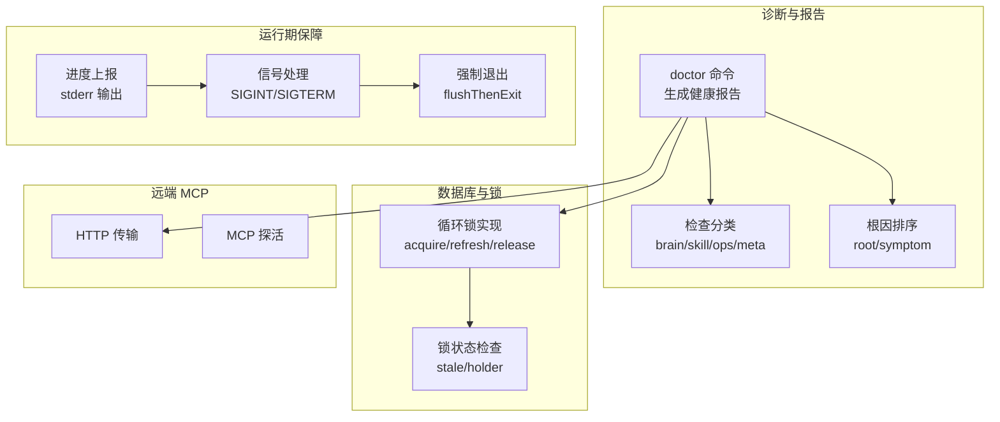

图示来源
- [src/commands/doctor.ts](file://src/commands/doctor.ts)
- [src/core/doctor-categories.ts](file://src/core/doctor-categories.ts)
- [src/core/doctor-cause-rank.ts](file://src/core/doctor-cause-rank.ts)
- [src/core/progress.ts](file://src/core/progress.ts)
- [src/core/cli-force-exit.ts](file://src/core/cli-force-exit.ts)
- [src/core/db-lock.ts](file://src/core/db-lock.ts)
- [src/mcp/http-transport.ts](file://src/mcp/http-transport.ts)
- [src/core/remote-mcp-probe.ts](file://src/core/remote-mcp-probe.ts)

章节来源
- [src/commands/doctor.ts](file://src/commands/doctor.ts)
- [src/core/doctor-categories.ts](file://src/core/doctor-categories.ts)
- [src/core/doctor-cause-rank.ts](file://src/core/doctor-cause-rank.ts)
- [src/core/progress.ts](file://src/core/progress.ts)
- [src/core/cli-force-exit.ts](file://src/core/cli-force-exit.ts)
- [src/core/db-lock.ts](file://src/core/db-lock.ts)
- [src/mcp/http-transport.ts](file://src/mcp/http-transport.ts)
- [src/core/remote-mcp-probe.ts](file://src/core/remote-mcp-probe.ts)

## 核心组件
- 结构化错误模型与序列化：统一的错误包结构、人类可读消息与机器可消费字段，支持在 CLI/JSON 场景下稳定输出。
- 检查分类与评分：按 brain/skill/ops/meta 四类计算健康分，避免噪声掩盖真实问题。
- 根因排序：fail 优先、根因优先、症状次之，结合已知因果边，帮助快速定位真实原因。
- 进度与信号：以 stderr 输出进度事件，统一处理 SIGINT/SIGTERM，避免假死与输出截断。
- 强制退出与资源回收：在 CLI 退出路径中，先尽力冲刷输出与后台工作，再断开引擎连接，必要时强制退出。
- 数据库循环锁：支持获取、续期、释放与过期扫描，doctor 可据此识别卡住的锁与潜在死锁风险。
- 远端 MCP：HTTP 传输与初始化探活，辅助诊断网络、鉴权与连通性问题。

章节来源
- [src/core/errors.ts](file://src/core/errors.ts)
- [src/core/doctor-categories.ts](file://src/core/doctor-categories.ts)
- [src/core/doctor-cause-rank.ts](file://src/core/doctor-cause-rank.ts)
- [src/core/progress.ts](file://src/core/progress.ts)
- [src/core/cli-force-exit.ts](file://src/core/cli-force-exit.ts)
- [src/core/db-lock.ts](file://src/core/db-lock.ts)
- [src/mcp/http-transport.ts](file://src/mcp/http-transport.ts)
- [src/core/remote-mcp-probe.ts](file://src/core/remote-mcp-probe.ts)

## 架构总览
下图展示一次 doctor 健康检查的关键调用链：从命令入口到各子检查，再到根因排序与报告生成；同时标注与数据库锁、MCP 探活、进度上报与强制退出相关的集成点。

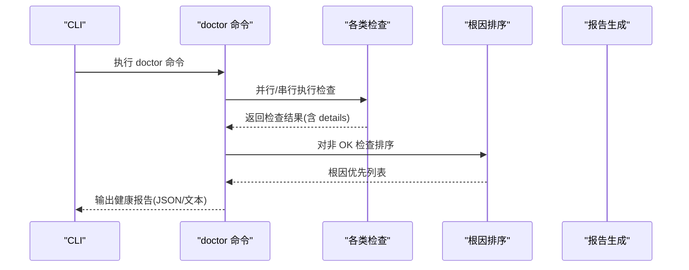

图示来源
- [src/commands/doctor.ts](file://src/commands/doctor.ts)
- [src/core/doctor-cause-rank.ts](file://src/core/doctor-cause-rank.ts)

章节来源
- [src/commands/doctor.ts](file://src/commands/doctor.ts)
- [src/core/doctor-cause-rank.ts](file://src/core/doctor-cause-rank.ts)

## 详细组件分析

### 错误建模与序列化
- 统一的结构化错误包包含 class、code、message、hint、docs_url 字段，便于机器解析与人类理解。
- StructuredAgentError 作为承载错误包的异常类型，CLI/JSON 场景下通过序列化输出标准化错误。
- 未知异常降级为通用错误包，保证输出一致性。

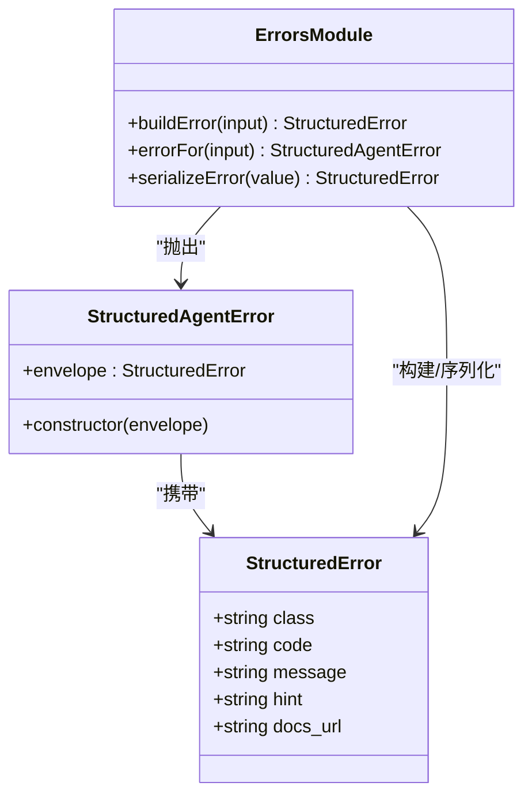

图示来源
- [src/core/errors.ts](file://src/core/errors.ts)

章节来源
- [src/core/errors.ts](file://src/core/errors.ts)

### 检查分类与评分
- 分类体系：brain（数据健康）、skill（路由与技能）、ops（基础设施）、meta（元信息与迁移）。
- 评分维度：整体健康分、脑数据健康分、按类别细分的得分，便于聚焦真实问题。
- 新增检查必须归属某一类别，否则默认进入 meta 并发出一次性警告。

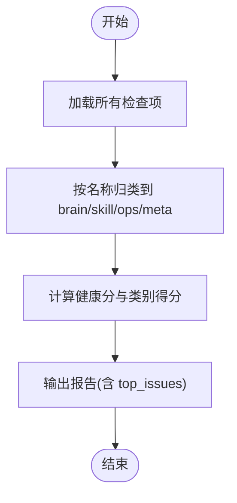

图示来源
- [src/core/doctor-categories.ts](file://src/core/doctor-categories.ts)
- [src/commands/doctor.ts](file://src/commands/doctor.ts)

章节来源
- [src/core/doctor-categories.ts](file://src/core/doctor-categories.ts)
- [src/commands/doctor.ts](file://src/commands/doctor.ts)

### 根因排序与因果边
- 根因与症状分层：ROOT_CAUSE_CHECKS 与 SYMPTOM_CHECK_NAMES 定义排序优先级。
- 已知因果边：如 queue_health → worker_oom_loop、supervisor → worker_oom_loop，仅当根因也失败时才标注下游关系。
- 严格避免从共现推导因果，仅基于已知边标注。

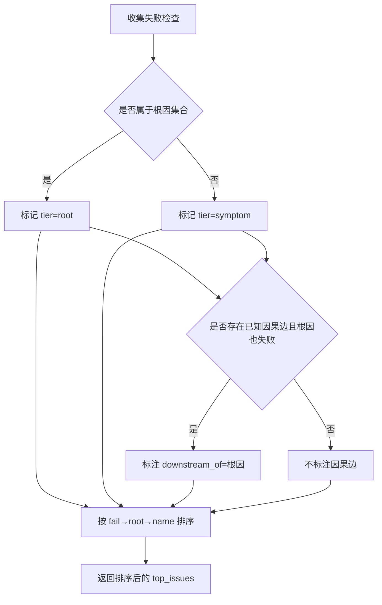

图示来源
- [src/core/doctor-cause-rank.ts](file://src/core/doctor-cause-rank.ts)

章节来源
- [src/core/doctor-cause-rank.ts](file://src/core/doctor-cause-rank.ts)

### 进度上报与信号处理
- 多模式输出：自动检测 TTY、人类可读、JSON 行、静默。
- 统一信号处理：安装一次进程级 SIGINT/SIGTERM 处理器，向所有活跃阶段广播 abort 事件。
- 与前缀系统协同：在并行同步场景下，进度行与日志行保持一致的源前缀，便于交叉定位。

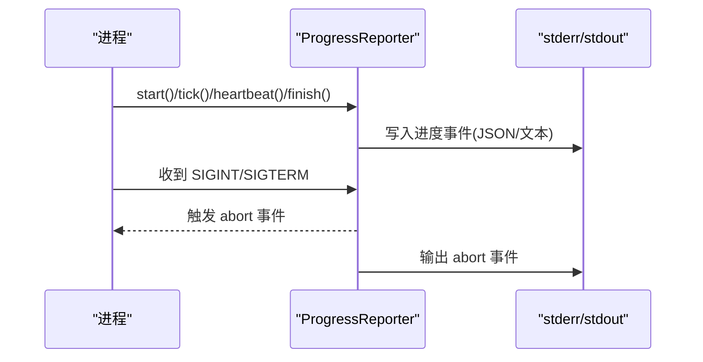

图示来源
- [src/core/progress.ts](file://src/core/progress.ts)
- [src/core/console-prefix.ts](file://src/core/console-prefix.ts)

章节来源
- [src/core/progress.ts](file://src/core/progress.ts)
- [src/core/console-prefix.ts](file://src/core/console-prefix.ts)

### 强制退出与资源回收
- 计算退出截止时间：基于后台工作水槽数量、每水槽冲刷预算、池端约束与松弛量。
- 两阶段退出：先冲刷输出与后台工作，再断开引擎连接；若超时则强制退出，保留操作退出码。
- 非 TTY 场景的输出保全：短暂保活以让 Bun 的管道写队列有机会交付。

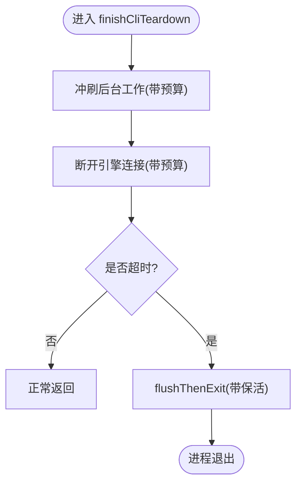

图示来源
- [src/core/cli-force-exit.ts](file://src/core/cli-force-exit.ts)

章节来源
- [src/core/cli-force-exit.ts](file://src/core/cli-force-exit.ts)

### 数据库循环锁与 doctor 检查
- 获取/续期/释放：支持基于 TTL 的抢占式获取与心跳续期，防止长时间占用。
- 过期扫描：列出 TTL 已过期的锁，辅助诊断“幽灵锁”或异常退出导致的遗留锁。
- doctor 检查：通过 listStaleLocks 与 inspectLock 提供可视化与修复建议。

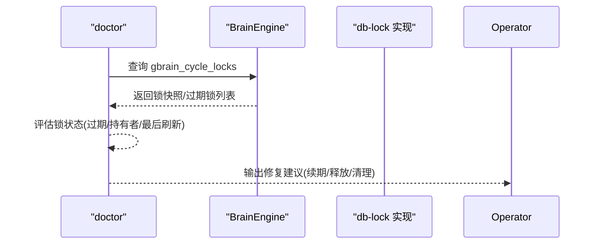

图示来源
- [src/core/db-lock.ts](file://src/core/db-lock.ts)
- [src/commands/doctor.ts](file://src/commands/doctor.ts)

章节来源
- [src/core/db-lock.ts](file://src/core/db-lock.ts)
- [src/commands/doctor.ts](file://src/commands/doctor.ts)
- [test/sync-break-lock-all.test.ts](file://test/sync-break-lock-all.test.ts)

### 远端 MCP 传输与探活
- HTTP 传输：启动本地 HTTP 服务，承载 MCP 请求，支持访问令牌校验与 last_used_at 去抖更新。
- 初始化探活：发送 initialize 请求，区分 401/403（鉴权失败）、非 2xx（HTTP 异常）与网络错误，快速判断远端可达性与认证状态。

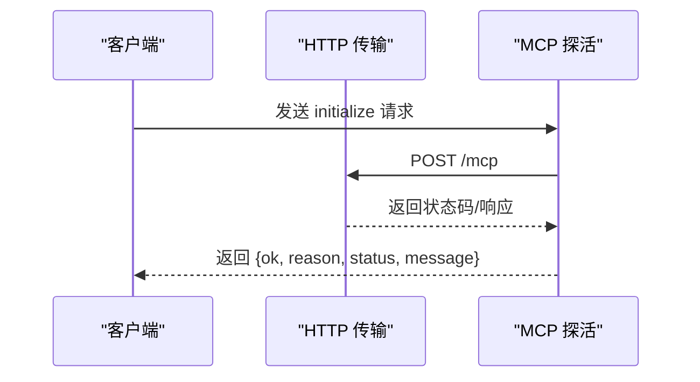

图示来源
- [src/mcp/http-transport.ts](file://src/mcp/http-transport.ts)
- [src/core/remote-mcp-probe.ts](file://src/core/remote-mcp-probe.ts)

章节来源
- [src/mcp/http-transport.ts](file://src/mcp/http-transport.ts)
- [src/core/remote-mcp-probe.ts](file://src/core/remote-mcp-probe.ts)

### 评估捕获与二次失败回退
- 评估候选捕获：异步写入日志，失败时进行失败分类并记录失败计数。
- 二次失败回退：当持久化失败时，输出到标准错误，确保问题可见但不影响主流程。

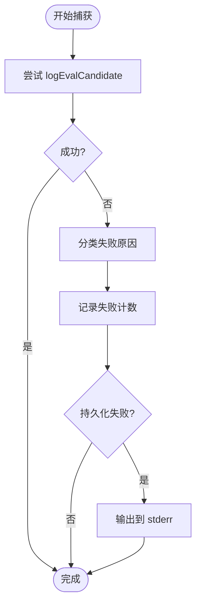

图示来源
- [src/core/eval-capture.ts](file://src/core/eval-capture.ts)

章节来源
- [src/core/eval-capture.ts](file://src/core/eval-capture.ts)

### 自动改进与失败提升
- 失败计数与改善记录：在本地维护每个操作的调用次数与改善记录，支持上限轮换与历史追踪。
- 适用于诊断与复盘：通过统计趋势识别反复失败的操作，辅助制定修复计划。

章节来源
- [src/core/fail-improve.ts](file://src/core/fail-improve.ts)

## 依赖关系分析
- doctor 命令依赖检查分类与根因排序模块，以生成结构化报告与 top_issues。
- 进度模块与信号处理模块被多个长任务使用，确保可观测与可控退出。
- 强制退出模块在 CLI 退出路径中被集中调用，避免资源泄漏。
- 数据库锁实现与 doctor 的锁检查相互配合，形成闭环诊断与修复建议。
- MCP 传输与探活模块为远端可达性诊断提供基础能力。

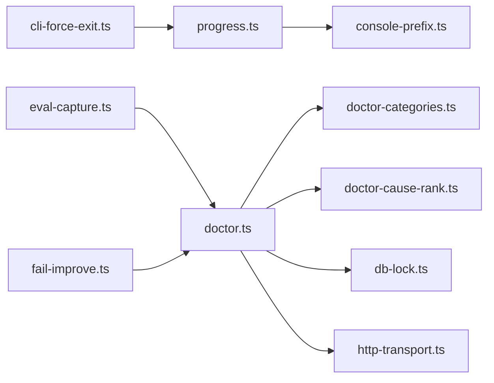

图示来源
- [src/commands/doctor.ts](file://src/commands/doctor.ts)
- [src/core/doctor-categories.ts](file://src/core/doctor-categories.ts)
- [src/core/doctor-cause-rank.ts](file://src/core/doctor-cause-rank.ts)
- [src/core/db-lock.ts](file://src/core/db-lock.ts)
- [src/mcp/http-transport.ts](file://src/mcp/http-transport.ts)
- [src/core/progress.ts](file://src/core/progress.ts)
- [src/core/console-prefix.ts](file://src/core/console-prefix.ts)
- [src/core/cli-force-exit.ts](file://src/core/cli-force-exit.ts)
- [src/core/eval-capture.ts](file://src/core/eval-capture.ts)
- [src/core/fail-improve.ts](file://src/core/fail-improve.ts)

章节来源
- [src/commands/doctor.ts](file://src/commands/doctor.ts)
- [src/core/doctor-categories.ts](file://src/core/doctor-categories.ts)
- [src/core/doctor-cause-rank.ts](file://src/core/doctor-cause-rank.ts)
- [src/core/db-lock.ts](file://src/core/db-lock.ts)
- [src/mcp/http-transport.ts](file://src/mcp/http-transport.ts)
- [src/core/progress.ts](file://src/core/progress.ts)
- [src/core/console-prefix.ts](file://src/core/console-prefix.ts)
- [src/core/cli-force-exit.ts](file://src/core/cli-force-exit.ts)
- [src/core/eval-capture.ts](file://src/core/eval-capture.ts)
- [src/core/fail-improve.ts](file://src/core/fail-improve.ts)

## 性能考量
- 峰值内存（RSS）测量：通过 Linux proc 与降级方案测量 RSS，生成基线文件，支持跨环境对比。
- 同步超时救援：模拟多源级联恢复场景，限定超时与波次，输出收敛状态与失败详情，便于定位阻塞点。
- 嵌入查询预算：对嵌入传输挂起场景设置最小预算与截止时间，避免无限等待。

章节来源
- [tests/heavy/_measure_rss_workload.ts](file://tests/heavy/_measure_rss_workload.ts)
- [tests/heavy/rss-baseline.json](file://tests/heavy/rss-baseline.json)
- [tests/heavy/sync_timeout_rescue.sh](file://tests/heavy/sync_timeout_rescue.sh)
- [tests/heavy/_sync_timeout_rescue_workload.ts](file://tests/heavy/_sync_timeout_rescue_workload.ts)
- [test/query-embed-deadline.test.ts](file://test/query-embed-deadline.test.ts)

## 故障排除指南

### 一、连接问题
- 远端 MCP 连接
  - 使用初始化探活接口区分鉴权失败（401/403）、HTTP 异常与网络错误，快速定位问题来源。
  - 若探活失败，检查令牌配置、网络连通性与远端服务可用性。
- HTTP 传输
  - 通过本地 HTTP 传输验证访问令牌去抖逻辑与 last_used_at 更新行为，确认远端可达性与认证链路。

章节来源
- [src/core/remote-mcp-probe.ts](file://src/core/remote-mcp-probe.ts)
- [src/mcp/http-transport.ts](file://src/mcp/http-transport.ts)

### 二、数据库锁冲突
- 症状识别
  - doctor 报告中出现 stale_locks 或 queue_health/wedged_queue 等症状检查告警。
  - 通过 listStaleLocks 与 inspectLock 获取过期锁与持有者信息。
- 诊断步骤
  - 检查 gbrain_cycle_locks 表中过期锁与最近刷新时间，确认是否存在长时间未续期的锁。
  - 核对持有者 PID/主机与 TTL 到期时间，判断是否为异常退出导致的遗留锁。
- 解决方案
  - 在安全窗口内释放过期锁或重启持有者进程。
  - 优化锁续期频率与租期 TTL，避免频繁争用与过期。
  - 对于 PGLite 环境，关注锁表清理与事务隔离级别。

章节来源
- [src/core/db-lock.ts](file://src/core/db-lock.ts)
- [src/commands/doctor.ts](file://src/commands/doctor.ts)
- [test/sync-break-lock-all.test.ts](file://test/sync-break-lock-all.test.ts)

### 三、内存泄漏与性能退化
- 峰值内存（RSS）监控
  - 使用 _measure_rss_workload 与 rss-baseline.json 建立基线，对比不同环境与版本的内存占用。
  - 关注长时间运行任务的内存增长曲线，定位泄漏点。
- 同步超时救援
  - 使用 sync_timeout_rescue 脚本与工作负载，模拟多源同步阻塞，输出收敛状态与失败详情，辅助定位瓶颈。
- 嵌入查询预算
  - 通过 query-embed-deadline 测试验证最小预算与截止时间，避免嵌入传输挂起导致的资源占用。

章节来源
- [tests/heavy/_measure_rss_workload.ts](file://tests/heavy/_measure_rss_workload.ts)
- [tests/heavy/rss-baseline.json](file://tests/heavy/rss-baseline.json)
- [tests/heavy/sync_timeout_rescue.sh](file://tests/heavy/sync_timeout_rescue.sh)
- [tests/heavy/_sync_timeout_rescue_workload.ts](file://tests/heavy/_sync_timeout_rescue_workload.ts)
- [test/query-embed-deadline.test.ts](file://test/query-embed-deadline.test.ts)

### 四、错误分类、异常处理与调试技巧
- 错误分类
  - 使用 doctor-categories 将检查项归类至 brain/skill/ops/meta，避免噪声掩盖真实问题。
  - 通过 doctor-cause-rank 将根因置于症状之前，减少干扰。
- 异常处理
  - 使用 StructuredAgentError 与 serializeError 输出结构化错误，便于 CLI/JSON 场景解析。
  - 对于评估捕获失败，采用二次失败回退到 stderr，确保问题可见。
- 调试技巧
  - 使用 withSourcePrefix 为并行同步输出添加源前缀，便于交叉定位。
  - 使用 progress 模块的 JSON 模式输出事件流，结合 abort 事件定位中断点。

章节来源
- [src/core/doctor-categories.ts](file://src/core/doctor-categories.ts)
- [src/core/doctor-cause-rank.ts](file://src/core/doctor-cause-rank.ts)
- [src/core/errors.ts](file://src/core/errors.ts)
- [src/core/eval-capture.ts](file://src/core/eval-capture.ts)
- [src/core/console-prefix.ts](file://src/core/console-prefix.ts)
- [src/core/progress.ts](file://src/core/progress.ts)

### 五、日志分析与堆栈解读
- 日志来源
  - doctor 报告中的 message 与 details 字段包含修复提示与结构化数据。
  - progress 的 JSON 事件流包含阶段、进度、耗时与 ETA，便于定位慢点。
  - MCP 探活返回的 reason/status/message 明确网络/认证/HTTP 类型。
- 堆栈解读
  - 对于未知异常，序列化为通用错误包，关注 message 与 docs_url 字段获取指引。
  - 对于 MCP 错误，依据 reason（network/auth/http/tool_error/parse 等）快速定位。

章节来源
- [src/commands/doctor.ts](file://src/commands/doctor.ts)
- [src/core/progress.ts](file://src/core/progress.ts)
- [src/core/remote-mcp-probe.ts](file://src/core/remote-mcp-probe.ts)
- [src/core/errors.ts](file://src/core/errors.ts)

### 六、问题定位策略
- 优先级策略
  - fail → root → name 的排序，优先处理根因而非症状。
  - 对于 worker_oom_loop、pool_reap_health、connection、sync_freshness、schema_version 等根因检查，应立即处理。
- 诊断矩阵
  - 连接问题：MCP 探活 + HTTP 传输 + 访问令牌去抖验证。
  - 锁冲突：doctor 锁检查 + 过期锁扫描 + 续期/释放。
  - 性能退化：RSS 基线对比 + 同步超时救援 + 嵌入预算测试。
  - 异常输出：StructuredAgentError 序列化 + 评估捕获二次回退。

章节来源
- [src/core/doctor-cause-rank.ts](file://src/core/doctor-cause-rank.ts)
- [src/core/remote-mcp-probe.ts](file://src/core/remote-mcp-probe.ts)
- [src/mcp/http-transport.ts](file://src/mcp/http-transport.ts)
- [src/core/db-lock.ts](file://src/core/db-lock.ts)
- [tests/heavy/_measure_rss_workload.ts](file://tests/heavy/_measure_rss_workload.ts)
- [tests/heavy/sync_timeout_rescue.sh](file://tests/heavy/sync_timeout_rescue.sh)
- [test/query-embed-deadline.test.ts](file://test/query-embed-deadline.test.ts)
- [src/core/errors.ts](file://src/core/errors.ts)
- [src/core/eval-capture.ts](file://src/core/eval-capture.ts)

### 七、紧急修复流程
- 立即行动
  - 若 doctor 报告显示根因检查失败，优先修复；对于锁冲突，释放过期锁或重启持有者。
  - 对于 MCP 连接问题，检查令牌与网络；对于性能退化，缩短租期/预算或降低并发。
- 临时缓解
  - 通过 doctor 的 remediation 建议提交修复作业（如嵌入重做、提取补全），避免重复手工操作。
  - 使用环境变量调整超时与截止时间，确保 CLI 正常退出。
- 长期治理
  - 建立 doctor-auto-heal 机制，自动提交可修复的警告（需安全门控）。
  - 维护 doctor 历史记录与趋势，持续观察健康分变化。

章节来源
- [src/commands/doctor.ts](file://src/commands/doctor.ts)
- [docs/issues/doctor-auto-heal-and-scoring.md](file://docs/issues/doctor-auto-heal-and-scoring.md)
- [src/core/cli-force-exit.ts](file://src/core/cli-force-exit.ts)

## 结论
本指南提供了 GBrain 故障排除的系统化方法：以 doctor 为核心，结合检查分类、根因排序、结构化错误输出与强制退出保障，覆盖连接、锁冲突、内存与性能等关键问题。通过日志分析、堆栈解读与定位策略，配合紧急修复与长期治理，可显著提升系统的稳定性与可维护性。

## 附录
- 术语
  - 根因：通常可直接修复的问题（如连接、锁、预算）。
  - 症状：由根因引发的连锁反应（如队列停滞、OOM、锁过期）。
  - 修复建议：doctor 通过 details.fix_hint 或 message 提供的可执行建议。
- 参考
  - doctor 自动修复与评分改进文档，涵盖严重级别、时间矛盾识别、基线与自动修复等。

章节来源
- [docs/issues/doctor-auto-heal-and-scoring.md](file://docs/issues/doctor-auto-heal-and-scoring.md)