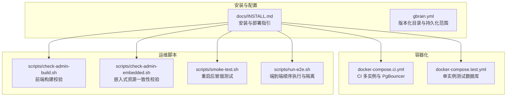
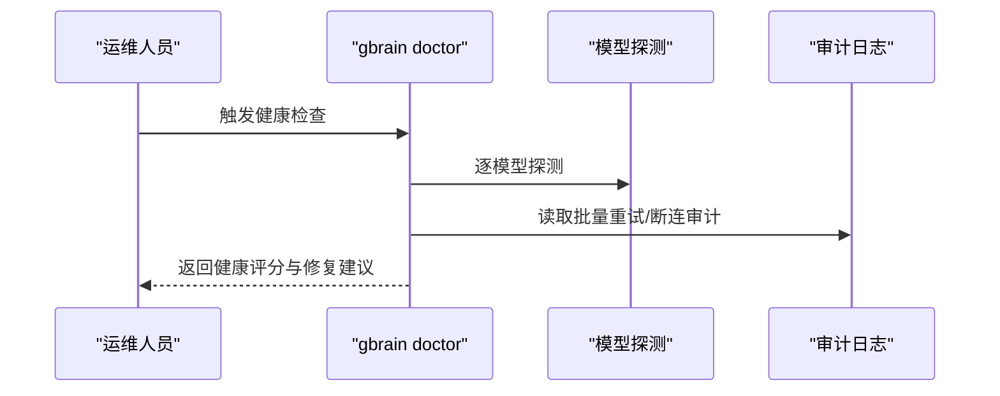
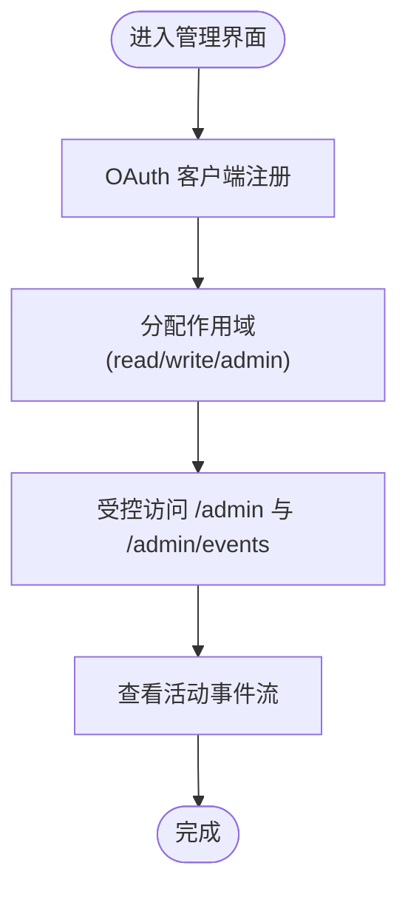
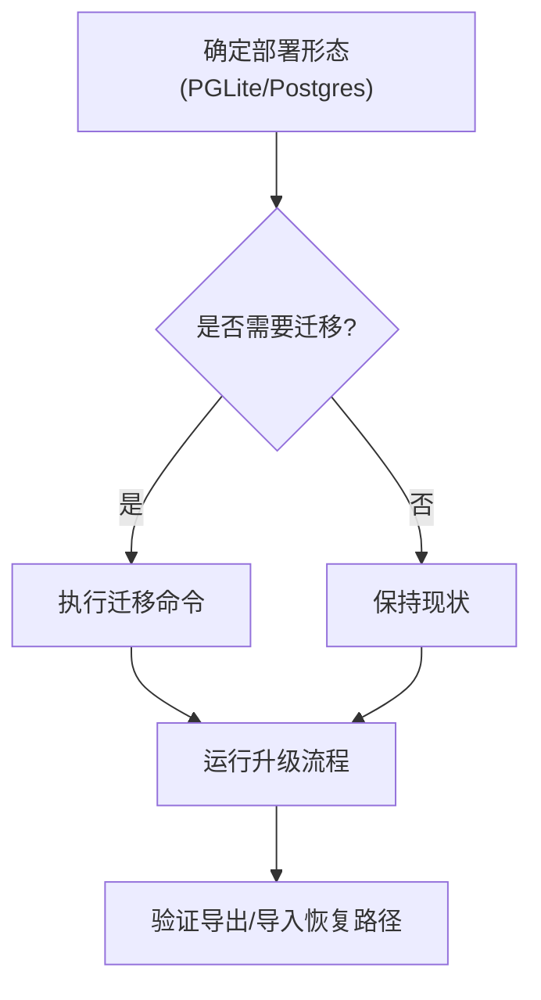
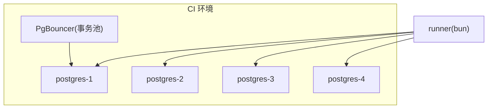
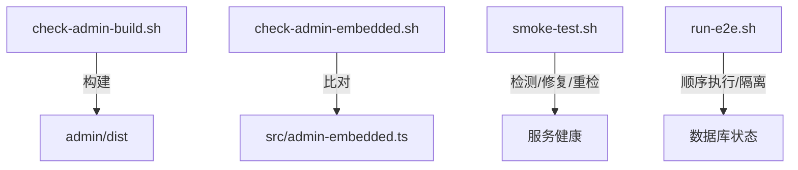
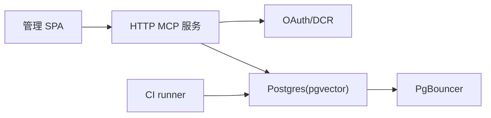
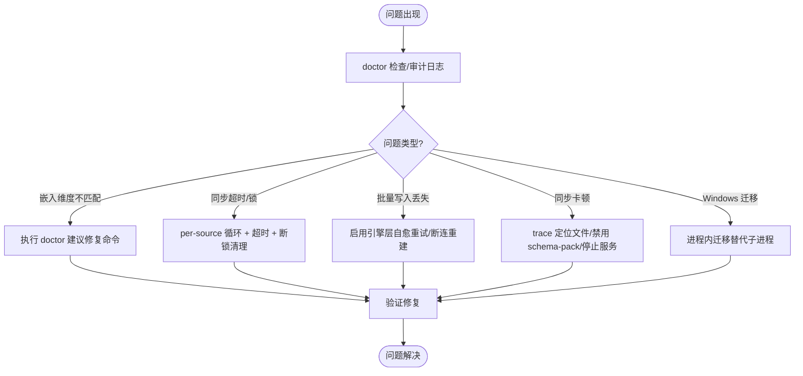

# 管理与运维

<cite>
**本文引用的文件**
- [README.md](file://README.md)
- [docs/INSTALL.md](file://docs/INSTALL.md)
- [gbrain.yml](file://gbrain.yml)
- [docker-compose.ci.yml](file://docker-compose.ci.yml)
- [docker-compose.test.yml](file://docker-compose.test.yml)
- [scripts/check-admin-build.sh](file://scripts/check-admin-build.sh)
- [scripts/check-admin-embedded.sh](file://scripts/check-admin-embedded.sh)
- [scripts/smoke-test.sh](file://scripts/smoke-test.sh)
- [scripts/run-e2e.sh](file://scripts/run-e2e.sh)
</cite>

## 目录
1. [简介](#简介)
2. [项目结构](#项目结构)
3. [核心组件](#核心组件)
4. [架构总览](#架构总览)
5. [详细组件分析](#详细组件分析)
6. [依赖关系分析](#依赖关系分析)
7. [性能考量](#性能考量)
8. [故障排除指南](#故障排除指南)
9. [结论](#结论)
10. [附录](#附录)

## 简介
本指南面向运维与平台工程团队，围绕 GBrain 的管理与运维实践，系统阐述系统监控、性能调优、故障排除、管理界面与操作流程、健康检查与诊断工具、审计日志、备份与恢复、数据迁移与升级策略、部署配置与环境管理、容器化方案、性能基准与容量规划、成本优化、日志分析与根因分析方法，以及运维自动化脚本与监控仪表板配置建议。内容基于仓库中的安装文档、运维脚本与配置样例进行归纳总结，并辅以可视化图示帮助快速定位与解决问题。

## 项目结构
- 安装与运维相关的关键位置：
  - 文档：docs/INSTALL.md 提供安装路径、验证步骤与部署要点
  - 配置：gbrain.yml 描述版本化目录与仅数据库持久化的目录划分
  - 容器编排：docker-compose.ci.yml 与 docker-compose.test.yml 提供本地 CI 与测试数据库拓扑
  - 运维脚本：scripts/ 下包含构建校验、嵌入式资源一致性校验、冒烟测试与端到端运行脚本
- 管理界面与服务：
  - HTTP MCP 服务器内置管理 SPA 与活动事件流，支持 OAuth 注册、作用域访问与速率限制（见安装文档）



**图表来源**
- [docs/INSTALL.md:1-114](file://docs/INSTALL.md#L1-L114)
- [gbrain.yml:1-19](file://gbrain.yml#L1-L19)
- [docker-compose.ci.yml:1-154](file://docker-compose.ci.yml#L1-L154)
- [docker-compose.test.yml:1-15](file://docker-compose.test.yml#L1-L15)
- [scripts/check-admin-build.sh:1-36](file://scripts/check-admin-build.sh#L1-L36)
- [scripts/check-admin-embedded.sh:1-36](file://scripts/check-admin-embedded.sh#L1-L36)
- [scripts/smoke-test.sh:1-205](file://scripts/smoke-test.sh#L1-L205)
- [scripts/run-e2e.sh:1-244](file://scripts/run-e2e.sh#L1-L244)

**章节来源**
- [docs/INSTALL.md:1-114](file://docs/INSTALL.md#L1-L114)
- [gbrain.yml:1-19](file://gbrain.yml#L1-L19)
- [docker-compose.ci.yml:1-154](file://docker-compose.ci.yml#L1-L154)
- [docker-compose.test.yml:1-15](file://docker-compose.test.yml#L1-L15)
- [scripts/check-admin-build.sh:1-36](file://scripts/check-admin-build.sh#L1-L36)
- [scripts/check-admin-embedded.sh:1-36](file://scripts/check-admin-embedded.sh#L1-L36)
- [scripts/smoke-test.sh:1-205](file://scripts/smoke-test.sh#L1-L205)
- [scripts/run-e2e.sh:1-244](file://scripts/run-e2e.sh#L1-L244)

## 核心组件
- 健康检查与诊断
  - 使用 doctor 命令进行全量健康检查；对模型可用性进行探测
  - 对批量重试与数据库断连等健康指标提供专门检查项
- 管理界面与服务
  - HTTP MCP 服务器内置管理 SPA 与活动事件流，支持 OAuth 客户端注册、作用域访问与速率限制
- 数据与存储
  - 版本化目录与仅数据库持久化目录的划分，便于备份与恢复策略制定
- 容器化与 CI
  - CI 使用多实例 Postgres 与 PgBouncer，确保端到端测试稳定性
- 运维自动化
  - 构建校验、嵌入式资源一致性校验、冒烟测试与端到端顺序执行脚本

**章节来源**
- [README.md:290-411](file://README.md#L290-L411)
- [docs/INSTALL.md:105-114](file://docs/INSTALL.md#L105-L114)
- [gbrain.yml:1-19](file://gbrain.yml#L1-L19)
- [docker-compose.ci.yml:1-154](file://docker-compose.ci.yml#L1-L154)
- [scripts/check-admin-build.sh:1-36](file://scripts/check-admin-build.sh#L1-L36)
- [scripts/check-admin-embedded.sh:1-36](file://scripts/check-admin-embedded.sh#L1-L36)
- [scripts/smoke-test.sh:1-205](file://scripts/smoke-test.sh#L1-L205)
- [scripts/run-e2e.sh:1-244](file://scripts/run-e2e.sh#L1-L244)

## 架构总览
下图展示 GBrain 在不同部署形态下的关键组件与交互关系，包括本地 CLI、HTTP MCP 服务、管理界面、数据库与池化层，以及 CI 测试拓扑。

```mermaid
graph TB
subgraph "客户端"
U["终端用户/代理"]
AC["MCP 客户端(Claude/Cursor/Perplexity/ChatGPT)"]
end
subgraph "服务层"
S["gbrain serve<br/>stdio(HTTP) MCP"]
AD["管理 SPA(/admin)<br/>SSE 活动流"]
AU["认证/授权(OAuth 2.1)<br/>DCR 客户端注册"]
end
subgraph "数据层"
PG["Postgres(pgvector)"]
PB["PgBouncer(事务池)"]
end
U --> AC
AC --> S
S --> AD
S --> AU
S --> PG
PG <- --> PB
```

**图表来源**
- [docs/INSTALL.md:66-94](file://docs/INSTALL.md#L66-L94)
- [docker-compose.ci.yml:88-121](file://docker-compose.ci.yml#L88-L121)

**章节来源**
- [docs/INSTALL.md:66-94](file://docs/INSTALL.md#L66-L94)
- [docker-compose.ci.yml:88-121](file://docker-compose.ci.yml#L88-L121)

## 详细组件分析

### 健康检查与诊断工具
- 全量健康检查
  - doctor 命令输出健康评分与检查项详情，用于日常巡检与问题定位
  - 模型可用性探测：逐个模型进行一次令牌请求，快速发现模型配置或配额异常
- 批量写入与连接健康
  - 批量重试健康检查：监测最近 24 小时的批量重试事件与断连次数，辅助定位数据库池波动与连接抖动
- 常见问题自愈与修复提示
  - doctor 输出会给出修复命令提示，如修复向量维度不匹配、强制升级 schema 等



**图表来源**
- [docs/INSTALL.md:105-114](file://docs/INSTALL.md#L105-L114)
- [README.md:290-354](file://README.md#L290-L354)

**章节来源**
- [docs/INSTALL.md:105-114](file://docs/INSTALL.md#L105-L114)
- [README.md:290-354](file://README.md#L290-L354)

### 管理界面与操作流程
- 管理 SPA 与活动事件流
  - 内置于 HTTP MCP 服务，提供管理员操作入口与实时事件订阅
- OAuth 与作用域
  - 支持 DCR 风格客户端注册，按 read/write/admin 作用域控制访问
  - 速率限制与安全默认值可参考安全文档
- 连接与集成
  - 支持多种 MCP 客户端接入，远程部署需提供 bearer token 或 OAuth



**图表来源**
- [docs/INSTALL.md:84-94](file://docs/INSTALL.md#L84-L94)

**章节来源**
- [docs/INSTALL.md:84-94](file://docs/INSTALL.md#L84-L94)

### 备份与恢复、数据迁移与升级策略
- 目录划分与恢复策略
  - 版本化目录（人类编辑）与仅数据库持久化目录（机器生成）明确备份范围
  - 仅数据库持久化目录可通过导出/导入进行恢复
- 升级与迁移
  - 支持在 PGLite 与 Postgres 之间迁移
  - 升级流程包含 schema 迁移与后续提示，建议在 TTY 环境执行以获得完整交互
- 重要提示
  - headless 环境（CI/Docker）中初始化失败时，init 会输出可直接粘贴的设置提示



**图表来源**
- [docs/INSTALL.md:33-56](file://docs/INSTALL.md#L33-L56)
- [gbrain.yml:1-19](file://gbrain.yml#L1-L19)

**章节来源**
- [docs/INSTALL.md:33-56](file://docs/INSTALL.md#L33-L56)
- [gbrain.yml:1-19](file://gbrain.yml#L1-L19)

### 部署配置与环境管理
- 环境变量与配置
  - API 密钥通过文件平面或环境变量注入，常见包括各类大模型提供商密钥
  - 配置项可通过 CLI 设置与查询
- 安装路径选择
  - 推荐通过代理平台安装，或独立 CLI 安装；HTTP MCP 适合团队共享部署
- thin-client 模式
  - 仅配置远程 MCP，跳过本地数据库，适用于团队挂载或无磁盘空间场景

**章节来源**
- [docs/INSTALL.md:42-56](file://docs/INSTALL.md#L42-L56)
- [docs/INSTALL.md:95-104](file://docs/INSTALL.md#L95-L104)

### 容器化方案
- CI 多实例与 PgBouncer
  - 使用 4 个 Postgres 实例与 PgBouncer 事务池模式，避免端到端测试中的数据库竞态
  - CI 脚本负责拉取镜像、健康检查与命名卷隔离
- 测试数据库
  - 单实例 Postgres 用于测试，端口映射与健康检查配置清晰



**图表来源**
- [docker-compose.ci.yml:23-121](file://docker-compose.ci.yml#L23-L121)

**章节来源**
- [docker-compose.ci.yml:1-154](file://docker-compose.ci.yml#L1-L154)
- [docker-compose.test.yml:1-15](file://docker-compose.test.yml#L1-L15)

### 运维自动化脚本
- 前端构建校验
  - 在 admin/ 目录执行构建，确保类型检查与打包通过，防止缺失符号导致的运行期问题
- 嵌入式资源一致性校验
  - 生成 src/admin-embedded.ts 并与已提交版本对比，防止发布包遗漏更新
- 冒烟测试
  - 自动检测 Bun 运行时、GBrain CLI、数据库、工作进程、OpenClaw 插件等健康状态，必要时自动修复并重检
- 端到端顺序执行
  - 为避免跨文件数据库竞态，采用顺序执行策略；同时进行 HOME 隔离与环境净化，确保测试可重复



**图表来源**
- [scripts/check-admin-build.sh:1-36](file://scripts/check-admin-build.sh#L1-L36)
- [scripts/check-admin-embedded.sh:1-36](file://scripts/check-admin-embedded.sh#L1-L36)
- [scripts/smoke-test.sh:1-205](file://scripts/smoke-test.sh#L1-L205)
- [scripts/run-e2e.sh:1-244](file://scripts/run-e2e.sh#L1-L244)

**章节来源**
- [scripts/check-admin-build.sh:1-36](file://scripts/check-admin-build.sh#L1-L36)
- [scripts/check-admin-embedded.sh:1-36](file://scripts/check-admin-embedded.sh#L1-L36)
- [scripts/smoke-test.sh:1-205](file://scripts/smoke-test.sh#L1-L205)
- [scripts/run-e2e.sh:1-244](file://scripts/run-e2e.sh#L1-L244)

## 依赖关系分析
- 组件耦合
  - 管理 SPA 与 HTTP MCP 服务紧密耦合，认证与速率限制贯穿服务层
  - 数据层依赖池化中间件（PgBouncer），CI 场景下通过多实例隔离降低竞态风险
- 外部依赖
  - 大模型提供商密钥、Postgres/pgvector、Bun 运行时、MCP 客户端生态
- 可能的循环依赖
  - 脚本间通过相对路径调用，未见直接循环；建议在扩展新脚本时保持单向依赖



**图表来源**
- [docs/INSTALL.md:84-94](file://docs/INSTALL.md#L84-L94)
- [docker-compose.ci.yml:88-121](file://docker-compose.ci.yml#L88-L121)

**章节来源**
- [docs/INSTALL.md:84-94](file://docs/INSTALL.md#L84-L94)
- [docker-compose.ci.yml:88-121](file://docker-compose.ci.yml#L88-L121)

## 性能考量
- 搜索与检索
  - 向量检索 + 关键词检索 + RRF 融合 + 来源层级增强 + 意图重写；支持三种搜索模式（保守/平衡/令牌最大化）
  - 可通过 explain 与统计信息观察各阶段命中与失败分布，指导参数与阈值调优
- 图谱与链接
  - 每次页面写入触发自动链接，保持图谱新鲜度；大规模同步时注意与服务并发冲突
- 批量写入与连接稳定性
  - 引擎层具备批量写入自愈与重试机制，针对数据库池波动与瞬断进行补偿
- CI 与测试
  - 多实例 + PgBouncer 降低竞态；端到端顺序执行减少跨文件干扰

**章节来源**
- [README.md:253-289](file://README.md#L253-L289)
- [README.md:317-354](file://README.md#L317-L354)
- [docker-compose.ci.yml:88-121](file://docker-compose.ci.yml#L88-L121)
- [scripts/run-e2e.sh:1-244](file://scripts/run-e2e.sh#L1-L244)

## 故障排除指南
- 初始化与嵌入维度不匹配
  - 使用 doctor 输出的修复命令进行修复；headless 环境中 init 会输出可直接粘贴的设置提示
- 同步超时与锁竞争
  - 采用 per-source 循环 + 超时控制，结合断锁清理与最大年龄参数，实现“部分成功”与幂等重试
- 批量写入丢失与断连
  - 引擎层自愈重试与连接重建回调，配合审计日志定位断连来源
- 大脑同步卡顿与正则回溯
  - 通过 trace 定位卡住文件；禁用 schema-pack 快速定位正则问题；PGLite 场景先停止服务再执行同步
- Windows 迁移与 DNS 解析
  - 采用进程内迁移替代子进程，解决 spawn 子进程在特定环境下的 DNS 解析失败
- 评估与回归
  - 使用评估框架导出/回放真实查询，确保变更质量；交叉模态一致性检查



**图表来源**
- [README.md:290-411](file://README.md#L290-L411)

**章节来源**
- [README.md:290-411](file://README.md#L290-L411)

## 结论
本指南基于仓库现有文档与脚本，给出了 GBrain 在健康检查、管理界面、备份恢复、数据迁移、升级策略、部署配置、容器化、性能调优与故障排除方面的系统化实践建议。建议在生产环境中结合自动化脚本与监控告警，持续验证健康状态与性能基线，确保系统稳定与可维护性。

## 附录
- 常用命令与路径
  - doctor 健康检查与模型探测：[docs/INSTALL.md:105-114](file://docs/INSTALL.md#L105-L114)
  - 安装与部署路径：[docs/INSTALL.md:1-114](file://docs/INSTALL.md#L1-L114)
  - 目录划分与恢复策略：[gbrain.yml:1-19](file://gbrain.yml#L1-L19)
  - CI 多实例与 PgBouncer：[docker-compose.ci.yml:1-154](file://docker-compose.ci.yml#L1-L154)
  - 测试数据库：[docker-compose.test.yml:1-15](file://docker-compose.test.yml#L1-L15)
  - 前端构建校验：[scripts/check-admin-build.sh:1-36](file://scripts/check-admin-build.sh#L1-L36)
  - 嵌入式资源一致性校验：[scripts/check-admin-embedded.sh:1-36](file://scripts/check-admin-embedded.sh#L1-L36)
  - 冒烟测试：[scripts/smoke-test.sh:1-205](file://scripts/smoke-test.sh#L1-L205)
  - 端到端顺序执行：[scripts/run-e2e.sh:1-244](file://scripts/run-e2e.sh#L1-L244)