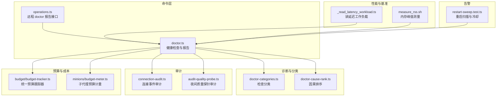
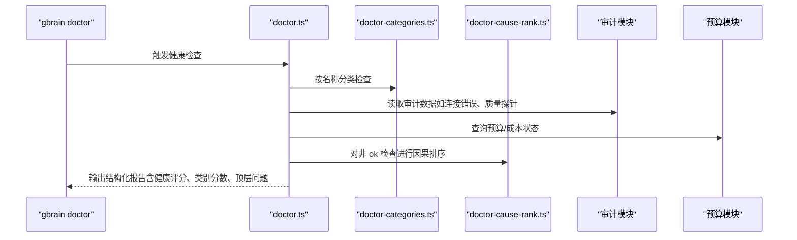
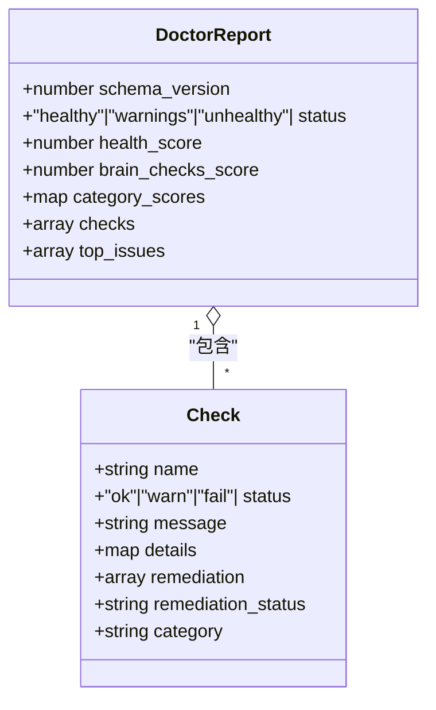
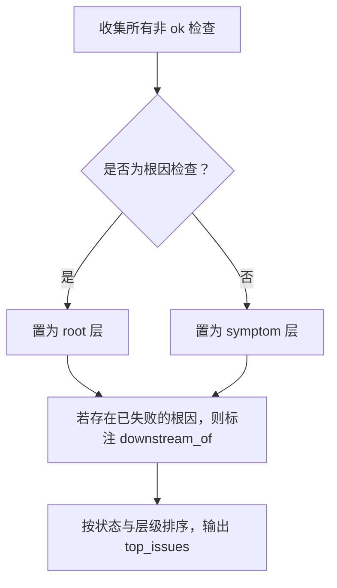
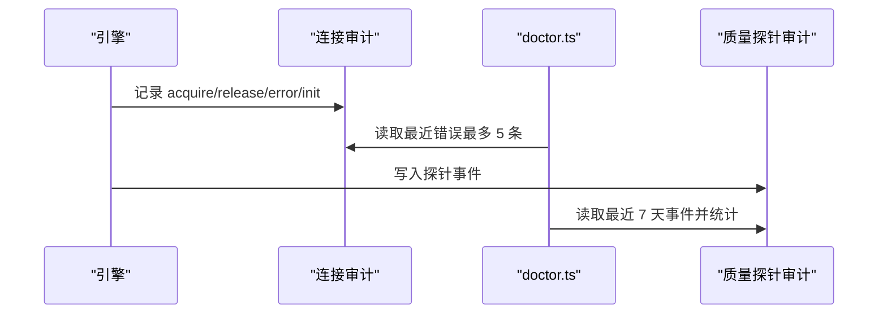
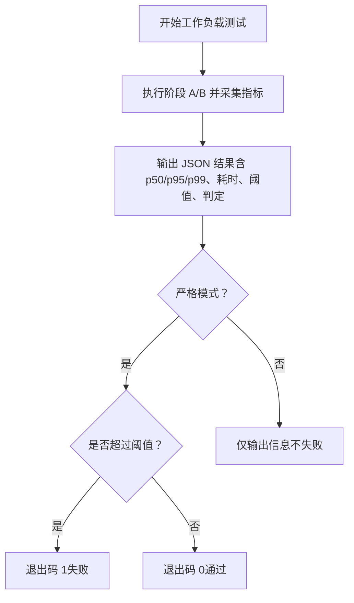
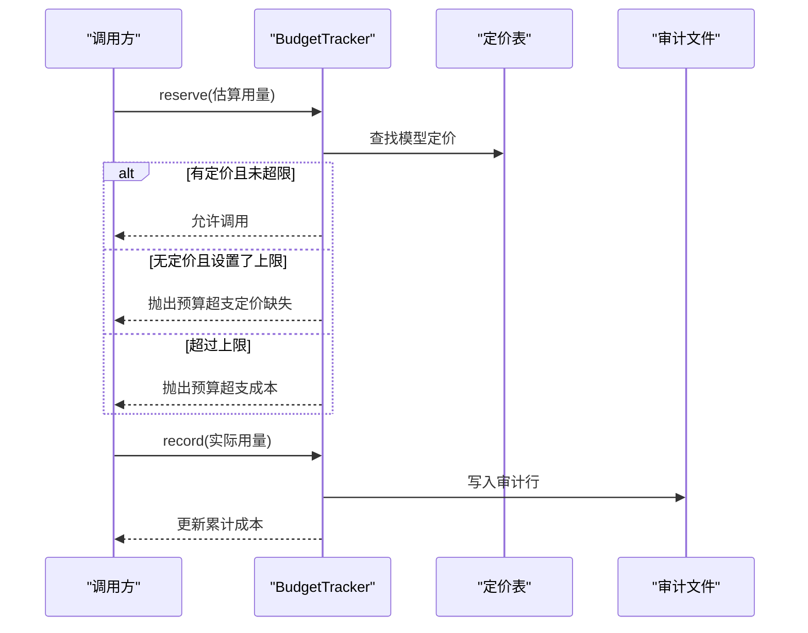
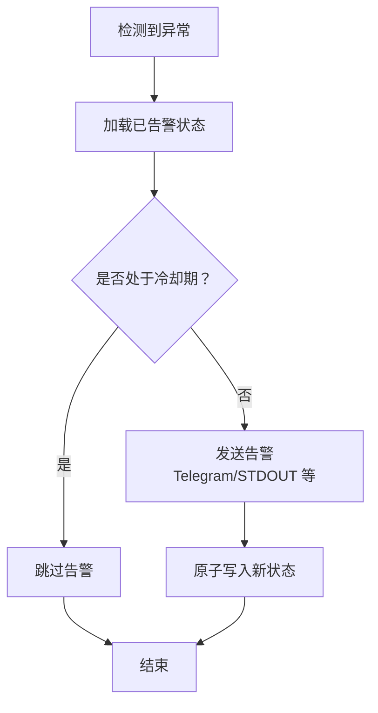
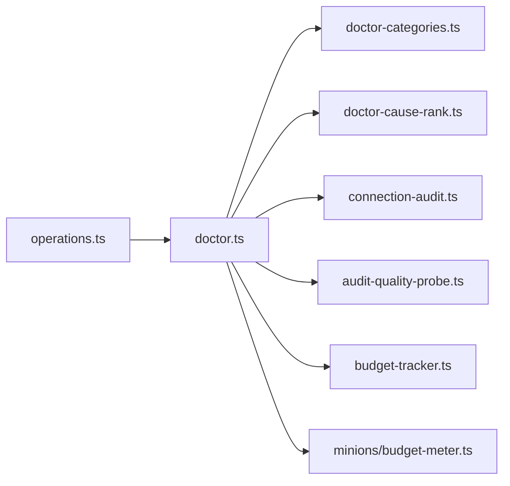

# 系统监控

<cite>
**本文引用的文件**
- [src/commands/doctor.ts](file://src/commands/doctor.ts)
- [src/core/doctor-categories.ts](file://src/core/doctor-categories.ts)
- [src/core/doctor-cause-rank.ts](file://src/core/doctor-cause-rank.ts)
- [src/core/connection-audit.ts](file://src/core/connection-audit.ts)
- [src/core/audit-quality-probe.ts](file://src/core/audit-quality-probe.ts)
- [src/core/budget/budget-tracker.ts](file://src/core/budget/budget-tracker.ts)
- [src/core/minions/budget-meter.ts](file://src/core/minions/budget-meter.ts)
- [src/core/operations.ts](file://src/core/operations.ts)
- [test/nightly-quality-probe.test.ts](file://test/nightly-quality-probe.test.ts)
- [test/whoknows-doctor.test.ts](file://test/whoknows-doctor.test.ts)
- [test/e2e/thin-client.test.ts](file://test/e2e/thin-client.test.ts)
- [test/sync-resumable-import.serial.test.ts](file://test/sync-resumable-import.serial.test.ts)
- [tests/heavy/_read_latency_workload.ts](file://tests/heavy/_read_latency_workload.ts)
- [tests/heavy/measure_rss.sh](file://tests/heavy/measure_rss.sh)
- [test/restart-sweep.test.ts](file://test/restart-sweep.test.ts)
</cite>

## 目录
1. [简介](#简介)
2. [项目结构](#项目结构)
3. [核心组件](#核心组件)
4. [架构总览](#架构总览)
5. [详细组件分析](#详细组件分析)
6. [依赖关系分析](#依赖关系分析)
7. [性能考量](#性能考量)
8. [故障排查指南](#故障排查指南)
9. [结论](#结论)
10. [附录](#附录)

## 简介
本文件面向运维与平台工程团队，系统化梳理 GBrain 的系统监控体系，重点覆盖以下方面：
- 健康检查工具 doctor 的使用方法与诊断能力
- 性能指标监控、资源使用跟踪与瓶颈识别
- 审计日志配置与分析（连接审计、锁重试审计、池恢复审计）
- 支出监控、预算跟踪与成本控制机制
- 系统状态检查、异常检测与告警配置
- 监控仪表板设置与关键指标解读

## 项目结构
围绕监控主题，相关代码主要分布在如下模块：
- 命令层：doctor 命令实现与远程报告接口
- 核心诊断：检查分类、因果排序、远程薄客户端报告
- 审计与质量：连接事件审计、夜间质量探针审计
- 预算与成本：统一预算跟踪器、子代理预算计量
- 性能与基准：延迟与内存占用测量脚本
- 告警与重启：自动重启扫描与冷却策略

图示来源
- [src/commands/doctor.ts](file://src/commands/doctor.ts)
- [src/core/doctor-categories.ts](file://src/core/doctor-categories.ts)
- [src/core/doctor-cause-rank.ts](file://src/core/doctor-cause-rank.ts)
- [src/core/connection-audit.ts](file://src/core/connection-audit.ts)
- [src/core/audit-quality-probe.ts](file://src/core/audit-quality-probe.ts)
- [src/core/budget/budget-tracker.ts](file://src/core/budget/budget-tracker.ts)
- [src/core/minions/budget-meter.ts](file://src/core/minions/budget-meter.ts)
- [src/core/operations.ts](file://src/core/operations.ts)
- [tests/heavy/_read_latency_workload.ts](file://tests/heavy/_read_latency_workload.ts)
- [tests/heavy/measure_rss.sh](file://tests/heavy/measure_rss.sh)
- [test/restart-sweep.test.ts](file://test/restart-sweep.test.ts)

章节来源
- [src/commands/doctor.ts](file://src/commands/doctor.ts)
- [src/core/operations.ts](file://src/core/operations.ts)

## 核心组件
- doctor 命令与报告
  - 负责执行全面或聚焦的健康检查，生成结构化报告，支持本地与远程薄客户端调用。
  - 提供健康评分、按类别打分、顶层问题因果排序等能力。
- 检查分类与因果排序
  - 将检查归类到 brain/skill/ops/meta 四大类，独立计算各类别健康分数；对非 ok 检查进行根因优先级排序。
- 审计与质量探针
  - 连接事件审计记录连接池获取/释放/错误等事件，doctor 可读取最近错误作为上下文。
  - 夜间质量探针审计记录跨模态探针运行结果，doctor 用于判断近一周的失败/超预算/限流等情况。
- 预算与成本控制
  - 统一预算跟踪器在网关层记录每次调用的实际用量并累计，支持按模型定价表估算成本。
  - 子代理预算计量采用“预占-结算”模式，通过数据库事务与锁确保并发安全。
- 性能与基准
  - 提供延迟与内存峰值测量脚本，输出标准化 JSON 结果，便于回归阈值设定与持续监控。

章节来源
- [src/commands/doctor.ts](file://src/commands/doctor.ts)
- [src/core/doctor-categories.ts](file://src/core/doctor-categories.ts)
- [src/core/doctor-cause-rank.ts](file://src/core/doctor-cause-rank.ts)
- [src/core/connection-audit.ts](file://src/core/connection-audit.ts)
- [src/core/audit-quality-probe.ts](file://src/core/audit-quality-probe.ts)
- [src/core/budget/budget-tracker.ts](file://src/core/budget/budget-tracker.ts)
- [src/core/minions/budget-meter.ts](file://src/core/minions/budget-meter.ts)
- [tests/heavy/_read_latency_workload.ts](file://tests/heavy/_read_latency_workload.ts)
- [tests/heavy/measure_rss.sh](file://tests/heavy/measure_rss.sh)

## 架构总览
doctor 的诊断流程由“检查构建—报告聚合—远程渲染”三段组成，并与审计、预算、性能工具协同：

图示来源
- [src/commands/doctor.ts](file://src/commands/doctor.ts)
- [src/core/doctor-categories.ts](file://src/core/doctor-categories.ts)
- [src/core/doctor-cause-rank.ts](file://src/core/doctor-cause-rank.ts)
- [src/core/connection-audit.ts](file://src/core/connection-audit.ts)
- [src/core/audit-quality-probe.ts](file://src/core/audit-quality-probe.ts)
- [src/core/budget/budget-tracker.ts](file://src/core/budget/budget-tracker.ts)
- [src/core/minions/budget-meter.ts](file://src/core/minions/budget-meter.ts)

## 详细组件分析

### 健康检查工具 doctor 使用与诊断
- 使用方式
  - 本地运行：gbrain doctor（输出结构化 JSON 与人类可读摘要）
  - 远程薄客户端：gbrain remote doctor（仅聚焦关键检查）
  - 通过 MCP 接口：operations.ts 中的 doctor 报告接口，返回结构化 DoctorReport
- 诊断内容
  - 连接性与页数统计
  - 模式版本与迁移状态
  - 脑健康综合评分与同步新鲜度
  - 队列健康（Postgres）与挂起任务
  - 多源漂移与链接提取滞后
  - 子代理健康与批重试健康
  - 嵌入环境变量一致性检查
  - 搜索模式与检索覆盖率
  - 夜间质量探针健康（失败/超预算/限流等）
  - 评估漂移与重排器健康
  - 图信号覆盖率与思维风暴健康
  - 废弃线程、校准新鲜度、语音门健康
  - 上下文检索覆盖率与隐藏策略影响
  - 联合联邦健康（多源同步健康）
- 报告结构
  - schema_version、status、health_score、brain_checks_score、category_scores、checks、top_issues
  - checks 支持 details、remediation、category 等扩展字段

图示来源
- [src/commands/doctor.ts](file://src/commands/doctor.ts)

章节来源
- [src/commands/doctor.ts](file://src/commands/doctor.ts)
- [src/core/operations.ts](file://src/core/operations.ts)
- [test/e2e/thin-client.test.ts](file://test/e2e/thin-client.test.ts)

### 检查分类与因果排序
- 分类规则
  - brain：数据完整性（嵌入覆盖、页面健康、同步新鲜度、事实/取舍/校准质量、矛盾、内容合规等）
  - skill：技能调度（resolver、路由评估、文件审计、whoknows 健康）
  - ops：基础设施存活（数据库、向量、RLS、监督者、队列深度、OAuth、锁、供应商可达性）
  - meta：系统一致性（模式版本、迁移、升级轨迹、评估捕获、slug 回退审计、schema-pack 驱动）
- 因果排序
  - 将非 ok 检查按“失败优先、根因优先、症状次之”的顺序排列
  - 仅对已知根因链路建立“下游源自某根因”的因果边，避免从共现推断因果

图示来源
- [src/core/doctor-cause-rank.ts](file://src/core/doctor-cause-rank.ts)
- [src/core/doctor-categories.ts](file://src/core/doctor-categories.ts)

章节来源
- [src/core/doctor-categories.ts](file://src/core/doctor-categories.ts)
- [src/core/doctor-cause-rank.ts](file://src/core/doctor-cause-rank.ts)

### 审计日志配置与分析
- 连接事件审计
  - 记录连接池 acquire/release/error/init 事件，按 ISO 周轮转写入 ~/.gbrain/audit/
  - doctor 的连接路由检查会读取最近若干条错误行，作为警告上下文
- 夜间质量探针审计
  - 记录跨模态探针运行结果（通过/失败/不确定/错误/预算超支/限流/无嵌入密钥等）
  - doctor 的 nightly_quality_probe_health 检查基于最近 7 天事件统计与告警
- 其他审计
  - 重排器失败、slug 回退、进度批次审计等均采用相同 JSONL 轮转与最佳努力写入策略

图示来源
- [src/core/connection-audit.ts](file://src/core/connection-audit.ts)
- [src/core/audit-quality-probe.ts](file://src/core/audit-quality-probe.ts)
- [src/commands/doctor.ts](file://src/commands/doctor.ts)

章节来源
- [src/core/connection-audit.ts](file://src/core/connection-audit.ts)
- [src/core/audit-quality-probe.ts](file://src/core/audit-quality-probe.ts)
- [test/nightly-quality-probe.test.ts](file://test/nightly-quality-probe.test.ts)

### 性能指标监控与瓶颈识别
- 读延迟与吞吐基线
  - 通过 _read_latency_workload.ts 产出 p50/p95/p99、查询次数、写入成功/失败、耗时等指标
  - 支持严格阈值与宽松阈值两种模式，便于回归对比
- 内存峰值回归
  - measure_rss.sh 采集峰值 RSS，与基线比较，超过阈值可选择失败或仅提示
- 瓶颈识别建议
  - 关注延迟分位数变化与写入失败率上升
  - 结合连接审计中的错误趋势定位数据库侧瓶颈
  - 结合预算审计与成本曲线识别供应商侧限流或价格波动

图示来源
- [tests/heavy/_read_latency_workload.ts](file://tests/heavy/_read_latency_workload.ts)
- [tests/heavy/measure_rss.sh](file://tests/heavy/measure_rss.sh)

章节来源
- [tests/heavy/_read_latency_workload.ts](file://tests/heavy/_read_latency_workload.ts)
- [tests/heavy/measure_rss.sh](file://tests/heavy/measure_rss.sh)

### 支出监控、预算跟踪与成本控制
- 统一预算跟踪器（BudgetTracker）
  - 在网关层记录每次调用的输入/输出令牌与实际成本，累计到 USD
  - 支持按模型定价表估算成本，未定价模型在设定了上限时会硬性拒绝
  - 审计文件按 ISO 周轮转，写入失败不影响主流程
- 子代理预算计量（reserve-then-settle）
  - 通过数据库事务与 advisory 锁实现原子检查与预留
  - 预留过期自动清理，防止崩溃导致的长期阻塞
  - 按客户端每日限额控制，支持空限额（历史客户端）与超限抛错

图示来源
- [src/core/budget/budget-tracker.ts](file://src/core/budget/budget-tracker.ts)

章节来源
- [src/core/budget/budget-tracker.ts](file://src/core/budget/budget-tracker.ts)
- [src/core/minions/budget-meter.ts](file://src/core/minions/budget-meter.ts)

### 系统状态检查、异常检测与告警
- doctor 的异常检测
  - 连接失败、模式版本落后、脑健康评分低、同步失败/新鲜度差、队列停滞、多源漂移、链接提取滞后、夜间质量探针异常等
  - 通过 top_issues 将根因置于症状之前，降低误判成本
- 告警与冷却
  - 重启扫描集成 OpenClaw，支持 Telegram/频道/主题等通道
  - 采用 30 天清理与 6 小时冷却策略，避免重复告警
  - 原子写入与状态持久化，保证幂等与一致性

图示来源
- [test/restart-sweep.test.ts](file://test/restart-sweep.test.ts)

章节来源
- [test/restart-sweep.test.ts](file://test/restart-sweep.test.ts)

### 监控仪表板设置与关键指标解读
- 仪表板建议
  - 数据源：doctor 报告 JSON、审计 JSONL、预算审计 JSONL、延迟与内存脚本输出
  - 关键指标：健康评分、脑类别健康分数、类别分数、连接错误数、夜间质量探针失败/预算超支/限流占比、队列停滞数、链接提取滞后、延迟分位数、峰值 RSS
- 解读要点
  - 健康评分下降 + 脑类别分数下降：关注嵌入/同步/事实数据质量
  - 连接错误增多 + 队列停滞：数据库连接池或锁问题
  - 夜间质量探针失败/预算超支：供应商限流或定价变更
  - 延迟分位数上升 + 内存峰值升高：索引/缓存/写放大问题

## 依赖关系分析
- doctor 对分类与因果排序的依赖
  - doctor-categories.ts 提供检查分类映射，决定健康评分与类别分数
  - doctor-cause-rank.ts 提供根因排序，提升排障效率
- doctor 对审计与预算的依赖
  - 连接审计与质量探针审计为 doctor 的诊断提供上下文证据
  - 预算跟踪器与子代理预算计量为成本控制提供数据支撑
- 远程薄客户端
  - operations.ts 中的 doctor 报告接口以结构化 DoctorReport 返回，供薄客户端渲染

图示来源
- [src/commands/doctor.ts](file://src/commands/doctor.ts)
- [src/core/doctor-categories.ts](file://src/core/doctor-categories.ts)
- [src/core/doctor-cause-rank.ts](file://src/core/doctor-cause-rank.ts)
- [src/core/connection-audit.ts](file://src/core/connection-audit.ts)
- [src/core/audit-quality-probe.ts](file://src/core/audit-quality-probe.ts)
- [src/core/budget/budget-tracker.ts](file://src/core/budget/budget-tracker.ts)
- [src/core/minions/budget-meter.ts](file://src/core/minions/budget-meter.ts)
- [src/core/operations.ts](file://src/core/operations.ts)

章节来源
- [src/commands/doctor.ts](file://src/commands/doctor.ts)
- [src/core/operations.ts](file://src/core/operations.ts)

## 性能考量
- 最佳努力写入与最小侵入
  - 审计与预算审计均采用“失败不阻塞主流程”的策略，避免 IO 成为性能瓶颈
- 原子与一致性
  - 子代理预算计量通过数据库事务与 advisory 锁保障并发安全，减少竞态导致的超额消费
- 回归阈值
  - 延迟与内存脚本支持严格/宽松两种模式，便于在不同环境与负载下稳定识别回归

## 故障排查指南
- doctor 报告解读
  - 优先查看 top_issues 中的根因检查，再处理症状类检查
  - 关注 brain_checks_score 与 category_scores，定位具体问题域
- 连接与数据库
  - 若连接失败，检查连接审计中最近错误；确认池配置与主机可达性
  - 队列停滞时，优先取消/重试卡住的任务
- 同步与数据质量
  - 同步失败/新鲜度差时，先确认失败清单与自动跳过数量，再执行 ack 或 full sync
  - 多源漂移需在主机端核对 sources 状态并执行全量同步
- 预算与成本
  - 未定价模型在设置了上限时会硬性拒绝，需补充定价或调整上限
  - 预算超支时，结合审计文件定位高成本调用与模型组合
- 性能回归
  - 使用延迟与内存脚本输出的 JSON 结果，对比阈值与基线，定位异常区间

章节来源
- [src/commands/doctor.ts](file://src/commands/doctor.ts)
- [src/core/connection-audit.ts](file://src/core/connection-audit.ts)
- [src/core/audit-quality-probe.ts](file://src/core/audit-quality-probe.ts)
- [src/core/budget/budget-tracker.ts](file://src/core/budget/budget-tracker.ts)
- [tests/heavy/_read_latency_workload.ts](file://tests/heavy/_read_latency_workload.ts)
- [tests/heavy/measure_rss.sh](file://tests/heavy/measure_rss.sh)

## 结论
GBrain 的监控体系以 doctor 为核心，结合分类与因果排序、审计与预算、性能脚本与告警冷却，形成闭环的可观测性与成本治理能力。通过结构化报告与根因优先展示，显著降低排障成本；通过预算与审计的双轨约束，有效控制成本与风险；通过薄客户端远程报告与脚本化性能基线，便于自动化集成与持续改进。

## 附录
- doctor 常用参数与输出
  - 本地：gbrain doctor --json（输出结构化报告）
  - 远程：gbrain remote doctor（聚焦连接、模式版本、脑评分、同步失败、队列健康）
  - 修复计划：gbrain doctor --remediation-plan / --remediate（基于检查推荐的修复步骤）
- 审计目录与文件命名
  - ~/.gbrain/audit/ 下按 ISO 周轮转，如 connection-events-YYYY-Www.jsonl、quality-probe-YYYY-Www.jsonl
- 预算审计
  - 通过 BudgetTracker 与子代理预算计量生成审计行，便于回溯与报表