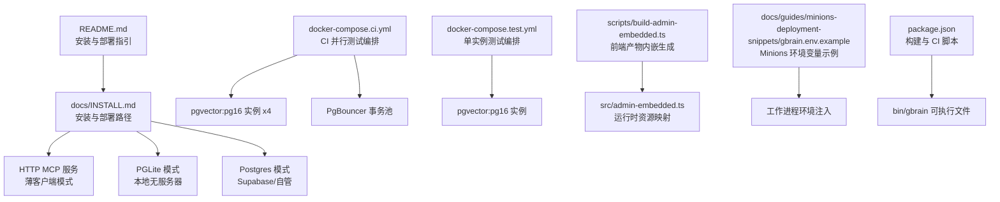
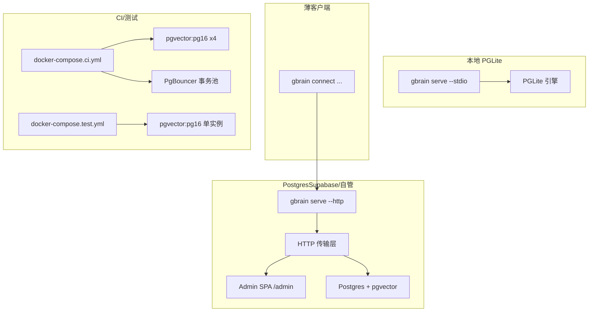
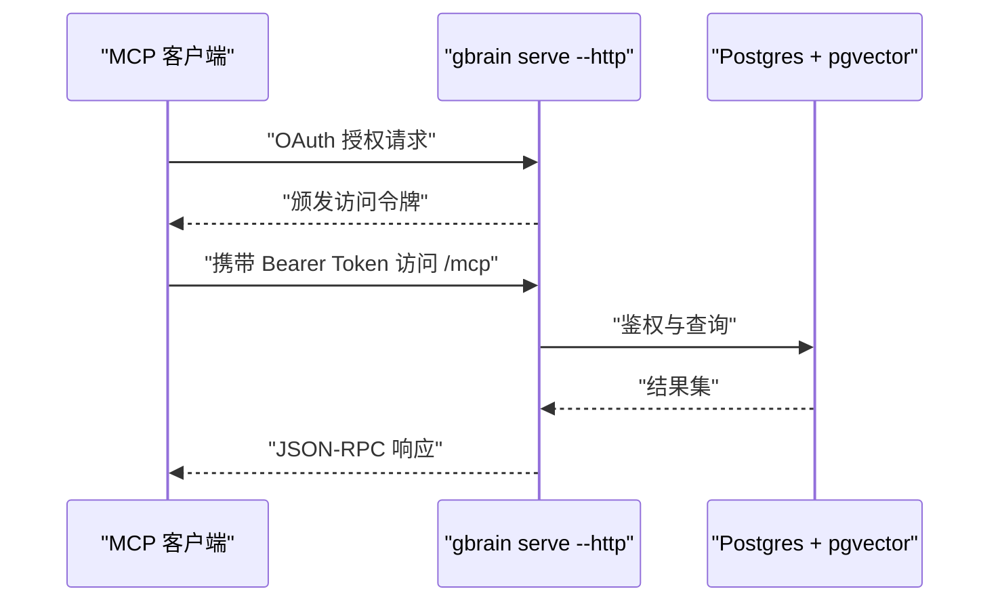
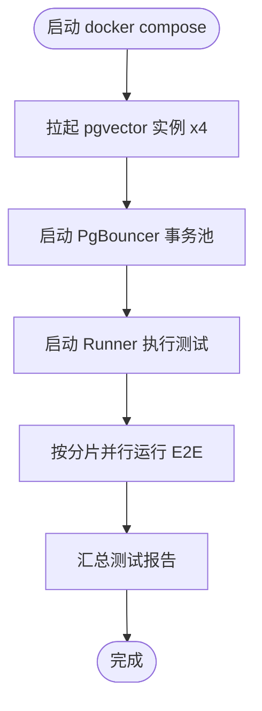
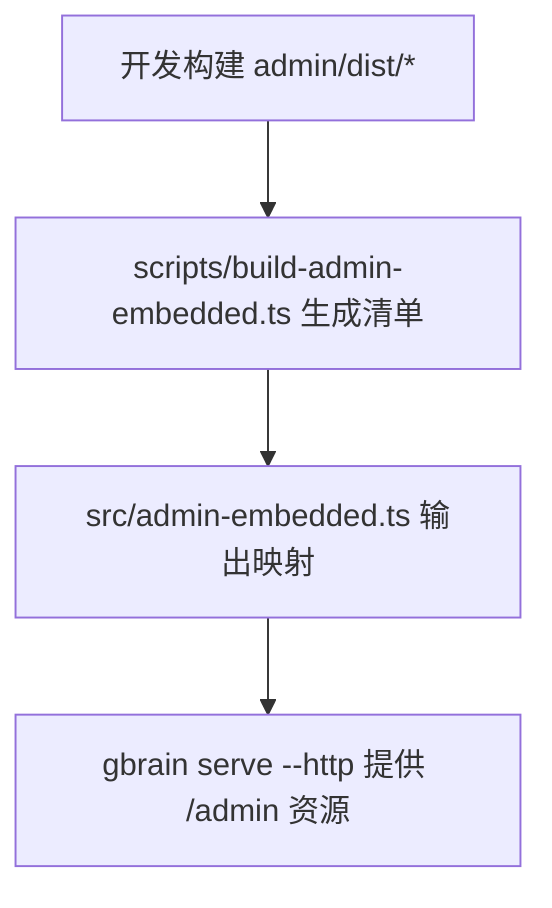
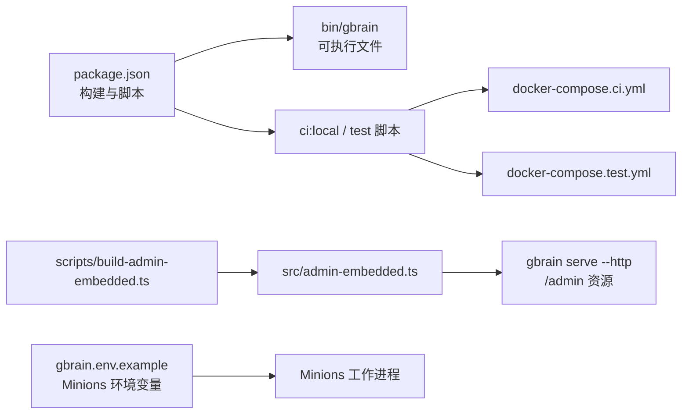

# 部署配置

<cite>
**本文引用的文件**   
- [README.md](file://README.md)
- [docs/INSTALL.md](file://docs/INSTALL.md)
- [docker-compose.ci.yml](file://docker-compose.ci.yml)
- [docker-compose.test.yml](file://docker-compose.test.yml)
- [scripts/build-admin-embedded.ts](file://scripts/build-admin-embedded.ts)
- [src/admin-embedded.ts](file://src/admin-embedded.ts)
- [docs/guides/minions-deployment-snippets/gbrain.env.example](file://docs/guides/minions-deployment-snippets/gbrain.env.example)
- [package.json](file://package.json)
</cite>

## 目录
1. [简介](#简介)
2. [项目结构](#项目结构)
3. [核心组件](#核心组件)
4. [架构总览](#架构总览)
5. [详细组件分析](#详细组件分析)
6. [依赖关系分析](#依赖关系分析)
7. [性能考量](#性能考量)
8. [故障排查指南](#故障排查指南)
9. [结论](#结论)
10. [附录](#附录)

## 简介
本文件面向运维与平台工程团队，系统化阐述 GBrain 的部署配置与最佳实践，覆盖以下主题：
- 不同部署模式：本地 PGLite、Postgres（含 Supabase）、薄客户端模式
- 容器化部署：Docker Compose 示例与 CI/CD 使用方式
- 环境变量与网络设置：数据库连接、代理、池化参数、速率限制等
- 管理界面的构建与嵌入：前端产物打包与运行时资源内嵌
- CI/CD 流水线：本地 CI 门禁、分片并行测试、自动化部署与版本管理
- 负载均衡与高可用：连接池、事务池、多实例扩展策略
- 安全配置：令牌校验、OAuth 注册、访问控制与证书管理

## 项目结构
围绕部署与运维的关键目录与文件：
- docs/INSTALL.md：安装与部署路径总览（含 HTTP MCP、薄客户端）
- docker-compose.ci.yml 与 docker-compose.test.yml：本地 CI 与测试数据库编排
- scripts/build-admin-embedded.ts 与 src/admin-embedded.ts：管理界面前端产物内嵌生成链路
- docs/guides/minions-deployment-snippets/gbrain.env.example：Minions 工作进程环境变量示例
- package.json：构建脚本、二进制输出与 CI 命令入口

**图示来源**
- [README.md:66-129](file://README.md#L66-L129)
- [docs/INSTALL.md:1-114](file://docs/INSTALL.md#L1-L114)
- [docker-compose.ci.yml:1-154](file://docker-compose.ci.yml#L1-L154)
- [docker-compose.test.yml:1-15](file://docker-compose.test.yml#L1-L15)
- [scripts/build-admin-embedded.ts:1-135](file://scripts/build-admin-embedded.ts#L1-L135)
- [src/admin-embedded.ts:1-31](file://src/admin-embedded.ts#L1-L31)
- [docs/guides/minions-deployment-snippets/gbrain.env.example:1-36](file://docs/guides/minions-deployment-snippets/gbrain.env.example#L1-L36)
- [package.json:31-88](file://package.json#L31-L88)

**章节来源**
- [README.md:66-129](file://README.md#L66-L129)
- [docs/INSTALL.md:1-114](file://docs/INSTALL.md#L1-L114)

## 核心组件
- 引擎层（Engine）：PGLite（WASM）与 Postgres 两种实现，统一接口，按需切换
- MCP 传输层：支持 stdio 与 HTTP（含 OAuth 2.1、DCR 客户端注册、范围授权）
- 管理界面（Admin SPA）：内置在可执行文件中，通过 /admin 路由提供
- Minions 作业队列：Postgres 原生队列，支持子代理、审计、超时与并发控制
- 数据库编排：本地测试/CI 使用 pgvector 镜像；生产建议使用 Supabase 或自管 Postgres + pgvector

**章节来源**
- [README.md:280-288](file://README.md#L280-L288)
- [docs/INSTALL.md:66-94](file://docs/INSTALL.md#L66-L94)

## 架构总览
下图展示三种典型部署形态与关键组件交互：

**图示来源**
- [README.md:143-151](file://README.md#L143-L151)
- [docs/INSTALL.md:95-103](file://docs/INSTALL.md#L95-L103)
- [docker-compose.ci.yml:23-154](file://docker-compose.ci.yml#L23-L154)
- [docker-compose.test.yml:1-15](file://docker-compose.test.yml#L1-L15)

## 详细组件分析

### 本地 PGLite 部署
- 特点：零服务器、零配置，适合个人或小规模本地使用
- 启动方式：`gbrain serve`（stdio）或 `gbrain serve --http`（HTTP + Admin SPA）
- 数据持久化：本地文件系统与内存数据库组合，无需外部 DB
- 连接迁移：当知识体量增长时，可通过迁移命令切换到 Postgres

**章节来源**
- [docs/INSTALL.md:22-38](file://docs/INSTALL.md#L22-L38)
- [README.md:18-19](file://README.md#L18-L19)

### Postgres（含 Supabase）部署
- 数据库选择：推荐使用 Supabase（事务池）或自管 Postgres + pgvector
- 连接字符串：通过环境变量 DATABASE_URL 提供；如使用 Supabase 事务池，需在连接串中声明 prepare=false
- HTTP MCP：启用 OAuth 2.1 + DCR 客户端注册、范围授权（read/write/admin）、速率限制
- Admin SPA：内置 /admin 路由，提供活动事件流与管理功能

**图示来源**
- [docs/INSTALL.md:66-94](file://docs/INSTALL.md#L66-L94)
- [README.md:143-151](file://README.md#L143-L151)

**章节来源**
- [docs/INSTALL.md:33-40](file://docs/INSTALL.md#L33-L40)
- [docs/INSTALL.md:66-94](file://docs/INSTALL.md#L66-L94)

### 薄客户端模式
- 适用场景：团队挂载、无本地磁盘空间、仅通过远程 MCP 使用
- 配置：初始化时选择仅 MCP，跳过本地数据库；大部分本地命令会提示改走远程
- 远程连接：通过 `gbrain connect` 获取粘贴块或自动安装，支持 bearer 与 OAuth

**章节来源**
- [docs/INSTALL.md:95-103](file://docs/INSTALL.md#L95-L103)

### Docker 容器化部署
- 本地 CI 编排：使用 docker-compose.ci.yml，启动 4 个 pgvector 实例与 PgBouncer 事务池，Runner 绑定仓库目录并并行执行 E2E 分片
- 测试编排：docker-compose.test.yml 提供单实例 Postgres，便于快速验证
- 端口与健康检查：默认端口可覆盖，PgBouncer 默认暴露 6543 端口用于事务池

**图示来源**
- [docker-compose.ci.yml:1-154](file://docker-compose.ci.yml#L1-L154)
- [docker-compose.test.yml:1-15](file://docker-compose.test.yml#L1-L15)

**章节来源**
- [docker-compose.ci.yml:1-154](file://docker-compose.ci.yml#L1-L154)
- [docker-compose.test.yml:1-15](file://docker-compose.test.yml#L1-L15)

### 管理界面的构建与嵌入
- 构建流程：前端在 admin/ 目录构建后，通过脚本扫描 dist 目录并生成内嵌清单
- 内嵌机制：使用 Bun 的 with { type: 'file' } 导入，确保编译后的二进制仍可定位资源
- 运行时映射：生成 src/admin-embedded.ts，提供请求路径到资源路径与 MIME 的映射，并导出索引页资源

**图示来源**
- [scripts/build-admin-embedded.ts:1-135](file://scripts/build-admin-embedded.ts#L1-L135)
- [src/admin-embedded.ts:1-31](file://src/admin-embedded.ts#L1-L31)

**章节来源**
- [scripts/build-admin-embedded.ts:1-135](file://scripts/build-admin-embedded.ts#L1-L135)
- [src/admin-embedded.ts:1-31](file://src/admin-embedded.ts#L1-L31)

### 环境变量与网络设置
- 数据库连接：DATABASE_URL（建议在 Supabase 事务池场景添加 prepare=false）
- Minions 工作进程：允许 shell 任务需设置 GBRAIN_ALLOW_SHELL_JOBS；可选设置池大小、并发上限等
- OAuth 与令牌：HTTP 服务内置 OAuth 2.1 与 DCR，访问令牌存储于数据库并通过哈希校验
- 速率限制：HTTP 层内置速率限制中间件

**章节来源**
- [docs/guides/minions-deployment-snippets/gbrain.env.example:13-35](file://docs/guides/minions-deployment-snippets/gbrain.env.example#L13-L35)
- [docs/INSTALL.md:42-47](file://docs/INSTALL.md#L42-L47)
- [README.md:143-151](file://README.md#L143-L151)

### CI/CD 流水线与自动化部署
- 本地 CI 门禁：通过 scripts/ci-local.sh 驱动 docker-compose.ci.yml，按分片并行执行 E2E
- 单元与验证：package.json 中定义了 test、verify、ci:local 等脚本，配合 CI 使用
- 自动化发布：package.json 提供发布相关脚本（如 publish:clawhub），结合版本号字段进行版本管理

**章节来源**
- [docker-compose.ci.yml:1-154](file://docker-compose.ci.yml#L1-L154)
- [package.json:31-88](file://package.json#L31-L88)

### 负载均衡与高可用
- 事务池：CI 编排中使用 PgBouncer 事务池模式，缓解连接竞争；生产可参考该模式
- 多实例：通过多个 gbrain serve --http 实例横向扩展，结合反向代理实现负载均衡
- 连接池调优：Minions 环境变量示例中提供池大小与并发上限等可调项

**章节来源**
- [docker-compose.ci.yml:88-121](file://docker-compose.ci.yml#L88-L121)
- [docs/guides/minions-deployment-snippets/gbrain.env.example:30-35](file://docs/guides/minions-deployment-snippets/gbrain.env.example#L30-L35)

### 安全配置、证书管理与访问控制
- OAuth 与 DCR：HTTP 服务支持 OAuth 2.1 + DCR 客户端注册，按 scope 控制 read/write/admin 权限
- 令牌校验：基于哈希的访问令牌表，支持撤销与最后使用时间更新
- 速率限制：内置速率限制中间件，降低滥用风险
- 证书与代理：HTTP 服务支持信任代理设置，结合反向代理部署时注意 X-Forwarded-* 头处理

**章节来源**
- [README.md:143-151](file://README.md#L143-L151)
- [src/mcp/http-transport.ts:188-213](file://src/mcp/http-transport.ts#L188-L213)

## 依赖关系分析

**图示来源**
- [package.json:31-88](file://package.json#L31-L88)
- [docker-compose.ci.yml:1-154](file://docker-compose.ci.yml#L1-L154)
- [docker-compose.test.yml:1-15](file://docker-compose.test.yml#L1-L15)
- [scripts/build-admin-embedded.ts:1-135](file://scripts/build-admin-embedded.ts#L1-L135)
- [src/admin-embedded.ts:1-31](file://src/admin-embedded.ts#L1-L31)
- [docs/guides/minions-deployment-snippets/gbrain.env.example:1-36](file://docs/guides/minions-deployment-snippets/gbrain.env.example#L1-L36)

**章节来源**
- [package.json:31-88](file://package.json#L31-L88)

## 性能考量
- 连接池与事务池：在高并发场景下，建议使用事务池（如 PgBouncer）以减少连接开销
- 并发与超时：Minions 支持超时与重试策略，合理设置可避免长尾阻塞
- 查询与检索：混合检索（向量 + 关键词 + RRF + 重排序）在大规模数据下需关注索引与缓存命中率
- 构建与内嵌：前端资源内嵌可减少静态文件查找成本，提升首次访问速度

## 故障排查指南
- 初始化与模型检测：若出现维度不匹配问题，先运行健康检查并按提示修复；在 CI/Docker 环境中可使用非交互方式初始化
- Cron 同步超时：对联邦大脑建议采用 per-source 循环并设置超时，利用部分进度与锁清理策略
- 批量写入重试：在 Supabase 场景下，批量写入具备自愈重试逻辑；可通过环境变量调整重试次数与退避
- 数据库断连：引擎层具备断连自愈回调；可通过审计日志定位断连来源并优化连接生命周期

**章节来源**
- [README.md:290-354](file://README.md#L290-L354)

## 结论
GBrain 提供从个人本地到企业级共享部署的完整路径。通过清晰的引擎抽象、MCP 传输层与 Admin SPA 内嵌机制，可在不同规模与复杂度的环境中稳定运行。结合 PgBouncer 事务池、严格的访问控制与完善的 CI/CD 流水线，可实现高可用、可扩展且安全的部署方案。

## 附录
- 快速对照
  - 本地 PGLite：`gbrain serve` 或 `gbrain serve --http`
  - Postgres：设置 DATABASE_URL（Supabase 事务池需 prepare=false），`gbrain serve --http`
  - 薄客户端：`gbrain init --mcp-only`，随后 `gbrain connect`
  - 管理界面：构建后自动内嵌，访问 `/admin`
  - CI/测试：使用 docker-compose.ci.yml 与 docker-compose.test.yml
  - Minions：参考 gbrain.env.example 设置环境变量