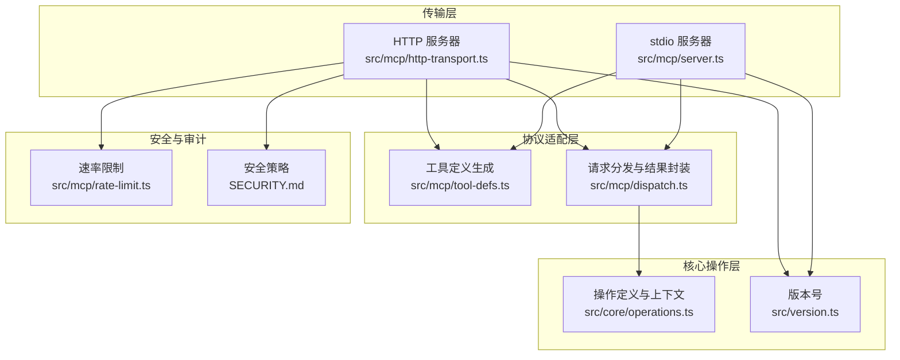
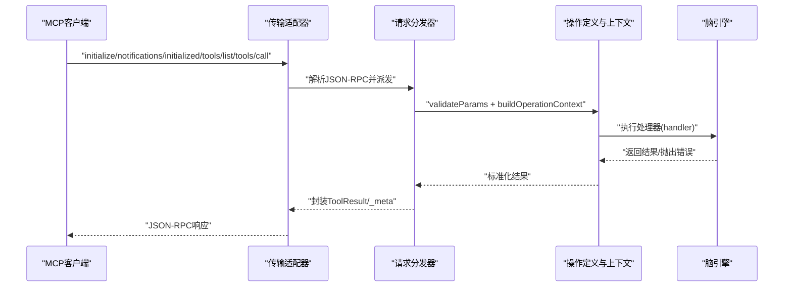
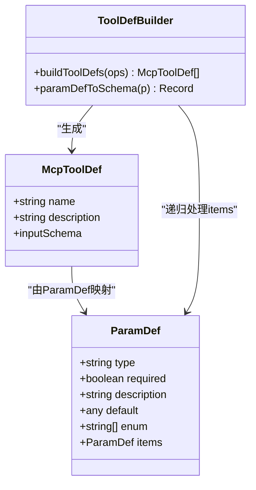
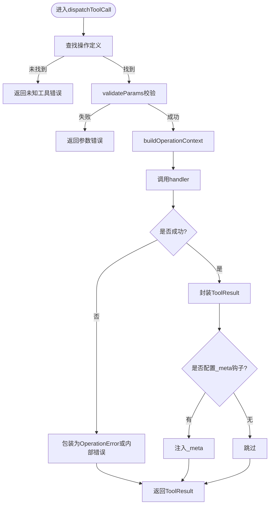
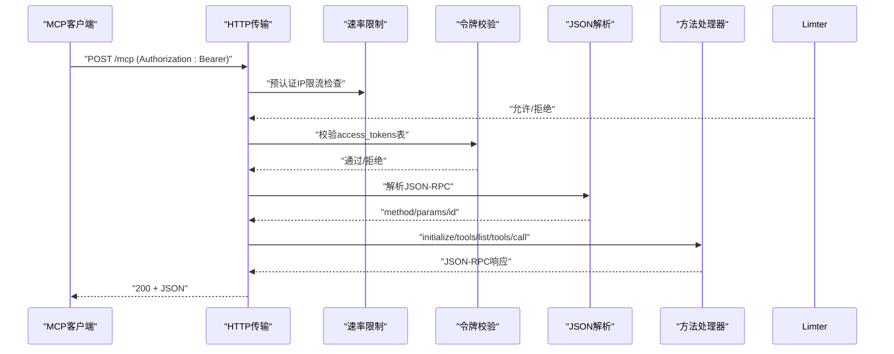
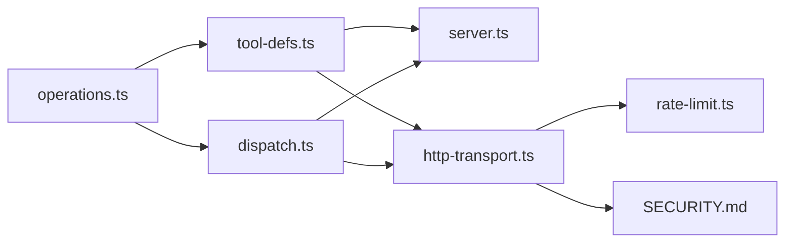

# MCP协议规范

<cite>
**本文档引用的文件**
- [src/mcp/tool-defs.ts](file://src/mcp/tool-defs.ts)
- [src/mcp/server.ts](file://src/mcp/server.ts)
- [src/mcp/http-transport.ts](file://src/mcp/http-transport.ts)
- [src/mcp/dispatch.ts](file://src/mcp/dispatch.ts)
- [src/mcp/rate-limit.ts](file://src/mcp/rate-limit.ts)
- [src/core/operations.ts](file://src/core/operations.ts)
- [src/version.ts](file://src/version.ts)
- [SECURITY.md](file://SECURITY.md)
- [docs/mcp/ALTERNATIVES.md](file://docs/mcp/ALTERNATIVES.md)
- [test/e2e/mcp.test.ts](file://test/e2e/mcp.test.ts)
- [test/mcp-tool-defs.test.ts](file://test/mcp-tool-defs.test.ts)
- [test/e2e/http-transport.test.ts](file://test/e2e/http-transport.test.ts)
- [src/core/remote-mcp-probe.ts](file://src/core/remote-mcp-probe.ts)
</cite>

## 目录
1. [简介](#简介)
2. [项目结构](#项目结构)
3. [核心组件](#核心组件)
4. [架构总览](#架构总览)
5. [详细组件分析](#详细组件分析)
6. [依赖关系分析](#依赖关系分析)
7. [性能考量](#性能考量)
8. [故障排查指南](#故障排查指南)
9. [结论](#结论)
10. [附录](#附录)

## 简介
本文件系统化阐述MCP（Model Context Protocol）在本项目中的实现与使用规范，覆盖工具调用协议、消息格式与传输机制；详细说明MCP工具的定义规范（参数类型、验证规则、返回值格式）；给出标准实现模式与最佳实践；提供消息序列图与交互流程；明确协议版本兼容性与升级策略；并总结安全考虑与访问控制机制。

## 项目结构
围绕MCP的关键模块组织如下：
- 协议适配层：MCP工具定义生成、请求分发与结果封装
- 传输层：stdio（本地管道）与HTTP（Bearer认证）
- 核心操作层：统一的操作定义与执行上下文
- 安全与审计：速率限制、CORS、令牌校验与请求日志
- 文档与测试：协议示例、端到端验证与回归测试

**图表来源**
- [src/mcp/server.ts:18-58](file://src/mcp/server.ts#L18-L58)
- [src/mcp/http-transport.ts:139-420](file://src/mcp/http-transport.ts#L139-L420)
- [src/mcp/tool-defs.ts:40-54](file://src/mcp/tool-defs.ts#L40-L54)
- [src/mcp/dispatch.ts:222-283](file://src/mcp/dispatch.ts#L222-L283)
- [src/core/operations.ts:589-619](file://src/core/operations.ts#L589-L619)
- [src/version.ts:1-3](file://src/version.ts#L1-L3)
- [src/mcp/rate-limit.ts:46-142](file://src/mcp/rate-limit.ts#L46-L142)
- [SECURITY.md:102-261](file://SECURITY.md#L102-L261)

**章节来源**
- [src/mcp/server.ts:18-123](file://src/mcp/server.ts#L18-L123)
- [src/mcp/http-transport.ts:139-420](file://src/mcp/http-transport.ts#L139-L420)
- [src/mcp/tool-defs.ts:40-54](file://src/mcp/tool-defs.ts#L40-L54)
- [src/mcp/dispatch.ts:222-283](file://src/mcp/dispatch.ts#L222-L283)
- [src/core/operations.ts:589-619](file://src/core/operations.ts#L589-L619)
- [src/version.ts:1-3](file://src/version.ts#L1-L3)
- [SECURITY.md:102-261](file://SECURITY.md#L102-L261)

## 核心组件
- 工具定义生成器：将操作定义映射为MCP工具清单，确保输入Schema与必填项准确无误，并对数组参数强制要求items字段以满足严格模式验证器需求。
- 请求分发器：统一处理工具调用，进行参数校验、构建操作上下文、调用处理器、格式化结果，并注入元数据（如热记忆）。
- 传输适配器：stdio与HTTP两种传输路径共享同一分发逻辑，保证行为一致性。
- 操作定义与上下文：集中定义参数类型、范围权限、本地专用等约束，提供统一的执行环境。
- 安全与审计：HTTP传输内置速率限制、CORS白名单、令牌哈希校验与请求日志记录。

**章节来源**
- [src/mcp/tool-defs.ts:13-54](file://src/mcp/tool-defs.ts#L13-L54)
- [src/mcp/dispatch.ts:14-73](file://src/mcp/dispatch.ts#L14-L73)
- [src/mcp/http-transport.ts:188-403](file://src/mcp/http-transport.ts#L188-L403)
- [src/core/operations.ts:216-394](file://src/core/operations.ts#L216-L394)

## 架构总览
MCP协议在本项目中通过两套传输实现：
- stdio：本地进程间通信，适合桌面客户端或本地代理；默认对远程调用施加可见性限制与源隔离。
- HTTP：内置Bearer认证的HTTP服务，面向远程部署与多客户端接入；具备CORS、速率限制、请求体大小限制与审计日志。

**图表来源**
- [src/mcp/http-transport.ts:344-396](file://src/mcp/http-transport.ts#L344-L396)
- [src/mcp/server.ts:36-55](file://src/mcp/server.ts#L36-L55)
- [src/mcp/dispatch.ts:222-283](file://src/mcp/dispatch.ts#L222-L283)
- [src/core/operations.ts:589-619](file://src/core/operations.ts#L589-L619)

## 详细组件分析

### 工具定义规范与生成
- 输入Schema映射：将操作参数定义转换为JSON Schema对象，递归处理数组items，确保严格模式验证器可识别。
- 必填字段：基于required标记生成required数组。
- 结果：每个工具包含name、description与inputSchema三要素，inputSchema为object类型，properties与required均非空。

**图表来源**
- [src/mcp/tool-defs.ts:3-54](file://src/mcp/tool-defs.ts#L3-L54)

**章节来源**
- [src/mcp/tool-defs.ts:13-54](file://src/mcp/tool-defs.ts#L13-L54)
- [test/mcp-tool-defs.test.ts:62-91](file://test/mcp-tool-defs.test.ts#L62-L91)

### 参数验证与返回值格式
- 参数验证：逐项检查必填、类型匹配；不合法时返回结构化错误。
- 返回值格式：统一为ToolResult，包含content（文本数组）、可选isError标志与_meta元数据。
- 错误处理：区分OperationError与内部异常，均以JSON字符串形式返回，便于解析。

**图表来源**
- [src/mcp/dispatch.ts:170-283](file://src/mcp/dispatch.ts#L170-L283)

**章节来源**
- [src/mcp/dispatch.ts:14-73](file://src/mcp/dispatch.ts#L14-L73)
- [src/mcp/dispatch.ts:170-283](file://src/mcp/dispatch.ts#L170-L283)

### 传输机制与消息格式
- 初始化与通知：支持initialize与notifications/initialized方法，用于握手与确认。
- 工具列表：tools/list返回工具清单，与操作定义保持一致。
- 工具调用：tools/call携带name与arguments，返回ToolResult。
- HTTP特性：Bearer认证、CORS白名单、速率限制、请求体大小限制、审计日志。

**图表来源**
- [src/mcp/http-transport.ts:283-403](file://src/mcp/http-transport.ts#L283-L403)

**章节来源**
- [src/mcp/http-transport.ts:188-403](file://src/mcp/http-transport.ts#L188-L403)

### 访问控制与安全
- 令牌管理：仅存储SHA-256哈希，支持创建、列出、吊销；HTTP传输默认禁止开放OAuth注册。
- CORS：默认拒绝，需显式配置允许列表；v0.41.3起统一门控所有OAuth端点。
- 速率限制：双桶模型（IP桶与令牌桶），带LRU与TTL清理，防止滥用。
- 请求审计：每条请求写入mcp_request_log，含状态、耗时与去敏参数摘要。
- 可信边界：remote=true时应用holder过滤、源隔离与可见性裁剪；本地CLI默认放宽信任。

**章节来源**
- [SECURITY.md:9-261](file://SECURITY.md#L9-L261)
- [src/mcp/http-transport.ts:188-242](file://src/mcp/http-transport.ts#L188-L242)
- [src/mcp/rate-limit.ts:46-142](file://src/mcp/rate-limit.ts#L46-L142)
- [src/core/operations.ts:396-449](file://src/core/operations.ts#L396-L449)

### 协议版本兼容性与升级策略
- 协议版本：HTTP传输在initialize响应中声明protocolVersion，当前示例值为固定日期格式字符串。
- 版本演进：通过新增capabilities字段与方法扩展能力；客户端应向后兼容旧版本，服务端可按能力探测提供功能。
- 迁移建议：新版本引入的字段（如_meta、federated_read）应保持默认安全行为，避免破坏现有客户端。

**章节来源**
- [src/mcp/http-transport.ts:344-357](file://src/mcp/http-transport.ts#L344-L357)
- [src/core/operations.ts:231-275](file://src/core/operations.ts#L231-L275)

### 标准实现模式与最佳实践
- 统一入口：stdio与HTTP共享dispatchToolCall，确保行为一致。
- 参数契约：严格遵循ParamDef定义，数组参数必须声明items；必填参数在inputSchema.required中标注。
- 错误处理：始终返回JSON可解析的错误结构，便于客户端解析。
- 元数据注入：通过metaHook在成功时注入_server-supplied元数据，增强客户端体验。
- 部署建议：优先使用内置HTTP传输配合ngrok/Tailscale等隧道；避免开放OAuth注册。

**章节来源**
- [src/mcp/dispatch.ts:222-283](file://src/mcp/dispatch.ts#L222-L283)
- [src/mcp/tool-defs.ts:13-38](file://src/mcp/tool-defs.ts#L13-L38)
- [docs/mcp/ALTERNATIVES.md:1-68](file://docs/mcp/ALTERNATIVES.md#L1-L68)

## 依赖关系分析
- 低耦合高内聚：传输层仅负责协议编解码与路由，核心业务逻辑集中在operations与dispatch。
- 单一真相源：工具定义生成与参数Schema映射集中于tool-defs，避免多处漂移。
- 可观测性：HTTP传输记录mcp_request_log，结合速率限制与CORS，形成完整的安全可观测闭环。

**图表来源**
- [src/core/operations.ts:589-619](file://src/core/operations.ts#L589-L619)
- [src/mcp/tool-defs.ts:40-54](file://src/mcp/tool-defs.ts#L40-L54)
- [src/mcp/dispatch.ts:222-283](file://src/mcp/dispatch.ts#L222-L283)
- [src/mcp/server.ts:27-29](file://src/mcp/server.ts#L27-L29)
- [src/mcp/http-transport.ts:151-151](file://src/mcp/http-transport.ts#L151-L151)
- [src/mcp/rate-limit.ts:135-142](file://src/mcp/rate-limit.ts#L135-L142)
- [SECURITY.md:102-261](file://SECURITY.md#L102-L261)

**章节来源**
- [src/core/operations.ts:589-619](file://src/core/operations.ts#L589-L619)
- [src/mcp/tool-defs.ts:40-54](file://src/mcp/tool-defs.ts#L40-L54)
- [src/mcp/dispatch.ts:222-283](file://src/mcp/dispatch.ts#L222-L283)
- [src/mcp/server.ts:27-29](file://src/mcp/server.ts#L27-L29)
- [src/mcp/http-transport.ts:151-151](file://src/mcp/http-transport.ts#L151-L151)
- [src/mcp/rate-limit.ts:135-142](file://src/mcp/rate-limit.ts#L135-L142)
- [SECURITY.md:102-261](file://SECURITY.md#L102-L261)

## 性能考量
- 速率限制：双桶模型兼顾防暴力破解与防滥用，建议根据部署规模调整默认阈值。
- 请求体限制：默认1MiB，避免内存膨胀；对大负载场景可适当上调。
- 日志开销：审计日志fire-and-forget，不影响主请求路径。
- 连接复用：HTTP传输采用Bun原生服务，减少额外开销。

[本节为通用指导，无需特定文件引用]

## 故障排查指南
- 401/403认证失败：检查Authorization头与access_tokens哈希是否匹配；确认未启用开放OAuth注册。
- 429速率限制：查看Retry-After头部；评估IP桶与令牌桶配置是否合理。
- 413请求体过大：调整GBRAIN_HTTP_MAX_BODY_BYTES；优化客户端载荷。
- CORS被阻止：确认Origin在GBRAIN_HTTP_CORS_ORIGIN白名单中。
- 初始化握手问题：核对protocolVersion与capabilities；参考端到端测试用例。

**章节来源**
- [test/e2e/http-transport.test.ts:90-109](file://test/e2e/http-transport.test.ts#L90-L109)
- [src/mcp/http-transport.ts:283-403](file://src/mcp/http-transport.ts#L283-L403)
- [SECURITY.md:102-261](file://SECURITY.md#L102-L261)

## 结论
本项目的MCP实现以“单一真相源”和“统一分发”为核心设计原则，通过严格的参数Schema、一致的错误格式与完备的安全机制，确保跨传输的一致性与安全性。建议在生产环境中优先采用内置HTTP传输与受控隧道方案，并结合速率限制与CORS白名单强化访问控制。

[本节为总结性内容，无需特定文件引用]

## 附录

### MCP工具定义规范要点
- 参数类型：string、number、boolean、object、array；数组必须声明items。
- 必填字段：required=true时纳入inputSchema.required。
- 枚举与默认值：enum与default可选，映射至JSON Schema对应字段。
- 嵌套数组：递归展开items，确保严格模式验证器识别。

**章节来源**
- [src/mcp/tool-defs.ts:13-38](file://src/mcp/tool-defs.ts#L13-L38)
- [test/mcp-tool-defs.test.ts:137-186](file://test/mcp-tool-defs.test.ts#L137-L186)

### 端到端验证与回归测试
- 工具清单生成：验证tools/list输出与operations定义一致。
- 参数Schema回归：确保paramDefToSchema输出字节级稳定。
- HTTP传输连通性：tools/call往返测试与健康检查。

**章节来源**
- [test/e2e/mcp.test.ts:16-67](file://test/e2e/mcp.test.ts#L16-L67)
- [test/mcp-tool-defs.test.ts:62-91](file://test/mcp-tool-defs.test.ts#L62-L91)
- [test/e2e/http-transport.test.ts:90-109](file://test/e2e/http-transport.test.ts#L90-L109)

### 部署与隧道选项
- 推荐使用内置HTTP传输配合ngrok或Tailscale Funnel；Fly.io/Railway适合长期运行。
- 严禁开放OAuth注册，避免攻击者自注册获取无限权限。

**章节来源**
- [docs/mcp/ALTERNATIVES.md:1-68](file://docs/mcp/ALTERNATIVES.md#L1-L68)
- [SECURITY.md:13-51](file://SECURITY.md#L13-L51)